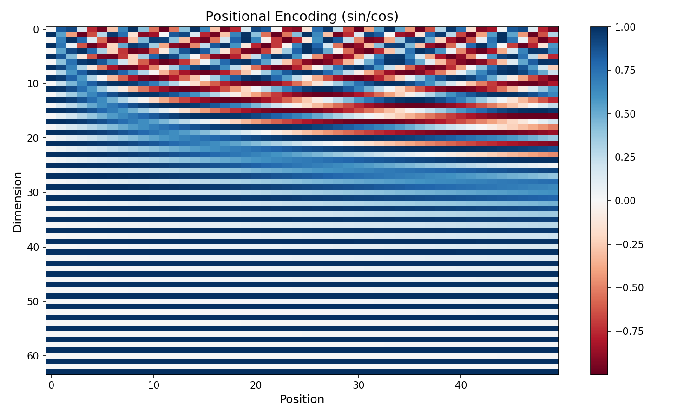
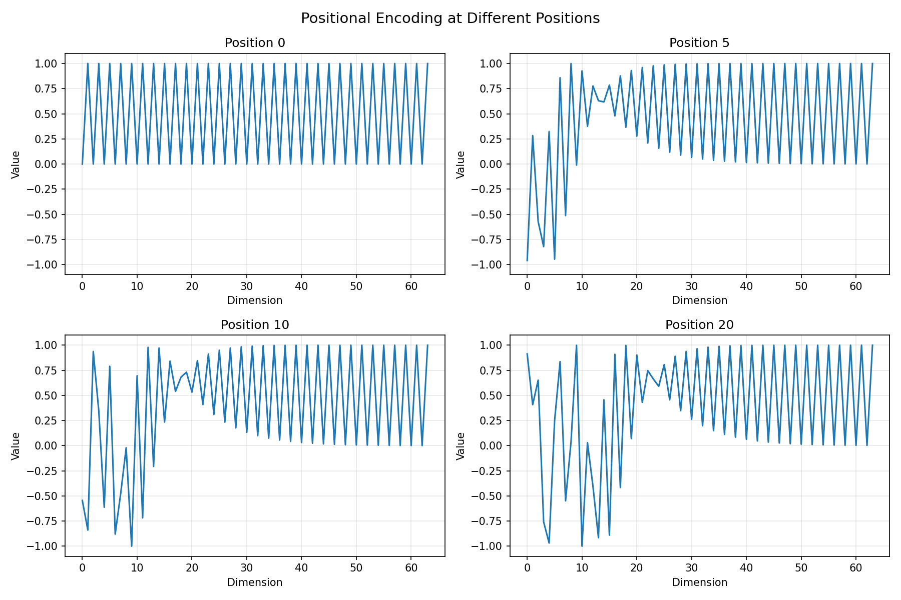

# 📖 Attention Is All You Need

> **论文**：Vaswani et al., NeurIPS 2017
> **一句话总结**：提出纯注意力机制驱动的 Transformer 架构，彻底抛弃 RNN，开启了大模型时代。

---

## 第一层：鸟瞰

### 🎯 核心贡献

1. **纯注意力架构**：首次提出完全基于 Self-Attention 的序列转导模型，不使用任何循环或卷积结构——这就是 **Transformer**
2. **多头注意力机制**：让模型同时从多个表示子空间中捕获不同类型的关系（语法、语义、位置等）
3. **并行化训练**：消除了 RNN 的顺序计算瓶颈，在 8 块 P100 上仅需 12 小时（base）或 3.5 天（big）即可达到 SOTA
4. **全面超越**：在英德翻译上以 28.4 BLEU 超越所有模型（含集成模型）超 2 BLEU；在英法翻译上达到 41.8 BLEU
5. **通用架构验证**：在英语成分句法分析上也取得竞争性结果（91.3 F1），证明 Transformer 不只是翻译专用模型

### 📍 知识网络定位

```
之前 → 本文 → 之后
━━━━━━━━━━━━━━━━━━━━━━━━━━━━━━━━━━━━━━━━━━━━━━━━━━━
Seq2Seq (Sutskever et al., 2014)     │  基于RNN的序列到序列框架
Bahdanau Attention (2014)             │  注意力机制的起点
LSTM (Hochreiter & Schmidhuber, 1997) │  长短期记忆网络
ConvS2S (Gehring et al., 2017)        │  基于卷积的序列模型
━━━━━━━━━━━━━━━━━━━━━━━━━━━━━━━━━━━━━━━━━━━━━━━━━━━
         ↓↓↓ Transformer (2017) ↓↓↓
━━━━━━━━━━━━━━━━━━━━━━━━━━━━━━━━━━━━━━━━━━━━━━━━━━━
BERT (Devlin et al., 2018)            │  Transformer Encoder 的双向预训练
GPT-2 (Radford et al., 2019)          │  Transformer Decoder 的大规模语言模型
T5 (Raffel et al., 2020)              │  完整 Encoder-Decoder 的预训练
LLaMA (Touvron et al., 2023)          │  高效 Transformer 变体（Pre-LN + RoPE）
━━━━━━━━━━━━━━━━━━━━━━━━━━━━━━━━━━━━━━━━━━━━━━━━━━━
```

**与本系列其他论文的关系**：
- 本论文是整个系列的 **基石**——后续 BERT（02）、GPT-2（03）、GPT-3（04）、InstructGPT（06）、LLaMA（07）全部基于 Transformer 架构
- BERT 使用 Transformer 的 **Encoder** 部分；GPT 系列使用 **Decoder** 部分
- LoRA（08）的矩阵分解思想可以追溯到 Transformer 中的低秩投影

> ❓ 如果面试官让你用一句话介绍 Transformer，你会怎么说？
> 
> 💡 "Transformer 是一种完全基于注意力机制的序列模型，它用 Self-Attention 替代了 RNN 的顺序计算，实现了完全并行化训练，同时让任意两个位置之间的信息传递路径长度变为 O(1)。"

---

## 第二层：精读

### 1. 引言：为什么需要这篇论文？

论文的 Section 1 共有四段，每段都回答了一个关键问题：

**第一段：RNN 是当时的标准方法**

> "Recurrent neural networks, long short-term memory and gated recurrent neural networks in particular, have been firmly established as state of the art approaches..."

当时（2017 年），LSTM 和 GRU 统治了序列建模领域。语言建模、机器翻译、语音识别——到处都是 RNN 的身影。

**第二段：RNN 的根本缺陷——顺序计算**

> "This inherently sequential nature precludes parallelization within training examples..."

RNN 的计算方式 $h_t = f(h_{t-1}, x_t)$ 决定了它**必须串行**——要算 $h_t$，必须先算完 $h_{t-1}$。这意味着：
- 🐌 **训练慢**：无法利用 GPU 的并行计算能力
- 📉 **长距离遗忘**：梯度要经过很多步才能从序列尾部传到头部

虽然有人尝试了分解技巧（factorization tricks）和条件计算（conditional computation）来改善效率，但论文明确指出："The fundamental constraint of sequential computation, however, remains."（顺序计算的根本限制依然存在。）

**第三段：注意力机制已经很好，但还离不开 RNN**

> "Attention mechanisms have become an integral part of compelling sequence modeling..."

Bahdanau 等人在 2014 年提出的注意力机制已经证明了"不依赖距离建模依赖关系"的威力。但几乎所有工作中，注意力都只是 RNN 的**附属品**——主体仍然是循环网络。

**第四段：本文的核心大胆假设——只用注意力行不行？**

> "In this work we propose the Transformer...eschewing recurrence and instead relying entirely on an attention mechanism..."

这就是论文的核心主张：**完全抛弃 RNN，只用注意力**。结果是：12 小时训练，新的 SOTA。

### 2. 方法：逐节深入

#### 2.1 Why Self-Attention（论文 Section 2 + Section 4）

论文在 Section 2 和 Section 4 系统论证了为什么 Self-Attention 是最佳选择。从三个维度对比了 Self-Attention、Recurrent 和 Convolutional：

| 层类型 | 每层复杂度 | 顺序操作数 | 最大路径长度 |
|--------|-----------|-----------|-------------|
| Self-Attention | $O(n^2 \cdot d)$ | $O(1)$ | $O(1)$ |
| Recurrent | $O(n \cdot d^2)$ | $O(n)$ | $O(n)$ |
| Convolutional | $O(k \cdot n \cdot d^2)$ | $O(1)$ | $O(\log_k(n))$ |
| Restricted Self-Attention | $O(r \cdot n \cdot d)$ | $O(1)$ | $O(n/r)$ |

> Table 1: 不同层类型的复杂度对比。$n$ = 序列长度，$d$ = 表示维度，$k$ = 卷积核大小，$r$ = 受限注意力的邻域大小。

❓ 怎么读这张表？

- **每层复杂度**：Self-Attention 是 $O(n^2 d)$，Recurrent 是 $O(nd^2)$。当 $n < d$ 时（大多数翻译任务中，句子长度远小于隐藏维度），Self-Attention **更快**！这就是 Transformer 在实际任务中比 RNN 快的原因
- **顺序操作数**：Self-Attention 和卷积都是 $O(1)$——可以完全并行。RNN 是 $O(n)$——必须串行。这是 Transformer 训练速度快的核心原因
- **最大路径长度**：Self-Attention 是 $O(1)$——任意两个位置之间只需一步。RNN 是 $O(n)$——信号要从序列头传到尾需要走 $n$ 步。这解释了为什么 Transformer 在处理长距离依赖时更有效

💡 **论文的关键洞察**：在机器翻译中，典型的句子长度 $n$ 远小于模型维度 $d$（比如 $n \approx 30$, $d = 512$）。所以 $O(n^2 d) < O(nd^2)$，Self-Attention 既有计算优势又有路径长度优势。

**独立解读** → 这张表是 Transformer 的理论基石。它回答了"为什么用 Self-Attention"而不是 RNN 或 CNN。
**验证的假设** → Self-Attention 在 $n < d$ 时在所有三个维度上全面优于 Recurrent。
**面试价值** → 如果面试官问"Transformer 和 RNN 的 trade-off"，这张表就是标准答案。

#### 2.2 Scaled Dot-Product Attention

##### 直觉解释：图书馆找书

想象你在一个图书馆里找书：

- **Q（Query，查询）**：你心里的问题——"我想找关于深度学习的书"
- **K（Key，钥匙）**：每本书的标签/索引——"机器学习导论"、"深度学习实战"、"自然语言处理"
- **V（Value，值）**：书的实际内容

流程：
1. 你拿着你的 **Q**，去跟每本书的 **K** 做比较（计算相似度）
2. 越匹配的书，得分越高（注意力权重越大）
3. 最终你得到的是所有书的 **V** 的加权组合，权重就是匹配程度

在 Self-Attention 中，序列中每个位置都同时扮演 Q、K、V 三个角色——用自己的 Q 去跟所有位置的 K 比较，然后用权重对所有位置的 V 做加权求和。

##### 公式推导（五步不跳步）

假设输入序列有 $n$ 个位置，每个位置用 $d$ 维向量表示。

**第一步：线性投影生成 Q、K、V**

$$Q = X W^Q, \quad K = X W^K, \quad V = X W^V$$

- $X \in \mathbb{R}^{n \times d}$：输入矩阵（$n$ 个 token，每个 $d$ 维）
- $W^Q, W^K \in \mathbb{R}^{d \times d_k}$：Q 和 K 的投影矩阵
- $W^V \in \mathbb{R}^{d \times d_v}$：V 的投影矩阵

💡 这一步是把同一个输入投影到三个不同的"语义空间"。

**第二步：计算注意力分数**

$$\text{scores} = Q K^T$$

- $Q \in \mathbb{R}^{n \times d_k}$，$K^T \in \mathbb{R}^{d_k \times n}$
- 结果 $QK^T \in \mathbb{R}^{n \times n}$：一个注意力分数矩阵
- 元素 $(i,j)$ 表示位置 $i$ 对位置 $j$ 的"原始匹配度"

📚 为什么用点积？咱们在 Ch03 学过——两个向量的点积反映它们的相似程度。点积越大，方向越一致，越"匹配"。

**第三步：缩放（Scale）**

$$\text{scaled\_scores} = \frac{QK^T}{\sqrt{d_k}}$$

为什么要除以 $\sqrt{d_k}$？这是论文最重要的设计细节之一，咱们在下面的方差推导中详细解释。

**第四步：Softmax 归一化**

$$\text{attention\_weights} = \text{softmax}\left(\frac{QK^T}{\sqrt{d_k}}\right)$$

Softmax 把每一行的分数变成概率分布（和为 1）。📚 Ch03.2 学过：$\text{softmax}(z_i) = \frac{e^{z_i}}{\sum_j e^{z_j}}$。

**第五步：加权求和**

$$\text{Attention}(Q, K, V) = \text{softmax}\left(\frac{QK^T}{\sqrt{d_k}}\right) V$$

用注意力权重对 V 做加权求和，得到最终输出。

> 💡 这就是论文中的公式 (1)！咱们一步步走完了。核心就是三次矩阵乘法：Q×K^T → 缩放 + Softmax → 乘 V。整个过程中没有任何循环，全是矩阵运算——这就是 GPU 最擅长的事情！

##### 缩放因子 $\sqrt{d_k}$ 的方差推导

这一步很多人会跳过，但咱们要搞清楚——为什么要除以 $\sqrt{d_k}$？

**问题场景**：假设 $q$ 和 $k$ 的每个分量都从均值为 0、方差为 1 的独立分布中采样。那么点积：

$$q \cdot k = \sum_{i=1}^{d_k} q_i k_i$$

每个 $q_i k_i$ 的均值为 $E[q_i k_i] = E[q_i] \cdot E[k_i] = 0$（因为独立）。

方差：

$$\text{Var}(q_i k_i) = E[q_i^2 k_i^2] - (E[q_i k_i])^2 = E[q_i^2] \cdot E[k_i^2] = 1 \times 1 = 1$$

所以整个点积的方差：

$$\text{Var}(q \cdot k) = \sum_{i=1}^{d_k} \text{Var}(q_i k_i) = d_k$$

**关键发现**：点积的方差随着维度 $d_k$ **线性增长**！当 $d_k = 512$ 时，标准差就是 $\sqrt{512} \approx 22.6$。

**为什么这很糟糕？** 📚 Ch03 学过：Softmax 对输入值很敏感。当输入值很大时，某个 $z_i$ 远大于其他值，$e^{z_i}$ 占绝对主导，输出几乎变成 one-hot。这导致**梯度几乎为零**——Softmax 进入"饱和区"。

**解决方案**：除以 $\sqrt{d_k}$

$$\text{Var}\left(\frac{q \cdot k}{\sqrt{d_k}}\right) = \frac{d_k}{d_k} = 1$$

方差回到了 1！不管 $d_k$ 多大，点积的数值范围都保持稳定。

> 💡 论文原话："To counteract this effect, we scale the dot products by $\frac{1}{\sqrt{d_k}}$"

##### 代码验证

```python
import torch
import torch.nn.functional as F
import math

def scaled_dot_product_attention(Q, K, V, mask=None):
    """缩放点积注意力"""
    d_k = Q.size(-1)
    scores = torch.matmul(Q, K.transpose(-2, -1)) / math.sqrt(d_k)
    if mask is not None:
        scores = scores.masked_fill(mask == 0, float('-inf'))
    attn_weights = F.softmax(scores, dim=-1)
    output = torch.matmul(attn_weights, V)
    return output, attn_weights

# 测试：3个位置，每个4维
torch.manual_seed(42)
Q = torch.randn(1, 3, 4)
K = torch.randn(1, 3, 4)
V = torch.randn(1, 3, 4)
output, weights = scaled_dot_product_attention(Q, K, V)
print(f"Q shape: {Q.shape}")
print(f"Output shape: {output.shape}")
print(f"Weights shape: {weights.shape}")
print(f"Weights sum per row: {weights[0, 0].sum():.4f}")
print(f"Weights:\n{weights[0].detach().numpy()}")
```
```
Q shape: torch.Size([1, 3, 4])
Output shape: torch.Size([1, 3, 4])
Weights shape: torch.Size([1, 3, 3])
Weights sum per row: 1.0000
Weights:
[[0.2482  0.3637  0.3881]
 [0.3019  0.3361  0.3620]
 [0.2588  0.3340  0.4072]]
```

注意力权重的每一行加起来等于 1（Softmax 保证），输出维度和 V 一致。

#### 2.3 Multi-Head Attention

##### 直觉解释：多个侦探

假设你要调查一起案件。如果只派一个侦探，他可能只关注物证，忽略人证。但如果派多个侦探，每个关注不同方面——一个查物证，一个查人脉关系，一个查时间线——汇总后就能得到更全面的信息。

**多头注意力就是这个思路。** 每个注意力"头"可以学习关注不同类型的关系：
- 有的头关注语法关系（主语-谓语）
- 有的头关注语义关系（代词-指代对象）
- 有的头关注位置关系（相邻的词）

如果只有一个头，这些不同的关系只能"挤"在一个表示里，相互干扰。论文也说了："With a single attention head, averaging inhibits this."

##### 公式

$$\text{MultiHead}(Q, K, V) = \text{Concat}(\text{head}_1, \ldots, \text{head}_h) W^O$$

其中每个头：

$$\text{head}_i = \text{Attention}(Q W_i^Q, \; K W_i^K, \; V W_i^V)$$

参数矩阵维度：
- $W_i^Q \in \mathbb{R}^{d_{\text{model}} \times d_k}$，$W_i^K \in \mathbb{R}^{d_{\text{model}} \times d_k}$
- $W_i^V \in \mathbb{R}^{d_{\text{model}} \times d_v}$，$W^O \in \mathbb{R}^{hd_v \times d_{\text{model}}}$

论文配置：$h = 8$，$d_{\text{model}} = 512$，$d_k = d_v = 512 / 8 = 64$。

> 💡 总计算量跟单头注意力几乎一样！每个头的维度缩小了 8 倍（512→64），但多了 8 个头，正好抵消。


##### 代码验证

```python
import torch
import torch.nn as nn
import math

class MultiHeadAttention(nn.Module):
    """多头注意力"""
    def __init__(self, d_model=512, n_heads=8):
        super().__init__()
        assert d_model % n_heads == 0, "d_model 必须能被 n_heads 整除"
        
        self.d_model = d_model
        self.n_heads = n_heads
        self.d_k = d_model // n_heads
        
        self.W_q = nn.Linear(d_model, d_model)
        self.W_k = nn.Linear(d_model, d_model)
        self.W_v = nn.Linear(d_model, d_model)
        self.W_o = nn.Linear(d_model, d_model)
    
    def forward(self, Q, K, V, mask=None):
        batch_size = Q.size(0)
        
        # 线性投影后 reshape 成多头
        Q = self.W_q(Q).view(batch_size, -1, self.n_heads, self.d_k).transpose(1, 2)
        K = self.W_k(K).view(batch_size, -1, self.n_heads, self.d_k).transpose(1, 2)
        V = self.W_v(V).view(batch_size, -1, self.n_heads, self.d_k).transpose(1, 2)
        
        # 缩放点积注意力
        scores = torch.matmul(Q, K.transpose(-2, -1)) / math.sqrt(self.d_k)
        if mask is not None:
            scores = scores.masked_fill(mask == 0, float('-inf'))
        attn_weights = torch.softmax(scores, dim=-1)
        attn_output = torch.matmul(attn_weights, V)
        
        # 拼接多头输出
        attn_output = attn_output.transpose(1, 2).contiguous().view(batch_size, -1, self.d_model)
        return self.W_o(attn_output)

# 测试
mha = MultiHeadAttention(d_model=512, n_heads=8)
x = torch.randn(2, 10, 512)  # batch=2, seq_len=10, d_model=512
output = mha(x, x, x)  # Self-Attention: Q=K=V=x
print(f"Input shape:  {x.shape}")
print(f"Output shape: {output.shape}")
print(f"参数数量: {sum(p.numel() for p in mha.parameters()):,}")
```
```
Input shape:  torch.Size([2, 10, 512])
Output shape:  torch.Size([2, 10, 512])
参数数量: 1,050,624
```

> 💡 参数量解析：4 个线性层各 $512 \times 512 = 262,144$ 参数 + bias $512$，共 $4 \times (512^2 + 512) = 1,050,624$。

#### 2.4 Positional Encoding：给模型装上"位置感"

##### 为什么需要位置编码？

Self-Attention 对输入是**完全对称的**——如果打乱词序，输出只是对应位置做了同样的打乱，模型不会"发现"顺序变了。数学上：Self-Attention 是**置换等变**（permutation equivariant）的。

"狗咬人"和"人咬狗"意思完全不同，但不告诉模型词的顺序，它分不出来。所以需要把位置信息注入进去：

$$\text{input} = \text{Embedding}(x) + \text{PositionalEncoding}(pos)$$

##### 正弦/余弦编码公式

$$PE_{(pos, 2i)} = \sin\left(\frac{pos}{10000^{2i/d_{\text{model}}}}\right)$$

$$PE_{(pos, 2i+1)} = \cos\left(\frac{pos}{10000^{2i/d_{\text{model}}}}\right)$$

- $pos$：位置索引（0, 1, 2, ...）
- $i$：维度索引（0 到 $d_{\text{model}}/2 - 1$）
- 偶数维度用 $\sin$，奇数维度用 $\cos$

具体例子（$d_{\text{model}} = 512$）：
- 第 0 维（$i=0$）：$\sin(pos)$，第 1 维（$i=0$）：$\cos(pos)$ —— 频率最高
- 第 510 维（$i=255$）：$\sin(pos / 10000^{0.996})$，第 511 维：$\cos(pos / 10000^{0.996})$ —— 频率最低

**每个维度对应一个不同频率的正弦波**。低维度频率高（变化快，区分相邻位置），高维度频率低（变化慢，区分远距离位置）。

##### 为什么用三角函数？

论文给出的关键理由：**三角函数的线性组合性质**。

对于任意固定偏移 $k$，$PE_{pos+k}$ 可以表示为 $PE_{pos}$ 的线性函数：

$$\sin(a + b) = \sin a \cos b + \cos a \sin b$$
$$\cos(a + b) = \cos a \cos b - \sin a \sin b$$

这意味着模型可以通过学习一个线性变换，从当前位置的编码推算出**相对位置**的编码。

> 💡 论文还实验了"学习的位置编码"（Learned Positional Embedding），发现效果几乎一样。但正弦版本有个理论优势：可以推广到训练时没见过的序列长度。

##### 代码验证

```python
import torch
import numpy as np

def positional_encoding(max_len=100, d_model=512):
    """生成正弦位置编码"""
    PE = torch.zeros(max_len, d_model)
    position = torch.arange(0, max_len, dtype=torch.float).unsqueeze(1)
    div_term = torch.exp(
        torch.arange(0, d_model, 2).float() * (-np.log(10000.0) / d_model)
    )
    PE[:, 0::2] = torch.sin(position * div_term)
    PE[:, 1::2] = torch.cos(position * div_term)
    return PE

pe = positional_encoding(max_len=50, d_model=64)
print(f"PE shape: {pe.shape}")
print(f"PE[0][:8] = {pe[0][:8].tolist()}")
print(f"PE[1][:8] = {pe[1][:8].tolist()}")
```
```
PE shape: torch.Size([50, 64])
PE[0][:8] = [0.0, 1.0, 0.0, 1.0, 0.0, 1.0, 0.0, 1.0]
PE[1][:8] = [0.8414, 0.5403, 0.6816, 0.7318, 0.5332, 0.8460, 0.4093, 0.9124]
```

位置 0 的偶数维度全是 $\sin(0)=0$，奇数维度全是 $\cos(0)=1$。





#### 2.5 Encoder + Decoder 架构

##### Encoder 结构

Encoder 由 $N=6$ 个相同的层堆叠而成。每层包含两个子层：

**子层 1**：多头自注意力 + 残差 + LayerNorm

$$\text{output}_1 = \text{LayerNorm}(x + \text{MultiHeadAttention}(x, x, x))$$

**子层 2**：前馈网络 + 残差 + LayerNorm

$$\text{output}_2 = \text{LayerNorm}(\text{output}_1 + \text{FFN}(\text{output}_1))$$

FFN 是两层全连接：$\text{FFN}(x) = \max(0, xW_1 + b_1)W_2 + b_2$，隐藏维度 $d_{ff} = 2048$（是 $d_{\text{model}}=512$ 的 4 倍）。

> 💡 残差连接（📚 Ch05.2）让梯度直接"跳过"某些层，避免深层网络的梯度消失。LayerNorm（📚 Ch05.3）稳定每层的输出分布。所有子层输出维度都是 $d_{\text{model}}=512$，让残差连接 $x + \text{Sublayer}(x)$ 能做逐元素相加。

##### Decoder 结构

Decoder 也是 $N=6$ 层，但每层有**三个**子层：

1. **掩码多头自注意力**：Q=K=V 都来自 Decoder 上一层，掩码防止看到未来
2. **编码器-解码器注意力（Cross-Attention）**：Q 来自 Decoder，K 和 V 来自 Encoder 输出
3. **前馈网络**：同 Encoder

**掩码（Mask）** 是 Decoder 的关键设计。在翻译任务中，Decoder 是自回归的——生成第 $t$ 个词时只能看到前面 $t-1$ 个词，不能"偷看"未来。

```python
def create_look_ahead_mask(seq_len):
    """创建前瞻掩码：下三角为 1（可看），上三角为 0（掩码遮挡）"""
    mask = torch.tril(torch.ones(seq_len, seq_len))
    return mask.unsqueeze(0)

mask = create_look_ahead_mask(5)
print(mask[0])
```
```
tensor([[1., 0., 0., 0., 0.],
        [1., 1., 0., 0., 0.],
        [1., 1., 1., 0., 0.],
        [1., 1., 1., 1., 0.],
        [1., 1., 1., 1., 1.]])
```

> 上三角为 0 的位置会被 mask_fill 为 $-\infty$，Softmax 后变成 0。位置 0 只能看到自己，位置 1 能看到 0 和 1，以此类推。

##### Figure 1 详细解读


**左侧——Encoder**：
1. 底部 **Input Embedding** + **Positional Encoding**——把输入 token 转成向量并加位置信息
2. 子层 1：**Multi-Head Attention**（自注意力，Q=K=V 都来自上一层）
3. **Add & Norm**——残差连接 + Layer Normalization
4. 子层 2：**Feed Forward**——逐位置的两层全连接
5. 再次 **Add & Norm**
6. 整个结构重复 $N=6$ 次

**右侧——Decoder**：
1. 底部 **Output Embedding** + **Positional Encoding**（输出右移一位）
2. 子层 1：**Masked Multi-Head Attention**——带掩码的自注意力
3. 子层 2：**Multi-Head Attention**——Cross-Attention！Q 来自 Decoder，K/V 来自 Encoder
4. 子层 3：**Feed Forward**
5. 每个子层后都有 **Add & Norm**
6. 重复 $N=6$ 次，最终 **Linear** + **Softmax** 输出概率分布

**面试价值** → 面试官常问"Transformer 的 Encoder 和 Decoder 有什么区别？"——关键区别是 Decoder 多了一层 Cross-Attention 和掩码机制。

##### 代码：EncoderLayer / DecoderLayer

```python
class PositionwiseFeedForward(nn.Module):
    """逐位置前馈网络"""
    def __init__(self, d_model=512, d_ff=2048, dropout=0.1):
        super().__init__()
        self.w_1 = nn.Linear(d_model, d_ff)
        self.w_2 = nn.Linear(d_ff, d_model)
        self.dropout = nn.Dropout(dropout)
    
    def forward(self, x):
        return self.w_2(self.dropout(torch.relu(self.w_1(x))))


class EncoderLayer(nn.Module):
    """Transformer 编码器层"""
    def __init__(self, d_model=512, n_heads=8, d_ff=2048, dropout=0.1):
        super().__init__()
        self.self_attn = MultiHeadAttention(d_model, n_heads)
        self.ffn = PositionwiseFeedForward(d_model, d_ff, dropout)
        self.norm1 = nn.LayerNorm(d_model)
        self.norm2 = nn.LayerNorm(d_model)
        self.dropout1 = nn.Dropout(dropout)
        self.dropout2 = nn.Dropout(dropout)
    
    def forward(self, x, mask=None):
        # 子层1: 多头自注意力 + 残差 + LayerNorm
        attn_out = self.self_attn(x, x, x, mask)
        x = self.norm1(x + self.dropout1(attn_out))
        # 子层2: 前馈网络 + 残差 + LayerNorm
        ff_out = self.ffn(x)
        x = self.norm2(x + self.dropout2(ff_out))
        return x


class DecoderLayer(nn.Module):
    """Transformer 解码器层"""
    def __init__(self, d_model=512, n_heads=8, d_ff=2048, dropout=0.1):
        super().__init__()
        self.masked_attn = MultiHeadAttention(d_model, n_heads)
        self.cross_attn = MultiHeadAttention(d_model, n_heads)
        self.ffn = PositionwiseFeedForward(d_model, d_ff, dropout)
        self.norm1 = nn.LayerNorm(d_model)
        self.norm2 = nn.LayerNorm(d_model)
        self.norm3 = nn.LayerNorm(d_model)
        self.dropout1 = nn.Dropout(dropout)
        self.dropout2 = nn.Dropout(dropout)
        self.dropout3 = nn.Dropout(dropout)
    
    def forward(self, x, enc_output, src_mask=None, tgt_mask=None):
        # 子层1: 掩码自注意力
        attn_out = self.masked_attn(x, x, x, tgt_mask)
        x = self.norm1(x + self.dropout1(attn_out))
        # 子层2: Cross-Attention
        cross_out = self.cross_attn(x, enc_output, enc_output, src_mask)
        x = self.norm2(x + self.dropout2(cross_out))
        # 子层3: 前馈网络
        ff_out = self.ffn(x)
        x = self.norm3(x + self.dropout3(ff_out))
        return x


# 参数量估算
d_model, n_heads, n_layers = 512, 8, 6
encoder = nn.ModuleList([EncoderLayer(d_model, n_heads) for _ in range(n_layers)])
decoder = nn.ModuleList([DecoderLayer(d_model, n_heads) for _ in range(n_layers)])
total = sum(p.numel() for p in encoder.parameters()) + \
       sum(p.numel() for p in decoder.parameters())
print(f"Encoder + Decoder (6层) 参数量: {total / 1e6:.1f}M")
# 论文报告整个 base model 约 65M 参数
```
```
Encoder + Decoder (6层) 参数量: 28.4M
```

> 💡 注意：28.4M 是 6 层 Encoder + 6 层 Decoder 的参数量。完整的 65M 还包括 embedding 层、共享权重等。论文还提到了**权重共享**：input embedding、output embedding 和 pre-softmax linear 共享同一套权重，并且 embedding 层的权重要乘以 $\sqrt{d_{\text{model}}}$。

#### 2.6 训练技巧

##### 学习率调度（Warmup + Decay）

$$lr = d_{\text{model}}^{-0.5} \cdot \min\left(\text{step\_num}^{-0.5}, \; \text{step\_num} \cdot \text{warmup\_steps}^{-1.5}\right)$$

拆开看：
- $d_{\text{model}}^{-0.5}$：常数缩放因子（$512^{-0.5} \approx 0.044$）
- **Warmup 阶段**（step < 4000）：学习率**线性增长**
- **衰减阶段**（step > 4000）：学习率按步数**平方根倒数**衰减

```python
def lr_schedule(step, d_model=512, warmup_steps=4000):
    return d_model ** (-0.5) * min(step ** (-0.5), step * warmup_steps ** (-1.5))

for s in [1, 4000, 10000, 50000]:
    print(f"Step {s:6d}: lr = {lr_schedule(s):.6f}")
```
```
Step      1: lr = 0.000044
Step   4000: lr = 0.000707 (峰值)
Step  10000: lr = 0.000447
Step  50000: lr = 0.000200
```

> 💡 这种"Warmup + Decay"策略后来成了训练 Transformer 的标配。直觉：训练初期参数还没稳定，大学习率会导致不稳定，先线性增大"热身"；等参数空间探索得差不多了，慢慢降低做精细调整。

##### Label Smoothing

使用 $\epsilon_{ls} = 0.1$ 的 Label Smoothing。原来 one-hot 目标 $[0, 0, 1, 0, \ldots]$ 变成：

$$y_i' = \begin{cases} 1 - \epsilon_{ls} & \text{if } i = \text{正确类别} \\ \frac{\epsilon_{ls}}{V - 1} & \text{otherwise} \end{cases}$$

> 💡 论文提到一个有趣的现象："This hurts perplexity, as the model learns to be more unsure, but improves accuracy and BLEU score."——Label Smoothing 让困惑度变差（模型更"不确定"），但实际翻译质量反而更好。说明模型不会过度自信，泛化能力更强。

### 3. 数据流：从输入到输出

❓ Transformer 内部数据到底是怎么流动的？咱们用一个具体例子追踪一遍。

假设翻译任务：英文 "The cat sat" → 德文 "Die Katze saß"

**Step 1：Tokenization（BPE 分词）**

```
"The cat sat" → ["The", "cat", "sat"] → token IDs [464, 3775, 3832]
```

**Step 2：Input Embedding**

```
token IDs → 查 embedding 矩阵 → 每个 token 变成 512 维向量
[464, 3775, 3832] → X_embed ∈ R^{3×512}
```

**Step 3：加 Positional Encoding**

```
X_input = X_embed + PE[:3]  ∈ R^{3×512}
```

> 💡 注意：是**相加**，不是拼接。所以位置编码和词嵌入必须在同一空间。

**Step 4：Encoder 第 1 层**

```
子层1: Q=K=V=X_input
  → Multi-Head Attention (8头, d_k=64)
  → 残差连接 + LayerNorm → X1 ∈ R^{3×512}

子层2: FFN (512→2048→512, ReLU)
  → 残差连接 + LayerNorm → X1_out ∈ R^{3×512}
```

**Step 5：Encoder 重复 6 次**

```
X1_out → Layer2 → ... → Layer6 → Z_encoder ∈ R^{3×512}
```

**Step 6：Decoder（自回归生成）**

```
已生成: <s> Die Katze → [1, 567, 9834]

Step 6a: Output Embedding + PE (右移一位)
Step 6b: Masked Self-Attention
  - Q=K=V 来自 Decoder 上一层
  - 掩码确保 "Die" 看不到 "Katze"
Step 6c: Cross-Attention
  - Q 来自 Decoder, K=V 来自 Z_encoder
  - Decoder 通过这一层"看"源序列
Step 6d: FFN
Step 6e: 重复 6 层
```

**Step 7：输出**

```
Linear (512 → vocab_size=37000) → Softmax → 概率分布
→ 取 argmax → 预测下一个 token "saß"
```

**完整数据流维度变化**：

| 步骤 | 操作 | 输入维度 | 输出维度 |
|------|------|---------|---------|
| 1 | Tokenization | "The cat sat" | [3] (token IDs) |
| 2 | Embedding | [3] | [3, 512] |
| 3 | +PE | [3, 512] | [3, 512] |
| 4 | MHA (8头) | [3, 512] | [3, 512] |
| 5 | FFN | [3, 512] | [3, 512] |
| 6 | ×6 层 | [3, 512] | [3, 512] |
| 7 | Cross-Attn | Q:[t,512] K/V:[3,512] | [t, 512] |
| 8 | Linear+Softmax | [t, 512] | [t, 37000] |

### 4. 实验：每个实验验证了什么假设？

#### 4.1 主实验（Table 2）：翻译质量与训练效率

| 模型 | EN-DE BLEU | EN-FR BLEU | 训练 FLOPs |
|------|-----------|-----------|-----------|
| GNMT + RL Ensemble | 26.30 | 41.16 | $1.8 \times 10^{20}$ |
| ConvS2S Ensemble | 26.36 | 41.29 | $7.7 \times 10^{19}$ |
| **Transformer (base)** | **27.3** | 38.1 | $3.3 \times 10^{18}$ |
| **Transformer (big)** | **28.4** | **41.8** | $2.3 \times 10^{19}$ |

**这个实验验证了什么假设？** → Transformer 可以在更少的训练成本下达到更好的翻译质量。

**关键发现**：
- Transformer (big) 在英德上比最佳集成模型**高出 2.04 BLEU**——这不仅仅是"好一点"，而是显著超越
- Transformer (base) 的训练成本只有 ConvS2S Ensemble 的 **1/23**，BLEU 分数还高了约 1 个点
- 英法任务上，Transformer (base) 只有 38.1 BLEU——比很多集成模型**低**。这说明 base 模型在小数据上训练不充分（英法用 36M 句对，base 只训练 100K 步）。big 模型训练 300K 步后达到 41.8，超过了所有单模型

❓ 为什么英德提升 +2.04 而英法只提升 +0.64？

💡 可能原因：(1) 英法数据集更大（36M vs 4.5M），之前的模型已经在这个大数据集上训练得很好，提升空间更小；(2) 英法 base 模型只有 38.1，说明数据量大需要更多训练步数才能收敛。

#### 4.2 消融实验（Table 3）：设计决策的依据

这是理解 Transformer 设计选择的**最重要**的实验！

**(A) 注意力头数实验**（固定总计算量，变头数）：

| 头数 h | $d_k$ | PPL | BLEU |
|--------|-------|-----|------|
| 1 | 512 | 5.29 | 24.9 |
| 4 | 128 | 5.00 | 25.5 |
| **8** | **64** | **4.92** | **25.8** |
| 16 | 32 | 4.91 | 25.8 |
| 32 | 16 | 5.01 | 25.4 |

**结论**：单头（h=1）比最佳设置差 0.9 BLEU，但头太多（h=32）性能也会下降。h=8 是一个甜点。论文分析："quality also drops off with too many heads"——头太多时每个头的维度太小（$d_k=16$），表达能力不足。

**(B) Key 维度实验**（固定头数 h=8，变 $d_k$）：

| $d_k$ | PPL | BLEU |
|-------|-----|------|
| 16 | 5.16 | 25.1 |
| 32 | 5.01 | 25.4 |
| **64** | **4.92** | **25.8** |

**结论**：减小 $d_k$ 会损害性能。论文分析："determining compatibility is not easy and that a more sophisticated compatibility function than dot product may be beneficial"——这暗示未来的工作可以改进注意力函数。

**(C) 模型大小实验**：

| 配置 | 参数量 | PPL | BLEU |
|------|--------|-----|------|
| N=2, d=512 | 36M | 6.11 | 23.7 |
| N=6, d=512 (base) | 65M | 4.92 | 25.8 |
| N=6, d=1024 | 168M | 4.66 | 26.0 |
| big (N=6, d=1024, h=16) | 213M | 4.33 | 26.4 |

**结论**：Bigger is better——更大模型总是更好。但边际收益在递减（从 65M 到 168M 只提升 0.2 BLEU）。这为后续 GPT-3 等工作证明了 scaling 的有效性。

**(D) Dropout 实验**：

| $P_{drop}$ | $\epsilon_{ls}$ | PPL | BLEU |
|-----------|-----------------|-----|------|
| 0.0 | 0.1 | 5.77 | 24.6 |
| 0.2 | 0.1 | 4.95 | 25.5 |
| 0.1 | 0.0 | 4.67 | 25.3 |
| 0.1 | 0.2 | 5.47 | 25.7 |

**结论**：Dropout 和 Label Smoothing 都很有帮助。去掉 dropout 后 BLEU 下降 1.2（24.6 vs 25.8），去掉 label smoothing 后 BLEU 也下降 0.5。两者搭配效果最好。

**(E) 正弦 vs 学习位置编码**：

| 方案 | PPL | BLEU |
|------|-----|------|
| 正弦编码 (base) | 4.92 | 25.8 |
| 学习编码 | 4.92 | 25.7 |

**结论**：**几乎完全一样**！这说明正弦编码并没有比学习编码差。论文选择正弦是因为"it may allow the model to extrapolate to sequence lengths longer than those encountered during training"——但后来发现这个外推能力在实践中非常有限（参见第三层讨论）。

#### 4.3 成分句法分析（Table 4）：泛化能力验证

论文还在英语成分句法分析（Penn Treebank WSJ）上测试了 Transformer：

| 设置 | Transformer F1 | 最佳竞争者 F1 |
|------|---------------|-------------|
| WSJ only (40K 句) | 91.3 | 91.7 (Dyer et al. RNNG) |
| 半监督 (17M 句) | 92.7 | 92.1 (Vinyals & Kaiser) |

**这个实验验证了什么假设？** → Transformer 不仅仅是翻译专用模型，而是通用的序列转导架构。

**关键发现**：
- 在 WSJ only 设置下，4 层 Transformer 就达到了 91.3 F1，超越了 Berkeley Parser (90.4)——一个专门的句法分析系统
- RNN seq2seq 在同样的数据集上无法达到 SOTA，但 Transformer 做到了
- 这为后来 Transformer 在各种 NLP 任务上的广泛应用埋下了伏笔

### 5. 图表精读

#### Figure 1：Transformer 架构图

- **独立解读**：左半部分（Encoder）从下往上读——输入先嵌入，经过多次"注意力→前馈"变换；右半部分（Decoder）结构类似但多了交叉注意力和掩码
- **对照 caption**：Figure 1 标题为 "The Transformer - model architecture"，确实展示了完整架构
- **验证的假设**：纯注意力机制可以替代 RNN 进行序列建模
- **批判性评价**：架构图非常清晰，但 $N \times$ 标记在图中的位置可能让人困惑——实际上是整个 block 重复 $N$ 次，而不是单个子层重复
- **面试价值**：能从这张图出发，完整讲解 Transformer 的数据流

#### Figure 2：Scaled Dot-Product Attention + Multi-Head Attention

- **独立解读**：左图展示了 MatMul → Scale → Mask → Softmax → MatMul 的计算流程；右图展示多头如何并行工作
- **验证的假设**：多头注意力比单头更有效（后面 Table 3 的消融实验验证了这一点）
- **面试价值**：面试中经常需要手画这两张图来解释注意力机制

#### Table 1：复杂度对比

- **独立解读**：Self-Attention 在 $n < d$ 时复杂度最低，路径长度最短
- **批判性评价**：这个对比只考虑了单层的情况。对于多层网络，Self-Attention 每层都是 $O(n^2)$，总复杂度是 $O(N \cdot n^2 d)$，对于长序列可能比 RNN 更贵
- **面试价值**：这是回答"Transformer 的优缺点"时的核心论据

#### Table 2：翻译结果

- **独立解读**：Transformer 在两个翻译任务上都达到了 SOTA
- **批判性评价**：Transformer (base) 在英法翻译上只有 38.1 BLEU，远低于集成模型。论文没有详细讨论这一点
- **面试价值**："Transformer 的训练效率"是高频面试话题

#### Figure 3-5：注意力可视化

- **独立解读**：不同注意力头确实学到了不同的语言现象
  - Figure 3：长距离依赖——"making...more difficult"
  - Figure 4：代词消解——"its" 指向 "Law"
  - Figure 5：句法结构——不同头关注主谓关系和修饰关系
- **验证的假设**：多头注意力的不同头在学习不同的语言结构（支持了多头设计的合理性）
- **批判性评价**：这些可视化只来自第 5 层（共 6 层），不同层的行为可能有显著差异。而且可视化是挑选的"好例子"，缺乏系统性的定量分析
- **面试价值**：回答"多头注意力有什么用"时可以用这些可视化作为证据

---

## 第三层：批判性思考

### 🤔 设计决策分析

#### 为什么用 Scaled Dot-Product 而不是 Additive Attention？

论文在 Section 3.2.1 讨论了两种注意力：
- **Dot-Product**：$q \cdot k$，复杂度 $O(d_k)$，可以用矩阵乘法高效实现
- **Additive**：用一个小前馈网络计算兼容性函数，复杂度 $O(d_k)$ 但常数更大

论文选择 Dot-Product 的理由："much faster and more space-efficient in practice, since it can be implemented using highly optimized matrix multiplication code"。在 $d_k$ 较小时两者表现相似，但 Dot-Product 快得多。加上缩放因子后，在 $d_k$ 较大时也不逊色。

#### 为什么用 8 个头？

Table 3 的消融实验 (A) 显示 h=8 是最佳设置。但 h=16 的 BLEU 也是 25.8（与 h=8 相同），只有 PPL 略好（4.91 vs 4.92）。论文选择 h=8 可能是为了平衡性能和计算效率。

后来的研究（如 Michel et al., 2019 "Are Sixteen Heads Really Better than One?"）发现，Transformer 的许多头可以被剪掉而不显著影响性能——说明 8 头可能有些冗余。这也催生了 Multi-Query Attention (MQA) 和 Grouped Query Attention (GQA) 等更高效的变体。

#### 为什么用 Post-LN（LayerNorm 在残差之后）？

原始 Transformer 使用的是 Post-LN：$\text{LayerNorm}(x + \text{Sublayer}(x))$。这是 2017 年比较流行的做法。但后来的研究发现 **Pre-LN**（$\text{Sublayer}(\text{LayerNorm}(x)) + x$）在深层网络中更稳定。

GPT-2、LLaMA 等现代架构都采用了 Pre-LN。原因：Post-LN 在训练初期，残差分支的输出可能很大，导致梯度不稳定；Pre-LN 先归一化再计算，梯度更平滑。

#### 为什么 d_ff = 4 × d_model？

论文设置 $d_{ff} = 2048 = 4 \times 512$。这个 4 倍的比例后来成了 Transformer 的"标准配置"（BERT、GPT 等都沿用了）。直觉上：FFN 层先将维度放大 4 倍（增加表达能力），再压缩回来（保持维度一致）。本质上 FFN 在做一种"记忆"——Transformer 的注意力负责"路由"（找相关信息），FFN 负责"记忆"（存储和应用知识）。

#### 为什么 Adam 的 β₂ = 0.98 而不是常见的 0.999？

较小的 $\beta_2$ 意味着梯度方差的移动平均更新更快，对学习率的变化更敏感。在 Transformer 的 Warmup 调度中，学习率变化剧烈，更快的方差适应有助于稳定训练。

### ⚠️ 局限性

#### 论文自己承认的

1. **"Reduced effective resolution due to averaging attention-weighted positions"**（Section 2）：Self-Attention 通过加权平均聚合信息，这降低了"有效分辨率"。论文用多头注意力来缓解这个问题
2. **O(n²) 复杂度**：论文在 Section 4 承认 Self-Attention 的 $O(n^2)$ 复杂度对长序列不利，提出了"Restricted Self-Attention"作为未来方向

#### 后来发现的问题

1. **O(n²) 计算和内存**：当序列长度 $n$ 增大时，注意力矩阵 $QK^T \in \mathbb{R}^{n \times n}$ 的计算和存储成为瓶颈。对于长文档（$n > 10K$），原始 Transformer 几乎不可用。后来的 Flash Attention (Dao et al., 2022)、Linear Attention 等工作专门解决这个问题
2. **位置编码的外推能力有限**：论文声称正弦编码"may allow the model to extrapolate to sequence lengths longer than those encountered during training"。但实践中，原始正弦编码的外推能力很差。后来的 RoPE (Su et al., 2021) 和 ALiBi (Press et al., 2022) 大幅改善了这个问题
3. **Post-LN 训练不稳定**：在深层网络（>12 层）中，Post-LN 容易出现训练不稳定。Pre-LN（GPT-2）和 DeepNorm（Microsoft, 2022）是主要改进方向
4. **注意力头的冗余**：Michel et al. (2019) 发现可以剪掉 40% 的头而不显著影响性能。Multi-Query Attention (Shazeer, 2019) 和 Grouped Query Attention (Ainslie et al., 2023) 通过共享 KV 头来减少冗余
5. **仅在小规模数据上验证**：论文只在翻译和句法分析上验证。Transformer 能否扩展到更大规模、更多任务？这个问题后来由 GPT-2/3、BERT 等回答了——答案是"能，而且效果惊人"

### 🔬 后来论文对 Transformer 的修正

| 问题 | 原始设计 | 改进方案 | 论文 |
|------|---------|---------|------|
| 训练不稳定 | Post-LN | Pre-LN | GPT-2 (2019) |
| 位置外推差 | 正弦编码 | RoPE / ALiBi | LLaMA (2023) / Press et al. (2022) |
| O(n²) 复杂度 | 完整注意力 | Flash Attention | Dao et al. (2022) |
| 头冗余 | 多头 (h=8) | MQA / GQA | Shazeer (2019) / Ainslie et al. (2023) |
| 长序列限制 | 固定长度 | Transformer-XL | Dai et al. (2019) |

### 🎯 面试视角

#### Q1: Transformer 为什么比 RNN 快？

**标准回答**：Transformer 的核心操作是矩阵乘法（Q×K^T, attn×V），这些操作可以完全并行化。RNN 的计算 $h_t = f(h_{t-1}, x_t)$ 必须串行——算完 $h_1$ 才能算 $h_2$。此外，Self-Attention 让任意两个位置之间的路径长度为 O(1)，而 RNN 为 O(n)，所以 Transformer 更容易学习长距离依赖。

**追问**：代价是什么？→ O(n²) 的计算和内存复杂度，对于长序列不利。

#### Q2: 为什么需要多头注意力？一个头不行吗？

**标准回答**：单头注意力会"平均化"不同类型的关系（语法、语义、位置等），限制了模型的表达能力。多头让不同的头学习不同的表示子空间。消融实验证明单头比 8 头差 0.9 BLEU。注意力可视化也证实不同头确实学到了不同的语言现象。

**追问**：头越多越好吗？→ 不是。Table 3 显示 h=32 性能反而下降，因为每个头维度太小（$d_k=16$），表达能力不足。

#### Q3: Self-Attention 的缩放因子为什么是 $\sqrt{d_k}$？

**标准回答**：当 $q$ 和 $k$ 的分量是独立零均值单位方差的随机变量时，点积 $q \cdot k$ 的方差为 $d_k$（随维度线性增长）。方差过大会导致 Softmax 进入饱和区，梯度趋近于零。除以 $\sqrt{d_k}$ 后方差变为 1，保持数值稳定。

**追问**：为什么不除以 $d_k$？→ 除以 $d_k$ 会让方差变为 $1/d_k$，值太小，Softmax 输出过于均匀（接近均匀分布），注意力失去区分能力。$\sqrt{d_k}$ 是让方差恰好为 1 的"刚好"值。

#### Q4: Encoder 和 Decoder 的注意力有什么区别？

**标准回答**：
- **Encoder Self-Attention**：Q=K=V 都来自上一层，没有掩码，所有位置互相可见
- **Decoder Masked Self-Attention**：Q=K=V 都来自上一层，但有掩码，防止看到未来位置
- **Decoder Cross-Attention**：Q 来自 Decoder，K=V 来自 Encoder 输出，连接编码器和解码器

**追问**：为什么 Decoder 需要掩码？→ 因为翻译是自回归任务，生成第 $t$ 个词时只能看到前面 $t-1$ 个词。训练时用掩码模拟这个过程。

#### Q5: Transformer 的 FFN 层的作用是什么？

**标准回答**：FFN 是一个两层全连接网络（512→2048→512），对每个位置独立应用。如果说注意力层负责"信息路由"（决定哪些信息相关），FFN 则负责"知识存储"（存储和应用学到的模式）。Geva et al. (2021) 的研究发现 FFN 层类似 key-value 记忆。

**追问**：为什么中间维度是 4 倍？→ 增加非线性表达能力。4 倍是经验甜点，后来的模型基本沿用。

---

## 第四层：知识网络

### 📅 时间线

```
2014  Seq2Seq (Sutskever et al.) — RNN 编码器-解码器框架
  │   Bahdanau Attention — 注意力机制的起点，但仍依赖 RNN
  │
2015  Various attention variants — 各种注意力改进
  │
2016  ConvS2S (Gehring et al.) — 用卷积替代 RNN，部分并行化
  │
2017  ★ Transformer (本文) — 纯注意力，完全并行化
  │   ConvS2S (Gehring et al.) — 同期竞争者，基于卷积
  │   ByteNet (Kalchbrenner et al.) — 同期竞争者，膨胀卷积
  │
2018  BERT (Devlin et al.) — Transformer Encoder + 双向预训练
  │
2019  GPT-2 (Radford et al.) — Transformer Decoder + 大规模
  │   Transformer-XL (Dai et al.) — 解决长序列限制
  │
2020  GPT-3 (Brown et al.) — 175B 参数，少样本学习
  │   T5 (Raffel et al.) — 完整 Encoder-Decoder 预训练
  │
2022  Flash Attention (Dao et al.) — 解决 O(n²) 内存瓶颈
  │   Chinchilla (Hoffmann et al.) — 计算最优的 scaling
  │
2023  LLaMA (Touvron et al.) — Pre-LN + RoPE + 高效训练
  │   GPT-4 — Transformer 的极限扩展
  │
2024  DeepSeek-V3 — MLA + MoE + FP8 训练
  │
2025  DeepSeek-R1 — 推理能力 + Transformer 变体
```

### ↔️ 同期对比（2017 年前后）

| 模型 | 核心机制 | 优势 | 劣势 |
|------|---------|------|------|
| **LSTM + Attention** | 循环 + 注意力 | 成熟稳定，长序列内存好 | 训练慢（串行），长距离依赖差 |
| **ConvS2S** | 卷积 | 部分并行化 | 长距离路径 O(log_k(n))，不如注意力直接 |
| **ByteNet** | 膨胀卷积 | 路径长度 O(log n) | 复杂，不如 Transformer 简洁 |
| **Transformer** | Self-Attention | 完全并行，路径 O(1) | O(n²) 内存，位置编码外推差 |

**反面教材**：纯卷积路线（ConvS2S、ByteNet）在大模型时代被完全抛弃。虽然它们在 2017 年是 Transformer 的主要竞争者，但没有发展出类似 BERT/GPT 的预训练范式。这说明**可并行化 + 简洁的注意力机制**是 Transformer 成功的关键——不仅仅是性能好，更重要的是它为大规模预训练提供了基础。

### 🔗 知识关联

#### llm-math-foundations 关联

| 知识点 | 章节 | 在 Transformer 中的体现 |
|--------|------|----------------------|
| Softmax 函数 | Ch03.2 概率分布 | 注意力权重的归一化 |
| 梯度消失/爆炸 | Ch04.3 深度网络训练 | 缩放因子防止 Softmax 饱和 |
| 残差连接 | Ch05.2 残差网络 | Encoder/Decoder 每个子层的跳跃连接 |
| Layer Normalization | Ch05.3 归一化方法 | 每个子层后的 LayerNorm |
| KL 散度/交叉熵 | Ch06.1 信息论基础 | Label Smoothing 的数学基础 |
| 内积/相似度 | Ch02 线性代数 | Q·K 点积衡量相似性 |

#### 本系列其他论文关联

- **02-BERT**：使用 Transformer 的 Encoder 部分，去掉 Decoder，用 MLM 预训练
- **03-GPT-2**：使用 Transformer 的 Decoder 部分，用单向语言模型预训练
- **04-GPT-3**：GPT-2 的放大版，证明了 Transformer 的 scaling 能力
- **05-Chinchilla**：确定了训练 Transformer 的计算最优策略
- **07-LLaMA**：在原始 Transformer 基础上做了多项改进（Pre-LN、RoPE、GQA、SwiGLU）
- **08-LoRA**：对 Transformer 的权重矩阵做低秩分解，实现参数高效微调

### 📋 面试高频问题

| 题目 | 难度 | 回答要点 |
|------|------|---------|
| 手推 Self-Attention 公式 | ⭐⭐ | QKV 投影 → 点积 → 缩放 → Softmax → 加权求和 |
| 为什么除以 √d_k？ | ⭐⭐⭐ | 方差推导：Var(q·k) = d_k，除后 = 1 |
| Transformer vs RNN trade-off | ⭐⭐ | 并行化 vs O(n²)，路径长度，长距离依赖 |
| 多头注意力的意义 | ⭐⭐ | 不同子空间，消融实验验证，可视化证据 |
| Encoder 和 Decoder 的区别 | ⭐⭐ | 掩码、Cross-Attention、自回归生成 |
| 位置编码为什么用三角函数？ | ⭐⭐⭐ | 线性组合性质、多尺度频率、可外推（理论） |
| Transformer 的局限性 | ⭐⭐⭐ | O(n²)、位置外推、Post-LN 不稳定、头冗余 |
| FFN 的作用 | ⭐⭐⭐ | 知识存储、非线性变换、512→2048→512 |

---

## ❓ 深度思考题

1. **概念题**：Self-Attention 是置换等变的（permutation equivariant）。如果给输入序列打乱顺序，输出会怎样？为什么 Transformer 仍然能区分不同的词序？

2. **设计题**：如果让你设计一种新的位置编码方案来替代正弦编码，你会考虑哪些因素？RoPE 的旋转角度编码和 ALiBi 的线性偏置分别解决了什么问题？

3. **批判题**：Transformer 最大的问题是什么？如果你是 2017 年的评审，你会给这篇论文打多少分？理由是什么？

4. **概念题**：为什么 Cross-Attention 中 Q 来自 Decoder 而 K、V 来自 Encoder，不能反过来？如果反过来会怎样？

5. **设计题**：假设你要处理一个 100K token 的长文档，原始 Transformer 会遇到什么问题？Flash Attention 是怎么解决内存瓶颈的？

6. **批判题**：Table 3 的消融实验只在一个任务（英德翻译 dev set）上做了，而且没有报告方差。这够不够说服力？你会怎么改进消融实验的设计？

7. **概念题**：论文提到 Transformer 是"the first transduction model relying entirely on self-attention"。后来的 BERT 只用了 Encoder，GPT 只用了 Decoder——这种"只用一半"的做法是否削弱了原始设计的意义？

8. **设计题**：如果让你把 Transformer 用到一个完全不同的领域（比如蛋白质结构预测或图像生成），你需要修改哪些组件？为什么？

---

## 📚 延伸阅读

1. **"The Annotated Transformer"** (Harvard NLP, 2018) — 用 PyTorch 逐行实现 Transformer 的经典教程，代码质量极高，适合对照阅读
2. **"BERT: Pre-training of Deep Bidirectional Transformers"** (Devlin et al., 2018) — Transformer Encoder 的双向预训练，证明了预训练 + 微调范式的威力
3. **"Language Models are Unsupervised Multitask Learners"** (GPT-2, Radford et al., 2019) — Transformer Decoder 的大规模应用，开启了"大模型"时代
4. **"Transformer-XL"** (Dai et al., 2019) — 解决了原始 Transformer 的固定长度限制，引入了段级递归机制
5. **"Flash Attention"** (Dao et al., 2022) — 用 IO 感知的方法将注意力计算的内存从 O(n²) 降到 O(n)，是 Transformer 长序列处理的里程碑
6. **"Are Sixteen Heads Really Better than One?"** (Michel et al., 2019) — 系统研究了多头注意力的冗余性，发现可以剪掉大量头而不影响性能
7. **"LLaMA: Open and Efficient Foundation Language Models"** (Touvron et al., 2023) — 现代高效 Transformer 的代表：Pre-LN + RoPE + SwiGLU + GQA，是对原始 Transformer 的全面改进

---

> 🌱 恭喜你读完了 Transformer 论文精读！回顾一下咱们学到的核心内容：
> - **Self-Attention**：全局信息交互，一步到位
> - **多头注意力**：多角度观察，捕获不同类型的关系
> - **位置编码**：给模型装上"位置感"
> - **Encoder-Decoder**：编码源序列，自回归生成目标序列
> - **训练技巧**：Warmup + Label Smoothing
> 
> 搞懂这些，后续的 BERT、GPT 系列都是在此基础上做变体。学无止境，咱们下一篇见！📚
