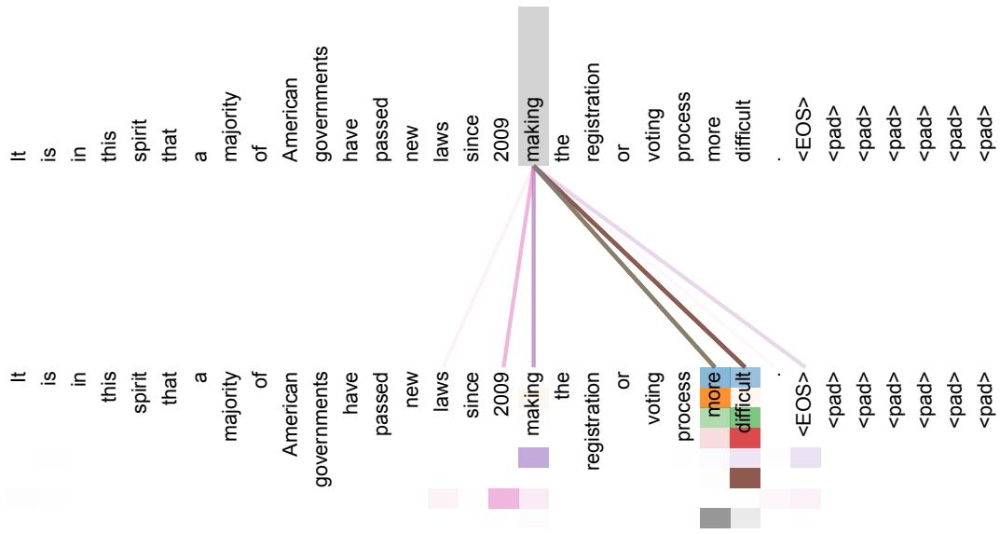

# 📖 论文精读：Attention Is All You Need

> 🌱 "今天咱们要一起读一篇改变世界的论文——2017年，Google 团队提出了 Transformer 架构，彻底颠覆了深度学习处理序列数据的方式。这篇论文只有短短几页，却孕育了后来的 BERT、GPT 系列乃至 ChatGPT。准备好了吗？咱们开始吧！"

**论文信息**：Vaswani et al., "Attention Is All You Need", NeurIPS 2017

---

## 🎯 为什么要读这篇论文？

### 在 LLM 发展史上的地位

如果用一句话概括：**Transformer 是现代大语言模型的基石**。没有这篇论文，就没有后来的 GPT、BERT、T5、PaLM、LLaMA……几乎所有你听说过的语言模型，底层架构都源自这篇 2017 年的论文。

在 Transformer 诞生之前，自然语言处理的主流方法是 RNN（循环神经网络）和 LSTM。Transformer 用一种全新的"注意力机制"取代了循环结构，解决了 RNN 的根本瓶颈——从此，模型可以**并行处理**整个序列，训练速度提升了数量级。

### 读完能收获什么

- 理解 **Self-Attention**（自注意力）的完整数学原理和直觉
- 掌握 **多头注意力**、**位置编码**、**编码器-解码器** 等核心组件
- 能用 PyTorch 手写 Transformer 的关键模块
- 理解训练技巧：Warmup 学习率、Label Smoothing
- 为后续阅读 GPT、BERT 等论文打下坚实基础

### 需要的前置知识

| 知识点 | 关联内容 |
|--------|----------|
| 矩阵乘法、向量内积 | 📚 线性代数基础 |
| Softmax 函数 | 📚 Ch03 概率分布 |
| 梯度、反向传播 | 📚 Ch04 优化基础 |
| 残差连接、Layer Norm | 📚 Ch05 深度网络技巧 |
| KL 散度、交叉熵 | 📚 Ch06 信息论基础 |

> 不必担心——咱们会在用到这些概念的时候逐一复习。

---

## 📜 论文背景：RNN 的困境

### 当时（2017年）的主流方法

在 Transformer 诞生之前，序列建模领域被三类架构统治：

1. **RNN（循环神经网络）**：按时间步依次处理序列，每一步依赖上一步的隐藏状态 $h_t = f(h_{t-1}, x_t)$
2. **LSTM（长短期记忆网络）**：通过门控机制缓解 RNN 的梯度消失问题
3. **GRU（门控循环单元）**：LSTM 的简化版本

这些模型在当时是机器翻译、语音识别、语言建模等任务的标配。

### RNN 的根本问题

问题出在"**顺序计算**"这四个字上。来看 RNN 的计算方式：

$$h_t = f(h_{t-1}, x_t)$$

你看——要算 $h_t$，必须先算完 $h_{t-1}$；要算 $h_{t-1}$，又必须先算完 $h_{t-2}$……这就形成了一条**串行链**，没法并行。

这带来两个致命问题：

**❌ 问题一：训练慢**
- 无法利用 GPU 的并行计算能力
- 序列越长，训练越慢
- 内存限制也约束了 batch size

**❌ 问题二：长距离遗忘**
- 梯度要经过很多步才能从序列尾部传到头部
- 信息经过多次变换后逐渐"稀释"
- 虽然 LSTM 用门控缓解了这个问题，但没有根本解决

> 💡 论文里用了很精确的表述："This inherently sequential nature precludes parallelization within training examples"（这种固有的顺序特性阻碍了训练样本内部的并行化）。

### 为什么需要一种新架构

研究者们已经尝试了很多方法来改善 RNN：分解技巧（factorization tricks）、条件计算（conditional computation）……但论文作者指出了关键一点：

> "The fundamental constraint of sequential computation, however, remains."
> （顺序计算的根本限制依然存在。）

所以他们问了一个大胆的问题：**能不能完全不用循环结构？能不能只用注意力机制？**

这就是 Transformer 的诞生——一个完全基于注意力、没有任何循环或卷积的架构。

---

## 🔍 核心创新：Self-Attention

### 从"一个词如何理解上下文"说起

考虑这句话：

> "The animal didn't cross the street because **it** was too tired."

这里的 "it" 指的是什么？是 animal 还是 street？

你我能轻松判断 "it" 指的是 animal——因为"累了"这个信息跟"动物"更搭配。但这需要理解整个句子的上下文关系。

**Self-Attention（自注意力）就是让模型学会这种"看上下文"的能力。** 它让序列中的每个位置都能直接"看到"序列中的所有其他位置，然后决定应该关注哪些信息。

与传统 RNN 一步步传递信息不同，Self-Attention 是：**一步到位，全局视野。**

### Q、K、V 的直觉理解

Self-Attention 的核心是一个叫 **QKV** 的机制。咱们用一个类比来理解：

**📚 类比：图书馆找书**

想象你在一个图书馆里找书：

- **Q（Query，查询）**：你心里的问题——"我想找关于深度学习的书"
- **K（Key，钥匙）**：每本书的标签/索引——"机器学习导论"、"深度学习实战"、"自然语言处理"
- **V（Value，值）**：书的实际内容

流程是这样的：
1. 你拿着你的 **Q**，去跟每本书的 **K** 做比较（计算相似度）
2. 越匹配的书，得分越高（注意力权重越大）
3. 最终你得到的是所有书的 **V** 的加权组合，权重就是匹配程度

在 Self-Attention 中：
- 序列中每个位置都同时扮演 Q、K、V 三个角色
- 每个位置用自己作为 Q，去跟所有位置的 K 比较
- 然后用得到的权重，对所有位置的 V 做加权求和

### 完整公式推导（不跳步！）

好，咱们一步步推导。假设输入序列有 $n$ 个位置，每个位置用一个 $d$ 维向量表示。

**第一步：线性投影生成 Q、K、V**

给每个输入向量 $x$，通过三个不同的线性变换得到 Q、K、V：

$$Q = X W^Q, \quad K = X W^K, \quad V = X W^V$$

其中 $X \in \mathbb{R}^{n \times d}$ 是输入矩阵，$W^Q, W^K \in \mathbb{R}^{d \times d_k}$，$W^V \in \mathbb{R}^{d \times d_v}$ 是可学习的参数矩阵。

**第二步：计算注意力分数**

用 Q 和 K 的点积来衡量相似度：

$$\text{scores} = Q K^T$$

为什么用点积？📚 咱们在 Ch03 学过——两个向量的点积反映它们的相似程度。点积越大，方向越一致，越"匹配"。

这里 $Q \in \mathbb{R}^{n \times d_k}$，$K^T \in \mathbb{R}^{d_k \times n}$，所以 $QK^T \in \mathbb{R}^{n \times n}$——结果是一个 $n \times n$ 的矩阵，每个元素 $(i,j)$ 表示位置 $i$ 对位置 $j$ 的"原始注意力分数"。

**第三步：缩放（Scale）**

$$\text{scaled\_scores} = \frac{QK^T}{\sqrt{d_k}}$$

除以 $\sqrt{d_k}$？这步非常关键，咱们在下一节专门讲为什么。

**第四步：Softmax 归一化**

$$\text{attention\_weights} = \text{softmax}\left(\frac{QK^T}{\sqrt{d_k}}\right)$$

Softmax 把每一行的分数变成概率分布（和为 1）。📚 咱们在 Ch03 学过 Softmax：$\text{softmax}(z_i) = \frac{e^{z_i}}{\sum_j e^{z_j}}$。

**第五步：加权求和**

$$\text{Attention}(Q, K, V) = \text{softmax}\left(\frac{QK^T}{\sqrt{d_k}}\right) V$$

用注意力权重对 V 做加权求和，得到最终输出。

> 这就是论文中的公式 (1)！咱们一步步走完了。

### 缩放因子 $\sqrt{d_k}$ 为什么必要（方差推导）

这一步很多人会跳过，但咱们要搞清楚——为什么要除以 $\sqrt{d_k}$？

**问题场景**：假设 $q$ 和 $k$ 的每个分量都是从均值为 0、方差为 1 的独立分布中采样。那么点积：

$$q \cdot k = \sum_{i=1}^{d_k} q_i k_i$$

每个 $q_i k_i$ 的均值为 $E[q_i k_i] = E[q_i] \cdot E[k_i] = 0$（因为独立）。

方差呢？

$$\text{Var}(q_i k_i) = E[q_i^2 k_i^2] - (E[q_i k_i])^2 = E[q_i^2] \cdot E[k_i^2] = 1 \times 1 = 1$$

因为 $q_i$ 和 $k_i$ 独立且方差都为 1。

所以整个点积的方差：

$$\text{Var}(q \cdot k) = \sum_{i=1}^{d_k} \text{Var}(q_i k_i) = d_k$$

**关键发现**：点积的方差随着维度 $d_k$ 线性增长！当 $d_k = 512$ 时，点积的标准差就是 $\sqrt{512} \approx 22.6$。

**为什么这很糟糕？**

📚 咱们在 Ch03 学过，Softmax 对输入值很敏感。当输入值很大时：

$$\text{softmax}(z)_i = \frac{e^{z_i}}{\sum_j e^{z_j}}$$

如果某个 $z_i$ 远大于其他值，$e^{z_i}$ 会占绝对主导，输出几乎变成 one-hot。这会导致**梯度几乎为零**——Softmax 进入了"饱和区"。

**解决方案**：除以 $\sqrt{d_k}$

$$\text{Var}\left(\frac{q \cdot k}{\sqrt{d_k}}\right) = \frac{d_k}{d_k} = 1$$

方差回到了 1，不管 $d_k$ 多大，点积的数值范围都保持稳定。

> 💡 论文原话："To counteract this effect, we scale the dot products by $\frac{1}{\sqrt{d_k}}$"

### 代码验证：用 PyTorch 手写 Self-Attention

```python
import torch
import torch.nn.functional as F
import math

def scaled_dot_product_attention(Q, K, V, mask=None):
    """
    Scaled Dot-Product Attention
    
    Args:
        Q: (batch, seq_len, d_k) 查询矩阵
        K: (batch, seq_len, d_k) 键矩阵
        V: (batch, seq_len, d_v) 值矩阵
        mask: 可选掩码 (batch, 1, seq_len)
    
    Returns:
        output: (batch, seq_len, d_v) 注意力输出
        attn_weights: (batch, seq_len, seq_len) 注意力权重
    """
    d_k = Q.size(-1)
    
    # 第一步：计算点积分数
    scores = torch.matmul(Q, K.transpose(-2, -1))  # (batch, seq_len, seq_len)
    
    # 第二步：缩放
    scores = scores / math.sqrt(d_k)
    
    # 第三步：应用掩码（如果有的话）
    if mask is not None:
        scores = scores.masked_fill(mask == 0, float('-inf'))
    
    # 第四步：Softmax
    attn_weights = F.softmax(scores, dim=-1)
    
    # 第五步：加权求和
    output = torch.matmul(attn_weights, V)
    
    return output, attn_weights


# ===== 测试验证 =====
batch_size = 2
seq_len = 4
d_k = d_v = 8

Q = torch.randn(batch_size, seq_len, d_k)
K = torch.randn(batch_size, seq_len, d_k)
V = torch.randn(batch_size, seq_len, d_v)

output, weights = scaled_dot_product_attention(Q, K, V)

print(f"Q shape: {Q.shape}")          # (2, 4, 8)
print(f"K shape: {K.shape}")          # (2, 4, 8)
print(f"V shape: {V.shape}")          # (2, 4, 8)
print(f"Output shape: {output.shape}")  # (2, 4, 8)
print(f"Weights shape: {weights.shape}")  # (2, 4, 4)
print(f"Weights sum per row: {weights[0, 0].sum():.4f}")  # 应该是 1.0
```

运行一下，你会看到注意力权重的每一行加起来等于 1（因为 Softmax），输出维度和 V 一致。

> 💡 发现了吗？核心就是三次矩阵乘法：Q×K^T、缩放、Softmax、再乘 V。整个过程中没有任何循环，全是矩阵运算——这就是 GPU 最擅长的事情！

---

## 🎯 多头注意力：从多个角度看问题

### 为什么一个头不够？

咱们用一个类比来理解：

**🕵️ 类比：多个侦探**

假设你要调查一起案件。如果你只派一个侦探，他可能只关注物证，忽略了人证。但如果你派多个侦探，每个侦探关注不同方面——一个查物证，一个查人脉关系，一个查时间线——然后把他们的发现汇总，你就能得到更全面的信息。

**多头注意力就是这个思路。** 每个注意力"头"可以学习关注不同类型的关系：
- 有的头可能关注语法关系（主语-谓语）
- 有的头可能关注语义关系（代词-指代对象）
- 有的头可能关注位置关系（相邻的词）

如果只有一个头，这些不同的关系只能"挤"在一个表示里，相互干扰。论文也说了："With a single attention head, averaging inhibits this."

### 多头的数学定义

Multi-Head Attention 的公式：

$$\text{MultiHead}(Q, K, V) = \text{Concat}(\text{head}_1, \ldots, \text{head}_h) W^O$$

其中每个头：

$$\text{head}_i = \text{Attention}(Q W_i^Q, \; K W_i^K, \; V W_i^V)$$

参数矩阵的维度：
- $W_i^Q \in \mathbb{R}^{d_{\text{model}} \times d_k}$
- $W_i^K \in \mathbb{R}^{d_{\text{model}} \times d_k}$
- $W_i^V \in \mathbb{R}^{d_{\text{model}} \times d_v}$
- $W^O \in \mathbb{R}^{hd_v \times d_{\text{model}}}$

咱们用一个具体例子来理解。论文中的配置：
- $h = 8$（8 个头）
- $d_{\text{model}} = 512$
- $d_k = d_v = 512 / 8 = 64$

所以每个头处理 64 维的 Q、K、V，8 个头并行运算后拼接，得到 $8 \times 64 = 512$ 维的结果，正好等于 $d_{\text{model}}$。

> 💡 这设计很巧妙——总计算量跟单头注意力几乎一样！因为每个头的维度缩小了 8 倍，但多了 8 个头，抵消了。


上图是多头注意力的结构。你看，V、K、Q 各自通过一组 Linear 层投影成 $h$ 组（这里是 8 组）低维表示，然后各组独立做 Scaled Dot-Product Attention，最后把 8 个输出 Concat 在一起，再做一次 Linear 变换输出。

右边的 Scaled Dot-Product Attention 就是咱们上一节实现的结构：


数据流是：MatMul（Q×K^T）→ Scale（除以 √d_k）→ Mask（可选）→ Softmax → MatMul（乘 V）。注意 Mask 只在 Decoder 中使用。

### 代码验证：Multi-Head Attention

```python
import torch
import torch.nn as nn
import math

class MultiHeadAttention(nn.Module):
    def __init__(self, d_model=512, n_heads=8):
        super().__init__()
        assert d_model % n_heads == 0, "d_model 必须能被 n_heads 整除"
        
        self.d_model = d_model
        self.n_heads = n_heads
        self.d_k = d_model // n_heads  # 每个头的维度
        
        # 线性投影层
        self.W_q = nn.Linear(d_model, d_model)
        self.W_k = nn.Linear(d_model, d_model)
        self.W_v = nn.Linear(d_model, d_model)
        self.W_o = nn.Linear(d_model, d_model)
    
    def forward(self, Q, K, V, mask=None):
        batch_size = Q.size(0)
        
        # 线性投影后 reshape 成多头
        # (batch, seq, d_model) -> (batch, seq, n_heads, d_k) -> (batch, n_heads, seq, d_k)
        Q = self.W_q(Q).view(batch_size, -1, self.n_heads, self.d_k).transpose(1, 2)
        K = self.W_k(K).view(batch_size, -1, self.n_heads, self.d_k).transpose(1, 2)
        V = self.W_v(V).view(batch_size, -1, self.n_heads, self.d_k).transpose(1, 2)
        
        # 缩放点积注意力
        scores = torch.matmul(Q, K.transpose(-2, -1)) / math.sqrt(self.d_k)
        if mask is not None:
            scores = scores.masked_fill(mask == 0, float('-inf'))
        attn_weights = torch.softmax(scores, dim=-1)
        attn_output = torch.matmul(attn_weights, V)
        
        # 拼接多头输出
        # (batch, n_heads, seq, d_k) -> (batch, seq, n_heads, d_k) -> (batch, seq, d_model)
        attn_output = attn_output.transpose(1, 2).contiguous().view(batch_size, -1, self.d_model)
        
        # 最终线性变换
        return self.W_o(attn_output)


# ===== 测试 =====
mha = MultiHeadAttention(d_model=512, n_heads=8)
x = torch.randn(2, 10, 512)  # batch=2, seq_len=10, d_model=512
output = mha(x, x, x)  # Self-Attention: Q=K=V=x
print(f"Input:  {x.shape}")   # (2, 10, 512)
print(f"Output: {output.shape}")  # (2, 10, 512)
```

> 注意 `mha(x, x, x)` 这里 Q、K、V 都是同一个输入——这就是 **Self-Attention**（自注意力）。如果是 Cross-Attention（比如 Decoder 关注 Encoder 的输出），Q 和 K、V 就来自不同的地方。

---

## 📐 Positional Encoding：给模型装上"位置感"

### 为什么需要位置编码？

这个问题很关键——咱们来想一下。

Self-Attention 对输入是**完全对称的**。也就是说，如果你把序列的词序打乱，Self-Attention 的输出只是对应位置做了同样的打乱，它不会"发现"顺序变了。

用数学语言说：Self-Attention 是**置换等变**（permutation equivariant）的。

这可不行——"狗咬人"和"人咬狗"意思完全不同，但如果不告诉模型词的顺序，它分不出来。

所以 Transformer 需要一种方式把位置信息注入进去。论文的方案是：**直接把位置编码加到词嵌入上。**

$$\text{input} = \text{Embedding}(x) + \text{PositionalEncoding}(pos)$$

### 正弦/余弦编码的推导

论文使用了正弦和余弦函数来编码位置：

$$PE_{(pos, 2i)} = \sin\left(\frac{pos}{10000^{2i/d_{\text{model}}}}\right)$$

$$PE_{(pos, 2i+1)} = \cos\left(\frac{pos}{10000^{2i/d_{\text{model}}}}\right)$$

其中：
- $pos$ 是序列中的位置索引（0, 1, 2, ...）
- $i$ 是维度索引（0 到 $d_{\text{model}}/2 - 1$）
- 偶数维度用 $\sin$，奇数维度用 $\cos$

咱们具体看一下。假设 $d_{\text{model}} = 512$：

- 第 0 维（$i=0$）：$\sin(pos / 10000^{0/512}) = \sin(pos / 1) = \sin(pos)$
- 第 1 维（$i=0$）：$\cos(pos / 1) = \cos(pos)$
- 第 2 维（$i=1$）：$\sin(pos / 10000^{2/512}) = \sin(pos / 10000^{1/256})$
- 第 3 维（$i=1$）：$\cos(pos / 10000^{1/256})$
- ...
- 第 510 维（$i=255$）：$\sin(pos / 10000^{510/512}) = \sin(pos / 10000^{0.996})$
- 第 511 维（$i=255$）：$\cos(pos / 10000^{0.996})$

你可以看到，**每个维度对应一个不同频率的正弦波**。低维度频率高（变化快），高维度频率低（变化慢）。

### 为什么用三角函数？（数学直觉）

论文给了一个很重要的理由：**三角函数的线性组合性质**。

对于任意固定偏移 $k$，$PE_{pos+k}$ 可以表示为 $PE_{pos}$ 的线性函数。这是因为三角函数的加法公式：

$$\sin(a + b) = \sin a \cos b + \cos a \sin b$$
$$\cos(a + b) = \cos a \cos b - \sin a \sin b$$

这意味着模型可以通过学习一个线性变换，从当前位置的编码推算出相对位置的编码——这正是"相对位置"信息。

另外，波长从 $2\pi$ 到 $10000 \times 2\pi$ 形成几何级数，这意味着：
- 高频维度能区分**相邻位置**的差异
- 低频维度能跨越**很远的距离**仍然保持区分

> 💡 论文还实验了"学习的位置编码"（Learned Positional Embedding），发现效果几乎一样。但正弦版本有个优势：**可以推广到训练时没见过的序列长度**。

### 代码验证：可视化位置编码

```python
import torch
import numpy as np
import matplotlib
matplotlib.use('Agg')
import matplotlib.pyplot as plt

def positional_encoding(max_len=100, d_model=512):
    """生成正弦位置编码"""
    PE = torch.zeros(max_len, d_model)
    position = torch.arange(0, max_len, dtype=torch.float).unsqueeze(1)  # (max_len, 1)
    
    # 计算 10000^(2i/d_model) — 这里用指数和对数更数值稳定
    div_term = torch.exp(
        torch.arange(0, d_model, 2).float() * (-np.log(10000.0) / d_model)
    )  # (d_model/2,)
    
    PE[:, 0::2] = torch.sin(position * div_term)  # 偶数维度
    PE[:, 1::2] = torch.cos(position * div_term)  # 奇数维度
    
    return PE

# 生成并可视化
pe = positional_encoding(max_len=100, d_model=128)

plt.figure(figsize=(12, 6))
plt.imshow(pe.numpy(), aspect='auto', cmap='RdBu')
plt.xlabel('维度 $i$')
plt.ylabel('位置 $pos$')
plt.title('Positional Encoding 可视化')
plt.colorbar(label='编码值')
plt.tight_layout()
plt.savefig('positional_encoding.png', dpi=150)
print("位置编码已保存为 positional_encoding.png")
print(f"形状: {pe.shape}")  # (100, 128)
```

运行后你会看到一张热力图——每一行是一个位置的编码，横轴是维度。你会注意到：
- 左边（低维度）的颜色变化快——高频，捕捉局部位置差异
- 右边（高维度）的颜色变化慢——低频，捕捉全局位置信息

---

## 🏗️ 完整架构：Encoder + Decoder

### Encoder 结构详解（逐层拆解）

Transformer 的 Encoder 由 $N=6$ 个相同的层堆叠而成。每一层包含两个子层：

**子层 1：多头自注意力 + 残差 + LayerNorm**

$$\text{output}_1 = \text{LayerNorm}(x + \text{MultiHeadAttention}(x, x, x))$$

**子层 2：前馈网络 + 残差 + LayerNorm**

$$\text{output}_2 = \text{LayerNorm}(\text{output}_1 + \text{FFN}(\text{output}_1))$$

其中前馈网络 FFN 是：

$$\text{FFN}(x) = \max(0, xW_1 + b_1)W_2 + b_2$$

这是一个两层全连接网络，中间用 ReLU 激活，隐藏层维度 $d_{ff} = 2048$（是 $d_{\text{model}}=512$ 的 4 倍）。

> 💡 残差连接（Residual Connection）📚 咱们在 Ch05 学过——它让梯度可以直接"跳过"某些层，避免深层网络的梯度消失。LayerNorm 则稳定每一层的输出分布。

**所有子层的输出维度都是 $d_{\text{model}} = 512$**，这是为了让残差连接 $x + \text{Sublayer}(x)$ 能够做逐元素相加。

### Decoder 结构详解（掩码的作用）

Decoder 也是 $N=6$ 层，但每层有**三个**子层：

**子层 1：掩码多头自注意力（Masked Multi-Head Self-Attention）**

$$\text{output}_1 = \text{LayerNorm}(x + \text{MaskedMultiHeadAttention}(x, x, x))$$

**子层 2：编码器-解码器注意力（Cross-Attention）**

$$\text{output}_2 = \text{LayerNorm}(\text{output}_1 + \text{MultiHeadAttention}(\text{output}_1, \text{encoder\_output}, \text{encoder\_output}))$$

**子层 3：前馈网络**

$$\text{output}_3 = \text{LayerNorm}(\text{output}_2 + \text{FFN}(\text{output}_2))$$

**掩码（Mask）是 Decoder 的关键设计**。为什么需要掩码？

因为在翻译任务中，Decoder 是**自回归**的——生成第 $t$ 个词时，只能看到前面 $t-1$ 个词，不能"偷看"未来的词。

掩码的实现方式：在 Softmax 之前，把未来位置对应的分数设为 $-\infty$，这样 Softmax 之后这些位置的权重就是 0。

```python
# 掩码的实现
def create_look_ahead_mask(seq_len):
    """创建前瞻掩码：上三角为 0，其余为 1"""
    mask = torch.tril(torch.ones(seq_len, seq_len))  # 下三角矩阵
    return mask.unsqueeze(0)  # (1, seq_len, seq_len)

mask = create_look_ahead_mask(5)
print(mask)
# tensor([[[1., 0., 0., 0., 0.],
#          [1., 1., 0., 0., 0.],
#          [1., 1., 1., 0., 0.],
#          [1., 1., 1., 1., 0.],
#          [1., 1., 1., 1., 1.]]])
```

> 看到 0 的位置会被 mask_fill 为 $-\infty$，Softmax 后变成 0。这样位置 0 只能看到自己，位置 1 能看到 0 和 1，以此类推。

### 图1详细解读


这是论文中最核心的 Figure 1，展示了 Transformer 的完整架构。咱们从下往上、从左到右仔细看。

**左侧——Encoder（编码器）**：
1. 最底部是 **Input Embedding** + **Positional Encoding**——把输入 token 转成向量并加上位置信息
2. 进入第一个子层：**Multi-Head Attention**（注意这里是自注意力，Q=K=V 都来自上一层输出）
3. 经过 **Add & Norm**——Add 就是残差连接（加上输入），Norm 就是 Layer Normalization
4. 进入第二个子层：**Feed Forward**——逐位置的两层全连接网络
5. 再次 **Add & Norm**
6. 整个结构重复 $N=6$ 次

**右侧——Decoder（解码器）**：
1. 底部是 **Output Embedding** + **Positional Encoding**（注意输出要右移一位，这样第一个预测不依赖于任何已生成的词）
2. 第一个子层：**Masked Multi-Head Attention**——带掩码的自注意力，防止看到未来
3. 第二个子层：**Multi-Head Attention**——这里的 Q 来自 Decoder 的上一层，K 和 V 来自 Encoder 的输出。这就是 **Cross-Attention**！Decoder 通过它获取源序列的信息
4. 第三个子层：**Feed Forward**
5. 每个子层后都有 **Add & Norm**
6. 同样重复 $N=6$ 次
7. 最终经过 **Linear** + **Softmax** 输出词的概率分布

**几个值得注意的细节**：
- 图中的 $N \times$ 表示这个模块堆叠了 $N$ 次
- Encoder 的输出会连接到 Decoder 的每一个 Cross-Attention 层
- 所有残差连接都保证了梯度能顺畅流过深层网络

### 代码：完整 Transformer Block

```python
import torch
import torch.nn as nn
import math

class PositionwiseFeedForward(nn.Module):
    """逐位置前馈网络"""
    def __init__(self, d_model=512, d_ff=2048, dropout=0.1):
        super().__init__()
        self.w_1 = nn.Linear(d_model, d_ff)
        self.w_2 = nn.Linear(d_ff, d_model)
        self.dropout = nn.Dropout(dropout)
    
    def forward(self, x):
        return self.w_2(self.dropout(torch.relu(self.w_1(x))))


class EncoderLayer(nn.Module):
    """Transformer 编码器层"""
    def __init__(self, d_model=512, n_heads=8, d_ff=2048, dropout=0.1):
        super().__init__()
        self.self_attn = MultiHeadAttention(d_model, n_heads)
        self.ffn = PositionwiseFeedForward(d_model, d_ff, dropout)
        self.norm1 = nn.LayerNorm(d_model)
        self.norm2 = nn.LayerNorm(d_model)
        self.dropout1 = nn.Dropout(dropout)
        self.dropout2 = nn.Dropout(dropout)
    
    def forward(self, x, mask=None):
        # 子层1: 多头自注意力 + 残差 + LayerNorm
        attn_out = self.self_attn(x, x, x, mask)
        x = self.norm1(x + self.dropout1(attn_out))
        # 子层2: 前馈网络 + 残差 + LayerNorm
        ff_out = self.ffn(x)
        x = self.norm2(x + self.dropout2(ff_out))
        return x


class DecoderLayer(nn.Module):
    """Transformer 解码器层"""
    def __init__(self, d_model=512, n_heads=8, d_ff=2048, dropout=0.1):
        super().__init__()
        self.masked_attn = MultiHeadAttention(d_model, n_heads)
        self.cross_attn = MultiHeadAttention(d_model, n_heads)
        self.ffn = PositionwiseFeedForward(d_model, d_ff, dropout)
        self.norm1 = nn.LayerNorm(d_model)
        self.norm2 = nn.LayerNorm(d_model)
        self.norm3 = nn.LayerNorm(d_model)
        self.dropout1 = nn.Dropout(dropout)
        self.dropout2 = nn.Dropout(dropout)
        self.dropout3 = nn.Dropout(dropout)
    
    def forward(self, x, enc_output, src_mask=None, tgt_mask=None):
        # 子层1: 掩码自注意力
        attn_out = self.masked_attn(x, x, x, tgt_mask)
        x = self.norm1(x + self.dropout1(attn_out))
        # 子层2: 编码器-解码器注意力 (Cross-Attention)
        cross_out = self.cross_attn(x, enc_output, enc_output, src_mask)
        x = self.norm2(x + self.dropout2(cross_out))
        # 子层3: 前馈网络
        ff_out = self.ffn(x)
        x = self.norm3(x + self.dropout3(ff_out))
        return x


# ===== 完整模型参数量估算 =====
d_model = 512
n_heads = 8
n_layers = 6

# 每层的参数：
# MultiHeadAttention: 4 * d_model^2 (Wq, Wk, Wv, Wo)
# FFN: d_model * d_ff * 2 (两层)
# LayerNorm: 2 * d_model * 2 (两层)
# 总计每层约: 4*512^2 + 512*2048*2 + 4*512 ≈ 2.36M

encoder = nn.ModuleList([EncoderLayer(d_model, n_heads) for _ in range(n_layers)])
decoder = nn.ModuleList([DecoderLayer(d_model, n_heads) for _ in range(n_layers)])

total_params = sum(p.numel() for p in encoder.parameters()) + \
               sum(p.numel() for p in decoder.parameters())
print(f"Encoder + Decoder 参数量: {total_params / 1e6:.1f}M")
# 论文报告整个 base model 约 65M 参数
```

---

## ⚡ 训练技巧

### 优化器配置（Adam + Warmup）

论文使用了 Adam 优化器，参数配置有点特别：

$$\beta_1 = 0.9, \quad \beta_2 = 0.98, \quad \epsilon = 10^{-9}$$

📚 咱们在 Ch05 学过 Adam 优化器。注意这里的 $\beta_2 = 0.98$ 而不是常见的 $0.999$——较小的 $\beta_2$ 意味着梯度方差的移动平均更新更快，对学习率的变化更敏感。

**学习率调度**是论文中最有特色的训练技巧之一：

$$lr = d_{\text{model}}^{-0.5} \cdot \min\left(\text{step\_num}^{-0.5}, \; \text{step\_num} \cdot \text{warmup\_steps}^{-1.5}\right)$$

这个公式看着复杂，咱们拆开看：

- 前半部分 $d_{\text{model}}^{-0.5}$ 是一个常数缩放因子（$512^{-0.5} \approx 0.044$）
- 后半部分 $\min(...)$ 决定了学习率的变化趋势：
  - **Warmup 阶段**（step < warmup_steps）：$\text{step\_num} \cdot \text{warmup\_steps}^{-1.5}$ 这项更小，学习率**线性增长**
  - **衰减阶段**（step > warmup_steps）：$\text{step\_num}^{-0.5}$ 这项更小，学习率按步数的**平方根倒数**衰减

论文设置 $\text{warmup\_steps} = 4000$。

```python
import numpy as np
import matplotlib
matplotlib.use('Agg')
import matplotlib.pyplot as plt

def lr_schedule(step, d_model=512, warmup_steps=4000):
    """Transformer 学习率调度"""
    return d_model ** (-0.5) * min(step ** (-0.5), step * warmup_steps ** (-1.5))

steps = np.arange(1, 100001)
lrs = [lr_schedule(s) for s in steps]

plt.figure(figsize=(10, 4))
plt.plot(steps, lrs)
plt.xlabel('Training Step')
plt.ylabel('Learning Rate')
plt.title('Transformer 学习率调度 (Warmup + Decay)')
plt.axvline(x=4000, color='r', linestyle='--', label='warmup_steps=4000')
plt.legend()
plt.tight_layout()
plt.savefig('lr_schedule.png', dpi=150)
print("学习率曲线已保存")

# 关键数值
print(f"Step 1:     lr = {lr_schedule(1):.6f}")
print(f"Step 4000:  lr = {lr_schedule(4000):.6f} (峰值)")
print(f"Step 10000: lr = {lr_schedule(10000):.6f}")
print(f"Step 50000: lr = {lr_schedule(50000):.6f}")
```

> 💡 这种"Warmup + Decay"策略后来成了训练 Transformer 的标配。直觉上：训练初期模型参数还没稳定，太大的学习率会导致不稳定，所以先线性增大给模型"热身"；等到参数空间探索得差不多了，就慢慢降低学习率做精细调整。

### Label Smoothing

论文使用了 $\epsilon_{ls} = 0.1$ 的 Label Smoothing。

📚 咱们在 Ch06 学过 KL 散度和交叉熵。Label Smoothing 的思想很简单：

原来目标分布是 one-hot：$[0, 0, 1, 0, \ldots]$（正确类别概率为 1，其余为 0）

Label Smoothing 后变成：

$$y_i' = \begin{cases} 1 - \epsilon_{ls} & \text{if } i = \text{正确类别} \\ \frac{\epsilon_{ls}}{V - 1} & \text{otherwise} \end{cases}$$

其中 $V$ 是词汇表大小。

> 论文提到一个有趣的现象："This hurts perplexity, as the model learns to be more unsure, but improves accuracy and BLEU score."——Label Smoothing 虽然让困惑度（perplexity）变差了（因为模型变得更"不确定"），但实际翻译质量（BLEU 分数）反而更好了。这说明模型不会过度自信，泛化能力更强。

---

## 📊 实验结果解读

### 翻译质量（BLEU 分数）

论文在两个翻译任务上做了实验：

| 任务 | 之前最佳 | Transformer (big) | 提升 |
|------|----------|-------------------|------|
| 英→德 (WMT 2014) | 26.36 (ConvS2S 集成) | **28.4** | +2.04 |
| 英→法 (WMT 2014) | 41.16 (GNMT 集成) | **41.8** | +0.64 |

📚 BLEU 分数是机器翻译的自动评估指标，分数越高翻译质量越好。分数范围 0-100，一般 20+ 算可用，30+ 就很好了。

**关键发现**：Transformer 在英德翻译上不仅超越了所有单模型，甚至超越了所有**集成模型**（ensemble）！集成模型通常是把多个模型的结果融合，成本高很多。

### 训练效率对比

这才是 Transformer 最亮眼的地方：

| 模型 | 训练 FLOPs | BLEU (英→德) |
|------|-----------|-------------|
| GNMT + RL Ensemble | $1.8 \times 10^{20}$ | 26.30 |
| ConvS2S Ensemble | $7.7 \times 10^{19}$ | 26.36 |
| **Transformer (base)** | $\mathbf{3.3 \times 10^{18}}$ | 27.3 |
| **Transformer (big)** | $\mathbf{2.3 \times 10^{19}}$ | **28.4** |

Transformer (base) 的训练成本只有 ConvS2S Ensemble 的 **1/23**，BLEU 分数还高了 1 个点！

> 论文说 Transformer (base) 在 8 块 P100 GPU 上只训练了 **12 小时**，big 模型也只用了 **3.5 天**。相比之下，之前的模型动辄训练几周。

### 可视化分析：注意力头学到了什么

这是论文最有趣的部分之一。作者可视化了 Encoder 中的注意力权重，发现不同头确实学到了不同的语言现象。

**长距离依赖**：



这是编码器第 5 层对单词 "making" 的注意力分布。你看，模型成功地把 "making" 和 "more difficult" 连接起来了——跨越了很远的距离！不同颜色代表不同的注意力头，说明多个头同时关注到了这个长距离依赖。

在 RNN 中，这种长距离信息传递需要经过很多步，容易丢失。但 Self-Attention 一步就能"看到"整个序列。

**代词消解**：


这张图展示了两个注意力头（Head 5 和 Head 6）如何处理代词 "its"。Head 5 的注意力分布清楚地显示 "its" 指向了 "Law"——模型自动学会了代词消解！这就是咱们开头提的那个"it 指的是 animal 还是 street"的问题，Transformer 自己学会了。

**句法结构**：


两个不同的头学到了互补的句法信息：一个头关注主谓关系，另一个关注修饰关系。这证明了多头注意力的设计是有效的——不同的头确实在学习不同类型的语言结构。

---

## ❓ 巩固思考题

### 🌱 基础理解

**Q1：RNN 的两个根本问题是什么？Transformer 分别是怎么解决的？**

<details>
<summary>点击查看提示</summary>

1. 顺序计算 → 并行化困难：Transformer 用 Self-Attention 替代循环，所有位置可以同时计算
2. 长距离依赖 → 信息衰减：Self-Attention 让任意两个位置之间的"距离"都是 O(1)
</details>

### 💡 公式理解

**Q2：为什么 Scaled Dot-Product Attention 要除以 $\sqrt{d_k}$？如果不除会怎样？**

<details>
<summary>点击查看提示</summary>

当 $d_k$ 较大时，点积 $q \cdot k$ 的方差为 $d_k$（随维度线性增长），导致 Softmax 输入值过大，进入饱和区，梯度几乎为零。除以 $\sqrt{d_k}$ 后方差变为 1，保持数值稳定。用数学推导：$\text{Var}(q \cdot k) = d_k$，所以 $\text{Var}(q \cdot k / \sqrt{d_k}) = 1$。
</details>

### 🔍 架构理解

**Q3：Decoder 中的 Masked Self-Attention 和 Cross-Attention 分别是做什么的？Q、K、V 各来自哪里？**

<details>
<summary>点击查看提示</summary>

- **Masked Self-Attention**：Q=K=V 都来自 Decoder 上一层输出，掩码防止看到未来位置
- **Cross-Attention**：Q 来自 Decoder，K 和 V 来自 Encoder 输出。这是 Decoder 获取源序列信息的关键桥梁
</details>

### 🧮 计算题

**Q4：假设 $d_{\text{model}} = 512$，$h = 8$，序列长度 $n = 20$。单头注意力的计算复杂度是 $O(n^2 \cdot d_k)$，多头注意力（8头）的总计算量是多少？和单头全维度（$d_k = 512$）相比呢？**

<details>
<summary>点击查看提示</summary>

- 多头：8 × $O(n^2 \cdot d_k)$ = 8 × $O(20^2 \cdot 64)$ = $O(204800)$
- 单头全维度：$O(n^2 \cdot d_{\text{model}})$ = $O(20^2 \cdot 512)$ = $O(204800)$
- 一样的！这就是论文说的 "the total computational cost is similar to that of single-head attention with full dimensionality"
</details>

### 🚀 深入思考

**Q5：位置编码为什么选择三角函数而不是简单的整数编号（0, 1, 2, ...）？如果用整数编号会有什么问题？**

<details>
<summary>点击查看提示</summary>

1. 整数编号没有上界，不利于神经网络学习
2. 整数编号不能表达相对位置关系（$PE_{pos+k}$ 无法从 $PE_{pos}$ 线性变换得到）
3. 三角函数值域在 $[-1, 1]$，数值稳定
4. 不同频率提供了多尺度的位置感知能力
5. 理论上可以外推到更长的序列（虽然实践中这个优势有限）
</details>

---

## 📚 延伸阅读

1. **"The Illustrated Transformer"** by Jay Alammar — 图文并茂的 Transformer 可视化解读
2. **"BERT: Pre-training of Deep Bidirectional Transformers"** (Devlin et al., 2018) — Transformer Encoder 的经典应用
3. **"Language Models are Unsupervised Multitask Learners"** (GPT-2, Radford et al., 2019) — Transformer Decoder 的大规模应用
4. **"LLaMA: Open and Efficient Foundation Language Models"** (Touvron et al., 2023) — 现代高效的 Transformer 变体
5. **"Attention? Attention!"** by Lilian Weng — 注意力机制的全面综述

---

> 🌱 恭喜你读完了第一篇论文精读！Transformer 的核心其实就三样东西：**Self-Attention**（全局信息交互）、**多头**（多角度观察）、**位置编码**（记住顺序）。搞懂这三点，后续的 GPT、BERT 都是在这个基础上的变体。学无止境，咱们下一篇见！📚
