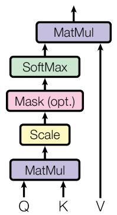
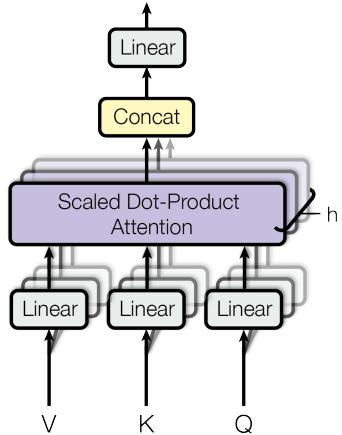
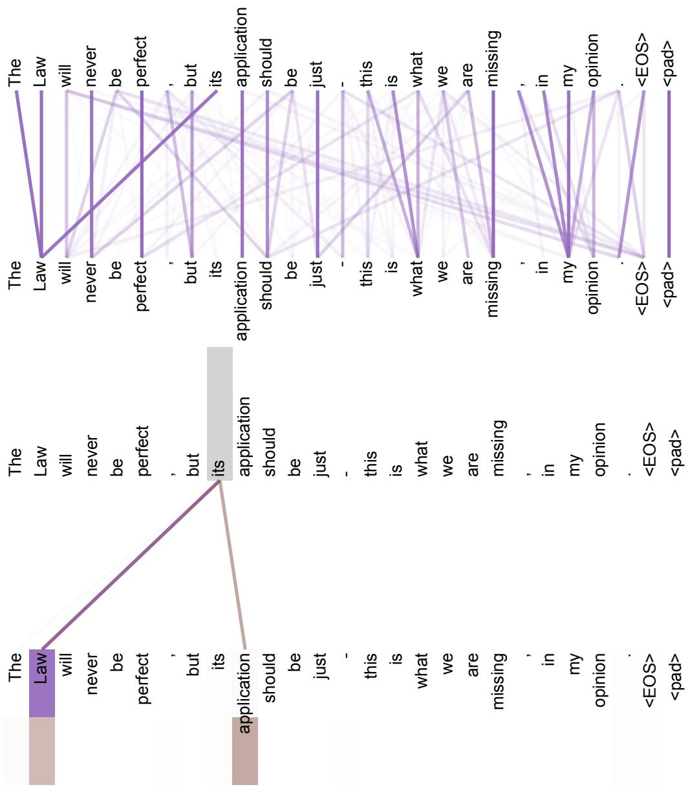
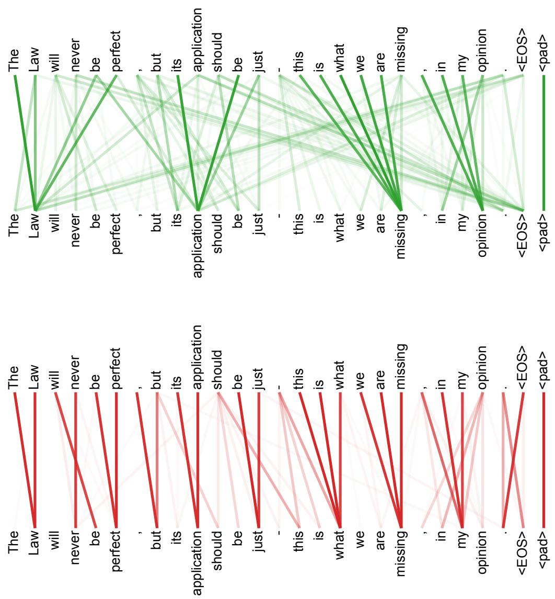

# 📖 Attention Is All You Need — 论文精读（融合版）

> 本文档将论文原文（英文）与中文讲解融合在一起。
> 论文原文保持不变，讲解内容以引用块 `> 📖 **讲解**` 的形式穿插在对应章节之后。
> 
> 📚 数学基础参考：[llm-math-foundations](https://github.com/CCODING04/llm-math-foundations)

---

# Attention Is All You Need

Ashish Vaswani∗

Google Brain

avaswani@google.com

Noam Shazeer∗

Google Brain

noam@google.com

Niki Parmar∗

Google Research

nikip@google.com

Jakob Uszkoreit∗

Google Research

usz@google.com

Llion Jones∗

Google Research

llion@google.com

Aidan N. Gomez∗ †

University of Toronto

aidan@cs.toronto.edu

Łukasz Kaiser∗

Google Brain

lukaszkaiser@google.com

Illia Polosukhin∗ ‡

illia.polosukhin@gmail.com

> 📖 **讲解**
> 
> 🌱 今天咱们要一起读一篇改变世界的论文——2017年，Google 团队提出了 Transformer 架构，彻底颠覆了深度学习处理序列数据的方式。这篇论文只有短短几页，却孕育了后来的 BERT、GPT 系列乃至 ChatGPT。
> 
> **如果用一句话概括：Transformer 是现代大语言模型的基石。** 没有这篇论文，就没有后来的 GPT、BERT、T5、PaLM、LLaMA……几乎所有你听说过的语言模型，底层架构都源自这篇 2017 年的论文。
> 
> 读完这篇论文，你将收获：
> - 理解 **Self-Attention**（自注意力）的完整数学原理和直觉
> - 掌握 **多头注意力**、**位置编码**、**编码器-解码器** 等核心组件
> - 能用 PyTorch 手写 Transformer 的关键模块
> - 理解训练技巧：Warmup 学习率、Label Smoothing
> - 为后续阅读 GPT、BERT 等论文打下坚实基础
> 
> 需要的前置知识：
> 
> | 知识点 | 关联内容 |
> |--------|----------|
> | 矩阵乘法、向量内积 | 📚 线性代数基础 |
> | Softmax 函数 | 📚 Ch03 概率分布 |
> | 梯度、反向传播 | 📚 Ch04 优化基础 |
> | 残差连接、Layer Norm | 📚 Ch05 深度网络技巧 |
> | KL 散度、交叉熵 | 📚 Ch06 信息论基础 |
> 
> 不必担心——咱们会在用到这些概念的时候逐一复习。

# Abstract

The dominant sequence transduction models are based on complex recurrent or convolutional neural networks that include an encoder and a decoder. The best performing models also connect the encoder and decoder through an attention mechanism. We propose a new simple network architecture, the Transformer, based solely on attention mechanisms, dispensing with recurrence and convolutions entirely. Experiments on two machine translation tasks show these models to be superior in quality while being more parallelizable and requiring significantly less time to train. Our model achieves 28.4 BLEU on the WMT 2014 Englishto-German translation task, improving over the existing best results, including ensembles, by over 2 BLEU. On the WMT 2014 English-to-French translation task, our model establishes a new single-model state-of-the-art BLEU score of 41.8 after training for 3.5 days on eight GPUs, a small fraction of the training costs of the best models from the literature. We show that the Transformer generalizes well to other tasks by applying it successfully to English constituency parsing both with large and limited training data.

> 📖 **讲解**
> 
> 摘要虽然短，但信息密度极高。咱们拆解一下关键信息：
> 
> **现状**：当时主流的序列转换模型（如机器翻译）基于复杂的 RNN 或 CNN，包含编码器和解码器。
> 
> **创新**：提出了 Transformer——**完全基于注意力机制**，完全抛弃了循环和卷积。
> 
> **成果**：
> - 英→德翻译：28.4 BLEU，比之前最好的结果（包括集成模型）高了 2 个 BLEU
> - 英→法翻译：41.8 BLEU，8 块 GPU 只训练了 3.5 天——训练成本只是之前最佳模型的一小部分
> - 还成功应用到了英语成分句法分析，证明泛化能力
> 
> 💡 注意"dispensing with recurrence and convolutions entirely"这句话——这是整篇论文最核心的主张。

# 1 Introduction

Recurrent neural networks, long short-term memory [13] and gated recurrent [7] neural networks in particular, have been firmly established as state of the art approaches in sequence modeling and transduction problems such as language modeling and machine translation [35, 2, 5]. Numerous efforts have since continued to push the boundaries of recurrent language models and encoder-decoder architectures [38, 24, 15].

Recurrent models typically factor computation along the symbol positions of the input and output sequences. Aligning the positions to steps in computation time, they generate a sequence of hidden states $h _ { t } ,$ as a function of the previous hidden state $h _ { t - 1 }$ and the input for position t. This inherently sequential nature precludes parallelization within training examples, which becomes critical at longer sequence lengths, as memory constraints limit batching across examples. Recent work has achieved significant improvements in computational efficiency through factorization tricks [21] and conditional computation [32], while also improving model performance in case of the latter. The fundamental constraint of sequential computation, however, remains.

Attention mechanisms have become an integral part of compelling sequence modeling and transduction models in various tasks, allowing modeling of dependencies without regard to their distance in the input or output sequences [2, 19]. In all but a few cases [27], however, such attention mechanisms are used in conjunction with a recurrent network.

In this work we propose the Transformer, a model architecture eschewing recurrence and instead relying entirely on an attention mechanism to draw global dependencies between input and output. The Transformer allows for significantly more parallelization and can reach a new state of the art in translation quality after being trained for as little as twelve hours on eight P100 GPUs.

> 📖 **讲解**
> 
> Introduction 部分，论文作者清晰地论述了 RNN 的困境和 Transformer 的动机。咱们来梳理一下逻辑链：
> 
> ### 当时（2017年）的主流方法
> 
> 在 Transformer 诞生之前，序列建模领域被三类架构统治：
> 
> 1. **RNN（循环神经网络）**：按时间步依次处理序列，每一步依赖上一步的隐藏状态 $h_t = f(h_{t-1}, x_t)$
> 2. **LSTM（长短期记忆网络）**：通过门控机制缓解 RNN 的梯度消失问题
> 3. **GRU（门控循环单元）**：LSTM 的简化版本
> 
> ### RNN 的根本问题
> 
> 问题出在"**顺序计算**"这四个字上。要算 $h_t$，必须先算完 $h_{t-1}$；要算 $h_{t-1}$，又必须先算完 $h_{t-2}$……这就形成了一条**串行链**，没法并行。
> 
> 这带来两个致命问题：
> 
> **❌ 问题一：训练慢** — 无法利用 GPU 的并行计算能力，序列越长越慢
> 
> **❌ 问题二：长距离遗忘** — 梯度要经过很多步才能从序列尾部传到头部，信息逐渐"稀释"
> 
> 💡 论文用了很精确的表述："This inherently sequential nature precludes parallelization within training examples"
> 
> ### 为什么需要一种新架构
> 
> 研究者们已经尝试了很多方法来改善 RNN：分解技巧、条件计算……但关键一点是：
> 
> > "The fundamental constraint of sequential computation, however, remains."
> 
> 所以作者问了一个大胆的问题：**能不能完全不用循环结构？能不能只用注意力机制？**
> 
> 答案就是 Transformer——一个完全基于注意力、没有任何循环或卷积的架构。8 块 P100 GPU 只训练 12 小时就达到了新的 state-of-the-art！

# 2 Background

The goal of reducing sequential computation also forms the foundation of the Extended Neural GPU [16], ByteNet [18] and ConvS2S [9], all of which use convolutional neural networks as basic building block, computing hidden representations in parallel for all input and output positions. In these models, the number of operations required to relate signals from two arbitrary input or output positions grows in the distance between positions, linearly for ConvS2S and logarithmically for ByteNet. This makes it more difficult to learn dependencies between distant positions [12]. In the Transformer this is reduced to a constant number of operations, albeit at the cost of reduced effective resolution due to averaging attention-weighted positions, an effect we counteract with Multi-Head Attention as described in section 3.2.

Self-attention, sometimes called intra-attention is an attention mechanism relating different positions of a single sequence in order to compute a representation of the sequence. Self-attention has been used successfully in a variety of tasks including reading comprehension, abstractive summarization, textual entailment and learning task-independent sentence representations [4, 27, 28, 22].

End-to-end memory networks are based on a recurrent attention mechanism instead of sequencealigned recurrence and have been shown to perform well on simple-language question answering and language modeling tasks [34].

To the best of our knowledge, however, the Transformer is the first transduction model relying entirely on self-attention to compute representations of its input and output without using sequencealigned RNNs or convolution. In the following sections, we will describe the Transformer, motivate self-attention and discuss its advantages over models such as [17, 18] and [9].

> 📖 **讲解**
> 
> Background 部分回顾了已有工作的思路：
> 
> **基于 CNN 的方案**（ConvS2S、ByteNet）：用卷积替代循环，可以并行计算。但问题是——两个位置之间建立联系所需的操作数，随着距离增长（ConvS2S 是线性增长，ByteNet 是对数增长）。长距离依赖还是不好学。
> 
> **Transformer 的优势**：任意两个位置之间的操作数是 **O(1)**（常数级）！不管两个词隔多远，Self-Attention 一步就能"看到"对方。代价是注意力加权平均会降低分辨率，但多头注意力可以缓解这个问题。
> 
> **Self-Attention** 之前已经在阅读理解、摘要等任务上被验证有效，但 Transformer 是第一个**完全依赖** Self-Attention 的转换模型，完全不使用 RNN 或 CNN。

# 3 Model Architecture

Most competitive neural sequence transduction models have an encoder-decoder structure [5, 2, 35]. Here, the encoder maps an input sequence of symbol representations $( x _ { 1 } , . . . , x _ { n } )$ to a sequence of continuous representations $\textbf { z } = ~ ( z _ { 1 } , . . . , z _ { n } )$ . Given z, the decoder then generates an output sequence $\left( y _ { 1 } , . . . , y _ { m } \right)$ of symbols one element at a time. At each step the model is auto-regressive [10], consuming the previously generated symbols as additional input when generating the next.

  
Figure 1: The Transformer - model architecture.

The Transformer follows this overall architecture using stacked self-attention and point-wise, fully connected layers for both the encoder and decoder, shown in the left and right halves of Figure 1, respectively.

> 📖 **讲解**
> 
> 这是论文中最核心的 Figure 1，展示了 Transformer 的完整架构。咱们从下往上、从左到右仔细看。
> 
> **编码器-解码器（Encoder-Decoder）结构**是序列转换模型的标准范式：
> - **编码器**：把输入序列 $(x_1, ..., x_n)$ 编码成连续表示 $\mathbf{z} = (z_1, ..., z_n)$
> - **解码器**：根据 $\mathbf{z}$，逐个生成输出序列 $(y_1, ..., y_m)$
> - **自回归**：每一步生成时，把之前生成的词也作为输入
> 
> **左侧——Encoder（编码器）**：
> 1. 最底部是 **Input Embedding** + **Positional Encoding**——把输入 token 转成向量并加上位置信息
> 2. 进入第一个子层：**Multi-Head Attention**（自注意力，Q=K=V 都来自上一层输出）
> 3. 经过 **Add & Norm**——残差连接 + Layer Normalization
> 4. 进入第二个子层：**Feed Forward**——逐位置的两层全连接网络
> 5. 再次 **Add & Norm**
> 6. 整个结构重复 $N=6$ 次
> 
> **右侧——Decoder（解码器）**：
> 1. 底部是 **Output Embedding** + **Positional Encoding**（输出右移一位）
> 2. 第一个子层：**Masked Multi-Head Attention**——带掩码的自注意力，防止看到未来
> 3. 第二个子层：**Multi-Head Attention**——Q 来自 Decoder，K 和 V 来自 Encoder（Cross-Attention）
> 4. 第三个子层：**Feed Forward**
> 5. 每个子层后都有 **Add & Norm**
> 6. 同样重复 $N=6$ 次
> 7. 最终经过 **Linear** + **Softmax** 输出词的概率分布

# 3.1 Encoder and Decoder Stacks

Encoder: The encoder is composed of a stack of $N = 6$ identical layers. Each layer has two sub-layers. The first is a multi-head self-attention mechanism, and the second is a simple, positionwise fully connected feed-forward network. We employ a residual connection [11] around each of the two sub-layers, followed by layer normalization [1]. That is, the output of each sub-layer is LayerNorm(x + Sublayer(x)), where Sublayer(x) is the function implemented by the sub-layer itself. To facilitate these residual connections, all sub-layers in the model, as well as the embedding layers, produce outputs of dimension $d _ { \mathrm { m o d e l } } = 5 1 2$ .

Decoder: The decoder is also composed of a stack of $N = 6$ identical layers. In addition to the two sub-layers in each encoder layer, the decoder inserts a third sub-layer, which performs multi-head attention over the output of the encoder stack. Similar to the encoder, we employ residual connections around each of the sub-layers, followed by layer normalization. We also modify the self-attention sub-layer in the decoder stack to prevent positions from attending to subsequent positions. This masking, combined with fact that the output embeddings are offset by one position, ensures that the predictions for position i can depend only on the known outputs at positions less than i.

> 📖 **讲解**
> 
> ### Encoder 结构详解
> 
> Encoder 由 $N=6$ 个相同的层堆叠而成。每一层包含两个子层：
> 
> **子层 1：多头自注意力 + 残差 + LayerNorm**
> 
> $$\text{output}_1 = \text{LayerNorm}(x + \text{MultiHeadAttention}(x, x, x))$$
> 
> **子层 2：前馈网络 + 残差 + LayerNorm**
> 
> $$\text{output}_2 = \text{LayerNorm}(\text{output}_1 + \text{FFN}(\text{output}_1))$$
> 
> 残差连接让梯度可以直接"跳过"某些层，避免深层网络的梯度消失。LayerNorm 则稳定每一层的输出分布。
> 
> **所有子层的输出维度都是 $d_{\text{model}} = 512$**，这是为了让残差连接 $x + \text{Sublayer}(x)$ 能够做逐元素相加。
> 
> ### Decoder 结构详解（掩码的作用）
> 
> Decoder 也是 $N=6$ 层，但每层有**三个**子层。关键设计是**掩码（Mask）**：
> 
> 因为在翻译任务中，Decoder 是**自回归**的——生成第 $t$ 个词时，只能看到前面 $t-1$ 个词，不能"偷看"未来的词。
> 
> 掩码的实现：在 Softmax 之前，把未来位置对应的分数设为 $-\infty$，Softmax 后这些位置的权重就是 0。
> 
> ```python
> def create_look_ahead_mask(seq_len):
>     """创建前瞻掩码：上三角为 0，其余为 1"""
>     mask = torch.tril(torch.ones(seq_len, seq_len))
>     return mask.unsqueeze(0)
> 
> mask = create_look_ahead_mask(5)
> print(mask)
> # tensor([[[1., 0., 0., 0., 0.],
> #          [1., 1., 0., 0., 0.],
> #          [1., 1., 1., 0., 0.],
> #          [1., 1., 1., 1., 0.],
> #          [1., 1., 1., 1., 1.]]])
> ```

# 3.2 Attention

An attention function can be described as mapping a query and a set of key-value pairs to an output, where the query, keys, values, and output are all vectors. The output is computed as a weighted sum of the values, where the weight assigned to each value is computed by a compatibility function of the query with the corresponding key.

Scaled Dot-Product Attention   


Multi-Head Attention   
  
Figure 2: (left) Scaled Dot-Product Attention. (right) Multi-Head Attention consists of several attention layers running in parallel.

> 📖 **讲解**
> 
> 注意力函数的核心思想很简单：**用一个查询（Query）和一组键值对（Key-Value）计算输出**。输出的每个位置是所有 Value 的加权和，权重由 Query 和对应 Key 的相似度决定。
> 
> 📚 **类比：图书馆找书**
> 
> - **Q（Query，查询）**：你心里的问题——"我想找关于深度学习的书"
> - **K（Key，钥匙）**：每本书的标签/索引——"机器学习导论"、"深度学习实战"
> - **V（Value，值）**：书的实际内容
> 
> 流程：拿着 Q 去跟每个 K 比较相似度 → 越匹配权重越高 → 用权重对 V 做加权求和。

# 3.2.1 Scaled Dot-Product Attention

We call our particular attention "Scaled Dot-Product Attention" (Figure 2). The input consists of queries and keys of dimension $d _ { k }$ , and values of dimension√ $d _ { v }$ . We compute the dot products of the query with all keys, divide each by $\sqrt { d _ { k } }$ , and apply a softmax function to obtain the weights on the values.

In practice, we compute the attention function on a set of queries simultaneously, packed together into a matrix $Q .$ The keys and values are also packed together into matrices K and V . We compute the matrix of outputs as:

$$
\text { Attention } (Q, K, V) = \text { softmax } (\frac {Q K ^ {T}}{\sqrt {d _ {k}}}) V \tag {1}
$$

The two most commonly used attention functions are additive attention [2], and dot-product (multiplicative) attention. Dot-product attention is identical to our algorithm, except for the scaling factor of √ $\frac { 1 } { \sqrt { d _ { k } } }$ . Additive attention computes the compatibility function using a feed-forward network with dk a single hidden layer. While the two are similar in theoretical complexity, dot-product attention is much faster and more space-efficient in practice, since it can be implemented using highly optimized matrix multiplication code.

While for small values of $d _ { k }$ the two mechanisms perform similarly, additive attention outperforms dot product attention without scaling for larger values of $d _ { k }$ [3]. We suspect that for large values of $d _ { k } ,$ , the dot products grow large in magnitude, pushing the softmax function into regremely small gradients 4. To counteract this effect, we scale the dot products by where it has. $\frac { 1 } { \sqrt { d _ { k } } }$

> 📖 **讲解**
> 
> ### 完整公式推导（不跳步！）
> 
> 假设输入序列有 $n$ 个位置，每个位置用一个 $d$ 维向量表示。
> 
> **第一步：线性投影生成 Q、K、V**
> 
> $$Q = X W^Q, \quad K = X W^K, \quad V = X W^V$$
> 
> **第二步：计算注意力分数** — 用 Q 和 K 的点积衡量相似度：
> 
> $$\text{scores} = Q K^T$$
> 
> 结果是 $n \times n$ 的矩阵，每个元素 $(i,j)$ 表示位置 $i$ 对位置 $j$ 的"原始注意力分数"。
> 
> **第三步：缩放（Scale）** — 除以 $\sqrt{d_k}$（下文专门讲为什么）
> 
> $$\text{scaled\_scores} = \frac{QK^T}{\sqrt{d_k}}$$
> 
> **第四步：Softmax 归一化** — 把每一行变成概率分布（和为 1）
> 
> **第五步：加权求和** — 用注意力权重对 V 做加权求和
> 
> $$\text{Attention}(Q, K, V) = \text{softmax}\left(\frac{QK^T}{\sqrt{d_k}}\right) V$$
> 
> > 这就是论文中的公式 (1)！
> 
> ### 缩放因子 $\sqrt{d_k}$ 为什么必要（方差推导）
> 
> 假设 $q$ 和 $k$ 的每个分量都从均值为 0、方差为 1 的独立分布采样。那么点积：
> 
> $$q \cdot k = \sum_{i=1}^{d_k} q_i k_i$$
> 
> 每个分量的方差为 1，所以整个点积的方差：$\text{Var}(q \cdot k) = d_k$
> 
> **关键发现**：点积的方差随着维度 $d_k$ 线性增长！当 $d_k = 512$ 时，标准差约 22.6。这会让 Softmax 进入饱和区，梯度几乎为零。
> 
> **解决方案**：除以 $\sqrt{d_k}$ 后，方差回到 1，不管 $d_k$ 多大数值范围都稳定。
> 
> ### 代码验证：用 PyTorch 手写 Self-Attention
> 
> ```python
> import torch
> import torch.nn.functional as F
> import math
> 
> def scaled_dot_product_attention(Q, K, V, mask=None):
>     d_k = Q.size(-1)
>     scores = torch.matmul(Q, K.transpose(-2, -1)) / math.sqrt(d_k)
>     if mask is not None:
>         scores = scores.masked_fill(mask == 0, float('-inf'))
>     attn_weights = F.softmax(scores, dim=-1)
>     output = torch.matmul(attn_weights, V)
>     return output, attn_weights
> ```
> 
> 💡 核心就是三次矩阵乘法：Q×K^T、缩放、Softmax、再乘 V。整个过程中没有任何循环，全是矩阵运算——这就是 GPU 最擅长的事情！

# 3.2.2 Multi-Head Attention

Instead of performing a single attention function with $d _ { \mathrm { m o d e l } }$ -dimensional keys, values and queries, we found it beneficial to linearly project the queries, keys and values h times with different, learned linear projections to $d _ { k } , d _ { k }$ and $d _ { v }$ dimensions, respectively. On each of these projected versions of queries, keys and values we then perform the attention function in parallel, yielding $d _ { v }$ -dimensional output values. These are concatenated and once again projected, resulting in the final values, as depicted in Figure 2.

Multi-head attention allows the model to jointly attend to information from different representation subspaces at different positions. With a single attention head, averaging inhibits this.

$$
\operatorname{MultiHead} (Q, K, V) = \operatorname{Concat} (\operatorname{head} _ {1},..., \operatorname{head} _ {\mathrm{h}}) W ^ {O}
$$

$$
\text { where   } \mathrm{head} _ {i} = \text { Attention } (Q W _ {i} ^ {Q}, K W _ {i} ^ {K}, V W _ {i} ^ {V})
$$

Where the projections are parameter matrices $\begin{array} { r } { W _ { i } ^ { Q } \in \mathbb { R } ^ { d _ { \operatorname* { m o d e l } } \times d _ { k } } , W _ { i } ^ { K } \in \mathbb { R } ^ { d _ { \operatorname* { m o d e l } } \times d _ { k } } , W _ { i } ^ { V } \in \mathbb { R } ^ { d _ { \operatorname* { m o d e l } } \times d _ { \imath } } } \end{array}$ and $W ^ { O } \in \mathbb R ^ { \bar { h } d _ { v } \times d _ { \mathrm { m o d e l } } }$ l .

In this work we employ $h \ : = \ : 8$ parallel attention layers, or heads. For each of these we use $d _ { k } = d _ { v } = d _ { \mathrm { m o d e l } } / h \stackrel {  } { = } \dot { 6 } 4$ . Due to the reduced dimension of each head, the total computational cost is similar to that of single-head attention with full dimensionality.

> 📖 **讲解**
> 
> ### 为什么一个头不够？
> 
> 🕵️ **类比：多个侦探**。如果只派一个侦探调查案件，他可能只关注物证忽略了人证。但派多个侦探，每个关注不同方面——物证、人脉、时间线——汇总后得到更全面的信息。
> 
> **多头注意力就是这个思路。** 每个注意力"头"可以学习关注不同类型的关系：
> - 有的头关注语法关系（主语-谓语）
> - 有的头关注语义关系（代词-指代对象）
> - 有的头关注位置关系（相邻的词）
> 
> 如果只有一个头，这些不同的关系只能"挤"在一个表示里，相互干扰。
> 
> ### 论文配置
> 
> - $h = 8$（8 个头）
> - $d_{\text{model}} = 512$，$d_k = d_v = 512 / 8 = 64$
> - 每个头处理 64 维的 Q、K、V，8 个头并行运算后拼接得到 $8 \times 64 = 512$ 维
> - 总计算量跟单头注意力几乎一样！因为每个头的维度缩小了 8 倍，但多了 8 个头。
> 
> ### 代码验证：Multi-Head Attention
> 
> ```python
> import torch
> import torch.nn as nn
> import math
> 
> class MultiHeadAttention(nn.Module):
>     def __init__(self, d_model=512, n_heads=8):
>         super().__init__()
>         assert d_model % n_heads == 0
>         self.d_model = d_model
>         self.n_heads = n_heads
>         self.d_k = d_model // n_heads
>         self.W_q = nn.Linear(d_model, d_model)
>         self.W_k = nn.Linear(d_model, d_model)
>         self.W_v = nn.Linear(d_model, d_model)
>         self.W_o = nn.Linear(d_model, d_model)
>     
>     def forward(self, Q, K, V, mask=None):
>         batch_size = Q.size(0)
>         Q = self.W_q(Q).view(batch_size, -1, self.n_heads, self.d_k).transpose(1, 2)
>         K = self.W_k(K).view(batch_size, -1, self.n_heads, self.d_k).transpose(1, 2)
>         V = self.W_v(V).view(batch_size, -1, self.n_heads, self.d_k).transpose(1, 2)
>         scores = torch.matmul(Q, K.transpose(-2, -1)) / math.sqrt(self.d_k)
>         if mask is not None:
>             scores = scores.masked_fill(mask == 0, float('-inf'))
>         attn_weights = torch.softmax(scores, dim=-1)
>         attn_output = torch.matmul(attn_weights, V)
>         attn_output = attn_output.transpose(1, 2).contiguous().view(batch_size, -1, self.d_model)
>         return self.W_o(attn_output)
> ```
> 
> 💡 注意 `mha(x, x, x)` 这里 Q、K、V 都是同一个输入——这就是 **Self-Attention**。如果是 Cross-Attention（Decoder 关注 Encoder 输出），Q 和 K、V 就来自不同的地方。

# 3.2.3 Applications of Attention in our Model

The Transformer uses multi-head attention in three different ways:

• In "encoder-decoder attention" layers, the queries come from the previous decoder layer, and the memory keys and values come from the output of the encoder. This allows every position in the decoder to attend over all positions in the input sequence. This mimics the typical encoder-decoder attention mechanisms in sequence-to-sequence models such as [38, 2, 9].   
• The encoder contains self-attention layers. In a self-attention layer all of the keys, values and queries come from the same place, in this case, the output of the previous layer in the encoder. Each position in the encoder can attend to all positions in the previous layer of the encoder.   
• Similarly, self-attention layers in the decoder allow each position in the decoder to attend to all positions in the decoder up to and including that position. We need to prevent leftward information flow in the decoder to preserve the auto-regressive property. We implement this inside of scaled dot-product attention by masking out (setting to −∞) all values in the input of the softmax which correspond to illegal connections. See Figure 2.

> 📖 **讲解**
> 
> Transformer 中注意力的三种用法，对应三种不同的 Q、K、V 来源：
> 
> | 类型 | Q 来源 | K 来源 | V 来源 | 用在 |
> |------|--------|--------|--------|------|
> | **Encoder Self-Attention** | 上一层 Encoder 输出 | 上一层 Encoder 输出 | 上一层 Encoder 输出 | Encoder 每层 |
> | **Masked Decoder Self-Attention** | 上一层 Decoder 输出 | 上一层 Decoder 输出 | 上一层 Decoder 输出 | Decoder 每层 |
> | **Encoder-Decoder Cross-Attention** | 上一层 Decoder 输出 | **Encoder 输出** | **Encoder 输出** | Decoder 每层 |
> 
> 💡 Cross-Attention 是 Decoder 获取源序列信息的**关键桥梁**。Q 来自 Decoder（"我要生成什么"），K、V 来自 Encoder（"源序列有什么信息"）。

# 3.3 Position-wise Feed-Forward Networks

In addition to attention sub-layers, each of the layers in our encoder and decoder contains a fully connected feed-forward network, which is applied to each position separately and identically. This consists of two linear transformations with a ReLU activation in between.

$$
\operatorname{FFN} (x) = \max (0, x W _ {1} + b _ {1}) W _ {2} + b _ {2} \tag {2}
$$

While the linear transformations are the same across different positions, they use different parameters from layer to layer. Another way of describing this is as two convolutions with kernel size 1. The dimensionality of input and output is $d _ { \mathrm { m o d e l } } = 5 1 2$ , and the inner-layer has dimensionality $d _ { f f } = 2 0 4 8$ .

> 📖 **讲解**
> 
> 前馈网络（FFN）看起来简单，但它是 Transformer 的"第二大脑"。
> 
> - 两层全连接网络，中间用 ReLU 激活
> - 输入/输出维度 $d_{\text{model}} = 512$，隐藏层维度 $d_{ff} = 2048$（是 $d_{\text{model}}$ 的 4 倍）
> - **逐位置独立应用**：每个位置用相同的网络，但不同层用不同的参数
> - 本质上是一个 1×1 卷积（两次）
> 
> 可以把注意力层理解为"信息交流"（位置之间通信），FFN 理解为"信息加工"（每个位置独立做非线性变换）。两者交替进行，让模型既有全局视野，又有深层表达能力。

# 3.4 Embeddings and Softmax

Similarly to other sequence transduction models, we use learned embeddings to convert the input tokens and output tokens to vectors of dimension $d _ { \mathrm { m o d e l } }$ . We also use the usual learned linear transformation and softmax function to convert the decoder output to predicted next-token probabilities. In our model, we share the same weight matrix between the two embedding layers and the pre-softmax√ linear transformation, similar to [30]. In the embedding layers, we multiply those weights by $\sqrt { d _ { \mathrm { { m o d e l } } } }$ .

Table 1: Maximum path lengths, per-layer complexity and minimum number of sequential operations for different layer types. n is the sequence length, d is the representation dimension, k is the kernel size of convolutions and r the size of the neighborhood in restricted self-attention. 

<table><tr><td>Layer Type</td><td>Complexity per Layer</td><td>Sequential Operations</td><td>Maximum Path Length</td></tr><tr><td>Self-Attention</td><td> $O(n^{2} \cdot d)$ </td><td>O(1)</td><td>O(1)</td></tr><tr><td>Recurrent</td><td> $O(n \cdot d^{2})$ </td><td>O(n)</td><td>O(n)</td></tr><tr><td>Convolutional</td><td> $O(k \cdot n \cdot d^{2})$ </td><td>O(1)</td><td> $O(log_{k}(n))$ </td></tr><tr><td>Self-Attention (restricted)</td><td> $O(r \cdot n \cdot d)$ </td><td>O(1)</td><td>O(n/r)</td></tr></table>

> 📖 **讲解**
> 
> 几个要点：
> 
> **权重共享**：输入 Embedding、输出 Embedding、以及 Softmax 前的线性变换**共享同一个权重矩阵**。这是一个常用的节省参数的技巧。Embedding 层的权重乘以 $\sqrt{d_{\text{model}}}$ 是为了让 Embedding 的数值范围与位置编码匹配。
> 
> **Table 1 非常重要**，它对比了不同层类型的三个关键指标：
> 
> | | Self-Attention | Recurrent | Convolutional |
> |---|---|---|---|
> | 复杂度 | $O(n^2 \cdot d)$ | $O(n \cdot d^2)$ | $O(k \cdot n \cdot d^2)$ |
> | 顺序操作 | **O(1)** | O(n) | O(1) |
> | 最大路径长度 | **O(1)** | O(n) | $O(\log_k(n))$ |
> 
> 💡 Self-Attention 的优势：顺序操作 O(1)（完全并行）、最大路径长度 O(1)（任意两位置直达）。劣势：当 $n > d$ 时复杂度比 RNN 高（$O(n^2)$ vs $O(n)$），这也是后来长序列处理的研究方向。

# 3.5 Positional Encoding

Since our model contains no recurrence and no convolution, in order for the model to make use of the order of the sequence, we must inject some information about the relative or absolute position of the tokens in the sequence. To this end, we add "positional encodings" to the input embeddings at the bottoms of the encoder and decoder stacks. The positional encodings have the same dimension $d _ { \mathrm { m o d e l } }$ as the embeddings, so that the two can be summed. There are many choices of positional encodings, learned and fixed [9].

In this work, we use sine and cosine functions of different frequencies:

$$
P E _ {(p o s, 2 i)} = \sin (p o s / 1 0 0 0 0 ^ {2 i / d _ {\mathrm{model}}})
$$

$$
P E _ {(p o s, 2 i + 1)} = c o s (p o s / 1 0 0 0 0 ^ {2 i / d _ {\mathrm{model}}})
$$

where pos is the position and i is the dimension. That is, each dimension of the positional encoding corresponds to a sinusoid. The wavelengths form a geometric progression from $2 \pi$ to $1 0 0 0 0 \cdot 2 \pi$ . We chose this function because we hypothesized it would allow the model to easily learn to attend by relative positions, since for any fixed offset k, $P E _ { p o s + k }$ can be represented as a linear function of $P E _ { p o s }$ .

We also experimented with using learned positional embeddings [9] instead, and found that the two versions produced nearly identical results (see Table 3 row (E)). We chose the sinusoidal version because it may allow the model to extrapolate to sequence lengths longer than the ones encountered during training.

> 📖 **讲解**
> 
> ### 为什么需要位置编码？
> 
> Self-Attention 对输入是**完全对称的**（置换等变）。如果把序列的词序打乱，Self-Attention 的输出只是对应位置做了同样的打乱，它不会"发现"顺序变了。"狗咬人"和"人咬狗"意思完全不同，但不告诉模型词的顺序就分不出来。
> 
> 所以 Transformer 的方案是：**直接把位置编码加到词嵌入上**。
> 
> $$\text{input} = \text{Embedding}(x) + \text{PositionalEncoding}(pos)$$
> 
> ### 正弦/余弦编码的具体含义
> 
> 每个**维度**对应一个不同频率的正弦波。偶数维度用 $\sin$，奇数维度用 $\cos$：
> 
> - 第 0 维（$i=0$）：$\sin(pos / 1) = \sin(pos)$ — 频率最高，区分相邻位置
> - 第 510 维（$i=255$）：$\sin(pos / 10000^{0.996})$ — 频率很低，捕捉全局位置
> 
> 波长从 $2\pi$ 到 $10000 \times 2\pi$ 形成几何级数：高频维度区分相邻位置，低频维度跨越远距离保持区分。
> 
> ### 为什么用三角函数？
> 
> 论文给了关键理由：对于任意固定偏移 $k$，$PE_{pos+k}$ 可以表示为 $PE_{pos}$ 的线性函数（利用三角函数加法公式）。这意味着模型可以学习从当前位置推算相对位置。
> 
> 论文还实验了"学习的位置编码"，效果几乎一样，但正弦版本有个优势：**可以推广到训练时没见过的序列长度**。
> 
> ### 代码验证：位置编码可视化
> 
> ```python
> import torch
> import numpy as np
> 
> def positional_encoding(max_len=100, d_model=512):
>     PE = torch.zeros(max_len, d_model)
>     position = torch.arange(0, max_len, dtype=torch.float).unsqueeze(1)
>     div_term = torch.exp(
>         torch.arange(0, d_model, 2).float() * (-np.log(10000.0) / d_model)
>     )
>     PE[:, 0::2] = torch.sin(position * div_term)
>     PE[:, 1::2] = torch.cos(position * div_term)
>     return PE
> ```

# 4 Why Self-Attention

In this section we compare various aspects of self-attention layers to the recurrent and convolutional layers commonly used for mapping one variable-length sequence of symbol representations $( x _ { 1 } , . . . , x _ { n } )$ to another sequence of equal length $\left( z _ { 1 } , . . . , z _ { n } \right)$ , with $x _ { i } , z _ { i } \in \mathbb { R } ^ { d }$ , such as a hidden layer in a typical sequence transduction encoder or decoder. Motivating our use of self-attention we consider three desiderata.

One is the total computational complexity per layer. Another is the amount of computation that can be parallelized, as measured by the minimum number of sequential operations required.

The third is the path length between long-range dependencies in the network. Learning long-range dependencies is a key challenge in many sequence transduction tasks. One key factor affecting the ability to learn such dependencies is the length of the paths forward and backward signals have to traverse in the network. The shorter these paths between any combination of positions in the input and output sequences, the easier it is to learn long-range dependencies [12]. Hence we also compare the maximum path length between any two input and output positions in networks composed of the different layer types.

As noted in Table 1, a self-attention layer connects all positions with a constant number of sequentially executed operations, whereas a recurrent layer requires $O ( n )$ sequential operations. In terms of computational complexity, self-attention layers are faster than recurrent layers when the sequence length n is smaller than the representation dimensionality d, which is most often the case with sentence representations used by state-of-the-art models in machine translations, such as word-piece [38] and byte-pair [31] representations. To improve computational performance for tasks involving very long sequences, self-attention could be restricted to considering only a neighborhood of size r in the input sequence centered around the respective output position. This would increase the maximum path length to $O ( n / r )$ . We plan to investigate this approach further in future work.

A single convolutional layer with kernel width $k <$ n does not connect all pairs of input and output positions. Doing so requires a stack of $O ( n / k )$ convolutional layers in the case of contiguous kernels, or $O ( l o g _ { k } ( n ) )$ in the case of dilated convolutions [18], increasing the length of the longest paths between any two positions in the network. Convolutional layers are generally more expensive than recurrent layers, by a factor of k. Separable convolutions [6], however, decrease the complexity considerably, to $\dot { O ( k \cdot n \cdot d + n \cdot d ^ { 2 } ) }$ . Even with $k = n$ , however, the complexity of a separable convolution is equal to the combination of a self-attention layer and a point-wise feed-forward layer, the approach we take in our model.

As side benefit, self-attention could yield more interpretable models. We inspect attention distributions from our models and present and discuss examples in the appendix. Not only do individual attention heads clearly learn to perform different tasks, many appear to exhibit behavior related to the syntactic and semantic structure of the sentences.

> 📖 **讲解**
> 
> 第 4 节系统地论证了"为什么选择 Self-Attention"，从三个维度对比：
> 
> **1. 计算复杂度**：Self-Attention 是 $O(n^2 \cdot d)$，RNN 是 $O(n \cdot d^2)$。当 $n < d$ 时（机器翻译中很常见，如 word-piece 表示），Self-Attention 反而更快。
> 
> **2. 并行化**：Self-Attention 的顺序操作只有 O(1)（一步就能算完所有位置），RNN 需要 O(n) 步。
> 
> **3. 长距离依赖**：Self-Attention 的最大路径长度 O(1)（任意两个位置直接相连），RNN 是 O(n)，CNN 是 $O(\log_k(n))$。
> 
> 💡 还有一个额外好处：Self-Attention 更具**可解释性**。可视化注意力权重可以看到不同头学到了不同的语言结构——后面实验部分会展示。

# 5 Training

This section describes the training regime for our models.

# 5.1 Training Data and Batching

We trained on the standard WMT 2014 English-German dataset consisting of about 4.5 million sentence pairs. Sentences were encoded using byte-pair encoding [3], which has a shared sourcetarget vocabulary of about 37000 tokens. For English-French, we used the significantly larger WMT 2014 English-French dataset consisting of 36M sentences and split tokens into a 32000 word-piece vocabulary [38]. Sentence pairs were batched together by approximate sequence length. Each training batch contained a set of sentence pairs containing approximately 25000 source tokens and 25000 target tokens.

# 5.2 Hardware and Schedule

We trained our models on one machine with 8 NVIDIA P100 GPUs. For our base models using the hyperparameters described throughout the paper, each training step took about 0.4 seconds. We trained the base models for a total of 100,000 steps or 12 hours. For our big models,(described on the bottom line of table 3), step time was 1.0 seconds. The big models were trained for 300,000 steps (3.5 days).

> 📖 **讲解**
> 
> 训练效率是 Transformer 的核心卖点：
> 
> - **Base 模型**：8 × P100 GPU，每步 0.4 秒，10 万步，总共 **12 小时**
> - **Big 模型**：每步 1.0 秒，30 万步，总共 **3.5 天**
> 
> 相比之下，之前的 SOTA 模型动辄训练几周。这个训练速度的飞跃，主要归功于 Self-Attention 的并行性。

# 5.3 Optimizer

We used the Adam optimizer [20] with $\beta _ { 1 } = 0 . 9 , \beta _ { 2 } = 0 . 9 8$ and $\epsilon = 1 0 ^ { - 9 }$ . We varied the learning rate over the course of training, according to the formula:

$$
l r a t e = d _ {\text { model }} ^ {- 0. 5} \cdot \min (s t e p \_ n u m ^ {- 0. 5}, s t e p \_ n u m \cdot w a r m u p \_ s t e p s ^ {- 1. 5}) \tag {3}
$$

This corresponds to increasing the learning rate linearly for the first warmup\_steps training steps, and decreasing it thereafter proportionally to the inverse square root of the step number. We used warmup\_ $s t e p s = 4 0 0 0$ .

> 📖 **讲解**
> 
> ### Adam + Warmup 学习率调度
> 
> Adam 的参数配置有点特别：$\beta_2 = 0.98$（不是常见的 $0.999$），较小的 $\beta_2$ 意味着对学习率变化更敏感。
> 
> **学习率调度**是这篇论文最有特色的训练技巧：
> 
> $$lr = d_{\text{model}}^{-0.5} \cdot \min\left(\text{step}^{-0.5}, \; \text{step} \cdot \text{warmup\_steps}^{-1.5}\right)$$
> 
> 拆开看：
> - **Warmup 阶段**（step < 4000）：学习率**线性增长**，给模型"热身"
> - **衰减阶段**（step > 4000）：学习率按步数的**平方根倒数**衰减，精细调整
> 
> 💡 这种"Warmup + Decay"策略后来成了训练 Transformer 的标配。
> 
> ```python
> def lr_schedule(step, d_model=512, warmup_steps=4000):
>     return d_model ** (-0.5) * min(step ** (-0.5), step * warmup_steps ** (-1.5))
> ```

# 5.4 Regularization

We employ three types of regularization during training:

Table 2: The Transformer achieves better BLEU scores than previous state-of-the-art models on the English-to-German and English-to-French newstest2014 tests at a fraction of the training cost. 

<table><tr><td rowspan="2">Model</td><td colspan="2">BLEU</td><td colspan="2">Training Cost (FLOPs)</td></tr><tr><td>EN-DE</td><td>EN-FR</td><td>EN-DE</td><td>EN-FR</td></tr><tr><td>ByteNet [18]</td><td>23.75</td><td></td><td></td><td></td></tr><tr><td>Deep-Att + PosUnk [39]</td><td></td><td>39.2</td><td></td><td> $1.0 \cdot 10^{20}$ </td></tr><tr><td>GNMT + RL [38]</td><td>24.6</td><td>39.92</td><td> $2.3 \cdot 10^{19}$ </td><td> $1.4 \cdot 10^{20}$ </td></tr><tr><td>ConvS2S [9]</td><td>25.16</td><td>40.46</td><td> $9.6 \cdot 10^{18}$ </td><td> $1.5 \cdot 10^{20}$ </td></tr><tr><td>MoE [32]</td><td>26.03</td><td>40.56</td><td> $2.0 \cdot 10^{19}$ </td><td> $1.2 \cdot 10^{20}$ </td></tr><tr><td>Deep-Att + PosUnk Ensemble [39]</td><td></td><td>40.4</td><td></td><td> $8.0 \cdot 10^{20}$ </td></tr><tr><td>GNMT + RL Ensemble [38]</td><td>26.30</td><td>41.16</td><td> $1.8 \cdot 10^{20}$ </td><td> $1.1 \cdot 10^{21}$ </td></tr><tr><td>ConvS2S Ensemble [9]</td><td>26.36</td><td>41.29</td><td> $7.7 \cdot 10^{19}$ </td><td> $1.2 \cdot 10^{21}$ </td></tr><tr><td>Transformer (base model)</td><td>27.3</td><td>38.1</td><td colspan="2"> $3.3 \cdot 10^{18}$ </td></tr><tr><td>Transformer (big)</td><td>28.4</td><td>41.8</td><td colspan="2"> $2.3 \cdot 10^{19}$ </td></tr></table>

Residual Dropout We apply dropout [33] to the output of each sub-layer, before it is added to the sub-layer input and normalized. In addition, we apply dropout to the sums of the embeddings and the positional encodings in both the encoder and decoder stacks. For the base model, we use a rate of $P _ { d r o p } = 0 . 1$ .

Label Smoothing During training, we employed label smoothing of value $\epsilon _ { l s } = 0 . 1 [ 3 6 ]$ . This hurts perplexity, as the model learns to be more unsure, but improves accuracy and BLEU score.

> 📖 **讲解**
> 
> ### 两种正则化方法
> 
> **1. Residual Dropout**（$P_{drop} = 0.1$）
> - 应用在每个子层输出 + 残差连接之前
> - 也应用在 Embedding + Positional Encoding 的和上
> - 标准的防过拟合技巧
> 
> **2. Label Smoothing**（$\epsilon_{ls} = 0.1$）
> 
> 原来目标分布是 one-hot：$[0, 0, 1, 0, \ldots]$，Label Smoothing 后变成：
> 
> $$y_i' = \begin{cases} 1 - \epsilon_{ls} & \text{if } i = \text{正确类别} \\ \frac{\epsilon_{ls}}{V - 1} & \text{otherwise} \end{cases}$$
> 
> 💡 论文提到一个有趣的现象："This hurts perplexity, as the model learns to be more unsure, but improves accuracy and BLEU score."——Label Smoothing 虽然让困惑度变差了（模型更"不确定"），但翻译质量反而更好。这说明模型不会过度自信，泛化能力更强。

# 6 Results

# 6.1 Machine Translation

On the WMT 2014 English-to-German translation task, the big transformer model (Transformer (big) in Table 2) outperforms the best previously reported models (including ensembles) by more than 2.0 BLEU, establishing a new state-of-the-art BLEU score of 28.4. The configuration of this model is listed in the bottom line of Table 3. Training took 3.5 days on 8 P100 GPUs. Even our base model surpasses all previously published models and ensembles, at a fraction of the training cost of any of the competitive models.

On the WMT 2014 English-to-French translation task, our big model achieves a BLEU score of 41.0, outperforming all of the previously published single models, at less than 1/4 the training cost of the previous state-of-the-art model. The Transformer (big) model trained for English-to-French used dropout rate $P _ { d r o p } = 0 . 1$ , instead of 0.3.

For the base models, we used a single model obtained by averaging the last 5 checkpoints, which were written at 10-minute intervals. For the big models, we averaged the last 20 checkpoints. We used beam search with a beam size of 4 and length penalty $\alpha = 0 . 6 [ 3 8 ]$ . These hyperparameters were chosen after experimentation on the development set. We set the maximum output length during inference to input length + 50, but terminate early when possible [38].

Table 2 summarizes our results and compares our translation quality and training costs to other model architectures from the literature. We estimate the number of floating point operations used to train a model by multiplying the training time, the number of GPUs used, and an estimate of the sustained single-precision floating-point capacity of each GPU 5.

> 📖 **讲解**
> 
> ### 翻译质量（BLEU 分数）
> 
> | 任务 | 之前最佳 | Transformer (big) | 提升 |
> |------|----------|-------------------|------|
> | 英→德 (WMT 2014) | 26.36 (ConvS2S 集成) | **28.4** | +2.04 |
> | 英→法 (WMT 2014) | 41.16 (GNMT 集成) | **41.8** | +0.64 |
> 
> 💡 Transformer 在英德翻译上不仅超越了所有单模型，甚至超越了所有**集成模型**（ensemble）！
> 
> ### 训练效率对比
> 
> | 模型 | 训练 FLOPs | BLEU (英→德) |
> |------|-----------|-------------|
> | GNMT + RL Ensemble | $1.8 \times 10^{20}$ | 26.30 |
> | ConvS2S Ensemble | $7.7 \times 10^{19}$ | 26.36 |
> | **Transformer (base)** | $\mathbf{3.3 \times 10^{18}}$ | 27.3 |
> | **Transformer (big)** | $\mathbf{2.3 \times 10^{19}}$ | **28.4** |
> 
> Transformer (base) 的训练成本只有 ConvS2S Ensemble 的 **1/23**，BLEU 分数还高了 1 个点！

# 6.2 Model Variations

To evaluate the importance of different components of the Transformer, we varied our base model in different ways, measuring the change in performance on English-to-German translation on the development set, newstest2013. We used beam search as described in the previous section, but no checkpoint averaging. We present these results in Table 3.

Table 3: Variations on the Transformer architecture. Unlisted values are identical to those of the base model. All metrics are on the English-to-German translation development set, newstest2013. Listed perplexities are per-wordpiece, according to our byte-pair encoding, and should not be compared to per-word perplexities. 

<table><tr><td></td><td>N</td><td> $d_{model}$ </td><td> $d_{ff}$ </td><td>h</td><td> $d_k$ </td><td> $d_v$ </td><td> $P_{drop}$ </td><td> $\epsilon_{ls}$ </td><td>train steps</td><td>PPL (dev)</td><td>BLEU (dev)</td><td>params  $\times 10^6$ </td></tr><tr><td>base</td><td>6</td><td>512</td><td>2048</td><td>8</td><td>64</td><td>64</td><td>0.1</td><td>0.1</td><td>100K</td><td>4.92</td><td>25.8</td><td>65</td></tr><tr><td rowspan="4">(A)</td><td></td><td></td><td></td><td>1</td><td>512</td><td>512</td><td></td><></td><td></td><td></td><td>5.29</td><td>24.9</td><td></td></tr><tr><td></td><td></td><td></td><td>4</td><td>128</td><td>128</td><td></td><td></td><td></td><td>5.00</td><td>25.5</td><td></td></tr><tr><td></td><td></td><td></td><td>16</td><td>32</td><td>32</td><td></td><td></td><td></td><td>4.91</td><td>25.8</td><td></td></tr><tr><td></td><td></td><td></td><td>32</td><td>16</td><td>16</td><td></td><td></td><td></td><td>5.01</td><td>25.4</td><td></td></tr><tr><td rowspan="2">(B)</td><td></td><td></td><td></td><td></td><td>16</td><td></td><td></td><td></td><td></td><td>5.16</td><td>25.1</td><td>58</td></tr><tr><td></td><td></td><td></td><td></td><td>32</td><td></td><td></td><td></td><td></td><td>5.01</td><td>25.4</td><td>60</td></tr><tr><td rowspan="7">(C)</td><td>2</td><td></td><td></td><td></td><td></td><td></td><td></td><td></td><td></td><td>6.11</td><td>23.7</td><td>36</td></tr><tr><td>4</td><td></td><td></td><td></td><td></td><td></td><td></td><td></td><td></td><td>5.19</td><td>25.3</td><td>50</td></tr><tr><td>8</td><td></td><td></td><td></td><td></td><td></td><td></td><td></td><td></td><td>4.88</td><td>25.5</td><td>80</td></tr><tr><td></td><td>256</td><td></td><td></td><td>32</td><td>32</td><td></td><td></td><td></td><td>5.75</td><td>24.5</td><td>28</td></tr><tr><td></td><td>1024</td><td></td><td></td><td>128</td><td>128</td><td></td><td></td><td></td><td>4.66</td><td>26.0</td><td>168</tr><tr><td></td><td></td><td>1024</td><td></td><td></td><td></td><td></td><td></td><td></td><td>5.12</td><td>25.4</td><td>53</td></tr><tr><td></td><td></td><td>4096</td><td></td><td></td><td></td><td></td><td></td><td></td><td>4.75</td><td>26.2</td><td>90</td></tr><tr><td rowspan="4">(D)</td><td></td><td></td><td></td><td></td><td></td><td></td><td>0.0</td><td></td><td></td><td>5.77</td><td>24.6</td><td></td></tr><tr><td></td><td></td><td></td><td></td><td></td><td></td><td>0.2</td><td></td><td></td><td>4.95</td><td>25.5</td><td></td></tr><tr><td></td><td></td><td></td><td></td><td></td><td></td><td></td><td>0.0</td><td></td><td>4.67</td><td>25.3</td><td></td></tr><tr><td></td><td></td><td></td><td></td><td></td><td></td><td></td><td>0.2</td><td></td><td>5.47</td><td>25.7</td><td></td></tr><tr><td>(E)</td><td colspan="9">positional embedding instead of sinusoids</td><td>4.92</td><td>25.7</td><td></td></tr><tr><td>big</td><td>6</td><td>1024</td><td>4096</td><td>16</td><td></td><td></td><td>0.3</td><td></td><td>300K</td><td>4.33</td><td>26.4</td><td>213</td></tr></table>

In Table 3 rows (A), we vary the number of attention heads and the attention key and value dimensions, keeping the amount of computation constant, as described in Section 3.2.2. While single-head attention is 0.9 BLEU worse than the best setting, quality also drops off with too many heads.

In Table 3 rows (B), we observe that reducing the attention key size $d _ { k }$ hurts model quality. This suggests that determining compatibility is not easy and that a more sophisticated compatibility function than dot product may be beneficial. We further observe in rows (C) and (D) that, as expected, bigger models are better, and dropout is very helpful in avoiding over-fitting. In row (E) we replace our sinusoidal positional encoding with learned positional embeddings [9], and observe nearly identical results to the base model.

> 📖 **讲解**
> 
> Table 3 的消融实验（Ablation Study）非常有价值，揭示了各个组件的贡献：
> 
> **(A) 注意力头数**：h=1 时差了 0.9 BLEU，h=8 和 h=16 差不多，h=32 开始下降。**8 个头是个好平衡**。
> 
> **(B) Key 维度**：减小 $d_k$ 会损害质量，说明判断相似度需要足够的维度空间。
> 
> **(C) 模型大小**：层数从 2→6→8，$d_{\text{model}}$ 从 256→512→1024，越大越好（符合预期）。
> 
> **(D) Dropout**：Dropout=0 时 BLEU 只有 24.6，Dropout=0.1 时 25.8。**正则化很重要**。
> 
> **(E) 位置编码**：学习的位置编码 vs 正弦编码几乎一样（25.7 vs 25.8），说明论文选择正弦编码主要是为了外推性。

# 6.3 English Constituency Parsing

To evaluate if the Transformer can generalize to other tasks we performed experiments on English constituency parsing. This task presents specific challenges: the output is subject to strong structural constraints and is significantly longer than the input. Furthermore, RNN sequence-to-sequence models have not been able to attain state-of-the-art results in small-data regimes [37].

We trained a 4-layer transformer with $d _ { m o d e l } = 1 0 2 4$ on the Wall Street Journal (WSJ) portion of the Penn Treebank [25], about 40K training sentences. We also trained it in a semi-supervised setting, using the larger high-confidence and BerkleyParser corpora from with approximately 17M sentences [37]. We used a vocabulary of 16K tokens for the WSJ only setting and a vocabulary of 32K tokens for the semi-supervised setting.

We performed only a small number of experiments to select the dropout, both attention and residual (section 5.4), learning rates and beam size on the Section 22 development set, all other parameters remained unchanged from the English-to-German base translation model. During inference, we increased the maximum output length to input length + 300. We used a beam size of 21 and α = 0.3 for both WSJ only and the semi-supervised setting.

Table 4: The Transformer generalizes well to English constituency parsing (Results are on Section 23 of WSJ) 

<table><tr><td>Parser</td><td>Training</td><td>WSJ 23 F1</td></tr><tr><td>Vinyals &amp; Kaiser el al. (2014) [37]</td><td>WSJ only, discriminative</td><td>88.3</td></tr><tr><td>Petrov et al. (2006) [29]</td><td>WSJ only, discriminative</td><td>90.4</td></tr><tr><td>Zhu et al. (2013) [40]</td><td>WSJ only, discriminative</td><td>90.4</td></tr><tr><td>Dyer et al. (2016) [8]</td><td>WSJ only, discriminative</td><td>91.7</td></tr><tr><td>Transformer (4 layers)</td><td>WSJ only, discriminative</td><td>91.3</td></tr><tr><td>Zhu et al. (2013) [40]</td><td>semi-supervised</td><td>91.3</td></tr><tr><td>Huang &amp; Harper (2009) [14]</td><td>semi-supervised</td><td>91.3</td></tr><tr><td>McClosky et al. (2006) [26]</td><td>semi-supervised</td><td>92.1</td></tr><tr><td>Vinyals &amp; Kaiser el al. (2014) [37]</td><td>semi-supervised</td><td>92.1</td></tr><tr><td>Transformer (4 layers)</td><td>semi-supervised</td><td>92.7</td></tr><tr><td>Luong et al. (2015) [23]</td><td>multi-task</td><td>93.0</td></tr><tr><td>Dyer et al. (2016) [8]</td><td>generative</td><td>93.3</td></tr></table>

Our results in Table 4 show that despite the lack of task-specific tuning our model performs surprisingly well, yielding better results than all previously reported models with the exception of the Recurrent Neural Network Grammar [8].

In contrast to RNN sequence-to-sequence models [37], the Transformer outperforms the Berkeley-Parser [29] even when training only on the WSJ training set of 40K sentences.

> 📖 **讲解**
> 
> 这部分证明了 Transformer 不仅能做翻译，还能泛化到其他任务。英语成分句法分析是一个与翻译完全不同的任务——输出是句法树而非序列，且输出比输入长很多。
> 
> 关键发现：
> - Transformer 在小数据（40K 句）上就超过了 Berkeley Parser
> - 半监督设置下达到了 92.7 F1，非常接近 SOTA
> - **几乎没有做任务特定的调参**，直接用了翻译模型的超参数
> 
> 这说明 Transformer 的架构具有很好的通用性。

# 7 Conclusion

In this work, we presented the Transformer, the first sequence transduction model based entirely on attention, replacing the recurrent layers most commonly used in encoder-decoder architectures with multi-headed self-attention.

For translation tasks, the Transformer can be trained significantly faster than architectures based on recurrent or convolutional layers. On both WMT 2014 English-to-German and WMT 2014 English-to-French translation tasks, we achieve a new state of the art. In the former task our best model outperforms even all previously reported ensembles.

We are excited about the future of attention-based models and plan to apply them to other tasks. We plan to extend the Transformer to problems involving input and output modalities other than text and to investigate local, restricted attention mechanisms to efficiently handle large inputs and outputs such as images, audio and video. Making generation less sequential is another research goals of ours.

The code we used to train and evaluate our models is available at https://github.com/ tensorflow/tensor2tensor.

Acknowledgements We are grateful to Nal Kalchbrenner and Stephan Gouws for their fruitful comments, corrections and inspiration.

> 📖 **讲解**
> 
> 结论部分，作者展望了未来的方向——后来这些都成为了现实：
> 
> - **"apply them to other tasks"** → BERT（2018）、GPT 系列，Transformer 成了 NLP 的通用架构
> - **"input and output modalities other than text"** → Vision Transformer（ViT, 2020）、多模态模型
> - **"local, restricted attention mechanisms"** → Sparse Attention、Longformer、线性注意力等
> - **"Making generation less sequential"** → 非自回归翻译、并行解码研究
> 
> 🌱 恭喜你读完了这篇论文！Transformer 的核心其实就三样东西：**Self-Attention**（全局信息交互）、**多头**（多角度观察）、**位置编码**（记住顺序）。搞懂这三点，后续的 GPT、BERT 都是在这个基础上的变体。学无止境，咱们下一篇见！📚

# References

[1] Jimmy Lei Ba, Jamie Ryan Kiros, and Geoffrey E Hinton. Layer normalization. arXiv preprint arXiv:1607.06450, 2016.   
[2] Dzmitry Bahdanau, Kyunghyun Cho, and Yoshua Bengio. Neural machine translation by jointly learning to align and translate. CoRR, abs/1409.0473, 2014.   
[3] Denny Britz, Anna Goldie, Minh-Thang Luong, and Quoc V. Le. Massive exploration of neural machine translation architectures. CoRR, abs/1703.03906, 2017.   
[4] Jianpeng Cheng, Li Dong, and Mirella Lapata. Long short-term memory-networks for machine reading. arXiv preprint arXiv:1601.06733, 2016.
[5] Kyunghyun Cho, Bart van Merrienboer, Caglar Gulcehre, Fethi Bougares, Holger Schwenk, and Yoshua Bengio. Learning phrase representations using rnn encoder-decoder for statistical machine translation. CoRR, abs/1406.1078, 2014.   
[6] Francois Chollet. Xception: Deep learning with depthwise separable convolutions. arXiv preprint arXiv:1610.02357, 2016.   
[7] Junyoung Chung, Çaglar Gülçehre, Kyunghyun Cho, and Yoshua Bengio. Empirical evaluation of gated recurrent neural networks on sequence modeling. CoRR, abs/1412.3555, 2014.   
[8] Chris Dyer, Adhiguna Kuncoro, Miguel Ballesteros, and Noah A. Smith. Recurrent neural network grammars. In Proc. of NAACL, 2016.   
[9] Jonas Gehring, Michael Auli, David Grangier, Denis Yarats, and Yann N. Dauphin. Convolutional sequence to sequence learning. arXiv preprint arXiv:1705.03122v2, 2017.   
[10] Alex Graves. Generating sequences with recurrent neural networks. arXiv preprint arXiv:1308.0850, 2013.   
[11] Kaiming He, Xiangyu Zhang, Shaoqing Ren, and Jian Sun. Deep residual learning for image recognition. In Proceedings of the IEEE Conference on Computer Vision and Pattern Recognition, pages 770–778, 2016.   
[12] Sepp Hochreiter, Yoshua Bengio, Paolo Frasconi, and Jürgen Schmidhuber. Gradient flow in recurrent nets: the difficulty of learning long-term dependencies, 2001.   
[13] Sepp Hochreiter and Jürgen Schmidhuber. Long short-term memory. Neural computation, 9(8):1735–1780, 1997.   
[14] Zhongqiang Huang and Mary Harper. Self-training PCFG grammars with latent annotations across languages. In Proceedings of the 2009 Conference on Empirical Methods in Natural Language Processing, pages 832–841. ACL, August 2009.   
[15] Rafal Jozefowicz, Oriol Vinyals, Mike Schuster, Noam Shazeer, and Yonghui Wu. Exploring the limits of language modeling. arXiv preprint arXiv:1602.02410, 2016.   
[16] Łukasz Kaiser and Samy Bengio. Can active memory replace attention? In Advances in Neural Information Processing Systems, (NIPS), 2016.   
[17] Łukasz Kaiser and Ilya Sutskever. Neural GPUs learn algorithms. In International Conference on Learning Representations (ICLR), 2016.   
[18] Nal Kalchbrenner, Lasse Espeholt, Karen Simonyan, Aaron van den Oord, Alex Graves, and Koray Kavukcuoglu. Neural machine translation in linear time. arXiv preprint arXiv:1610.10099v2, 2017.   
[19] Yoon Kim, Carl Denton, Luong Hoang, and Alexander M. Rush. Structured attention networks. In International Conference on Learning Representations, 2017.   
[20] Diederik Kingma and Jimmy Ba. Adam: A method for stochastic optimization. In ICLR, 2015.   
[21] Oleksii Kuchaiev and Boris Ginsburg. Factorization tricks for LSTM networks. arXiv preprint arXiv:1703.10722, 2017.   
[22] Zhouhan Lin, Minwei Feng, Cicero Nogueira dos Santos, Mo Yu, Bing Xiang, Bowen Zhou, and Yoshua Bengio. A structured self-attentive sentence embedding. arXiv preprint arXiv:1703.03130, 2017.   
[23] Minh-Thang Luong, Quoc V. Le, Ilya Sutskever, Oriol Vinyals, and Lukas Kaiser. Multi-task sequence to sequence learning. arXiv preprint arXiv:1511.06114, 2015.   
[24] Minh-Thang Luong, Hieu Pham, and Christopher D Manning. Effective approaches to attentionbased neural machine translation. arXiv preprint arXiv:1508.04025, 2015.
[25] Mitchell P Marcus, Mary Ann Marcinkiewicz, and Beatrice Santorini. Building a large annotated corpus of english: The penn treebank. Computational linguistics, 19(2):313–330, 1993.   
[26] David McClosky, Eugene Charniak, and Mark Johnson. Effective self-training for parsing. In Proceedings of the Human Language Technology Conference of the NAACL, Main Conference, pages 152–159. ACL, June 2006.   
[27] Ankur Parikh, Oscar Täckström, Dipanjan Das, and Jakob Uszkoreit. A decomposable attention model. In Empirical Methods in Natural Language Processing, 2016.   
[28] Romain Paulus, Caiming Xiong, and Richard Socher. A deep reinforced model for abstractive summarization. arXiv preprint arXiv:1705.04304, 2017.   
[29] Slav Petrov, Leon Barrett, Romain Thibaux, and Dan Klein. Learning accurate, compact, and interpretable tree annotation. In Proceedings of the 21st International Conference on Computational Linguistics and 44th Annual Meeting of the ACL, pages 433–440. ACL, July 2006.   
[30] Ofir Press and Lior Wolf. Using the output embedding to improve language models. arXiv preprint arXiv:1608.05859, 2016.   
[31] Rico Sennrich, Barry Haddow, and Alexandra Birch. Neural machine translation of rare words with subword units. arXiv preprint arXiv:1508.07909, 2015.   
[32] Noam Shazeer, Azalia Mirhoseini, Krzysztof Maziarz, Andy Davis, Quoc Le, Geoffrey Hinton, and Jeff Dean. Outrageously large neural networks: The sparsely-gated mixture-of-experts layer. arXiv preprint arXiv:1701.06538, 2017.   
[33] Nitish Srivastava, Geoffrey E Hinton, Alex Krizhevsky, Ilya Sutskever, and Ruslan Salakhutdinov. Dropout: a simple way to prevent neural networks from overfitting. Journal of Machine Learning Research, 15(1):1929–1958, 2014.   
[34] Sainbayar Sukhbaatar, Arthur Szlam, Jason Weston, and Rob Fergus. End-to-end memory networks. In C. Cortes, N. D. Lawrence, D. D. Lee, M. Sugiyama, and R. Garnett, editors, Advances in Neural Information Processing Systems 28, pages 2440–2448. Curran Associates, Inc., 2015.   
[35] Ilya Sutskever, Oriol Vinyals, and Quoc VV Le. Sequence to sequence learning with neural networks. In Advances in Neural Information Processing Systems, pages 3104–3112, 2014.   
[36] Christian Szegedy, Vincent Vanhoucke, Sergey Ioffe, Jonathon Shlens, and Zbigniew Wojna. Rethinking the inception architecture for computer vision. CoRR, abs/1512.00567, 2015.   
[37] Vinyals & Kaiser, Koo, Petrov, Sutskever, and Hinton. Grammar as a foreign language. In Advances in Neural Information Processing Systems, 2015.   
[38] Yonghui Wu, Mike Schuster, Zhifeng Chen, Quoc V Le, Mohammad Norouzi, Wolfgang Macherey, Maxim Krikun, Yuan Cao, Qin Gao, Klaus Macherey, et al. Google's neural machine translation system: Bridging the gap between human and machine translation. arXiv preprint arXiv:1609.08144, 2016.   
[39] Jie Zhou, Ying Cao, Xuguang Wang, Peng Li, and Wei Xu. Deep recurrent models with fast-forward connections for neural machine translation. CoRR, abs/1606.04199, 2016.   
[40] Muhua Zhu, Yue Zhang, Wenliang Chen, Min Zhang, and Jingbo Zhu. Fast and accurate shift-reduce constituent parsing. In Proceedings of the 51st Annual Meeting of the ACL (Volume 1: Long Papers), pages 434–443. ACL, August 2013.

> 📖 **讲解**
> 
> 参考文献中几篇特别值得关注的：
> 
> - **[2] Bahdanau et al. (2014)** — 提出了注意力机制的里程碑论文
> - **[11] He et al. (2016)** — 残差连接（ResNet）
> - **[13] Hochreiter & Schmidhuber (1997)** — LSTM
> - **[20] Kingma & Ba (2015)** — Adam 优化器
> - **[35] Sutskever et al. (2014)** — Seq2Seq 模型

# Figures

Attention VisualizationsInput-Input Laye   
  
Figure 3: An example of the attention mechanism following long-distance dependencies in the encoder self-attention in layer 5 of 6. Many of the attention heads attend to a distant dependency of the verb 'making', completing the phrase 'making...more difficult'. Attentions here shown only for the word 'making'. Different colors represent different heads. Best viewed in color.

  
Figure 4: Two attention heads, also in layer 5 of 6, apparently involved in anaphora resolution. Top: Full attentions for head 5. Bottom: Isolated attentions from just the word 'its' for attention heads 5 and 6. Note that the attentions are very sharp for this word.

  
Figure 5: Many of the attention heads exhibit behaviour that seems related to the structure of the sentence. We give two such examples above, from two different heads from the encoder self-attention at layer 5 of 6. The heads clearly learned to perform different tasks.

> 📖 **讲解**
> 
> 这三张注意力可视化图是论文最精彩的部分之一：
> 
> **Figure 3 — 长距离依赖**：编码器第 5 层对单词 "making" 的注意力分布。模型成功把 "making" 和 "more difficult" 连接起来了——跨越很远的距离！不同颜色代表不同的注意力头。在 RNN 中这种长距离信息传递容易丢失，但 Self-Attention 一步就能"看到"整个序列。
> 
> **Figure 4 — 代词消解**：两个注意力头如何处理代词 "its"。Head 5 的注意力清楚地显示 "its" 指向了 "Law"——模型自动学会了代词消解！
> 
> **Figure 5 — 句法结构**：两个不同的头学到了互补的句法信息——一个关注主谓关系，另一个关注修饰关系。这证明了多头注意力的设计是有效的：不同的头确实在学习不同类型的语言结构。
> 
> 🌱 至此，论文的每一部分咱们都过了一遍。核心收获：**Self-Attention**（全局信息交互）+ **多头**（多角度观察）+ **位置编码**（记住顺序）= Transformer。学无止境！📚
