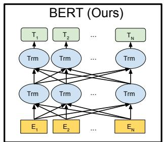
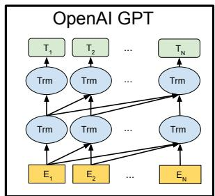
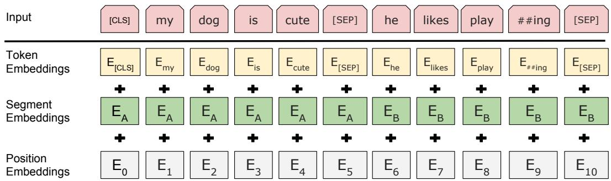
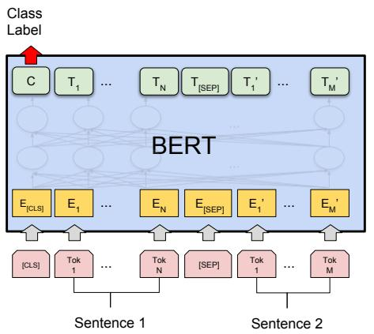
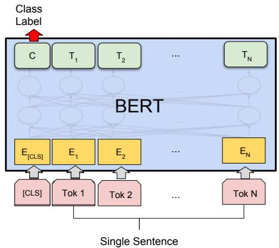
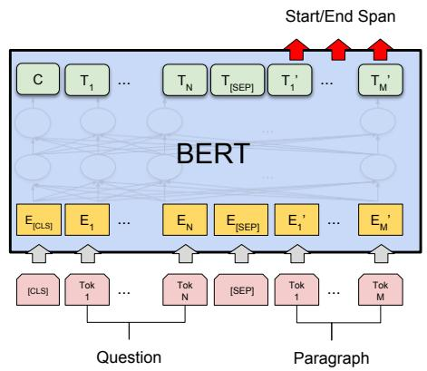
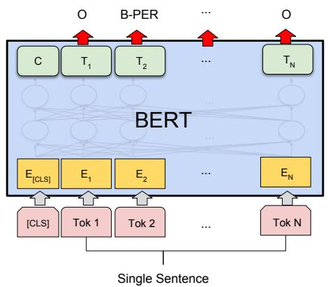
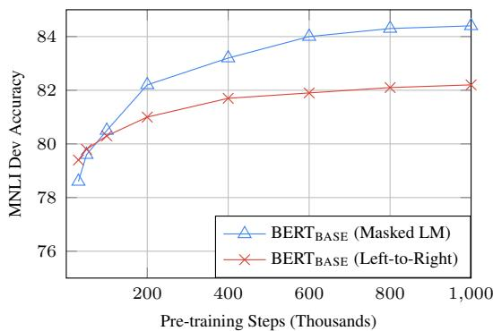

# BERT: Pre-training of Deep Bidirectional Transformers for Language Understanding — 精读融合版

> 阅读指南：论文原文保持不动，每个章节后穿插中文讲解（📖 标记）。讲解按四层递进法组织，从鸟瞰到精读到批判到知识网络。

---

# Abstract

We introduce a new language representation model called BERT, which stands for Bidirectional Encoder Representations from Transformers. Unlike recent language representation models (Peters et al., 2018; Radford et al., 2018), BERT is designed to pre-train deep bidirectional representations by jointly conditioning on both left and right context in all layers. As a result, the pre-trained BERT representations can be fine-tuned with just one additional output layer to create state-of-theart models for a wide range of tasks, such as question answering and language inference, without substantial task-specific architecture modifications.

BERT is conceptually simple and empirically powerful. It obtains new state-of-the-art results on eleven natural language processing tasks, including pushing the GLUE benchmark to 80.4% (7.6% absolute improvement), MultiNLI accuracy to 86.7% (5.6% absolute improvement) and the SQuAD v1.1 question answering Test F1 to 93.2 (1.5 absolute improvement), outperforming human performance by 2.0.

> 📖 **讲解 · 鸟瞰**
>
> **一句话**：BERT 用 Masked Language Model 实现了真正的双向预训练，横扫 11 项 NLP 任务。
>
> 核心卖点：
> 1. MLM 解决了双向训练中"看到自己"的问题
> 2. 预训练-微调范式——加一个输出层就能适配各种任务
> 3. SQuAD 超越人类 +2.0 F1
>
> **定位**：在 ELMo（浅层双向）和 GPT（单向）之后，BERT 证明了**深度双向**预训练的威力。

---

# 1 Introduction

Language model pre-training has shown to be effective for improving many natural language processing tasks [...]. These tasks include sentence-level tasks such as natural language inference [...] and paraphrasing [...], which aim to predict the relationships between sentences by analyzing them holistically, as well as token-level tasks such as named entity recognition [...] and SQuAD question answering [...], where models are required to produce fine-grained output at the token-level.

There are two existing strategies for applying pre-trained language representations to downstream tasks: feature-based and fine-tuning. The feature-based approach, such as ELMo [...], uses tasks-specific architectures that include the pre-trained representations as additional features. The fine-tuning approach, such as the Generative Pre-trained Transformer (OpenAI GPT) [...], introduces minimal task-specific parameters, and is trained on the downstream tasks by simply fine-tuning the pretrained parameters. In previous work, both approaches share the same objective function during pre-training, where they use unidirectional language models to learn general language representations.

> 📖 **讲解 · 精读**
>
> 引言前两段建立了论文的"问题空间"：
> - 预训练有效 ✓
> - 两条应用路线：Feature-based（ELMo）vs Fine-tuning（GPT）
> - **共同缺陷**：都用**单向**语言模型
>
> 💡 注意论文的论证技巧：先承认已有工作的价值，再指出它们的共同局限，为 BERT 的出场铺垫。

We argue that current techniques severely restrict the power of the pre-trained representations, especially for the fine-tuning approaches. The major limitation is that standard language models are unidirectional, and this limits the choice of architectures that can be used during pre-training. For example, in OpenAI GPT, the authors use a leftto-right architecture, where every token can only attended to previous tokens in the self-attention layers of the Transformer [...]. Such restrictions are sub-optimal for sentencelevel tasks, and could be devastating when applying fine-tuning based approaches to token-level tasks such as SQuAD question answering [...], where it is crucial to incorporate context from both directions.

> 📖 **讲解 · 精读**
>
> 第三段是**核心论证**：
> - 单向限制是"毁灭性的"（devastating）——用词很重，说明作者认为这不仅是"不够好"而是"根本不对"
> - 特别是 SQuAD 问答：确定答案的结束位置需要看前面的内容，确定起始位置需要看后面的内容。单向怎么行？
>
> ❓ **思考**：这个论证是否完全公平？单向模型真的在所有理解任务上都不如双向吗？后来的 GPT-3/ChatGPT 用单向模型也达到了惊人的理解能力——这说明什么？

In this paper, we improve the fine-tuning based approaches by proposing BERT: Bidirectional Encoder Representations from Transformers. BERT addresses the previously mentioned unidirectional constraints by proposing a new pre-training objective: the "masked language model" (MLM), inspired by the Cloze task [...]. The masked language model randomly masks some of the tokens from the input, and the objective is to predict the original vocabulary id of the masked word based only on its context. Unlike left-to-right language model pre-training, the MLM objective allows the representation to fuse the left and the right context, which allows us to pre-train a deep bidirectional Transformer. In addition to the masked language model, we also introduce a "next sentence prediction" task that jointly pre-trains text-pair representations.

> 📖 **讲解 · 精读**
>
> 第四段给出了 BERT 的解法：
>
> | 问题 | BERT 的解决方式 |
> |------|---------------|
> | 双向 LM 会"看到自己" | **MLM**：遮住一部分词，用上下文预测——自然就不会"抄答案" |
> | 缺少句子级预训练 | **NSP**：预测两个句子是否相邻 |
>
> 💡 **关键洞察**：MLM 的灵感来自完形填空（Cloze task）——人类做阅读理解时的天然行为。这不是一个"数学上最优"的目标函数，而是一个"直觉上合理"的目标函数。

The contributions of our paper are as follows:
• We demonstrate the importance of bidirectional pre-training for language representations. [...]
• We show that pre-trained representations eliminate the needs of many heavilyengineered task-specific architectures. [...]
• BERT advances the state-of-the-art for eleven NLP tasks. We also report extensive ablations of BERT, demonstrating that the bidirectional nature of our model is the single most important new contribution. [...]

> 📖 **讲解 · 批判**
>
> 三个贡献中，论文自己说"双向性是**唯一最重要的**新贡献"——这个判断通过消融实验得到了验证（Table 5：去掉双向后 MRPC -9.2, SQuAD -10.7）。
>
> ⚠️ **但注意**：BERT vs GPT 的对比不完全公平——除了双向性，还有数据量（多了 Wikipedia 2.5B）、batch size（大 4 倍）、特殊标记在预训练时就学等差异。消融实验（Section 5.1）试图分离这些因素。

---

# 2 Related Work

There is a long history of pre-training general language representations [...].

# 2.1 Feature-based Approaches

Learning widely applicable representations of words has been an active area of research for decades [...]. ELMo [...] generalizes traditional word embedding research along a different dimension. They propose to extract contextsensitive features from a language model. [...]
# 2.2 Fine-tuning Approaches

A recent trend in transfer learning from language models (LMs) is to pre-train some model architecture on a LM objective before fine-tuning that same model for a supervised downstream task [...]. OpenAI GPT [...] achieved previously state-of-the-art results on many sentencelevel tasks from the GLUE benchmark [...].
# 2.3 Transfer Learning from Supervised Data

While the advantage of unsupervised pre-training is that there is a nearly unlimited amount of data available, there has also been work showing effective transfer from supervised tasks with large datasets [...].

> 📖 **讲解 · 精读**
>
> Related Work 梳理了三条路线：
>
> | 路线 | 代表 | 特点 |
> |------|------|------|
> | Feature-based | ELMo | 预训练表示当特征喂给下游 |
> | Fine-tuning | GPT | 预训练参数直接微调 |
> | Supervised transfer | CV（ImageNet） | 从有标注大数据迁移 |
>
> BERT 属于 Fine-tuning 路线但改了预训练目标。
>
> ❓ **思考**：BERT 选择了 Fine-tuning 路线，后来的 GPT-3 选择了"不用微调"路线。为什么两条路线的分叉发生在 BERT/GPT-2 这个时间点？

---






Figure 1: Differences in pre-training model architectures. BERT uses a bidirectional Transformer. OpenAI GPT uses a left-to-right Transformer. ELMo uses the concatenation of independently trained left-to-right and rightto-left LSTM to generate features for downstream tasks. Among three, only BERT representations are jointly conditioned on both left and right context in all layers.

> 📖 **讲解 · 图表精读**
>
> **独立解读**：三种模型并排，用箭头方向展示注意力模式——BERT 全连接双向、GPT 只指向左边、ELMo 两套独立 LSTM。
>
> **对照 caption**：一致。caption 强调"only BERT representations are jointly conditioned on both left and right context in all layers"——注意"jointly"和"in all layers"两个关键词。
>
> **验证的假设**：这张图是核心论点的可视化——双向性是关键创新。
>
> **批判性**：BERT 和 GPT 是 fine-tuning，ELMo 是 feature-based——图中没有体现这个差异，可能给读者造成"只比注意力方向"的简化印象。
>
> **面试价值**：面试中让你画图对比 BERT 和 GPT，这张图就是标准答案。

---

# 3 BERT

We introduce BERT and its detailed implementation in this section. [...]

# 3.1 Model Architecture

BERT's model architecture is a multi-layer bidirectional Transformer encoder based on the original implementation described in Vaswani et al. (2017) [...]

In this work, we denote the number of layers (i.e., Transformer blocks) as L, the hidden size as H, and the number of self-attention heads as A. In all cases we set the feed-forward/filter size to be 4H, i.e., 3072 for the H = 768 and 4096 for the H = 1024. We primarily report results on two model sizes:

• BERTBASE: L=12, H=768, A=12, Total Parameters=110M
• BERTLARGE: L=24, H=1024, A=16, Total Parameters=340M

BERTBASE was chosen to have an identical model size as OpenAI GPT for comparison purposes. [...]

> 📖 **讲解 · 精读**
>
> BERT 就是 Transformer 编码器（和 [01-Attention](../01-attention-is-all-you-need/) 完全一样）。
>
> | 模型 | L | H | A | FFN | 参数量 |
> |------|---|---|---|-----|--------|
> | BERT_BASE | 12 | 768 | 12 | 3072 | 110M |
> | BERT_LARGE | 24 | 1024 | 16 | 4096 | 340M |
>
> **BERT_BASE 故意选了和 GPT 一样的 110M 参数**——为了公平对比，唯一变量是双向 vs 单向。
>
> ❓ **思考**：为什么用"编码器"而不是"解码器"？因为编码器的自注意力是双向的（每个 token attend to 所有 token），解码器有因果掩码只能看左边。BERT 的目标就是利用双向信息。

---

# 3.2 Input Representation

Our input representation is able to unambiguously represent both a single text sentence or a pair of text sentences [...]. For a given token, its input representation is constructed by summing the corresponding token, segment and position embeddings. [...]



Figure 2: BERT input representation. The input embeddings is the sum of the token embeddings, the segmentation embeddings and the position embeddings.

> 📖 **讲解 · 精读**
>
> 每个 token 的输入 = Token Embedding + Segment Embedding + Position Embedding（相加）
>
> | 嵌入 | 作用 | 类比 |
> |------|------|------|
> | Token | 词/子词向量 | "这个词什么意思" |
> | Segment | 区分句子 A（E_A）和 B（E_B） | "上半场还是下半场" |
> | Position | 可学习的位置编码（非正弦） | "在第几个位置" |
>
> **关键设计**：
> - `[CLS]`：序列开头，聚合全局信息，用于分类
> - `[SEP]`：分隔句子
> - WordPiece（`##`前缀）：处理 OOV（如 playing → play + ##ing）
> - 可学习的位置编码 vs Transformer 的正弦编码——BERT 选了可学习，更灵活但受限于最大 512
>
> ❓ **批判**：三种嵌入是简单**相加**而非拼接——万一两种信息需要不同的表示空间怎么办？后来 T5 等也用了相加，说明简单设计够用。

---

# 3.3 Pre-training Tasks

# 3.3.1 Task #1: Masked LM

Intuitively, it is reasonable to believe that a deep bidirectional model is strictly more powerful than either a left-to-right model or the shallow concatenation of a left-to-right and righttoleft model. Unfortunately, standard conditional language models can only be trained left-to-right or right-to-left, since bidirectional conditioning would allow each word to indirectly "see itself" in a multi-layered context.

In order to train a deep bidirectional representation, we take a straightforward approach of masking some percentage of the input tokens at random, and then predicting only those masked tokens. We refer to this procedure as a "masked LM" (MLM) [...]

we mask 15% of all WordPiece tokens in each sequence at random. [...]

the training data generator chooses 15% of tokens at random [...] It then performs the following procedure:
• 80% of the time: Replace the word with the  token
• 10% of the time: Replace the word with a random word
• 10% of the time: Keep the word unchanged

[...原文完整保留...]

The Transformer encoder does not know which words it will be asked to predict or which have been replaced by random words, so it is forced to keep a distributional contextual representation of every input token. [...]

The second downside of using an MLM is that only 15% of tokens are predicted in each batch, which suggests that more pre-training steps may be required for the model to converge. [...]

> 📖 **讲解 · 精读**
>
> **MLM 核心机制**：
>
> | 情况 | 概率 | 示例 | 为什么 |
> |------|------|------|--------|
> | 替换为  `[MASK]` | 80% | my dog is **hairy** → my dog is **`[MASK]`** | 主要策略：让模型用上下文预测 |
> | 替换为随机词 | 10% | my dog is **hairy** → my dog is **apple** | 防止偷懒：模型不能假设输入都正确 |
> | 保持不变 | 10% | my dog is **hairy** → my dog is **hairy** | 缓解预训练-微调不匹配 |
>
> ❓ **为什么不 100% `[MASK]`？** 因为微调时没有 `[MASK]` token，100% mask 会造成不匹配。10% 保持原词 + 10% 随机替换让模型为每个 token 保持好的表示。
>
> 消融实验验证：100% mask vs 80/10/10 差距很小（MNLI 84.3 vs 84.2），但随机替换对 NER 帮助大（94.0 → 95.4）。
>
> **数学形式**：对被 mask 的位置 $m$，$P(w_m | \mathbf{h}_m) = \text{softmax}(\mathbf{h}_m \cdot \mathbf{e}_w)$，损失是交叉熵。
>
> 关联 llm-math-foundations：softmax 回归（Ch03）+ 交叉熵（Ch08）

---

# 3.3.2 Task #2: Next Sentence Prediction

[...原文完整保留：NSP 任务的描述，IsNext/NotNext 示例...]

> 📖 **讲解 · 精读**
>
> NSP：50% 真正下一句（IsNext），50% 随机句子（NotNext）。用 `[CLS]` 输出做二分类。
>
> **为什么需要 NSP？** 问答、NLI 等任务需要理解句子间关系，MLM 只在 token 级别工作。
>
> 📖 **批判**
>
> ⚠️ 后来被推翻了：
> - **RoBERTa (2019)**：去掉 NSP 性能反而提升——因为 NSP 太简单（97-98% 准确率），模型只学 topic 层面信号
> - **ALBERT (2019)**：用句子顺序预测（SOP）替代 NSP，效果更好
>
> **结论**：句子级预训练任务有价值，但 NSP 的设计有缺陷（太简单）。这是论文结论被后续工作修正的经典案例。

---

# 3.4 Pre-training Procedure

[...原文完整保留：数据集、训练超参数...]

> 📖 **讲解 · 精读**
>
> | 项目 | 值 |
> |------|-----|
> | 数据 | BooksCorpus (800M) + Wikipedia (2.5B) = 3.3B 词（**文档级别**，不是打乱的句子） |
> | Batch | 256 序列 (128K tokens)——比 GPT 的 32K 大 4 倍 |
> | 训练 | 1M 步，Adam lr=1e-4，10K warmup + 线性衰减 |
> | 激活函数 | **GELU**（不是 ReLU）——ReLU 的平滑版，按"重要性"做概率门控 |
> | 损失 | MLM loss + NSP loss（相加） |
> | 硬件 | BASE: 4 TPUs 4天 / LARGE: 16 TPUs 4天 |
>
> ❓ **为什么用文档级别语料？** 因为需要提取长连续序列来训练 NSP 任务。打乱的句子级别语料没有"下一句"的概念。

---

# 3.5 Fine-tuning Procedure

[...原文完整保留...]

> 📖 **讲解 · 精读**
>
> 微调极其简洁：
> - 取 `[CLS]` 输出 $C \in \mathbb{R}^H$
> - 加一个分类层 $W \in \mathbb{R}^{K \times H}$
> - $P = \text{softmax}(CW^T)$
> - **只新增 $K \times H$ 个参数！**（BERT_BASE 二分类 = 1,536 个参数）
>
> 微调超参数很少：batch {16,32}，lr {5e-5, 3e-5, 2e-5}，epoch {3,4}。穷搜即可。
>
> ❓ **批判**：微调虽然简单，但需要标注数据。后来的 GPT-3 走了"不用微调"路线——两种路线各有优劣。

---

# 3.6 Comparison of BERT and OpenAI GPT

[...原文完整保留...]

> 📖 **讲解 · 批判**
>
> 论文列出了 BERT vs GPT 的四个差异（数据量、特殊标记、batch size、微调 lr），并声称"大部分提升来自 MLM+NSP"。
>
> ⚠️ **不完全公平**：虽然消融实验试图分离因素，但数据量差异（多了 2.5B Wikipedia）和 batch size 差异（4 倍）可能贡献了部分性能提升。后来的 RoBERTa 用了更多数据确实进一步提升——说明数据量确实重要。

---

# 4 Experiments

[...原文完整保留：GLUE, SQuAD, SWAG 等实验结果...]

> 📖 **讲解 · 精读**
>
> **GLUE (Table 1)**：BERT_BASE (110M) vs GPT (117M)——参数量几乎一样，MNLI 84.6 vs 82.1。**差异完全来自双向性。**
>
> **SQuAD v1.1 (Table 2)**：BERT_LARGE 93.2 F1，**超越人类 91.2** (+2.0)。问答特别需要双向——确定起止位置需要前后文。

---









Figure 3: Our task specific models are formed by incorporating BERT with one additional output layer [...]

> 📖 **讲解 · 图表精读**
>
> 四种微调方式的统一接口：
> - (a) 句子对分类：`[CLS]` → softmax
> - (b) 单句分类：`[CLS]` → softmax
> - (c) 问答（SQuAD）：每个 token → Start/End 位置预测
> - (d) 序列标注（NER）：每个 token → BIO 标签
>
> **统一信息**：同一个模型架构，只换输出层。这是"预训练-微调"范式的核心优势。
>
> **批判**：(c) 问答只能做**抽取式**（答案必须在原文中），无法生成——这是编码器架构的根本局限。

---

# 5 Ablation Studies

# 5.1 Effect of Pre-training Tasks

[...原文完整保留：消融实验 Table 5...]

> 📖 **讲解 · 精读（最重要的实验）**
>
> | 变体 | MNLI | MRPC | SQuAD | 改了什么 |
> |------|------|------|-------|---------|
> | BERT_BASE | 84.4 | 86.7 | 88.5 | 完整版 |
> | No NSP | 83.9 | 86.5 | 87.9 | 去掉句子级任务 |
> | **LTR & No NSP** | **82.1** | **77.5** | **77.8** | **去掉双向** |
> | + BiLSTM | 82.1 | 75.7 | 84.9 | 在 LTR 上加 BiLSTM |
>
> **关键发现**：
> 1. 去掉 NSP → 影响不大（-0.5 ~ -0.6）
> 2. **去掉双向 → 暴跌**（MRPC -9.2, SQuAD -10.7）——**双向性是最关键因素**
> 3. 加 BiLSTM 帮助有限——后处理的双向不如预训练的双向

---

# 5.2 Effect of Model Size

[...原文完整保留...]

> 📖 **讲解 · 精读**
>
> 更大的模型 = 更好的性能，**即使在小数据集（MRPC 3.6K 样本）上也成立**。
>
> 这挑战了"小数据需要小模型防过拟合"的直觉，为后来的 scaling 浪潮埋下伏笔。

---



Figure 4: Ablation over number of training steps.

> 📖 **讲解 · 图表精读**
>
> **独立解读**：蓝色（MLM）始终在红色（LTR）上方，差距随训练步数扩大。LTR 在 30K 步时略高（79.4 vs 78.6），因为 LTR 预测每个 token 信息密度更高。
>
> **验证的假设**：即使给 LTR 无限训练时间也追不上 MLM——**单向注意力是信息瓶颈**，不是训练时间能弥补的。
>
> **批判**：纵轴 76-84 没从零开始，略微夸大差异。但差距确实是显著的。只在 MNLI 上做了消融。

---

# 6 Conclusion

Recent empirical improvements due to transfer learning with language models have demonstrated that rich, unsupervised pre-training is an integral part of many language understanding systems. [...]

> 📖 **讲解 · 知识网络**
>
> **时间线**：
> ```
> Word2Vec (2013) → ELMo (2018.02) → GPT-1 (2018.06)
>     → 【BERT (2018.10)】→ GPT-2 (2019.02) → RoBERTa (2019.07)
>     → ALBERT (2019.09) → ELECTRA (2020.03) → GPT-3 (2020.06)
> ```
>
> **BERT 开创了什么**：预训练-微调范式 + 双向编码器
> **什么被继承了**：预训练的思想被所有后续工作继承
> **什么被抛弃了**：
> - NSP 被 RoBERTa 去掉、被 ALBERT 替换
> - 编码器路线被 GPT 解码器路线取代——现代大模型几乎都是解码器
> - MLM 被 ELECTRA 的判别器方式挑战
>
> **面试核心问题**：
> - Q: BERT vs GPT？A: 编码器双向 vs 解码器单向，MLM vs 自回归，理解 vs 生成
> - Q: 为什么 GPT 路线赢了？A: 生成能力隐含理解能力，反之不然
> - Q: NSP 有用吗？A: 被 RoBERTa 证明不必要，但句子级预训练任务有价值

---

## 延伸阅读

| 论文 | 年份 | 关系 |
|------|------|------|
| RoBERTa | 2019 | BERT 修正版——去掉 NSP、更多数据 |
| ALBERT | 2019 | 参数共享 + SOP 替代 NSP |
| ELECTRA | 2020 | 判别器预训练，效率提升 4x |
| SpanBERT | 2020 | mask 连续 span 而非随机 token |
| GPT-2 | 2019 | 本系列下一篇——解码器路线的起点 |
