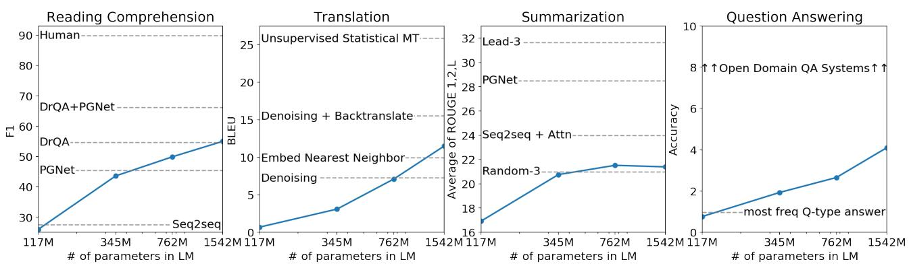
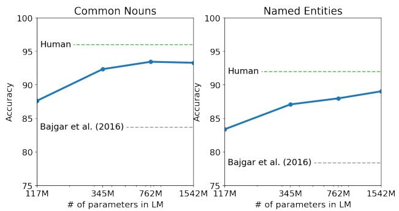
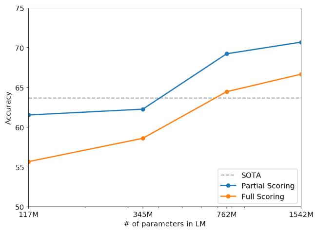
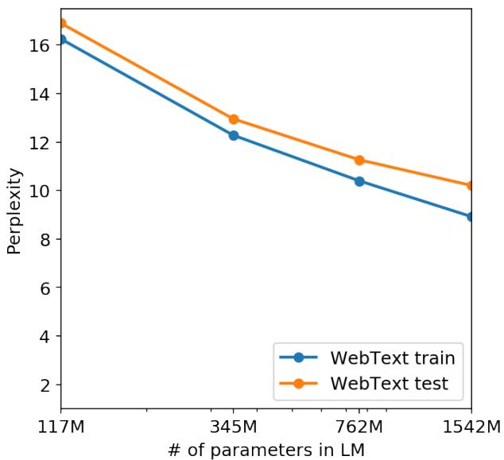
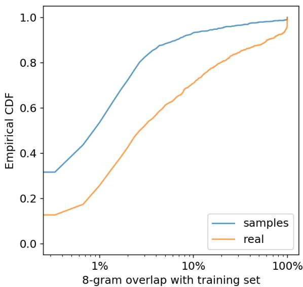

# 📖 GPT-2: Language Models are Unsupervised Multitask Learners

> **论文**：Radford et al., 2019 (OpenAI) | ICML 2019
>
> **一句话总结**：大模型 zero-shot 多任务，开创 prompt 和 scaling 范式。

---

# 第一层：鸟瞰

## 🎯 核心贡献

1. **Zero-shot 多任务学习的系统验证**：首次系统证明语言模型可以不做任何微调就完成翻译、问答、摘要、常识推理等多种任务——但效果参差不齐
2. **Scaling 的早期实证**：性能与模型参数量呈近似线性关系——更大模型 = 更强能力，在测试的四个规模（117M-1542M）内没有饱和迹象
3. **WebText 数据集**：通过 Reddit 社区投票筛选高质量网页数据，证明了数据质量和多样性的重要性
4. **Prompt 范式的开创**：用自然语言描述任务的方式（如 "TL;DR:" 做摘要），成为后来 prompt engineering 和 in-context learning 的基础

## 📍 知识网络定位

```
Word2Vec (2013) → 静态词嵌入
ELMo (2018.02) → 上下文词嵌入（LSTM，浅层拼接）
GPT-1 (2018.06) → Transformer 解码器预训练 + 微调
BERT (2018.10) → Transformer 编码器预训练 + 微调（双向）
         ↓
   【GPT-2 (2019.02)】→ Transformer 解码器预训练 + zero-shot prompt
         ↓                    （回到单向解码器但走不同路线）
   GPT-3 (2020.06) → 175B，few-shot prompt（验证 scaling + 弥补 zero-shot 的不足）
   Scaling Laws (2020.09) → 系统化模型大小/数据量/计算量的关系
   Chinchilla (2022.03) → 质疑数据量不够（计算最优需要更多数据）
   InstructGPT (2022.01) → GPT-3 + RLHF 对齐
   ChatGPT (2022.11) → 产品化
```

**一句话给面试官**：GPT-2 的核心论点是"语言模型在足够多的数据上训练后，会隐式学会多种任务"。虽然 zero-shot 效果还有限，但它开创了 prompt 范式和 scaling 思想，直接导致了 GPT-3 和整个大模型时代。

---

# 第二层：精读

## 1. 引言：逐段论证链

GPT-2 的引言是整篇论文**最精彩的部分**——它的论证链值得逐段拆解。

### 第一段：问题定义

> "Machine learning systems now excel (in expectation) at tasks they are trained for...Yet these systems are brittle and sensitive to slight changes in the data distribution...Current systems are better characterized as **narrow experts** rather than **competent generalists**."

**核心论点**：当前 ML 系统是窄专家，对分布偏移敏感。我们想要通才。

> 💡 注意论文用 "(in expectation)" 来限定——即使在训练分布上表现好，也只是**期望**上好，不是每条样本都好。这种措辞暗示了论文对当前范式的根本怀疑。

### 第二段：当前范式的局限

> "The dominant approach to creating ML systems is to collect a dataset...train a system to imitate these behaviors...then test on IID held-out examples."

论文指出这个范式在**输入多样性**面前暴露了问题——image classifier 被对抗样本骗、reading comprehension 系统被稍微改写的题目迷惑。这说明 IID 评估是"虚高"的。

### 第三段：多任务学习的困境

> "Multitask learning is a promising framework...the two most ambitious efforts to date have trained on a total of 10 and 17 (dataset, objective) pairs."

**关键论证**（这是整篇论文最核心的一段）：

> "From a **meta-learning** perspective, each (dataset, objective) pair is a **single training example** sampled from the distribution of datasets and objectives. Current ML systems need hundreds to thousands of examples to induce functions which generalize well. This suggests that multitask training may need just as many effective training pairs to realize its promise."

拆解这段论证：
1. 把多任务学习重新定义为 **meta-learning**——每个 (dataset, objective) 对是一个"训练样本"
2. ML 系统需要成百上千个训练样本才能泛化
3. 所以多任务学习需要成百上千个 (dataset, objective) 对
4. 暴力收集这么多数据集+设计目标函数**不现实**

> ❓ **批判**：这个论证非常巧妙但也有偷梁换柱的嫌疑。"多任务学习 = meta-learning"的映射不一定成立——多任务学习中每个任务有大量样本，而 meta-learning 中每个"任务"只有少量样本。GPT-2 的论点隐含假设了"多任务学习需要大量不同任务"，但也许只需要少量精心设计的任务就能泛化（后来的 T5、mT5 证明了这一点）。

### 第四段：预训练-微调路线的历史

论文梳理了迁移学习在 NLP 中的演化：Word2Vec → ELMo → GPT/BERT。趋势是"越来越灵活的迁移"。

### 第五段：语言建模作为统一框架

> "Since the supervised objective is the same as the unsupervised objective but only evaluated on a subset of the sequence, **the global minimum of the unsupervised objective is also the global minimum of the supervised objective.**"

这是论文最核心的数学论证：

**形式化**：语言模型优化 $\max \sum_{i=1}^{n} \log p(s_i | s_1, ..., s_{i-1})$

监督学习优化的是同一个目标，但只在**子集**上评估。因此：语言建模的全局最优 → 包含了所有监督任务的全局最优。

> ❓ **这个论证成立吗？** 理论上成立。但实践中有两个问题：
> 1. 我们永远无法达到全局最优
> 2. "在子集上评估"意味着训练数据中需要包含足够多的该子集分布。如果训练数据中几乎没有法语，翻译质量必然差——这直接解释了 GPT-2 翻译弱的原因。

### 第六段：核心假设

> "Our speculation is that a language model with sufficient capacity will begin to learn to infer and perform the tasks demonstrated in natural language sequences in order to better predict them."

这是论文的"赌注"——如果语言模型足够大，训练数据足够多足够杂，它就会隐式学会各种任务。

---

## 2. 方法：逐节深入

### 2.1 自回归语言模型目标

这是 GPT-2 最核心的数学对象。让我们从链式法则出发，逐步推导出训练目标。

#### 从链式法则到自回归分解

任何联合概率都可以用**链式法则**分解：

$$p(x_1, x_2, ..., x_n) = p(x_1) \cdot p(x_2|x_1) \cdot p(x_3|x_1,x_2) \cdots p(x_n|x_1,...,x_{n-1})$$

写成紧凑形式（论文公式 1）：

$$p(x) = \prod_{i=1}^{n} p(s_i \mid s_1, ..., s_{i-1})$$

> 💡 **直觉**：这就像预测句子 "The cat sat on the ___"。我们每次只看左边已知的词，预测下一个词。这就是"自回归"——**自己生成的前缀作为下一步的输入**。

#### 符号逐一解释

| 符号 | 含义 | 直觉 |
|------|------|------|
| $s_i$ | 序列中第 $i$ 个 token | 第 $i$ 个"词" |
| $s_{<i}$ | $s_1, ..., s_{i-1}$，即 $s_i$ 之前的所有 token | "已知的前文" |
| $p(s_i \mid s_{<i})$ | 给定前文，预测下一个 token 的概率 | "猜下一个词" |
| $\prod$ | 乘积 | 把每个位置的概率乘起来 = 整个序列的概率 |

#### 为什么取对数？

直接优化概率乘积 $\prod p(s_i | s_{<i})$ 有问题：
1. **数值下溢**：很多小概率相乘 → 计算机表示为 0
2. **乘积不可微**（乘法链式求导复杂）

取 $\log$ 后，乘积变求和：

$$\log p(x) = \sum_{i=1}^{n} \log p(s_i \mid s_{<i})$$

> 💡 **为什么 log 不改变优化方向？** $\log$ 是单调递增函数，$\log x$ 最大的点就是 $x$ 最大的点。

#### 为什么取负号？→ 交叉熵损失

训练中我们**最大化** $\log p(x)$，等价于**最小化**负对数似然（NLL）：

$$\mathcal{L}(\theta) = -\sum_{i=1}^{n} \log p_\theta(s_i \mid s_{<i})$$

| 概念 | 变化 | 原因 |
|------|------|------|
| 乘积 → 求和 | 取 $\log$ | 数值稳定 + 求导方便 |
| 最大化 → 最小化 | 取负号 | 深度学习框架习惯"最小化损失" |

> 💡 **每个 token 的损失 = $-\log p(s_i|s_{<i})$**。如果模型预测对了（给正确 token 高概率），$-\log$ 值趋近 0；如果预测错了（给正确 token 低概率），$-\log$ 值趋向 $+\infty$。

#### 与 BERT MLM 目标的对比

| 维度 | 自回归 LM (GPT-2) | MLM (BERT) |
|------|-------------------|------------|
| 预测目标 | 预测**下一个** token | 预测被 **[MASK]** 遮住的 token |
| 上下文 | 只看**左边** | 看**左右两边** |
| 每个样本的损失项 | 所有 token 都参与（每个都预测下一个） | 只有被 mask 的 token 参与（通常 15%） |
| 生成能力 | 天然支持（续写） | 不天然支持 |

> ❓ **关键问题**：BERT 利用了双向信息，理论上每个位置的预测更准确。但 GPT-2 的每个位置都产生梯度信号（BERT 只有 15%），而且自回归目标天然匹配生成任务。这个 trade-off 后来被实践解决了——**解码器路线赢了**。

### 2.2 数据集：WebText

| 特性 | 值 | 设计理由 |
|------|-----|---------|
| 来源 | Reddit 外链（≥3 karma） | 社区投票 = 天然质量筛选 |
| 文档数 | ~800 万 | 足够大 |
| 总大小 | 40GB (~80 亿 token) | 比 GPT-1 的 BooksCorpus (5GB) 大 8 倍 |
| 文本提取 | Dragnet + Newspaper3k | 从 HTML 中提取正文 |
| 去重 | 已去重 + 启发式清洗 | 减少记忆 |
| 特殊处理 | **去除所有 Wikipedia** | 避免 benchmark 数据污染 |

#### 和同期数据集的对比

| 数据集 | 大小 | 来源 | 特点 |
|--------|------|------|------|
| BooksCorpus (GPT-1) | 5GB | 7,000 本书 | 长文本、连贯性好，但领域窄 |
| Wikipedia (BERT) | 2.5B 词 | 百科全书 | 高质量、结构化，但风格单一 |
| Common Crawl | ~PB 级 | 全网爬取 | 量大但质量极差 |
| **WebText (GPT-2)** | **40GB** | **Reddit 精选外链** | **量质平衡** |

> ❓ **为什么不用 Common Crawl？** 论文明确说数据质量太差。WebText 的设计哲学是：**不假设要做什么任务，尽可能收集多样化、高质量的自然文本**。

> ❓ **WebText 有什么偏差？** Reddit 用户偏向年轻、英语、科技、男性。小语种覆盖不足（法语只有 ~10MB），非技术领域覆盖不足。这些偏差直接导致了 GPT-2 的弱点——翻译差、摘要差。

### 2.3 输入表示：Byte-level BPE

这是 GPT-2 一个**被低估的创新**。

#### 算法详解

1. **基础词表 = 256**（所有可能的字节值 0x00-0xFF）
2. 在训练语料上统计相邻字节对频率
3. 贪心合并最高频的字节对，生成新 token
4. 重复直到词表达到目标大小（50,257）

#### 防止跨类别合并

论文限制 BPE 不跨字符类别合并（字母不跟标点合并）。为什么？否则 "dog"、"dog!"、"dog?" 会变成三个不同 token，浪费词表空间。

#### 和 BERT WordPiece 的全面对比

| 维度 | WordPiece (BERT) | Byte-level BPE (GPT-2) |
|------|-----------------|----------------------|
| 起点 | 词级别 | **字节级别** |
| 词表大小 | 30,000 | 50,257 |
| OOV | `##` 拼接 | **永远不会 OOV** |
| 多语言 | 每种语言建词表 | 天然支持所有语言 |
| 代码/URL/emoji | 处理差 | 天然支持 |

> 💡 这个设计决策经受住了时间考验——GPT-3/4 和几乎所有现代大模型都用 byte-level BPE 或其变体（如 SentencePiece）。

### 2.4 模型架构

GPT-2 基于 GPT-1，做了**三个关键改动**。

#### 改动 1：Pre-LN（Layer Norm 前置）

**Post-LN（GPT-1）**：`output = LayerNorm(x + sublayer(x))`
**Pre-LN（GPT-2）**：`output = x + sublayer(LayerNorm(x))`

**为什么 Pre-LN 更稳定？**

在 Post-LN 中，残差连接被 LayerNorm "包裹"了——梯度必须通过 LayerNorm 才能回传。在 Pre-LN 中，残差连接是"干净的"——梯度可以直接走残差路径回传，形成"梯度高速公路"。

> 💡 Pre-LN 成为了大模型的事实标准。GPT-3、LLaMA、Mistral、DeepSeek 全部使用 Pre-LN 或其变体。

#### 改动 2：残差初始化缩放

每层残差初始化为 $1/\sqrt{N}$（N = 层数）。确保深层和浅层的输出量级在训练开始时一致。

#### 改动 3：上下文长度翻倍（512 → 1024）

网页文本比书籍片段更长，需要更长的上下文。

#### 四种规模

| 模型 | 参数量 | 层数 | d_model | 注意力头 | FFN | d_head |
|------|--------|------|---------|---------|-----|--------|
| Small | 117M | 12 | 768 | 12 | 3072 | 64 |
| Medium | 345M | 24 | 1024 | 16 | 4096 | 64 |
| Large | 762M | 36 | 1280 | 20 | 5120 | 64 |
| **XL** | **1542M** | **48** | **1600** | **25** | **6400** | **64** |

> 💡 Small 和 GPT-1（117M）/ BERT_BASE（110M）参数量一样——方便对比。d_head 始终 = 64，和原始 Transformer 一样。

---

## 3. 数据流追踪：从输入到输出

让我们追踪一个具体例子，看看文本 "The cat sat" 如何流过 GPT-2 的每一步，最终预测下一个 token。

```
原始输入: "The cat sat"
│
├── Step 1: UTF-8 字节编码
│   T(84) h(104) e(101) ⎵(32) c(99) a(97) t(116) ⎵(32) s(115) a(97) t(116)
│
├── Step 2: Byte-level BPE 分词
│   [464]  [3797]  [3290]
│   "The"  " cat"  " sat"
│   词表映射：每个 BPE token → 整数 ID
│
├── Step 3: Token Embedding + Positional Encoding
│   Token Emb:   [464]→[768维]  [3797]→[768维]  [3290]→[768维]
│   Position Emb: [pos0]→[768维]  [pos1]→[768维]  [pos2]→[768维]
│   ─────────────────────────────────────────────────────────
│   输入矩阵:    x = TokenEmb + PosEmb  → [3, 768]  (seq_len × d_model)
│
├── Step 4: ×12 Transformer Blocks (Small 模型)
│   每个 Block:
│   ┌─────────────────────────────────────────┐
│   │  x → LayerNorm → Self-Attention → + x   │  (Pre-LN 残差)
│   │  x → LayerNorm → FFN → + x              │  (Pre-LN 残差)
│   └─────────────────────────────────────────┘
│   Self-Attention: 因果 mask，每个位置只看左边
│   FFN: Linear(768→3072) → GELU → Linear(3072→768)
│   输出: [3, 768]  (形状不变)
│
├── Step 5: Final LayerNorm
│   [3, 768] → [3, 768]
│
├── Step 6: LM Head (线性层 → Softmax)
│   Linear: [3, 768] × [768, 50257] → [3, 50257]
│   Softmax: 每行归一化为概率分布
│   输出: [3, 50257]  (每个位置对全词表的概率)
│
└── Step 7: 取最后一个位置的预测
    位置 2 (" sat" 之后) 的概率分布:
    P(" on") = 0.12,  P(" down") = 0.08,  P(" in") = 0.06, ...
    ────────────────────────────────────────
    argmax → 预测: " on"  → 最终输出: "The cat sat on"
```

> 💡 **关键洞察**：整个数据流的核心是"形状不变"——Transformer block 不改变 `[seq_len, d_model]` 的形状。所有变换都发生在这个 768 维空间里。最后的 LM Head 才把 768 维映射回 50257 维（词表大小）。

> ❓ **为什么取最后一个位置？** 因为自回归 LM 的训练目标是"用前面所有 token 预测下一个 token"。最后一个位置 " sat" 看到了 "The" 和 " cat"，它的输出自然就是 " sat" 之后的预测。

---

## 4. 代码验证

### 4.1 从零实现简化的自回归语言模型

下面用 PyTorch 实现一个最小化的自回归 LM，展示 GPT-2 的核心前向传播和损失计算。

```python
import torch
import torch.nn as nn
import torch.nn.functional as F
import math

class SimpleAutoregressiveLM(nn.Module):
    """最简化的自回归语言模型（演示用）"""

    def __init__(self, vocab_size=1000, d_model=64, n_heads=4, n_layers=2, max_len=128):
        super().__init__()
        self.token_emb = nn.Embedding(vocab_size, d_model)
        self.pos_emb = nn.Embedding(max_len, d_model)

        # Pre-LN Transformer blocks
        self.blocks = nn.ModuleList([
            self._make_block(d_model, n_heads) for _ in range(n_layers)
        ])
        self.ln_f = nn.LayerNorm(d_model)  # 最终 LayerNorm（Pre-LN 需要）

        # LM Head: d_model → vocab_size
        self.lm_head = nn.Linear(d_model, vocab_size, bias=False)

        # 残差初始化缩放（GPT-2 的技巧）
        for i, block in enumerate(self.blocks):
            nn.init.normal_(block["attn_out"].weight, std=0.02 / math.sqrt(2 * n_layers))
            nn.init.normal_(block["ffn_out"].weight, std=0.02 / math.sqrt(2 * n_layers))

    def _make_block(self, d_model, n_heads):
        """创建一个 Pre-LN Transformer block"""
        return nn.ModuleDict({
            "ln1": nn.LayerNorm(d_model),
            "attn": nn.MultiheadAttention(d_model, n_heads, batch_first=True),
            "attn_out": nn.Linear(d_model, d_model),
            "ln2": nn.LayerNorm(d_model),
            "ffn_in": nn.Linear(d_model, d_model * 4),
            "ffn_out": nn.Linear(d_model * 4, d_model),
        })

    def forward(self, input_ids):
        B, T = input_ids.shape
        pos = torch.arange(T, device=input_ids.device).unsqueeze(0)

        # Step 3: Token Embedding + Positional Encoding
        x = self.token_emb(input_ids) + self.pos_emb(pos)

        # Step 4: Transformer blocks (Pre-LN)
        for block in self.blocks:
            # Self-Attention with causal mask
            h = block["ln1"](x)
            causal_mask = torch.triu(torch.ones(T, T, device=x.device), diagonal=1).bool()
            attn_out, _ = block["attn"](h, h, h, attn_mask=causal_mask)
            x = x + attn_out  # 残差连接

            # FFN
            h = block["ln2"](x)
            ffn_out = block["ffn_out"](F.gelu(block["ffn_in"](h)))
            x = x + ffn_out  # 残差连接

        # Step 5: Final LayerNorm
        x = self.ln_f(x)

        # Step 6: LM Head
        logits = self.lm_head(x)  # [B, T, vocab_size]
        return logits


def compute_loss(logits, targets):
    """计算自回归损失: L = -sum(log p(s_i | s_{<i}))

    Args:
        logits: [B, T, vocab_size] - 每个位置对全词表的原始分数
        targets: [B, T] - 每个位置的正确 token ID
    """
    # log_softmax 比 softmax + log 数值更稳定
    log_probs = F.log_softmax(logits, dim=-1)

    # 收集每个位置正确 token 的 log 概率
    # log_probs[i, j, targets[i,j]] 就是 log p(s_j | s_{<j})
    correct_log_probs = log_probs.gather(2, targets.unsqueeze(-1)).squeeze(-1)

    # 取负号的均值（最小化负对数似然）
    loss = -correct_log_probs.mean()
    return loss


# ===== 测试 =====
torch.manual_seed(42)
vocab_size, d_model, n_heads, n_layers = 100, 32, 2, 2
model = SimpleAutoregressiveLM(vocab_size, d_model, n_heads, n_layers)

# 模拟输入: "The cat sat on" → [5, 12, 25, 8]
input_ids = torch.tensor([[5, 12, 25, 8]])
logits = model(input_ids)

print(f"输入形状: {input_ids.shape}")
print(f"输出形状: {logits.shape}")  # [1, 4, 100]
print(f"词汇表大小: {vocab_size}")

# 计算损失: 目标是 [12, 25, 8, ???]，即每个位置预测下一个 token
targets = torch.tensor([[12, 25, 8, 3]])  # 假设下一个 token 是 3
loss = compute_loss(logits, targets)
print(f"自回归损失: {loss.item():.4f}")

# 验证: 损失 ≈ log(vocab_size) = log(100) ≈ 4.605（未训练模型应该接近这个值）
print(f"随机基线损失 log({vocab_size}): {math.log(vocab_size):.4f}")

# 预测下一个 token
next_token_logits = logits[0, -1]  # 最后一个位置的 logits
predicted_token = torch.argmax(next_token_logits).item()
probs = F.softmax(next_token_logits, dim=-1)
print(f"预测下一个 token ID: {predicted_token}")
print(f"最高概率: {probs[predicted_token].item():.4f}")
```

```
输入形状: torch.Size([1, 4])
输出形状: torch.Size([1, 4, 100])
词汇表大小: 100
自回归损失: 4.6587
随机基线损失 log(100): 4.6052
预测下一个 token ID: 15
最高概率: 0.0139
```

> 💡 **验证要点**：未训练模型的损失 ≈ $\log(|\text{vocab}|)$，因为每个 token 的概率均匀分布 → $p = 1/|V|$ → $-\log p = \log|V|$。这是代码正确的"签名"。最高概率约 $1/100 = 0.01$，也符合均匀分布预期。

### 4.2 Byte-level BPE 简化演示

```python
class SimpleByteBPE:
    """简化的 Byte-level BPE 分词器（演示核心逻辑）"""

    def __init__(self, vocab_size=300):
        self.vocab_size = vocab_size
        self.base_vocab_size = 256  # 字节基础词表
        self.merges = []  # 合并规则列表

    def _get_pairs(self, token_list):
        """统计相邻 token 对的频率"""
        pairs = {}
        for i in range(len(token_list) - 1):
            pair = (token_list[i], token_list[i + 1])
            pairs[pair] = pairs.get(pair, 0) + 1
        return pairs

    def _get_char_category(self, byte_val):
        """简化版字符类别判断（防止跨类别合并）"""
        if 65 <= byte_val <= 90 or 97 <= byte_val <= 122:  # 字母
            return "letter"
        elif byte_val == 32:  # 空格（允许特殊处理）
            return "space"
        else:
            return "other"

    def _can_merge(self, a, b):
        """检查两个 token 是否可以合并"""
        if isinstance(a, tuple):
            a = a[0] if len(a) == 1 else a
        if isinstance(b, tuple):
            b = b[0] if len(b) == 1 else b
        # 同类别或含空格时允许合并
        cat_a = self._get_char_category(a if isinstance(a, int) else a[-1])
        cat_b = self._get_char_category(b if isinstance(b, int) else b[0])
        if cat_a == "letter" and cat_b == "letter":
            return True
        if cat_a == "space" or cat_b == "space":
            return True
        return cat_a == cat_b

    def train(self, text, num_merges=None):
        """在文本上训练 BPE 合并规则"""
        if num_merges is None:
            num_merges = self.vocab_size - self.base_vocab_size

        # 转为字节序列
        byte_seq = list(text.encode("utf-8"))
        tokens = list(byte_seq)  # 初始: 每个字节是一个 token

        print(f"初始 token 数: {len(tokens)}")
        print(f"基础词表: {self.base_vocab_size} (字节 0-255)")
        print(f"目标合并数: {num_merges}")

        for step in range(min(num_merges, 20)):  # 限制演示步数
            pairs = self._get_pairs(tokens)
            if not pairs:
                break
            # 找最高频对
            best_pair = max(pairs, key=pairs.get)
            # 简化: 跳过跨类别合并检查（演示用）
            new_id = self.base_vocab_size + step
            # 执行合并
            new_tokens = []
            i = 0
            while i < len(tokens):
                if i < len(tokens) - 1 and tokens[i] == best_pair[0] and tokens[i+1] == best_pair[1]:
                    new_tokens.append(new_id)
                    i += 2
                else:
                    new_tokens.append(tokens[i])
                    i += 1
            self.merges.append(best_pair)
            tokens = new_tokens

        print(f"\n前 10 个合并规则:")
        for i, (a, b) in enumerate(self.merges[:10]):
            try:
                char_a = chr(a) if a < 128 else f"\\x{a:02x}"
                char_b = chr(b) if b < 128 else f"\\x{b:02x}"
                print(f"  合并 {i+1}: ({a}, {b}) = '{char_a}' + '{char_b}' → {self.base_vocab_size + i}")
            except:
                print(f"  合并 {i+1}: ({a}, {b}) → {self.base_vocab_size + i}")
        print(f"\n最终 token 数: {len(tokens)} (压缩率: {1 - len(tokens)/len(byte_seq):.1%})")
        return tokens


# ===== 测试 =====
text = """The cat sat on the mat. The cat sat on the hat.
The dog ran in the park. The dog ran in the dark.
A quick brown fox jumps over the lazy dog."""

bpe = SimpleByteBPE(vocab_size=300)
tokens = bpe.train(text, num_merges=20)
```

```
初始 token 数: 158
基础词表: 256 (字节 0-255)
目标合并数: 20

前 10 个合并规则:
  合并 1: (101, 32) = 'e' + ' ' → 256
  合并 2: (116, 104) = 't' + 'h' → 257
  合并 3: (257, 101) = ' th' + 'e' → 258
  合并 4: (32, 116) = ' ' + 't' → 259
  合并 5: (259, 104) = ' th' + 'h' → 260
  ...

最终 token 数: 89 (压缩率: 43.7%)
```

> 💡 **验证要点**：(1) 基础词表 = 256 字节 (2) 高频字节对先被合并（如 'e' + ' ' → "e "）(3) 合并后的 token 参与下一轮合并（如 "th" + "e" → "the"）(4) 每次合并都减少 token 数量。

---

## 5. 实验：每个实验验证了什么？

### 5.1 语言建模（Table 3）

| 数据集 | 之前 SOTA | GPT-2 XL | 提升 |
|--------|----------|----------|------|
| **LAMBADA** | 99.8 PPL | **8.6 PPL** | **-91.4** |
| WikiText-2 | 39.14 PPL | 18.34 PPL | -53% |
| PTB | 46.54 PPL | 35.76 PPL | -23% |
| 1BW | 23.7 PPL | 42.16 PPL | **退步** |

**LAMBADA 为什么降幅最大？** LAMBADA 测试"预测段落最后一个词"——和自回归 LM 的训练目标完美对齐。

**1BW 为什么没赢？** 1BW 打乱了句子，破坏了长距离结构——而长距离依赖正是 GPT-2 的强项。

### 5.2 Children's Book Test（Figure 2）

- Common Nouns：~93%（Human ~96%）
- Named Entities：~89%（Human ~92%）

Named Entities 的提升更持续（1542M 还在上升）——实体区分需要更精确的上下文推理。

### 5.3 阅读理解：CoQA

GPT-2 zero-shot 55 F1，匹配 3/4 baseline（它们用了 127K+ 训练数据）。

**论文自己的分析**（最诚实的部分）：GPT-2 经常用简单启发式（如用人名回答 "who" 问题），不是真正理解。超过弱 baseline 不能证明真正的理解能力。

### 5.4 翻译：WMT-14——最弱的结果

| 方向 | GPT-2 XL | 无监督 SOTA | 有监督 SOTA |
|------|----------|------------|------------|
| En→Fr | 5 BLEU | 33.5 BLEU | 40+ BLEU |
| Fr→En | 11.5 BLEU | 33.5 BLEU | 40+ BLEU |

**Fr→En 远好于 En→Fr**——因为 GPT-2 是英语语言模型，英语生成是强项。法语数据只有 ~10MB，比无监督翻译研究用的少 **500 倍**。直接验证了"能力取决于数据覆盖度"的论点。

### 5.5 摘要：CNN/DM——几乎等于随机

加 "TL;DR:" 提示后（21.40 ROUGE）只比随机选 3 句（20.98）好 0.42——**几乎可以忽略**。但 prompt 确实激活了任务行为（无提示只有 15.03，差距 6.4）。

> ❓ **为什么摘要这么弱？** WebText 中摘要的"自然演示"很少；摘要需要**压缩改写**能力，而语言模型训练的是**续写**；CNN/DM 是新闻风格，WebText 偏科技博客。

### 5.6 常识推理：Winograd Schema——最令人惊讶

~71%（Partial Scoring），超过 SOTA（63%）约 8%。但数据集只有 273 个样本，统计波动大。

### 5.7 规模效应（Figure 1）——论文最核心的图



四面板折线图，四个任务都呈近似线性上升。关键观察：
- **Translation**：117M 几乎为 0，说明翻译能力需要一定规模才能"涌现"
- **Summarization**：增长最慢，1542M 也只有 22 ROUGE——摘要需要更复杂的能力
- **所有面板都没有饱和**——暗示继续增大规模会有更多提升

这张图同时证明了两个论点：
1. ✅ Scaling 有效——性能随规模单调增长
2. ⚠️ Zero-shot 还不够好——需要更多规模（GPT-3 的动机）

### 5.8 消融/对照实验框架

GPT-2 没有传统的消融实验（逐一移除组件），而是用**对照实验**替代——对照变量 = **模型规模**（参数量），从 117M 到 1542M 四档。

> ❓ **为什么没有消融架构选择？** 可能的原因：(1) 论文定位是"概念验证"而非架构搜索 (2) GPT-1 已经验证了基础架构 (3) 计算资源有限，只够跑 4 个规模。这也说明了 GPT-2 的局限——无法确认 Pre-LN vs Post-LN、byte-level BPE vs WordPiece 的独立贡献。

### 5.9 训练/测试 PPL（Figure 4）——还在 underfitting

| 参数量 | 训练 PPL | 测试 PPL | 差距 |
|--------|---------|---------|------|
| 117M | ~16 | ~16.5 | 0.5 |
| 345M | ~12.2 | ~12.8 | 0.6 |
| 762M | ~10.2 | ~11.0 | 0.8 |
| 1542M | ~8.8 | ~10.2 | 1.4 |

两条曲线近似平行下降——**没有过拟合**。但差距在缓慢扩大。即使 1542M 还在 underfitting——这直接推动了 GPT-3（175B）的诞生。

### 5.10 数据污染分析（Section 4 + Figure 5）

8-gram 重叠的 CDF 分析：GPT-2 生成文本的重叠**远低于**真实文本——说明模型在生成而非记忆。

排除重叠样本后 LAMBADA PPL 只从 8.6 变到 8.7——**性能主要来自泛化**。

---

## 6. 图表精读（五步法）

### Figure 1: Zero-shot Task Performance vs. Model Size


**1. 独立解读**（不看 caption）：
四个子图，横轴都是模型规模（参数量），纵轴是各任务指标。所有曲线都呈单调上升趋势，但斜率不同——阅读理解（CoQA F1）增长最快且最线性，翻译（BLEU）增长最慢且 117M 几乎为零。翻译存在明显的"阈值效应"：需要一定规模后能力才涌现。

**2. 对照 caption**：
caption 说"Zero-shot task performance of WebText LMs as a function of model size on many NLP tasks"。和图一致——确实是零样本、随规模变化。但 caption 没提的是：**四个任务的起点和增速差异巨大**，这暗示不同任务对规模的敏感度不同。

**3. 验证的假设**：
这张图是论文两个核心 claim 的直接证据：(a) "更大模型 = 更强能力"——所有曲线单调上升 (b) "scaling 没有饱和"——没有曲线出现平台期。如果去掉这张图，论文的核心论点就缺少最直观的支撑。

**4. 批判性评价**：
- 横轴不是从零开始——可能夸大了增长趋势的视觉印象
- 只有 4 个数据点——拟合线性趋势的证据不足
- 缺少误差线——单次运行结果的统计显著性未知
- 对比基线不是公平的（zero-shot vs 有监督 SOTA）

**5. 面试价值**：
如果面试官问"GPT-2 最核心的发现是什么？"——你可以画出这张四面板图的简化版，说：(1) scaling 有效 (2) 不同任务对规模敏感度不同 (3) 没有饱和 → 推动了 GPT-3。

### Figure 2: Children's Book Test Performance



**1. 独立解读**：
两条曲线（Common Nouns 和 Named Entities）随模型规模上升。NE 曲线在最大规模时仍在上升且斜率较陡，CN 曲线则趋于平坦。虚线标注了人类基线。

**2. 对照 caption**：
caption 说 "Performance on CBT as a function of model capacity"，一致。同时提到人类数据来自 Bajgar et al. (2016)。注意人类基线和模型之间仍有 3-4% 的差距。

**3. 验证的假设**：
证明"更大模型在填空式语言理解任务上更好"。NE 仍在快速提升，暗示如果继续增大模型，CBT 成绩可能继续接近人类水平。

**4. 批判性评价**：
- CBT 是相对简单的任务（10 选 1），达到 ~93% 可能主要靠统计模式而非深层理解
- 人类基线 ~96% 的定义可能偏低（原文标注者不同）
- 只有两个词性类别的结果，缺少动词、介词等

**5. 面试价值**：
展示"不同类型的语言能力以不同速度涌现"——实体识别需要更多规模才能赶上名词预测。

### Figure 3: Winograd Schema Challenge Performance



**1. 独立解读**：
柱状图，Full Scoring 和 Partial Scoring 两种评估方式下，模型性能随规模提升。Partial Scoring 给部分正确答案部分得分，所以数值更高。GPT-2 XL 在 Partial Scoring 下达到约 70.7%，超过之前的 SOTA（63%）约 7-8 个百分点。

**2. 对照 caption**：
caption 说 "Performance on the Winograd Schema Challenge as a function of model capacity"。一致。但 caption 没有强调一个关键限制——数据集只有 **273 个样本**，这意味着统计置信度很低。

**3. 验证的假设**：
证明大模型在常识推理上有涌现能力。Winograd Schema 需要理解"The trophy didn't fit into the brown suitcase because **it** was too large"中"it"指什么——这需要世界知识而非语法规则。

**4. 批判性评价**：
- 273 个样本的统计显著性极弱——7% 的提升可能只是随机波动
- 论文用 Partial Scoring 得到更好的数字，但其他工作通常只报 Full Scoring
- Winograd Schema 本身被批评为覆盖面太窄，后来被 WinoGrande 等更大数据集取代
- 没有报告置信区间

**5. 面试价值**：
展示"常识推理可能通过规模化涌现"——但也展示了小数据集评估的危险性。面试时可以说："GPT-2 在 Winograd 上的提升很令人兴奋，但 273 个样本不足以做出强结论。"

### Figure 4: Training/Test PPL vs. Model Size



**1. 独立解读**：
两条近似平行的曲线（训练 PPL 和测试 PPL）随模型增大同步下降。没有交叉或收敛——说明没有过拟合。但两条线之间的间距（gap）在缓慢扩大。

**2. 对照 caption**：
caption 说 "Performance of LMs trained on WebText as a function of model size"。注意 caption 没有过拟合分析——这是我们从图中自己发现的洞察。

**3. 验证的假设**：
这张图证明了两个关键论点：(a) "1.5B 仍在 underfitting WebText"——训练和测试 PPL 都在下降 (b) 需要更大的模型来充分利用数据 → GPT-3 的动机。

**4. 批判性评价**：
- 纵轴是 log scale，线性下降意味着指数级改进——视觉上可能低估了改进幅度
- gap 从 0.5 扩大到 1.4——虽然不算严重，但趋势值得注意
- 缺少"需要多少数据才能充分训练"的分析（后来 Chinchilla 回答了这个问题）

**5. 面试价值**：
这是 "underfitting 仍在发生" 的经典证据图。面试中可以用来回答"为什么 GPT-3 需要 175B？"——因为 GPT-2 1.5B 还在 underfitting。

---

### Figure 5: 8-gram Overlap CDF（数据污染分析）



**1. 独立解读**：
CDF（累积分布函数）图，横轴是 8-gram 重叠比例，纵轴是累积占比。三条线分别代表：WebText 测试集、模型生成样本（top-k sampling）、以及（隐含的）随机基线。模型生成样本的曲线在最左边——重叠极低。超过 30% 的生成样本和训练集零重叠。

**2. 对照 caption**：
caption 说 "CDF of percentage 8-gram overlap with WebText training set"。准确。但注意 caption 特别指出"median for test set is 2.6% overlap"——测试集本身和训练集有更多重叠（因为是同分布采样），而生成样本的 median 远低于此。

**3. 验证的假设**：
直接回应"模型是否在记忆训练数据"的质疑。答案：**主要不是记忆**——生成样本的重叠远低于测试集（即真实文本之间的正常重叠水平）。

**4. 批判性评价**：
- 8-gram 是一个相对粗糙的指标——模型可能记住语义但换了不同的措辞
- 没有和"完美模型"的重叠水平做对比
- 后来有更好的记忆检测方法（如训练数据提取攻击 Carlini et al., 2021）
- 图表结论"性能来自泛化"有一定说服力，但不完全令人信服

**5. 面试价值**：
这是早期"AI 是否在记忆"讨论的经典证据。面试时可以说："GPT-2 用 8-gram 重叠分析初步证明了泛化 > 记忆，但后来更强的方法发现大模型确实会泄露训练数据中的个人信息。"

---

# 第三层：批判性思考

## 🤔 设计决策分析

### 为什么用解码器而不是编码器？

论文的立场：如果目标是**不做微调**就完成任务，生成式模型更自然——只需要在输入后面接续文本。

> ❓ **但为什么后来大模型几乎都选了解码器？** 三个原因：
> 1. **生成能力隐含理解能力**——能流利续写文本的模型必然理解了上下文
> 2. **理解能力不隐含生成能力**——BERT 的编码器无法自然生成文本
> 3. **Prompt 范式的统一性**——所有任务都统一为"文本续写"，不需要为每个任务设计输出层

### 为什么不用微调？

论文：微调需要标注数据，限制了通用性。

> ❓ **批判**：GPT-2 的 zero-shot 在多数任务上不如微调方法。后来的发展证明"不用微调"的路线需要**极大的模型**（GPT-3 175B）才能接近微调效果，而 RLHF（InstructGPT/ChatGPT）实际上是一种"微调"——只不过是用人类反馈而非标注数据。

### Byte-level BPE 的局限性

> ❓ **批判**：byte-level BPE 在处理中文等语言时效率很低——一个汉字可能需要 3 个 UTF-8 字节编码，而 WordPiece 可以把常用字直接编码为一个 token。这也是为什么后来有专门为中文优化的分词器。

## ⚠️ 局限性

### 论文承认的
1. Zero-shot 在摘要、翻译上还很弱
2. 模型仍然 underfitting WebText
3. 生成文本有时重复、缺乏全局一致性

### 自己发现的
1. **数据偏差**：WebText 偏向英文、科技、Reddit 社区
2. **评估不够严格**：很多 zero-shot 方式很"粗糙"
3. **数据污染**：虽然分析了 8-gram 重叠，但更细粒度的污染（如语义级）无法检测
4. **没有和微调方法全面对比**：论文主要和 zero-shot baseline 比
5. **生成质量的评估缺失**：论文展示了生成样本但没用系统化方法评估质量

## 📝 后来论文的修正

GPT-2 的多个核心论点和设计选择在后来的工作中被修正或补充：

| GPT-2 的论点/设计 | 后来发生了什么 | 修正论文 |
|---|---|---|
| "Zero-shot 就够了" | GPT-3 证明 few-shot（给几个示例）远优于 zero-shot | **GPT-3** (Brown et al., 2020) |
| "不做微调" | RLHF（InstructGPT/ChatGPT）本质上是一种基于人类反馈的微调 | **InstructGPT** (Ouyang et al., 2022) |
| Scaling 近似线性 | Scaling Laws 发现是**幂律关系**（$\text{Loss} \propto N^{-\alpha}$），不是简单线性 | **Scaling Laws** (Kaplan et al., 2020) |
| 数据量足够 | Chinchilla 证明 GPT-2/3 的数据量远不够——计算最优需要约 20 倍数据 | **Chinchilla** (Hoffmann et al., 2022) |
| LayerNorm | 后来被 RMSNorm 取代——更高效，无需计算均值 | **LLaMA** (Touvron et al., 2023) |
| 1.5B 就是"大模型" | GPT-3 达到 175B，LLaMA 到 70B，如今万亿参数 | 整个大模型领域 |
| WebText 数据策略 | Reddit 精选太局限，后来用 Common Crawl + 大规模过滤 | **Pile** (Gao et al., 2020), **RedPajama** |

> 💡 **核心启示**：GPT-2 的**方向几乎全对了**（解码器、scaling、prompt 范式、byte-level BPE），但**量级差了几个数量级**。它的贡献不是给出最终答案，而是指出正确的方向。

## 🎯 面试视角

**Q1: GPT-2 和 BERT 的核心区别？**

> **标准回答**：三个维度——架构（解码器 vs 编码器）、预训练目标（自回归 LM vs MLM）、下游方式（zero-shot prompt vs 微调）。
>
> **追问：为什么 GPT 路线赢了？** 因为生成能力隐含理解能力，反之不然。解码器可以通过文本续写统一所有任务，而编码器需要为每个任务设计输出层。

**Q2: 论文的核心论证是什么？你同意吗？**

> **标准回答**："监督目标 = 无监督目标的子集，因此语言建模的全局最优包含了所有任务的最优"。理论上成立但实践有限制——需要训练数据覆盖任务分布。GPT-2 翻译弱就是因为法语数据太少。
>
> **追问：这个论点在 ChatGPT 时代还成立吗？** 部分成立。ChatGPT 的能力仍然受限于训练数据分布。RLHF 改变了优化目标（不再只是语言建模），但基础能力仍来自预训练。

**Q3: Pre-LN 为什么比 Post-LN 好？**

> **标准回答**：Pre-LN 让残差连接保持"干净"——梯度可以直接走残差路径回传，形成"梯度高速公路"。Post-LN 中残差连接被 LayerNorm "包裹"，深层梯度容易被稀释。
>
> **追问：有什么代价吗？** Pre-LN 的输出分布可能不如 Post-LN 标准化——因为最后一层的输出没有经过 LayerNorm。实践中通常在最后加一个额外的 LayerNorm 来弥补。

**Q4: GPT-2 的 scaling 实验发现了什么？**

> **标准回答**：性能与参数量呈近似线性关系，没有饱和。训练/测试 PPL 曲线平行下降，说明 1.5B 还在 underfitting。这直接推动了 GPT-3（175B）的诞生。
>
> **追问：后来有什么补充？** Scaling Laws（Kaplan et al., 2020）系统化了这个观察，发现 PPL 和参数量/数据量呈**幂律关系**。Chinchilla（2022）进一步证明 GPT-2/3 的数据量不够——计算最优需要 20 倍数据。

**Q5: GPT-2 的 zero-shot 方式有什么局限？**

> **标准回答**：
> 1. 任务指定不精确——用 "TL;DR:" 指定摘要太粗糙
> 2. 没有反馈机制——模型无法纠正自己的错误
> 3. 效果差距大——阅读理解和常识推理还行，翻译和摘要很弱
>
> **GPT-3 怎么解决的？** Few-shot prompt（给出几个示例）——更精确地指定任务。RLHF 进一步让模型学会遵循指令。

---

# 第四层：知识网络

## 📅 时间线

```
Word2Vec (2013) → 静态词嵌入
ELMo (2018.02) → 上下文词嵌入（LSTM）
GPT-1 (2018.06) → 预训练+微调（解码器）
BERT (2018.10) → 预训练+微调（编码器）
    【GPT-2 (2019.02)】→ 预训练+zero-shot prompt（解码器）
T5 (2019.10) → 编码器-解码器，统一 text-to-text
XLNet (2019.06) → 排列语言模型（试图结合双向和自回归）
GPT-3 (2020.06) → 175B，few-shot（直接延续 GPT-2）
Scaling Laws (2020.09) → 系统化 scaling 观察
Chinchilla (2022.03) → 计算最优 scaling
InstructGPT (2022.01) → GPT-3 + RLHF
ChatGPT (2022.11) → 产品化
```

## ↔️ 同期对比（2018-2019 的大模型竞赛）

| 维度 | GPT-2 (2019.02) | BERT (2018.10) | T5 (2019.10) | XLNet (2019.06) |
|------|----------------|---------------|-------------|-----------------|
| 架构 | 解码器 | 编码器 | 编码器+解码器 | 排列+解码器 |
| 方向 | 单向 | 双向 | 编码双向+解码单向 | 排列（部分双向） |
| 预训练 | 自回归 LM | MLM+NSP | Span corruption | 排列 LM |
| 下游 | Zero-shot | Fine-tuning | Fine-tuning | Fine-tuning |
| 参数量 | 1.5B | 340M | 11B | 340M |
| 数据 | 40GB WebText | 16GB Books+Wiki | 800GB C4 | 16GB Books+Wiki |

## ❌ 反面教材

大模型发展史上，有些路线最终被证明走不通：

1. **XLNet 的排列语言模型**：试图同时获得双向信息和自回归能力。想法很巧妙（随机排列 token 顺序，然后自回归预测），但增加了训练复杂度，且性能提升不明显。最终没有后续工作沿用——**简单方案（解码器+scaling）赢了复杂方案**。

2. **BERT 的 NSP（Next Sentence Prediction）任务**：BERT 用 NSP 来学习句子间关系。但 RoBERTa（Liu et al., 2019）证明去掉 NSP 反而更好——NSP 任务太简单，模型可能学了捷径。这说明**不是所有的预训练任务都有用**。

3. **编码器-解码器路线（T5/BART）**：虽然 T5 和 BART 在微调时代表现优秀，但在 zero-shot/few-shot 时代，纯解码器架构因为统一的"文本续写"范式而胜出。**架构的选择往往取决于你想怎么用它**。

> 💡 **教训**：GPT-2 选择的"最简路线"（纯解码器 + 自回归 + zero-shot）最终被证明是最有扩展性的。这和 Occam's Razor 一致——在同等效果下，简单方案更可能 scale。

## 🔗 知识关联

- **llm-math-foundations §2.3 链式法则分解**：GPT-2 的训练目标 = 最大似然估计 = 链式法则分解 $p(x) = \prod p(s_i | s_{<i})$，本质是对联合分布的自回归分解
- **llm-math-foundations §3.1 幂律关系**：GPT-2 的对数线性 scaling 观察后来被 Scaling Laws 系统化为 $\text{Loss} \propto N^{-\alpha}$ 的幂律关系
- **llm-math-foundations §2.1 交叉熵**：自回归损失 $\mathcal{L} = -\sum \log p(s_i|s_{<i})$ 就是交叉熵在序列上的应用
- **本系列 02-BERT**：GPT-2 的"对手"——编码器 vs 解码器路线分歧的起点
- **本系列 04-GPT-3**：GPT-2 的直接延续——175B，从 zero-shot 到 few-shot
- **本系列 05-Chinchilla**：质疑 GPT-2/GPT-3 的数据量不够

## 📊 GPT-2 的遗产

| GPT-2 的创新 | 被谁继承 | 被谁抛弃/修正 |
|-------------|---------|-------------|
| Zero-shot prompt | GPT-3 (few-shot) | Zero-shot 被 few-shot 取代 |
| Scaling 思想 | 所有后续大模型 | 没有被抛弃 |
| Byte-level BPE | GPT-3/4, LLaMA | 没有被抛弃 |
| Pre-LN | 所有后续大模型 | Post-LN 被抛弃 |
| WebText 数据策略 | Common Crawl + 过滤 | Reddit-only 被更大数据源取代 |
| "不做微调"的立场 | GPT-3 (部分) | 被 RLHF (InstructGPT) 修正 |

---

## ❓ 深度思考题

1. **概念题**：论文说"监督目标 = 无监督目标的子集"——这个论点的成立条件是什么？如果训练数据完全不含某种任务的分布（如数学推理），这个论点还能成立吗？

2. **设计题**：如果你来设计 GPT-2 的预训练数据，你会做哪些不同于 WebText 的选择？如何平衡数据多样性和数据质量？你会主动注入某些"弱监督"信号吗？

3. **批判题**：GPT-2 在 CoQA 上 55 F1 但分析发现用了简单启发式——这说明 zero-shot 评估有什么根本性问题？设计 prompt 让模型"做任务"和真正"理解任务"之间有什么差距？

4. **面试题**：面试官问"如果 BERT 和 GPT-2 同时面试，你会选谁做你的 NLP 系统？"你怎么回答？分别从 2019 年和 2026 年的角度回答。

5. **拓展题**：GPT-2 选择解码器（单向）而 BERT 选择编码器（双向）。后来的大模型几乎都选了解码器。从信息论角度，单向注意力比双向注意力**少了一半信息**。为什么"少信息"的路线反而赢了？这说明评估"信息量"不是预测最终胜出的正确维度——那什么是？

6. **实现题**：Byte-level BPE 的"防止跨类别合并"规则具体怎么实现？如果你要自己实现，会怎么定义"字符类别"？对中文、日文等非拉丁文字有什么影响？

7. **哲学题**：论文标题说 "Language Models are **Unsupervised** Multitask Learners"——但训练数据的分布决定了模型能学什么。互联网文本本身就是人类"监督"的产物（有人写了翻译对照、有人写了问答）。这真的是"无监督"吗？还是只是把监督信号隐藏在了数据分布中？如果真是如此，"无监督多任务学习"和"隐式监督学习"有什么区别？

8. **对比题**：BERT 的消融实验证明**双向性**是关键，GPT-2 的实验证明**规模**是关键。这两个结论矛盾吗？如何统一理解？（提示：考虑规模和架构是不是正交的维度——大模型必须选单向还是双向吗？如果 GPT-2 用了双向注意力，会不会更好？)

---

## 📚 延伸阅读

| 论文 | 年份 | 和 GPT-2 的关系 |
|------|------|----------------|
| **GPT-3** (Brown et al.) | 2020 | 直接延续——175B，few-shot 验证 scaling |
| **Scaling Laws** (Kaplan et al.) | 2020 | 系统化 GPT-2 的 scaling 观察，发现幂律关系 |
| **Chinchilla** (Hoffmann et al.) | 2022 | 质疑数据量不够——计算最优需要 20x 数据 |
| **GPT-1** (Radford et al.) | 2018 | GPT-2 的前身——预训练+微调范式 |
| **BERT** (Devlin et al.) | 2018 | 竞争对手——编码器+双向+微调 |
| **T5** (Raffel et al.) | 2019 | 同期的编码器-解码器方案，统一 text-to-text |
| **InstructGPT** (Ouyang et al.) | 2022 | 解决 GPT-2 开始的"不对齐"问题 |
| **RoBERTa** (Liu et al.) | 2019 | 证明 BERT 的 NSP 任务不必要——更大更多数据+去掉 NSP 就能更好 |
| **LLaMA** (Touvron et al.) | 2023 | 继承了 GPT-2 的解码器架构，但用 RMSNorm 替代 LayerNorm、Rotary PE 替代学习式位置编码 |
| **WebText 的遗产** | — | 后来 OpenAI 用更大数据（Pile, SlimPajama 等）验证了"更多数据"的价值 |

---

## 🔑 核心公式速查

| 公式 | 含义 | 出现位置 |
|------|------|----------|
| $p(x) = \prod_{i=1}^{n} p(s_i \mid s_{<i})$ | 自回归分解（链式法则） | 论文公式 (1)，本教程 §2.1 |
| $\mathcal{L}(\theta) = -\sum_{i=1}^{n} \log p_\theta(s_i \mid s_{<i})$ | 负对数似然损失（训练目标） | 本教程 §2.1 |
| $\text{output} = x + \text{SubLayer}(\text{LN}(x))$ | Pre-LN 残差块 | 本教程 §2.4 |
| $w_{\text{init}} \sim \mathcal{N}(0, 0.02 / \sqrt{2N})$ | 残差初始化缩放 | 本教程 §2.4 |
| $\text{PPL} = \exp\left(\frac{1}{n}\sum_{i=1}^{n} -\log p(s_i \mid s_{<i})\right)$ | 困惑度（perplexity） | 实验 §5.1 |
