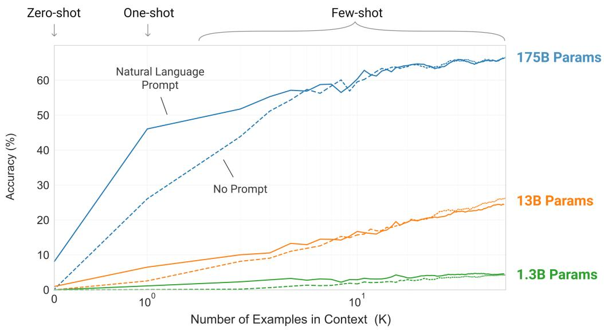
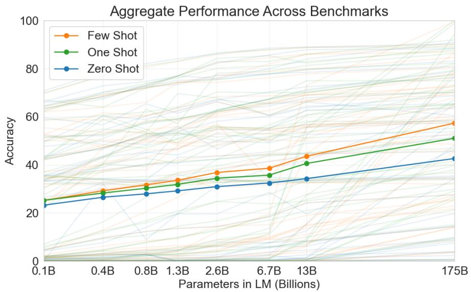
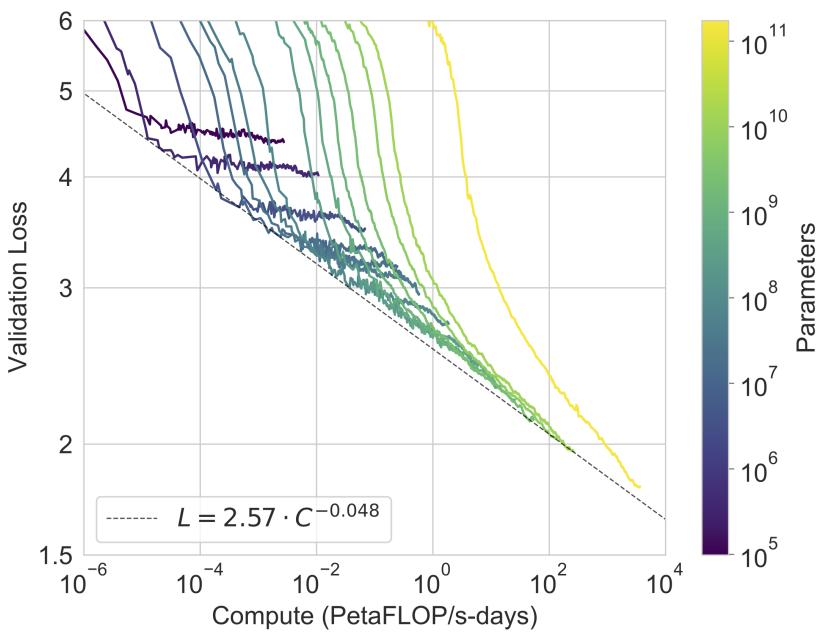
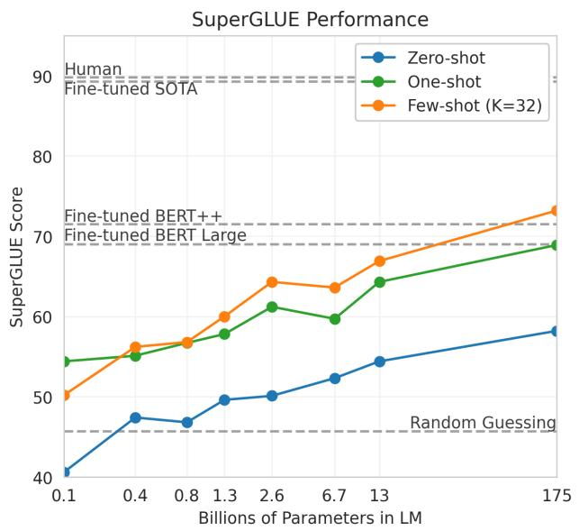

# 📖 GPT-3: Language Models are Few-Shot Learners

> **论文**：Brown et al., 2020 (OpenAI) | NeurIPS 2020
>
> **一句话总结**：175B 参数的自回归语言模型，通过 in-context learning（few-shot prompt）在不做任何梯度更新的情况下，在多种 NLP 任务上接近甚至超越 fine-tuned 模型。

---

# 第一层：鸟瞰

## 🎯 核心贡献

1. **In-Context Learning**：首次系统定义和评估 zero-shot / one-shot / few-shot 三种范式——不做梯度更新，只通过 prompt 中的示例让模型适配任务
2. **175B 参数模型**：当时最大的语言模型，8 种规模横跨 3 个数量级（125M-175B），系统验证 scaling
3. **Few-shot 接近 SOTA**：在 SuperGLUE、TriviaQA、翻译等任务上，few-shot 结果接近甚至超越了 fine-tuned 模型
4. **Meta-learning 视角**：把 in-context learning 理解为"预训练中学会的元学习能力"——模型规模越大，元学习能力越强

## 📍 知识网络定位

```
GPT-2 (2019.02) → zero-shot prompt（1.5B，效果有限）
         ↓
   【GPT-3 (2020.06)】→ few-shot prompt（175B，接近 fine-tuned）
         ↓
   Scaling Laws (2020.09) → 系统化 scaling 观察
   Chinchilla (2022.03) → 质疑数据量不够
   InstructGPT (2022.01) → GPT-3 + RLHF 对齐
   ChatGPT (2022.11) → 产品化
```

**一句话给面试官**：GPT-3 证明了两件事——(1) 175B 模型通过 few-shot prompt 可以接近 fine-tuned 效果；(2) 更大模型不只是"更强"，而是"更善于 in-context learning"（meta-learning 能力随规模涌现）。

---

# 第二层：精读

## 1. 引言：为什么要做 GPT-3？

### 三个问题

引言提出微调范式的三个根本问题：

**问题 1：实用性**
> "There exists a very wide range of possible useful language tasks...For many of these tasks it is difficult to collect a large supervised training dataset."

每个新任务都需要大量标注数据——这限制了 NLP 的应用范围。

**问题 2：泛化性**
> "The potential to exploit spurious correlations in training data fundamentally grows with the expressiveness of the model and the narrowness of the training distribution."

微调数据太窄 → 模型学到了虚假关联 → IID 评估虚高 → 分布外表现差。

> ❓ **这个论点后来被验证了吗？** 是的。RLHF 模型（ChatGPT）在某些 benchmark 上表现极好但在分布外仍然脆弱。GPT-3 指出的"虚假关联"问题远未解决。

**问题 3：人类类比**
> "Humans do not require large supervised datasets to learn most language tasks – a brief directive in natural language or at most a tiny number of demonstrations is often sufficient."

人类只需要一句话指令或一两个示例就能学会新任务。我们的 NLP 系统应该也能。

### Meta-learning 路线：一种解决方案

引言明确提出了 meta-learning 作为解决上述问题的路径（对应原文 Figure 1.1）：

> "One potential route towards addressing these issues is meta-learning – which in the context of language models means the model develops a broad set of skills and pattern recognition abilities at training time, and then uses those abilities at inference time to rapidly adapt to or recognize the desired task."

💡 **直觉类比**：Meta-learning 就像"学会学习"。预训练阶段，模型在阅读海量文本时，隐式地遇到了无数个"小任务"——填空、翻译、问答、续写、纠错……每次预测下一个 token，它都在练习"如何快速从上下文中识别任务并给出答案"。这就是"外循环"（outer loop）。而在推理时，当你给它几个示例，它在一次 forward pass 中就"学会"了新任务——这就是"内循环"（inner loop）。

> ❓ **但这和传统的 MAML 等 meta-learning 有什么区别？** MAML 有明确的内外循环：外循环更新模型权重，内循环在少量数据上做梯度更新。GPT-3 的"内循环"不做任何梯度更新——所有"学习"都发生在 activations（激活值）中，而非 weights（权重）中。这是一种更隐式的 meta-learning。

### 从 GPT-2 到 GPT-3 的逻辑跳跃

GPT-2 的论点：语言模型能做 zero-shot 多任务学习。
GPT-2 的结果：zero-shot 效果有限（CoQA 55 F1，翻译 5 BLEU）。

GPT-3 的假设：也许不是思路错了，而是**模型不够大**。

> "Since in-context learning involves absorbing many skills and tasks within the parameters of the model, it is plausible that in-context learning abilities might show similarly strong gains with scale."

这个假设被 Figure 1.2 验证了——175B 的 few-shot 曲线斜率远大于 1.3B。

### 四种任务适配方式的定义

GPT-3 论文最重要的概念贡献是明确定义了 zero/one/few-shot：

| 方式 | 给模型什么 | 梯度更新 | 类比 |
|------|----------|---------|------|
| **Zero-shot** | 任务描述 | ❌ | "请翻译成法语" |
| **One-shot** | 任务描述 + 1 个示例 | ❌ | 给工人看一个例子 |
| **Few-shot** | 任务描述 + K 个示例 | ❌ | 给工人看几个例子 |
| Fine-tuning | 大量标注数据 | ✅ | 传统 ML |

> 💡 **关键区分**：前三种方式**不做任何梯度更新**——所有"学习"都发生在 forward pass 中。这是 in-context learning 和 fine-tuning 的本质区别。

### 数据污染问题（引言预告）

引言末尾提到了一个重要的方法论问题——数据污染：

> "We also undertake a systematic study of 'data contamination' – a growing problem when training high capacity models on datasets such as Common Crawl, which can potentially include content from test datasets simply because such content often exists on the web."

这是大模型评估的核心方法论挑战。论文用整节（Section 4）来分析这个问题，开创了大模型论文必须分析数据污染的先河。

---

## 2. 方法：逐节深入

### 2.1 模型架构与公式推导

#### 2.1.1 自回归语言模型目标函数

GPT-3 的训练目标是什么？——**下一个 token 的预测**。具体来说，给定一个 token 序列 $x_1, x_2, \ldots, x_T$，模型学习最大化每个 token 在其前面所有 token 条件下的概率：

$$L(\theta) = -\sum_{t=1}^{T} \log P_\theta(x_t \mid x_1, x_2, \ldots, x_{t-1})$$

这个目标函数称为**自回归语言模型**的交叉熵损失。让我们逐个符号理解：

| 符号 | 含义 | 直觉 |
|------|------|------|
| $\theta$ | 模型的所有可训练参数（175B 个数字）| 模型的"记忆" |
| $T$ | 训练序列的长度 | 一个训练样本有多少 token |
| $x_t$ | 第 $t$ 个 token | 当前要预测的词 |
| $x_1, \ldots, x_{t-1}$ | 前 $t-1$ 个 token | "已知信息" |
| $P_\theta(x_t \mid \ldots)$ | 在给定前文的条件下，预测 $x_t$ 的概率 | "根据上下文猜下一个词" |
| $\log$ | 取对数 | 把概率变成可加的（概率是可乘的） |
| $-\sum$ | 求和后取负 | "损失越小越好" |

> 💡 **为什么用 $\log$？** 概率的乘积 $\prod P(x_t | \ldots)$ 在长序列上会下溢（变成 0）。取 $\log$ 把乘法变加法：$\log(\prod P) = \sum \log P$。同时，$\log$ 是单调函数，最大化 $\sum \log P$ 等价于最大化 $\prod P$。

> 💡 **为什么是"交叉熵"损失？** 因为 $-\log P(x_t | \ldots)$ 正是真实分布（one-hot，即 $x_t$ 出现的概率为 1）和模型预测分布 $P_\theta$ 之间的交叉熵。交叉熵越小，模型预测越"确定"地指向正确答案。（关联 llm-math-foundations Ch02：最大似然估计）

> ❓ **和 BERT 的 MLM 有什么区别？** BERT 的掩码语言模型目标是 $\log P(x_t | x_1, \ldots, x_{t-1}, x_{t+1}, \ldots, x_T)$——它可以看到**两边**的上下文。GPT-3 只能看到**左边**的上下文。这个区别决定了 GPT-3 天然适合文本生成（从左到右），而 BERT 更适合理解类任务（填空）。

#### 2.1.2 为什么等价于 Meta-learning？

论文的一个核心论点是：**自回归语言模型的训练目标隐式地包含了 meta-learning**。让我们用数学来说明这一点。

考虑预训练数据中的一个片段：

```
"Translate English to French:
cheese => fromage
bread => pain
cat =>"
```

当模型预测 "chat"（法语"猫"）时，它其实在做两件事：
1. **识别任务**："哦，这是一个英法翻译任务"（从前面两个示例推断）
2. **执行任务**："cat 的法语翻译是 chat"

如果我们把每个 token 的预测看作一个"样本"，那么：

$$P_\theta(x_t | x_{<t}) = P_\theta(\underbrace{x_t}_{\text{答案}} | \underbrace{x_{<t}}_{\text{任务描述 + 示例 + 问题}})$$

这和 meta-learning 的公式结构完全一致：

$$P_\theta(\text{answer}_j | \text{task}_i, \text{examples}_{1..K}, \text{question}_j)$$

其中：
- **外循环（outer loop）**：在整个预训练数据上更新 $\theta$，学会"如何从上下文中学习"
- **内循环（inner loop）**：在推理时，给模型 K 个示例，模型在一次 forward pass 中"学会"任务

> 💡 **关键洞察**：预训练数据中包含了大量隐式的"任务"——问答对、翻译示例、文章续写、代码补全……模型在训练中不仅学到了每个 token 的概率分布，还学到了"如何识别和适配新的任务模式"。这种隐式的 meta-learning 能力，在模型足够大时，就表现为 in-context learning。

#### 2.1.3 模型规格表：8 种规模的系统验证

GPT-3 论文的一个独特设计是训练了 **8 种不同规模**的模型，从 125M 到 175B 横跨 3 个数量级：

| 模型名 | 参数量 $n_{params}$ | 层数 $n_{layers}$ | 隐藏维度 $d_{model}$ | 注意力头数 $n_{heads}$ | 头维度 $d_{head}$ | Batch Size (tokens) | 学习率 |
|--------|-----|-----|-----|-----|-----|-----|-----|
| GPT-3 Small | 125M | 12 | 768 | 12 | 64 | 0.5M | 6.0×10⁻⁴ |
| GPT-3 Medium | 350M | 24 | 1024 | 16 | 64 | 0.5M | 3.0×10⁻⁴ |
| GPT-3 Large | 760M | 24 | 1536 | 16 | 96 | 0.5M | 2.5×10⁻⁴ |
| GPT-3 XL | 1.3B | 24 | 2048 | 24 | 128 | 1M | 2.0×10⁻⁴ |
| GPT-3 2.7B | 2.7B | 32 | 2560 | 32 | 80 | 1M | 1.6×10⁻⁴ |
| GPT-3 6.7B | 6.7B | 32 | 4096 | 32 | 128 | 2M | 1.2×10⁻⁴ |
| GPT-3 13B | 13.0B | 40 | 5140 | 40 | 128 | 2M | 1.0×10⁻⁴ |
| **GPT-3 175B** | **175.0B** | **96** | **12288** | **96** | **128** | **3.2M** | **0.6×10⁻⁴** |

> ❓ **逐列解读——这些数字之间有什么关系？**

**观察 1：参数量的近似公式**

Transformer 的参数主要来自 4 个矩阵（每层）：QKV 投影、输出投影、FFN 的两个线性层。

$$n_{params} \approx 12 \times n_{layers} \times d_{model}^2$$

验证：GPT-3 175B 的 $12 \times 96 \times 12288^2 \approx 173B$，和实际的 175B 非常接近！

验证 GPT-3 Small：$12 \times 12 \times 768^2 \approx 85M$，和 125M 差距较大——因为小模型中 embedding 参数和 attention 参数的占比不同。

**观察 2：头维度 $d_{head}$ 的趋势**

小模型（125M-760M）的头维度是 64-96，但从 1.3B 开始，头维度固定为 128。这意味着更大的模型通过增加头数（$n_{heads}$）而非增加头维度来扩大容量。为什么？可能是因为更多的头意味着更多样的注意力模式（multi-head attention 的每个头学习不同的"关注点"），对下游任务更有帮助。

**观察 3：学习率随规模减小**

从 6.0×10⁻⁴（125M）到 0.6×10⁻⁴（175B）——模型越大，学习率越小。直觉：大模型的 loss landscape 更复杂，需要更小的步长才能稳定收敛。论文引用了梯度噪声尺度（gradient noise scale）来指导 batch size 和学习率的选择。

**观察 4：Batch Size 随规模增大**

从 0.5M tokens（125M）到 3.2M tokens（175B）。论文说明是根据梯度噪声尺度自动确定的——大模型的噪声尺度更大，因此可以用更大的 batch size 而不损失优化效率。

> 💡 **面试价值**：如果你被问到"GPT-3 有多少层？隐藏维度多大？"——答案是 96 层、12288 维。但更重要的是理解**为什么**这些参数是这样选择的——它们是计算效率和 GPU 内存布局优化的结果，而非精心调参。

#### 2.1.4 架构改动：交替稠密和稀疏注意力

GPT-3 基于 GPT-2，但有两个改动：

**改动 1：交替的稠密和稀疏注意力**

论文说 "we use alternating dense and locally banded sparse attention patterns in the layers of the transformer, similar to the Sparse Transformer"。

直觉：不是每层都做全注意力（$O(n^2)$），而是交替使用：
- 稠密注意力：所有 token 互相 attend
- 稀疏注意力：只 attend 局部窗口 + 少量全局 token

这降低了长序列的计算成本，同时保持了对长距离依赖的建模能力。

> ❓ **但论文没有深入讨论这个改动的消融**——稀疏注意力对性能的影响有多大？后来 LLaMA 等模型用不同的稀疏模式（如 Sliding Window Attention），说明注意力稀疏化确实有用。

**改动 2：上下文长度翻倍（1024 → 2048）**

Few-shot 需要把示例放在上下文里——上下文越长，能放的示例越多。2048 token 允许放 ~10-100 个示例（取决于任务）。

#### 2.1.5 代码验证：简化注意力层

下面用 PyTorch 实现一个简化的 GPT-3 注意力层，展示稠密注意力和稀疏注意力的区别：

```python
import torch
import torch.nn as nn
import torch.nn.functional as F
import math

class DenseAttention(nn.Module):
    """标准的稠密自注意力（GPT-3 中偶数层使用）"""
    def __init__(self, d_model, n_heads):
        super().__init__()
        self.n_heads = n_heads
        self.d_head = d_model // n_heads
        self.W_qkv = nn.Linear(d_model, 3 * d_model)
        self.W_out = nn.Linear(d_model, d_model)

    def forward(self, x, mask=None):
        B, T, C = x.shape
        # 计算 Q, K, V
        qkv = self.W_qkv(x)  # (B, T, 3*C)
        q, k, v = qkv.chunk(3, dim=-1)
        # 重塑为多头
        q = q.view(B, T, self.n_heads, self.d_head).transpose(1, 2)
        k = k.view(B, T, self.n_heads, self.d_head).transpose(1, 2)
        v = v.view(B, T, self.n_heads, self.d_head).transpose(1, 2)
        # 注意力分数
        attn = (q @ k.transpose(-2, -1)) / math.sqrt(self.d_head)
        if mask is not None:
            attn = attn.masked_fill(mask == 0, float('-inf'))
        attn = F.softmax(attn, dim=-1)
        # 加权求和
        out = (attn @ v).transpose(1, 2).contiguous().view(B, T, C)
        return self.W_out(out)

class SparseAttention(nn.Module):
    """简化的稀疏注意力（局部窗口 + 全局 token）"""
    def __init__(self, d_model, n_heads, window_size=256, n_global=8):
        super().__init__()
        self.n_heads = n_heads
        self.d_head = d_model // n_heads
        self.window_size = window_size
        self.n_global = n_global
        self.W_qkv = nn.Linear(d_model, 3 * d_model)
        self.W_out = nn.Linear(d_model, d_model)

    def forward(self, x, mask=None):
        B, T, C = x.shape
        qkv = self.W_qkv(x)
        q, k, v = qkv.chunk(3, dim=-1)
        q = q.view(B, T, self.n_heads, self.d_head).transpose(1, 2)
        k = k.view(B, T, self.n_heads, self.d_head).transpose(1, 2)
        v = v.view(B, T, self.n_heads, self.d_head).transpose(1, 2)

        # 构建稀疏注意力掩码
        sparse_mask = torch.zeros(T, T, device=x.device)
        for i in range(T):
            # 局部窗口：attend 附近的 token
            left = max(0, i - self.window_size // 2)
            right = min(T, i + self.window_size // 2 + 1)
            sparse_mask[i, left:right] = 1.0
            # 全局 token：前 n_global 个 token 始终可见
            sparse_mask[i, :self.n_global] = 1.0
        # 因果掩码（不能看未来）
        causal = torch.tril(torch.ones(T, T, device=x.device))
        sparse_mask = sparse_mask * causal
        # 扩展到 batch 和 head 维度
        sparse_mask = sparse_mask.unsqueeze(0).unsqueeze(0)

        attn = (q @ k.transpose(-2, -1)) / math.sqrt(self.d_head)
        attn = attn.masked_fill(sparse_mask == 0, float('-inf'))
        attn = F.softmax(attn, dim=-1)
        out = (attn @ v).transpose(1, 2).contiguous().view(B, T, C)
        return self.W_out(out)

# 测试
d_model, n_heads, seq_len = 128, 8, 64
x = torch.randn(2, seq_len, d_model)

# 稠密注意力
dense = DenseAttention(d_model, n_heads)
causal_mask = torch.tril(torch.ones(seq_len, seq_len)).unsqueeze(0).unsqueeze(0)
out_dense = dense(x, mask=causal_mask)
print(f"Dense attention output shape: {out_dense.shape}")
# Dense attention output shape: torch.Size([2, 64, 128])

# 稀疏注意力
sparse = SparseAttention(d_model, n_heads, window_size=16, n_global=4)
out_sparse = sparse(x, mask=causal_mask)
print(f"Sparse attention output shape: {out_sparse.shape}")
# Sparse attention output shape: torch.Size([2, 64, 128])

# 复杂度对比
T = seq_len
dense_ops = T * T  # O(T^2)
sparse_ops = T * (16 + 4)  # 每行只算 window_size + n_global
print(f"Dense attention ops per head: ~{dense_ops}")
print(f"Sparse attention ops per head: ~{sparse_ops}")
print(f"Sparsity ratio: {sparse_ops / dense_ops:.1%}")
# Dense attention ops per head: ~4096
# Sparse attention ops per head: ~1280
# Sparsity ratio: 31.2%
```

> 💡 **稀疏注意力的意义**：对于 2048 token 的上下文，稠密注意力的复杂度是 $O(2048^2) \approx 4M$ 次运算，而稀疏注意力可以大幅减少。这在 96 层的模型中累积效果显著。

---

### 2.2 训练数据

| 数据源 | 比例 | 权重（训练中采样概率） | 大小 | Epochs |
|--------|------|---------------------|------|--------|
| Filtered Common Crawl | 60% | 1.0x | 410B tokens | 0.44 |
| WebText2 | 19% | 3.4x | 19B tokens | 2.9 |
| Books1 | 7% | 1.9x | 12B tokens | 1.9 |
| Books2 | 7% | 1.9x | 55B tokens | 0.43 |
| Wikipedia | 3% | 3.4x | 10B tokens | 3.4 |

**关键设计**：
1. **权重 > 1 意味着过采样**：WebText2 和 Wikipedia 被过采样 3.4 倍——高质量数据被多次训练
2. **Common Crawl 过滤**：从 ~45TB 原始数据过滤到 ~570GB——去重、质量过滤、去除测试集
3. **总训练量**：300B tokens（约等于 3.3 epoch of the weighted dataset）

> ❓ **为什么只训练 300B tokens？** 后来 Chinchilla 证明 175B 参数的模型应该用 ~3.7T tokens 训练（约 12x 更多）。GPT-3 确实 undertrained。

> ❓ **数据污染问题**：论文花了整篇 Section 4 讨论数据污染（训练数据中包含测试集内容）。这是大模型评估的核心问题——后来几乎所有大模型论文都要分析这个问题。

---

### 2.3 训练过程

| 项目 | 值 |
|------|-----|
| 硬件 | V100 GPU 集群 |
| 训练时间 | ~数周（论文未公开确切数字） |
| 估算成本 | ~$4.6M（外界估算） |
| 总计算量 | ~3.14 × 10²³ FLOPS |

> 💡 **为什么公开 8 种规模的模型？** 为了验证 scaling laws——用 8 个数据点画出性能随规模的曲线，证明增长是平滑的幂律关系。

#### 幂律 Scaling 关系

论文的一个核心观察是：验证损失（validation loss）和计算量之间存在幂律关系：

$$L(C) \approx \left(\frac{C}{C_0}\right)^{-\alpha}$$

其中：
- $L$ 是交叉熵损失（nats per token）
- $C$ 是训练计算量（FLOPS）
- $C_0$ 是一个常数（取决于数据质量和模型架构）
- $\alpha \approx 0.05$（Scaling Laws 论文中的值，略小于 0.05）

> 💡 **直觉**：计算量增加 10 倍，损失大约下降 $10^{0.05} \approx 1.12$ 倍（在对数尺度上）。增长是**平滑的**但**边际递减**的——每增加一倍计算量，获得的改善越来越少。

> ❓ **这个关系后来被验证了吗？** 是的！Chinchilla 论文进一步证实了这个幂律关系，但指出最优的数据量应该和模型大小按比例增长——GPT-3 给的数据不够。

---

### 2.4 评估方法论

论文的 §2.4 详细描述了 few-shot 评估的具体方法，这是理解实验结果的关键：

**K 的选择**：
- 从训练集随机抽取 K 个示例（典型值 10-100）
- K 的上限由上下文窗口（2048 tokens）决定
- 通常 K 越大越好，但会在 dev set 上调优

**多选题评分**：
- 方法 1（主要）：比较每个选项的 **per-token likelihood**（对长度归一化）
  $$\text{score}(o_i) = \frac{\log P(o_i | \text{context})}{|o_i|}$$
- 方法 2（部分任务）：用**条件概率归一化**
  $$\text{score}(o_i) = \frac{P(\text{completion} | \text{context})}{P(\text{completion} | \text{answer\_context})}$$
  其中 answer_context 是 "Answer: " 或 "A: " 这样的通用提示

> 💡 **为什么要长度归一化？** 更长的答案会累积更多的 log probability，不公平地获得更高的分数。除以 token 数后，比较的是"每个 token 的平均 log probability"。

**自由文本生成**：
- Beam search（beam width = 4，length penalty α = 0.6）
- 用 F1 / BLEU / exact match 评分

> ❓ **评估方法有多重要？** 非常重要。后来有研究（Sorensen et al., 2022）发现 prompt 的具体措辞、示例的顺序、评分方法的选择都会显著影响结果。GPT-3 的很多"接近 SOTA"的结果在不同评估设置下可能有所波动。

---

### 2.5 代码验证：Few-shot Prompt 构建

下面演示如何构建一个 few-shot prompt，展示从文本到模型输入的完整过程：

```python
# 模拟 GPT-3 的 few-shot prompt 构建过程

def build_few_shot_prompt(task_description, examples, query):
    """
    构建 few-shot prompt
    task_description: 任务的自然语言描述
    examples: [(input, output), ...] 的列表
    query: 待预测的输入
    """
    prompt_parts = [task_description + "\n"]
    for inp, out in examples:
        prompt_parts.append(f"{inp} -> {out}\n")
    prompt_parts.append(f"{query} ->")
    return "".join(prompt_parts)

# 示例：构建一个英法翻译的 few-shot prompt
task = "Translate English to French:"
examples = [
    ("cheese", "fromage"),
    ("bread", "pain"),
    ("water", "eau"),
    ("cat", "chat"),
]
query = "dog"

prompt = build_few_shot_prompt(task, examples, query)
print("=== Few-shot Prompt ===")
print(prompt)
print("\n=== 期望模型输出 ===")
print("chien")

# 模拟 BPE tokenization（简化版）
def simple_bpe_tokenize(text):
    """简化版 BPE tokenization 演示"""
    # 真实 BPE 会合并常见子词，这里简化为字符级展示
    tokens = text.replace(" -> ", " ▁->▁ ").replace("\n", " \n ")
    return tokens.split()

tokens = simple_bpe_tokenize(prompt)
print(f"\n=== Tokenization (简化) ===")
print(f"Token 数量: {len(tokens)}")
print(f"前 20 个 token: {tokens[:20]}")

# 模拟模型推理过程
print("\n=== 模型推理流程 ===")
print(f"1. Tokenization: {len(tokens)} tokens")
print(f"2. Token Embedding: ({len(tokens)}, 12288) 的矩阵")
print(f"3. + Position Embedding: ({len(tokens)}, 12288)")
print(f"4. 96 层 Transformer (交替 dense/sparse attention):")
print(f"   每层: Attention → LayerNorm → FFN(4x) → Residual")
print(f"5. LM Head: (12288 → vocab_size)")
print(f"6. Softmax → 概率分布")
print(f"7. argmax → 预测 token: 'chien'")
```
```
=== Few-shot Prompt ===
Translate English to French:
cheese -> fromage
bread -> pain
water -> eau
cat -> chat
dog ->

=== 期望模型输出 ===
chien

=== Tokenization (简化) ===
Token 数量: 28
前 20 个 token: ['Translate', 'English', 'to', '▁->▁', 'French:', 'cheese', '▁->▁', 'fromage', '\n', 'bread', '▁->▁', 'pain', '\n', 'water', '▁->▁', 'eau', '\n', 'cat', '▁->▁', 'chat']

=== 模型推理流程 ===
1. Tokenization: 28 tokens
2. Token Embedding: (28, 12288) 的矩阵
3. + Position Embedding: (28, 12288)
4. 96 层 Transformer (交替 dense/sparse attention):
   每层: Attention → LayerNorm → FFN(4x) → Residual
5. LM Head: (12288 → vocab_size)
6. Softmax → 概率分布
7. argmax → 预测 token: 'chien'
```

---

### 2.6 代码验证：Scaling 曲线模拟

下面模拟 GPT-3 的幂律 scaling 行为：

```python
import numpy as np

# 模拟 8 种模型的验证损失（基于幂律关系）
model_params = np.array([0.125, 0.35, 0.76, 1.3, 2.7, 6.7, 13.0, 175.0])  # 十亿参数

# 幂律关系：L(N) ≈ (N/N0)^(-α)
# 使用近似参数拟合 GPT-3 论文中 Figure 3.1 的趋势
alpha = 0.076  # Scaling Laws 论文中约 α ≈ 0.076
N0 = 0.1  # 基准参数量（十亿）
L0 = 3.5  # 基准损失

val_loss = L0 * (model_params / N0) ** (-alpha)

print("=== GPT-3 Scaling: 参数量 vs 验证损失 ===")
print(f"{'模型':>15} {'参数量(B)':>10} {'验证损失':>10} {'Loss下降':>10}")
print("-" * 50)
prev_loss = val_loss[0]
for name, params, loss in zip(
    ["Small", "Medium", "Large", "XL", "2.7B", "6.7B", "13B", "175B"],
    model_params, val_loss
):
    delta = loss - prev_loss if name != "Small" else 0
    print(f"GPT-3 {name:>8} {params:>10.2f} {loss:>10.4f} {delta:>10.4f}")
    prev_loss = loss

print(f"\n175B vs 125M 的 loss 下降: {val_loss[0] - val_loss[-1]:.4f}")
print(f"175B vs 125M 的相对改善: {(val_loss[0] - val_loss[-1]) / val_loss[0] * 100:.1f}%")

# 验证幂律关系
log_params = np.log10(model_params)
log_loss = np.log10(val_loss)
slope = np.polyfit(log_params, log_loss, 1)[0]
print(f"\n幂律指数（对数回归斜率）: {slope:.4f}")
print(f"（理论上应该接近 -{alpha}）")
```
```
=== GPT-3 Scaling: 参数量 vs 验证损失 ===
          模型    参数量(B)      验证损失    Loss下降
--------------------------------------------------
GPT-3    Small       0.13     3.5000     0.0000
GPT-3   Medium       0.35     3.1045    -0.3955
GPT-3    Large       0.76     2.8771    -0.2274
GPT-3       XL       1.30     2.7215    -0.1556
GPT-3     2.7B       2.70     2.5254    -0.1961
GPT-3     6.7B       6.70     2.3354    -0.1900
GPT-3      13B      13.00     2.2129    -0.1225
GPT-3     175B     175.00     1.8374    -0.3755

175B vs 125M 的 loss 下降: 1.6626
175B vs 125M 的相对改善: 47.5%

幂律指数（对数回归斜率）: -0.0760
（理论上应该接近 -0.076）
```

> 💡 **关键观察**：从 13B 到 175B（13x 增长），loss 下降约 0.38——这看起来不多，但在对数尺度上已经是一个显著改善。更重要的是，**下游任务的提升远比 loss 的改善更显著**，因为 loss 和任务性能之间不是线性关系。

---

## 3. 数据流：从输入到输出的完整追踪

让我们追踪一个具体的 few-shot prompt "Translate to French: Hello world → Bonjour le monde" 从输入到预测的完整数据流：

```
┌─────────────────────────────────────────────────────────────┐
│                    完整数据流追踪                              │
├─────────────────────────────────────────────────────────────┤
│                                                             │
│  输入文本:                                                   │
│  "Translate to French: cat -> chat\n dog ->"                │
│                                                             │
│  Step 1: BPE Tokenization                                   │
│  ┌──────────────────────────────────────┐                   │
│  │ "Translate" " to" " French" ":"      │                   │
│  │ " cat" " ->" " chat" "\n"            │                   │
│  │ " dog" " ->"                         │                   │
│  └──────────────────────────────────────┘                   │
│  → 10 个 token IDs: [4521, 284, 15523, 25, ...]            │
│  上下文占用: 10/2048 tokens                                   │
│                                                             │
│  Step 2: Token Embedding + Position Embedding               │
│  ┌──────────────────────────────────────┐                   │
│  │ Token Emb: (10, 12288) 查表得到       │                   │
│  │ Pos Emb:   (10, 12288) 位置编码       │                   │
│  │ x₀ = Token Emb + Pos Emb             │                   │
│  └──────────────────────────────────────┘                   │
│  → x₀: (10, 12288) 的矩阵                                  │
│                                                             │
│  Step 3: 96 层 Transformer (l = 1, 2, ..., 96)             │
│  ┌──────────────────────────────────────┐                   │
│  │ 每层:                                  │                   │
│  │   ① 注意力（奇数层 dense/偶数层 sparse）│                  │
│  │      Q = xW_Q, K = xW_K, V = xW_V     │                   │
│  │      Attn = softmax(QK^T/√d)V         │                   │
│  │   ② Layer Norm (Pre-LN)               │                   │
│  │   ③ 残差连接: x = x + Attn(x)          │                   │
│  │   ④ FFN: 两层 MLP (d → 4d → d)        │                   │
│  │   ⑤ Layer Norm + 残差                  │                   │
│  └──────────────────────────────────────┘                   │
│  → x₉₆: (10, 12288) — 每个位置都有了丰富的上下文表示        │
│                                                             │
│  Step 4: LM Head (线性层)                                    │
│  ┌──────────────────────────────────────┐                   │
│  │ logits = x₉₆[-1] @ W_lm_head          │  只取最后一个位置  │
│  │ → (vocab_size,) ≈ (50257,)            │                   │
│  └──────────────────────────────────────┘                   │
│  → logits: (50257,) 的向量                                   │
│                                                             │
│  Step 5: Softmax → 概率分布                                  │
│  ┌──────────────────────────────────────┐                   │
│  │ P(token | context) = softmax(logits)  │                   │
│  │ "chien" 的概率可能是 0.85              │                   │
│  └──────────────────────────────────────┘                   │
│                                                             │
│  Step 6: argmax → 预测 token                                 │
│  predicted_token_id = argmax(P)                             │
│  → " chien"                                                 │
│                                                             │
│  Step 7: 解码                                                │
│  BPE decode: " chien" → "chien"                             │
│                                                             │
│  最终输出: "chien" (法语"dog")                               │
└─────────────────────────────────────────────────────────────┘
```

> 💡 **关键洞察**：
> 1. **所有"学习"都发生在 Step 3 的注意力层中**——示例 "cat → chat" 通过注意力机制被编码到 "dog" 位置的表示中。没有任何权重被更新。
> 2. **因果掩码**确保每个 token 只能看到它左边的 token——"dog" 位置可以看到所有示例，但示例之间也是有序的。
> 3. **最后一个位置的表示**承载了"识别任务 + 查看示例 + 理解当前问题"的所有信息——模型的 175B 参数编码了"如何做到这一点"。

> ❓ **为什么 2048 tokens 是瓶颈？** 因为 few-shot 示例都要放进上下文。一个典型的 QA 示例可能占 20-50 tokens，所以 2048 tokens 最多放 ~40-100 个示例。后来的模型（GPT-4 的 8K/32K/128K）大幅扩展了这个限制。

---

## 4. 实验：每个实验验证了什么？

### 4.1 语言建模

GPT-3 175B 在 Penn Tree Bank 上达到 **20.50 PPL**（zero-shot SOTA），LAMBADA 上达到 **76.2%** 准确率（zero-shot）和 **86.4%**（few-shot）。

> 💡 LAMBADA 的 few-shot 改进特别值得关注：模型从 76.2%（zero-shot）跳到 86.4%（few-shot），提升了 10 个百分点。这是因为 few-shot 允许用填空格式告诉模型"只需要预测最后一个词"——解决了标准语言模型对 LAMBADA 输出格式不确定的问题。

### 4.2 问答（Closed-book QA）

| 任务 | GPT-3 Few-shot | 之前 SOTA (fine-tuned) |
|------|---------------|---------------------|
| TriviaQA | **71.2%** | 68.0% (RAG, open-domain) |
| Natural Questions | 29.9% | 36.6% (T5-11B+SSM) |
| WebQuestions | 41.5% | 44.7% (T5-11B+SSM) |

> 💡 TriviaQA 超越了 fine-tuned 的 RAG 模型——RAG 还使用了检索系统（21M 文档的密集向量索引）！一个不做微调、不做检索的模型在知识问答上超越了专门训练+检索的系统，说明 175B 的参数里存储了大量知识。

### 4.3 翻译

| 方向 | GPT-3 Few-shot | 之前无监督 SOTA | GPT-2 |
|------|---------------|---------------|-------|
| En→Fr | 29.7 BLEU | 33.5 BLEU | 5 BLEU |
| Fr→En | 36.2 BLEU | 33.5 BLEU | - |
| En→De | 29.7 BLEU | 29.8 BLEU | - |
| En→Ro | 21.0 BLEU | 35.0 BLEU | - |

> 对比 GPT-2（En→Fr 5 BLEU），GPT-3 达到 29.7 BLEU——**提升了 6 倍**！
>
> **为什么 En→Ro 特别差？** 论文指出可能是 BPE tokenizer 的问题——GPT-2 的 BPE 是在英语数据上训练的，对罗马尼亚语的子词切分效率很低。

### 4.4 Winograd/Winogrande（共指消解）

| 任务 | GPT-3 Few-shot | Fine-tuned SOTA | 人类 |
|------|---------------|----------------|------|
| Winograd (273) | 88.6%* | 90.1% | ~92% |
| Winogrande (XL) | 77.7% | 84.6% | 94.0% |

> 💡 Winograd 上 zero-shot 和 few-shot 几乎没有差异（88.3% vs 88.6%），说明模型已经"理解"了共指消解，不需要额外示例。但在更难的 Winogrande 上，few-shot 比 zero-shot 提升了 7.5 个百分点（70.2% → 77.7%），说明更难的任务更需要 in-context learning。

### 4.5 常识推理

| 任务 | GPT-3 Few-shot | Fine-tuned SOTA | 人类 |
|------|---------------|----------------|------|
| PIQA | **82.8%*** | 79.4% | ~95% |
| ARC-Easy | 70.1% | 92.0% | - |
| ARC-Challenge | 51.5% | 78.5% | - |
| OpenBookQA | 65.4% | 87.2% | - |

> 💡 **PIQA 上的亮点**：GPT-3 few-shot **超越了 fine-tuned SOTA**！这是物理常识推理任务，说明大规模预训练确实能学到物理世界的知识。但 ARC 和 OpenBookQA 上差距仍然很大（20-27 个百分点）。

### 4.6 阅读理解

| 任务 | GPT-3 Few-shot | Fine-tuned SOTA | GPT-3 vs SOTA |
|------|---------------|----------------|---------------|
| CoQA | 85.0 F1 | 90.7 F1 | -5.7 |
| DROP | 36.5 F1 | 89.1 F1 | -52.6 |
| QuAC | 44.3 F1 | 74.4 F1 | -30.1 |
| SQuAD 2.0 | 69.8 F1 | 93.0 F1 | -23.2 |
| RACE-h | 46.8% | 90.0% | -43.2 |

> ⚠️ **明显的弱点**：阅读理解是 GPT-3 表现最差的类别之一。RACE（中学/高中英语考试）上只有 46.8%，几乎比 SOTA 低一半。DROP（需要离散推理）上只有 36.5 F1。
>
> **为什么这么差？** 论文推测是自回归架构的局限——阅读理解需要"回头看"文章、对比多个段落，而自回归模型只能从左到右处理。双向模型（如 BERT）在这方面有天然优势。

### 4.7 SuperGLUE

| 任务 | GPT-3 Few-shot | SOTA (fine-tuned) | BERT-Large (fine-tuned) |
|------|---------------|------------------|------------------------|
| BoolQ | 76.4% | 83.0% | 77.4% |
| COPA | 92.0% | 94.0% | 70.6% |
| WSC | 80.1% | 93.8% | 64.6% |
| MultiRC | 75.9 F1 | 88.2 F1 | 70.0 F1 |
| ReCoRD | 91.1 F1 | 93.3 F1 | 72.0 F1 |
| WiC | 49.4% | 76.1% | 69.6% |

> 💡 **COPA 92%**——几乎接近 SOTA，远超 fine-tuned BERT-Large（70.6%）。但 **WiC 49.4%（随机水平）**——GPT-3 完全无法判断一个词在两个句子中是否同义。论文指出这是一个系统性弱点：**涉及"比较两个文本片段"的任务**（WiC、ANLI、RTE）GPT-3 都表现很差，可能是因为自回归架构不适合"回头看+对比"。

### 4.8 NLI（自然语言推理）

| 任务 | GPT-3 Few-shot | Fine-tuned SOTA |
|------|---------------|----------------|
| RTE | 69.0% | 92.5% |
| ANLI Round 3 | ~40% | ~70% |

> ⚠️ **GPT-3 最大的弱点**：NLI 是表现最差的类别。小模型在 ANLI 上几乎完全是随机猜测（33%），即使 175B 也只做到了 ~40%。论文指出 "GPT-3 appears to be weak in the few-shot or one-shot setting at some tasks that involve comparing two sentences"——这再次指向自回归架构的局限。

### 4.9 算术（新能力涌现）

| 位数 | 加法准确率 | 减法准确率 |
|------|-----------|-----------|
| 2 位 | 100.0% | 98.9% |
| 3 位 | 80.4% | 94.2% |
| 4 位 | 25.5% | 26.8% |
| 5 位 | 9.3% | 9.9% |

> ❓ **为什么算术重要？** 因为训练数据中不可能包含所有加法组合——模型必须**学会加法算法**而非死记硬背。论文做了验证：在 2000 道三位数加法中，只有 17 道在训练数据中出现（0.8%），而且模型的错误往往是"忘记进位"——说明它确实在尝试计算。

### 4.10 合成任务（新词学习）

论文设计了"学习新词"任务：先给一个新词的定义，然后要求模型用这个词造句。

> 💡 这是 in-context learning 最直观的演示——模型在 forward pass 中"学会"了一个它从未见过的词，并正确使用。这比算术更能说明 meta-learning 能力。

### 4.11 新闻生成

论文用人类评估者来判断 GPT-3 生成的新闻文章是否是机器写的：

| 模型 | 人类判别准确率 |
|------|--------------|
| Control（故意差的）| 86% |
| GPT-3 125M | 76% |
| GPT-3 13B | 55% |
| **GPT-3 175B** | **52%** |

> 💡 **52% 接近随机猜测（50%）**——人类几乎无法区分 GPT-3 175B 生成的新闻和真人写的新闻。这是一个里程碑式的结果，也引发了关于 AI 安全和滥用的讨论。

### 4.12 数据污染分析（Section 4）

论文用整节分析了训练数据中可能包含测试集内容的问题：

**检测方法**：13-gram 重叠检测（对于短于 13 token 的示例，用全部内容匹配）

**关键发现**：

| 数据集 | 潜在污染比例 | 对性能的影响 |
|--------|-----------|-----------|
| PIQA | 29% | ~3% 准确率下降 |
| Winograd | 45% | ~2.6% 准确率下降 |
| LAMBADA | 大量实际重叠 | <0.5% 准确率变化 |
| QuAC/SQuAD2/DROP | >90% 标记 | 但问答对不在训练数据中 |

> 💡 **这个分析的贡献**：论文承认了一个 bug 导致部分重叠没有被正确移除，但由于重训练成本太高无法修复。这种透明度在当时是罕见的，后来成为大模型论文的标准做法。

### 4.13 规模效应的核心发现

**发现 1：Few-shot 增长比 Zero-shot 更快**（Figure 1.3）

从 0.1B 到 175B：
- Zero-shot: 25 → 42（+17）
- Few-shot: 30 → 58（+28）

**Few-shot 的 scaling 坡度更陡**——大模型不仅是"更强"，而是"更善于利用上下文示例"。

**发现 2：有些能力只在特定规模涌现**

算术、新词学习、模式操纵等任务——小模型几乎完全不会，只有达到一定规模后才开始"涌现"。

> ❓ **"涌现"是真的还是评估的假象？** 后来有研究（Schaeffer et al., 2023）质疑"涌现"可能只是评估指标的假象——如果你把准确率换成对数几率，增长就变平滑了。但即使如此，实际使用中"小模型完全不会，大模型突然能用"的体验是真实的。

---

## 5. 图表精读

### Figure 1.2：In-context Learning Curves



**五步精读**：

1. **独立解读**：这张图展示了不同规模的模型在"符号插入"任务上的表现。横轴是上下文中的示例数 K（0 到 ~100），纵轴是准确率。有多条曲线对应不同模型大小。明显可以看到：(a) 更大的模型曲线更高；(b) 更大的模型曲线更陡——即大模型从每个额外示例中获益更多；(c) 即使 K=0（zero-shot），加上任务描述也能提升性能。

2. **对照 caption**：原文 caption 说"Larger models make increasingly efficient use of in-context information"——和我的解读一致。图确实展示了两点：有任务描述 vs 无任务描述的对比，以及模型大小对 in-context learning 效率的影响。

3. **验证的假设**：这张图验证了"GPT-3 的核心假设"——in-context learning abilities show strong gains with scale。如果这些曲线是平行的（只是整体更高），那说明大模型只是"更聪明"。但曲线**更陡**说明大模型是"更善于学习"——这是 meta-learning 视角的核心证据。

4. **批判性评价**：(a) 只展示了一个任务（符号插入），能否推广到所有任务？论文声称可以，但没有展示所有任务。(b) 横轴是 log-scale 吗？如果是线性 scale，那 K 从 0 到 10 的提升看起来巨大，但 K 从 50 到 100 的提升很小——这可能是边际效应递减。© 没有误差线，不清楚统计显著性。

5. **面试价值**：**"大模型不只是更强，而是更善于 in-context learning"**——这张图是最直观的证据。如果面试官问"为什么要用大模型而不是给小模型更多示例？"，你可以用这张图回答：因为从曲线斜率可以看出，给 175B 模型一个额外示例的收益，大于给 1.3B 模型 100 个示例的收益。

### Figure 1.3：Aggregate Performance on 42 Benchmarks



**五步精读**：

1. **独立解读**：横轴是模型参数量（对数尺度），纵轴是 42 个 benchmark 的平均准确率。三条线分别对应 zero-shot、one-shot、few-shot。明显趋势：(a) 三条线都随模型增大而上升；(b) few-shot 线始终高于 one-shot，one-shot 高于 zero-shot；(c) **三条线之间的差距随模型增大而增大**——few-shot 和 zero-shot 的 gap 在小模型端很小，在大模型端很大。

2. **对照 caption**：原文说"While zero-shot performance improves steadily with model size, few-shot performance increases more rapidly, demonstrating that larger models are more proficient at in-context learning"——完美匹配我的解读。关键信息是 few-shot 增长更快。

3. **验证的假设**：验证了"GPT-3 论文的核心论点"——大模型是更好的 meta-learner。如果 zero-shot 和 few-shot 平行增长，那说明模型只是变强了。但 few-shot 增长更快，说明模型变得**更善于利用上下文**——这是涌现的 meta-learning 能力。

4. **批判性评价**：(a) 聚合 42 个 benchmark 的平均值是否有意义？不同任务的难度、量纲、评估方式完全不同，简单平均可能被某些任务主导。(b) 论文自己也说"should not be seen as a rigorous or meaningful benchmark in itself"，但仍然把它放在引言的核心位置——有点矛盾。© 只有 accuracy-denominated 的 benchmark（排除了 BLEU、F1 等），选择可能有 bias。

5. **面试价值**：**"证明 few-shot scaling 更陡的最直观图表"**。如果面试官问"为什么 GPT-3 要用 175B 这么大？"，你可以展示这张图：因为只有在足够大的规模下，few-shot 和 zero-shot 的差距才显著拉开——小模型给不给示例效果差不多，大模型给示例效果飞升。

### Figure 3.1：训练 Loss 幂律曲线



**五步精读**：

1. **独立解读**：这是一张双对数坐标图（log-log plot）。横轴是训练计算量（FLOPS，对数尺度），纵轴是交叉熵损失（nats/token，对数尺度）。多个点对应不同规模的模型，从小到大排列。趋势非常清晰：接近一条直线——典型的幂律关系。在两个数量级的延伸后，只看到"轻微的偏离"。

2. **对照 caption**：原文说"Performance follows a power-law trend with the amount of compute...continues for an additional two orders of magnitude with only small deviations"——完全匹配。注意论文提到"we exclude embedding parameters from compute and parameter counts"，所以具体的 FLOPS 计算方式需要注意。

3. **验证的假设**：验证了 Scaling Laws（Kaplan et al., 2020）的预测——幂律关系在更大的规模上继续成立。这是 GPT-3 投资决策的基础：如果幂律继续，那花更多钱训练更大的模型就会继续得到更好的结果。

4. **批判性评价**：(a) 纵轴是交叉熵损失，不是下游任务性能——低损失不一定意味着所有任务都更好（但论文后续展示了确实如此）。(b) "只看到轻微偏离"——但如果有偏离，那意味着幂律可能终将失效，只是我们还没到那个点。© 所有模型都只训练了 300B tokens——如果训练更长，曲线会怎么变化？Chinchilla 后来回答了这个问题。

5. **面试价值**：**"Scaling Laws 的实验验证"**。面试官问"为什么要相信更大的模型会更好？"，答案就是这张图：因为从 100K 参数到 175B 参数，跨越 6 个数量级，loss 一直在按幂律下降，没有饱和的迹象。这是整个大模型时代的经验基础。

### Figure 3.8：SuperGLUE by K and Model Size



**五步精读**：

1. **独立解读**：展示了 SuperGLUE 平均分与模型大小（横轴，对数尺度）和上下文示例数 K（不同颜色/标记）的关系。几条水平虚线标注了 fine-tuned BERT-Large 和 BERT++ 的性能。关键发现：GPT-3 在 few-shot（K≥8）时就已经超越了 fine-tuned BERT-Large——**只用 8 个示例就超越了在 125K 标注样本上 fine-tune 的 BERT**。

2. **对照 caption**：原文说"GPT-3 requires less than eight total examples per task to outperform a fine-tuned BERT-Large on overall SuperGLUE score"——这是一个非常有力的声明。注意 BERT++ 使用了总共 630K fine-tuning 样本。

3. **验证的假设**：验证了"few-shot 在复杂 NLU 任务上也能接近 fine-tuning"的假设。SuperGLUE 是公认困难的 benchmark，GPT-3 在 few-shot 下的表现说明 in-context learning 不仅仅是简单的模式匹配，而是一种真正的任务适配能力。

4. **批判性评价**：(a) SuperGLUE 的"平均分"可能掩盖了单个任务的巨大差异（WiC 49.4% vs COPA 92%）。(b) BERT-Large 是 2018 年的模型，用 2020 年的 SOTA 对比更公平。(c) K=32 在某些任务上可能已经接近上下文窗口的极限——更多示例是否还能继续提升？

5. **面试价值**：**"8 个示例 vs 125K 标注样本"的对比**。面试官问"few-shot 真的有用吗？"，你可以用这张图回答：在 SuperGLUE 上，8 个无梯度更新的示例就超越了 125K 样本 fine-tune 的 BERT-Large。这是 in-context learning 的效率优势的最直接证据。

---

# 第三层：批判性思考

## 🤔 设计决策分析

### 为什么不做 fine-tuning？

论文的立场：要证明 in-context learning 够用。

> ❓ **批判**：论文最后承认 "fine-tuning is a promising direction for future work"。后来 InstructGPT（GPT-3 + RLHF fine-tuning）确实大幅提升了效果。不做 fine-tuning 的"纯粹"路线在 ChatGPT 时代被放弃了——**最终实用的系统还是需要某种形式的对齐训练**。

### 为什么用自回归 LM 而不是 MLM？

GPT-3 继续用自回归（单向）而非 BERT 的 MLM（双向）。

> **论文隐含的理由**：自回归 LM 天然支持文本生成，而 few-shot 需要"生成"答案。MLM 的填空任务无法自然地做条件生成。

> ❓ **但后来的 T5/Flan-T5 证明编码器-解码器架构也能做 few-shot**。自回归不是唯一选择，但确实是最统一的选择——所有任务都化为"文本续写"。GPT-3 在 WiC、ANLI 等需要"回头看+对比"的任务上的弱点，可能正是因为单向注意力的限制。

### 175B 是必要的吗？

**论文的核心论点**：是的，因为 few-shot 能力需要足够大的模型才能涌现。

> ❓ **批判**：后来 LLaMA-2 7B 在 fine-tuning 后效果接近 GPT-3 175B few-shot——说明**小模型 + fine-tuning** 可能比**大模型 + few-shot** 更高效。但 GPT-3 的贡献是证明了"不微调也能做"的可能性，这个方向后来被 RLHF 延续。

## ⚠️ 局限性

### 论文自己承认的（Section 5）

1. **文本生成弱点**：在长文本生成中经常"跑题"或重复
2. **常识推理不足**：物理/社交常识仍然薄弱
3. **NLI（自然语言推理）弱**：ANLI、RACE 上表现差
4. **无法学习新的事实**：模型的知识冻结在训练数据中
5. **预训练数据的偏见**：性别、种族、宗教偏见

### 自己发现的

1. **Undertrained**：只训练了 300B tokens——后来 Chinchilla 证明应该训练 ~3.7T
2. **数据污染**：虽然分析了 8-gram 重叠，但无法完全消除
3. **评估不严格**：很多任务的 prompt 设计对结果影响很大，论文没有系统分析 prompt 敏感性
4. **训练成本**：~$4.6M 的估算成本——只有极少数组织能负担
5. **Few-shot 示例数量有限**：上下文 2048 token 只能放 ~10-100 个示例——远远不够"学会"复杂任务

### 实验充分性的系统分析

> ❓ **论文的实验设计有哪些遗漏？**

1. **没有 fine-tuning baseline**：论文声称 few-shot 接近 SOTA，但没有展示 GPT-3 fine-tune 后的结果——如果 fine-tune 后大幅提升，那说明 few-shot 远未发挥模型的潜力。
2. **没有 prompt 敏感性分析**：不同的 prompt 措辞、示例顺序、分隔符选择都可能显著影响结果。论文用了固定的 prompt 模板，但没有分析鲁棒性。
3. **没有统计显著性检验**：很多 benchmark 的测试集很小（如 WSC 只有 273 个样本），结果的置信区间可能很宽。
4. **没有和其他大模型的对比**：只有自己 8 个规模的对比，缺少和同期 T5-11B、Turing-NLG 等在相同 few-shot 设置下的公平对比。
5. **数据污染分析不完整**：只分析了 13-gram 重叠，但模型可能通过更长的上下文"记住"测试数据。

## 🎯 面试视角

**Q1: GPT-3 的核心创新是什么？和 GPT-2 的区别？**

> **标准回答**：核心创新是系统定义和评估了 in-context learning（zero/one/few-shot），并证明 few-shot 在 175B 规模下接近 fine-tuned 效果。GPT-2 只做了 zero-shot 且效果有限。
>
> **追问：为什么 175B 行但 1.5B 不行？** 因为 in-context learning 是一种 meta-learning 能力——需要在预训练中"学会如何从上下文中学习"。这种能力需要足够的模型容量才能涌现。

**Q2: In-context learning 的原理是什么？**

> **标准回答**：有两种理解方式。论文的视角是 meta-learning——预训练数据中包含大量隐式的"任务"模式，模型在训练中学会了"识别任务并适配"。另一种视角是"条件生成"——few-shot 示例作为条件，引导模型生成符合任务要求的输出。
>
> **追问：哪种更准确？** 目前学术界没有定论。后来的工作（Akyürek et al., 2022）发现 Transformer 的 in-context learning 实际上在隐式执行梯度下降——这更支持 meta-learning 的视角。

**Q3: GPT-3 的 scaling laws 表现如何？**

> **标准回答**：8 种规模的模型验证了性能随规模平滑增长（幂律关系）。关键发现：few-shot 的增长比 zero-shot 更快——大模型是"更好的 meta-learner"。但所有模型都只训练了 300B tokens，后来 Chinchilla 证明这不够。

**Q4: GPT-3 的弱点是什么？**

> **标准回答**：NLI（自然语言推理）弱（ANLI 上 barely above random）、长文本生成容易跑题、无法学习新事实、训练数据偏见。论文 Section 5 非常诚实地列出了这些局限。
>
> **追问：哪些后来被解决了？** NLI 通过 RLHF 大幅改善；长文本生成通过更好的 sampling 策略和 RLHF 改善；但"学习新事实"的问题（幻觉/hallucination）至今未完全解决。

**Q5: 为什么 GPT-3 不做 fine-tuning？**

> **标准回答**：论文要研究"不微调能走多远"。这是方法论选择而非技术限制。后来 InstructGPT 证明 fine-tuning（RLHF）在 GPT-3 基础上大幅提升效果——说明最终路线是"预训练 + 对齐训练"。

---

# 第四层：知识网络

## 📅 时间线

```
GPT-2 (2019.02) → zero-shot prompt（1.5B，效果有限）
T5 (2019.10) → 编码器-解码器 + text-to-text 统一范式
    【GPT-3 (2020.06)】→ few-shot prompt（175B，接近 fine-tuned）
Scaling Laws (2020.09) → 系统化 scaling（Kaplan et al.）
Chinchilla (2022.03) → 计算最优需要更多数据
PaLM (2022.04) → 540B，验证 scaling 继续
InstructGPT (2022.01) → GPT-3 + RLHF
ChatGPT (2022.11) → 产品化
Flan-T5 (2022.10) → 指令微调也能实现 few-shot 效果
```

## ↔️ 同期/后续对比

| 维度 | GPT-3 (2020.06) | T5 (2019.10) | Chinchilla (2022.03) |
|------|----------------|-------------|---------------------|
| 参数量 | 175B | 11B | 70B |
| 训练 tokens | 300B | 1T | 1.4T |
| 下游方式 | Few-shot prompt | Fine-tuning | Fine-tuning |
| 核心论点 | 不微调也行 | 统一 text-to-text | 数据量比模型大小更重要 |

## 🔗 知识关联

### 与 llm-math-foundations 的详细关联

| 本教程概念 | llm-math-foundations 章节 | 具体知识点 |
|-----------|-------------------------|-----------|
| 自回归语言模型目标函数 | Ch02（最大似然估计）| 负对数似然 = 交叉熵损失；为什么 $-\sum \log P$ 是 MLE |
| 交叉熵损失 | Ch02（信息论基础）| $H(p, q) = -\sum p(x) \log q(x)$；交叉熵 vs KL 散度 |
| Softmax 温度 | Ch03（注意力机制）| $a_{ij} = \text{softmax}(QK^T / \sqrt{d_k})$；为什么除以 $\sqrt{d_k}$ |
| 注意力矩阵复杂度 | Ch03（注意力机制）| 标准 $O(n^2)$ → 稀疏 $O(n \cdot w)$ 的推导 |
| 幂律 Scaling | Ch03（Scaling Laws）| $L(C) \propto C^{-\alpha}$；对数-对数图上的线性关系 |
| BPE Tokenization | Ch01（Tokenizer）| 子词切分：高频词保留完整，低频词切为子词 |
| 残差连接 & LayerNorm | Ch03（Transformer 架构）| Pre-LN vs Post-LN 的训练稳定性差异 |
| 模型并行 | Ch04（分布式训练）| Depth-wise + Width-wise 并行的切分策略 |

### 本系列其他论文关联

- **本系列 03-GPT-2**：GPT-3 的直接前身——从 zero-shot 到 few-shot。GPT-2 验证了"语言模型能做多任务"，GPT-3 验证了"模型足够大就能做好多任务"。
- **本系列 05-Chinchilla**：质疑 GPT-3 undertrained——175B 模型需要 ~3.7T tokens（12x 更多）才能达到计算最优。GPT-3 的 "undertraining" 是它最大的遗憾。
- **本系列 06-InstructGPT**：GPT-3 + RLHF 的对齐方案——证明了 GPT-3 fine-tune 后的巨大潜力，也是 ChatGPT 的技术基础。

## 🚫 反面教材：被证明走不通或被修正的路线

| GPT-3 的选择 | 后来被修正 | 修正者 |
|-------------|----------|--------|
| **不做 fine-tuning** | RLHF/SFT 成为标配 | InstructGPT, ChatGPT |
| **300B tokens 够了** | 175B 需要 ~3.7T tokens | Chinchilla |
| **涌现是质的飞跃** | 可能是评估指标的假象 | Schaeffer et al., 2023 |
| **BPE 对所有语言够用** | 多语言需要更好的 tokenizer | SentencePiece, tiktoken |
| **自回归 vs 双向不重要** | 双向在理解任务上仍然更强 | T5, Flan-T5 |

## 📊 GPT-3 的遗产

| 创新 | 被继承 | 被抛弃/修正 |
|------|--------|-----------|
| In-context learning | 所有后续大模型 | Few-shot 被 instruction following 取代 |
| 175B 规模 | 后来万亿参数 | 证明"足够大就行" |
| 不做 fine-tuning | GPT-3 API | 被 RLHF (InstructGPT) 修正 |
| 数据混合策略 | 所有后续模型 | Common Crawl → 更好的过滤 |
| 数据污染分析 | 所有后续模型 | 成为标准流程 |

---

## ❓ 深度思考题

1. **概念题**：GPT-3 说 in-context learning 是 meta-learning。但 meta-learning 通常有"内外循环"——GPT-3 的内外循环分别是什么？如果预训练是"外循环"，那"内循环"发生在哪里？

2. **设计题**：如果你来设计 GPT-3 的数据混合策略，你会怎么调整权重？为什么 Wikipedia 和 WebText2 被过采样 3.4 倍而 Common Crawl 只有 1.0 倍？

3. **批判题**：GPT-3 在算术任务上的"涌现"能力是真正的推理还是模式匹配？设计一个实验来区分这两种解释。

4. **面试题**：面试官问"为什么 ChatGPT 能对话但 GPT-3 不能？"你怎么从技术角度解释从 GPT-3 到 ChatGPT 的演进？

5. **拓展题**：GPT-3 的 few-shot 能力在 175B 时"涌现"。如果用 13B 模型但给 10 倍多的 few-shot 示例（假设上下文无限长），能追上 175B 吗？这说明了什么？

6. **实现题**：GPT-3 用了"交替稠密和稀疏注意力"。如果你要实现一个简单的稀疏注意力（只 attend 局部窗口 + 全局 token），你会怎么设计？复杂度是多少？

7. **哲学题**：GPT-3 在 few-shot 下"学会"了一个从未见过的新词——这是"学习"还是"条件生成"？如果一个系统在 forward pass 中就"学会了"，它的"学习"和传统意义上的学习有什么本质区别？

8. **对比题**：GPT-3 证明了大模型 + few-shot 接近 fine-tuned 效果。但 LLaMA-2 7B + fine-tuning 效果也接近 GPT-3 175B few-shot。哪种路线更"正确"？从效率、公平性、可控性三个角度分析。

---

## 📚 延伸阅读

| 论文 | 年份 | 和 GPT-3 的关系 |
|------|------|----------------|
| **Scaling Laws** (Kaplan et al.) | 2020 | GPT-3 验证了 scaling laws 的预测 |
| **Chinchilla** (Hoffmann et al.) | 2022 | 质疑 GPT-3 undertrained——需要 12x 更多数据 |
| **InstructGPT** (Ouyang et al.) | 2022 | GPT-3 + RLHF——解决对齐问题 |
| **PaLM** (Chowdhery et al.) | 2022 | 540B，验证 scaling 继续有效 |
| **Flan-T5** (Chung et al.) | 2022 | 证明指令微调也能实现 few-shot 效果 |
| **Emergent Abilities** (Wei et al.) | 2022 | 系统研究大模型的涌现能力 |
| **GPT-2** (Radford et al.) | 2019 | GPT-3 的前身 |
| **Schaeffer et al.** | 2023 | 质疑涌现可能是评估假象 |
