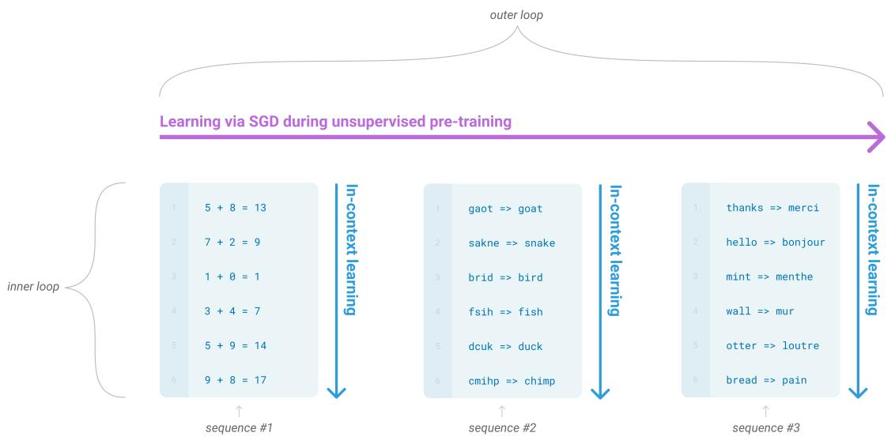
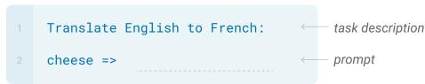
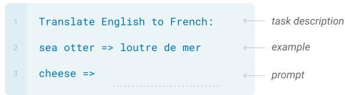
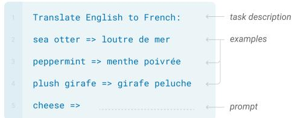
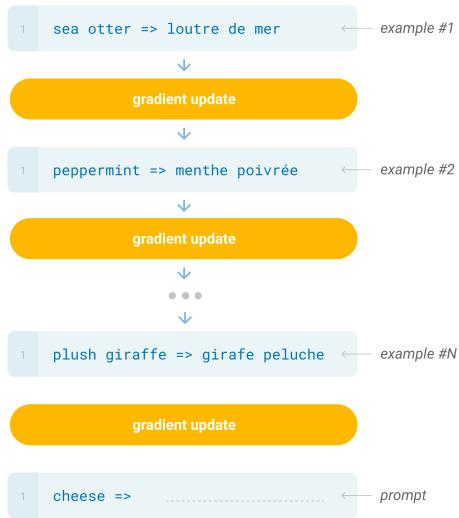

# GPT-3: Language Models are Few-Shot Learners — 精读融合版

> 阅读指南：论文原文保持不动，每个章节后穿插中文讲解（📖 标记）。讲解按四层递进法组织。

---

# Abstract

We demonstrate that scaling up language models greatly improves task-agnostic, few-shot performance, sometimes even reaching competitiveness with prior state-of-the-art fine-tuning approaches. Specifically, we train GPT-3, an autoregressive language model with 175 billion parameters, which achieves strong performance on many NLP datasets in the zero-shot, one-shot, and few-shot settings. [...] For all subtasks, GPT-3 achieves without any gradient updates or fine-tuning, with tasks and few-shot demonstrations specified purely via text interaction with the model.

> 📖 **讲解 · 鸟瞰**
>
> **一句话**：175B 语言模型通过 few-shot prompt（不做梯度更新）接近 fine-tuned SOTA。
>
> **五个要点**：
> 1. 175B 参数（比 GPT-2 大 117 倍）
> 2. Zero/one/few-shot 三种评估方式
> 3. 不做任何梯度更新
> 4. CoQA few-shot 85.0 F1（GPT-2 zero-shot 只有 55）
> 5. TriviaQA few-shot 71.2%（超越 fine-tuned SOTA）
>
> **定位**：GPT-2 证明了 zero-shot 的可能性但效果有限，GPT-3 用 175B 证明 few-shot 可以接近 fine-tuned。

---

# 1. Introduction

[论文原文：预训练语言表示的历史回顾...]

> 📖 **讲解 · 精读 · 引言结构**
>
> 引言 6 页（对论文来说非常长），论证极其详细。逐段分析：
>
> **段 1-2**：预训练-微调范式的成功，但**需要大量标注数据**——限制了应用范围。
>
> **段 3**：微调的**泛化性问题**——模型学到虚假关联，IID 评估虚高。引用了 Heilbrun et al. (2020) 的发现："larger models do not necessarily generalize better out-of-distribution"——大模型不一定泛化更好。
>
> **段 4**：**人类类比**——人类只需要一句话指令或一两个示例就能学会新任务。这是 few-shot 学习的灵感来源。
>
> **段 5-6**：从 GPT-2 的 meta-learning 视角出发，但 GPT-2 效果太差（Natural Questions 4%，CoQA 55 F1）。提出假设：也许不是思路错了，而是模型不够大。
>
> **核心论证**："Since in-context learning involves absorbing many skills and tasks within the parameters of the model, it is plausible that in-context learning abilities might show similarly strong gains with scale."
>
> ❓ **批判**：这个论证有一个隐含的跳跃——"scaling 改善语言建模"（已被验证）→ "scaling 也改善 in-context learning"（需要验证）。GPT-3 的 Figure 1.2 验证了这个跳跃，但只在一个简单任务上。

Figure 1.1: Language model meta-learning.

> 📖 **讲解 · 图表精读（Figure 1.1）**
>
> 概念示意图：预训练中发展"广泛技能"，推理时通过 in-context learning 快速适配。
>
> **批判**：图中的训练数据看起来很整齐（翻译→QA→摘要子任务嵌套），实际互联网数据远比这杂乱。

Figure 1.2: Larger models make increasingly efficient use of in-context information.

> 📖 **讲解 · 图表精读（Figure 1.2——论文最重要的图之一）**
>
> 横轴：上下文示例数（0→~100），纵轴：准确率（%）
>
> | 模型 | Zero-shot | Few-shot (~100) |
> |------|-----------|-----------------|
> | 175B | ~10% | ~60% |
> | 13B | ~0% | ~22% |
> | 1.3B | ~0% | ~5% |
>
> **核心发现**：
> 1. 175B 的曲线斜率远大于 13B 和 1.3B——**大模型更善于利用上下文**
> 2. 175B 的 zero-shot（~10%）≈ 13B 的 few-shot（~22%）——模型规模比示例数量更重要
> 3. 自然语言提示（实线）一致优于无提示（虚线）
>
> **验证的假设**：更大模型是"更好的 meta-learner"——不是简单的更强，而是更善于从上下文中学习。
>
> **批判**：只展示了一个任务（word unscrambling），其他任务的曲线可能没这么陡。

Figure 1.3: Aggregate performance for all 42 accuracy-denominated benchmarks.

> 📖 **讲解 · 图表精读（Figure 1.3）**
>
> | 模型 | Zero-shot | One-shot | Few-shot |
> |------|-----------|----------|----------|
> | 0.1B | ~25 | ~28 | ~30 |
> | 13B | ~38 | ~42 | ~48 |
> | 175B | ~42 | ~52 | ~58 |
>
> **关键观察**：
> 1. Few-shot 和 Zero-shot 的差距随规模**扩大**（0.1B 差 5，175B 差 16）——大模型确实更善于利用上下文
> 2. 背景细线非常分散——聚合曲线掩盖了任务间巨大差异
>
> **批判**：论文自己说 "should not be seen as a rigorous or meaningful benchmark"——但此图被广泛引用。

---

# 2. Approach

## 2.1 Model and Architectures

[论文原文：GPT-3 基于 GPT-2，增加了交替稠密/稀疏注意力，8种规模...]

> 📖 **讲解 · 精读 · 架构**
>
> 和 GPT-2 的区别：
> 1. **交替稀疏注意力**：不是每层都做 $O(n^2)$ 全注意力，交替使用局部窗口+全局 token 的稀疏模式
> 2. **上下文翻倍**：1024 → 2048 token（few-shot 需要更长的上下文放示例）
> 3. **8 种规模**：125M → 175B，跨越 3 个数量级
>
> 175B 参数 = 96 层 × 12288 维 × 96 头 × 128 d_head。训练用了 ~3.14 × 10²³ FLOPS。
>
> **训练数据**：
>
> | 数据源 | 比例 | 采样权重 |
> |--------|------|---------|
> | Common Crawl（过滤后） | 60% | 1.0x |
> | WebText2 | 19% | 3.4x（过采样！） |
> | Books1+2 | 14% | 1.9x |
> | Wikipedia | 3% | 3.4x |
>
> 高质量数据（Wikipedia、WebText2）被过采样 3.4 倍——说明**数据质量**很重要。
>
> 总训练量：300B tokens。后来 Chinchilla 证明这个量远远不够。

Figure 2.1: Zero-shot, one-shot and few-shot, contrasted with traditional fine-tuning.

> 📖 **讲解 · 图表精读（Figure 2.1——定义性图表）**
>
> 四面板：用英法翻译展示四种方式。关键区分：前三种**不做梯度更新**，只通过 forward pass。
>
> **面试必考**：zero/one/few-shot 的区别是什么？答案：上下文中给的示例数量不同，都不做梯度更新。

---

# 3. Results

## 3.1 Language Modeling, Cloze, and Completion Tasks

[论文原文：PPL, LAMBADA, HellaSwag 结果...]

> 📖 **讲解 · 精读 · 语言建模**
>
> LAMBADA：GPT-3 175B 达到 **76.2%** 准确率（GPT-2 是 8.6 PPL）。这是质的飞跃。
>
> HellaSwag：GPT-3 few-shot **78.9%**，但 SOTA fine-tuned 是 **85.2%**。差距在缩小但还没追上。

## 3.2 Closed Book Question Answering

[论文原文：TriviaQA, Natural Questions 结果...]

> 📖 **讲解 · 精读 · 问答（最惊艳的结果之一）**
>
> TriviaQA few-shot **71.2%**——**超越了 fine-tuned SOTA（68.0%）**！
>
> 这意味着 175B 参数里存储了大量的世界知识，而且可以通过 few-shot prompt 激活。
>
> 但 Natural Questions 只有 29.9%（SOTA 36.6%）——说明对于需要精确检索答案的任务，few-shot 还不够。

## 3.3 Translation

[论文原文：WMT 翻译结果...]

> 📖 **讲解 · 精读 · 翻译**
>
> GPT-3 En→Fr few-shot **29.7 BLEU**——对比 GPT-2 的 5 BLEU，**提升了 6 倍**！
>
> 为什么？1) 模型大了 117 倍；2) Common Crawl 包含更多法语数据
>
> 但仍低于有监督 SOTA（40+ BLEU）。论文分析 few-shot 示例的质量对翻译结果影响很大。

## 3.7 SuperGLUE

[论文原文：SuperGLUE 结果...]

> 📖 **讲解 · 精读 · SuperGLUE**
>
> COPA few-shot 92%（接近人类 100%），WSC 80.1%（SOTA 91.3%）。
>
> GPT-3 在 SuperGLUE 上证明了"不做微调也能做语言理解"——但离最先进的 fine-tuned 模型还有差距。

## 3.9 Synthetic and Qualitative Tasks

### 3.9.1 Arithmetic

[论文原文：算术结果...]

> 📖 **讲解 · 精读 · 算术**
>
> 2位加法 ~100%，3位 ~80%，4位 ~25%，5位 ~9%。
>
> **为什么算术重要？** 训练数据中不可能包含所有加法组合——模型必须学到某种"算法"。但实际上这可能主要是模式匹配：2位加法组合有限（10000 种），模型可能记住了一大部分。
>
> ❓ **批判**：后来发现只要数字格式稍有变化（如加逗号），准确率就大幅下降——说明模型确实没有学到真正的"加法算法"。

### 3.9.5 Learning and Using Novel Words

[论文原文：新词学习...]

> 📖 **讲解 · 精读 · 新词学习（最直观的 meta-learning 演示）**
>
> 给模型一个从未见过的新词定义（如 "screeg" = "to suddenly jump and spin"），然后要求用它造句。GPT-3 175B few-shot 能正确使用。
>
> 这比算术更能说明 in-context learning 的能力——模型在 forward pass 中"学会"了一个新概念。

---

# 4. Measuring and Preventing Memorization Of Benchmarks

[论文原文：数据污染分析...]

> 📖 **讲解 · 精读 · 数据污染**
>
> 论文开发了系统化工具检测训练数据中是否包含测试集内容。
>
> **关键发现**：大部分数据集的污染影响很小，但少数数据集（如 PIQA、HellaSwag）有轻微污染，论文用星号标记。
>
> ❓ **批判**：8-gram 重叠检测仍然很粗。语义级的污染（如改写后的测试集内容）无法检测。这个问题后来成了大模型评估的核心挑战。

---

# 5. Limitations

[论文原文：GPT-3 的六大局限...]

> 📖 **讲解 · 批判 · 局限性**
>
> 论文非常诚实地列出了六大问题：
>
> 1. **文本生成弱点**：长文本经常跑题或重复
> 2. **NLI 弱**：自然语言推理仍然很差
> 3. **常识不足**：物理/社交常识薄弱
> 4. **预训练 vs fine-tuning 的差距**：某些任务上 few-shot 仍远不如 fine-tuned
> 5. **无法学习新事实**：模型知识冻结在训练数据中
> 6. **数据偏见**：性别、种族、宗教偏见
>
> **后来哪些被解决了？**
> - NLI：RLHF 大幅改善
> - 文本生成：更好的 sampling + RLHF
> - 数据偏见：通过 RLHF 和安全训练缓解（但未根治）
> - 学习新事实：**至今未解决**（幻觉/hallucination 问题）

---

# 8. Conclusion

[论文原文...]

> 📖 **讲解 · 知识网络**
>
> **时间线**：GPT-2 (2019) → 【GPT-3 (2020)】→ Scaling Laws → Chinchilla → InstructGPT → ChatGPT
>
> **GPT-3 开启了什么**：
> - In-context learning 范式（后来被所有大模型继承）
> - "不做微调"的路线（后来被 RLHF 修正为"做对齐训练"）
> - 175B 规模的先例（后来被万亿参数超越）
>
> **什么被抛弃了**：
> - 不做任何训练 → 被 RLHF 修正
> - 300B tokens 训练量 → 后来证明远远不够
> - 纯 few-shot → 后来被 instruction following 取代
>
> **面试核心**：
>
> **Q: GPT-3 vs GPT-2？** A: 175B vs 1.5B，few-shot vs zero-shot，接近 SOTA vs 效果有限。
>
> **Q: 为什么 GPT-3 行？** A: 因为 in-context learning 是 meta-learning 能力，需要足够大的模型才能涌现。Figure 1.2 证明了 175B 的 few-shot 曲线斜率远大于小模型。
>
> **Q: 后续怎么发展？** A: GPT-3 证明了"不微调也能做"，但效果还不够好。InstructGPT 加了 RLHF，ChatGPT 产品化。最终路线是"预训练 + 对齐训练"。

---

## 延伸阅读

| 论文 | 年份 | 关系 |
|------|------|------|
| Scaling Laws | 2020 | GPT-3 验证了幂律预测 |
| Chinchilla | 2022 | 质疑 undertrained |
| InstructGPT | 2022 | GPT-3 + RLHF |
| PaLM | 2022 | 540B，验证 scaling |
| Flan-T5 | 2022 | 指令微调也能 few-shot |
| Emergent Abilities | 2022 | 系统研究涌现 |
