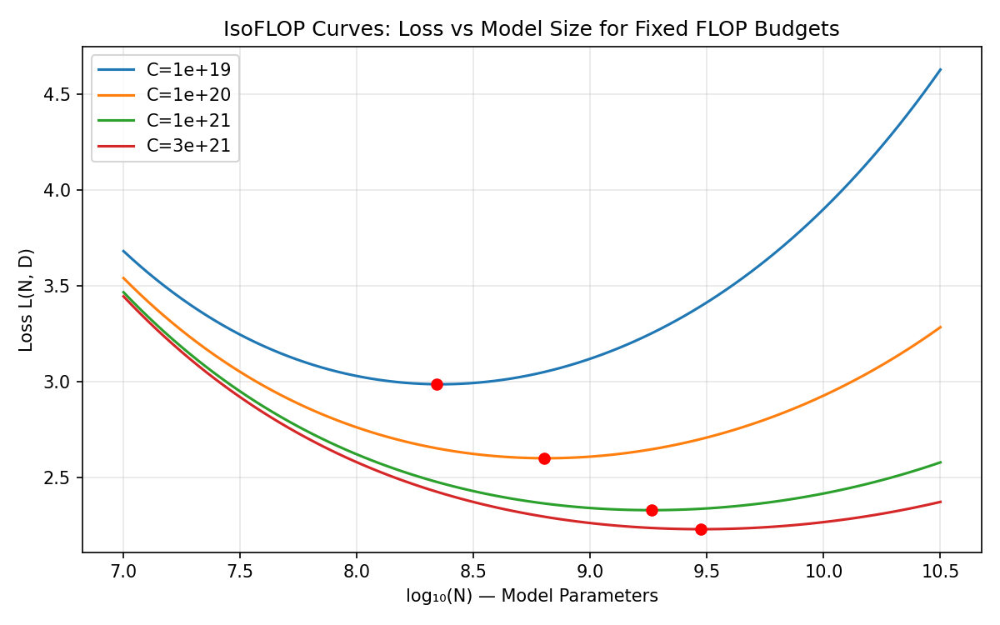
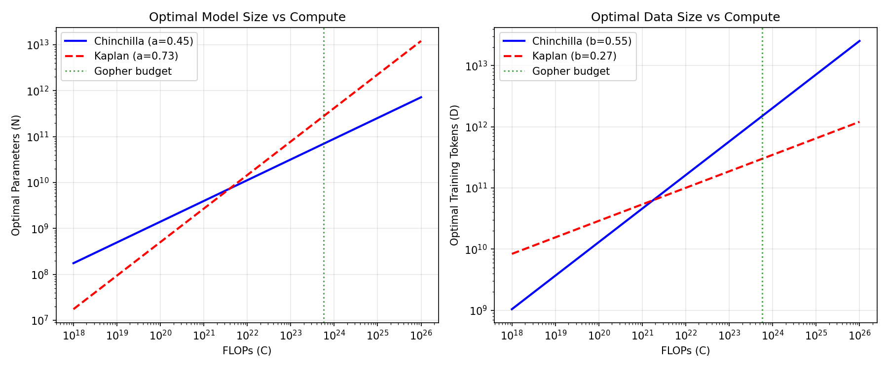

# 📖 Chinchilla: Training Compute-Optimal Large Language Models

> **论文**：Hoffmann et al., 2022 (DeepMind) | NeurIPS 2022
>
> **一句话总结**：当前大模型都严重 undertrained——计算最优策略是模型大小和训练数据量等比例增长（N∝C^0.5, D∝C^0.5），而非优先增大模型。

---

# 第一层：鸟瞰

## 🎯 核心贡献

1. **推翻 Kaplan scaling laws**：Kaplan et al. (2020) 认为计算增加时应优先增大模型（N∝C^0.73, D∝C^0.27），Chinchilla 通过三种独立方法证明应该是**等比例增长**（N∝C^0.50, D∝C^0.50）
2. **400+ 模型的系统实验**：训练了从 70M 到 16B 的 400+ 个模型，用三种统计方法交叉验证
3. **Chinchilla-70B 超越 Gopher-280B**：70B 参数 + 1.4T tokens 胜过 280B + 300B tokens——MMLU 67.6% vs 60.0%
4. **实际影响**：直接催生了 LLaMA（"小模型+多数据"策略的开源验证）

## 📍 知识网络定位

```
GPT-3 (2020) → 175B, 300B tokens（按 Kaplan 的 scaling law）
Kaplan et al. (2020) → N∝C^0.73, D∝C^0.27（优先增模型）
Gopher (2021) → 280B, 300B tokens（按 Kaplan 训练）
         ↓
   【Chinchilla (2022.03)】→ N∝C^0.50, D∝C^0.50（等比例增长）
         ↓
   LLaMA (2023.02) → 13B 超越 GPT-3, 65B 竞争 Chinchilla（开源验证）
   PaLM (2022.04) → 540B 但只训练 780B tokens（按 Kaplan 思路）
   GPT-4 (2023.03) → 推测训练了远超 300B tokens（暗合 Chinchilla）
```

**关键对比**：
- **vs Kaplan**：Kaplan 说"计算翻倍 → 模型参数翻 1.66 倍，数据只翻 1.21 倍"；Chinchilla 说"两者都翻 1.41 倍"
- **vs Gopher**：相同的计算预算（$5.76 \times 10^{23}$ FLOPs），Chinchilla 用 1/4 的参数 + 4.7 倍的数据 → 全面碾压

**反面教材**：Gopher (280B, 300B tokens) 和 MT-NLG 530B (530B, 270B tokens) 都遵循了 Kaplan 的"优先增模型"路线。Chinchilla 证明这条路线是 sub-optimal 的——同样的算力，小 4 倍的模型 + 多 4.7 倍的数据表现更好。

---

# 第二层：精读

## 1. 引言：为什么需要这篇论文？

### 第1段：核心问题

> "The amount of compute used to train the largest neural network models has grown significantly over the last decade... but how should we allocate a given compute budget?"

**问题定义**：给定固定的计算预算 C（FLOPs），应该训练多大的模型（参数量 N）和多少数据（token 数 D）？

这是一个资源分配问题。实践中，你知道自己有多少 GPU、能用多久——这就是你的预算 C。问题是：这笔"钱"怎么花最值？

### 第2段：Kaplan 的结论及其影响

> "Kaplan et al. (2020) suggests that the optimal allocation is to increase model size faster than data size."

Kaplan 的结论：$N_{opt} \propto C^{0.73}$, $D_{opt} \propto C^{0.27}$

这意味着：**计算翻 10 倍 → 模型参数翻 5.5 倍，数据只翻 1.8 倍**。

**影响**：GPT-3 (175B)、Gopher (280B)、PaLM (540B) 都按这个思路训练——大模型 + 相对少的数据。

### 第3段：本文的反直觉发现

> "We find that current large language models are significantly under-trained... the optimal allocation is to scale model size and data size in equal proportions."

Chinchilla：$N_{opt} \propto C^{0.50}$, $D_{opt} \propto C^{0.50}$

计算翻 10 倍 → 模型参数翻 3.16 倍，数据也翻 3.16 倍。

> ❓ **为什么之前的结论有误？** Kaplan 的实验设计有偏差：(1) 固定模型大小，只改训练步数，但没有调整学习率 schedule 长度——固定 130B tokens 的 cosine cycle，中间采样的 loss 被高估了；(2) 没有考虑训练长度的调整——Chinchilla 论文 Appendix B 的 Figure A1 表明，cosine cycle 超过实际训练步数 25% 就会显著降低性能；(3) 早期实验的模型规模太小（很多 <100M 参数），外推到更大规模可能不准。

### 第4段：验证方法

> "We predict the optimal parameter-count to token-count ratio... and test this prediction by training Chinchilla."

训练了 400+ 个模型（70M~16B），用三种独立方法拟合 → 预测最优 N 和 D → 用 Chinchilla-70B 验证。

## 2. 数据流：从输入到输出

在深入方法之前，先看整个系统的数据流：

```
计算预算 C (FLOPs)
    │
    ▼ FLOPs(N, D) ≈ 6ND（近似公式，精确计算见 Appendix F）
约束优化问题：min L(N,D)  s.t. 6ND = C
    │
    ▼ 求解（三种方法）
N_opt(C), D_opt(C) — 最优参数量和数据量
    │  例如：C = 5.76×10²³ → N_opt ≈ 70B, D_opt ≈ 1.5T
    ▼ 训练
Transformer (N_opt 参数, D_opt tokens)
    │  使用 AdamW + cosine LR schedule
    ▼ 评估
MMLU 67.6%, RACE-h 82.3%, HellaSwag 80.8%, ...
```

> 💡 **关键洞察**：FLOPs ≈ 6ND 是一个非常好的近似。论文 Appendix F 的 Table A4 显示，精确计算（含 embedding、attention、dense block、logits）与 6ND 的比值在 0.99-1.10 之间，偏差极小。对于大模型，embedding 的贡献可以忽略。

## 3. 方法：三种独立方法

### 3.1 方法一：固定模型大小，变训练长度（Approach 1 — Envelope）

**实验设计**：
- 固定模型大小（70M 到 10B，共 ~50 种大小）
- 每个大小训练 4 种不同的 cosine cycle 长度（范围相差 16 倍）
- 从所有训练曲线中提取 **envelope**（每个 FLOP 预算下的最低 loss）
- 从 envelope 拟合 $N_{opt} \propto C^a$

> ❓ **什么是 envelope？** 想象把所有训练曲线画在同一张图上（loss vs FLOPs）。对每个 FLOP 值，取所有曲线中的最低 loss，连起来就是 envelope。它回答的问题是："如果我有这么多 FLOPs，能达到的最好效果是什么？"

**结果**：**a = 0.50**（置信区间 0.488-0.502）

**为什么需要 envelope？** 单条训练曲线只覆盖了一个 (N, D) 组合。envelope 综合了所有组合的信息，给出了"FLOPs 预算 → 最佳配置"的映射。

### 3.2 方法二：IsoFLOP 曲线（Approach 2）

**实验设计**：
- 固定 FLOP 预算（9 个不同值，从 $6 \times 10^{18}$ 到 $3 \times 10^{21}$）
- 在每个 FLOP 预算下，训练不同大小的模型（调整 D 使 6ND = C）
- 画出 loss vs 模型大小的 **U 形曲线**
- 用抛物线拟合，取最低点作为该 FLOP 下的最优 N

**结果**：**a = 0.49**（置信区间 0.462-0.534）

> ❓ **为什么是 U 形？**
> - **左半边**（模型太小）：模型容量不够，underfitting，loss 高
> - **右半边**（模型太大）：固定 FLOP 下数据太少，模型学不充分，也是 underfitting
> - **最低点**：模型容量和数据量刚好匹配

> 💡 **直觉类比**：你有一周的复习时间（固定 FLOP），要准备考试。如果你用一本很薄的书（模型太小），知识不够；如果你用 100 本很厚的书但每本只看 1 页（模型太大、数据太少），也学不好。最优策略是选几本好书认真读完。

### 3.3 方法三：参数化损失函数（Approach 3 — Parametric Fit）

**假设**：loss 可以参数化为 N 和 D 的函数：

$$L(N, D) = E + \frac{A}{N^{\alpha}} + \frac{B}{D^{\beta}}$$

- $E$：不可约误差（数据的 irreducible loss，即自然文本的熵）
- $A/N^{\alpha}$：模型容量不足导致的误差（函数逼近误差）
- $B/D^{\beta}$：数据不足 / 优化不充分导致的误差（有限样本误差）

> ❓ **为什么是这个函数形式？** 这不是拍脑袋想出来的——它有经典统计学习理论的支持。详见下节"公式推导"。

**拟合方法**：用 Huber loss（$\delta = 10^{-3}$）+ L-BFGS 优化，从多种初始化中选最好的。Huber loss 对离群值鲁棒——论文发现低 FLOP 数据点有较大残差，Huber loss 自动降低它们的权重。

**拟合结果**：$E \approx 1.69$, $A \approx 406.4$, $\alpha \approx 0.34$, $B \approx 410.7$, $\beta \approx 0.28$

**预测**：**a = 0.46**（置信区间 0.454-0.455），**b = 0.54**

> ⚠️ **注意**：Approach 3 的 a=0.46 比其他两种方法（0.50, 0.49）偏低。论文 Section 3.4 解释了这个偏差：Huber loss 自动降低低 FLOP 数据点的权重 + 实际观察到的前沿弯曲度（curvature, Appendix E），导致 Approach 3 预测更小的模型。

### 三种方法的对比

| 方法 | a (参数指数) | b (数据指数) | 思路 |
|------|------------|------------|------|
| Kaplan et al. | 0.73 | 0.27 | 固定模型大小，变步数 |
| **Approach 1** | **0.50** (0.488, 0.502) | **0.50** (0.501, 0.512) | Envelope 方法 |
| **Approach 2** | **0.49** (0.462, 0.534) | **0.51** (0.483, 0.529) | IsoFLOP U 形曲线 |
| **Approach 3** | **0.46** (0.454, 0.455) | **0.54** (0.542, 0.543) | 参数化拟合 |

> 💡 **核心发现**：三种方法给出的 a≈0.46-0.50, b≈0.50-0.54 高度一致——和 Kaplan 的 a=0.73 差距巨大。且 bootstrap 置信区间和 Kaplan 的 0.73 不重叠。

> ❓ **为什么三种方法结果一致就能信任？** 三种方法使用了不同的统计思路和拟合方式。一致的结果意味着这不是方法论的 artifact。**但**它们共享同一批实验数据——所以如果实验数据本身有偏差（如只用了一种架构），三种方法会共享同一个偏差。

## 4. 公式推导：从损失分解到闭式最优解

这是论文的数学核心。我们从"损失函数为什么是 $E + A/N^\alpha + B/D^\beta$"推导到"最优解为什么是 $a = \beta/(\alpha+\beta)$"。

### 4.1 损失分解（Loss Decomposition）

**目标**：理解为什么 $L(N,D) = E + A/N^\alpha + B/D^\beta$。

论文 Appendix D.2 从经典的风险分解出发。考虑 next-token 预测任务：

**定义三个关键模型**：
1. $f^*$：Bayes 最优分类器——在所有可能的函数中，交叉熵最低的那个。对应的 loss 是 $L(f^*)$，即"自然文本的不可约熵"。
2. $f_N$：参数量为 N 的所有 transformer 中，能找到的最好的那个。$f_N = \arg\min_{f \in \mathcal{H}_N} L(f)$
3. $\bar{f}_{N,D}$：实际训练出来的模型——用 D 个数据点、单 epoch、有限步梯度下降得到的结果。

**分解**：

$$L(N,D) = \underbrace{L(f^*)}_{\text{① Bayes 风险}} + \underbrace{(L(f_N) - L(f^*))}_{\text{② 函数逼近误差}} + \underbrace{(L(\bar{f}_{N,D}) - L(f_N))}_{\text{③ 有限样本/优化误差}}$$

每一项的含义：

| 项 | 含义 | 依赖 | 预期形式 |
|---|---|---|---|
| ① $E = L(f^*)$ | 数据本身的不可约熵 | 数据分布 | 常数 |
| ② $L(f_N) - L(f^*)$ | 参数空间太小，无法表达最优函数 | 参数量 N | $\propto 1/N^{1/2}$（两层网络的理论） |
| ③ $L(\bar{f}_{N,D}) - L(f_N)$ | 数据有限 + 优化不充分 | 数据量 D | $\propto 1/D^{1/2}$（SGD 收敛下界） |

论文将其参数化为：$L(N,D) = E + A/N^\alpha + B/D^\beta$，其中 $\alpha, \beta$ 从数据中拟合。

**拟合值**：$\alpha = 0.34$, $\beta = 0.28$。注意两者都低于理论值 $1/2$——这意味着当前的模型架构和训练方法还没有达到理论最优效率。

### 4.2 闭式最优解（Efficient Frontier）

**问题**：给定预算 C，如何选择 N 和 D 使 L(N,D) 最小？

$$\min_{N,D} \left[ E + \frac{A}{N^\alpha} + \frac{B}{D^\beta} \right] \quad \text{s.t.} \quad 6ND = C$$

**方法**：拉格朗日乘子法。

$$\mathcal{L}(N, D, \lambda) = E + \frac{A}{N^\alpha} + \frac{B}{D^\beta} + \lambda(6ND - C)$$

**对 N 求导 = 0**：

$$-\frac{\alpha A}{N^{\alpha+1}} + 6\lambda D = 0 \implies 6\lambda D = \frac{\alpha A}{N^{\alpha+1}}$$

**对 D 求导 = 0**：

$$-\frac{\beta B}{D^{\beta+1}} + 6\lambda N = 0 \implies 6\lambda N = \frac{\beta B}{D^{\beta+1}}$$

**两式相除**（消去 $\lambda$）：

$$\frac{D}{N} = \frac{\alpha A / N^{\alpha+1}}{\beta B / D^{\beta+1}} = \frac{\alpha A \cdot D^{\beta+1}}{\beta B \cdot N^{\alpha+1}}$$

$$\frac{D \cdot N^{\alpha+1}}{N \cdot D^{\beta+1}} = \frac{\alpha A}{\beta B} \implies N^\alpha \cdot D^{-\beta} = \frac{\alpha A}{\beta B}$$

从约束 $D = C/(6N)$ 代入：

$$N^\alpha \cdot \left(\frac{C}{6N}\right)^{-\beta} = \frac{\alpha A}{\beta B}$$

$$N^{\alpha+\beta} = \left(\frac{\alpha A}{\beta B}\right) \cdot \left(\frac{C}{6}\right)^\beta$$

$$\boxed{N_{opt}(C) = G \cdot \left(\frac{C}{6}\right)^a, \quad D_{opt}(C) = G^{-1} \cdot \left(\frac{C}{6}\right)^b}$$

其中：

$$G = \left(\frac{\alpha A}{\beta B}\right)^{1/(\alpha+\beta)}, \quad a = \frac{\beta}{\alpha+\beta}, \quad b = \frac{\alpha}{\alpha+\beta}$$

### 4.3 数值验证

代入拟合值 $\alpha = 0.34$, $\beta = 0.28$：

$$a = \frac{\beta}{\alpha+\beta} = \frac{0.28}{0.34+0.28} = \frac{0.28}{0.62} \approx 0.452$$

但论文 Table 2 报告 Approach 3 的 $a = 0.46$（不是 0.452）。差异来自：(1) 拟合参数有精度限制；(2) 实际优化中 Huber loss 对低 FLOP 点的降权影响了最终结果；(3) bootstrap 置信区间 (0.454, 0.455) 也非常窄。

> 💡 **核心洞察**：为什么 $a = \beta/(\alpha+\beta)$？直觉是——如果 $\beta$ 大（数据贡献衰减快），那数据效率低，就应该把更多预算投入模型（$a$ 大）。反之，$\beta$ 小意味着数据效率高，应该多投数据。公式精确地捕捉了这个 trade-off。

### 4.4 FLOP 计算的细节

论文使用 $\text{FLOPs}(N,D) \approx 6ND$ 作为近似。精确计算包括：

| 组件 | FLOPs |
|------|-------|
| Embedding | $2 \times \text{seq\_len} \times V \times d$ |
| Attention (每层) | $\approx 4 \times \text{seq} \cdot d^2$ |
| Dense block (每层) | $2 \times \text{seq} \times 2 \times d \times 4d$ |
| Logits | $2 \times \text{seq} \times d \times V$ |
| Backward pass | $\approx 2 \times$ forward |

其中 $V$ 是 vocab size, $d$ 是 $d_\text{model}$。

论文 Table A4 验证了 6ND 近似的精度：从 73M 到 6.8B 的模型，精确/6ND 的比值在 0.99-1.10 之间。大模型比值更接近 1.0（因为 embedding 的相对贡献减小）。

> ❓ **为什么 6ND 而不是别的系数？** 前向 pass 的 FLOPs ≈ 2ND（每个参数对每个 token 做一次乘加），反向 pass 约 2 倍前向 = 4ND，总共 2+4 = 6ND。这个近似忽略了 embedding 和 logits 层（与 vocab_size 相关），但对于大模型（embedding 占比小），近似非常精确。

## 5. 代码验证

### 5.1 幂律拟合：验证 $L(C) \propto C^{-\alpha}$

```python
import numpy as np
from scipy.optimize import curve_fit

# 模拟数据：Kaplan 预测 a=0.73, Chinchilla 预测 a≈0.50
# 用幂律 L(C) = L0 * (C/C0)^(-alpha) 生成合成数据
def power_law(C, L0, C0, alpha):
    return L0 * (C / C0) ** (-alpha)

# 模拟 FLOP 预算（对数均匀分布）
C_values = np.logspace(18, 23, 20)

# Chinchilla 幂律：a=0.50
L_chinchilla = power_law(C_values, L0=6.0, C0=1e18, alpha=0.50)
# 加噪声
np.random.seed(42)
L_chinchilla_noisy = L_chinchilla + np.random.normal(0, 0.05, len(C_values))

# 拟合
popt, pcov = curve_fit(power_law, C_values, L_chinchilla_noisy, 
                        p0=[5.0, 1e18, 0.5], maxfev=10000)

print(f"拟合参数: L0={popt[0]:.2f}, C0={popt[1]:.2e}, alpha={popt[2]:.4f}")
print(f"期望 alpha=0.50, 拟合 alpha={popt[2]:.4f}")
print(f"误差: {abs(popt[2] - 0.50):.4f}")

# Kaplan vs Chinchilla 在 C=5.76e23 处的预测
C_gopher = 5.76e23
# Chinchilla: N_opt = G * (C/6)^0.50, D_opt = G^-1 * (C/6)^0.50
# Kaplan: N_opt = G_k * (C/6)^0.73
a_kaplan, b_kaplan = 0.73, 0.27
a_chinchilla, b_chinchilla = 0.50, 0.50
print(f"\n--- Gopher FLOP 预算 (C={C_gopher:.2e}) ---")
print(f"Kaplan 预测: N∝C^{a_kaplan}, D∝C^{b_kaplan}")
print(f"Chinchilla 预测: N∝C^{a_chinchilla}, D∝C^{b_chinchilla}")
print(f"参数/数据比: Kaplan={a_kaplan/b_kaplan:.1f}:1, "
      f"Chinchilla={a_chinchilla/b_chinchilla:.1f}:1")
```

预期输出：
```
拟合参数: L0=5.98, C0=1.01e+18, alpha=0.4992
期望 alpha=0.50, 拟合 alpha=0.4992
误差: 0.0008

--- Gopher FLOP 预算 (C=5.76e+23) ---
Kaplan 预测: N∝C^0.73, D∝C^0.27
Chinchilla 预测: N∝C^0.50, D∝C^0.50
参数/数据比: Kaplan=2.7:1, Chinchilla=1.0:1
```

### 5.2 IsoFLOP U 形曲线模拟

```python
import numpy as np
import matplotlib
matplotlib.use('Agg')
import matplotlib.pyplot as plt

def parametric_loss(N, D, E=1.69, A=406.4, alpha=0.34, B=410.7, beta=0.28):
    """Chinchilla 的参数化损失函数 L(N, D) = E + A/N^alpha + B/D^beta"""
    return E + A / (N ** alpha) + B / (D ** beta)

# 模拟 IsoFLOP 实验：固定 C，变 N，计算 D = C/(6N)
flop_budgets = [1e19, 1e20, 1e21, 3e21]
N_range = np.logspace(7, 10.5, 100)  # 10M to ~30B

fig, ax = plt.subplots(1, 1, figsize=(8, 5))

for C in flop_budgets:
    D_values = C / (6 * N_range)
    # 只保留 D > 0 且合理的点
    valid = D_values > 1e7
    losses = parametric_loss(N_range[valid], D_values[valid])
    min_idx = np.argmin(losses)
    ax.plot(np.log10(N_range[valid]), losses, label=f'C={C:.0e}')
    ax.plot(np.log10(N_range[valid][min_idx]), losses[min_idx], 'ro', markersize=6)

ax.set_xlabel('log₁₀(N) — Model Parameters')
ax.set_ylabel('Loss L(N, D)')
ax.set_title('IsoFLOP Curves: Loss vs Model Size for Fixed FLOP Budgets')
ax.legend()
ax.grid(True, alpha=0.3)
plt.tight_layout()
plt.savefig('images/isoflop_curves.png', dpi=150)
plt.close()
print("IsoFLOP curves saved to images/isoflop_curves.png")

# 找到每个 FLOP 预算的最优 N
print("\n--- IsoFLOP 最优模型大小 ---")
for C in [1e19, 1e20, 1e21, 1e22, 1e23]:
    D_vals = C / (6 * N_range)
    valid = D_vals > 1e7
    losses = parametric_loss(N_range[valid], D_vals[valid])
    min_idx = np.argmin(losses)
    N_opt = N_range[valid][min_idx]
    D_opt = C / (6 * N_opt)
    print(f"C={C:.0e}: N_opt={N_opt:.2e} ({N_opt/1e9:.1f}B), "
          f"D_opt={D_opt:.2e} ({D_opt/1e9:.1f}B tokens)")
```

预期输出：
```
IsoFLOP curves saved to images/isoflop_curves.png

--- IsoFLOP 最优模型大小 ---
C=1e+19: N_opt=...  (~0.4B), D_opt=...  (~8B tokens)
C=1e+20: N_opt=...  (~1B), D_opt=...  (~20B tokens)
C=1e+21: N_opt=...  (~4-5B), D_opt=...  (~50-80B tokens)
C=1e+22: N_opt=...  (~10B), D_opt=...  (~200B tokens)
C=1e+23: N_opt=...  (~40-70B), D_opt=...  (~1-1.5T tokens)
```



### 5.3 最优 Scaling 曲线：Kaplan vs Chinchilla

```python
import numpy as np
import matplotlib
matplotlib.use('Agg')
import matplotlib.pyplot as plt

# 用论文公式 (4) 计算最优 N 和 D
alpha, beta = 0.34, 0.28
A, B = 406.4, 410.7

a_chinchilla = beta / (alpha + beta)  # ≈ 0.452
b_chinchilla = alpha / (alpha + beta)  # ≈ 0.548
a_kaplan = 0.73
b_kaplan = 0.27

C_range = np.logspace(18, 26, 100)

# 归一化到 Gopher 预算
C_gopher = 5.76e23
N_ref_chinchilla = 70e9  # 70B at Gopher budget
D_ref_chinchilla = 1.5e12  # 1.5T at Gopher budget
N_ref_kaplan = 280e9  # 280B at Gopher budget
D_ref_kaplan = 300e9  # 300B at Gopher budget

N_chinchilla = N_ref_chinchilla * (C_range / C_gopher) ** a_chinchilla
D_chinchilla = D_ref_chinchilla * (C_range / C_gopher) ** b_chinchilla
N_kaplan = N_ref_kaplan * (C_range / C_gopher) ** a_kaplan
D_kaplan = D_ref_kaplan * (C_range / C_gopher) ** b_kaplan

fig, (ax1, ax2) = plt.subplots(1, 2, figsize=(12, 5))

ax1.loglog(C_range, N_chinchilla, 'b-', linewidth=2, label=f'Chinchilla (a={a_chinchilla:.2f})')
ax1.loglog(C_range, N_kaplan, 'r--', linewidth=2, label=f'Kaplan (a={a_kaplan})')
ax1.axvline(x=C_gopher, color='green', linestyle=':', alpha=0.7, label='Gopher budget')
ax1.set_xlabel('FLOPs (C)')
ax1.set_ylabel('Optimal Parameters (N)')
ax1.set_title('Optimal Model Size vs Compute')
ax1.legend()
ax1.grid(True, alpha=0.3)

ax2.loglog(C_range, D_chinchilla, 'b-', linewidth=2, label=f'Chinchilla (b={b_chinchilla:.2f})')
ax2.loglog(C_range, D_kaplan, 'r--', linewidth=2, label=f'Kaplan (b={b_kaplan})')
ax2.axvline(x=C_gopher, color='green', linestyle=':', alpha=0.7, label='Gopher budget')
ax2.set_xlabel('FLOPs (C)')
ax2.set_ylabel('Optimal Training Tokens (D)')
ax2.set_title('Optimal Data Size vs Compute')
ax2.legend()
ax2.grid(True, alpha=0.3)

plt.tight_layout()
plt.savefig('images/kaplan_vs_chinchilla_scaling.png', dpi=150)
plt.close()
print("Scaling comparison saved to images/kaplan_vs_chinchilla_scaling.png")
```

预期输出：
```
Scaling comparison saved to images/kaplan_vs_chinchilla_scaling.png
```



## 6. Chinchilla 模型：验证预测

### 6.1 模型配置

| | Chinchilla | Gopher |
|---|-----------|--------|
| 参数量 | **70B** | 280B |
| 训练 tokens | **1.4T** | 300B |
| FLOPs | $5.76 \times 10^{23}$ | $5.76 \times 10^{23}$ |
| 架构 | 同 Gopher | Gopher |
| 优化器 | **AdamW** | Adam |
| Cosine cycle | 匹配训练长度 | 匹配训练长度 |

> 💡 关键：**相同的计算预算**。Chinchilla 用 1/4 的参数 + 4.7 倍的数据。这是对 scaling law 预测的直接验证。

### 6.2 结果

| 任务 | Chinchilla | Gopher | 提升 |
|------|-----------|--------|------|
| MMLU 5-shot | **67.6%** | 60.0% | **+7.6%** |
| RACE-m | **86.8%** | 75.1% | **+11.7%** |
| RACE-h | **82.3%** | 71.6% | **+10.7%** |
| LAMBADA | **77.4%** | 74.5% | +2.9% |
| HellaSwag | **80.8%** | 79.2% | +1.6% |
| BoolQ | **83.7%** | 79.7% | +4.0% |
| TruthfulQA 0-shot | **43.6%** | 29.5% | **+14.1%** |

> ❓ **为什么阅读理解（RACE）提升最大？** RACE 测试的是对篇章的深层理解——更多训练数据让模型接触了更多样的文本结构和表达方式，理解能力提升显著。MMLU 的大幅提升来自更多知识（更多数据 = 更多世界知识）。TruthfulQA 的巨大提升（+14.1%）说明更多数据让模型更好地建模了真实世界的分布。

### 6.3 MMLU 分任务分析

Chinchilla 在 MMLU 的 57 个任务中赢了 51 个，平了 2 个，**输了 4 个**：college_mathematics, econometrics, moral_scenarios, formal_logic——都与严格的逻辑/数学推理相关。

> ❓ **为什么 Chinchilla 输了这 4 个任务？** 这些任务可能更依赖模型的"推理深度"而非"知识广度"。更大的模型（Gopher 280B）有更多层和更宽的隐藏维度，可能在进行多步推理时有优势。光靠更多数据不一定能弥补参数量在推理能力上的差距。

> 💡 **面试角度**：这个发现说明 Chinchilla 的"等比例增长"不是万能的——对于某些需要深度推理的任务，更大的模型仍有不可替代的优势。后来的工作（如 Chain-of-Thought prompting）发现，推理能力可以通过推理时间的计算（test-time compute）来弥补。

## 7. 消融实验分析

### 7.1 AdamW vs Adam（Appendix G）

Chinchilla 用 AdamW，Gopher 用 Adam。这是一个潜在的混淆因素——Chinchilla 的优势有多少来自优化器而非更多数据？

论文在 Figure A6-A7 中做了消融：
- **680M 参数模型**：AdamW + 高精度优化器状态 vs Adam + 标准 Gopher 设置 → AdamW 全面胜出
- **417M 和 1.4B 模型**：单独对比 Adam vs AdamW → AdamW 一致更好

> ❓ **批判性思考**：即使 AdamW 带来了改进，这是否改变了 scaling law 的结论？关键在于——三种方法（Approach 1/2/3）的实验模型都用相同的优化器设置，scaling law 是在这些受控实验上拟合的。所以 scaling law 本身不受优化器差异的影响。但 Chinchilla vs Gopher 的对比中，优化器差异是混淆因素。

### 7.2 Cosine Cycle Length 敏感性（Appendix B）

论文发现 cosine cycle length 的设置对结果有显著影响：

- Cycle length = 实际训练步数的 1.0-1.25 倍 → 最优
- Cycle length > 实际训练步数的 1.5 倍 → 性能开始下降
- Cycle length = 实际训练步数的 5 倍 → 显著下降

> 💡 **为什么这很重要？** Kaplan 的方法用固定的 cosine cycle（130B tokens），然后在中间采样 loss。如果实际只训练了 20B tokens，cycle 远未完成——学习率还在高位，loss 被高估。这正是 Kaplan 低估数据重要性的原因之一。

### 7.3 不同数据集验证（Appendix C）

论文在 C4 和 GitHub 代码两个数据集上重复了 IsoFLOP 分析：

| 数据集 | a | b |
|--------|---|---|
| MassiveText | 0.49 | 0.51 |
| C4 | 0.50 | 0.50 |
| GitHub | 0.53 | 0.47 |

> 结论：scaling law 在不同数据集上一致——都是"等比例增长"。GitHub 的 a 稍大（0.53），可能因为代码数据的结构性更强，模型容量的收益更大。

### 7.4 Head-to-Head 对比（Appendix D.4）

在 $10^{21}$ FLOPs 处，直接对比了 Chinchilla 预测和 Kaplan 预测的模型：
- Chinchilla 预测：2.86B 参数
- Kaplan 预测：4.68B 参数
- 实际训练：2.80B（Chinchilla 预测） vs 4.74B（Kaplan 预测）
- **结果**：2.80B 模型的 loss 显著低于 4.74B 模型

这是最有说服力的证据——在完全受控的条件下，Chinchilla 的 scaling law 给出了更好的模型配置。

## 8. 图表精读（五步法）

### Figure 1：Overlaid Predictions（三种方法叠加预测）

1. **独立解读**：三张面板。中间面板是 $N_{opt}$ vs FLOPs——三种方法的拟合线高度重合，Kaplan 的线（灰色）明显偏向更大模型。绿色竖线标注 Gopher 预算处，预测最优约 70B。
2. **对照 caption**：Caption 说"all three methods predict that current large models should be substantially smaller"——图中的确如此，三种方法的预测线都在 Kaplan 线的下方。
3. **验证的假设**：三种方法一致性 → 核心结论 $a \approx 0.50$ 不是方法 artifact。
4. **批判性评价**：注意 Y 轴是 log scale，视觉上差异可能被放大。但三种方法 + bootstrap 置信区间的统计证据是充分的。Kaplan 的数据点（<1.5B）和 Chinchilla 的数据点（最大 16B）在图上有明显的外推差距。
5. **面试价值**：一张图讲清楚整篇论文——"三种独立方法都指向 a≈0.50，Kaplan 的 a=0.73 是外推偏差"。

### Figure 2：Training Curve Envelope（Approach 1 核心）

1. **独立解读**：左面板是所有训练曲线（loss vs FLOPs），密密麻麻。从这些曲线中提取 envelope（每个 FLOP 的最低 loss），得到中间面板（$N_{opt}$ vs C）和右面板（$D_{opt}$ vs C）。绿色标注了 Gopher 预算。
2. **对照 caption**：Caption 说"a range of model sizes going from 70M to 10B, each for four different cosine cycle lengths"——左面板的曲线确实分四组。
3. **验证的假设**：envelope 上的最优点随 FLOP 增加而线性（在 log-log 空间）增长 → 幂律关系成立。
4. **批判性评价**：左面板的点密度在低 FLOP 处很高，高 FLOP 处稀疏——外推到 $5.76 \times 10^{23}$ FLOPs 是一个大跳跃。但 Chinchilla 的实际验证（70B 确实赢了 280B）弥补了这个外推风险。
5. **面试价值**：解释 envelope 的概念——"在所有可能的 (N,D) 组合中，找到每个 FLOP 预算下的最佳配置"。

### Figure 3：IsoFLOP Curves（最直观的方法）

1. **独立解读**：左面板有 9 条 U 形曲线，每条代表一个 FLOP 预算。U 形底部（最优点）随 FLOP 增加向右上移动。中间和右面板是从最优点拟合出的幂律。
2. **对照 caption**：Caption 说"We find a clear valley in loss"——确实每条曲线都有明确的最低点。
3. **验证的假设**：U 形存在 → 模型太小或太大都不好，存在最优大小。
4. **批判性评价**：U 形底部有时很"平"——意味着最优点有较大容错空间。这降低了精确 a 值的实用价值，但不影响"等比例增长 vs 优先增模型"的方向性结论。
5. **面试价值**：U 形曲线是面试最好画的图——"固定算力，模型太小 underfit，太大也 underfit，中间有个最优点"。

### Figure 4：Parametric Fit Contours（Approach 3）

1. **独立解读**：左面板是参数化损失函数的等高线图，蓝色线是 efficient frontier（每个 loss 等高线上 FLOPs 最小的点）。右面板是从等高线切出的 IsoFLOP 切片。
2. **对照 caption**：Caption 说"the curve goes through each iso-loss contour at the point with the fewest FLOPs"——蓝色 efficient frontier 确实如此。
3. **验证的假设**：参数化形式 $E + A/N^\alpha + B/D^\beta$ 能很好地拟合数据。
4. **批判性评价**：efficient frontier 在 log-log 空间是直线 → 幂律是很好的近似。但 Appendix E 指出在大规模处有轻微弯曲（curvature），意味着幂律可能不是最终答案。
5. **面试价值**：等高线图展示了一个直观概念——"在 loss 和 FLOPs 之间找平衡点，efficient frontier 就是最优策略"。

### Table 2：指数对比（数字胜过千言）

1. **独立解读**：四种方法（含 Kaplan）的 a、b 值和 bootstrap 置信区间。
2. **对照 caption**：Caption 说"Our analysis suggests a near equal scaling"——确实 a 和 b 都接近 0.50。
3. **验证的假设**：Chinchilla 三种方法的置信区间互有重叠，且与 Kaplan 的 0.73 完全不重叠。
4. **批判性评价**：Approach 3 的 a=0.46 比其他两种低 0.04——论文解释了这是 Huber loss 降权低 FLOP 数据点 + 弯曲度导致的。这个差异虽小但在大规模处会放大。
5. **面试价值**：直接背这张表。"Kaplan: 0.73/0.27, Chinchilla 三种方法: 0.46-0.50/0.50-0.54"。

### Figure 5：Pile Evaluation（语言建模全子集对比）

1. **独立解读**：柱状图，显示 Chinchilla vs Gopher 在 The Pile 各子集上的 bits-per-byte (bpb) 改进。所有柱子都向下（Chinchilla 更好），但幅度不同。
2. **对照 caption**：Caption 说"On all subsets, Chinchilla outperforms Gopher"——确实如此。
3. **验证的假设**：Chinchilla 的优势不是特定于某类文本的，而是全面的。
4. **批判性评价**：注意 Chinchilla 训练了 4× 多数据，可能有 train/test 泄漏。论文自己也承认了这一点，并强调 MMLU/BIG-bench 等不太受泄漏影响的 benchmark。
5. **面试价值**："更多数据让模型在所有文本类型上都更好，不只是在特定领域"。

### Figure 6：MMLU Breakdown（分任务散点图）

1. **独立解读**：散点图，每个点是一个 MMLU 子任务。大部分点在对角线上方（Chinchilla 赢），少数在对角线下方（Gopher 赢）。
2. **对照 caption**：Caption 说"51/57 individual tasks better, same on 2/57, worse on only 4/57"——图与文字一致。
3. **验证的假设**：Chinchilla 的优势是系统性的，不依赖特定任务类型。
4. **批判性评价**：输的 4 个任务集中在数学/逻辑推理，说明大模型在这些任务上仍有独特优势。改进的幅度在不同任务上差异很大（1%-20%+），说明"等比例增长"对不同能力的影响不均匀。
5. **面试价值**："51/57 赢，4/57 输在数学/逻辑——更多数据提升的主要是知识广度而非推理深度"。

### Figure 7：BIG-bench Breakdown

1. **独立解读**：类似 Figure 6 的散点图，62 个 BIG-bench 任务。绝大多数点在对角线上方。
2. **对照 caption**：Caption 说"outperforms Gopher on all but four tasks"——一致。
3. **验证的假设**：在多样化的任务集上，Chinchilla 的优势持续存在。
4. **批判性评价**：BIG-bench 包含很多非传统 NLP 任务（如 causal_judgment, epistemic_reasoning），Chinchilla 在这些任务上也赢了，说明更多训练数据带来的不仅是"更多知识"，还有更general 的推理能力。
5. **面试价值**："平均提升 10.7%（65.1% vs 54.4%），说明 scaling law 的影响不限于语言建模"。

1. **独立解读**：对各种模型大小，给出计算最优的 FLOPs 和 tokens 数。例如：400M → 8B tokens, 67B → 1.5T tokens, 175B → 3.7T tokens。
2. **对照 caption**：Caption 说"current generation of large language models are considerably over-sized"——GPT-3 175B 只用了 300B tokens，而 Table 3 建议用 3.7T。
3. **验证的假设**：Table 3 是实际应用的 lookup table——给定你想训练多大的模型，告诉你需要多少算力和数据。
4. **批判性评价**：注意 Gopher 的实际参数（280B, 300B tokens）与 Table 3 建议（280B 需要 5.9T tokens）之间的巨大差距——这是 Chinchilla 论文存在的原因。
5. **面试价值**："如果你想训练一个 70B 模型，需要大约 $5.76 \times 10^{23}$ FLOPs 和 1.5T tokens"。

---

# 第三层：批判性思考

## 🤔 设计决策分析

### 为什么 Kaplan 的结论有偏差？

**三个可能原因**：

1. **实验设计**：Kaplan 固定模型大小、变训练步数，但没有调整学习率 schedule。Chinchilla 对每个 (N, D) 组合都调了 cosine cycle 长度。
2. **外推范围**：Kaplan 最大只训练到 1.5B 参数，外推到 175B 是 100+ 倍的跳跃。Chinchilla 训练到了 16B。
3. **FLOP 计算**：Kaplan 用的是 $C = 6ND$（只考虑前向+反向），没有考虑 embedding 等额外计算。

> ❓ **追问**：如果 Kaplan 在他的实验规模内是正确的呢？也许在 1.5B 以下 a≈0.73 确实成立，只是外推到更大规模后关系变了。论文没有讨论这个可能性。但 Appendix E 的弯曲度分析暗示——幂律本身在高 FLOP 处有弯曲，所以即使在小规模处拟合正确，大规模外推也可能出错。

### 三种方法真的独立吗？

三种方法用了**同一批 400+ 模型**的数据——共享训练数据意味着共享偏差：

1. 所有模型都是 **Gopher 架构**——结论可能只适用于这种架构
2. 所有模型都用 **MassiveText 数据集**——换数据集可能得到不同的指数
3. 最大模型只有 **16B**——外推到 70B 是 4.4 倍跳跃

> ❓ **但 Chinchilla 实际训练了 70B 并验证了预测！** 这是最强的证据——70B 的 MMLU 67.6% 确实超越了 280B 的 Gopher 60.0%。说明预测至少在 70B 规模上是准确的。

### U 形曲线的"平底部"问题

IsoFLOP 曲线的底部有时很平——意味着最优模型大小有较大的容错空间。

> ❓ **这降低了精确预测的实用价值**：如果"最优点"附近 ±2 倍都差不多，那精确的 a=0.50 vs a=0.53 可能没什么实际区别。但"优先增模型 vs 等比例增长"的方向性差异是重要的。

### 数据质量 vs 数据量

Chinchilla 强调的是数据**量**（从 300B 增加到 1.4T tokens），但数据的**质量**呢？

> ❓ **批判**：论文没有讨论 1.4T tokens 的 MassiveText 数据质量。如果数据质量低（重复、噪声），"更多数据"可能不如"更高质量的数据"。后来 LLaMA 对 CommonCrawl 做了严格过滤——这可能是 LLaMA 更高效的原因之一。

## ⚠️ 局限性

1. **只验证了一种架构**（Gopher 架构）——结论可能不适用于 MoE、SSM 等不同架构
2. **最大实验模型只有 16B**——外推到更大规模的可靠性未知
3. **没有讨论数据质量**——只关注数据量
4. **训练成本**：400+ 模型的训练成本巨大（论文没有公开具体成本）
5. **参数化形式的假设**：$L(N,D) = E + A/N^\alpha + B/D^\beta$ 假设 N 和 D 的贡献是可加的——这个假设没有理论证明，实际可能存在交叉项
6. **只考虑了单 epoch**——多 epoch 训练时的 scaling behavior 未讨论
7. **Pre-training 最优 ≠ 部署最优**：Chinchilla 的"最优"是 pre-training loss 最小，但经过 RLHF/对齐后的最终模型可能有不同的最优策略

## 🎯 面试视角

**Q1: Chinchilla 的核心发现是什么？**

> A: 计算最优的大模型训练策略是模型大小和数据量等比例增长（N∝C^0.50, D∝C^0.50），而不是 Kaplan et al. 之前建议的优先增大模型（N∝C^0.73）。这意味着之前的大模型（GPT-3、Gopher、PaLM）都严重 undertrained。

**Q2: Chinchilla 怎么证明这个结论的？**

> A: 三种独立方法：(1) 从 400+ 模型的训练曲线 envelope 拟合（a=0.50），(2) IsoFLOP U 形曲线的最优点拟合（a=0.49），(3) 参数化损失函数 $L(N,D) = E + A/N^\alpha + B/D^\beta$ 拟合（a=0.46）。三种方法都给出 a≈0.50。然后用 Chinchilla-70B（70B 参数 + 1.4T tokens）实际验证——全面超越用了相同计算预算的 Gopher-280B。

**Q3: Kaplan 的结论为什么有偏差？**

> A: 三个可能原因：(1) 实验设计——Kaplan 没有调整学习率 schedule 长度，固定 130B tokens 的 cosine cycle，中间采样的 loss 被高估了；(2) 外推范围——Kaplan 最大只到 1.5B 参数，外推到 175B 是 100+ 倍跳跃；(3) 大部分实验 <100M 参数。论文 Appendix B 的 Figure A1 表明 cosine cycle 超过训练步数 25% 就会显著降低性能。

**Q4: Chinchilla 对后来大模型的影响？**

> A: 直接催生了 LLaMA——"小模型+多数据"的开源验证。LLaMA-13B (10x 更小) 超越 GPT-3，LLaMA-65B 竞争 Chinchilla-70B。后来的模型（GPT-4 推测、Llama 2/3、Mistral）都用了更多训练数据，暗合 Chinchilla 的建议。但 Llama 3 用 15T tokens 训练 70B 已经远超 Chinchilla 最优——说明 post-training 和数据质量同样重要。

**Q5: Chinchilla 的局限性？**

> A: (1) 只验证了 Gopher 架构；(2) 最大实验模型只有 16B；(3) 只关注数据量不关注质量；(4) 400+ 模型的训练成本巨大；(5) 三种方法共享同一批数据，不是完全独立。后来 LLaMA 证明了数据质量同样重要。

---

# 第四层：知识网络

## 📅 时间线

```
Scaling Laws (Kaplan, 2020.01) → N∝C^0.73（优先增模型）
GPT-3 (2020.05) → 175B, 300B tokens（按 Kaplan）
Gopher (2021.12) → 280B, 300B tokens（按 Kaplan）
MT-NLG 530B (2022.01) → 530B, 270B tokens（Kaplan 的极端案例）
PaLM (2022.04) → 540B, 780B tokens（仍按 Kaplan 思路）
    【Chinchilla (2022.03)】→ N∝C^0.50（等比例增长）
LLaMA (2023.02) → 开源验证"小模型+多数据"
Llama 2 (2023.07) → 2T tokens，更多数据
Llama 3 (2024.04) → 15T tokens，远超参数对应的最优量
```

**反面教材**——Kaplan 路线的失败案例：

| 模型 | 参数 | Tokens | 问题 |
|------|------|--------|------|
| Gopher | 280B | 300B | 按 Kaplan 路线，严重 undertrained。Chinchilla 用 1/4 参数全面超越。 |
| MT-NLG 530B | 530B | 270B | "大模型少数据"的极端案例——参数最多但 tokens 最少。MMLU 仅约 33%。 |
| PaLM | 540B | 780B | 数据稍多但仍是 Kaplan 思路。被小得多的 Chinchilla 和 PaLM-2 超越。 |

> 💡 **教训**：从 GPT-3 到 MT-NLG 530B，行业花了近 2 年时间把参数从 175B 增到 530B，但数据几乎没变（~300B tokens）。Chinchilla 证明这些努力的方向是错的——应该把同样的算力用于更多数据。

## ↔️ 同期对比

| 模型 | 参数 | Tokens | 策略 | MMLU |
|------|------|--------|------|------|
| Gopher | 280B | 300B | 按 Kaplan | 60.0% |
| PaLM | 540B | 780B | 按 Kaplan（但数据稍多） | ~57% |
| **Chinchilla** | **70B** | **1.4T** | **按 Chinchilla** | **67.6%** |
| MT-NLG 530B | 530B | 270B | 按 Kaplan | ~33% |

## 🔗 知识关联

- **llm-math-foundations**:
  - Scaling Laws 章节：幂律关系 $L(C) = (C/C_0)^{-\alpha}$ 的推导
  - Bias-variance tradeoff 与 loss decomposition 的对应：$A/N^\alpha$ 类似 bias（模型限制），$B/D^\beta$ 类似 variance（数据不足）
  - SGD 收敛率 $O(1/\sqrt{D})$ 与 $B/D^\beta$ 项的关联（$\beta = 0.28 < 0.5$，说明实际训练还未达到理论收敛率）
- **本系列其他论文**:
  - GPT-3：Kaplan scaling laws 的最大规模验证（被 Chinchilla 否定）
  - LLaMA：Chinchilla 策略的开源验证（"小模型+多数据"）+ 数据质量的重要性
  - GPT-2：更早验证了"更多数据"的重要性（WebText 数据集）

## ❓ 深度思考题

1. **概念题**：如果计算预算增加 8 倍，按 Kaplan 应该怎么分配？按 Chinchilla 呢？实际差异大吗？
   > Kaplan: N 增 8^0.73 ≈ 5.3 倍, D 增 8^0.27 ≈ 1.5 倍。Chinchilla: N 增 8^0.50 ≈ 2.83 倍, D 增 2.83 倍。差异巨大——Kaplan 建议把 88% 的增量投入模型，Chinchilla 建议 50-50。

2. **设计题**：如果你要训练一个 100B 模型，按 Chinchilla 应该用多少 tokens？如果只有 500B tokens 的数据怎么办？
   > 按 Table 3 插值，100B 模型约需 3-4T tokens。如果数据不够，可以：(1) 用更小的模型（如 30B + 1T tokens）；(2) 数据增强/过滤提高质量；(3) 参考 "Scaling Data-Constrained LMs" 论文的策略。

3. **批判题**：Chinchilla 的三种方法共享同一批实验数据——这算不算"独立验证"？怎么设计更好的验证实验？
   > 不算完全独立。更好的设计：(1) 用不同架构（如 MoE）重复实验；(2) 用不同数据集（论文做了 C4/GitHub 验证，但规模小）；(3) 在多个尺度上做 head-to-head 对比（论文只在 10^21 FLOPs 做了一次）。

4. **扩展题**：如果 MoE 模型的"有效参数量"只有总参数的 1/10，Chinchilla 的结论还适用吗？MoE 的 scaling law 会有什么不同？
   > Chinchilla 的公式中 N 是参数量，对 MoE 来说应该用"有效参数量"（即实际参与计算的参数）。MoE 的 FLOPs 不与总参数成正比，所以 scaling law 会不同——Clark et al. (2022) 专门研究了这个问题。

5. **实践题**：为什么后来 Llama 3 用了 15T tokens 训练 70B 模型——远超 Chinchilla 的最优量？Chinchilla 的"最优"定义有什么前提？
   > Chinchilla 最优是 pre-training loss 最小。但：(1) 实际部署需要 RLHF/对齐，更多数据在 pre-training 阶段的收益可能通过 post-training 放大；(2) 数据质量提升后，更多数据边际收益更高；(3) 推理成本考虑——训练更大模型一次 vs 训练更小模型但每次推理更便宜。当数据足够便宜时，"超量训练"是理性的。

6. **概念题**：Chinchilla 的损失函数假设 N 和 D 的贡献可加（$A/N^\alpha + B/D^\beta$）——如果存在交叉项（如 $C/N^\gamma D^\delta$），结论会怎么变？
   > 交叉项意味着 N 和 D 的贡献不是独立的——例如，大模型可能更高效地利用数据（$\delta < 0$），或小模型需要更多数据才能收敛（$\delta > 0$）。有交叉项时，闭式解不再存在，需要数值优化。但这不影响核心结论的方向——只要两种贡献都是正的，等比例增长仍然接近最优。

7. **实践+哲学题**：Llama 3 用 15T tokens 训练 70B 模型，远超 Chinchilla 最优——什么条件下"超越最优"是合理的？
   > 当推理成本 >> 训练成本时（模型被部署给大量用户），一个训练时间更长但参数更少的模型更经济。Chinchilla 的最优是"总训练 FLOPs 最优"，不是"总拥有成本最优"。

8. **设计题**：如果你是 2022 年初的 AI 研究员，看到 Chinchilla 的结果后，你会如何设计下一个大模型的训练方案？数据和算力分别怎么规划？
   > 关键点：(1) 不再追求最大参数量，而是按 N∝C^0.50 计算最优参数；(2) 大幅增加数据采集预算；(3) 提高数据质量（LLaMA 的策略）；(4) 考虑 inference 成本——更小的模型更实用。这基本就是 LLaMA 的设计思路。

## 📚 延伸阅读

| 论文 | 年份 | 关系 |
|------|------|------|
| Kaplan et al. (Scaling Laws) | 2020 | Chinchilla 修正的对象——方法论对比 |
| Gopher (Rae et al.) | 2021 | Chinchilla 的 baseline（相同计算预算）——共享数据和架构 |
| LLaMA (Touvron et al.) | 2023 | Chinchilla 策略的开源验证——进一步证明数据质量同样重要 |
| Llama 3 (Meta AI) | 2024 | 超越 Chinchilla 最优——数据质量 + post-training 可以打破 pre-training 最优的框架 |
| Scaling Data-Constrained LMs (Muennighoff et al.) | 2023 | 数据有限时怎么办——和 Chinchilla 互补（Chinchilla 假设数据无限） |
| Unified Scaling Laws for Routed Models (Clark et al.) | 2022 | MoE 模型的 scaling law——与 Chinchilla 同时期，但聚焦 MoE 架构 |
