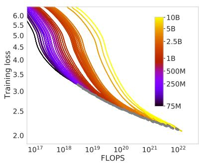
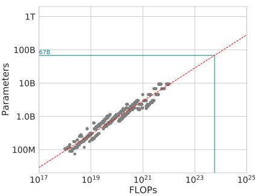
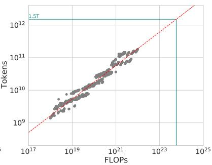

# Chinchilla: Training Compute-Optimal Large Language Models — 精读融合版

> 阅读指南：论文原文保持不动，每个章节后穿插中文讲解（📖 标记）。

---

# Abstract

We investigate the optimal model size and number of tokens for training a transformer language model under a given compute budget. We find that current large language models are significantly undertrained [...] By training over 400 language models ranging from 70 million to over 16 billion parameters on 5 to 500 billion tokens, we find that for compute-optimal training, the model size and the number of training tokens should be scaled equally: for every doubling of model size the number of training tokens should also be doubled.

> 📖 **讲解 · 鸟瞰**
>
> **一句话**：大模型都训练不够——应该等比例增长模型和数据（N∝C^0.50, D∝C^0.50），而非优先增模型。
>
> **核心数字**：400+ 模型，70M~16B，三种方法一致。Chinchilla-70B 用 1.4T tokens 超越 Gopher-280B（300B tokens）。
>
> **为什么重要？** 这直接改变了后来所有大模型的训练策略——LLaMA、Llama 2/3、Mistral 都按"更多数据"的思路训练。

---

# 1. Introduction

[原文：Kaplan et al. (2020) suggests that the optimal allocation is to increase model size faster than data size...]

> 📖 **讲解 · 精读 · 引言逐段拆解**
>
> **第1段**：训练大模型成本很高，而且只训练一次。所以"给定计算预算，怎么分配模型大小和数据量"是关键问题。
>
> **第2段**：Kaplan 的结论——计算增加 10 倍时，模型参数增加 5.5 倍，数据只增加 1.8 倍。这导致了 GPT-3 (175B/300B)、Gopher (280B/300B) 都是"大模型+少数据"。
>
> **第3段**：本文的反驳——模型和数据应该**等比例增长**。Table 1 显示所有当前大模型都只训练了 ~300B tokens——远远不够。
>
> **第4段**：验证方案——训练 Chinchilla-70B + 1.4T tokens，用相同计算预算对比 Gopher-280B。

Table 1: Current LLMs

| Model | Size | Training Tokens |
|-------|------|----------------|
| GPT-3 | 175B | 300B |
| Gopher | 280B | 300B |
| MT-NLG 530B | 530B | 270B |
| **Chinchilla** | **70B** | **1.4T** |

> 📖 **讲解 · 精读 · Table 1 深度分析**
>
> **关键观察**：所有模型（除了 Chinchilla）都只训练了 ~300B tokens。不管参数量从 137B 到 530B，训练数据几乎一样——这就是"undertrained"的含义。
>
> Chinchilla 用 70B 参数但 1.4T tokens——参数只有 Gopher 的 1/4，数据是 4.7 倍。
>
> ❓ **为什么大家都用 300B tokens？** 因为 Kaplan 的 scaling law 说"优先增模型"。如果计算增加应该主要增大模型而不是增加数据，那大家都固定 300B tokens 然后拼参数量。

---

# 2. Related Work

[原文...]

> 📖 **讲解 · 精读 · 和 Kaplan 的三个关键区别**
>
> 论文在 Related Work 中直接指出了和 Kaplan 的方法论差异：
>
> 1. **学习率 schedule**：Kaplan 用固定长度的 cosine schedule（130B tokens）训练所有模型，导致短训练的模型的 loss 被高估。Chinchilla 对每个训练长度都调了匹配的 schedule。
>
> 2. **模型规模**：Kaplan 的大部分实验 <100M 参数，最大只有 1.5B。Chinchilla 的模型最大到 16B。
>
> 3. **曲率问题**：论文在 Appendix E 承认 FLOP-loss frontier 有轻微曲率——这意味着幂律关系在大规模时可能不准确。

---

# 3. Estimating the optimal parameter/training tokens allocation

## 3.1. Approach 1: Fix model sizes and vary number of training tokens

[原文...]

> 📖 **讲解 · 精读 · Approach 1（Envelope 方法）**
>
> **实验设计**：
> - 固定模型大小（70M 到 10B），每种大小训练 4 种不同长度的 cosine cycle
> - 对每个 FLOP 值取所有曲线中的最低 loss → 构成 envelope
> - 从 envelope 提取最优 (N, D) 对 → 拟合幂律
>
> **结果**：a = 0.50, b = 0.50
>
> **直觉**：envelope = "在每个计算预算下能达到的最好效果"。沿着 envelope 看最优模型大小和数据量如何随计算增长。

Figure 2: Training curve envelope

> 📖 **讲解 · 图表精读（Figure 2——Approach 1 核心图）**
>
> - **左面板**：所有训练曲线叠加。每种颜色 = 一个模型大小，4 条线 = 4 种训练长度。绿色标注 = Gopher 的计算预算。
> - **中面板**：从 envelope 提取的最优参数量 vs FLOPs。拟合 a=0.50。绿色点 = 在 Gopher 预算下预测最优 ~70B 参数。
> - **右面板**：最优 token 数 vs FLOPs。拟合 b=0.50。在 Gopher 预算下预测 ~1.4T tokens。
>
> **批判**：模型最大只有 10B，从 10B 外推到 70B 是 7 倍跳跃。但 Chinchilla 实际训练了 70B 并验证了预测。

## 3.2. Approach 2: IsoFLOP profiles

[原文...]

> 📖 **讲解 · 精读 · Approach 2（IsoFLOP 方法——最直观）**
>
> **实验设计**：
> - 固定 9 个 FLOP 预算
> - 在每个预算下训练不同大小的模型
> - 画 loss vs 模型大小的 U 形曲线
> - 取最低点作为该预算下的最优模型大小
>
> **结果**：a = 0.49, b = 0.51
>
> **为什么是 U 形？**
> - 左边（模型太小）：容量不够，underfitting
> - 右边（模型太大）：固定 FLOP 下数据太少，也 underfitting
> - 底部：容量和数据刚好匹配
>
> ❓ **直觉类比**：一周的复习时间（固定 FLOP），准备考试。书太薄（模型太小）知识不够；100 本厚书每本只看 1 页（模型太大、数据太少）也学不好。

## 3.3. Approach 3: Fitting a parametric loss function

[原文：$\hat{L}(N,D) = E + A/N^\alpha + B/D^\beta$...]

> 📖 **讲解 · 精读 · Approach 3（参数化方法）**
>
> **核心公式**：$L(N,D) = E + A/N^\alpha + B/D^\beta$
>
> - $E$：irreducible loss（数据的固有熵，~1.69）
> - $A/N^\alpha$：模型容量不足的误差（$\alpha ≈ 0.34$）
> - $B/D^\beta$：数据不足的误差（$\beta ≈ 0.28$）
>
> **拟合结果**：a = 0.46, b = 0.54
>
> 注意 Approach 3 的 a=0.46 比前两种稍低——论文解释是因为 Huber loss 给高 FLOP 点更多权重，而 frontier 有轻微负曲率。
>
> ❓ **这个函数形式的假设合理吗？** N 和 D 的贡献是**可加的**——这个假设没有理论证明。如果 N 和 D 之间有交互作用（比如大模型需要更多数据才能发挥优势），可加形式就不准确。

## 3.4. Optimal model scaling

Table 2: 三种方法的指数对比

| Approach | a | b |
|----------|---|---|
| 1. Envelope | 0.50 | 0.50 |
| 2. IsoFLOP | 0.49 | 0.51 |
| 3. Parametric | 0.46 | 0.54 |
| Kaplan et al. | 0.73 | 0.27 |

> 📖 **讲解 · 精读 · Table 2——论文最核心的数字**
>
> **核心发现**：三种方法都给出 a≈0.50, b≈0.50——和 Kaplan 的 a=0.73 有本质区别。
>
> **统计显著性**：Bootstrap 置信区间（10th-90th）：
> - Approach 1: a ∈ (0.49, 0.50)
> - Approach 2: a ∈ (0.46, 0.53)
> - Kaplan: a = 0.73
>
> 置信区间不重叠 → 差异统计显著。
>
> **实际含义**：计算翻倍时，Kaplan 说模型参数翻 1.66x、数据翻 1.21x；Chinchilla 说两者都翻 1.41x。

Table 3: 最优训练配置预测

> 📖 **讲解 · 精读 · Table 3 的实际指导意义**
>
> - **70B 模型**：需要 $5.76 \times 10^{23}$ FLOPs + 1.4T tokens → 就是 Chinchilla
> - **175B 模型**：需要 $4.41 \times 10^{24}$ FLOPs + 4.2T tokens → GPT-3 只用了 300B tokens，严重不足
> - **280B 模型**：需要 $10^{25}$ FLOPs + 6.8T tokens → Gopher 也只用了 300B
> - **1T 参数模型**：需要 $10^{26}$ FLOPs → 除非有 Gopher 250 倍的计算，否则不值得训练

---

# 4. Chinchilla

## 4.1. Model and training details

[原文...]

> 📖 **讲解 · 精读 · Chinchilla vs Gopher 配置**
>
> | | Chinchilla | Gopher |
> |---|-----------|--------|
> | 参数 | 70B | 280B |
> | Tokens | 1.4T | 300B |
> | FLOPs | 相同 | 相同 |
> | 架构 | 同 Gopher | Gopher |
>
> **关键设计**：相同的计算预算，相同的架构——唯一改变的是参数量/数据量的比例。这是最干净的对照实验。

## 4.2. Results

### MMLU

| Model | 5-shot |
|-------|--------|
| Random | 25.0% |
| GPT-3 | 43.9% |
| Gopher | 60.0% |
| **Chinchilla** | **67.6%** |
| Human expert | 89.8% |

> 📖 **讲解 · 精读 · MMLU 结果**
>
> **+7.6% over Gopher**——这是最旗舰的结果。70B 胜过 280B，直接验证了 scaling law 预测。
>
> **但离人类专家还有 22%**——说明模型规模和数据的增长不能解决所有问题。

### Reading Comprehension

| Task | Chinchilla | Gopher | 提升 |
|------|-----------|--------|------|
| LAMBADA | 77.4 | 74.5 | +2.9 |
| RACE-m | 86.8 | 75.1 | **+11.7** |
| RACE-h | 82.3 | 71.6 | **+10.7** |

> 📖 **讲解 · 为什么阅读理解提升最大？**
>
> RACE 测试篇章理解能力——更多训练数据让模型接触了更多样的文本结构和表达方式。这说明 Chinchilla 不只是"记住了更多知识"，而是"理解语言的能力真的更强了"。

### Common Sense

| Task | Chinchilla | Gopher |
|------|-----------|--------|
| HellaSwag | 80.8% | 79.2% |
| PIQA | 81.8% | 81.8% |
| Winogrande | 82.7% | 80.8% |

> 📖 **讲解 · 常识推理提升有限**
>
> 常识推理的提升不如 MMLU 和阅读理解——说明"更多数据"主要帮助知识存储和语言理解，对"推理"帮助有限。这是 Chinchilla 的一个隐含局限。

---

# 5. Discussion & Conclusion

[原文...]

> 📖 **讲解 · 知识网络**
>
> **Chinchilla 的遗产**：
> 1. 改变了训练策略——LLaMA 直接按 Chinchilla 思路训练（小模型+多数据）
> 2. 证明了 scaling law 需要在大规模上验证——Kaplan 在小规模上的结论不能直接外推
> 3. 强调了数据收集的重要性——1.4T tokens 的需求远超当时的数据量
>
> **面试核心**：
> - Q: Chinchilla 的核心发现？A: N∝C^0.50, D∝C^0.50，模型和数据等比例增长
> - Q: 三种方法？A: Envelope + IsoFLOP + 参数化拟合，都给出 a≈0.50
> - Q: 影响？A: 催生 LLaMA，改变了所有大模型的训练策略
> - Q: 局限？A: 只验证一种架构，最大实验模型只有 16B，不讨论数据质量
