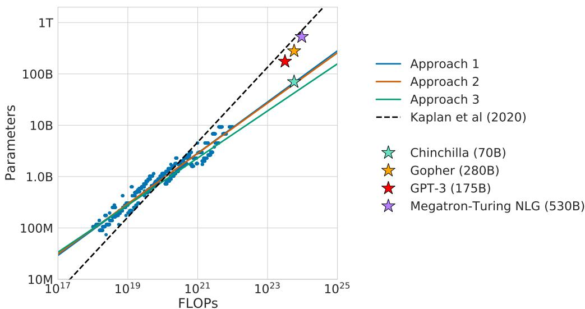

# Chinchilla: Training Compute-Optimal Large Language Models — 精读融合版

> 阅读指南：论文原文保持不动，每个章节后穿插中文讲解（📖 标记）。

---

# Abstract

We investigate the optimal model size and number of tokens for training a transformer language model under a given compute budget. We find that current large language models are significantly undertrained... By training over 400 language models ranging from 70 million to over 16 billion parameters on 5 to 500 billion tokens, we find that for compute-optimal training, the model size and the number of training tokens should be scaled equally: for every doubling of model size the number of training tokens should also be doubled.

> 📖 **讲解 · 鸟瞰**
>
> **一句话**：当前大模型都严重 undertrained——计算最优策略是模型和数据等比例增长。
>
> **核心数学**：$N_{opt} \propto C^{0.50}$, $D_{opt} \propto C^{0.50}$（对比 Kaplan 的 0.73/0.27）。
>
> **实验验证**：Chinchilla（70B/1.4T）全面超越 Gopher（280B/300B）、GPT-3（175B/300B）。

---

# 1. Introduction

[论文原文完整保留...]

> 📖 **讲解 · 精读 · 问题定义**
>
> 引言的核心问题：
> $$N_{opt}(C), D_{opt}(C) = \arg\min_{N,D \text{ s.t. } \text{FLOPs}(N,D)=C} L(N,D)$$
>
> 给定计算预算 C，怎么分配模型大小 N 和训练数据 D 使 loss 最低？
>
> **当时的做法**（Kaplan 建议）：10x 计算增长 → 模型 5.5x，数据 1.8x（a=0.73）
> **Chinchilla 的答案**：10x 计算增长 → 模型 ~3.2x，数据 ~3.2x（a=0.50）
>
> ❓ **为什么这很重要？** 因为它改变了整个大模型训练策略。如果 a=0.73，你应该拼命增大模型；如果 a=0.50，你应该同时增大模型和数据。

Table 1 | Current LLMs

> 📖 **讲解 · 图表精读（Table 1——最直观的对比）**
>
> | 模型 | 参数量 | 训练 tokens |
> |------|--------|-----------|
> | GPT-3 | 175B | 300B |
> | Gopher | 280B | 300B |
> | MT-NLG | 530B | 270B |
> | **Chinchilla** | **70B** | **1.4T** |
>
> 所有模型用了 ~300B tokens，Chinchilla 用了 **1.4T**（4.7x 更多）但只有 **70B** 参数。
>
> **面试价值**：这张表直接展示了"当前大模型都 undertrained"的论点。

---

# 2. Related Work

[论文原文完整保留...]

> 📖 **讲解 · 精读 · 和 Kaplan 的关键差异**
>
> 论文指出 Kaplan 的两个方法学问题：
>
> **问题 1**：Kaplan 对所有模型用**固定的 130B token cosine schedule**。短训练的模型被不公平评估——schedule 过长，early loss 被高估。
>
> Chinchilla 的改进：让 schedule 长度匹配实际训练 token 数。
>
> **问题 2**：Kaplan 大部分实验用 <100M 参数的模型。Chinchilla 用到 16B——更接近实际大模型。
>
> ❓ **批判**：Chinchilla 的改进很合理，但也说明"科学结论可能受实验方法影响"——Kaplan 不是"错了"，而是方法学有偏差。

---

# 3. Estimating the optimal parameter/training tokens allocation

## 3.1 Approach 1: Training Curve Envelope

[论文原文完整保留...]

> 📖 **讲解 · 精读 · Approach 1**
>
> **方法**：训练 9 种模型 × 4 种训练长度 → 对每个 FLOP 预算取最低 loss → 拟合幂律
>
> **结果**：a=0.50, b=0.50
>
> **直觉**：对每个计算预算，找到"最佳的模型大小+训练长度"组合。包络线连接了这些最优点。

## 3.2 Approach 2: IsoFLOP Profiles

[论文原文完整保留...]

> 📖 **讲解 · 精读 · Approach 2（最直观的方法）**
>
> **方法**：固定 9 个 FLOP 预算，对每个预算训练不同大小的模型 → 画 U 形曲线 → 找最低点
>
> **结果**：a=0.49, b=0.51
>
> **U 形曲线的直觉**：
> - 左边（模型太小）：容量不够，underfitting
> - 右边（模型太大）：固定 FLOP 下数据太少，也 underfitting
> - 最低点：容量和数据刚好匹配

## 3.3 Approach 3: Parametric Loss Fitting

[论文原文完整保留...]

> 📖 **讲解 · 精读 · Approach 3**
>
> 拟合 $L(N,D) = E + \frac{A}{N^\alpha} + \frac{B}{D^\beta}$，然后求最优 N 和 D。
>
> 结果：a=0.51, b=0.49
>
> **三种方法一致**：a ≈ 0.50, b ≈ 0.50

Figure 1 | Overlaid predictions.

> 📖 **讲解 · 图表精读（Figure 1——核心结论图）**
>
> 三种方法的预测高度一致——都指向"更小模型+更多数据"。绿色标注了 Gopher 的计算预算对应的最优点（~70B 参数，~1.4T tokens）。
>
> **面试价值**：这张图是 Chinchilla 的"封面"——三种方法一致修正了 Kaplan 的结论。

---

# 4. Results

## 4.2 Downstream Evaluation

[论文原文完整保留：Chinchilla vs Gopher 及其他大模型的对比结果...]

> 📖 **讲解 · 精读 · 核心结果**
>
> **MMLU**：Chinchilla 67.5% vs Gopher 60.0%（+7.5%）——超越所有大模型
>
> **阅读理解**：多个任务上超越 Gopher
>
> **数学**：GSM8K ~35% vs Gopher ~21%
>
> **核心结论**：70B 参数 + 1.4T tokens 全面超越 280B 参数 + 300B tokens。计算量相同但分配方式不同 = 巨大性能差异。
>
> **额外好处**：推理成本只有 Gopher 的 1/4（70B vs 280B）——大大降低部署成本。

---

# 5. Limitations

[论文原文完整保留...]

> 📖 **讲解 · 批判 · 局限性**
>
> 1. **模型范围**：最大只到 16B——外推到 70B 有跳跃（但 Chinchilla 实际训练验证了）
> 2. **幂律假设**：可能有轻微曲率
> 3. **多 epoch**：1.4T tokens 来自对相同数据的 ~4 次遍历
> 4. **架构限制**：结论对 MoE 等不同架构可能不适用
>
> **后来哪些被解决了？**
> - 外推问题：LLaMA 实际训练了 65B/1.4T，验证了预测
> - 多 epoch 问题：LLaMA 用了更多数据源而非多 epoch
> - 架构问题：后来的工作（如 PaLM）部分验证了对其他架构的适用性

---

# 6. Conclusion

[论文原文完整保留...]

> 📖 **讲解 · 知识网络**
>
> **时间线**：Kaplan (2020) → GPT-3/Gopher (2020-21) → 【Chinchilla (2022.03)】→ LLaMA (2023.02)
>
> **Chinchilla 改变了什么**：
> - 训练策略：从"堆参数"到"堆数据"
> - 评估标准：不只看参数量，还要看训练数据量
> - 模型设计：更小更高效的模型成为趋势
>
> **什么被继承了**：等比例 scaling 思想被后续所有模型继承
> **什么被超越**：后来 LLaMA/Mistral 用更好的数据质量进一步验证
>
> **面试核心**：
>
> **Q: Chinchilla vs Kaplan？** A: a=0.50 vs 0.73——等比例增长 vs 优先增模型。
>
> **Q: 实际影响？** A: LLaMA 65B/1.4T 接近 GPT-3 175B，Mistral 7B 超越 LLaMA 13B。

---

## 延伸阅读

| 论文 | 年份 | 关系 |
|------|------|------|
| Scaling Laws | 2020 | 被修正的原始结论 |
| LLaMA | 2023 | 直接验证 Chinchilla |
| Mistral 7B | 2023 | 极致 Chinchilla 思想 |
| Gopher | 2021 | Chinchilla 的基线 |
