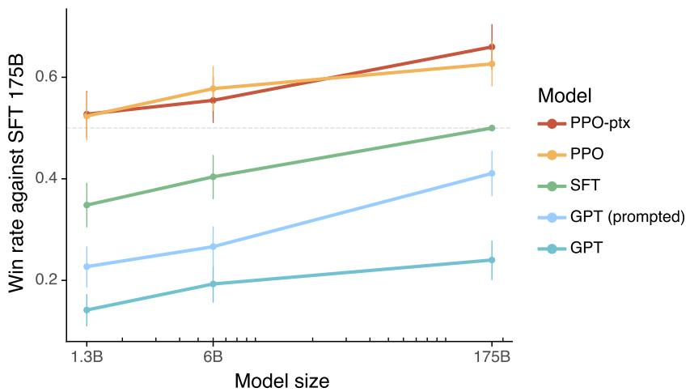
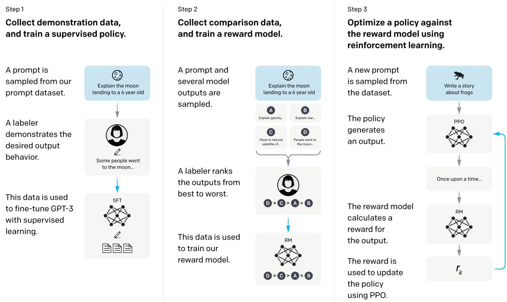

# InstructGPT — 精读融合版

> 论文原文保持不动，穿插中文讲解（📖 标记）。

---

# Abstract

Making language models bigger does not inherently make them better at following a user's intent [...] In human evaluations on our prompt distribution, outputs from the 1.3B parameter InstructGPT model are preferred to outputs from the 175B GPT-3, despite having 100x fewer parameters.

> 📖 **讲解 · 鸟瞰**
>
> **一句话**：RLHF 让 1.3B 模型超越 175B——对齐比规模重要。
>
> **核心数字**：1.3B > 175B（100x 参数差距！），truthful 翻倍，幻觉率 21% vs 41%。

---

# 1. Introduction

[原文...]

> 📖 **讲解 · 精读 · 核心问题**
>
> 语言建模目标 ≠ 指令跟随。GPT-3 擅长续写，但不擅长 follow 指令。
>
> 三个对齐目标：Helpful + Honest + Harmless
>
> ❓ **这三个有冲突吗？** 有。用户要求有害内容时 helpful vs harmless 矛盾。

Figure 1: 人类偏好评估

> 📖 **讲解 · 图表精读（Figure 1——最核心的结果图）**
>
> PPO-ptx 175B winrate ~85% vs SFT baseline。PPO-ptx 1.3B winrate ~60%，远超 GPT-3 的 ~10%。
>
> **1.3B > 175B GPT-3** = 100x 参数效率提升。
>
> ❓ **为什么差距这么大？** GPT-3 做"续写"而非"回答"——InstructGPT 学会了 follow 指令。

Figure 2: 三阶段流程图

> 📖 **讲解 · 图表精读（Figure 2——RLHF 三阶段）**
>
> Step 1 (SFT): 人工撰写 prompt+回答 → 监督微调
> Step 2 (RM): 模型生成多个输出 → 标注员排序 → 训练 reward model
> Step 3 (PPO): PPO 微调 SFT 模型，用 RM 作为 reward
>
> 关键改进：PPO-ptx 混合预训练更新 → 缓解 alignment tax

---

# 3. Methods

## 3.1 High-level methodology

[原文...]

> 📖 **讲解 · 精读 · 三阶段详解**
>
> **Stage 1 SFT**:
> - ~13K prompts + 人工演示
> - 2-3 epochs
> - 175B SFT 已经比 GPT-3 好
>
> **Stage 2 RM**:
> - ~33K prompts + 排序（4 个输出排序）
> - loss = -log σ(r(x, y_w) - r(x, y_l))
> - RM 大小 6B（更大反而不稳定）
>
> **Stage 3 PPO**:
> - ~31K prompts
> - objective = E[r(x,y)] - β·KL(π_θ || π_ref)
> - PPO-ptx：混合预训练更新

## 3.2 Dataset

Table 1: API Prompt 分布

> 📖 **讲解 · 精读 · 训练数据**
>
> Generation 45.6% + Open QA 12.4% + Brainstorming 11.2% = 来自真实 API 使用
>
> 和 FLAN/T0 的学术 NLP 任务分布完全不同 → 这是 InstructGPT 实用的关键

---

# 4. Results

## 4.1 Results on the API distribution

[原文...]

> 📖 **讲解 · 精读 · 核心结果**
>
> - 175B InstructGPT preferred 85% over 175B GPT-3
> - 1.3B InstructGPT preferred over 175B GPT-3
> - InstructGPT 更 follow 约束、更少幻觉
>
> ❓ **为什么 FLAN/T0 远不如 InstructGPT？** FLAN/T0 用学术 NLP 任务训练，和真实 API 分布不匹配。winrate: FLAN 29.8%, T0 26.8% vs InstructGPT 73.4%

## 4.2 Results on public NLP datasets

[原文...]

> 📖 **讲解 · 精读 · Alignment Tax**
>
> 纯 PPO 导致 SQuAD 从 89→79，DROP 从 76→67。PPO-ptx 缓解到 84/73。
>
> ❓ **为什么 RLHF 损害 NLP 能力？** RM 偏好 ≠ NLP 基准偏好。RM 可能偏好"简洁"而非"准确"。

---

> 📖 **讲解 · 知识网络**
>
> **InstructGPT 的遗产**：ChatGPT 的技术基础，开启了 RLHF 时代
>
> **后续发展**：DPO（跳过 RM）、Constitutional AI（AI 自我对齐）、LLaMA-2 Chat（开源 RLHF）
>
> **面试核心**：
> - Q: 三阶段？A: SFT → RM → PPO(-ptx)
> - Q: 为什么 1.3B > 175B？A: 对齐比规模重要
> - Q: Alignment Tax？A: RLHF 损害 NLP 能力，PPO-ptx 缓解
