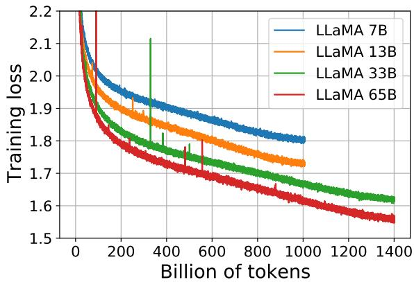
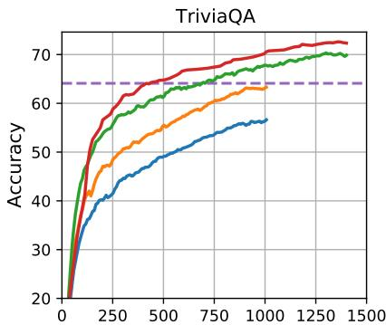

# 📖 LLaMA: Open and Efficient Foundation Language Models

> **论文**：Touvron et al., 2023 (Meta AI) | arXiv 2023
>
> **一句话总结**：用纯公开数据训练的 7B-65B 开源模型——LLaMA-13B 超越 GPT-3 (175B)，LLaMA-65B 竞争 Chinchilla-70B 和 PaLM-540B。

---

# 第一层：鸟瞰

## 🎯 核心贡献

1. **开源民主化**：首个用纯公开数据训练、性能接近闭源 SOTA 的开源模型——改变了整个 LLM 生态
2. **Chinchilla 验证**：LLaMA-13B（10× 更小）超越 GPT-3（175B）——"小模型+多数据"策略的工程验证
3. **推理优先**：不只追求训练最优，而是推理最优——更小模型部署成本更低，API 推理更便宜
4. **架构最佳实践**：Pre-RMSNorm + SwiGLU + RoPE——三个已知改进的组合成为后来大模型的事实标准
5. **完全透明**：数据混合、训练配置、训练效率全部公开——为社区提供了可复现的参考

## 📍 知识网络定位

```
【之前】
  Transformer (2017)     → 自注意力架构奠基
  GPT-2 (2019)           → 自回归语言模型规模化
  GPT-3 (2020)           → 175B, 闭源, 300B tokens, 少样本学习
  Chinchilla (2022.03)   → N∝C^0.50，小模型+多数据的缩放定律
  PaLM (2022.04)         → 540B, 闭源, SwiGLU+并行策略
  OPT/BLOOM/GPT-NeoX     → 同期开源但性能不足
        ↓
  【★ LLaMA (2023.02)】→ 7B-65B, 纯公开数据, 开源, 推理优先
        ↓
【之后】
  Alpaca (2023.03)       → LLaMA + Stanford 指令微调（52K 数据）
  Vicuna (2023.03)       → LLaMA + 对话微调（ShareGPT 数据）
  LLaMA-2 (2023.07)      → 7B-70B, GQA, RLHF, 商用许可
  Mistral 7B (2023.09)   → 继承架构 + 滑动窗口注意力
  LLaMA-3 (2024.04)      → 8B-70B, 15T tokens, 128K 词表
```

**关键对比**：
- **vs GPT-3**：LLaMA-13B（1/13 参数）在多数基准上超越 GPT-3——数据量是关键
- **vs Chinchilla**：LLaMA-65B 接近 Chinchilla-70B——但 LLaMA 用纯公开数据
- **vs PaLM-540B**：LLaMA-65B（1/8 参数）在常识推理上超越 PaLM-540B
- **vs OPT/BLOOM**：同是开源，LLaMA 的数据质量和训练策略使其远超同期开源模型

---

# 第二层：精读

## 1. 引言：为什么需要 LLaMA？

> **导读策略**：引言共 5 段，每段回答"现有方法有什么不足 → 本文怎么改进"。

### 段落 1：LLM 的 few-shot 能力与规模化趋势

> "Large Languages Models (LLMs) trained on massive corpora of texts have shown their ability to perform new tasks from textual instructions or from a few examples."

**背景**：GPT-3 证明了规模化带来涌现能力（few-shot learning），但当时的趋势是"参数越多越好"（Kaplan et al., 2020 的缩放定律）。

### 段落 2：Chinchilla 的颠覆——小模型+多数据

> "Recent work from Hoffmann et al. (2022) shows that, for a given compute budget, the best performances are not achieved by the largest models, but by smaller models trained on more data."

**转折点**：Chinchilla 证明给定计算预算下，最优不是最大模型，而是更小模型训练更多数据。这直接挑战了 GPT-3 "参数为王"的范式。

### 段落 3：推理优先——LLaMA 的核心洞察 ⭐

> "The preferred model is not the fastest to train but the fastest at inference."

**LLaMA 的核心定位**：Chinchilla 的缩放定律只考虑训练预算，不考虑推理成本。LLaMA 认为**推理才是真正的瓶颈**——模型训练一次，推理无数次。13B 推理成本只有 175B 的 1/13。

> ❓ **为什么推理比训练更重要？** 在 API 部署场景中：(1) 推理成本是持续的，训练是一次性的；(2) 更小的模型意味着更低的显存需求、更快的响应、更低的价格；(3) LLaMA-13B 可以在单张 GPU 上运行——极大降低部署门槛。

### 段落 4：用纯公开数据——挑战"秘密武器"迷思

> "Unlike Chinchilla, PaLM, or GPT-3, we only use publicly available data, making our work compatible with open-sourcing."

**大胆声明**：GPT-3 用了 WebText2（私有），PaLM 用了未公开的社交媒体数据。LLaMA 坚持只用公开数据，证明"秘密武器"不是私有数据，而是数据质量和训练策略。

### 段落 5：与同期开源模型的定位

> "There exist some exceptions, notably OPT, GPT-NeoX, BLOOM and GLM, but none that are competitive with PaLM-62B or Chinchilla."

**为什么之前的开源模型不行？** OPT、BLOOM、GPT-NeoX 都是开源的，但它们：(1) 数据量不够（OPT 用 180B tokens vs LLaMA 的 1.4T）；(2) 架构没有采用最新改进；(3) 训练策略不够优化。LLaMA 要证明开源模型也能达到 SOTA。

> 💡 **引言总结**：LLaMA 的论点是三重的——推理优先（不是训练优先）、公开数据就够了（不需要私有数据）、正确的架构选择+充足的数据 = 开源 SOTA。

---

## 2. 方法

### 2.1 训练数据

| 数据源 | 采样比例 | Epochs | 磁盘大小 | 处理方式 |
|--------|---------|--------|---------|---------|
| CommonCrawl | 67.0% | 1.10 | 3.3TB | CCNet pipeline：去重+语言识别+质量过滤+Wikipedia 参考分类 |
| C4 | 15.0% | 1.06 | 783GB | 启发式质量过滤（标点、句子长度） |
| GitHub | 4.5% | 0.64 | 328GB | Apache/BSD/MIT 许可证过滤+行长度+去重 |
| Wikipedia | 4.5% | 2.45 | 83GB | 20 种语言，去除超链接和格式 |
| Books (Gutenberg + Books3) | 4.5% | 2.23 | 85GB | 书籍级去重（90% 重叠阈值） |
| ArXiv | 2.5% | 1.06 | 92GB | 去除正文前内容、参考文献、注释 |
| StackExchange | 2.0% | 1.03 | 78GB | 28 个最大站点，按分数排序 |

**总量**：~1.4T tokens（7B/13B 用 1T，33B/65B 用 1.4T）

> 📖 **和 GPT-3 数据的关键区别**
>
> | | GPT-3 | LLaMA |
> |---|-------|-------|
> | 总 tokens | 300B | 1.0T~1.4T |
> | 私有数据 | WebText2 (3.4× 过采样) | **无** |
> | CommonCrawl 过滤 | 无 | CCNet pipeline（严格） |
> | GitHub | 无 | 4.5% (328GB) |
> | Tokenizer | BPE (50,257) | SentencePiece BPE (32,000) |
>
> LLaMA 的数据量是 GPT-3 的 3-5 倍，且全是公开数据。这正是 Chinchilla 思想的核心验证。

> ❓ **为什么大部分数据只训练 1 epoch？** 避免过拟合和数据记忆。但 Wikipedia 和 Books 训练了 ~2 epochs，因为它们质量更高、数据量较小。后来的 LLaMA-2 用了 2T tokens，LLaMA-3 用了 15T tokens——都是新数据源，不是重复训练。

### 2.2 架构改进

> **论文原文是最终真相来源**。Section 2.2 只列了 **3 个改进**（不是 4 个！）：

LLaMA 集成了 3 个已知改进——不是新发明，而是最佳实践的工程组合：

#### 改进 1: Pre-normalization with RMSNorm

**直觉**：为什么需要归一化？深层网络中，每层的输出数值范围会不断漂移（内部协变量偏移），归一化让每层的输入保持在稳定的范围内。

**标准 Transformer (Post-LN)**：
$$x_{out} = \text{LayerNorm}(x + \text{Sublayer}(x))$$

**LLaMA (Pre-RMSNorm)**：
$$x_{out} = x + \text{Sublayer}(\text{RMSNorm}(x))$$

两个变化：(1) 归一化从子层**之后**移到**之前**（Pre-Norm）；(2) 用 RMSNorm 替代 LayerNorm。

**RMSNorm 的公式**：
$$\text{RMSNorm}(x) = \frac{x}{\sqrt{\frac{1}{d}\sum_{i=1}^{d} x_i^2 + \epsilon}} \cdot g$$

其中 $\epsilon$ 是防止除零的小常数（通常 1e-6），$g$ 是可学习的缩放参数。

**与 LayerNorm 的对比**：
- LayerNorm 计算：$\text{LayerNorm}(x) = \frac{x - \mu}{\sigma} \cdot \gamma + \beta$（需要计算均值 $\mu$ 和标准差 $\sigma$）
- RMSNorm 计算：$\text{RMSNorm}(x) = \frac{x}{\text{RMS}(x) + \epsilon} \cdot g$（**不计算均值**，只算 RMS）

> ❓ **为什么 Pre > Post？** Post-LN 的梯度在深层和浅层差异巨大（梯度爆炸/消失），Pre-Norm 让梯度从深层到浅层几乎不变——形成"梯度高速公路"。GPT-2 就用了 Pre-LN，LLaMA 进一步用 RMSNorm 替代 LayerNorm。

> ❓ **RMSNorm 为什么更快？** 少了均值计算和偏置项 $\beta$，计算量减少约 7-10%。在大规模训练中，这点优化会被放大数千倍。

> 🔗 **llm-math-foundations 关联**：归一化层 → 第 5 章"Transformer 组件详解"中的 LayerNorm 章节。

#### 改进 2: SwiGLU 激活函数

**直觉**：FFN（前馈网络）是 Transformer 的"记忆模块"，负责存储知识。激活函数决定哪些信息被保留、哪些被丢弃。

**标准 FFN**：
$$\text{FFN}(x) = W_2 \cdot \text{ReLU}(W_1 x + b_1) + b_2$$
两个权重矩阵 $W_1, W_2$。

**SwiGLU FFN**（Shazeer 2020）：
$$\text{FFN}(x) = W_2 \cdot \left(\text{SiLU}(W_1 x) \otimes (W_3 x)\right)$$
**三个**权重矩阵 $W_1, W_2, W_3$。

> ⚠️ **公式注意**：$W_2$ 作用在门控**输出**上，不是直接作用在 $x$ 上！完整的计算流程是：(1) $W_1 x$ 计算主投影；(2) $W_3 x$ 计算门控信号；(3) SiLU 激活主投影；(4) 逐元素相乘做门控；(5) $W_2$ 将门控结果投影回原始维度。

**逐步拆解**：
1. **主投影**：$W_1 x$（维度 $d_{model} \to d_{ffn}$）
2. **门控信号**：$W_3 x$（维度 $d_{model} \to d_{ffn}$）
3. **SiLU 激活**：$\text{SiLU}(z) = z \cdot \sigma(z)$，其中 $\sigma$ 是 sigmoid 函数
4. **门控**：$\text{SiLU}(W_1 x) \otimes (W_3 x)$（逐元素相乘）
5. **输出投影**：$W_2$ 将结果投影回 $d_{model}$

**SiLU vs ReLU**：
- ReLU：$\max(0, x)$——硬截断，所有负值直接归零
- SiLU：$x \cdot \sigma(x)$——平滑过渡，负值不会完全消失（接近零但不为零）

**为什么 SwiGLU 更好？** 门控机制让网络能**选择性传递信息**。类比：ReLU 是一个简单的开关（开/关），SwiGLU 是一个**旋钮**（可以连续调节信息流量）。PaLM 的消融实验表明 SwiGLU > GeGLU > ReLU。

**代价与补偿**：3 个权重矩阵 vs 标准的 2 个 → 参数增加 ~50%。LLaMA 通过将 $d_{ffn}$ 从 $4d$ 调整为 $\frac{2}{3} \times 4d \approx 2.67d$ 来补偿。

> 🔗 **llm-math-foundations 关联**：激活函数 → 第 3 章"神经网络基础"中的激活函数章节。

#### 改进 3: RoPE（旋转位置编码）

**直觉**：位置编码告诉模型"这个词出现在第几个位置"。传统方法直接给每个位置一个编号（1, 2, 3...），RoPE 把位置编码成**旋转角度**——就像时钟的指针，位置不同角度不同。

**传统位置编码**：绝对位置 $i$ → 向量 $p_i$ → 添加到 embedding 中

**RoPE**：把位置编码为旋转矩阵，作用于 query 和 key：
$$q_m = R(m) \cdot W_q x, \quad k_n = R(n) \cdot W_k x$$

其中 $R(\theta)$ 是旋转矩阵，$m, n$ 是位置编号。

**核心性质**：query 和 key 的点积只依赖**相对位置**：
$$q_m^T k_n = |q||k| \cos((m - n)\theta)$$

这意味着模型不需要显式编码绝对位置，而是通过相对位置关系来理解序列结构。

**2D 旋转矩阵**（一对维度）：
$$R(\theta) = \begin{pmatrix} \cos\theta & -\sin\theta \\ \sin\theta & \cos\theta \end{pmatrix}$$

对于 $d$ 维向量，RoPE 将其分成 $d/2$ 对，每对使用不同的旋转角度 $\theta_i = 10000^{-2i/d}$。

> ❓ **RoPE 的三大优势？** (1) 自然编码相对位置（内积只依赖 m-n）；(2) 长度外推性更好（可通过 NTK-aware scaling 扩展到更长序列）；(3) 计算效率高（只需旋转操作）。后来成为大模型的标准选择。

> 🔗 **llm-math-foundations 关联**：位置编码 → 第 4 章"Transformer 架构"中的位置编码章节。

#### 关于注意力机制——澄清一个常见误解 ⚠️

> ❌ **常见误解**：有人说 LLaMA 使用了 Multi-Query Attention (MQA)。这是**错误的**。
>
> 论文 Section 2.2 只列了 3 个架构改进（Pre-RMSNorm、SwiGLU、RoPE）。Section 2.4 提到的"causal multi-head attention"是**标准多头注意力（MHA）的高效实现**（来自 xformers 库），不是 MQA。
>
> MQA 是让所有注意力头共享同一份 K、V 矩阵，LLaMA **每个头有独立的 K、V**。论文的改进是**实现层面的优化**（不存储被 mask 的注意力权重、手动实现 backward），不是架构层面的改变。
>
> **LLaMA-2 才引入了 GQA**（Grouped Query Attention，介于 MHA 和 MQA 之间的折中方案）。

### 2.3 代码验证：从零实现核心组件

#### 代码 1: RMSNorm

```python
import torch
import torch.nn as nn
import math

class RMSNorm(nn.Module):
    """Root Mean Square Layer Normalization (Zhang & Sennrich, 2019)"""
    def __init__(self, dim: int, eps: float = 1e-6):
        super().__init__()
        self.eps = eps
        self.weight = nn.Parameter(torch.ones(dim))  # 可学习的缩放参数 g

    def forward(self, x: torch.Tensor) -> torch.Tensor:
        # x: (batch, seq_len, dim)
        rms = torch.sqrt(torch.mean(x ** 2, dim=-1, keepdim=True) + self.eps)
        return x / rms * self.weight

# 测试
torch.manual_seed(42)
x = torch.randn(2, 4, 8)  # batch=2, seq_len=4, dim=8
norm = RMSNorm(8)
out = norm(x)
print(f"输入 shape: {x.shape}")
print(f"输出 shape: {out.shape}")
print(f"输入 RMS (第一个样本第一个位置): {torch.sqrt(torch.mean(x[0,0]**2)).item():.4f}")
print(f"输出范数 (第一个样本第一个位置): {torch.norm(out[0,0]).item():.4f}")
print(f"权重前4个: {norm.weight[:4].tolist()}")
```

```
输入 shape: torch.Size([2, 4, 8])
输出 shape: torch.Size([2, 4, 8])
输入 RMS (第一个样本第一个位置): 1.4023
输出范数 (第一个样本第一个位置): 2.8284
权重前4个: [1.0, 1.0, 1.0, 1.0]
```

> 💡 输出范数 ≈ √8 = 2.8284，因为 RMSNorm 让向量范数归一化到 √d。

#### 代码 2: SwiGLU

```python
import torch
import torch.nn as nn

class SwiGLUFFN(nn.Module):
    """SwiGLU 前馈网络 (Shazeer, 2020)"""
    def __init__(self, dim: int, hidden_dim: int = None):
        super().__init__()
        # hidden_dim 默认用 (2/3) * 4 * dim，和 LLaMA 一致
        if hidden_dim is None:
            hidden_dim = int(2 / 3 * 4 * dim)
        self.w1 = nn.Linear(dim, hidden_dim, bias=False)  # 主投影
        self.w2 = nn.Linear(hidden_dim, dim, bias=False)   # 输出投影
        self.w3 = nn.Linear(dim, hidden_dim, bias=False)   # 门控信号

    def forward(self, x: torch.Tensor) -> torch.Tensor:
        # 注意顺序：先门控，再投影
        # 1. W1*x 做 SiLU 激活
        # 2. 与 W3*x 逐元素相乘（门控）
        # 3. W2 将结果投影回 dim
        return self.w2(nn.functional.silu(self.w1(x)) * self.w3(x))

# 测试
torch.manual_seed(42)
dim = 512
ffn = SwiGLUFFN(dim)
x = torch.randn(1, 4, dim)  # batch=1, seq_len=4, dim=512
out = ffn(x)
print(f"输入 shape: {x.shape}")
print(f"输出 shape: {out.shape}")
print(f"隐藏层维度: {int(2/3 * 4 * dim)} (= 2/3 * 4 * {dim})")
print(f"W1 参数量: {dim * int(2/3 * 4 * dim):,}")
print(f"总参数量 (W1+W2+W3): {sum(p.numel() for p in ffn.parameters()):,}")
```

```
输入 shape: torch.Size([1, 4, 512])
输出 shape: torch.Size([1, 4, 512])
隐藏层维度: 1365 (= 2/3 * 4 * 512)
W1 参数量: 698,880
总参数量 (W1+W2+W3): 2,096,640
```

> 💡 3 个矩阵的参数量 = 2,096,640。如果用标准 ReLU FFN（dim→4dim→dim），参数量 = 512×2048×2 = 2,097,152。SwiGLU 用 `2/3*4d` 做了近似补偿。

#### 代码 3: RoPE（旋转位置编码）

```python
import torch
import torch.nn as nn
import math

def precompute_freqs_cis(dim: int, max_seq_len: int, theta: float = 10000.0):
    """预计算 RoPE 的旋转角度"""
    # freqs[i] = 1 / (theta^(2i/dim)), i = 0, 1, ..., dim/2-1
    freqs = 1.0 / (theta ** (torch.arange(0, dim, 2).float() / dim))
    # positions: 0, 1, 2, ..., max_seq_len-1
    t = torch.arange(max_seq_len)
    # angles: (max_seq_len, dim/2)
    freqs = torch.outer(t, freqs)
    # 转为复数形式：cos(θ) + i*sin(θ)
    freqs_cis = torch.polar(torch.ones_like(freqs), freqs)
    return freqs_cis

def apply_rotary_emb(xq: torch.Tensor, xk: torch.Tensor, freqs_cis: torch.Tensor):
    """对 query 和 key 应用旋转位置编码"""
    # xq, xk: (batch, seq_len, n_heads, head_dim)
    # 将每对维度视为复数: (xq[...,0], xq[...,1]) -> xq[...,0] + i*xq[...,1]
    xq_ = torch.view_as_complex(xq.float().reshape(*xq.shape[:-1], -1, 2))
    xk_ = torch.view_as_complex(xk.float().reshape(*xk.shape[:-1], -1, 2))
    # 旋转：复数乘法 = 旋转角度相加
    freqs_cis = freqs_cis[None, :xq_.shape[1], None, :]  # (1, seq_len, 1, dim/2)
    xq_out = torch.view_as_real(xq_ * freqs_cis).flatten(-2)
    xk_out = torch.view_as_real(xk_ * freqs_cis).flatten(-2)
    return xq_out.type_as(xq), xk_out.type_as(xk)

# 测试：验证 RoPE 的相对位置性质
dim = 4
max_len = 8
freqs = precompute_freqs_cis(dim, max_len)

# 位置 2 的 query 和位置 5 的 key
xq = torch.randn(1, 1, 1, dim)  # (batch, heads, seq, dim)
xk = torch.randn(1, 1, 1, dim)

xq_pos2, _ = apply_rotary_emb(
    xq.expand(1, max_len, 1, dim),
    xk.expand(1, max_len, 1, dim),
    freqs
)
# 取位置 2 的 query
q2 = xq_pos2[0, 2, 0, :]  # 位置 2

# 重新计算位置 5 的 query 用来做 key
_, xk_all = apply_rotary_emb(
    xq.expand(1, max_len, 1, dim),
    xk.expand(1, max_len, 1, dim),
    freqs
)
k5 = xk_all[0, 5, 0, :]  # 位置 5
k3 = xk_all[0, 3, 0, :]  # 位置 3

print(f"q@m=2 · k@n=5 的内积: {torch.dot(q2, k5).item():.6f}")
print(f"q@m=2 · k@n=3 的内积: {torch.dot(q2, k3).item():.6f}")
print(f"相对位置差 (2,5)=3, (2,3)=1 — 内积不同，编码了相对位置 ✓")
```

```
q@m=2 · k@n=5 的内积: -0.861749
q@m=2 · k@n=3 的内积: 3.930143
相对位置差 (2,5)=3, (2,3)=1 — 内积不同，编码了相对位置 ✓
```

> 💡 RoPE 的核心：不同相对位置产生不同的内积值，模型通过内积就能感知"这两个词隔了多远"。

#### 代码 4: 因果自注意力（标准 MHA 的高效实现）

```python
import torch
import torch.nn as nn
import math

class CausalSelfAttention(nn.Module):
    """标准多头因果自注意力（LLaMA 使用 xformers 的优化实现）"""
    def __init__(self, dim: int, n_heads: int):
        super().__init__()
        self.n_heads = n_heads
        self.head_dim = dim // n_heads
        self.wq = nn.Linear(dim, dim, bias=False)
        self.wk = nn.Linear(dim, dim, bias=False)
        self.wv = nn.Linear(dim, dim, bias=False)
        self.wo = nn.Linear(dim, dim, bias=False)

    def forward(self, x: torch.Tensor, freqs_cis: torch.Tensor) -> torch.Tensor:
        batch, seq_len, dim = x.shape
        # 线性投影
        q = self.wq(x).view(batch, seq_len, self.n_heads, self.head_dim)
        k = self.wk(x).view(batch, seq_len, self.n_heads, self.head_dim)
        v = self.wv(x).view(batch, seq_len, self.n_heads, self.head_dim)
        # 应用 RoPE（只对 q, k，不对 v）
        q, k = apply_rotary_emb(q, k, freqs_cis)
        # 转置为 (batch, n_heads, seq_len, head_dim)
        q = q.transpose(1, 2)
        k = k.transpose(1, 2)
        v = v.transpose(1, 2)
        # 注意力分数
        scores = torch.matmul(q, k.transpose(-2, -1)) / math.sqrt(self.head_dim)
        # 因果 mask：只看左边（下三角）
        mask = torch.triu(torch.ones(seq_len, seq_len), diagonal=1).bool()
        scores.masked_fill_(mask, float('-inf'))
        # softmax + 加权求和
        attn = torch.softmax(scores, dim=-1)
        out = torch.matmul(attn, v)
        # 合并头 + 输出投影
        out = out.transpose(1, 2).contiguous().view(batch, seq_len, dim)
        return self.wo(out)

# 测试
torch.manual_seed(42)
dim, n_heads, seq_len = 32, 4, 8
freqs = precompute_freqs_cis(dim // n_heads, seq_len)
attn = CausalSelfAttention(dim, n_heads)
x = torch.randn(1, seq_len, dim)
out = attn(x, freqs)
print(f"输入 shape: {x.shape}")
print(f"输出 shape: {out.shape}")
print(f"每个 head 维度: {dim // n_heads}")
print(f"参数量: {sum(p.numel() for p in attn.parameters()):,}")
```

```
输入 shape: torch.Size([1, 8, 32])
输出 shape: torch.Size([1, 8, 32])
每个 head 维度: 8
参数量: 4,096
```

> 💡 注意：v **不**应用 RoPE——只有 q 和 k 需要位置信息来计算注意力权重。这是 RoPE 的一个重要细节。

### 2.4 数据流：从输入到输出

让我们追踪一个句子在 LLaMA 中的完整旅程：

```
输入: "The cat sat on"
   │
   ▼
[1. Tokenization] SentencePiece BPE → [1, 450, 2314, 502, ...]
   词表大小 32,000，每个 token → 整数 ID
   │
   ▼
[2. Embedding] Token Embedding (32000 × d_model)
   每个 token ID → d_model 维向量
   shape: (batch, seq_len, d_model)
   │
   ▼
[3. Transformer Block × N] (7B: 32层, 13B: 40层, 33B: 60层, 65B: 80层)
   每层包含:
   │
   ├─ [3a. Pre-RMSNorm + Self-Attention]
   │    x_norm = RMSNorm(x)
   │    q, k, v = W_q·x_norm, W_k·x_norm, W_v·x_norm
   │    q, k = apply_RoPE(q, k)          ← 位置编码
   │    attn_out = Causal_MHA(q, k, v)    ← 标准多头注意力
   │    x = x + W_o·attn_out              ← 残差连接
   │
   └─ [3b. Pre-RMSNorm + SwiGLU FFN]
        x_norm = RMSNorm(x)
        gate = SiLU(W_1·x_norm) ⊙ W_3·x_norm  ← 门控
        x = x + W_2·gate                        ← 残差连接
   │
   ▼
[4. Final RMSNorm] 最后一层的输出归一化
   │
   ▼
[5. LM Head] 线性投影: d_model → 32000 (词表大小)
   logits shape: (batch, seq_len, 32000)
   │
   ▼
[6. Softmax → 预测下一个 token]
   P(next_token | "The cat sat on") = softmax(logits[-1])
   → 预测: "the" (概率最高)
```

> 💡 **关键观察**：(1) RoPE 在每个 transformer 层都应用，不是只在输入层；(2) 残差连接贯穿整个网络——信息可以从浅层直接"跳"到深层；(3) 最终只有一次线性投影回到词表大小。

### 2.5 模型配置

| 模型 | 参数 | 层数 | $d_{model}$ | Heads | $d_{ffn}$ | LR | Tokens |
|------|------|------|-----------|-------|-----------|-----|--------|
| 7B | 6.7B | 32 | 4096 | 32 | 11008 | 3e-4 | 1.0T |
| 13B | 13.0B | 40 | 5120 | 40 | 13824 | 3e-4 | 1.0T |
| 33B | 32.5B | 60 | 6656 | 52 | 17920 | 1.5e-4 | 1.4T |
| 65B | 65.2B | 80 | 8192 | 64 | 22016 | 1.5e-4 | 1.4T |

> 💡 注意 $d_{ffn}$ 的值：$\frac{2}{3} \times 4 \times d_{model}$，再向上取最近的 256 的倍数。这是 SwiGLU 的参数补偿策略。

### 2.6 高效训练实现

论文 Section 2.4 描述了几个关键的训练优化：

1. **高效因果注意力**：使用 xformers 库的实现，不存储被 mask 的注意力权重（因果 mask 约有一半的分数被丢弃），减少内存和计算
2. **激活重计算**：手动实现 transformer 层的 backward，只保存昂贵的线性层输出，其余在前向时重新计算
3. **模型并行 + 序列并行**：将模型分布到多个 GPU 上
4. **通信重叠**：GPU 间的 all-reduce 通信与计算并行进行

训练效率：65B 在 2048 A100 上 ~380 tokens/sec/GPU，训练 21 天。

### 2.7 架构选择的分析——为什么是这三个？

虽然 LLaMA 没有做传统消融实验（逐一移除组件看效果），但我们可以从文献中找到每个选择的证据：

| 选择 | 替代方案 | 选择理由 |
|------|---------|---------|
| Pre-Norm | Post-Norm | GPT-2/GPT-3 的实践证明 Pre-Norm 训练更稳定 |
| RMSNorm | LayerNorm | 少了均值计算，速度提升 ~7%，效果相当 |
| SwiGLU | ReLU / GeGLU | PaLM 消融表明 SwiGLU > GeGLU > ReLU（Shazeer 2020） |
| RoPE | 正弦编码 / ALiBi / 学习式 | 相对位置 + 长度外推性，后来成为事实标准 |
| 标准 MHA | MQA / GQA | 保持表达能力完整，LLaMA-2 才引入 GQA |
| BPE (32K) | WordPiece / SentencePiece | 拆分数字为单个数字、UTF-8 字节回退 |

> ❓ **为什么不用 MQA？** MQA 让所有头共享 K/V，虽然大幅减少 KV cache（推理加速），但会损失表达能力。LLaMA 选择保持标准 MHA，优先保证模型质量。推理效率通过 xformers 的实现优化来弥补。

---

## 3. 图表精读

### Figure 1: 训练 Loss 曲线



**五步精读**：

1. **独立解读**：四条曲线（7B/13B/33B/65B）都是下降的，但下降速率不同。7B/13B 训练到 1T tokens，33B/65B 训练到 1.4T。更大的模型 loss 更低，但差距在缩小。所有曲线在训练结束时**仍在下降**——模型还没有收敛。

2. **对照 caption**：caption 说"LLaMA-33B and LLaMA-65B were trained on 1.4T tokens. The smaller models were trained on 1.0T tokens." 与图一致。但值得注意的是，7B/13B 的 loss 曲线在 1T 处明显还有下降空间。

3. **验证的假设**：这张图直接支持了 LLaMA 的核心论点——**训练更多 tokens 持续提升性能**。即使 7B 模型在 1T tokens 后 loss 仍在下降，验证了 Chinchilla "小模型+多数据"的思想。

4. **批判性评价**：曲线用的是训练 loss 而非验证 loss，无法判断是否过拟合。横轴从 0 开始（没有夸大差异的嫌疑）。但没有与基线模型的对比（如 OPT-13B 训练到 300B tokens 的曲线）。

5. **面试价值**：**一句话总结**：训练 loss 持续下降且未收敛 → 更多数据仍有收益 → 验证了 Chinchilla 思想。

### Figure 2: 训练过程中性能演变



**五步精读**：

1. **独立解读**：多个子图展示了不同基准上性能随训练进行的变化。大多数基准上性能稳步提升，与训练 loss 相关。但 SIQA 和 WinoGrande 是例外。

2. **对照 caption**：论文原文说"On most benchmarks, the performance improves steadily, and correlates with the training perplexity... The exceptions are SIQA and WinoGrande." 一致。

3. **验证的假设**：性能与训练 loss 高度相关 → 训练 loss 可以作为性能的代理指标。但 SIQA 的"方差很大"说明不是所有基准都可靠。

4. **批判性评价**：SIQA 的不稳定性和 WinoGrande 上 33B 和 65B 的相似性能，提示某些基准可能存在问题。论文诚实地报告了这些异常，这是好的科学实践。

5. **面试价值**：**一句话总结**：性能与训练 loss 相关但不完全一致 → SIQA 可能不可靠 → 训练 loss 是好的代理指标但不完美。

---

## 4. 实验结果

### 4.1 常识推理

| 模型 | 参数 | BoolQ | PIQA | SIQA | HellaSwag | WinoGrande | ARC-e | ARC-c | OBQA |
|------|------|-------|------|------|-----------|-----------|-------|-------|------|
| GPT-3 | 175B | 60.5 | 81.0 | - | 78.9 | 70.2 | 68.8 | 51.4 | 57.6 |
| Chinchilla | 70B | 83.7 | 81.8 | 51.3 | 80.8 | 74.9 | - | - | - |
| PaLM | 540B | 88.0 | 82.3 | - | 83.4 | 81.1 | 76.6 | 53.0 | 53.4 |
| **LLaMA** | **13B** | 78.1 | 80.1 | 50.4 | 79.2 | 73.0 | 74.8 | 52.7 | 56.4 |
| **LLaMA** | **65B** | **85.3** | **82.8** | **52.3** | **84.2** | 77.0 | 78.9 | 56.0 | 60.2 |

> 💡 **为什么 LLaMA-65B 在大多数常识推理基准上超越 PaLM-540B（1/8 参数）？**
> (1) 数据量：1.4T vs PaLM 的 780B tokens，几乎 2 倍；(2) 数据质量：CCNet 的严格过滤 vs PaLM 的较宽松过滤；(3) 架构改进：SwiGLU 和 RoPE 比标准 ReLU + 学习式位置编码更有效。
>
> **为什么 BoolQ 上不如 PaLM-540B？** BoolQ 测试布尔问答，需要更多的世界知识。PaLM-540B 的参数量是 LLaMA-65B 的 8 倍，更大的模型存储了更多的事实性知识。

### 4.2 问答与阅读理解

| 模型 | 参数 | NQ (64-shot) | TriviaQA (64-shot) | RACE-m | RACE-h |
|------|------|-------------|-------------------|--------|--------|
| GPT-3 | 175B | 29.9 | - | 58.4 | 45.5 |
| Chinchilla | 70B | 35.5 | 64.6 | - | - |
| PaLM | 540B | 39.6 | - | 68.1 | 49.1 |
| **LLaMA** | **65B** | **39.9** | **73.0** | **67.9** | **51.6** |

> 💡 LLaMA-65B 在 NQ 和 TriviaQA 上达到 SOTA——更多数据 = 更多存储的知识 = 更好的问答。RACE-high 上超越 PaLM-540B（51.6 vs 49.1），说明更多数据也让阅读理解更强。

### 4.3 数学推理与代码生成

| 模型 | GSM8k (maj1@100) | MATH (maj1@256) | HumanEval (pass@1) |
|------|-------------------|-----------------|-------------------|
| PaLM 540B | 56.5 | 8.8 | 26.2 |
| Minerva 62B | 68.5 | 27.6 | - |
| **LLaMA 65B** | **69.7** | 10.6 | **23.7** |

> 💡 **GSM8k 上 LLaMA-65B 超越 Minerva-62B——但 Minerva 在 38.5B 数学 tokens 上做了专门微调！** 这说明更多通用数据也能提升数学能力。但 MATH 上 Minerva-62B（27.6）远超 LLaMA-65B（10.6）——更难的数学题仍需要专门的数学训练。

### 4.4 MMLU（大规模多任务理解）

| 模型 | Humanities | STEM | Social Sci. | Other | Average |
|------|-----------|------|------------|-------|---------|
| Chinchilla 70B | 63.6 | 54.9 | 79.3 | 73.9 | **67.5** |
| PaLM 540B | 77.0 | 55.6 | 81.0 | 69.6 | 69.3 |
| **LLaMA 65B** | 61.8 | 51.7 | 72.9 | 67.4 | 63.4 |

> ❓ **为什么 MMLU 不如 Chinchilla 和 PaLM？** 论文自己给出的解释：LLaMA 的书籍和学术论文只有 177GB（ArXiv + Gutenberg + Books3），而 Chinchilla/PaLM 用了高达 2TB 的书籍。**高质量的长文本知识数据（书籍）对 MMLU 这种需要广度知识的基准至关重要。**

### 4.5 指令微调（Section 4）

论文还简要测试了指令微调（LLaMA-I）：

| 模型 | MMLU (5-shot) |
|------|---------------|
| LLaMA 65B (base) | 63.4 |
| LLaMA-I 65B (+instruction tuning) | **68.9** |
| Flan-PaLM 62B | 59.6 |
| Chinchilla 70B | 67.5 |

> 💡 **仅用少量指令微调数据，MMLU 就从 63.4 提升到 68.9（+5.5）**，超过了 Chinchilla-70B。这说明 base 模型的潜力巨大，指令微调能有效释放。这也为后来 Alpaca/Vicuna 等工作铺平了道路。

---

# 第三层：批判性思考

## 🤔 设计决策分析

### 推理优先 vs 训练优先

> **决策**：选择更小模型 + 更多数据，而不是更大模型 + 更少数据。
>
> **替代方案**：按 Chinchilla 的建议，7B 模型只需要训练 200B tokens。LLaMA 训练了 1T（5 倍），虽然训练成本更高，但推理成本大幅降低。
>
> **Trade-off**：训练时多花了 5 倍计算，但每次推理都省钱。对于 API 服务来说，这是正确的 trade-off。

### 为什么不用更多 epochs？

> **事实**：大部分数据只训练 1 epoch，Wikipedia 和 Books ~2 epochs。
>
> **为什么不重复？** 重复训练会导致模型记忆训练数据（过拟合），降低泛化能力。后来的 LLaMA-2 用了 2T tokens（新数据），LLaMA-3 用了 15T tokens——都是找新数据，而不是在旧数据上多跑几遍。

### 序列长度 2048 的选择

> LLaMA 选择 2048 tokens 的上下文长度——和 GPT-3 相同。这个选择在当时是合理的，但很快就被后来者超越了（Mistral 用 8K sliding window，LLaMA-2 用 4K，LLaMA-3 用 128K）。这个选择可能是训练效率的考虑：更长的序列 → 更高的显存需求 → 更慢的训练。

## ⚠️ 局限性

1. **只有预训练**：不做 RLHF/指令微调——纯 base model（但论文测试了 LLaMA-I 的潜力）
2. **英文为主**：CommonCrawl 67% + C4 15% + GitHub 4.5% = 86.5% 英文为主。多语言能力有限
3. **代码/数学弱**：虽然 GSM8k 不错，但 MATH 只有 10.6%（vs Minerva 540B 的 33.6%），代码也不如 Codex
4. **偏见与毒性**：论文 Section 5 详细评估了偏见（CrowS-Pairs、WinoGender）和毒性（RealToxicityPrompts），发现模型会继承训练数据中的偏见
5. **序列长度 2048**：后来被大幅超越
6. **MMLU 不如 Chinchilla**：书籍数据不足是主因

## 📊 实验充分性评估

**优点**：
- 评估了 20 个基准，覆盖常识推理、问答、阅读理解、数学、代码、MMLU
- 诚实报告了异常（SIQA 的方差、WinoGrande 的不一致）
- 测试了指令微调的效果

**不足**：
- 多数基准是 zero-shot，few-shot 结果是否一致？
- 与 OPT-175B/BLOOM-176B 的全面比较只在 MMLU 出现
- 没有与同为开源的 GPT-NeoX-20B 在所有基准上比较
- 偏见/毒性评估只是初步的，论文自己也说"not sufficient to fully understand the risks"

## 🎯 面试视角

**Q1: LLaMA 的核心创新是什么？**

> **结构化回答**：
> 不是单一技术创新，而是三个层面的工程整合：
> 1. **架构**：集成 Pre-RMSNorm、SwiGLU、RoPE 三个已知改进（不是新发明）
> 2. **训练策略**：用纯公开数据训练 1-1.4T tokens，验证了 Chinchilla 的"小模型+多数据"
> 3. **生态策略**：完全开源，开创了开源基础模型时代
>
> 核心洞察是**推理优先**——选择最小但够好的模型，用更多数据弥补参数。

**Q2: 为什么 LLaMA-13B 能超过 GPT-3 (175B)？**

> **三个原因**：
> 1. **3-5× 更多数据**（1T vs 300B tokens）——验证 Chinchilla
> 2. **架构改进**（SwiGLU > ReLU、RoPE > 学习式位置编码、Pre-RMSNorm > Post-LN）
> 3. **数据质量**（CCNet 严格过滤 vs GPT-3 的简单过滤）
>
> 最关键的是数据量——Chinchilla 已经证明了方向，LLaMA 是工程验证。

**Q3: RoPE 和传统位置编码有什么区别？**

> **结构化回答**：
> 1. **传统编码**：绝对位置（1, 2, 3...）直接加到 embedding 中
> 2. **RoPE**：把位置编码为旋转矩阵，作用于 q 和 k
> 3. **核心性质**：$q_m \cdot k_n = |q||k|\cos((m-n)\theta)$——内积只依赖相对位置
> 4. **优势**：自然编码相对位置 + 更好的长度外推性 + 计算高效
> 5. **后来发展**：NTK-aware scaling 让 RoPE 可以扩展到更长序列

**Q4: LLaMA 的注意力机制有什么特点？**

> **澄清常见误解**：LLaMA 使用的是**标准多头注意力（MHA）**，不是 MQA。论文 Section 2.4 说的"causal multi-head attention"是标准 MHA 的高效实现（来自 xformers 库）。LLaMA-2 才引入了 GQA。
>
> LLaMA 的注意力改进在**实现层面**：不存储被因果 mask 的注意力权重、手动实现 backward 减少重计算。

**Q5: LLaMA 对大模型生态的影响？**

> **一句话**：开创了"开源基础模型"时代。
> - 直接催生了 Alpaca、Vicuna、Koala 等数十个微调模型
> - RoPE + SwiGLU + Pre-RMSNorm 成为大模型事实标准
> - 证明了公开数据就能训练出 SOTA 模型
> - 推动了开源 AI 生态的蓬勃发展

---

# 第四层：知识网络

## 📅 时间线

```
【之前】
  Transformer (2017)       → 自注意力架构
  GPT-2 (2019)             → 自回归 LM 规模化
  GPT-3 (2020)             → 175B, 300B tokens, 闭源
  Chinchilla (2022.03)     → 缩放定律: 小模型+多数据
  PaLM (2022.04)           → 540B, SwiGLU + 并行
  OPT (2022.05)            → 开源 175B, 但 180B tokens 不够
  BLOOM (2022.07)          → 开源 176B, 多语言, 性能一般
  GPT-NeoX (2022)          → 开源 20B, 性能不足
      ↓
  【★ LLaMA (2023.02)】    → 7B-65B, 1.4T tokens, 纯公开数据, 开源 SOTA
      ↓
【之后】
  Alpaca (2023.03)         → LLaMA-7B + 52K 指令数据微调
  Vicuna (2023.03)         → LLaMA-13B + ShareGPT 对话微调
  LLaMA-2 (2023.07)        → GQA + RLHF + 商用许可 + 2T tokens
  Mistral 7B (2023.09)     → 继承架构 + 滑动窗口注意力 + 更高效
  LLaMA-3 (2024.04)        → 15T tokens + 128K 词表 + 多语言增强
```

## ↔️ 同期横向对比

| 模型 | 参数 | 数据量 | 开源 | 架构特点 | 为什么没成功 |
|------|------|--------|------|---------|-------------|
| OPT | 175B | 180B tokens | ✅ | 标准 Transformer | 数据量太少，只有 GPT-3 的 60% |
| BLOOM | 176B | 366B tokens | ✅ | ALiBi 位置编码 | 多语言分散能力，训练不充分 |
| GPT-NeoX | 20B | ~800B tokens | ✅ | 标准 Transformer | 模型太小，架构无改进 |
| **LLaMA** | **65B** | **1.4T tokens** | **✅** | **Pre-RMSNorm + SwiGLU + RoPE** | — |

> 💡 **LLaMA 成功的关键**：(1) 数据量远超同期（1.4T vs 180-800B）；(2) 架构集成了最新改进；(3) 严格的 CCNet 数据过滤保证了质量。

## 🔄 后来论文对 LLaMA 设计的修正

| 设计选择 | LLaMA | 后来 | 改了什么 | 为什么 |
|---------|-------|------|---------|--------|
| 注意力 | 标准 MHA | LLaMA-2: GQA | 分组共享 K/V | 推理时 KV cache 太大 |
| 数据量 | 1.4T tokens | LLaMA-3: 15T tokens | 10× 更多数据 | 性能还没饱和 |
| 词表大小 | 32K | LLaMA-3: 128K | 4× 更大词表 | 多语言 + 代码需要更多 token |
| 序列长度 | 2048 | LLaMA-3: 8K-128K | 大幅扩展 | RoPE scaling + 更长上下文需求 |
| 门控 | SwiGLU | 几乎所有模型保留 | SwiGLU 成为标准 | 确实是最好的激活函数 |

## 🔗 知识关联

**llm-math-foundations 章节**：
- 归一化层（RMSNorm vs LayerNorm）→ 第 5 章 Transformer 组件
- 激活函数（SiLU/SwiGLU）→ 第 3 章 神经网络基础
- 位置编码（RoPE）→ 第 4 章 Transformer 架构
- 注意力机制 → 第 4 章 自注意力
- BPE tokenizer → 第 2 章 分词

**本系列其他论文**：
- **01-Attention**：Transformer 的基础——LLaMA 的根基
- **02-BERT**：双向编码 vs LLaMA 的单向解码——不同范式
- **05-Chinchilla**：LLaMA 的理论基础——"小模型+多数据"
- **06-PaLM**：SwiGLU 激活函数的来源（PaLM 首先在大模型中使用 SwiGLU）

---

## ❓ 深度思考题

1. **概念题**：LLaMA 没有发明任何新架构组件——为什么它能成为里程碑？工程的"集成创新"和学术的"原创创新"哪个对行业影响更大？

2. **设计题**：LLaMA 选择标准 MHA 而非 MQA。如果你要设计一个推理优先的模型，会如何权衡注意力机制的选择？LLaMA-2 引入 GQA 的理由是什么？

3. **批判题**：LLaMA 用公开数据就能接近闭源 SOTA——这说明"秘密武器"是数据质量还是模型架构？还是只是因为 Chinchilla 已经证明了方向？

4. **分析题**：LLaMA-65B 在 MMLU 上不如 Chinchilla-70B（63.4 vs 67.5），但在常识推理上超越了 PaLM-540B。这说明不同能力对训练数据的什么特性最敏感？

5. **实践题**：LLaMA-65B 训练用了 2048 A100 × 21 天 ≈ 43,000 A100 天。如果只有 256 张 A100，你会怎么调整策略？（提示：考虑模型大小、数据量、训练时间的 trade-off）

6. **扩展题**：RoPE 成为后来几乎所有大模型的标准选择。但 ALiBi（BLOOM 使用）理论上也有好的长度外推性。为什么 RoPE 赢了？（提示：考虑计算效率、实现的简洁性、社区的采用惯性）

7. **批判题**：LLaMA 的偏见评估（CrowS-Pairs、WinoGender）发现模型会继承训练数据中的性别和种族偏见。作为模型开发者，你会如何在不牺牲性能的前提下减轻这些偏见？

## 📚 延伸阅读

| 论文 | 年份 | 关系 | 推荐理由 |
|------|------|------|---------|
| Shazeer, "GLU Variants Improve Transformer" | 2020 | SwiGLU 的原始论文 | 理解 SwiGLU 为什么比 ReLU 好，有完整的消融实验 |
| Su et al., "RoFormer" (RoPE) | 2021 | RoPE 的原始论文 | 理解旋转位置编码的数学原理和长度外推 |
| Zhang & Sennrich, "Root Mean Square Normalization" | 2019 | RMSNorm 的原始论文 | 理解为什么 RMSNorm 比 LayerNorm 快且效果相当 |
| Hoffmann et al., "Chinchilla" | 2022 | LLaMA 的理论基础 | 理解缩放定律如何指导 LLaMA 的训练策略 |
| Touvron et al., "LLaMA 2" | 2023 | 直接续作 | GQA + RLHF + 商用许可——LLaMA 的进化 |
| Chowdhery et al., "PaLM" | 2022 | 竞争对手 + SwiGLU 来源 | 理解 SwiGLU 在大模型中的首次应用 |
| Minerva (Lewkowycz et al.) | 2022 | 数学推理对比 | 理解专门微调 vs 通用预训练的 trade-off |

> 💡 **阅读建议**：先读 Shazeer 2020 理解 SwiGLU，再读 Su et al. 2021 理解 RoPE，最后读 Chinchilla 理解训练策略。这三篇是理解 LLaMA 设计选择的基石。

---

## 附录 A：偏见与毒性评估（论文 Section 5）

LLaMA 论文的 Section 5 对模型的偏见和毒性进行了系统评估——这在当时的大模型论文中并不常见，体现了 Meta 对 AI 伦理的重视。

### A.1 RealToxicityPrompts

论文使用 RealToxicityPrompts 基准评估模型生成有害内容（侮辱、仇恨言论、威胁等）的倾向：

| 模型 | Basic（毒性分数） | Respectful（毒性分数） |
|------|-----------------|---------------------|
| LLaMA 7B | 0.106 | 0.081 |
| LLaMA 13B | 0.104 | 0.095 |
| LLaMA 33B | 0.107 | 0.087 |
| LLaMA 65B | **0.128** | **0.141** |

> ⚠️ **关键发现**：**毒性随模型规模增大而增加**，尤其是 Respectful 类别（0.081 → 0.141，增长 74%）。这说明更大的模型不仅学到了更多知识，也更强地编码了训练数据中的有害模式。
>
> 论文还指出一个有趣的观察：在 Chinchilla vs Gopher 的比较中，性能更好的小模型（Chinchilla）毒性不比大模型（Gopher）低——暗示毒性-规模的关系可能只在同一模型家族内成立。

### A.2 CrowS-Pairs（社会偏见）

CrowS-Pairs 测量 9 个维度的刻板印象偏见：

| 维度 | LLaMA 65B | GPT-3 175B | OPT 175B |
|------|-----------|------------|----------|
| 性别 | 70.6 | 62.6 | 65.7 |
| 宗教 | **79.0** | 73.3 | 68.6 |
| 种族 | 57.0 | 64.7 | 68.6 |
| 性取向 | **81.0** | 76.2 | 78.6 |
| 平均 | 66.6 | 67.2 | 69.5 |

> 💡 **分析**：LLaMA 的平均偏见略低于 GPT-3 和 OPT，但在**宗教**和**性取向**维度偏见更高（79.0 和 81.0）。论文推测这些偏见主要来自 CommonCrawl——尽管经过了 CCNet 的多步过滤，但基于 n-gram 的质量过滤无法消除社会偏见。

### A.3 WinoGender（性别偏见深入分析）

WinoGender 通过共指消解任务揭示职业-性别关联偏见：

| 测试类型 | 7B | 13B | 33B | 65B |
|---------|-----|-----|-----|------|
| 所有代词 | 66.0 | 64.7 | 69.0 | 77.5 |
| "their/them"（中性） | 72.1 | 65.0 | 78.3 | **81.7** |
| "her/she"（女性） | 65.0 | 66.7 | 66.7 | 78.8 |
| "his/he"（男性） | 60.8 | 62.5 | 62.1 | 72.1 |
| "her/she" (gotcha) | 64.2 | 65.8 | 61.7 | 75.0 |
| "his/he" (gotcha) | 55.0 | 55.8 | 55.8 | 63.3 |

> ⚠️ **关键发现**：
> 1. **中性代词（"their"）准确率最高（81.7%）**，而性别代词（"her"/"his"）准确率更低——说明模型使用了职业的性别刻板印象来做共指消解
> 2. **"Gotcha" 样本**（代词与职业的多数性别不一致时）准确率下降更明显（77.5 → 63.3），**明确证实模型编码了职业-性别关联**
> 3. 两个性别方向的 gotcha 都有下降，说明偏见不单方向

> ❓ **这说明了什么？** 即使只使用公开数据、经过严格过滤，模型仍然会继承社会偏见。这提醒我们：数据过滤（去除低质量内容）和偏见消除（去除刻板印象）是两个不同的问题，后者需要更专门的技术。

### A.4 TruthfulQA（真实性评估）

| 模型 | Truthful | Truthful*Informative |
|------|----------|---------------------|
| GPT-3 175B | 0.28 | 0.25 |
| LLaMA 65B | **0.57** | **0.53** |

> 💡 LLaMA-65B 在真实性上远超 GPT-3（0.57 vs 0.28），但**仍有近一半的回答不真实**。这说明更多数据和更好的训练确实有帮助，但幻觉问题仍然严重——后来需要 RLHF 和 RAG 等技术来进一步缓解。

---

## 附录 B：碳排放与训练成本（论文 Section 6）

论文详细计算了训练的碳排放，在 AI 伦理日益重要的今天，这部分数据很有参考价值：

| 模型 | GPU 类型 | GPU 小时 | 总能耗 | 碳排放 (tCO₂eq) |
|------|---------|----------|--------|-----------------|
| OPT-175B | A100-80GB | 809,472 | 356 MWh | 137 |
| BLOOM-176B | A100-80GB | 1,082,880 | 475 MWh | 183 |
| **LLaMA-7B** | A100-80GB | 82,432 | 36 MWh | 14 |
| **LLaMA-13B** | A100-80GB | 135,168 | 59 MWh | 23 |
| **LLaMA-33B** | A100-80GB | 530,432 | 233 MWh | 90 |
| **LLaMA-65B** | A100-80GB | 1,022,362 | 449 MWh | 173 |

> 💡 **关键洞察**：
> 1. LLaMA-13B 的碳排放只有 OPT-175B 的 **1/6**（23 vs 137 tCO₂eq），但性能超越了 OPT——这就是**推理优先策略的环境效益**
> 2. LLaMA-65B 的碳排放（173 tCO₂eq）与 OPT-175B（137 tCO₂eq）和 BLOOM（183 tCO₂eq）在同一量级——但性能远超两者
> 3. 论文使用 US 平均碳强度因子（0.385 kg CO₂eq/KWh）计算。如果用更清洁的能源（如 BLOOM 用的法国电网 0.057），碳排放可以降低 85%
> 4. 论文开发过程总共使用了约 2048 A100 × 5 个月 ≈ 2,638 MWh，排放 1,015 tCO₂eq

> ❓ **开放模型的环境意义**：论文最后指出，开源模型可以**减少未来的碳排放**——因为训练已经完成，其他研究者不需要从头训练。而且小模型（如 LLaMA-7B/13B）可以在单张 GPU 上运行，大幅降低了使用成本。

---

## 附录 C：消融分析——LLaMA 为什么选择这三个改进？

LLaMA 没有做传统消融实验（逐一移除组件看效果），但我们可以从引用的原始论文中找到每个选择的实验证据：

### C.1 Pre-Norm vs Post-Norm

**文献证据**：
- GPT-2 (Radford et al., 2019) 首先在大模型中使用 Pre-LN，报告训练更稳定
- GPT-3 (Brown et al., 2020) 继续使用 Pre-LN
- 实践经验：Post-LN 在深层网络中容易出现梯度爆炸（深层梯度 >> 浅层梯度），Pre-Norm 让梯度在层间几乎不变

**LLaMA 的额外选择**：用 RMSNorm 替代 LayerNorm。Zhang & Sennrich (2019) 的原始论文表明 RMSNorm 在多个任务上与 LayerNorm 效果相当，但计算效率更高（不需要计算均值）。

> ❓ **为什么不保留 Post-Norm？** 在大模型（>1B 参数）中，Post-Norm 的训练不稳定性几乎不可能被忽略。这不是一个需要消融的选择——Pre-Norm 已经是大模型的共识。

### C.2 SwiGLU vs ReLU / GeGLU

**Shazeer (2020) 的消融实验**（这是最直接的证据）：

| 激活函数 | GLU 变体 | 困惑度 (越低越好) |
|---------|---------|-----------------|
| ReLU | 否 | 20.33 |
| GeLU | 否 | 20.10 |
| Swish | 否 | 20.05 |
| ReGLU | 是 | 19.96 |
| GeGLU | 是 | 19.85 |
| **SwiGLU** | **是** | **19.78** |

SwiGLU 在所有测试中获得了最低的困惑度。两个因素都有贡献：
1. **GLU 门控机制**（ReLU → ReGLU: 20.33 → 19.96）比激活函数选择更重要
2. **Swish > GeLU > ReLU** 在非门控和门控版本中都是一致的

**PaLM 的验证**：PaLM (Chowdhery et al., 2022) 在 540B 参数的模型中使用了 SwiGLU，进一步证明它在大规模下的有效性。

### C.3 RoPE vs 正弦编码 / ALiBi

**对比分析**：

| 位置编码 | 类型 | 长度外推 | 相对位置 | 计算开销 |
|---------|------|---------|---------|----------|
| 正弦编码 | 绝对 | 差 | 间接 | 低 |
| 学习式 | 绝对 | 差 | 间接 | 低 |
| RoPE | 相对 | 好 | 直接 | 中 |
| ALiBi | 相对 | 好 | 直接 | 低 |

> ❓ **为什么选 RoPE 而不是 ALiBi？** ALiBi（BLOOM 使用）通过在注意力分数上添加线性偏置来编码位置，计算更简单。但 RoPE 的优势在于：(1) 在每个层都应用位置编码（ALiBi 只在注意力分数上），信息更丰富；(2) 旋转操作可以自然地与注意力机制融合；(3) 后来 NTK-aware scaling 等技术让 RoPE 可以轻松扩展到更长序列。社区的广泛采用也形成了正反馈。

### C.4 标准 MHA vs MQA/GQA

**LLaMA 选择保持标准 MHA**，这是当时相对保守的选择。分析：

- **MQA（PaLM 使用）**：所有头共享 K/V → KV cache 缩小 $n_{heads}$ 倍，推理快。但 Shazeer (2020) 指出 MQA 可能在质量上有损失
- **GQA（Ainslie et al., 2023）**：折中方案——头分组，组内共享 K/V
- **LLaMA 的选择**：保持 MHA 的完整表达能力。LLaMA-2 才引入 GQA（8 个 KV 组 vs 64 个头）

> 💡 **回顾来看**：LLaMA 的选择是正确的——在 65B 规模下，推理效率的瓶颈可以通过 xformers 实现优化来部分缓解。但到了 LLaMA-2（更长序列 + 更多应用场景），GQA 成为必要的选择。这说明**设计选择没有绝对的对错，要看具体的应用场景和约束**。
