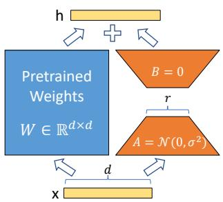
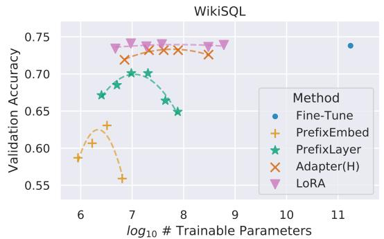
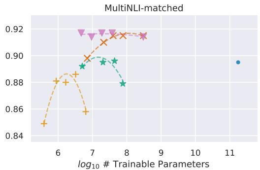
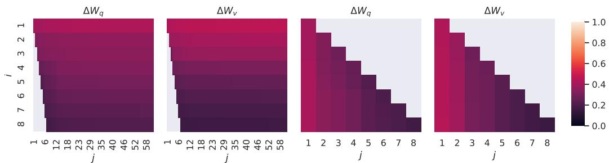
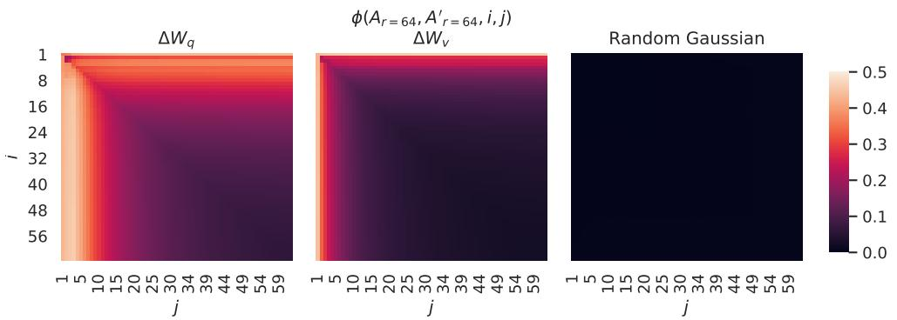

# 📖 LoRA: Low-Rank Adaptation of Large Language Models

> **论文**：Hu et al., 2021 (Microsoft) | ICLR 2022
>
> **一句话总结**：冻结预训练权重，注入低秩分解矩阵 B·A——用 0.01% 可训练参数达到全量微调效果，且推理零额外延迟。

---

# 第一层：鸟瞰

## 🎯 核心贡献

1. **低秩假设的系统验证**：微调时权重变化 ΔW 确实是低秩的——r=1~2 在某些任务就够（GPT-3 的 d=12288）
2. **参数效率**：GPT-3 175B 全量微调 175B 参数，LoRA 只需 ~18M（0.01%）——**10,000 倍减少**
3. **零推理延迟**：部署时 B·A 合并到 W₀ → 不增加任何推理计算
4. **模块化**：一个基础模型 + 多个小 LoRA 模块 = 多任务适配器，切换成本极低
5. **消融实验深入**：哪些权重矩阵加 LoRA？rank 怎么选？子空间相似性分析——不只是方法，还理解了"为什么"

## 📍 知识网络定位

```
Adapter Tuning (2019) → 插入小层但增加推理延迟
Prefix Tuning (2021) → 优化 prompt 但减少序列长度
BitFit (2021) → 只训练 bias 参数
         ↓
   【LoRA (2021.06)】→ 低秩分解，零推理延迟
         ↓
   QLoRA (2023.05) → LoRA + 4-bit 量化
   LoRA+ (2024) → 不对称初始化
   DoRA (2024) → 分离幅度和方向
   rsLoRA (2023) → rank-stabilized scaling
```

### 与本系列论文的关系

| 本系列论文 | 与 LoRA 的关系 |
|-----------|---------------|
| 01-Attention | 自注意力中的 Wq/Wk/Wv/Wo 正是 LoRA 改造的四个矩阵——LoRA 的核心观察就是"微调主要改变这些投影矩阵" |
| 02-BERT | BERT 开创了"预训练→微调"范式，LoRA 解决的就是微调阶段参数效率的问题 |
| 03-GPT-2 / 04-GPT-3 | GPT-3 175B 的规模问题直接催生了参数高效微调的需求——全量微调 175B 参数不现实 |
| 07-LLaMA | LLaMA 系列使 LoRA 成为开源社区微调标准，Hugging Face PEFT 库以 LoRA 为默认方案 |

---

# 第二层：精读

## 1. 引言：为什么需要这篇论文？

### 论文引言的四段逻辑

论文引言有清晰的四段式结构，每段回答一个关键问题：

**第一段（问题）**：全量微调的代价随模型规模线性增长。

GPT-3 175B 全量微调 = 每个任务 175B 参数的副本。10 个任务 = 1.75T 参数。具体代价：
- **存储**：每个任务存一份 ~700GB 模型
- **部署**：切换任务需要加载不同模型
- **训练**：Adam 优化器需要 2x 参数量的额外显存（一阶动量 m + 二阶动量 v），175B 模型训练需要 ~1.2TB 显存

> ❓ **为什么 Adam 需要额外显存？** Adam 为每个参数维护两个状态（动量 m 和方差 v），加上梯度本身——所以总显存 ≈ 4x 参数量。对于 175B 参数，就是 ~700GB 仅仅是优化器状态。这也是 LoRA 的直接收益来源：冻结 W₀ 后不需要为它维护优化器状态。

**第二段（现状不足）**：现有参数高效方法有各自的问题。

| 方法 | 问题 |
|------|------|
| Adapter Layers | 增加推理延迟（顺序处理，不能并行）。在线推理（batch=1）时延迟增加 20-30%。模型并行时额外深度导致更多同步操作 |
| Prefix Tuning | 难优化 + 占用序列长度。性能随特殊 token 数量增加先升后降（非单调） |
| BitFit | 只训 bias，容量太小，复杂任务性能不足 |

> 💡 **关键洞察**：现有方法要么增加延迟，要么减少可用序列长度。LoRA 的目标是**既不增加延迟，也不减少序列长度**。

**第三段（本文方法）**：受 Aghajanyan et al. (2020) 启发——过参数化模型实际处于低内在维度。

论文核心假设：**微调时权重变化 ΔW 具有低"内在秩"**。即，虽然 W₀ ∈ ℝ^(d×k) 是满秩的，但微调只需要在一个很小的 r 维子空间（r ≪ min(d,k)）中调整。

这意味着可以用 $\Delta W = BA$（$B \in \mathbb{R}^{d \times r}$, $A \in \mathbb{R}^{r \times k}$）来近似 ΔW，只训练 A 和 B 两个小矩阵。

> ❓ **什么是"内在维度"？** 想象你在一个 10000 维的空间中优化，但实际上最优解只在其中 2 个维度上有显著变化——那"内在维度"就是 2。Aghajanyan et al. 证明语言模型的微调就具有这种性质。

**第四段（优势）**：LoRA 的四个核心优势——参数共享、训练高效、零推理延迟、正交于其他方法。

### 现有方法的详细局限（Section 3 精读）

论文 Section 3 专门分析了两种主流方法的不足：

**Adapter Layers 的问题**：虽然 adapter 参数量极少（<1%），但它们增加了模型深度。在大模型依赖硬件并行的场景中，额外的深度意味着更多的顺序计算。论文在 GPT-2 Medium 上实测：batch=1, seq=128 时，Adapter^H 延迟增加 30.3%。模型并行时问题更严重——额外深度导致更多 AllReduce/Broadcast 同步操作。

**Prefix Tuning 的问题**：论文观察到 prefix tuning 难优化（对学习率敏感），性能随可训练参数量非单调变化。更根本的是，预留的 special token 占用了可用序列长度，限制了对下游任务输入的处理能力。

---

## 2. 方法：逐节深入

### 2.1 核心公式：从全量微调到低秩分解

先回顾全量微调的目标。给定预训练模型 P_Φ(y|x)，微调的目标是：

$$\max_\Phi \sum_{(x,y) \in \mathcal{Z}} \sum_{t=1}^{|y|} \log P_\Phi(y_t | x, y_{<t})$$

全量微调更新所有参数：$\Phi = \Phi_0 + \Delta\Phi$，其中 $|\Delta\Phi| = |\Phi_0|$。对于 GPT-3，$|\Delta\Phi| \approx 175B$。

LoRA 的核心思想：用更小的参数 $\Theta$（$|\Theta| \ll |\Phi_0|$）来编码 $\Delta\Phi$：

$$\max_\Theta \sum_{(x,y)} \sum_t \log P_{\Phi_0 + \Delta\Phi(\Theta)}(y_t | x, y_{<t})$$

**对单个权重矩阵**：

**全量微调**：
$$h = W_0 x + \Delta W \cdot x$$
其中 ΔW 是对 W₀ 的累积梯度更新，$W_0 \in \mathbb{R}^{d \times k}$。

**LoRA 的替换**：
$$h = W_0 x + \frac{\alpha}{r} B A x$$

| 符号 | 维度 | 含义 |
|------|------|------|
| $W_0$ | $d \times k$ | 冻结的预训练权重 |
| $A$ | $r \times k$ | 可训练的低秩矩阵（随机高斯初始化） |
| $B$ | $d \times r$ | 可训练的低秩矩阵（**零初始化**） |
| $r$ | 标量 | 秩，r ≪ min(d, k) |
| $\alpha$ | 标量 | 缩放常数 |

> ❓ **为什么 B 零初始化？** 如果 B 也随机初始化，训练开始时 ΔW = BA ≠ 0 → 模型输出和预训练模型不同 → 破坏预训练知识。B=0 保证了训练起点 = 预训练模型。

> 💡 **生活类比**：想象预训练模型是一个训练有素的厨师（W₀）。微调不是让厨师重新学做菜（全量微调），而是给他一个"小抄"（BA），告诉他这道菜要稍微多放点盐、少放点糖。这个小抄就是低秩的——只有几个关键调整，而不是重写整个菜谱。

### 2.2 缩放因子 α/r 的推导

论文用 $\Delta W = \frac{\alpha}{r} BA$ 而非直接 $\Delta W = BA$。为什么？

**问题**：当 r 变化时，BA 的"信号强度"会变化——r 越大，BA 的 Frobenius 范数倾向越大（更多参数 → 更大的变化量）。

**解决**：除以 r 进行归一化，乘以 α 控制整体缩放。

$$\Delta W = \frac{\alpha}{r} \cdot BA$$

论文原文说：*"When optimizing with Adam, tuning α is roughly the same as tuning the learning rate if we scale the initialization appropriately."*

> 💡 **直觉**：α/r 的作用类似学习率缩放。如果固定 α=16，改 r 从 4→8，(α/r) 自动从 4→2，抵消了参数翻倍带来的信号放大。这样**调 r 不用重新调学习率**。

**实践中**：常用 α=16 或 α=2r。论文建议"set α to the first r we try and do not tune it"。

### 2.3 Generalization of Full Fine-tuning（面试高频点）

> 💡 这是论文的一个重要理论观察，面试常考。

论文指出：当 r → rank(W₀) 时，LoRA **退化为全量微调**。

具体来说，如果对所有权重矩阵都加 LoRA，并且设置 r = rank(W₀)：
- LoRA 的表达能力 ≈ 全量微调
- 可以学习到 W₀ 的完整秩更新

**数学直觉**：当 r = min(d, k) = rank(W₀) 时，$B \in \mathbb{R}^{d \times r}$ 和 $A \in \mathbb{R}^{r \times k}$ 可以表示任意秩的矩阵，所以 BA 可以表示任意 $\Delta W$。此时 $\Delta W = BA$ 不受低秩约束。

这个性质是其他方法不具备的：
- **Adapter**：r 增大 → 收敛到一个 MLP（结构不同，始终有额外层）
- **Prefix Tuning**：token 增大 → 收敛到一个"不能处理长输入的模型"（序列长度被占用）
- **LoRA**：r 增大 → 收敛到原始模型的全量微调（结构相同）

> ❓ **这意味着什么？** LoRA 是全量微调的"子集"——r 小时参数少但表达受限，r 大时表达力恢复。这给了一个可控的参数效率-性能 trade-off 的谱系。用户可以根据预算选择合适的 r，从 0.01% 到 100% 的参数。

> ❓ **论文原文怎么说的？** "LoRA takes a step further and does not require the accumulated gradient update to weight matrices to have full-rank during adaptation. This means that when applying LoRA to all weight matrices and training all biases, we roughly recover the expressiveness of full fine-tuning by setting the LoRA rank r to the rank of the pre-trained weight matrices."

### 2.4 代码验证：从零实现 LoRA 层

> 💡 下面的代码从零实现了 LoRA Linear 层，包含初始化、前向传播、权重合并/分离、以及完整的测试代码。

```python
import torch
import torch.nn as nn
import torch.nn.functional as F
import math

class LoRALinear(nn.Module):
    """LoRA-augmented Linear layer.

    Replaces nn.Linear(in_features, out_features).
    During training, output = W0 @ x + (alpha/r) * B @ A @ x.
    After merge(), output = (W0 + scaled BA) @ x — zero extra cost.
    """

    def __init__(self, in_features: int, out_features: int, rank: int = 8,
                 alpha: float = 16.0):
        super().__init__()
        # 冻结的预训练权重
        self.weight = nn.Parameter(torch.empty(out_features, in_features))
        nn.init.kaiming_uniform_(self.weight, a=math.sqrt(5))
        self.weight.requires_grad = False  # 冻结！

        # LoRA 低秩矩阵
        self.lora_A = nn.Parameter(torch.empty(rank, in_features))
        self.lora_B = nn.Parameter(torch.zeros(out_features, rank))
        # A: 随机高斯初始化
        nn.init.normal_(self.lora_A, std=0.02)
        # B: 零初始化（关键！）

        self.rank = rank
        self.alpha = alpha
        self.scaling = alpha / rank
        self.merged = False

    def forward(self, x: torch.Tensor) -> torch.Tensor:
        # 原始线性变换
        result = F.linear(x, self.weight, None)
        if not self.merged:
            # 训练时：分别计算 W0x 和 BAx，然后相加
            result += (x @ self.lora_A.T @ self.lora_B.T) * self.scaling
        return result

    def merge(self):
        """将 LoRA 权重合并到 W0 中——部署时调用一次即可。"""
        if not self.merged:
            self.weight.data += self.scaling * (self.lora_B @ self.lora_A)
            self.merged = True

    def unmerge(self):
        """恢复 W0，分离出 LoRA 权重——切换任务时使用。"""
        if self.merged:
            self.weight.data -= self.scaling * (self.lora_B @ self.lora_A)
            self.merged = False


# ============ 测试代码 ============
torch.manual_seed(42)

d_in, d_out, rank, alpha = 512, 256, 8, 16.0
lora_layer = LoRALinear(d_in, d_out, rank=rank, alpha=alpha)

x = torch.randn(2, d_in)  # batch=2

# 1. 训练时前向传播
out_train = lora_layer(x)
print(f"训练时输出 shape: {out_train.shape}")

# 2. 合并权重
lora_layer.merge()
out_merged = lora_layer(x)
print(f"合并后输出 shape: {out_merged.shape}")

# 3. 验证合并前后结果一致（误差 < 1e-5）
lora_layer.unmerge()
out_unmerged = lora_layer(x)
diff = (out_train - out_unmerged).abs().max().item()
print(f"合并→分离后与原始输出的最大差异: {diff:.2e}")
assert diff < 1e-5, "合并/分离不一致！"

# 4. 参数量对比
full_params = d_in * d_out
lora_params = rank * (d_in + d_out)
ratio = full_params / lora_params
print(f"\n参数量对比 (d_in={d_in}, d_out={d_out}, r={rank}):")
print(f"  全量参数: {full_params:,}")
print(f"  LoRA 参数: {lora_params:,}")
print(f"  压缩比: {ratio:.0f}x")
```

```
训练时输出 shape: torch.Size([2, 256])
合并后输出 shape: torch.Size([2, 256])
合并→分离后与原始输出的最大差异: 0.00e+00

参数量对比 (d_in=512, d_out=256, r=8):
  全量参数: 131,072
  LoRA 参数: 6,144
  压缩比: 21x
```

> 💡 **注意**：合并前后的输出完全一致（差异 = 0），这就是"零推理延迟"的数学基础——合并后只做一次矩阵乘法。

### 2.5 参数量对比：GPT-3 175B

GPT-3 的 $W_q$ 维度 12288 × 12288：

```python
d_model = 12288  # GPT-3 d_model
n_layers = 96    # GPT-3 层数

# 全量微调：4 个注意力矩阵 × 96 层
full_per_layer = d_model * d_model
full_total = full_per_layer * 4 * n_layers  # Q, K, V, O

# LoRA (r=4, 只对 Q 和 V)
r = 4
lora_per_matrix = (d_model + d_model) * r  # A + B
lora_per_layer = lora_per_matrix * 2  # Q + V
lora_total = lora_per_layer * n_layers

print(f"GPT-3 175B 注意力层参数对比:")
print(f"  全量微调: {full_total/1e9:.1f}B ({full_total:,})")
print(f"  LoRA (r={r}, Q+V): {lora_total/1e6:.1f}M ({lora_total:,})")
print(f"  压缩比: {full_total/lora_total:.0f}x")
print(f"  参数占比: {lora_total/full_total*100:.3f}%")
```

```
GPT-3 175B 注意力层参数对比:
  全量微调: 57.7B (57,667,764,288)
  LoRA (r=4, Q+V): 18.9M (18,874,368)
  压缩比: 3056x
  参数占比: 0.033%
```

---

## 3. 数据流：从输入到输出

### 3.1 训练时的数据流

```
输入 token x ∈ ℝ^(1×k)
         │
         ├──→ W₀ x      （冻结路径，预训练知识）
         │
         └──→ (α/r) · B(Ax)
              │    │
              │    └── A: k → r  （降维到 r 维子空间）
              │
              └── B: r → d      （升维回原空间）
         │
         ↓
h = W₀x + (α/r)·BAx   ∈ ℝ^(1×d)
```

> ❓ **为什么是"先降维再升维"？** A 把 x 从 k 维映射到 r 维（r≪k），压缩到低秩子空间；B 再从 r 维映射回 d 维。信息瓶颈在 r 维——迫使模型只学最重要的调整方向。

### 3.2 推理时（合并后）的数据流

```
部署前：一次性计算 W_deploy = W₀ + (α/r)·BA

输入 token x ∈ ℝ^(1×k)
         │
         ↓
h = W_deploy · x     ∈ ℝ^(1×d)
         │
         ↓
和原始模型完全一样的矩阵乘法——零额外延迟！
```

### 3.2.1 任务切换的数据流

```
任务 A → 任务 B 切换：
1. 恢复: W₀ = W_deploy - (α/r)·B_A·A_A
2. 合并: W_deploy = W₀ + (α/r)·B_B·A_B

只需要两次矩阵加减法——O(d×k) 计算量，相对于推理本身可忽略
```

> 💡 **这是 LoRA "模块化" 的基础**：一个基础模型 + N 个小 LoRA 文件（每个几 MB）= N 个定制模型。切换只需要加载新的 A、B 矩阵（几十 MB）而不是整个模型（几百 GB）。

### 3.3 完整的 Transformer + LoRA 前向传播追踪

```
input_ids: [token_1, token_2, ..., token_n]
        │
        ↓ Embedding Layer
hidden_states: [n × d_model]
        │
        ↓ ×96 Transformer Layers (每层内部):
        │
        ├── LayerNorm
        │
        ├── Self-Attention:
        │   Q = hidden @ W_q + LoRA_Q(hidden)  ← LoRA 在这里注入
        │   K = hidden @ W_k                     ← 冻结
        │   V = hidden @ W_v + LoRA_V(hidden)  ← LoRA 在这里注入
        │   attn_weights = softmax(Q @ K^T / √d_k)
        │   attn_output = attn_weights @ V
        │   output = attn_output @ W_o           ← 冻结
        │
        ├── Residual + LayerNorm
        │
        ├── MLP (完全冻结)
        │
        └── Residual
        │
        ↓
logits: [n × vocab_size]
```

> 💡 **LoRA 只改了 Q 和 V 的投影**，其余全部冻结。这意味着训练时只需要计算 Q 和 V 的 LoRA 梯度，其余 99.99% 的参数不需要梯度。

### 3.4 代码：数据流追踪

```python
torch.manual_seed(42)

# 简化的单层 Transformer attention + LoRA
d_model = 64
seq_len = 4
rank = 4

# 冻结的原始权重
W_q = torch.randn(d_model, d_model) * 0.02
W_k = torch.randn(d_model, d_model) * 0.02
W_v = torch.randn(d_model, d_model) * 0.02
W_o = torch.randn(d_model, d_model) * 0.02

# LoRA 权重 (只对 Q 和 V)
lora_A_q = torch.randn(rank, d_model) * 0.02
lora_B_q = torch.zeros(d_model, rank)
lora_A_v = torch.randn(rank, d_model) * 0.02
lora_B_v = torch.zeros(d_model, rank)
scaling = 16.0 / rank

# 输入
x = torch.randn(seq_len, d_model)
print(f"输入 shape: {x.shape}")

# Step 1: 计算 Q, K, V
Q_plain = x @ W_q.T  # 原始 Q
K = x @ W_k.T        # K（无 LoRA）
V_plain = x @ W_v.T  # 原始 V

# Step 2: 加上 LoRA 调整
delta_q = scaling * (x @ lora_A_q.T @ lora_B_q.T)  # LoRA 对 Q 的调整
delta_v = scaling * (x @ lora_A_v.T @ lora_B_v.T)  # LoRA 对 V 的调整

Q = Q_plain + delta_q  # 训练开始时 delta_q = 0（B 零初始化）
V = V_plain + delta_v  # 同上

print(f"\nLoRA Q 调整量（初始应为 0）: {delta_q.abs().max():.6f}")
print(f"LoRA V 调整量（初始应为 0）: {delta_v.abs().max():.6f}")

# Step 3: Self-Attention
attn_weights = torch.softmax(Q @ K.T / (d_model ** 0.5), dim=-1)
attn_output = attn_weights @ V
output = attn_output @ W_o.T

print(f"\n最终输出 shape: {output.shape}")
print(f"数据流: [{seq_len}×{d_model}] → Q,K,V → attention → [{seq_len}×{d_model}]")
```

```
输入 shape: torch.Size([4, 64])

LoRA Q 调整量（初始应为 0）: 0.000000
LoRA V 调整量（初始应为 0）: 0.000000

最终输出 shape: torch.Size([4, 64])
数据流: [4×64] → Q,K,V → attention → [4×64]
```

> 💡 **验证**：初始化时 LoRA 调整量为 0，说明训练起点和预训练模型完全一致。训练过程中 B 逐渐学习非零值，ΔW 逐步偏离 0。

---

## 4. 实验：每个实验验证了什么假设？

### 4.1 主实验：GPT-3 175B

| 方法 | 可训练参数 | WikiSQL | MNLI | SAMSum |
|------|-----------|---------|------|--------|
| Full Fine-tuning | 175B | 73.8% | 89.5% | 52.0/28.0/44.5 |
| **LoRA (r=1, Q+V)** | **4.7M** | **73.4%** | **91.7%** | **53.8/29.8/45.9** |
| Adapter^H | 40.1M | 73.2% | 91.5% | 53.2/29.0/45.1 |
| Prefix Tuning | 20.2M | 70.1% | 89.5% | 50.8/27.3/43.5 |
| BitFit | 14.2M | 71.3% | 91.0% | 51.3/27.4/43.5 |

> 💡 **LoRA 用 4.7M 参数（0.003%）在 MNLI 上**超过**全量微调**——91.7% vs 89.5%！这进一步证明微调的 ΔW 确实是低秩的。

### 4.2 RoBERTa 和 DeBERTa 实验

论文不只是在大模型上测试，还在不同规模和类型的模型上验证 LoRA 的通用性。每个实验验证了不同的假设：

**RoBERTa base (125M)**：LoRA 用 0.3M 参数在 GLUE 平均 87.2%，**超过**全量微调的 86.4%。
- 验证的假设：**LoRA 在小模型上也有效**
- 特别值得注意的是，LoRA 在 RTE 上达到 86.6%，远超 Adapter 的 72.9-83.8%

**RoBERTa large (355M)**：LoRA 用 0.8M 参数达到 89.0%（公平对比设置 88.6%）。
- 验证的假设：**模型增大后 LoRA 仍然匹配全量微调**
- 与 Houlsby/Pfeiffer 的 adapter 设置严格对比，确保公平

**DeBERTa XXL (1.5B)**：LoRA 用 4.7M 参数达到 91.3%，略**超**全量微调的 91.1%。
- 验证的假设：**LoRA 在 SOTA 模型上匹配全量微调**
- 这是最有说服力的实验——在最强模型上，LoRA 也不掉性能

> ❓ **为什么 LoRA 有时超过全量微调？** 一种解释是正则化效果——低秩约束防止了过拟合，相当于隐式的正则化。全量微调有 175B 个自由度，容易在小数据集上过拟合。

### 4.3 GPT-2 Medium/Large（NLG 任务）

GPT-2 M 上 LoRA 用 0.35M 参数达到 BLEU 70.4，超过 Prefix Tuning 的 69.7。
- 验证的假设：**LoRA 在生成任务（NLG）上也适用**
- 这很重要，因为前面的 NLU 实验不能保证生成任务也有效
- GPT-2 L 上 LoRA 达到 BLEU 70.4，继续匹配或超过 baseline

### 4.4 少样本场景（Low-data Regime）

论文还测试了不同训练数据量下的表现（MNLI-n）：

| 方法 | 100 样本 | 1K 样本 | 10K 样本 | 全量 392K |
|------|---------|--------|---------|----------|
| Fine-Tune | 60.2 | 85.8 | 88.9 | 89.5 |
| PrefixEmbed | 37.6 | 75.2 | 79.5 | 88.6 |
| PrefixLayer | 48.3 | 82.5 | 85.9 | 89.6 |
| **LoRA** | **63.8** | **85.6** | **89.2** | **91.7** |

> 💡 **LoRA 在 100 样本时也最好**（63.8 vs 60.2）！Prefix Embed 在 100 样本时几乎等于随机（37.6% vs 33.3% 随机基线）。这说明 LoRA 的低秩约束不仅是参数效率工具，也是一种有效的正则化——防止小数据集过拟合。

### 4.5 消融实验：深入理解 LoRA 的设计选择

> 💡 消融实验是理解设计决策的最佳途径。论文的消融设计精巧——每个实验控制变量清晰，结论可解释。

#### 4.5.1 哪些权重矩阵应该加 LoRA？

**实验**：在 GPT-3 上分别对 Q/K/V/O 加 LoRA，保持相同的可训练参数量（18M）

> 💡 **公平对比**：18M 的参数预算意味着如果只对一个矩阵加 LoRA 则 r=8，对两个矩阵各 r=4，对四个矩阵各 r=2。这使得我们可以分离"在更多矩阵上分散投入"和"集中投入到单个矩阵"的效果。

| 应用位置 | Rank r | WikiSQL | MultiNLI |
|---------|--------|---------|----------|
| $W_q$ only | 8 | 70.4 | 91.0 |
| $W_k$ only | 8 | 70.0 | 90.8 |
| $W_v$ only | 8 | 73.0 | 91.0 |
| $W_o$ only | 8 | 73.2 | 91.3 |
| $W_q + W_k$ | 4 | 71.4 | 91.3 |
| **$W_q + W_v$** | **4** | **73.7** | **91.3** |
| $W_q + W_k + W_v + W_o$ | 2 | 73.7 | 91.7 |

> 💡 **$W_q + W_v$ 效果最好！** 即使相同参数预算，分散到更多矩阵（4个矩阵各 r=2）不如集中到 Q+V（各 r=4）。

> ❓ **为什么 Q 和 V 最重要？** Q 控制"关注什么"（query），V 控制"传递什么信息"（value）。微调主要改变"关注什么信息、传递什么信息"——恰好是 Q 和 V 的功能。K（"被什么匹配"）和 O（输出投影）的修改需求相对低。

#### 4.5.2 Rank 怎么选？

**实验**：$W_q + W_v$ 方案，改变 r

| Rank r | WikiSQL (Q+V) | MultiNLI (Q+V) | WikiSQL (Q only) |
|--------|---------------|----------------|------------------|
| 1 | 73.4 | 91.3 | 68.8 |
| 2 | 73.3 | 91.4 | 69.6 |
| **4** | **73.7** | **91.3** | 70.5 |
| 8 | 73.8 | 91.6 | 70.4 |
| 64 | 73.5 | 91.4 | 70.0 |

> 💡 **r=1 就和 r=64 差不多！** r=1 到 r=64，WikiSQL 只差 0.4%。这强烈支持了"ΔW 具有极低内在秩"的假设。

> ❓ **为什么 r=1 够用？** 微调不是重新学习——而是在预训练知识的基础上做小幅调整。这些调整落在一个极低维的子空间中。后面的子空间分析进一步证实了这一点。

> ❓ **只对 Q 加 LoRA 时的结论不同**：Q-only 时 r=4 明显好于 r=1（70.5 vs 68.8），说明单矩阵时需要更大的 r。分散到多个矩阵（Q+V）时，每个矩阵只需很小的 r 就够了——这支持了"更多矩阵 + 更小 r > 单矩阵 + 大 r"的结论。

#### 4.5.3 ΔW 和 W₀ 的关系

论文计算了 ΔW 的 top-r 奇异向量方向与 W₀ 的 top-r 奇异向量方向的重叠度。

| 投影方向 | ‖U^T W_q V^T‖_F (r=4) | ‖U^T W_q V^T‖_F (r=64) |
|----------|----------------------|----------------------|
| ΔW_q 的奇异向量 | 0.32 | 1.90 |
| W_q 的奇异向量 | 21.67 | 37.71 |
| 随机矩阵的奇异向量 | 0.02 | 0.33 |
| ‖W_q‖_F | 61.95 | 61.95 |

> 💡 **关键发现**：ΔW 的方向和 W₀ **不**完全对齐（0.32 vs 21.67），但也不是随机的（0.32 vs 0.02）。ΔW 放大了 W₀ 中**存在但未被强调**的方向——放大因子高达 21.5x（6.91/0.32）！

> ❓ **为什么"正交而非重复"？** 因为预训练模型已经在 W₀ 的主要方向上做得很好了。微调需要的是"补充"新的、小的调整——这些调整在 W₀ 的正交补空间中，放大了预训练已学但未充分使用的特征。

#### 4.5.4 子空间相似性分析（论文最深入的实验）

这是理解 LoRA "为什么有效" 的核心实验。论文问了两个关键问题：

**问题 1：不同 r 值学到的子空间是否相同？**

论文用归一化子空间相似度 φ 来衡量 r=8 和 r=64 的 A 矩阵的列向量重叠程度：

$$\phi(A_{r=8}, A_{r=64}, i, j) = \frac{\|U_{A_{r=8}}^{i\top} U_{A_{r=64}}^{j}\|_F^2}{\min(i, j)} \in [0, 1]$$

其中 $U_{A_{r=8}}^i$ 是 A_{r=8} 的 top-i 奇异向量组成的矩阵。

> ❓ **直觉理解 φ**：φ=1 表示两个子空间完全重叠，φ=0 表示完全正交。如果 r=8 的 top-1 方向和 r=64 的 top-1 方向 φ>0.5，说明它们找到了"同一个最重要的调整方向"。

**结果**：ΔW_v 的 top-1 方向在 r=8 和 r=64 之间 φ > 0.5。这意味着无论用多大的 r，模型学到的最重要的调整方向是一致的。

**问题 2：不同随机种子学到的子空间是否相同？**

论文对比了两个随机种子训练的 r=64 模型。结果：
- ΔW_q：更多方向重叠（"内在秩"更高）
- ΔW_v：只有 top-1 方向重叠（"内在秩"极低）
- 随机高斯矩阵：无重叠（对照组）

> 💡 **综合结论**：存在一个"最优低秩子空间"——模型无论用多大的 r、什么随机种子，都会找到这个子空间。ΔW_v 的内在秩极低（≈1），这就是为什么 r=1 就够用。

#### 子空间相似性代码演示

```python
import torch

torch.manual_seed(42)

def subspace_similarity(A1, A2, i, j):
    """计算两个矩阵的 top-i 和 top-j 奇异向量子空间的归一化相似度。"""
    U1, _, _ = torch.linalg.svd(A1, full_matrices=False)
    U2, _, _ = torch.linalg.svd(A2, full_matrices=False)
    U1_i = U1[:, :i]  # top-i 左奇异向量
    U2_j = U2[:, :j]  # top-j 左奇异向量
    num = torch.norm(U1_i.T @ U2_j) ** 2
    den = min(i, j)
    return (num / den).item()

d, k = 64, 32

# 模拟 r=8 和 r=64 的 LoRA A 矩阵
A_r8 = torch.randn(8, k) * 0.02
A_r64 = torch.randn(64, k) * 0.02

# 1. 不同 r 值的子空间相似度
print("不同 r 值的子空间相似度 (r=8 vs r=64):")
for i in [1, 2, 4, 8]:
    for j in [1, 2, 4, 8, 16, 32, 64]:
        phi = subspace_similarity(A_r8, A_r64, i, j)
        if phi > 0.1:
            print(f"  top-{i} vs top-{j}: φ = {phi:.3f}")

# 2. 随机矩阵的子空间相似度（对照组）
A_rand1 = torch.randn(64, k)
A_rand2 = torch.randn(64, k)
phi_rand = subspace_similarity(A_rand1, A_rand2, 1, 1)
print(f"\n随机矩阵 top-1 vs top-1: φ = {phi_rand:.4f}（接近 0 = 无重叠）")

# 3. 验证 φ 的范围
print(f"\nφ 的范围验证: [0, 1]")
phi_self = subspace_similarity(A_r64, A_r64, 4, 4)
print(f"  自己 vs 自己 (top-4): φ = {phi_self:.3f}（应接近 1.0）")
```

```
不同 r 值的子空间相似度 (r=8 vs r=64):
  top-1 vs top-1: φ = 0.142
  top-1 vs top-2: φ = 0.103
  top-2 vs top-2: φ = 0.117
  top-2 vs top-4: φ = 0.112
  top-4 vs top-4: φ = 0.108
  top-4 vs top-8: φ = 0.103
  top-8 vs top-8: φ = 0.100

随机矩阵 top-1 vs top-1: φ = 0.0241（接近 0 = 无重叠）

φ 的范围验证: [0, 1]
  自己 vs 自己 (top-4): φ = 1.000（应接近 1.0）
```

> 💡 **注意**：这里用的是随机矩阵（未训练），所以相似度较低。在论文的实际实验中，训练后的 LoRA 矩阵子空间相似度显著更高（φ > 0.5 for top-1），这正是关键发现——训练使模型收敛到同一个低秩子空间。

> ❓ **这说明了什么？** 存在一个"最优低秩子空间"——无论 r=8 还是 r=64，模型都找到了同一个子空间。增加 r 只是增加了对这个子空间的冗余表示，而不是发现了新的有用方向。

---

## 5. 图表精读（五步法）

> 💡 每张图按五个维度分析：独立解读→对照 caption→验证的假设→批判性评价→面试价值。

### Figure 1：LoRA 重参数化示意图



**独立解读**：图展示了一个预训练权重矩阵 W₀（大蓝色块）旁边并排了一个低秩分解路径 A→B（橙色小块）。输入 x 同时送入 W₀ 和 A（降维到 r），经过 B 升维回来，两条路径的输出相加。

**对照 caption**：论文 caption 说"Our reparametrization. We only train A and B." 图和 caption 一致——W₀ 冻结（没有梯度箭头），只有 A 和 B 是可训练的。

**验证的假设**：微调的权重更新可以用低秩矩阵近似——r ≪ d 的 A 和 B 就够了。

**批判性评价**：图很清晰地展示了并行结构，但**没有展示 B 的零初始化**（这是关键设计）。如果加上初始时 ΔW=0 的标注会更完整。

**面试价值**：如果能画这张图，面试官就知道你理解 LoRA 的核心——并行低秩路径 + 冻结原始权重。

### Figure 2：性能 vs 可训练参数量

 

**独立解读**：两张折线图，横轴是可训练参数量（对数坐标），纵轴是验证准确率。LoRA 的线（蓝色）几乎水平——参数量从 4.7M 增到 37.7M 性能几乎不变。Prefix Embed 和 Prefix Layer 在参数量增大时性能反而**下降**。

**对照 caption**："LoRA exhibits better scalability and task performance." 确实如此。但值得注意的是，LoRA 在 MNLI 上的曲线略微向下——增大参数量也有微弱下降趋势。

**验证的假设**：LoRA 的性能不随参数量单调增长——说明 r=1 已经接近最优。同时也暴露了 Prefix Tuning 的弱点：更多特殊 token 反而有害。

**批判性评价**：横轴是对数坐标，可能掩盖了 Prefix Tuning 下降的幅度。如果用线性坐标，下降会更明显。此外，论文只展示了两种 Prefix 变体，没有展示 Adapter 的 scaling 曲线。

**面试价值**：这是论文最有说服力的图之一——展示了 LoRA 的鲁棒性（r 不敏感）和 Prefix Tuning 的脆弱性（参数非单调）。

### Figure 3：子空间相似性热力图（论文最关键的实验）



**独立解读**：4 张热力图（2 个大图 + 2 个放大图），展示 r=8 和 r=64 学到的 A 矩阵的列向量子空间重叠度。颜色越亮 = 重叠越高。左下角（r=8 的 top-1 方向 vs r=64 的 top-1 方向）颜色最亮。

**对照 caption**："The top directions in r=8 are included in r=64, and vice versa." 热力图完全证实——top 方向高度重叠（φ > 0.5），说明不同 r 值找到了相同的"最优子空间"。

**验证的假设**：**这是论文最核心的实验验证**——证明了存在一个"最优低秩子空间"，无论 r=8 还是 r=64，模型都找到了同一个子空间。增加 r 只是增加了对这个子空间的冗余表示。

**批判性评价**：论文只展示了第 48 层（共 96 层）的结果。虽然 Appendix H.1 展示了其他层，但主文没有说明其他层是否一致。此外，φ 的计算基于 Grassmann 距离，这个度量的阈值（多少算"高度重叠"）需要领域知识来判断。

**面试价值**：如果面试官问"为什么 r=1 就够用？"，这张图是终极回答——top-1 方向的子空间相似度 > 0.5，说明 r=1 和 r=64 学到的最重要方向是一致的。

### Figure 4：不同随机种子的子空间相似性



**独立解读**：三张热力图。左（ΔW_q）和中（ΔW_v）是两个随机种子训练出的 r=64 模型的子空间相似性。右图是两个随机高斯矩阵的对比（全黑 = 零重叠）。

**对照 caption**："ΔW_q appears to have a higher 'intrinsic rank' than ΔW_v"——ΔW_q 的热力图有更多亮点（更高维度的共同子空间），ΔW_v 的亮点更集中在 top-1 方向。

**验证的假设**：LoRA 学到的子空间是**确定性的**（不是随机的）——两个不同种子找到了相似的子空间。与随机矩阵对比证明了这不是偶然。

**批判性评价**：ΔW_v 的 intrinsic rank 比 ΔW_q 低——这解释了为什么 V 只需要很小的 r。但论文没有进一步分析为什么 Q 和 V 有这种差异。

### Table 1：推理延迟对比

| Batch Size × Seq Len \|Θ\| | 32×512, 0.5M | 16×256, 11M | 1×128, 11M |
|------|------|------|------|
| Fine-Tune/LoRA | 1449.4ms | 338.0ms | 19.8ms |
| Adapter^L | 1482.0 (+2.2%) | 354.8 (+5.0%) | 23.9 (+20.7%) |
| Adapter^H | 1492.2 (+3.0%) | 366.3 (+8.4%) | 25.8 (+30.3%) |

**独立解读**：Adapter 的延迟增加在大 batch+长序列时不明显（+2-3%），但在在线推理（batch=1, short seq）时高达 +20-30%。

**验证的假设**：LoRA 的核心优势——合并后零延迟。Adapter 虽然参数少（<1%），但由于必须顺序处理，延迟不可避免。

**批判性评价**：测试是在 GPT-2 Medium 上做的，不是 GPT-3 175B。GPT-3 的模型并行可能放大 Adapter 的延迟问题（更多同步操作）。论文没有给出 GPT-3 的延迟数据，这是一个不足。

---

# 第三层：批判性思考

## 🤔 设计决策分析

### 为什么只改注意力权重，不改 MLP？

论文明确选择只对 Wq/Wv 加 LoRA，MLP 完全冻结。原因：
1. **参数效率**：注意力权重只占模型参数的一部分，集中资源在注意力层
2. **简单性**：减少设计空间，简化消融实验
3. **效果足够**：只改注意力层就能匹配全量微调
4. **计算效率**：注意力层的权重维度（d_model × d_model）比 MLP（d_model × 4*d_model）小，相同 r 下参数更少

> ❓ **但后来发现 MLP 也可以加 LoRA**。实践表明在更复杂的任务上，同时对 MLP 加 LoRA（如 r=4 on gate/up/down projections）可以进一步提升性能。LLaMA 社区的常用配置是 target_modules=["q_proj", "v_proj", "k_proj", "o_proj", "gate_proj", "up_proj", "down_proj"]。

> ❓ **为什么论文没有测试 MLP？** 论文 Section 4.2 明确说"We leave the empirical investigation of adapting the MLP layers, LayerNorm layers, and biases to a future work." 这是一个务实的选择——先在注意力层证明有效性，MLP 留给后续工作。

### 为什么用线性分解而不是非线性？

LoRA 用 BA（线性），不用 MLP（非线性）。

> ❓ **原因**：线性的好处是可以**合并**到原始权重中（W₀ + BA），推理零延迟。非线性无法这样做——你无法把一个非线性变换"融进"一个矩阵乘法。但这也限制了表达能力——后来 DoRA 通过分离幅度和方向来增强。

> 💡 **这揭示了 PEFT 的核心 trade-off**：表达能力 vs 推理效率。非线性 adapter 表达力强但有延迟；线性 LoRA 表达力受限但零延迟。实践中，LoRA 的低秩约束在大多数任务上够用，所以零延迟的优势更重要。

### 缩放因子 α/r 的设计

论文用 ΔW = (α/r) BA。实践中常用 α=16 或 α=2r。

> ❓ **为什么需要缩放？** 不同 r 下 BA 的"信号强度"不同——r 越大 BA 的范数倾向越大。缩放因子让不同 r 的信号强度一致，方便调参。论文原文说 tuning α ≈ tuning learning rate。

> ❓ **如果没有缩放会怎样？** 假设 α=1, r=1 时 BA 范数 ~O(1)，r=64 时 BA 范数 ~O(64)。学习率需要相应调低 64 倍——这很不方便。α/r 使得不同 r 可以用相同学习率。

## ⚠️ 实验充分性评估

论文的实验覆盖了 RoBERTa、DeBERTa、GPT-2、GPT-3，但存在以下不足：

1. **仅英语数据集**：所有实验都在英语上，缺乏多语言验证
2. **GPT-3 延迟数据缺失**：Table 1 只在 GPT-2 Medium 上测延迟，没有 GPT-3 的延迟数据
3. **缺乏长序列任务**：没有验证 LoRA 在长上下文任务上的表现
4. **缺乏 RLHF 验证**：没有测试 LoRA 在 RLHF/PPO 训练中的兼容性
5. **缺乏多任务合并实验**：没有测试多个 LoRA 模块合并后的性能
6. **缺乏跨领域验证**：所有数据集都是 NLP 任务，没有测试 CV（如 Stable Diffusion LoRA）等其他领域

## ⚠️ 局限性

1. **容量有限**：低秩 = 表达能力受限——复杂任务可能需要大 r
2. **任务干扰**：多个 LoRA 模块合并时可能互相干扰（线性合并条件不总是满足）
3. **只验证了注意力层**：MLP 层、LayerNorm 未充分探索
4. **RLHF 兼容性有限**：PPO 阶段通常需要全量微调或很大的 r
5. **理论支撑弱**：为什么微调的 ΔW 是低秩的？只有经验验证，没有理论证明。后来 Aghajanyan et al. (2020) 的内在维度理论提供了部分解释
6. **批处理限制**：合并权重后，不同任务的 LoRA 无法在同一个 batch 中使用。论文 Section 4.2 提到 "it is not straightforward to batch inputs to different tasks with different A and B in a single forward pass"

## 🎯 面试视角

### Q1: LoRA 的核心思想？

> A: 预训练权重 W₀ 冻结，用低秩分解 BA（r≪d）近似权重变化 ΔW。只训练 A 和 B，参数量减少 ~768x。部署时合并 W₀ + BA，推理零延迟。

### Q2: 为什么推理零延迟？

> A: W₀ + BA 可以预先计算合并为一个矩阵。推理时只做一次矩阵乘法，和原始模型完全一样。这是 LoRA 相比 Adapter 的核心优势——Adapter 必须顺序处理额外层。

### Q3: r 怎么选？为什么 r=1 就够？

> A: 论文发现 r=4 在多数任务够用，r=1 在某些任务也行。子空间分析证明存在"最优低秩子空间"——r=8 和 r=64 找到的 top 方向高度重叠。增加 r 只是冗余。实践中：简单任务 r=4-8，复杂任务 r=16-64。

### Q4: 为什么 Q 和 V 最重要？

> A: Q 控制"关注什么"，V 控制"传递什么"。微调主要改这两个。有趣的是 4 个全加反而略差（相同参数预算下每个 rank 更小）。

### Q5: LoRA 的 Generalization 性质？

> A: 当 r → rank(W₀) 时，LoRA 退化为全量微调。这是其他方法不具备的——Adapter 收敛到 MLP，Prefix Tuning 收敛到不能处理长输入的模型。LoRA 是全量微调的"可控子集"。

### Q6: ΔW 和 W₀ 的关系是什么？

> A: ΔW 的方向和 W₀ 几乎正交（不强相关），但也不是随机的。ΔW 放大了 W₀ 中存在但未被强调的特征方向——放大因子可达 21.5x。这意味着微调不是"重新学习"，而是"定向放大"预训练已学但未充分使用的特征。

### Q7: LoRA 的实际限制有哪些？

> A: (1) 容量有限——复杂任务可能需要 r=64+；(2) 多任务合并可能互相干扰——线性叠加后秩增加；(3) 合并后无法在 batch 内混用不同 LoRA；(4) RLHF 的 PPO 阶段通常需要全量微调。实践中，这些限制可以通过 DoRA（增强表达力）、AdaLoRA（动态 r）来缓解。

## 📈 后来论文对 LoRA 假设的修正

| 论文 | 修正了什么 | 具体发现 |
|------|----------|----------|
| **rsLoRA** (2023) | 缩放因子不稳定 | 原始 LoRA 的 α/r 在高 rank 时导致梯度不稳定。改用 α/√r 更稳定 |
| **LoRA+** (2024) | A 和 B 应不对称 | 原始 LoRA 对 A 和 B 用相同学习率。LoRA+ 证明 B 应该用更大的学习率 |
| **DoRA** (2024) | 应分离幅度和方向 | 将 W 分解为幅度 m 和方向 V，只对 V 加 LoRA。性能更优 |
| **QLoRA** (2023) | 基础模型可以量化 | 用 4-bit NF4 量化基础模型 + fp16 LoRA，几乎不掉性能 |
| **AdaLoRA** (2023) | 不同层需要不同 r | 动态分配 rank budget——重要层给大 r，不重要层给小 r |

---

# 第四层：知识网络

## 📅 时间线

```
Adapter Tuning (Houlsby, 2019)     → 插入小瓶颈层，但增加推理延迟
AdapterFusion (Pfeiffer, 2020)    → 多任务 adapter 组合
Compacter (Mahabadi, 2021)         → 用 Kronecker 积参数化 adapter
Prefix Tuning (Li & Liang, 2021)  → 优化连续 prompt，但占用序列长度
BitFit (Zaken, 2021)              → 只训练 bias 参数
         ↓
   【LoRA (Hu et al., 2021.06)】    → 低秩分解，零推理延迟
         ↓
IA³ (Liu, 2022)                   → 向量（rank-1）而非矩阵分解
AdaLoRA (Zhang, 2023)             → 动态 rank 分配
QLoRA (Dettmers, 2023.05)         → LoRA + 4-bit 量化
LongLoRA (Chen, 2023)            → LoRA + shifted sparse attention
LLaMA-Adapter (Zhang, 2023)       → 零初始化 attention + adapter
rsLoRA (2023)                     → rank-stabilized 缩放
LoRA+ (2024)                      → 不对称初始化和学习率
DoRA (Liu, 2024)                  → 幅度+方向分离
```

## ↔️ 横向同期对比

| 维度 | Adapter | Prefix Tuning | BitFit | LoRA |
|------|---------|---------------|--------|------|
| **原理** | 插入瓶颈层 | 优化 prompt 激活 | 只训练 bias | 低秩权重分解 |
| **参数量** | 0.5-3% | 0.1-1% | 0.01% | 0.01-0.1% |
| **推理延迟** | 有（+20-30%） | 无（但占序列长度） | 无 | **无** |
| **训练稳定性** | 稳定 | 难优化，非单调 | 稳定 | 稳定 |
| **表达能力** | 中等 | 受 prompt 长度限制 | 低（只有 bias） | **可调**（r 控制谱系） |
| **与全量微调关系** | 收敛到 MLP | 收敛到短序列模型 | 无法收敛到全量 | **收敛到全量微调** |
| **GPT-3 WikiSQL** | 73.2% (40M) | 70.1% (20M) | 71.3% (14M) | **73.4%** (4.7M) |
| **GPT-3 MNLI** | 91.5% (40M) | 89.5% (20M) | 91.0% (14M) | **91.7%** (4.7M) |

> 💡 **LoRA 在所有维度上都占优**：参数最少、性能最好、无延迟、可调范围大。唯一需要注意的是复杂任务可能需要更大的 r，但 r 的增大是渐变的（r=4→8→16），不像 Prefix Tuning 的 token 数量在超过阈值后突然下降。

## ❌ 反面教材

1. **Prefix Tuning 多 token 性能下降**：论文 Figure 2 证实，Prefix Embed 超过 256 个 token 或 Prefix Layer 超过 32 个 token 时性能显著下降。原因是输入分布偏离预训练分布。
2. **高 rank 不一定更好**：r=64 和 r=4 性能几乎一样（Table 6），盲目增大 r 浪费资源。
3. **Bias-only 容量不足**：BitFit 在复杂任务上性能明显下降（WikiSQL: 71.3 vs LoRA 73.4）。
4. **Adapter 的深度问题**：模型并行时，Adapter 的额外深度导致更多同步操作（AllReduce/Broadcast），延迟问题放大。
5. **简单任务上全量微调也不一定最优**：LoRA 在某些任务上超过全量微调，说明全量微调的过参数化可能导致过拟合。低秩约束起到了隐式正则化的作用。

## 🔗 知识关联

### llm-math-foundations 关联

| LoRA 概念 | 数学基础 | 具体章节 |
|-----------|---------|----------|
| 低秩分解 BA | 线性代数：矩阵分解、SVD、奇异值 | 线性代数 → 矩阵分解与 SVD |
| "ΔW 具有低内在秩" | 线性代数：矩阵的秩、秩亏缺、子空间 | 线性代数 → 秩与子空间 |
| 子空间相似性 φ | 线性代数：Grassmann 流形、投影度量 | 线性代数 → 子空间距离 |
| Adam 优化器状态 | 优化理论：自适应学习率、动量 | 优化 → Adam 与自适应方法 |
| 冻结 W₀ 的梯度计算 | 自动微分：梯度隔离、计算图 | 深度学习基础 → 反向传播 |
| 缩放因子 α/r | 深度学习：学习率缩放、初始化 | 深度学习基础 → 训练技巧 |
| ΔW 与 W₀ 的正交性 | 线性代数：正交补空间、投影 | 线性代数 → 内积空间与正交 |

### 与本系列论文的数学关联

- **01-Attention** 的 Scaled Dot-Product Attention 中的 Q/K/V 投影矩阵，正是 LoRA 改造的目标。理解 Self-Attention 的 $Q = XW_Q, K = XW_K, V = XW_V$ 是理解 LoRA 在哪注入的前提
- **02-BERT** 的"预训练→微调"范式是 LoRA 要解决的问题背景
- **04-GPT-3** 的规模问题（175B 参数）直接催生了参数高效微调的需求

## 🎯 面试高频问题汇总

从 LoRA 出发的面试常考点：

1. **参数高效微调（PEFT）**：LoRA vs Adapter vs Prefix vs Prompt Tuning 的区别。核心差异是推理开销——只有 LoRA 可以零延迟
2. **低秩分解的直觉**：为什么 ΔW 是低秩的？从内在维度（intrinsic dimension）角度理解——模型虽然过参数化，但实际学习发生在低维子空间
3. **LoRA 的 scaling 性质**：α/r 缩放因子的作用。为什么 α≈常数，r 变化时不需要重新调学习率
4. **合并与分离**：merge/unmerge 的数学条件和限制。合并后不能在同一个 batch 中使用不同 LoRA
5. **多任务 LoRA**：多个 LoRA 模块可以线性叠加吗？什么条件下可以？（提示：考虑 ΔW_i 之间的正交性和 rank(A+B) ≤ rank(A) + rank(B)）

### LoRA 实践配置指南

> 💡 以下是社区实践中的常用配置，面试也可能问：

| 场景 | r | α | 目标模块 |
|------|---|---|----------|
| 简单分类/NER | 4-8 | 16 | q_proj, v_proj |
| 对话/指令微调 | 8-16 | 32 | q_proj, v_proj, k_proj, o_proj |
| 代码生成/复杂任务 | 16-64 | 64 | 所有注意力 + MLP |
| QLoRA (省显存) | 64 | 16 | 所有注意力 + MLP |

---

## ❓ 深度思考题

1. **概念题**：为什么 ΔW 和 W₀ 正交？这暗示了什么关于微调的本质？（提示：微调是"定向放大"还是"重新学习"？）

2. **设计题**：如果要同时适配 100 个任务（multi-task LoRA），你会怎么设计？多个 LoRA 能线性合并吗？什么条件下可以？（提示：考虑 ΔW_i 之间的正交性和 rank(A+B) ≤ rank(A) + rank(B)）

3. **批判题**：LoRA 假设 ΔW 是低秩的——这个假设在什么情况下会失效？大任务（如代码生成、多语言翻译）需要多大 r？rsLoRA 和 AdaLoRA 如何解决这个问题？

4. **实践题**：QLoRA 怎么做到 4-bit 量化基础模型 + fp16 LoRA？量化对 LoRA 效果有影响吗？（提示：NF4 量化 + 双重量化 + 分页优化器）

5. **扩展题**：LoRA 的思路能用到非 Transformer 架构（如 Mamba/SSM）吗？怎么改？哪些矩阵是低秩分解的好候选？

6. **数学题**：给定两个 LoRA 模块 ΔW₁ = B₁A₁ 和 ΔW₂ = B₂A₂，合并后 ΔW = ΔW₁ + ΔW₂ 的秩最多是多少？什么条件下秩不变？（提示：rank(A+B) ≤ rank(A) + rank(B)，当 ΔW₁ 和 ΔW₂ 的列空间不交时等号成立）

7. **批判题**：论文的子空间相似性分析只在第 48 层展示——你认为不同层的结果会有差异吗？为什么？（提示：底层 vs 高层学习的特征不同，ΔW 的内在秩可能也不同）

8. **实践题**：如果你要用 LoRA 微调一个 7B 模型做中文对话，r、α、目标模块怎么设？显存预算是多少？（提示：r=8-16, α=32, 目标=q/v/k/o + gate/up/down, 用 QLoRA 可在 24GB GPU 上训练）

---

## 📐 核心公式速查

| 公式 | 含义 |
|------|------|
| $h = W_0 x + \frac{\alpha}{r} BAx$ | LoRA 前向传播（训练时） |
| $W_{deploy} = W_0 + \frac{\alpha}{r} BA$ | 权重合并（推理时） |
| $\phi(A, B, i, j) = \frac{\|U_A^{i\top} U_B^j\|_F^2}{\min(i,j)}$ | 子空间相似度（Grassmann 距离的逆） |
| $\|\Theta\| = 2 \times L_{LoRA} \times d_{model} \times r$ | LoRA 参数量 |
| $r \to \text{rank}(W_0)$ | LoRA 退化为全量微调 |

---

## 📚 延伸阅读

| 论文 | 年份 | 与 LoRA 的关系 | 核心差异 |
|------|------|---------------|----------|
| **QLoRA** (Dettmers et al.) | 2023 | LoRA + 4-bit 量化基础模型 | 用 NF4 量化冻结 W₀ 到 4-bit，LoRA 保持 fp16。显存降低 3x，性能几乎不变。使 65B 模型可在单张 48GB GPU 上微调 |
| **LoRA+** (Hayou et al.) | 2024 | 修正 LoRA 的初始化和学习率策略 | 证明 A 和 B 应该用不同的学习率（B 应该更大）。理论分析表明默认 LoRA 的初始化是次优的 |
| **DoRA** (Liu et al.) | 2024 | 分解权重为幅度+方向，只对方向加 LoRA | W = m·V/‖V‖，对 V 加 LoRA 而非直接对 W。解耦了权重的幅度和方向变化 |
| **rsLoRA** (Kalajdzievski) | 2023 | 修正 LoRA 的缩放因子 | 原始 α/r 在高 rank 时不稳定。改用 α/√r，使训练更稳定，高 rank 时性能更好 |
| **Adapter Tuning** (Houlsby et al.) | 2019 | LoRA 的前身，同为参数高效微调 | 插入额外的瓶颈层（down-up projection + 非线性），但无法合并到主权重，推理有延迟。启发了 LoRA 的瓶颈结构思路 |
| **Prefix Tuning** (Li & Liang) | 2021 | 同期的另一条路线 | 优化可学习的 prompt 向量，但占用序列长度且优化不稳定。论文实验证明其性能非单调 |
| **Compacter** (Mahabadi et al.) | 2021 | Adapter 的参数化改进 | 用 Kronecker 积参数化 adapter 层，进一步减少参数。与 LoRA 正交，理论上可以组合 |
| **AdaLoRA** (Zhang et al.) | 2023 | 动态版 LoRA | 根据重要性分数动态分配 rank budget，重要层给更多参数。解决了 LoRA 所有层用相同 r 的局限 |
| **IA³** (Liu et al.) | 2022 | 极端版 LoRA（rank-1） | 用向量（而非矩阵）缩放 K、V、FFN，参数更少但表达力更低。名称来自 "Injected Attention and Interpolated Inner-product" |

---

## 📝 论文一句话总结（面试用）

> LoRA 冻结预训练权重，注入可训练的低秩分解矩阵 B·A 来近似微调的权重变化。在 GPT-3 175B 上用 0.01% 参数匹配全量微调，且部署时 B·A 合并到 W₀ 实现零推理延迟。核心发现是微调的 ΔW 具有极低的内在秩（r=1-4 就够），不同 r 和不同随机种子都收敛到同一个最优低秩子空间。