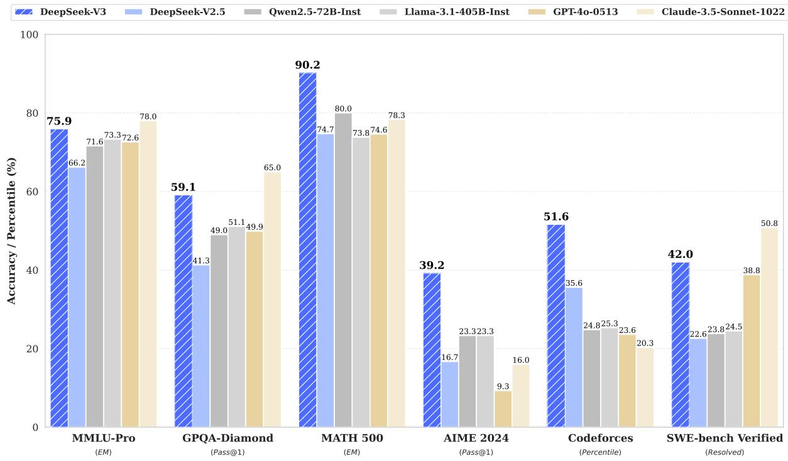
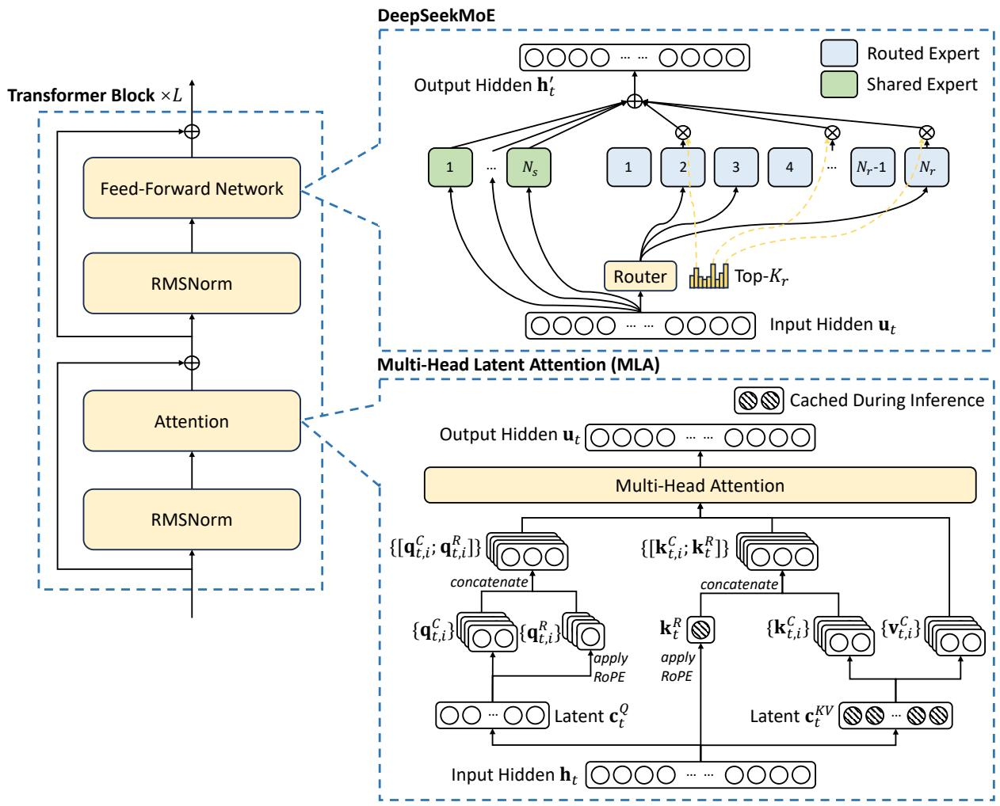
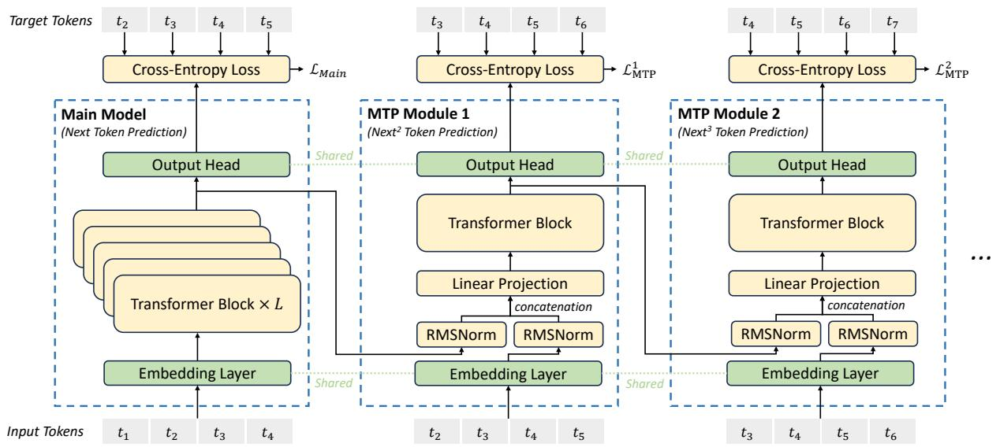
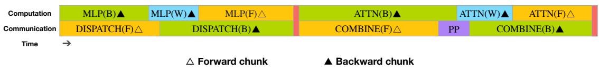
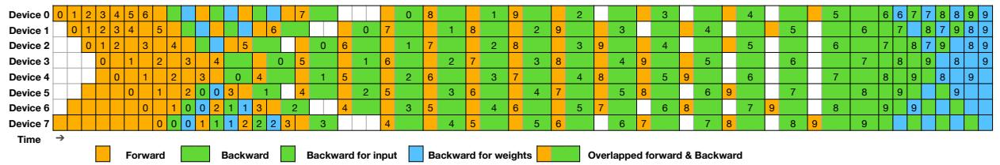
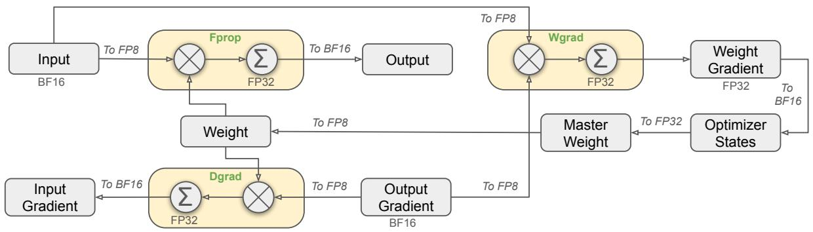
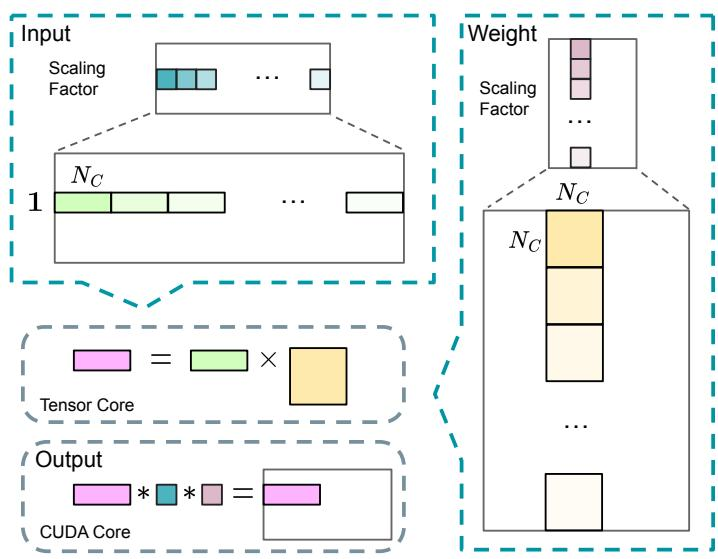
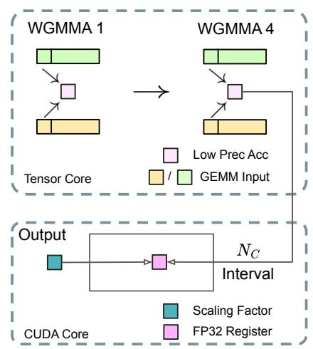
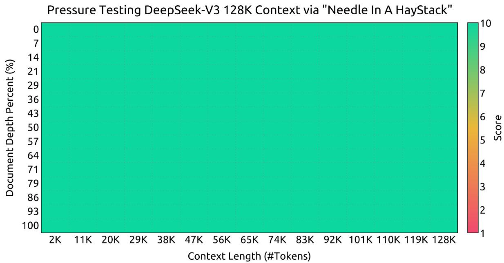
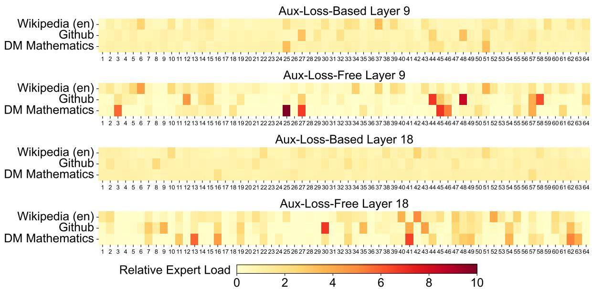

# 📖 DeepSeek-V3 Technical Report

> **论文**：DeepSeek-AI, 2024 | arXiv:2412.19437
>
> **一句话总结**：671B 参数 MoE 模型（37B 激活），用 MLA + 无辅助损失负载均衡 + FP8 训练，仅 $5.576M 即训练出媲美 GPT-4o 的开源模型。

---

# 第一层：鸟瞰

## 🎯 核心贡献

1. **无辅助损失负载均衡**：首创 bias-based 动态调整策略替代传统 auxiliary loss，解决了 MoE 中"负载均衡 vs 模型性能"的根本矛盾
2. **多 Token 预测（MTP）训练目标**：每个位置预测 2 个未来 token（D=1），既提升训练信号密度，又可用于推理加速（speculative decoding，85-90% 接受率，1.8x TPS）
3. **FP8 混合精度训练**：首次在超大规模模型上验证 FP8 训练，细粒度量化（1×128 tile + 128×128 block），相对损失误差 < 0.25%
4. **DualPipe 流水线并行**：双向流水线调度，实现计算-通信几乎完全重叠，pipeline bubble 显著减少
5. **极致训练效率**：14.8T tokens 仅需 2.664M H800 GPU hours，总成本 $5.576M——训练过程零不可恢复 loss spike、零 rollback
6. **DeepSeek-R1 蒸馏**：将长 CoT 推理模型的验证和反思模式蒸馏到标准 LLM 中

## 📍 知识网络定位

```
Transformer (2017) → 注意力机制基础
   ↓
Switch Transformer (2021) → MoE 路由 + 辅助损失
GShard (2021) → MoE 扩展
   ↓
DeepSeekMoE (2024.01) → 细粒度专家 + 共享专家
DeepSeek-V2 (2024.05) → MLA + DeepSeekMoE（验证架构可行性）
   ↓
【DeepSeek-V3 (2024.12)】→ 无辅助损失 + MTP + FP8 + DualPipe
   ↓
DeepSeek-R1 (2025.01) → 长链推理（V3 蒸馏来源）
DeepSeek-V3-0324 (2025.03) → 开源更新版
```

**与系列前作的关系**：
- **DeepSeek-V2**：V3 继承了 MLA 和 DeepSeekMoE 架构，但做出了关键改进（sigmoid 门控、无辅助损失）
- **DeepSeek-R1**：V3 后训练阶段从 R1 蒸馏了推理能力
- **LoRA**：V3 的训练没有使用 LoRA（全量训练），但 V3 的 MoE 思想和 LoRA 的"只激活部分参数"有异曲同工之妙

---

# 第二层：精读

## 1. 引言：为什么需要 DeepSeek-V3？

### 核心问题

2024 年底，开源模型和闭源模型（GPT-4o、Claude-3.5-Sonnet）之间仍有明显差距。DeepSeek-V3 的目标是：**用开源模型的成本，达到闭源模型的性能**。

### 现有方法的局限

| 问题 | 传统做法 | DeepSeek-V3 的解法 |
|------|---------|-------------------|
| MoE 负载均衡 | auxiliary loss → 损害性能 | bias-based 动态调整，无性能损失 |
| 训练效率 | BF16 精度 → 慢、费显存 | FP8 + 细粒度量化 → 理论 2x 加速 |
| 跨节点通信 | 通信开销大 | DualPipe 计算通信重叠 → 接近零开销 |
| 训练信号 | 只预测下一个 token | MTP 预测多个 token → 更密集的梯度 |

### 关键结果

> DeepSeek-V3 以仅 **37B 激活参数**（总参数 671B），在多数 benchmark 上超越 **LLaMA-3.1 405B**（11 倍激活参数），且总训练成本仅 **$5.576M**。

### 📊 图表精读：Figure 1 — 性能对比总览



这是一张分组柱状图，对比 6 个模型在 6 个核心 benchmark 上的表现。

**独立解读**（先不看 caption）：DeepSeek-V3（蓝色斜线柱）在数学和编程类 benchmark 上有明显优势，尤其是 MATH 500 和 Codeforces。在 MMLU-Pro 和 SWE-bench 上略逊于 Claude-3.5-Sonnet。

| 基准 | DeepSeek-V3 | 最强竞品 | 差距 |
|------|:-:|:-:|:-:|
| MATH 500 | **90.2** | 80.0 | +10.2 🔥 |
| Codeforces | **51.6** | 25.3 | +26.3 🔥 |
| AIME 2024 | **39.2** | 16.0 (Claude) | +23.2 🔥 |
| MMLU-Pro | 75.9 | **78.0** (Claude) | -2.1 |
| SWE-bench | 42.0 | **50.8** (Claude) | -8.8 |

**对照 caption**：caption 说 "Benchmark performance of DeepSeek-V3 and its counterparts"，图中确实展示了全面对比。但注意——**选择性展示了 6 个有利于 V3 的 benchmark**（数学/编程强项），而 Table 3 中英语阅读理解（RACE）V3 表现不如 LLaMA。

**验证的假设**：这张图验证了 DeepSeek-V3 "数学/编程断层式领先"的核心 claim。如果去掉这张图，论文的"开源最强"论点仍能从 Table 3 成立，但视觉冲击力大减。

**批判性评价**：柱状图的纵轴不是从 0 开始，可能夸大差异。MATH 500 的 90.2 vs 80.0 视觉上差距巨大，但绝对差距 10 分在 0-100 范围内并不极端。

**面试价值**：一句话——"DeepSeek-V3 以 37B 激活参数在数学/编程上实现断层领先，但在通用知识和工程任务上仍与 Claude 有差距。"

---

## 2. 方法：逐节深入

### 2.1 基础架构：MLA + DeepSeekMoE

DeepSeek-V3 的基础架构仍在 Transformer 框架内，但做了两个关键选择：

#### 2.1.1 Multi-Head Latent Attention (MLA)

**直觉**：标准 MHA 在推理时需要缓存 KV 对——每个 token、每层、每个头都要存 key 和 value，显存占用巨大。MLA 的核心思想是：**不要存完整的 KV，存一个低维压缩向量**。

**类比**：就像 JPEG 压缩图片——不存每个像素的原始值，而是存压缩后的表示。解压时能恢复出接近原始质量的结果。

**公式推导**（不跳步）：

**步骤 1：KV 压缩**
$$\mathbf{c}_t^{KV} = W^{DKV} \mathbf{h}_t$$

- $\mathbf{h}_t \in \mathbb{R}^{d}$：当前层的输入向量（$d = 7168$）
- $W^{DKV} \in \mathbb{R}^{d_c \times d}$：下投影矩阵（$d_c = 512$）
- $\mathbf{c}_t^{KV} \in \mathbb{R}^{512}$：**这就是推理时缓存的全部内容！**

> ❓ **压缩了多少？** 原始 KV：$n_h \times d_h = 128 \times 128 = 16384$ 维。压缩后：$512$ 维。**压缩比 ~32x**！

**步骤 2：Key 上投影 + RoPE**
$$\mathbf{k}_t^C = W^{UK} \mathbf{c}_t^{KV} \quad \text{（压缩向量上投影回 key）}$$
$$\mathbf{k}_t^R = \text{RoPE}(W^{KR} \mathbf{h}_t) \quad \text{（解耦的位置编码 key）}$$
$$\mathbf{k}_{t,i} = [\mathbf{k}_{t,i}^C; \mathbf{k}_t^R] \quad \text{（拼接）}$$

**步骤 3：Value 上投影**
$$\mathbf{v}_t^C = W^{UV} \mathbf{c}_t^{KV}$$

**步骤 4：Query 压缩（减少训练显存）**
$$\mathbf{c}_t^Q = W^{DQ} \mathbf{h}_t \quad (d_c' = 1536)$$
$$\mathbf{q}_t^C = W^{UQ} \mathbf{c}_t^Q$$
$$\mathbf{q}_t^R = \text{RoPE}(W^{QR} \mathbf{c}_t^Q)$$
$$\mathbf{q}_{t,i} = [\mathbf{q}_{t,i}^C; \mathbf{q}_{t,i}^R]$$

**步骤 5：标准注意力计算**
$$\mathbf{o}_{t,i} = \sum_{j=1}^{t} \text{Softmax}_j\left(\frac{\mathbf{q}_{t,i}^T \mathbf{k}_{j,i}}{\sqrt{d_h + d_h^R}}\right) \mathbf{v}_{j,i}^C$$

> ❓ **为什么 MLA 有效？** 关键在于"低秩假设"：KV 信息存在大量冗余，用一个低维向量就能捕获核心信息。这和 LoRA 的低秩假设异曲同工——训练时权重变化 ΔW 是低秩的，推理时 KV 也是低秩的。

**MLA 的 KV Cache 对比**：

| 架构 | 每个 token 的 KV Cache | DeepSeek-V3 的缓存 |
|------|----------------------|-------------------|
| 标准 MHA (128 heads, dim=128) | $2 \times 128 \times 128 = 32768$ | - |
| MLA | - | $\mathbf{c}_t^{KV} (512) + \mathbf{k}_t^R (128 \times 64 = 8192) \approx 8704$ |

> 💡 实际上 MLA 的 KV cache 还要加上解耦 key $\mathbf{k}_t^R$，但总缓存仍远小于标准 MHA。

### 📊 图表精读：Figure 2 — 基础架构图



**独立解读**：这是 Transformer Block 堆叠架构图，分三部分：左侧是整体流程（残差 + RMSNorm + 核心模块），右下是 MLA 内部计算细节，右上是 DeepSeekMoE 专家路由细节。

关键观察：
1. **斜线纹理标注了推理时缓存的内容**——只有 `c_KV`（512 维）和 `k_R`（解耦 RoPE key），而不是完整的 K 和 V
2. **绿色 = 共享专家**（1 个，所有 token 必经），**浅蓝 = 路由专家**（256 个，Top-8 选择）
3. 数据流：`h_t` → RMSNorm → MLA（压缩-解压-注意力）→ 残差 → RMSNorm → MoE（共享+路由）→ 残差 → `h_t'`

**对照 caption**：caption 说 "Illustration of the basic architecture of DeepSeek-V3"。图中 MLA 和 MoE 并列展示，暗示两者在架构中是正交的设计选择。确实如此——MLA 解决注意力效率，MoE 解决 FFN 效率，互不依赖。

**面试价值**：能画出这张图 = 能解释 DeepSeek-V3 的核心架构。面试时在白板上画这个流程图就够了。

#### 2.1.2 DeepSeekMoE：细粒度专家 + 无辅助损失

**直觉**：传统 MoE（如 Switch Transformer）用少量大专家。DeepSeekMoE 的核心思想是：**用大量小专家**，让每个专家更专注（specialization）。

**MoE 前向传播**：
$$\mathbf{h}_t' = \mathbf{u}_t + \sum_{i=1}^{N_s} \text{FFN}_i^{(s)}(\mathbf{u}_t) + \sum_{i=1}^{N_r} g_{i,t} \text{FFN}_i^{(r)}(\mathbf{u}_t)$$

- $N_s = 1$：1 个共享专家（所有 token 都经过）
- $N_r = 256$：256 个路由专家
- $K_r = 8$：每个 token 激活 8 个路由专家
- $g_{i,t}$：门控值（Sigmoid + Top-K + 归一化）

> ❓ **为什么 1 个共享专家？** 共享专家捕获通用知识（语法、常见模式），路由专家捕获领域特化知识。这样路由专家不需要重复学习通用能力。

**无辅助损失负载均衡**——这是 V3 最重要的创新之一：

**传统做法（辅助损失）**：
$$\mathcal{L}_{\text{aux}} = \alpha \sum_{i=1}^{N} f_i P_i$$

问题：$\alpha$ 太大 → 损害模型性能；$\alpha$ 太小 → 负载不均。

**V3 的做法（Bias-Based 动态调整）**：

```
对每个专家 i，维护一个 bias 项 b_i：

路由决策：s_{i,t} + b_i ∈ Top-K → 选中这个专家
门控值：g_{i,t} = s_{i,t} / Σ(s_{j,t})  ← 注意：只用原始分数！

每步训练后：
  如果专家 i 过载 → b_i -= γ（降低被选概率）
  如果专家 i 欠载 → b_i += γ（提高被选概率）
```

**关键设计**：
1. **Bias 只影响路由，不影响门控值**——门控值仍然来自原始亲和力分数
2. **批级别调整**——基于整个 batch 的负载统计，而非单个序列
3. **训练最后 500B tokens 关闭 bias 更新**（γ=0），让模型自然收敛

> ❓ **为什么批级别比序列级别好？** 论文消融实验证明：批级别允许专家更好地按领域特化（domain specialization），而序列级别的均衡约束会"平均化"专家能力，阻碍特化。论文中 1B MoE 模型的验证 loss：序列级辅助损失 2.258 vs 无辅助损失 2.253。

### 📊 图表精读：Figure 3 — MTP 架构



**独立解读**：流程图展示了主模型和 MTP 模块的并行预测结构。主模型预测 t₂-t₅，MTP Module 1 预测 t₃-t₆，MTP Module 2 预测 t₄-t₇。

关键设计：
1. **绿色虚线**：Embedding Layer 和 Output Head 是跨模块共享的
2. **黄色**：每个 MTP Module 只有 1 个 Transformer Block + Linear + RMSNorm，额外参数很少
3. **输入构造**：MTP Module 的输入 = `[RMSNorm(h_i^0); RMSNorm(Emb(t_{i+1}))]`，即拼接主模型表示和下一个 token 的 embedding

**验证的假设**：V3 实际只用了 D=1（1 个 MTP 模块），图中画了 D=2 是展示扩展能力。消融实验证明 D=1 已经带来显著提升（HumanEval +6.1）。

**面试价值**：MTP 的核心不是并行预测多个 token，而是**顺序预测**——让模型在预测当前 token 时就为下一个 token 的预测做准备，增强了表征的"前瞻性"。

#### 2.1.3 Multi-Token Prediction (MTP)

**直觉**：标准语言模型只预测下一个 token，训练信号稀疏。MTP 让每个位置同时预测 2 个 token（当前 + 下一个），训练信号密度翻倍。

**V3 的 MTP 实现**：

```
主模型输出 h_i^0 (第 i 个 token 的表示)
    ↓
MTP Module 1:
    输入 = [RMSNorm(h_i^0); RMSNorm(Emb(t_{i+1}))]
    投影: h_i'^1 = M_1 × 输入
    Transformer Block: h_i^1 = TRM_1(h_i'^1)
    输出: P_{i+2}^1 = OutHead(h_i^1)  ← 预测 i+2 位置的 token
```

**关键设计**：
1. **顺序预测，保持因果链**（不是并行独立预测）
2. **共享 embedding 和 output head**（节省参数）
3. **MTP 损失权重 λ = 0.3（前 10T tokens）→ 0.1（后 4.8T tokens）**

**MTP 总损失**：
$$\mathcal{L}_{\text{MTP}} = \frac{\lambda}{D} \sum_{k=1}^{D} \mathcal{L}_{\text{MTP}}^k = \lambda \cdot \mathcal{L}_{\text{MTP}}^1 \quad (D=1)$$

> ❓ **推理时怎么用？** 两种选择：(1) 直接丢弃 MTP 模块，主模型独立运行；(2) 保留 MTP 模块用于 speculative decoding。V3 的第二 token 接受率 85-90%，实现 1.8x TPS 加速。

**消融实验证明**（Table 4）：

| Benchmark | Small Baseline | Small +MTP | Large Baseline | Large +MTP |
|-----------|:-:|:-:|:-:|:-:|
| MMLU | 50.0 | **53.3** | 67.5 | 66.6 |
| HumanEval | 20.7 | **26.8** | 44.5 | **53.7** |
| GSM8K | 25.4 | **31.4** | 72.3 | **74.0** |
| MATH | 10.7 | **12.6** | 38.6 | **39.8** |

### 2.2 训练基础设施

#### 2.2.1 计算集群

- **2048 × NVIDIA H800 GPUs**
- 节点内：8 GPU via NVLink + NVSwitch（160 GB/s）
- 节点间：InfiniBand（50 GB/s，约 NVLink 的 1/3.2）

### 📊 图表精读：Figure 4 & 5 — DualPipe 调度



**Figure 4 独立解读**：时间线甘特图，展示一对前向-后向 chunk 如何重叠计算和通信。

颜色编码：
- 🟠 橙色 = 前向计算（MLP(F), ATTN(F)）+ 前向通信（DISPATCH(F), COMBINE(F)）
- 🟢 绿色 = 后向计算（MLP(B), ATTN(B)）+ 后向通信
- 🔵 蓝色 = 权重梯度计算（MLP(W), ATTN(W)）
- 🟣 紫色 = PP 通信

**关键洞察**：注意 DISPATCH 和 COMBINE 被安排在与 ATTN/MLP **同时执行**的位置——这意味着 all-to-all 通信的开销被完全隐藏了。



**Figure 5 独立解读**：完整的 8 PP ranks × 20 micro-batches 双向流水线调度。

关键观察：
1. **双向**：micro-batches 从流水线的两端同时进入
2. **共享黑色边框**：两个相邻单元格表示计算和通信重叠
3. **Pipeline bubble**：只在流水线的开始和结束有少量空闲

**对照 Table 2**：DualPipe 的 bubble = $(PP/2-1)(F\&B+B-3W)$，而传统 1F1B = $(PP-1)(F+B)$。以 PP=16 为例，DualPipe 的 bubble 约为 1F1B 的 **1/4**。

**批判性评价**：代价是 2× 参数内存（双向需要两份权重），但论文指出大 EP 情况下影响可忽略——这个说法是否完全可信？如果模型更大（如 2T 参数），2× 内存可能成为瓶颈。

#### 2.2.2 DualPipe：计算-通信重叠

**问题**：跨节点 MoE 的 all-to-all 通信导致计算-通信比约 1:1，效率极低。

**DualPipe 的核心思想**：

```
传统 PP：Forward → Forward → Forward → Backward → Backward → Backward
         ┣━━━━━ 大量 pipeline bubble ━━━━━┫

DualPipe：双向流水线
  方向 1：→ F1 F2 F3 ... B3 B2 B1
  方向 2：← F1 F2 F3 ... B3 B2 B1
  ┣━ 计算和通信完全重叠 ━┫
```

**关键技巧**：
1. 将每个 chunk 分为 4 个组件：attention, all-to-all dispatch, MLP, all-to-all combine
2. 手动调整 GPU SM 在通信和计算之间的分配
3. 反向传播进一步拆分为 "backward for input" 和 "backward for weights"

**Pipeline Bubble 对比**（Table 2）：

| 方法 | Bubble | 参数 | 激活内存 |
|------|--------|------|---------|
| 1F1B | $(PP-1)(F+B)$ | 1× | PP |
| ZB1P | $(PP-1)(F+B-2W)$ | 1× | PP |
| **DualPipe** | $(\frac{PP}{2}-1)(F\&B+B-3W)$ | 2× | PP+1 |

> ❓ **为什么参数是 2×？** DualPipe 双向流水线需要两份模型参数。但由于使用了大的 EP（Expert Parallelism），这不会显著增加内存消耗。

### 📊 图表精读：Figure 6 & 7 — FP8 训练框架



**Figure 6 独立解读**：FP8 混合精度训练的完整系统架构图，覆盖前向（Fprop）、反向（Dgrad, Wgrad）和权重更新。

关键数据流：
- **Fprop**：Input BF16 → 量化 FP8 → GEMM（FP8 输入 + FP32 累加）→ 反量化 BF16 → Output
- **Dgrad**：同上，梯度方向
- **Wgrad**：激活 FP8 + 梯度 FP8 → GEMM → 权重梯度 FP32
- **权重更新**：FP32 master weight + FP32 梯度 → Optimizer（FP32 states）→ 反量化 FP8 存储

> ❓ **为什么不全程 FP32？** 计算端 FP8 理论加速 2x，存储端 FP8 省一半内存。代价是精度损失——论文通过细粒度量化（Figure 7）把损失控制在 <0.25%。

 

**Figure 7(a) 独立解读**：细粒度量化策略。

- **激活值**（蓝色）：1×128 tile 粒度 → 每个 token 每 128 个 channel 共享一个缩放因子
- **权重**（黄色）：128×128 block 粒度 → 每 128 输入 × 128 输出通道共享一个缩放因子

对比：Per-tensor 量化只有 1 个缩放因子（粗），Per-element 每个元素一个（细但昂贵）。V3 选择了中间路线。

**Figure 7(b) 独立解读**：Tensor Core + CUDA Core 协同累加。

H800 的 WGMMA 指令 FP8 累加精度只有 ~14 bit。V3 的解法：每累加 $N_C=128$ 个元素后，把部分和从 Tensor Core 提升到 CUDA Core 的 **FP32 寄存器**继续累加。两个 warpgroup 交替执行，维持高利用率。

**验证的假设**：Figure 7(b) + Appendix B.1（FP8 vs BF16 损失曲线）共同验证了"FP8 训练在大规模模型上可行"这一核心 claim。相对损失误差 <0.25% 是关键数据点。

#### 2.2.3 FP8 训练

**这是本文最重大的工程贡献之一**——首次在超大规模模型上成功验证 FP8 训练。

**挑战**：FP8 的动态范围有限（E4M3: ±448），激活值中的 outlier 会严重降低量化精度。

**V3 的解法——细粒度量化**：

| 组件 | 量化粒度 | 说明 |
|------|---------|------|
| 激活值 | **1×128 tile** | 每个 token，每 128 个 channel 一组 |
| 权重 | **128×128 block** | 每 128 输入 × 128 输出通道一组 |

**混合精度框架**（Figure 6）：

| 组件 | 精度 | 原因 |
|------|------|------|
| Linear 的 GEMM (Fprop, Dgrad, Wgrad) | **FP8** | 核心计算加速 |
| Embedding, Output Head | BF16 | 稳定性 |
| MoE Gating | BF16 | 精度敏感 |
| Normalization (RMSNorm) | BF16 | 精度敏感 |
| Attention | BF16 | 精度敏感 |
| Master weights, 梯度 | FP32 | 数值稳定 |
| Optimizer states (1st/2nd moments) | **BF16** | 节省内存 |
| 激活缓存 | **FP8** | 节省内存 |

**提高累加精度**：H800 Tensor Core 的 FP8 GEMM 累加精度仅 ~14 bit。V3 的解法：
- 每累加 $N_C = 128$ 个元素后，将部分和提升到 CUDA Core 的 FP32 寄存器中继续累加
- 这虽然降低了 WGMMA 指令发射率，但两个 warpgroup 可以交替执行，维持高利用率

> ❓ **FP8 训练的损失影响有多大？** 在 DeepSeek-V2-Lite 和 DeepSeek-V2 两个规模上训练 ~1T tokens，FP8 模型相对 BF16 baseline 的相对损失误差始终 **< 0.25%**，在训练随机性可接受范围内。

#### 2.2.4 并行策略总览

| 维度 | 配置 | 说明 |
|------|------|------|
| Pipeline Parallelism | **16-way PP** | DualPipe 双向调度 |
| Expert Parallelism | **64-way EP**（跨 8 节点） | 每个 token 最多发到 4 节点 |
| Data Parallelism | **ZeRO-1 DP** | 只分片优化器状态 |
| Tensor Parallelism | **不使用** | DualPipe + EP 已足够高效 |

### 2.3 预训练

#### 2.3.1 数据构建

- **14.8T tokens**，128K 词表（Byte-level BPE）
- 相比 V2：增加数学和编程样本比例，扩展多语言覆盖
- **FIM（Fill-in-Middle）**：PSM 框架，应用率 0.1，不损害 next-token prediction 能力
- Document packing + 无 cross-sample attention masking

#### 2.3.2 超参数

**模型超参数**：

| 参数 | 值 |
|------|-----|
| Transformer 层数 | 61 |
| 隐藏维度 | 7168 |
| 注意力头数 | 128 |
| 每头维度 | 128 |
| KV 压缩维度 | 512 |
| Query 压缩维度 | 1536 |
| 解耦 key/query 维度 | 64 |
| 共享专家数 | 1 |
| 路由专家数 | 256 |
| 激活专家数 | 8 |
| 专家中间维度 | 2048 |
| MTP 深度 | 1 |
| **总参数** | **671B** |
| **激活参数** | **37B** |

**训练超参数**：

| 参数 | 值 |
|------|-----|
| 优化器 | AdamW (β₁=0.9, β₂=0.95, wd=0.1) |
| 最大序列长度 | 4K |
| 训练 tokens | 14.8T |
| Peak LR | 2.2×10⁻⁴ |
| LR 调度 | Warmup 2K steps → 恒定（10T tokens）→ 余弦退火（4.3T tokens）→ 恒定低 LR（500B tokens） |
| Batch size | 3072 → 15360（前 469B tokens 线性增长） |
| 梯度裁剪 | 1.0 |
| Bias update speed γ | 0.001（前 14.3T）→ 0.0（后 500B） |
| Balance loss α | 0.0001 |
| MTP loss weight λ | 0.3（前 10T）→ 0.1（后 4.8T） |

### 📊 图表精读：Figure 8 — NIAH 大海捞针测试



**独立解读**：热力图，展示 128K 上下文长度下的 NIAH 测试结果。

- 横轴：上下文长度（2K ~ 128K tokens）
- 纵轴：文档深度（0% ~ 100%）
- 颜色：得分 1（红）→ 10（深绿）

**关键观察**：**全域均为深绿色**（8~10 分），无论关键信息在文档的哪个位置，无论上下文多长（直到 128K），模型都能稳定检索。

**对照 caption**：这验证了两阶段 YaRN 上下文扩展（4K→32K→128K）的有效性。

**批判性评价**：NIAH 是一个相对简单的检索任务（找一个"needle"字符串），不代表模型在 128K 上下文中能进行复杂的推理。但至少证明了注意力机制在超长序列上没有"丢失"信息。

#### 2.3.3 长上下文扩展

两阶段 YaRN：
1. **4K → 32K**：1000 步，batch size 1920
2. **32K → 128K**：1000 步，batch size 480

YaRN 配置：$s=40, \alpha=1, \beta=32, \sqrt{t}=0.1\ln s + 1$，仅应用于解耦共享 key $\mathbf{k}_t^R$。

**结果**：Needle In A Haystack 测试中，128K 窗口内表现一致且强大。

#### 📊 图表精读：Figure 9 — 专家负载对比



**独立解读**：热力图对比 Aux-Loss-Based vs Aux-Loss-Free 策略下专家的负载分布。

- 4 个子图：Layer 9 和 Layer 18 × 两种策略
- 横轴：专家编号 1~64
- 纵轴：3 个数据集（Wikipedia, Github, DM Mathematics）
- 颜色：0（浅黄，低负载）→ 10（深红，高负载）

**关键发现**：
- **Aux-Loss-Free**：负载分布**不均**，部分专家负载很高（深红），部分很低（浅黄）——说明专家在**按领域特化**
- **Aux-Loss-Based**：负载分布**均匀**（全是浅黄）——专家被迫"平均化"，无法深入特化

**验证的假设**：这张图直接验证了论文的核心设计假设——无辅助损失策略允许更好的专家特化，而特化带来更好的性能。消融实验（Table 5）证实了这一点。

**面试价值**：如果面试官问"无辅助损失为什么好"，指着这张图说："看，左边的专家在偷懒（均匀但无特化），右边的专家在专精（不均但高效）"就够了。

### 2.3.4 预训练评估（Base Model）

**核心对比**（Table 3）：

| Benchmark | DeepSeek-V2 | Qwen2.5 72B | LLaMA-3.1 405B | **DeepSeek-V3** |
|-----------|:-:|:-:|:-:|:-:|
| 激活参数 | 21B | 72B | 405B | **37B** |
| MMLU | 78.4 | 85.0 | 84.4 | **87.1** |
| MMLU-Pro | 51.4 | 58.3 | 52.8 | **64.4** |
| BBH | 78.8 | 79.8 | 82.9 | **87.5** |
| HumanEval | 43.3 | 53.0 | 54.9 | **65.2** |
| MATH | 43.4 | 54.4 | 49.0 | **61.6** |
| GSM8K | 81.6 | 88.3 | 83.5 | **89.3** |
| C-Eval | 81.4 | 89.2 | 72.5 | **90.1** |

> 💡 **关键洞察**：DeepSeek-V3 仅用 37B 激活参数，在绝大多数 benchmark 上超越了 405B 激活参数的 LLaMA-3.1。这说明 **MoE 的稀疏激活效率远高于 Dense 模型**。

### 2.4 后训练

#### 2.4.1 监督微调（SFT）

- **1.5M 指令微调样本**
- **推理数据**：从 DeepSeek-R1 蒸馏——先用 SFT+RL 训练领域专家模型，再用拒绝采样筛选高质量数据
  - 两类样本：`<问题, 原始回答>` + `<系统提示, 问题, R1回答>`
  - RL 阶段用高温采样，让模型学会融合 R1 的推理模式和原始数据的简洁性
- **非推理数据**：DeepSeek-V2.5 生成 + 人工标注验证
- 训练 2 epochs，cosine decay LR（5×10⁻⁶ → 1×10⁻⁶）

#### 2.4.2 强化学习：GRPO

**Group Relative Policy Optimization (GRPO)** 的核心创新：**不需要 critic 模型**。

传统 PPO 需要：policy model + critic model（和 policy 一样大）= 2x 模型资源。

GRPO 的做法：
1. 对每个问题 $q$，从旧策略采样一组输出 $\{o_1, ..., o_G\}$
2. 用组内相对分数计算 advantage：

$$A_i = \frac{r_i - \text{mean}(\{r_1, ..., r_G\})}{\text{std}(\{r_1, ..., r_G\})}$$

3. 优化目标包含 clip + KL 散度惩罚（防止偏离参考策略太远）

**奖励模型**：
- **规则型 RM**：数学题用规则验证、LeetCode 用编译器测试
- **模型型 RM**：从 V3 SFT checkpoint 训练，包含 CoT 的偏好数据（减少 reward hacking）

#### 2.4.3 后训练评估（Chat Model）

**核心对比**（Table 6）：

| Benchmark | GPT-4o | Claude-3.5-Sonnet | **DeepSeek-V3** |
|-----------|:-:|:-:|:-:|
| MMLU | 87.2 | 88.3 | **88.5** |
| MMLU-Pro | 72.6 | 78.0 | 75.9 |
| DROP | 83.7 | 88.3 | **91.6** |
| GPQA-Diamond | 49.9 | 65.0 | 59.1 |
| HumanEval-Mul | 80.5 | 81.7 | **82.6** |
| LiveCodeBench (CoT) | 33.4 | 36.3 | **40.5** |
| MATH-500 | 74.6 | 78.3 | **90.2** |
| AIME 2024 | 9.3 | 16.0 | **39.2** |
| Arena-Hard | 80.4 | 85.2 | **85.5** |
| AlpacaEval 2.0 | 51.1 | 52.0 | **70.0** |

> 💡 **MATH-500: 90.2 vs GPT-4o 的 74.6**——在非长 CoT 模型中，DeepSeek-V3 的数学能力达到了新高度。AIME 2024 上 39.2% 的通过率更是远超所有非 o1 类模型。

**R1 蒸馏的贡献**（Table 9）：

| 设置 | LiveCodeBench | MATH-500 |
|------|:-:|:-:|
| V2.5 Baseline（短 CoT） | 31.1 | 74.6 |
| V2.5 + R1 Distill | **37.4** | **83.2** |

蒸馏带来了显著提升，但也增加了平均响应长度。

## 3. 数据流：从输入到输出

### 完整的前向传播流程

```
输入 token IDs: [t_1, t_2, ..., t_T]
    ↓
Embedding (BF16, 128K vocab × 7168 dim)
    ↓
61 层 Transformer Block:
    ┌─────────────────────────────────────────────────┐
    │  RMSNorm                                        │
    │      ↓                                          │
    │  MLA Attention:                                 │
    │    h → c_KV (512d) → k, v                       │
    │    h → c_Q (1536d) → q                          │
    │    q × k → attention weights → weighted v       │
    │      ↓                                          │
    │  Residual Connection                            │
    │      ↓                                          │
    │  RMSNorm                                        │
    │      ↓                                          │
    │  DeepSeekMoE:                                   │
    │    1 × Shared Expert (always active)             │
    │    + Top-8 of 256 Routed Experts                │
    │    (bias-based load balancing, no aux loss)     │
    │      ↓                                          │
    │  Residual Connection                            │
    └─────────────────────────────────────────────────┘
    × 61 layers
    ↓
RMSNorm → Output Head (BF16) → logits (128K vocab)
    ↓
MTP Module (训练时):
    [RMSNorm(h); RMSNorm(Emb(t_next))] → TRM → OutHead → next+2 token logits
```

**并行训练部署**：

```
2048 H800 GPUs (256 nodes × 8 GPUs)
    ↓
16-way Pipeline Parallelism (每 GPU 部署 ~4 层)
    ↓
64-way Expert Parallelism (每层的 256 个专家分布在 8 节点的 64 个 GPU 上)
    ↓
ZeRO-1 Data Parallelism (优化器状态分片)
    ↓
No Tensor Parallelism (通过 DualPipe + FP8 省下显存)
```

### 训练成本分解

| 阶段 | GPU Hours | 成本 ($) |
|------|-----------|---------|
| 预训练 | 2,664K | 5.328M |
| 上下文扩展 | 119K | 0.238M |
| 后训练 | 5K | 0.01M |
| **总计** | **2,788K** | **$5.576M** |

> 💡 每 1T tokens 仅需 180K H800 GPU hours，在 2048 GPU 集群上仅需 3.7 天。

---

# 第三层：批判性思考

## 🤔 设计决策分析

### 1. 无辅助损失 vs 传统辅助损失

**为什么选 A（无辅助损失）而不是 B（辅助损失）？**

- 传统辅助损失的问题：它直接参与梯度计算，会和主训练目标竞争。α 太大会限制专家特化，α 太小则负载不均
- Bias-based 方法的优势：bias 是一个"外挂"调整机制，不参与梯度计算，不影响模型的学习目标
- **trade-off**：需要额外的监控和调整逻辑，但实现复杂度不高

> ❓ **如果不用任何负载均衡会怎样？** 论文提到 MoE 会出现 "routing collapse"——大部分 token 被路由到少数专家，其他专家得不到训练。这类似于 Dense 模型中的 "dead neurons"。

### 2. FP8 vs 其他低精度方案

| 方案 | 精度 | 硬件要求 | 效果 |
|------|------|---------|------|
| BF16 | 16 bit | 通用 GPU | 基线 |
| FP8 (E4M3/E5M2) | 8 bit | Hopper+ | V3 验证可行 |
| INT8 | 8 bit | 通用 | 量化误差大 |
| FP4/NF4 | 4 bit | Blackwell | 太激进，大模型未验证 |

V3 选择 FP8 E4M3 统一格式（而非 E4M3/E5M2 混合），因为细粒度量化已经有效扩展了动态范围。

### 3. MTP 深度 D=1 的选择

论文只用了 D=1（预测 2 个 token），而不是更深的预测。原因是：
- D=1 已经带来显著提升（HumanEval +6.1, GSM8K +6.0）
- 更深的 MTP 增加训练开销，且边际收益递减
- D=1 的 speculative decoding 接受率已经 85-90%

## ⚠️ 局限性

### 论文承认的局限

1. **部署单元较大**：推荐的最小部署单元（prefilling 32 GPU, decoding 320 GPU）对小团队不友好
2. **推理速度**：虽然 2x 于 V2，但仍有提升空间
3. **SimpleQA 落后于 GPT-4o**：英语事实知识不及闭源模型（因为训练数据更多分配给了中文知识）

### 我们发现的局限

1. **FP8 训练的有效性是否可泛化？** 论文在 H800（Hopper 架构）上验证，在其他 GPU（如 AMD MI300）上是否有效未验证
2. **无辅助损失策略的扩展性**：在更大的模型（>1T 参数）或更少专家的情况下是否仍然有效？
3. **后训练的 R1 蒸馏缺乏消融**：蒸馏数据的具体构成、不同蒸馏策略的对比不够详细
4. **评估框架的公平性**：论文使用自建评估框架，虽然声称统一设置，但第三方复现困难

## 🎯 面试视角

### 面试高频问题

**Q1: DeepSeek-V3 的 MLA 和标准 MHA 有什么区别？为什么 MLA 更高效？**

> A: MLA 的核心是 KV 低秩压缩。标准 MHA 缓存完整的 K 和 V（$2 \times n_h \times d_h \times L$），MLA 只缓存一个低维压缩向量 $\mathbf{c}^{KV} \in \mathbb{R}^{d_c}$ 加一个解耦的 RoPE key。推理时 KV cache 减少约 32 倍，同时性能几乎不降。本质是利用了 KV 信息的低秩特性。

**Q2: 无辅助损失负载均衡是怎么做的？为什么比传统方法好？**

> A: 传统方法用 auxiliary loss 惩罚不均衡的负载，但这会干扰主训练目标。V3 的方法是对每个专家维护一个 bias 项，每步训练后根据负载动态调整（过载减 bias，欠载加 bias）。关键区别：(1) bias 只影响路由决策，不影响门控值计算；(2) 不引入额外 loss 项，不干扰梯度。消融实验证明这种方法允许更好的专家特化。

**Q3: FP8 训练的主要挑战和 V3 的解法？**

> A: 挑战是 FP8 动态范围有限（E4M3 最大 ±448），激活值 outlier 会严重降低量化精度。V3 的解法是细粒度量化：激活值按 1×128 tile、权重按 128×128 block 分组量化。同时，H800 Tensor Core 的 FP8 累加精度只有 ~14 bit，V3 通过每 128 元素提升到 CUDA Core 的 FP32 寄存器来提高累加精度。最终相对损失误差 < 0.25%。

**Q4: DualPipe 和传统 Pipeline Parallelism 有什么区别？**

> A: DualPipe 的核心创新是双向流水线调度——从流水线的两端同时喂入 micro-batch。它把每个 chunk 拆分为 attention、all-to-all dispatch、MLP、all-to-all combine 四个组件，通过精心重排实现计算和通信的完全重叠。Bubble 从传统 1F1B 的 $(PP-1)(F+B)$ 减少到 $(PP/2-1)(F\&B+B-3W)$。代价是需要 2x 模型参数内存，但大 EP 情况下影响可忽略。

**Q5: DeepSeek-V3 的训练成本为什么这么低？**

> A: 三层优化叠加：(1) 架构层：MoE 稀疏激活，37B/671B = 仅 5.5% 的参数需要计算；(2) 算法层：FP8 混合精度训练，核心 GEMM 理论加速 2x，同时减少内存和通信量；(3) 系统层：DualPipe + 定制 all-to-all kernel + 精细内存优化，消除通信瓶颈。三者协同使得每 1T tokens 仅需 180K GPU hours。

---

# 第四层：知识网络

## 📅 时间线

```
2017: Transformer (Vaswani et al.) → 注意力机制
2017: MoE (Shazeer et al.) → 稀疏门控混合专家
2021: Switch Transformer → 简化 MoE 路由 + auxiliary loss
2021: GShard → 大规模 MoE 扩展
2022: FlashAttention → 高效注意力
2023: LoRA → 参数高效微调
2024.01: DeepSeekMoE → 细粒度专家 + 共享专家
2024.05: DeepSeek-V2 → MLA + DeepSeekMoE（验证架构）
2024.06: Qwen2 → 72B dense 模型
2024.07: LLaMA-3.1 → 405B dense 模型
2024.12: 【DeepSeek-V3】→ 无辅助损失 + MTP + FP8 + DualPipe
2025.01: DeepSeek-R1 → 长链推理（V3 后训练蒸馏来源）
```

## ↔️ 同期对比

| 模型 | 架构 | 参数 | 激活参数 | 训练 tokens | 核心特点 |
|------|------|------|---------|------------|---------|
| DeepSeek-V3 | MoE | 671B | 37B | 14.8T | MLA + 无辅助损失 + FP8 |
| LLaMA-3.1 405B | Dense | 405B | 405B | 15T+ | 标准 Transformer |
| Qwen2.5 72B | Dense | 72B | 72B | ~18T | GQA + 高质量数据 |
| Mixtral 8x22B | MoE | 141B | 39B | 未知 | 标准 MoE + auxiliary loss |

> 💡 **关键对比**：DeepSeek-V3 用 37B 激活参数（vs LLaMA 的 405B），在多数 benchmark 上表现更好或持平。这证明了 MoE 稀疏激活在效率上的巨大优势。

## 🔗 知识关联

### 与本系列其他论文的关系

- **Attention Is All You Need**：V3 的基础架构仍是 Transformer，但在注意力（MLA）和 FFN（MoE）两个核心组件上做了根本性改进
- **BERT**：V3 是 decoder-only 架构，和 BERT 的双向编码器不同，但都证明了预训练+微调范式的威力
- **GPT-2/3**：V3 延续了自回归语言模型的路线，但通过 MoE 和 MLA 实现了 GPT-3 级别性能的几个数量级成本降低
- **Chinchilla**：V3 用 14.8T tokens 训练 671B 参数（C/P 比约 22:1），远超 Chinchilla 最优比例，但 MoE 的稀疏性改变了 scaling 的经济学
- **InstructGPT**：V3 的后训练（SFT + RL）采用了类似的 RLHF 范式，但用 GRPO 替代了 PPO（省掉 critic 模型）
- **LLaMA**：两者都追求"开源最强"，但 LLaMA 走 dense 路线（405B 全量计算），V3 走 MoE 路线（37B 稀疏计算）
- **LoRA**：V3 全量训练而非 LoRA 微调，但 MLA 的低秩压缩和 LoRA 的低秩分解思想一致——利用矩阵的低秩结构

## ❓ 深度思考题

1. **概念题**：MLA 的 KV 压缩和 LoRA 的低秩分解有什么本质区别？它们分别利用了什么结构假设？

2. **概念题**：为什么无辅助损失的批级别均衡比序列级别均衡更好？在什么条件下这个优势会消失？

3. **设计题**：如果让你设计一个 2T 参数的 MoE 模型，你会怎么调整 V3 的配置？（考虑专家数量、激活数量、层数等）

4. **设计题**：FP8 训练在推理阶段是否有额外的量化开销？如何在训练和推理之间做精度权衡？

5. **批判题**：V3 的 FP8 训练仅在 H800 上验证，这个结论是否具有 GPU 架构依赖性？如果换成 AMD MI300，需要哪些额外验证？

6. **批判题**：V3 在 MMLU-Pro 和 GPQA 上仍落后于 Claude-3.5-Sonnet。这是架构问题、数据问题、还是后训练问题？如何改进？

7. **哲学题**：MoE 的"稀疏激活"和人类大脑的"稀疏编码"是否有深层联系？MoE 专家的领域特化是否暗示了一种"模块化认知"？

8. **实践题**：如果要在有限 GPU 资源（如 8×A100）上复现 V3 的部分实验，你会选择哪些消融实验？为什么？

## 📚 延伸阅读

1. **DeepSeek-V2** (2024.05) — MLA 和 DeepSeekMoE 的原创论文，V3 架构的直接前身
2. **DeepSeek-R1** (2025.01) — 长链推理模型，V3 后训练的蒸馏来源
3. **Switch Transformer** (Fedus et al., 2021) — MoE 的 auxiliary loss 方法，V3 的"反面教材"
4. **Better & Faster LLMs via Multi-Token Prediction** (Gloeckle et al., 2024) — MTP 的原始论文，V3 改进了其实现方式
5. **Zero Bubble Pipeline Parallelism** (Qi et al., 2023) — DualPipe 的基础之一
6. **FP8 Formats for Deep Training** (Micikevicius et al., 2022) — FP8 格式标准
7. **DeepSeekMath (GRPO)** (Shao et al., 2024) — GRPO 算法的原始论文
8. **Microscaling Data Formats** (Rouhani et al., 2023) — V3 细粒度量化的思想先驱
9. **EAGLE** (Li et al., 2024) — Speculative decoding 方法，V3 MTP 的推理应用参考
10. **YaRN** (Peng et al., 2023) — 长上下文扩展方法，V3 使用其进行 4K→128K 扩展
