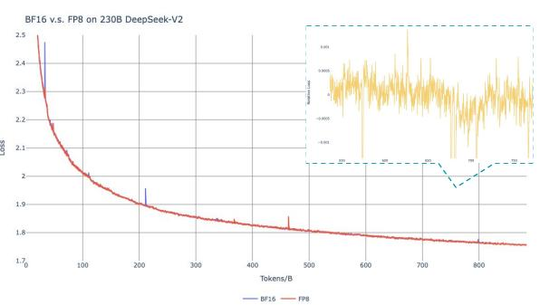
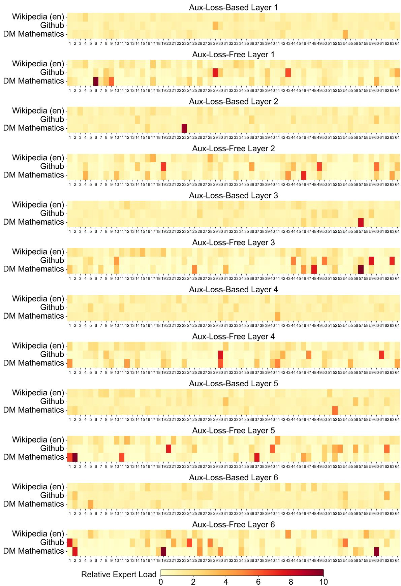
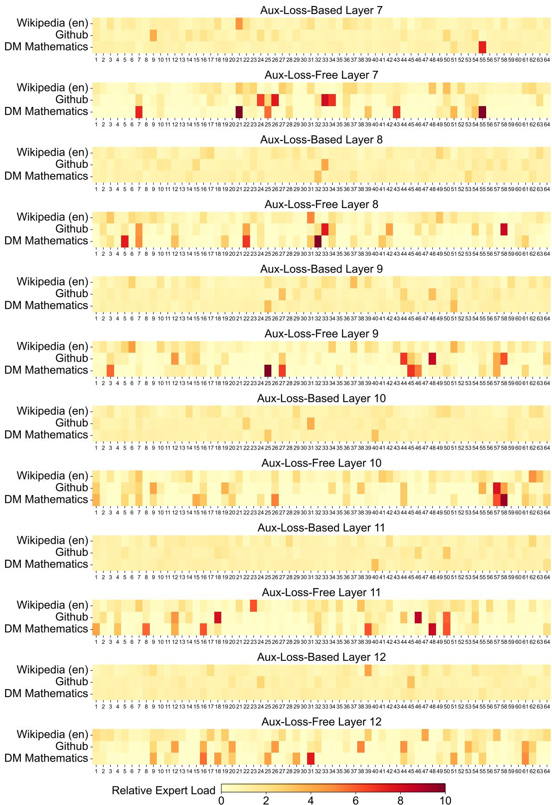
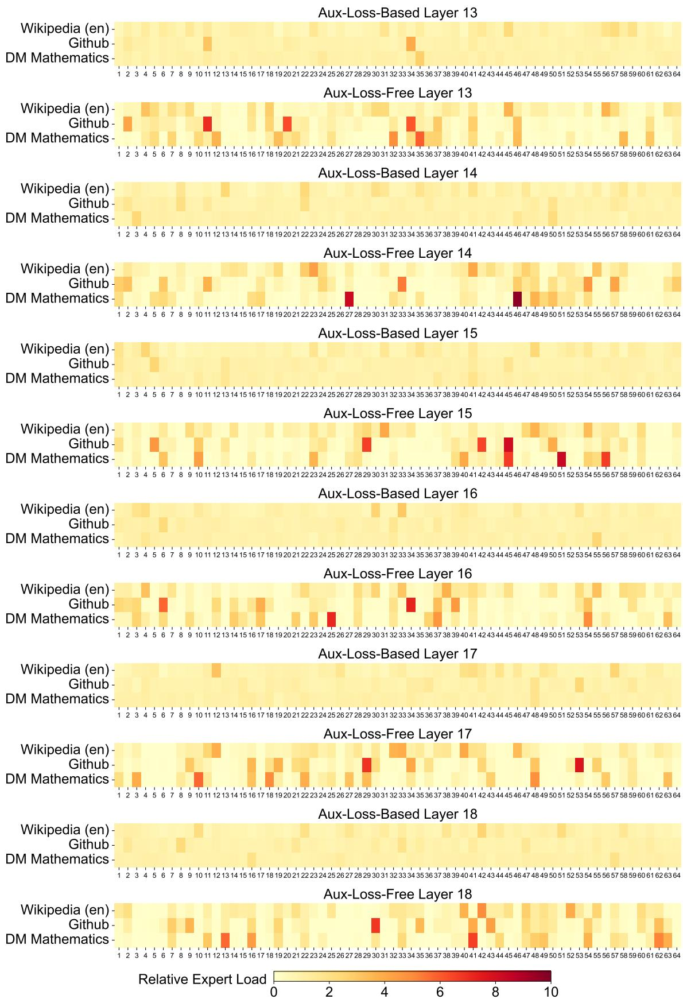
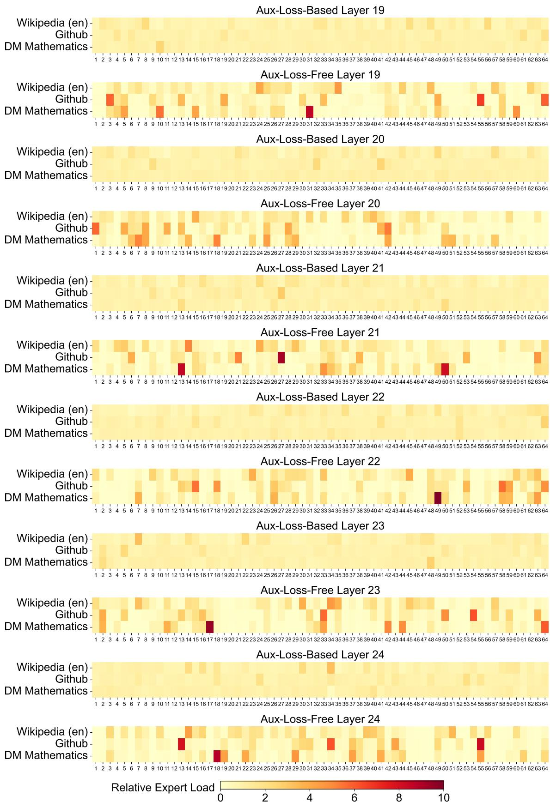

# DeepSeek-V3 Technical Report — 论文精读融合版

> **阅读指南**：本文以论文原文为骨架，在每个章节后插入讲解块。节奏：读一段原文 → 听一段讲解 → 读下一段。

---

# DeepSeek-V3 Technical Report

DeepSeek-AI

research@deepseek.com

# Abstract

We present DeepSeek-V3, a strong Mixture-of-Experts (MoE) language model with 671B total parameters with 37B activated for each token. To achieve efficient inference and cost-effective training, DeepSeek-V3 adopts Multi-head Latent Attention (MLA) and DeepSeekMoE architectures, which were thoroughly validated in DeepSeek-V2. Furthermore, DeepSeek-V3 pioneers an auxiliary-loss-free strategy for load balancing and sets a multi-token prediction training objective for stronger performance. We pre-train DeepSeek-V3 on 14.8 trillion diverse and high-quality tokens, followed by Supervised Fine-Tuning and Reinforcement Learning stages to fully harness its capabilities. Comprehensive evaluations reveal that DeepSeek-V3 outperforms other open-source models and achieves performance comparable to leading closed-source models. Despite its excellent performance, DeepSeek-V3 requires only 2.788M H800 GPU hours for its full training. In addition, its training process is remarkably stable. Throughout the entire training process, we did not experience any irrecoverable loss spikes or perform any rollbacks. The model checkpoints are available at https://github.com/deepseek-ai/DeepSeek-V3.

  
Figure 1 | Benchmark performance of DeepSeek-V3 and its counterparts.

> 📖 **讲解**
>
> **一句话总结**：671B 参数 MoE 模型（37B 激活），用 MLA + 无辅助损失负载均衡 + FP8 训练，仅 $5.576M 即训练出媲美 GPT-4o 的开源模型。
>
> **六大核心贡献**：
>
> 1. **无辅助损失负载均衡**：首创 bias-based 动态调整策略替代传统 auxiliary loss，解决了 MoE 中"负载均衡 vs 模型性能"的根本矛盾
> 2. **多 Token 预测（MTP）训练目标**：每个位置预测 2 个未来 token（D=1），既提升训练信号密度，又可用于推理加速（speculative decoding，85-90% 接受率，1.8x TPS）
> 3. **FP8 混合精度训练**：首次在超大规模模型上验证 FP8 训练，细粒度量化（1×128 tile + 128×128 block），相对损失误差 < 0.25%
> 4. **DualPipe 流水线并行**：双向流水线调度，实现计算-通信几乎完全重叠，pipeline bubble 显著减少
> 5. **极致训练效率**：14.8T tokens 仅需 2.664M H800 GPU hours，总成本 $5.576M——训练过程零不可恢复 loss spike、零 rollback
> 6. **DeepSeek-R1 蒸馏**：将长 CoT 推理模型的验证和反思模式蒸馏到标准 LLM 中
>
> **知识网络定位**：
> ```
> Transformer (2017) → 注意力机制基础
>    ↓
> Switch Transformer (2021) → MoE 路由 + 辅助损失
> GShard (2021) → MoE 扩展
>    ↓
> DeepSeekMoE (2024.01) → 细粒度专家 + 共享专家
> DeepSeek-V2 (2024.05) → MLA + DeepSeekMoE（验证架构可行性）
>    ↓
> 【DeepSeek-V3 (2024.12)】→ 无辅助损失 + MTP + FP8 + DualPipe
>    ↓
> DeepSeek-R1 (2025.01) → 长链推理（V3 蒸馏来源）
> ```

---

# Contents

# 1 Introduction 4

# 2 Architecture 6

2.1 Basic Architecture . . 6

2.1.1 Multi-Head Latent Attention 7   
2.1.2 DeepSeekMoE with Auxiliary-Loss-Free Load Balancing . . 8

2.2 Multi-Token Prediction . . 10

# 3 Infrastructures 11

3.1 Compute Clusters . . 11   
3.2 Training Framework 12

3.2.1 DualPipe and Computation-Communication Overlap . . . . . 12   
3.2.2 Efficient Implementation of Cross-Node All-to-All Communication . . . . 13   
3.2.3 Extremely Memory Saving with Minimal Overhead . . 14

3.3 FP8 Training . . 14

3.3.1 Mixed Precision Framework 15   
3.3.2 Improved Precision from Quantization and Multiplication . . 16   
3.3.3 Low-Precision Storage and Communication 18

3.4 Inference and Deployment . . 18

3.4.1 Prefilling . . 19   
3.4.2 Decoding . . 19

3.5 Suggestions on Hardware Design . . 20

3.5.1 Communication Hardware 20   
3.5.2 Compute Hardware 20

# 4 Pre-Training 21

4.1 Data Construction . . 21   
4.2 Hyper-Parameters . . 22   
4.3 Long Context Extension 23   
4.4 Evaluations 24

4.4.1 Evaluation Benchmarks 24   
4.4.2 Evaluation Results 24

4.5 Discussion 26

4.5.1 Ablation Studies for Multi-Token Prediction 26   
4.5.2 Ablation Studies for the Auxiliary-Loss-Free Balancing Strategy . . . . . 26

4.5.3 Batch-Wise Load Balance VS. Sequence-Wise Load Balance . . . . . 27

# 5 Post-Training 28

5.1 Supervised Fine-Tuning . . 28   
5.2 Reinforcement Learning . . 29

5.2.1 Reward Model 29   
5.2.2 Group Relative Policy Optimization . . 30

5.3 Evaluations 30

5.3.1 Evaluation Settings . . 30   
5.3.2 Standard Evaluation 31   
5.3.3 Open-Ended Evaluation . . 33   
5.3.4 DeepSeek-V3 as a Generative Reward Model . 33

5.4 Discussion . . 34

5.4.1 Distillation from DeepSeek-R1 34   
5.4.2 Self-Rewarding . . 34   
5.4.3 Multi-Token Prediction Evaluation . 35

# 6 Conclusion, Limitations, and Future Directions 35

A Contributions and Acknowledgments 45   
B Ablation Studies for Low-Precision Training 4 7

B.1 FP8 v.s. BF16 Training 47   
B.2 Discussion About Block-Wise Quantization . . 47

# C Expert Specialization Patterns of the 16B Aux-Loss-Based and Aux-Loss-Free Models 48

---

# 1. Introduction

In recent years, Large Language Models (LLMs) have been undergoing rapid iteration and evolution (Anthropic, 2024; Google, 2024; OpenAI, 2024a), progressively diminishing the gap towards Artificial General Intelligence (AGI). Beyond closed-source models, open-source models, including DeepSeek series (DeepSeek-AI, 2024a,b,c; Guo et al., 2024), LLaMA series (AI@Meta, 2024a,b; Touvron et al., 2023a,b), Qwen series (Qwen, 2023, 2024a,b), and Mistral series (Jiang et al., 2023; Mistral, 2024), are also making significant strides, endeavoring to close the gap with their closed-source counterparts. To further push the boundaries of open-source model capabilities, we scale up our models and introduce DeepSeek-V3, a large Mixture-of-Experts (MoE) model with 671B parameters, of which 37B are activated for each token.

With a forward-looking perspective, we consistently strive for strong model performance and economical costs. Therefore, in terms of architecture, DeepSeek-V3 still adopts Multi-head Latent Attention (MLA) (DeepSeek-AI, 2024c) for efficient inference and DeepSeekMoE (Dai et al., 2024) for cost-effective training. These two architectures have been validated in DeepSeek-V2 (DeepSeek-AI, 2024c), demonstrating their capability to maintain robust model performance while achieving efficient training and inference. Beyond the basic architecture, we implement two additional strategies to further enhance the model capabilities. Firstly, DeepSeek-V3 pioneers an auxiliary-loss-free strategy (Wang et al., 2024a) for load balancing, with the aim of minimizing the adverse impact on model performance that arises from the effort to encourage load balancing. Secondly, DeepSeek-V3 employs a multi-token prediction training objective, which we have observed to enhance the overall performance on evaluation benchmarks.

In order to achieve efficient training, we support the FP8 mixed precision training and implement comprehensive optimizations for the training framework. Low-precision training has emerged as a promising solution for efficient training (Dettmers et al., 2022; Kalamkar et al., 2019; Narang et al., 2017; Peng et al., 2023b), its evolution being closely tied to advancements in hardware capabilities (Luo et al., 2024; Micikevicius et al., 2022; Rouhani et al., 2023a). In this work, we introduce an FP8 mixed precision training framework and, for the first time, validate its effectiveness on an extremely large-scale model. Through the support for FP8 computation and storage, we achieve both accelerated training and reduced GPU memory usage. As for the training framework, we design the DualPipe algorithm for efficient pipeline parallelism, which has fewer pipeline bubbles and hides most of the communication during training through computation-communication overlap. This overlap ensures that, as the model further scales up, as long as we maintain a constant computation-to-communication ratio, we can still employ fine-grained experts across nodes while achieving a near-zero all-to-all communication overhead. In addition, we also develop efficient cross-node all-to-all communication kernels to fully utilize InfiniBand (IB) and NVLink bandwidths. Furthermore, we meticulously optimize the memory footprint, making it possible to train DeepSeek-V3 without using costly tensor parallelism. Combining these efforts, we achieve high training efficiency.

During pre-training, we train DeepSeek-V3 on 14.8T high-quality and diverse tokens. The pre-training process is remarkably stable. Throughout the entire training process, we did not encounter any irrecoverable loss spikes or have to roll back. Next, we conduct a two-stage context length extension for DeepSeek-V3. In the first stage, the maximum context length is extended to 32K, and in the second stage, it is further extended to 128K. Following this, we conduct post-training, including Supervised Fine-Tuning (SFT) and Reinforcement Learning (RL) on the base model of DeepSeek-V3, to align it with human preferences and further unlock its potential. During the post-training stage, we distill the reasoning capability from the DeepSeek-R1 series of models, and meanwhile carefully maintain the balance between model accuracy

<table><tr><td>Training Costs</td><td>Pre-Training</td><td>Context Extension</td><td>Post-Training</td><td>Total</td></tr><tr><td>in H800 GPU Hours</td><td>2664K</td><td>119K</td><td>5K</td><td>2788K</td></tr><tr><td>in USD</td><td>$5.328M</td><td>$0.238M</td><td>$0.01M</td><td>$5.576M</td></tr></table>

Table 1 | Training costs of DeepSeek-V3, assuming the rental price of H800 is \$2 per GPU hour.

and generation length.

We evaluate DeepSeek-V3 on a comprehensive array of benchmarks. Despite its economical training costs, comprehensive evaluations reveal that DeepSeek-V3-Base has emerged as the strongest open-source base model currently available, especially in code and math. Its chat version also outperforms other open-source models and achieves performance comparable to leading closed-source models, including GPT-4o and Claude-3.5-Sonnet, on a series of standard and open-ended benchmarks.

Lastly, we emphasize again the economical training costs of DeepSeek-V3, summarized in Table 1, achieved through our optimized co-design of algorithms, frameworks, and hardware. During the pre-training stage, training DeepSeek-V3 on each trillion tokens requires only 180K H800 GPU hours, i.e., 3.7 days on our cluster with 2048 H800 GPUs. Consequently, our pretraining stage is completed in less than two months and costs 2664K GPU hours. Combined with 119K GPU hours for the context length extension and 5K GPU hours for post-training, DeepSeek-V3 costs only 2.788M GPU hours for its full training. Assuming the rental price of the H800 GPU is \$2 per GPU hour, our total training costs amount to only \$5.576M. Note that the aforementioned costs include only the official training of DeepSeek-V3, excluding the costs associated with prior research and ablation experiments on architectures, algorithms, or data.

Our main contribution includes:

# Architecture: Innovative Load Balancing Strategy and Training Objective

• On top of the efficient architecture of DeepSeek-V2, we pioneer an auxiliary-loss-free strategy for load balancing, which minimizes the performance degradation that arises from encouraging load balancing.   
• We investigate a Multi-Token Prediction (MTP) objective and prove it beneficial to model performance. It can also be used for speculative decoding for inference acceleration.

# Pre-Training: Towards Ultimate Training Efficiency

• We design an FP8 mixed precision training framework and, for the first time, validate the feasibility and effectiveness of FP8 training on an extremely large-scale model.   
• Through the co-design of algorithms, frameworks, and hardware, we overcome the communication bottleneck in cross-node MoE training, achieving near-full computationcommunication overlap. This significantly enhances our training efficiency and reduces the training costs, enabling us to further scale up the model size without additional overhead.   
• At an economical cost of only 2.664M H800 GPU hours, we complete the pre-training of DeepSeek-V3 on 14.8T tokens, producing the currently strongest open-source base model. The subsequent training stages after pre-training require only 0.1M GPU hours.

# Post-Training: Knowledge Distillation from DeepSeek-R1

• We introduce an innovative methodology to distill reasoning capabilities from the long-Chain-of-Thought (CoT) model, specifically from one of the DeepSeek R1 series models, into standard LLMs, particularly DeepSeek-V3. Our pipeline elegantly incorporates the verification and reflection patterns of R1 into DeepSeek-V3 and notably improves its reasoning performance. Meanwhile, we also maintain control over the output style and length of DeepSeek-V3.

# Summary of Core Evaluation Results

• Knowledge: (1) On educational benchmarks such as MMLU, MMLU-Pro, and GPQA, DeepSeek-V3 outperforms all other open-source models, achieving 88.5 on MMLU, 75.9 on MMLU-Pro, and 59.1 on GPQA. Its performance is comparable to leading closed-source models like GPT-4o and Claude-Sonnet-3.5, narrowing the gap between open-source and closed-source models in this domain. (2) For factuality benchmarks, DeepSeek-V3 demonstrates superior performance among open-source models on both SimpleQA and Chinese SimpleQA. While it trails behind GPT-4o and Claude-Sonnet-3.5 in English factual knowledge (SimpleQA), it surpasses these models in Chinese factual knowledge (Chinese SimpleQA), highlighting its strength in Chinese factual knowledge.

• Code, Math, and Reasoning: (1) DeepSeek-V3 achieves state-of-the-art performance on math-related benchmarks among all non-long-CoT open-source and closed-source models. Notably, it even outperforms o1-preview on specific benchmarks, such as MATH-500, demonstrating its robust mathematical reasoning capabilities. (2) On coding-related tasks, DeepSeek-V3 emerges as the top-performing model for coding competition benchmarks, such as LiveCodeBench, solidifying its position as the leading model in this domain. For engineering-related tasks, while DeepSeek-V3 performs slightly below Claude-Sonnet-3.5, it still outpaces all other models by a significant margin, demonstrating its competitiveness across diverse technical benchmarks.

In the remainder of this paper, we first present a detailed exposition of our DeepSeek-V3 model architecture (Section 2). Subsequently, we introduce our infrastructures, encompassing our compute clusters, the training framework, the support for FP8 training, the inference deployment strategy, and our suggestions on future hardware design. Next, we describe our pre-training process, including the construction of training data, hyper-parameter settings, longcontext extension techniques, the associated evaluations, as well as some discussions (Section 4). Thereafter, we discuss our efforts on post-training, which include Supervised Fine-Tuning (SFT), Reinforcement Learning (RL), the corresponding evaluations, and discussions (Section 5). Lastly, we conclude this work, discuss existing limitations of DeepSeek-V3, and propose potential directions for future research (Section 6).

> 📖 **讲解**
>
> ### 引言：为什么需要 DeepSeek-V3？
>
> **核心问题**：2024 年底，开源模型和闭源模型（GPT-4o、Claude-3.5-Sonnet）之间仍有明显差距。DeepSeek-V3 的目标是：**用开源模型的成本，达到闭源模型的性能**。
>
> **现有方法的局限 vs V3 的解法**：
>
> | 问题 | 传统做法 | DeepSeek-V3 的解法 |
> |------|---------|-------------------|
> | MoE 负载均衡 | auxiliary loss → 损害性能 | bias-based 动态调整，无性能损失 |
> | 训练效率 | BF16 精度 → 慢、费显存 | FP8 + 细粒度量化 → 理论 2x 加速 |
> | 跨节点通信 | 通信开销大 | DualPipe 计算通信重叠 → 接近零开销 |
> | 训练信号 | 只预测下一个 token | MTP 预测多个 token → 更密集的梯度 |
>
> **关键结果**：DeepSeek-V3 以仅 **37B 激活参数**（总参数 671B），在多数 benchmark 上超越 **LLaMA-3.1 405B**（11 倍激活参数），且总训练成本仅 **$5.576M**。

---

# 2. Architecture

We first introduce the basic architecture of DeepSeek-V3, featured by Multi-head Latent Attention (MLA) (DeepSeek-AI, 2024c) for efficient inference and DeepSeekMoE (Dai et al., 2024) for economical training. Then, we present a Multi-Token Prediction (MTP) training objective, which we have observed to enhance the overall performance on evaluation benchmarks. For other minor details not explicitly mentioned, DeepSeek-V3 adheres to the settings of DeepSeek-V2 (DeepSeek-AI, 2024c).

# 2.1. Basic Architecture

The basic architecture of DeepSeek-V3 is still within the Transformer (Vaswani et al., 2017) framework. For efficient inference and economical training, DeepSeek-V3 also adopts MLA and DeepSeekMoE, which have been thoroughly validated by DeepSeek-V2. Compared with DeepSeek-V2, an exception is that we additionally introduce an auxiliary-loss-free load balancing strategy (Wang et al., 2024a) for DeepSeekMoE to mitigate the performance degradation induced by the effort to ensure load balance. Figure 2 illustrates the basic architecture of DeepSeek-V3, and we will briefly review the details of MLA and DeepSeekMoE in this section.

  
Figure 2 | Illustration of the basic architecture of DeepSeek-V3. Following DeepSeek-V2, we adopt MLA and DeepSeekMoE for efficient inference and economical training.

# 2.1.1. Multi-Head Latent Attention

For attention, DeepSeek-V3 adopts the MLA architecture. Let ?? denote the embedding dimension, $n _ { h }$ denote the number of attention heads, $d _ { h }$ denote the dimension per head, and $\mathbf h _ { t } \in \mathbb R ^ { d }$ denote the attention input for the ??-th token at a given attention layer. The core of MLA is the low-rank joint compression for attention keys and values to reduce Key-Value (KV) cache during inference:

$$
\boxed {\mathbf {c} _ {t} ^ {K V}} = W ^ {D K V} \mathbf {h} _ {t}, \tag {1}
$$

$$
[ \mathbf {k} _ {t, 1} ^ {C}; \mathbf {k} _ {t, 2} ^ {C}; \dots ; \mathbf {k} _ {t, n _ {h}} ^ {C} ] = \mathbf {k} _ {t} ^ {C} = W ^ {U K} \mathbf {c} _ {t} ^ {K V}, \tag {2}
$$

$$
\boxed {\mathbf {k} _ {t} ^ {R}} = \operatorname{RoPE} \left(W ^ {K R} \mathbf {h} _ {t}\right), \tag {3}
$$

$$
\mathbf {k} _ {t, i} = \left[ \mathbf {k} _ {t, i} ^ {C}; \mathbf {k} _ {t} ^ {R} \right], \tag {4}
$$

$$
[ \mathbf {v} _ {t, 1} ^ {C}; \mathbf {v} _ {t, 2} ^ {C}; \dots ; \mathbf {v} _ {t, n _ {h}} ^ {C} ] = \mathbf {v} _ {t} ^ {C} = W ^ {U V} \mathbf {c} _ {t} ^ {K V}, \tag {5}
$$

where $\mathbf { c } _ { t } ^ { K V } \in \mathbb { R } ^ { d _ { c } }$ is the compressed latent vector for keys and values; $d _ { c } ( \ll d _ { h } n _ { h } )$ indicates the KV compression dimension; $\mathring { W } ^ { D K V } \in \mathbb { R } ^ { d _ { c } \times d }$ denotes the down-projection matrix; $W ^ { \bar { U } K } , W ^ { U V } \in \mathbb { R } ^ { d _ { h } n _ { h } \times d _ { c } }$ are the up-projection matrices for keys and values, respectively; $W ^ { K R } \in \mathbb { R } ^ { d _ { h } ^ { R } \times d }$ is the matrix used to produce the decoupled key that carries Rotary Positional Embedding (RoPE) (Su et al., 2024); $\mathrm { R o P E } ( \cdot )$ denotes the operation that applies RoPE matrices; and $[ \cdot ; \cdot ]$ denotes concatenation. Note that for MLA, only the blue-boxed vectors $( \mathrm { i . e . , } \mathbf { c } _ { t } ^ { K V }$ and $\mathbf { k } _ { t } ^ { R } )$ need to be cached during generation, which results in significantly reduced KV cache while maintaining performance comparable to standard Multi-Head Attention (MHA) (Vaswani et al., 2017).

For the attention queries, we also perform a low-rank compression, which can reduce the activation memory during training:

$$
\mathbf {c} _ {t} ^ {Q} = W ^ {D Q} \mathbf {h} _ {t}, \tag {6}
$$

$$
\left[ \mathbf {q} _ {t, 1} ^ {C}; \mathbf {q} _ {t, 2} ^ {C}; \dots ; \mathbf {q} _ {t, n _ {h}} ^ {C} \right] = \mathbf {q} _ {t} ^ {C} = W ^ {U Q} \mathbf {c} _ {t} ^ {Q}, \tag {7}
$$

$$
[ \mathbf {q} _ {t, 1} ^ {R}; \mathbf {q} _ {t, 2} ^ {R}; \dots ; \mathbf {q} _ {t, n _ {h}} ^ {R} ] = \mathbf {q} _ {t} ^ {R} = \operatorname{RoPE} (W ^ {Q R} \mathbf {c} _ {t} ^ {Q}), \tag {8}
$$

$$
\mathbf {q} _ {t, i} = \left[ \mathbf {q} _ {t, i} ^ {C}; \mathbf {q} _ {t, i} ^ {R} \right], \tag {9}
$$

where $\mathbf { c } _ { t } ^ { Q } \in \mathbb { R } ^ { d _ { c } ^ { \prime } }$ is the compressed latent vector for queries; $d _ { c } ^ { \prime } ( \ll \ d _ { h } n _ { h } )$ denotes the query compression dimension; $W ^ { D \hat { Q } } \in \mathbb { R } ^ { d _ { c } ^ { \prime } \times d } , W ^ { U Q } \in \mathbb { R } ^ { d _ { h } n _ { h } \times d _ { c } ^ { \prime } }$ are the down-projection and up-projection matrices for queries, respectively; and $W ^ { Q R } \in \mathbb { R } ^ { d _ { h } ^ { R } n _ { h } \times d _ { c } ^ { \prime } }$ is the matrix to produce the decoupled queries that carry RoPE.

Ultimately, the attention queries $( \mathbf { q } _ { t , i } )$ , keys $( \mathbf { k } _ { j , i } )$ , and values $( \mathbf { v } _ { j , i } ^ { C } )$ are combined to yield the final attention output ${ \bf { u } } _ { t } \mathbf { ; }$

$$
\mathbf {o} _ {t, i} = \sum_ {j = 1} ^ {t} \operatorname{Softmax} _ {j} \left(\frac {\mathbf {q} _ {t , i} ^ {T} \mathbf {k} _ {j , i}}{\sqrt {d _ {h} + d _ {h} ^ {R}}}\right) \mathbf {v} _ {j, i} ^ {C}, \tag {10}
$$

$$
\mathbf {u} _ {t} = W ^ {O} \left[ \mathbf {o} _ {t, 1}; \mathbf {o} _ {t, 2}; \dots ; \mathbf {o} _ {t, n _ {h}} \right], \tag {11}
$$

where $W ^ { O } \in \mathbb { R } ^ { d \times d _ { h } n _ { h } }$ denotes the output projection matrix.

> 📖 **讲解**
>
> ### MLA（Multi-head Latent Attention）—— 公式推导
>
> **直觉**：标准 MHA 在推理时需要缓存 KV 对——每个 token、每层、每个头都要存 key 和 value，显存占用巨大。MLA 的核心思想是：**不要存完整的 KV，存一个低维压缩向量**。
>
> **类比**：就像 JPEG 压缩图片——不存每个像素的原始值，而是存压缩后的表示。解压时能恢复出接近原始质量的结果。
>
> **步骤 1：KV 压缩**
> $$\mathbf{c}_t^{KV} = W^{DKV} \mathbf{h}_t$$
> - $\mathbf{h}_t \in \mathbb{R}^{d}$：当前层的输入向量（$d = 7168$）
> - $W^{DKV} \in \mathbb{R}^{d_c \times d}$：下投影矩阵（$d_c = 512$）
> - $\mathbf{c}_t^{KV} \in \mathbb{R}^{512}$：**这就是推理时缓存的全部内容！**
>
> **压缩了多少？** 原始 KV：$n_h \times d_h = 128 \times 128 = 16384$ 维。压缩后：$512$ 维。**压缩比 ~32x**！
>
> **步骤 2：Key 上投影 + RoPE**
> $$\mathbf{k}_t^C = W^{UK} \mathbf{c}_t^{KV} \quad \text{（压缩向量上投影回 key）}$$
> $$\mathbf{k}_t^R = \text{RoPE}(W^{KR} \mathbf{h}_t) \quad \text{（解耦的位置编码 key）}$$
> $$\mathbf{k}_{t,i} = [\mathbf{k}_{t,i}^C; \mathbf{k}_t^R] \quad \text{（拼接）}$$
>
> **步骤 3：Value 上投影**
> $$\mathbf{v}_t^C = W^{UV} \mathbf{c}_t^{KV}$$
>
> **步骤 4：Query 压缩（减少训练显存）**
> $$\mathbf{c}_t^Q = W^{DQ} \mathbf{h}_t \quad (d_c' = 1536)$$
> $$\mathbf{q}_t^C = W^{UQ} \mathbf{c}_t^Q$$
> $$\mathbf{q}_t^R = \text{RoPE}(W^{QR} \mathbf{c}_t^Q)$$
> $$\mathbf{q}_{t,i} = [\mathbf{q}_{t,i}^C; \mathbf{q}_{t,i}^R]$$
>
> **步骤 5：标准注意力计算**
> $$\mathbf{o}_{t,i} = \sum_{j=1}^{t} \text{Softmax}_j\left(\frac{\mathbf{q}_{t,i}^T \mathbf{k}_{j,i}}{\sqrt{d_h + d_h^R}}\right) \mathbf{v}_{j,i}^C$$
>
> **为什么 MLA 有效？** 关键在于"低秩假设"：KV 信息存在大量冗余，用一个低维向量就能捕获核心信息。这和 LoRA 的低秩假设异曲同工——训练时权重变化 ΔW 是低秩的，推理时 KV 也是低秩的。
>
> **MLA 的 KV Cache 对比**：
>
> | 架构 | 每个 token 的 KV Cache |
> |------|----------------------|
> | 标准 MHA (128 heads, dim=128) | $2 \times 128 \times 128 = 32768$ |
> | MLA | $\mathbf{c}_t^{KV} (512) + \mathbf{k}_t^R (128 \times 64 = 8192) \approx 8704$ |
>
> 实际上 MLA 的 KV cache 还要加上解耦 key $\mathbf{k}_t^R$，但总缓存仍远小于标准 MHA。

---

# 2.1.2. DeepSeekMoE with Auxiliary-Loss-Free Load Balancing

Basic Architecture of DeepSeekMoE. For Feed-Forward Networks (FFNs), DeepSeek-V3 employs the DeepSeekMoE architecture (Dai et al., 2024). Compared with traditional MoE architectures like GShard (Lepikhin et al., 2021), DeepSeekMoE uses finer-grained experts and isolates some experts as shared ones. Let $\mathbf { u } _ { t }$ denote the FFN input of the ??-th token, we compute the FFN output $\mathbf { h } _ { t } ^ { \prime }$ as follows:

$$
\mathbf {h} _ {t} ^ {\prime} = \mathbf {u} _ {t} + \sum_ {i = 1} ^ {N _ {s}} \mathrm{FFN} _ {i} ^ {(s)} \left(\mathbf {u} _ {t}\right) + \sum_ {i = 1} ^ {N _ {r}} g _ {i, t} \mathrm{FFN} _ {i} ^ {(r)} \left(\mathbf {u} _ {t}\right), \tag {12}
$$

$$
g _ {i, t} = \frac {g _ {i , t} ^ {\prime}}{\sum_ {j = 1} ^ {N _ {r}} g _ {j , t} ^ {\prime}}, \tag {13}
$$

$$
g _ {i, t} ^ {\prime} = \left\{ \begin{array}{l l} s _ {i, t}, & s _ {i, t} \in \operatorname{Topk} \left(\left\{s _ {j, t} \mid 1 \leqslant j \leqslant N _ {r} \right\}, K _ {r}\right), \\ 0, & \text { otherwise }, \end{array} \right. \tag {14}
$$

$$
s _ {i, t} = \text { Sigmoid } \left(\mathbf {u} _ {t} ^ {T} \mathbf {e} _ {i}\right), \tag {15}
$$

where $N _ { s }$ and $N _ { r }$ denote the numbers of shared experts and routed experts, respectively; $\mathrm { F F N } _ { i } ^ { ( s ) } ( \cdot )$ and $\mathrm { F F N } _ { i } ^ { ( r ) } ( \cdot )$ denote the ??-th shared expert and the ??-th routed expert, respectively; $K _ { r }$ denotes the number of activated routed experts; $g _ { i , t }$ is the gating value for the ??-th expert; $s _ { i , t }$ is the token-to-expert affinity; $\mathbf { e } _ { i }$ is the centroid vector of the ??-th routed expert; and $\mathrm { T o pk } ( \cdot , K )$ denotes the set comprising ?? highest scores among the affinity scores calculated for the ??-th token and all routed experts. Slightly different from DeepSeek-V2, DeepSeek-V3 uses the sigmoid function to compute the affinity scores, and applies a normalization among all selected affinity scores to produce the gating values.

Auxiliary-Loss-Free Load Balancing. For MoE models, an unbalanced expert load will lead to routing collapse (Shazeer et al., 2017) and diminish computational efficiency in scenarios with expert parallelism. Conventional solutions usually rely on the auxiliary loss (Fedus et al., 2021; Lepikhin et al., 2021) to avoid unbalanced load. However, too large an auxiliary loss will impair the model performance (Wang et al., 2024a). To achieve a better trade-off between load balance and model performance, we pioneer an auxiliary-loss-free load balancing strategy (Wang et al., 2024a) to ensure load balance. To be specific, we introduce a bias term $b _ { i }$ for each expert and add it to the corresponding affinity scores $s _ { i , t }$ to determine the top-K routing:

$$
g _ {i, t} ^ {\prime} = \left\{ \begin{array}{l l} s _ {i, t}, & s _ {i, t} + b _ {i} \in \operatorname{Topk} \left(\left\{s _ {j, t} + b _ {j} \mid 1 \leqslant j \leqslant N _ {r} \right\}, K _ {r}\right), \\ 0, & \text { otherwise }. \end{array} \right. \tag {16}
$$

Note that the bias term is only used for routing. The gating value, which will be multiplied with the FFN output, is still derived from the original affinity score $s _ { i , t }$ . During training, we keep monitoring the expert load on the whole batch of each training step. At the end of each step, we will decrease the bias term by ?? if its corresponding expert is overloaded, and increase it by ?? if its corresponding expert is underloaded, where ?? is a hyper-parameter called bias update speed. Through the dynamic adjustment, DeepSeek-V3 keeps balanced expert load during training, and achieves better performance than models that encourage load balance through pure auxiliary losses.

Complementary Sequence-Wise Auxiliary Loss. Although DeepSeek-V3 mainly relies on the auxiliary-loss-free strategy for load balance, to prevent extreme imbalance within any single sequence, we also employ a complementary sequence-wise balance loss:

$$
\mathcal {L} _ {\text { Bal }} = \alpha \sum_ {i = 1} ^ {N _ {r}} f _ {i} P _ {i}, \tag {17}
$$

$$
f _ {i} = \frac {N _ {r}} {K _ {r} T} \sum_ {t = 1} ^ {T} \mathbb {1} \left(s _ {i, t} \in \operatorname{Topk} (\{s _ {j, t} | 1 \leqslant j \leqslant N _ {r} \}, K _ {r})\right), \tag {18}
$$

$$
s _ {i, t} ^ {\prime} = \frac {s _ {i , t}} {\sum_ {j = 1} ^ {N _ {r}} s _ {j , t}}, \tag {19}
$$

$$
P _ {i} = \frac {1}{T} \sum_ {t = 1} ^ {T} s _ {i, t} ^ {\prime}, \tag {20}
$$

where the balance factor ?? is a hyper-parameter, which will be assigned an extremely small value for DeepSeek-V3; 1(·) denotes the indicator function; and ?? denotes the number of tokens in a sequence. The sequence-wise balance loss encourages the expert load on each sequence to be balanced.

  
Figure 3 | Illustration of our Multi-Token Prediction (MTP) implementation. We keep the complete causal chain for the prediction of each token at each depth.

Node-Limited Routing. Like the device-limited routing used by DeepSeek-V2, DeepSeek-V3 also uses a restricted routing mechanism to limit communication costs during training. In short, we ensure that each token will be sent to at most ?? nodes, which are selected according to the sum of the highest $\frac { K _ { r } } { M }$ affinity scores of the experts distributed on each node. Under this constraint, our MoE training framework can nearly achieve full computation-communication overlap.

No Token-Dropping. Due to the effective load balancing strategy, DeepSeek-V3 keeps a good load balance during its full training. Therefore, DeepSeek-V3 does not drop any tokens during training. In addition, we also implement specific deployment strategies to ensure inference load balance, so DeepSeek-V3 also does not drop tokens during inference.

> 📖 **讲解**
>
> ### DeepSeekMoE：细粒度专家 + 无辅助损失
>
> **直觉**：传统 MoE（如 Switch Transformer）用少量大专家。DeepSeekMoE 的核心思想是：**用大量小专家**，让每个专家更专注（specialization）。
>
> - $N_s = 1$：1 个共享专家（所有 token 都经过）
> - $N_r = 256$：256 个路由专家
> - $K_r = 8$：每个 token 激活 8 个路由专家
> - $g_{i,t}$：门控值（Sigmoid + Top-K + 归一化）
>
> **为什么 1 个共享专家？** 共享专家捕获通用知识（语法、常见模式），路由专家捕获领域特化知识。这样路由专家不需要重复学习通用能力。
>
> **无辅助损失负载均衡**——这是 V3 最重要的创新之一：
>
> 传统做法（辅助损失）：$\mathcal{L}_{\text{aux}} = \alpha \sum_{i=1}^{N} f_i P_i$。问题：$\alpha$ 太大 → 损害模型性能；$\alpha$ 太小 → 负载不均。
>
> **V3 的做法（Bias-Based 动态调整）**：
> ```
> 对每个专家 i，维护一个 bias 项 b_i：
>
> 路由决策：s_{i,t} + b_i ∈ Top-K → 选中这个专家
> 门控值：g_{i,t} = s_{i,t} / Σ(s_{j,t})  ← 注意：只用原始分数！
>
> 每步训练后：
>   如果专家 i 过载 → b_i -= γ（降低被选概率）
>   如果专家 i 欠载 → b_i += γ（提高被选概率）
> ```
>
> **关键设计**：
> 1. **Bias 只影响路由，不影响门控值**——门控值仍然来自原始亲和力分数
> 2. **批级别调整**——基于整个 batch 的负载统计，而非单个序列
> 3. **训练最后 500B tokens 关闭 bias 更新**（γ=0），让模型自然收敛
>
> **为什么批级别比序列级别好？** 论文消融实验证明：批级别允许专家更好地按领域特化（domain specialization），而序列级别的均衡约束会"平均化"专家能力，阻碍特化。1B MoE 模型的验证 loss：序列级辅助损失 2.258 vs 无辅助损失 2.253。

---

# 2.2. Multi-Token Prediction

Inspired by Gloeckle et al. (2024), we investigate and set a Multi-Token Prediction (MTP) objective for DeepSeek-V3, which extends the prediction scope to multiple future tokens at each position. On the one hand, an MTP objective densifies the training signals and may improve data efficiency. On the other hand, MTP may enable the model to pre-plan its representations for better prediction of future tokens. Figure 3 illustrates our implementation of MTP. Different from Gloeckle et al. (2024), which parallelly predicts ?? additional tokens using independent output heads, we sequentially predict additional tokens and keep the complete causal chain at each prediction depth. We introduce the details of our MTP implementation in this section.

MTP Modules. To be specific, our MTP implementation uses ?? sequential modules to predict ?? additional tokens. The ??-th MTP module consists of a shared embedding layer Emb(·), a shared output head OutHead(·), a Transformer block $\mathrm { T R M } _ { k } ( \cdot )$ , and a projection matrix $M _ { k } \in \mathbb { R } ^ { d \times 2 d }$ . Fo r the ??-th input token $t _ { i } ,$ at the ??-th prediction depth, we first combine the representation of the ??-th token at the (?? − 1)-th depth $\mathbf { h } _ { i } ^ { k - 1 } \in \mathbb { R } ^ { d }$ and the embedding of the (?? + ??)-th token????? $( t _ { i + k } ) \in \mathbb { R } ^ { d }$

with the linear projection:

$$
\mathbf {h} _ {i} ^ {\prime k} = M _ {k} \left[ \operatorname{RMSNorm} \left(\mathbf {h} _ {i} ^ {k - 1}\right); \operatorname{RMSNorm} \left(\operatorname{Emb} \left(t _ {i + k}\right)\right) \right], \tag {21}
$$

where [·; ·] denotes concatenation. Especially, when $k = 1 , \mathbf { h } _ { i } ^ { k - 1 }$ refers to the representation given by the main model. Note that for each MTP module, its embedding layer is shared with the main model. The combined $\mathbf { h } _ { i } ^ { \prime k }$ serves as the input of the Transformer block at the ??-th depth to produce the output representation at the current depth $\mathbf { h } _ { i } ^ { k }$ :

$$
\mathbf {h} _ {1: T - k} ^ {k} = \operatorname{TRM} _ {k} \left(\mathbf {h} _ {1: T - k} ^ {\prime k}\right), \tag {22}
$$

where ?? represents the input sequence length and $i { : } j$ denotes the slicing operation (inclusive of both the left and right boundaries). Finally, taking $\dot { \mathbf { h } } _ { i } ^ { k }$ as the input, the shared output head will compute the probability distribution for the ??-th additional prediction token $P _ { i + 1 + k } ^ { k } \in \mathbb { R } ^ { V }$ , where ?? is the vocabulary size:

$$
P _ {i + k + 1} ^ {k} = \text { OutHead } (\mathbf {h} _ {i} ^ {k}). \tag {23}
$$

The output head OutHead(·) linearly maps the representation to logits and subsequently applies the Softmax(·) function to compute the prediction probabilities of the ??-th additional token. Also, for each MTP module, its output head is shared with the main model. Our principle of maintaining the causal chain of predictions is similar to that of EAGLE (Li et al., 2024b), but its primary objective is speculative decoding (Leviathan et al., 2023; Xia et al., 2023), whereas we utilize MTP to improve training.

MTP Training Objective. For each prediction depth, we compute a cross-entropy loss $\mathcal { L } _ { \mathrm { M T P } } ^ { k }$

$$
\mathcal {L} _ {\mathrm{MTP}} ^ {k} = \text {CrossEntropy} (P _ {2 + k: T + 1} ^ {k}, t _ {2 + k: T + 1}) = - \frac{1}{T} \sum_ {i = 2 + k} ^ {T + 1} \log P _ {i} ^ {k} [ t _ {i} ],
$$

where ?? denotes the input sequence length, ???? denotes the ground-truth token at the ??-th position, and $P _ { i } ^ { k } [ t _ { i } ]$ denotes the corresponding prediction probability of $t _ { i } ,$ given by the ??-th MTP module. Finally, we compute the average of the MTP losses across all depths and multiply it by a weighting factor ?? to obtain the overall MTP loss ${ \mathcal { L } } _ { \mathrm { M T P } }$ , which serves as an additional training objective for DeepSeek-V3:

$$
\mathcal {L} _ {\mathrm{MTP}} = \frac {\lambda}{D} \sum_ {k = 1} ^ {D} \mathcal {L} _ {\mathrm{MTP}} ^ {k}. \tag {25}
$$

MTP in Inference. Our MTP strategy mainly aims to improve the performance of the main model, so during inference, we can directly discard the MTP modules and the main model can function independently and normally. Additionally, we can also repurpose these MTP modules for speculative decoding to further improve the generation latency.

> 📖 **讲解**
>
> ### Multi-Token Prediction (MTP)
>
> **直觉**：标准语言模型只预测下一个 token，训练信号稀疏。MTP 让每个位置同时预测 2 个 token（当前 + 下一个），训练信号密度翻倍。
>
> **V3 的 MTP 实现**：
> ```
> 主模型输出 h_i^0 (第 i 个 token 的表示)
>     ↓
> MTP Module 1:
>     输入 = [RMSNorm(h_i^0); RMSNorm(Emb(t_{i+1}))]
>     投影: h_i'^1 = M_1 × 输入
>     Transformer Block: h_i^1 = TRM_1(h_i'^1)
>     输出: P_{i+2}^1 = OutHead(h_i^1)  ← 预测 i+2 位置的 token
> ```
>
> **关键设计**：
> 1. **顺序预测，保持因果链**（不是并行独立预测）
> 2. **共享 embedding 和 output head**（节省参数）
> 3. **MTP 损失权重 λ = 0.3（前 10T tokens）→ 0.1（后 4.8T tokens）**
>
> **MTP 总损失**：
> $$\mathcal{L}_{\text{MTP}} = \frac{\lambda}{D} \sum_{k=1}^{D} \mathcal{L}_{\text{MTP}}^k = \lambda \cdot \mathcal{L}_{\text{MTP}}^1 \quad (D=1)$$
>
> **推理时怎么用？** 两种选择：(1) 直接丢弃 MTP 模块，主模型独立运行；(2) 保留 MTP 模块用于 speculative decoding。V3 的第二 token 接受率 85-90%，实现 1.8x TPS 加速。
>
> **消融实验证明**（Table 4）：
>
> | Benchmark | Small Baseline | Small +MTP | Large Baseline | Large +MTP |
> |-----------|:-:|:-:|:-:|:-:|
> | MMLU | 50.0 | **53.3** | 67.5 | 66.6 |
> | HumanEval | 20.7 | **26.8** | 44.5 | **53.7** |
> | GSM8K | 25.4 | **31.4** | 72.3 | **74.0** |
> | MATH | 10.7 | **12.6** | 38.6 | **39.8** |

---

# 3. Infrastructures

# 3.1. Compute Clusters

DeepSeek-V3 is trained on a cluster equipped with 2048 NVIDIA H800 GPUs. Each node in the H800 cluster contains 8 GPUs connected by NVLink and NVSwitch within nodes. Across different nodes, InfiniBand (IB) interconnects are utilized to facilitate communications.

  
Figure 4 | Overlapping strategy for a pair of individual forward and backward chunks (the boundaries of the transformer blocks are not aligned). Orange denotes forward, green denotes "backward for input", blue denotes "backward for weights", purple denotes PP communication, and red denotes barriers. Both all-to-all and PP communication can be fully hidden.

# 3.2. Training Framework

The training of DeepSeek-V3 is supported by the HAI-LLM framework, an efficient and lightweight training framework crafted by our engineers from the ground up. On the whole, DeepSeek-V3 applies 16-way Pipeline Parallelism (PP) (Qi et al., 2023a), 64-way Expert Parallelism (EP) (Lepikhin et al., 2021) spanning 8 nodes, and ZeRO-1 Data Parallelism (DP) (Rajbhandari et al., 2020).

In order to facilitate efficient training of DeepSeek-V3, we implement meticulous engineering optimizations. Firstly, we design the DualPipe algorithm for efficient pipeline parallelism. Compared with existing PP methods, DualPipe has fewer pipeline bubbles. More importantly, it overlaps the computation and communication phases across forward and backward processes, thereby addressing the challenge of heavy communication overhead introduced by cross-node expert parallelism. Secondly, we develop efficient cross-node all-to-all communication kernels to fully utilize IB and NVLink bandwidths and conserve Streaming Multiprocessors (SMs) dedicated to communication. Finally, we meticulously optimize the memory footprint during training, thereby enabling us to train DeepSeek-V3 without using costly Tensor Parallelism (TP).

# 3.2.1. DualPipe and Computation-Communication Overlap

For DeepSeek-V3, the communication overhead introduced by cross-node expert parallelism results in an inefficient computation-to-communication ratio of approximately 1:1. To tackle this challenge, we design an innovative pipeline parallelism algorithm called DualPipe, which not only accelerates model training by effectively overlapping forward and backward computationcommunication phases, but also reduces the pipeline bubbles.

The key idea of DualPipe is to overlap the computation and communication within a pair of individual forward and backward chunks. To be specific, we divide each chunk into four components: attention, all-to-all dispatch, MLP, and all-to-all combine. Specially, for a backward chunk, both attention and MLP are further split into two parts, backward for input and backward for weights, like in ZeroBubble (Qi et al., 2023b). In addition, we have a PP communication component. As illustrated in Figure 4, for a pair of forward and backward chunks, we rearrange these components and manually adjust the ratio of GPU SMs dedicated to communication versus computation. In this overlapping strategy, we can ensure that both all-to-all and PP communication can be fully hidden during execution. Given the efficient overlapping strategy, the full DualPipe scheduling is illustrated in Figure 5. It employs a bidirectional pipeline scheduling, which feeds micro-batches from both ends of the pipeline simultaneously and a significant portion of communications can be fully overlapped. This overlap also ensures that, as the model further scales up, as long as we maintain a constant computation-to-communication ratio, we can still employ fine-grained experts across nodes while achieving a near-zero all-to-all communication overhead.


Figure 5 | Example DualPipe scheduling for 8 PP ranks and 20 micro-batches in two directions. The micro-batches in the reverse direction are symmetric to those in the forward direction, so we omit their batch ID for illustration simplicity. Two cells enclosed by a shared black border have mutually overlapped computation and communication. 

<table><tr><td>Method</td><td>Bubble</td><td>Parameter</td><td>Activation</td></tr><tr><td>1F1B</td><td> $(PP - 1)(F + B)$ </td><td>1×</td><td> $PP$ </td></tr><tr><td>ZB1P</td><td> $(PP - 1)(F + B - 2W)$ </td><td>1×</td><td> $PP$ </td></tr><tr><td>DualPipe (Ours)</td><td> $(\frac{PP}{2} - 1)(F\&B + B - 3W)$ </td><td>2×</td><td> $PP + 1$ </td></tr></table>

Table 2 | Comparison of pipeline bubbles and memory usage across different pipeline parallel methods. ?? denotes the execution time of a forward chunk, ?? denotes the execution time of a full backward chunk, ?? denotes the execution time of a "backward for weights" chunk, and ??&?? denotes the execution time of two mutually overlapped forward and backward chunks.

In addition, even in more general scenarios without a heavy communication burden, DualPipe still exhibits efficiency advantages. In Table 2, we summarize the pipeline bubbles and memory usage across different PP methods. As shown in the table, compared with ZB1P (Qi et al., 2023b) and 1F1B (Harlap et al., 2018), DualPipe significantly reduces the pipeline bubbles while only increasing the peak activation memory by $\scriptstyle { \frac { 1 } { P P } }$ times. Although DualPipe requires keeping two copies of the model parameters, this does not significantly increase the memory consumption since we use a large EP size during training. Compared with Chimera (Li and Hoefler, 2021), DualPipe only requires that the pipeline stages and micro-batches be divisible by 2, without requiring micro-batches to be divisible by pipeline stages. In addition, for DualPipe, neither the bubbles nor activation memory will increase as the number of micro-batches grows.

# 3.2.2. Efficient Implementation of Cross-Node All-to-All Communication

In order to ensure sufficient computational performance for DualPipe, we customize efficient cross-node all-to-all communication kernels (including dispatching and combining) to conserve the number of SMs dedicated to communication. The implementation of the kernels is codesigned with the MoE gating algorithm and the network topology of our cluster. To be specific, in our cluster, cross-node GPUs are fully interconnected with IB, and intra-node communications are handled via NVLink. NVLink offers a bandwidth of 160 GB/s, roughly 3.2 times that of IB (50 GB/s). To effectively leverage the different bandwidths of IB and NVLink, we limit each token to be dispatched to at most 4 nodes, thereby reducing IB traffic. For each token, when its routing decision is made, it will first be transmitted via IB to the GPUs with the same in-node index on its target nodes. Once it reaches the target nodes, we will endeavor to ensure that it is instantaneously forwarded via NVLink to specific GPUs that host their target experts, without being blocked by subsequently arriving tokens. In this way, communications via IB and NVLink are fully overlapped, and each token can efficiently select an average of 3.2 experts per node without incurring additional overhead from NVLink. This implies that, although DeepSeek-V3 selects only 8 routed experts in practice, it can scale up this number to a maximum of 13 experts (4 nodes × 3.2 experts/node) while preserving the same communication cost. Overall, under such a communication strategy, only 20 SMs are sufficient to fully utilize the bandwidths of IB and NVLink.

In detail, we employ the warp specialization technique (Bauer et al., 2014) and partition 20 SMs into 10 communication channels. During the dispatching process, (1) IB sending, (2) IB-to-NVLink forwarding, and (3) NVLink receiving are handled by respective warps. The number of warps allocated to each communication task is dynamically adjusted according to the actual workload across all SMs. Similarly, during the combining process, (1) NVLink sending, (2) NVLink-to-IB forwarding and accumulation, and (3) IB receiving and accumulation are also handled by dynamically adjusted warps. In addition, both dispatching and combining kernels overlap with the computation stream, so we also consider their impact on other SM computation kernels. Specifically, we employ customized PTX (Parallel Thread Execution) instructions and auto-tune the communication chunk size, which significantly reduces the use of the L2 cache and the interference to other SMs.

# 3.2.3. Extremely Memory Saving with Minimal Overhead

In order to reduce the memory footprint during training, we employ the following techniques.

Recomputation of RMSNorm and MLA Up-Projection. We recompute all RMSNorm operations and MLA up-projections during back-propagation, thereby eliminating the need to persistently store their output activations. With a minor overhead, this strategy significantly reduces memory requirements for storing activations.

Exponential Moving Average in CPU. During training, we preserve the Exponential Moving Average (EMA) of the model parameters for early estimation of the model performance after learning rate decay. The EMA parameters are stored in CPU memory and are updated asynchronously after each training step. This method allows us to maintain EMA parameters without incurring additional memory or time overhead.

Shared Embedding and Output Head for Multi-Token Prediction. With the DualPipe strategy, we deploy the shallowest layers (including the embedding layer) and deepest layers (including the output head) of the model on the same PP rank. This arrangement enables the physical sharing of parameters and gradients, of the shared embedding and output head, between the MTP module and the main model. This physical sharing mechanism further enhances our memory efficiency.

> 📖 **讲解**
>
> ### 训练基础设施
>
> **计算集群**：2048 × NVIDIA H800 GPUs。节点内 8 GPU via NVLink + NVSwitch（160 GB/s），节点间 InfiniBand（50 GB/s，约 NVLink 的 1/3.2）。
>
> **DualPipe：计算-通信重叠**
>
> **问题**：跨节点 MoE 的 all-to-all 通信导致计算-通信比约 1:1，效率极低。
>
> **DualPipe 的核心思想**：
> ```
> 传统 PP：Forward → Forward → Forward → Backward → Backward → Backward
>          ┣━━━━━ 大量 pipeline bubble ━━━━━┫
> 
> DualPipe：双向流水线
>   方向 1：→ F1 F2 F3 ... B3 B2 B1
>   方向 2：← F1 F2 F3 ... B3 B2 B1
>   ┣━ 计算和通信完全重叠 ━┫
> ```
>
> **关键技巧**：
> 1. 将每个 chunk 分为 4 个组件：attention, all-to-all dispatch, MLP, all-to-all combine
> 2. 手动调整 GPU SM 在通信和计算之间的分配
> 3. 反向传播进一步拆分为 "backward for input" 和 "backward for weights"
>
> **Pipeline Bubble 对比**（Table 2）：
>
> | 方法 | Bubble | 参数 | 激活内存 |
> |------|--------|------|---------|
> | 1F1B | $(PP-1)(F+B)$ | 1× | PP |
> | ZB1P | $(PP-1)(F+B-2W)$ | 1× | PP |
> | **DualPipe** | $(\frac{PP}{2}-1)(F\&B+B-3W)$ | 2× | PP+1 |
>
> **为什么参数是 2×？** DualPipe 双向流水线需要两份模型参数。但由于使用了大的 EP（Expert Parallelism），这不会显著增加内存消耗。
>
> **并行策略总览**：
>
> | 维度 | 配置 | 说明 |
> |------|------|------|
> | Pipeline Parallelism | **16-way PP** | DualPipe 双向调度 |
> | Expert Parallelism | **64-way EP**（跨 8 节点） | 每个 token 最多发到 4 节点 |
> | Data Parallelism | **ZeRO-1 DP** | 只分片优化器状态 |
> | Tensor Parallelism | **不使用** | DualPipe + EP 已足够高效 |

---

# 3.3. FP8 Training

Inspired by recent advances in low-precision training (Dettmers et al., 2022; Noune et al., 2022; Peng et al., 2023b), we propose a fine-grained mixed precision framework utilizing the FP8 data format for training DeepSeek-V3. While low-precision training holds great promise, it is often limited by the presence of outliers in activations, weights, and gradients (Fishman et al., 2024; He et al.; Sun et al., 2024). Although significant progress has been made in inference quantization (Frantar et al., 2022; Xiao et al., 2023), there are relatively few studies demonstrating successful application of low-precision techniques in large-scale language model 或者Input->Activation\_Lpre-training (Fishman et al., 2024). To address this challenge and effectively extend the dynamic range of the FP8 format, we introduce a fine-grained quantization strategy: tile-wise grouping with $1 \times N _ { c }$ elements or block-wise grouping with $N _ { c } \times N _ { c }$ utput->Activation\_{L+1} elements. The associated dequantization overhead is largely mitigated under our increased-precision accumulation process, a critical aspect for achieving accurate FP8 General Matrix Multiplication (GEMM). Moreover, to further reduce memory and communication overhead in MoE training, we cache and dispatch activations in FP8, while storing low-precision optimizer states in BF16. We validate the proposed FP8 mixed precision framework on two model scales similar to DeepSeek-V2-Lite and DeepSeek-V2, training for approximately 1 trillion tokens (see more details in Appendix B.1). Notably, compared with the BF16 baseline, the relative loss error of our FP8-training model remains consistently below 0.25%, a level well within the acceptable range of training randomness.

  
Figure 6 | The overall mixed precision framework with FP8 data format. For clarification, only the Linear operator is illustrated.

# 3.3.1. Mixed Precision Framework

Building upon widely adopted techniques in low-precision training (Kalamkar et al., 2019; Narang et al., 2017), we propose a mixed precision framework for FP8 training. In this framework, most compute-density operations are conducted in FP8, while a few key operations are strategically maintained in their original data formats to balance training efficiency and numerical stability. The overall framework is illustrated in Figure 6.

Firstly, in order to accelerate model training, the majority of core computation kernels, i.e., GEMM operations, are implemented in FP8 precision. These GEMM operations accept FP8 tensors as inputs and produce outputs in BF16 or FP32. As depicted in Figure 6, all three GEMMs associated with the Linear operator, namely Fprop (forward pass), Dgrad (activation backward pass), and Wgrad (weight backward pass), are executed in FP8. This design theoretically doubles the computational speed compared with the original BF16 method. Additionally, the FP8 Wgrad GEMM allows activations to be stored in FP8 for use in the backward pass. This significantly reduces memory consumption.

Despite the efficiency advantage of the FP8 format, certain operators still require a higher precision due to their sensitivity to low-precision computations. Besides, some low-cost operators can also utilize a higher precision with a negligible overhead to the overall training cost. For this reason, after careful investigations, we maintain the original precision (e.g., BF16 or FP32) for the following components: the embedding module, the output head, MoE gating modules, normalization operators, and attention operators. These targeted retentions of high precision ensure stable training dynamics for DeepSeek-V3. To further guarantee numerical stability, we store the master weights, weight gradients, and optimizer states in higher precision. While these high-precision components incur some memory overheads, their impact can be minimized through efficient sharding across multiple DP ranks in our distributed training system.


(a) Fine-grained quantization


(b) Increasing accumulation precision   
Figure 7 | (a) We propose a fine-grained quantization method to mitigate quantization errors caused by feature outliers; for illustration simplicity, only Fprop is illustrated. (b) In conjunction with our quantization strategy, we improve the FP8 GEMM precision by promoting to CUDA Cores at an interval of $N _ { C } = 1 2 8$ elements MMA for the high-precision accumulation.

# 3.3.2. Improved Precision from Quantization and Multiplication

Based on our mixed precision FP8 framework, we introduce several strategies to enhance lowprecision training accuracy, focusing on both the quantization method and the multiplication process.

Fine-Grained Quantization. In low-precision training frameworks, overflows and underflows are common challenges due to the limited dynamic range of the FP8 format, which is constrained by its reduced exponent bits. As a standard practice, the input distribution is aligned to the representable range of the FP8 format by scaling the maximum absolute value of the input tensor to the maximum representable value of FP8 (Narang et al., 2017). This method makes lowprecision training highly sensitive to activation outliers, which can heavily degrade quantization accuracy. To solve this, we propose a fine-grained quantization method that applies scaling at a more granular level. As illustrated in Figure 7 (a), (1) for activations, we group and scale elements on a 1x128 tile basis (i.e., per token per 128 channels); and (2) for weights, we group and scale elements on a 128x128 block basis (i.e., per 128 input channels per 128 output channels). This approach ensures that the quantization process can better accommodate outliers by adapting the scale according to smaller groups of elements. In Appendix B.2, we further discuss the training instability when we group and scale activations on a block basis in the same way as weights quantization.

One key modification in our method is the introduction of per-group scaling factors along the inner dimension of GEMM operations. This functionality is not directly supported in the standard FP8 GEMM. However, combined with our precise FP32 accumulation strategy, it can

be efficiently implemented.

Notably, our fine-grained quantization strategy is highly consistent with the idea of microscaling formats (Rouhani et al., 2023b), while the Tensor Cores of NVIDIA next-generation GPUs (Blackwell series) have announced the support for microscaling formats with smaller quantization granularity (NVIDIA, 2024a). We hope our design can serve as a reference for future work to keep pace with the latest GPU architectures.

Increasing Accumulation Precision. Low-precision GEMM operations often suffer from underflow issues, and their accuracy largely depends on high-precision accumulation, which is commonly performed in an FP32 precision (Kalamkar et al., 2019; Narang et al., 2017). However, we observe that the accumulation precision of FP8 GEMM on NVIDIA H800 GPUs is limited to retaining around 14 bits, which is significantly lower than FP32 accumulation precision. This problem will become more pronounced when the inner dimension K is large (Wortsman et al., 2023), a typical scenario in large-scale model training where the batch size and model width are increased. Taking GEMM operations of two random matrices with ${ \tt K } = 4 0 9 6$ for example, in our preliminary test, the limited accumulation precision in Tensor Cores results in a maximum relative error of nearly 2%. Despite these problems, the limited accumulation precision is still the default option in a few FP8 frameworks (NVIDIA, 2024b), severely constraining the training accuracy.

In order to address this issue, we adopt the strategy of promotion to CUDA Cores for higher precision (Thakkar et al., 2023). The process is illustrated in Figure 7 (b). To be specific, during MMA (Matrix Multiply-Accumulate) execution on Tensor Cores, intermediate results are accumulated using the limited bit width. Once an interval of $N _ { C }$ is reached, these partial results will be copied to FP32 registers on CUDA Cores, where full-precision FP32 accumulation is performed. As mentioned before, our fine-grained quantization applies per-group scaling factors along the inner dimension K. These scaling factors can be efficiently multiplied on the CUDA Cores as the dequantization process with minimal additional computational cost.

It is worth noting that this modification reduces the WGMMA (Warpgroup-level Matrix Multiply-Accumulate) instruction issue rate for a single warpgroup. However, on the H800 architecture, it is typical for two WGMMA to persist concurrently: while one warpgroup performs the promotion operation, the other is able to execute the MMA operation. This design enables overlapping of the two operations, maintaining high utilization of Tensor Cores. Based on our experiments, setting $N _ { C } = 1 2 8$ elements, equivalent to 4 WGMMAs, represents the minimal accumulation interval that can significantly improve precision without introducing substantial overhead.

Mantissa over Exponents. In contrast to the hybrid FP8 format adopted by prior work (NVIDIA, 2024b; Peng et al., 2023b; Sun et al., 2019b), which uses E4M3 (4-bit exponent and 3-bit mantissa) in Fprop and E5M2 (5-bit exponent and 2-bit mantissa) in Dgrad and Wgrad, we adopt the E4M3 format on all tensors for higher precision. We attribute the feasibility of this approach to our fine-grained quantization strategy, i.e., tile and block-wise scaling. By operating on smaller element groups, our methodology effectively shares exponent bits among these grouped elements, mitigating the impact of the limited dynamic range.

Online Quantization. Delayed quantization is employed in tensor-wise quantization frameworks (NVIDIA, 2024b; Peng et al., 2023b), which maintains a history of the maximum absolute values across prior iterations to infer the current value. In order to ensure accurate scales and simplify the framework, we calculate the maximum absolute value online for each 1x128 activation tile or 128x128 weight block. Based on it, we derive the scaling factor and then quantize the activation or weight online into the FP8 format.

# 3.3.3. Low-Precision Storage and Communication

In conjunction with our FP8 training framework, we further reduce the memory consumption and communication overhead by compressing cached activations and optimizer states into lower-precision formats.

Low-Precision Optimizer States. We adopt the BF16 data format instead of FP32 to track the first and second moments in the AdamW (Loshchilov and Hutter, 2017) optimizer, without incurring observable performance degradation. However, the master weights (stored by the optimizer) and gradients (used for batch size accumulation) are still retained in FP32 to ensure numerical stability throughout training.

Low-Precision Activation. As illustrated in Figure 6, the Wgrad operation is performed in FP8. To reduce the memory consumption, it is a natural choice to cache activations in FP8 format for the backward pass of the Linear operator. However, special considerations are taken on several operators for low-cost high-precision training:

(1) Inputs of the Linear after the attention operator. These activations are also used in the backward pass of the attention operator, which makes it sensitive to precision. We adopt a customized E5M6 data format exclusively for these activations. Additionally, these activations will be converted from an 1x128 quantization tile to an 128x1 tile in the backward pass. To avoid introducing extra quantization error, all the scaling factors are round scaled, i.e., integral power of 2.   
(2) Inputs of the SwiGLU operator in MoE. To further reduce the memory cost, we cache the inputs of the SwiGLU operator and recompute its output in the backward pass. These activations are also stored in FP8 with our fine-grained quantization method, striking a balance between memory efficiency and computational accuracy.

Low-Precision Communication. Communication bandwidth is a critical bottleneck in the training of MoE models. To alleviate this challenge, we quantize the activation before MoE up-projections into FP8 and then apply dispatch components, which is compatible with FP8 Fprop in MoE up-projections. Like the inputs of the Linear after the attention operator, scaling factors for this activation are integral power of 2. A similar strategy is applied to the activation gradient before MoE down-projections. For both the forward and backward combine components, we retain them in BF16 to preserve training precision in critical parts of the training pipeline.

# 3.4. Inference and Deployment

We deploy DeepSeek-V3 on the H800 cluster, where GPUs within each node are interconnected using NVLink, and all GPUs across the cluster are fully interconnected via IB. To simultaneously ensure both the Service-Level Objective (SLO) for online services and high throughput, we employ the following deployment strategy that separates the prefilling and decoding stages.

# 3.4.1. Prefilling

The minimum deployment unit of the prefilling stage consists of 4 nodes with 32 GPUs. The attention part employs 4-way Tensor Parallelism (TP4) with Sequence Parallelism (SP), combined with 8-way Data Parallelism (DP8). Its small TP size of 4 limits the overhead of TP communication. For the MoE part, we use 32-way Expert Parallelism (EP32), which ensures that each expert processes a sufficiently large batch size, thereby enhancing computational efficiency. For the MoE all-to-all communication, we use the same method as in training: first transferring tokens across nodes via IB, and then forwarding among the intra-node GPUs via NVLink. In particular, we use 1-way Tensor Parallelism for the dense MLPs in shallow layers to save TP communication.

To achieve load balancing among different experts in the MoE part, we need to ensure that each GPU processes approximately the same number of tokens. To this end, we introduce a deployment strategy of redundant experts, which duplicates high-load experts and deploys them redundantly. The high-load experts are detected based on statistics collected during the online deployment and are adjusted periodically (e.g., every 10 minutes). After determining the set of redundant experts, we carefully rearrange experts among GPUs within a node based on the observed loads, striving to balance the load across GPUs as much as possible without increasing the cross-node all-to-all communication overhead. For the deployment of DeepSeek-V3, we set 32 redundant experts for the prefilling stage. For each GPU, besides the original 8 experts it hosts, it will also host one additional redundant expert.

Furthermore, in the prefilling stage, to improve the throughput and hide the overhead of all-to-all and TP communication, we simultaneously process two micro-batches with similar computational workloads, overlapping the attention and MoE of one micro-batch with the dispatch and combine of another.

Finally, we are exploring a dynamic redundancy strategy for experts, where each GPU hosts more experts (e.g., 16 experts), but only 9 will be activated during each inference step. Before the all-to-all operation at each layer begins, we compute the globally optimal routing scheme on the fly. Given the substantial computation involved in the prefilling stage, the overhead of computing this routing scheme is almost negligible.

# 3.4.2. Decoding

During decoding, we treat the shared expert as a routed one. From this perspective, each token will select 9 experts during routing, where the shared expert is regarded as a heavy-load one that will always be selected. The minimum deployment unit of the decoding stage consists of 40 nodes with 320 GPUs. The attention part employs TP4 with SP, combined with DP80, while the MoE part uses EP320. For the MoE part, each GPU hosts only one expert, and 64 GPUs are responsible for hosting redundant experts and shared experts. All-to-all communication of the dispatch and combine parts is performed via direct point-to-point transfers over IB to achieve low latency. Additionally, we leverage the IBGDA (NVIDIA, 2022) technology to further minimize latency and enhance communication efficiency.

Similar to prefilling, we periodically determine the set of redundant experts in a certain interval, based on the statistical expert load from our online service. However, we do not need to rearrange experts since each GPU only hosts one expert. We are also exploring the dynamic redundancy strategy for decoding. However, this requires more careful optimization of the algorithm that computes the globally optimal routing scheme and the fusion with the dispatch kernel to reduce overhead.

Additionally, to enhance throughput and hide the overhead of all-to-all communication, we are also exploring processing two micro-batches with similar computational workloads simultaneously in the decoding stage. Unlike prefilling, attention consumes a larger portion of time in the decoding stage. Therefore, we overlap the attention of one micro-batch with the dispatch+MoE+combine of another. In the decoding stage, the batch size per expert is relatively small (usually within 256 tokens), and the bottleneck is memory access rather than computation. Since the MoE part only needs to load the parameters of one expert, the memory access overhead is minimal, so using fewer SMs will not significantly affect the overall performance. Therefore, to avoid impacting the computation speed of the attention part, we can allocate only a small portion of SMs to dispatch+MoE+combine.

# 3.5. Suggestions on Hardware Design

Based on our implementation of the all-to-all communication and FP8 training scheme, we propose the following suggestions on chip design to AI hardware vendors.

# 3.5.1. Communication Hardware

In DeepSeek-V3, we implement the overlap between computation and communication to hide the communication latency during computation. This significantly reduces the dependency on communication bandwidth compared to serial computation and communication. However, the current communication implementation relies on expensive SMs (e.g., we allocate 20 out of the 132 SMs available in the H800 GPU for this purpose), which will limit the computational throughput. Moreover, using SMs for communication results in significant inefficiencies, as tensor cores remain entirely under-utilized.

Currently, the SMs primarily perform the following tasks for all-to-all communication:

• Forwarding data between the IB (InfiniBand) and NVLink domain while aggregating IB traffic destined for multiple GPUs within the same node from a single GPU.   
• Transporting data between RDMA buffers (registered GPU memory regions) and input/output buffers.   
• Executing reduce operations for all-to-all combine.   
• Managing fine-grained memory layout during chunked data transferring to multiple experts across the IB and NVLink domain.

We aspire to see future vendors developing hardware that offloads these communication tasks from the valuable computation unit SM, serving as a GPU co-processor or a network co-processor like NVIDIA SHARP Graham et al. (2016). Furthermore, to reduce application programming complexity, we aim for this hardware to unify the IB (scale-out) and NVLink (scale-up) networks from the perspective of the computation units. With this unified interface, computation units can easily accomplish operations such as read, write, multicast, and reduce across the entire IB-NVLink-unified domain via submitting communication requests based on simple primitives.

# 3.5.2. Compute Hardware

Higher FP8 GEMM Accumulation Precision in Tensor Cores. In the current Tensor Core implementation of the NVIDIA Hopper architecture, FP8 GEMM suffers from limited accumulation precision. After aligning 32 mantissa products by right-shifting based on the maximum exponent, the Tensor Core only uses the highest 14 bits of each mantissa product for addition, and truncates bits exceeding this range. The accumulation of addition results into registers also employs 14-bit precision. Our implementation partially mitigates the limitation by accumulating the addition results of 128 FP8×FP8 multiplications into registers with FP32 precision in the CUDA core. Although helpful in achieving successful FP8 training, it is merely a compromise due to the Hopper architecture's hardware deficiency in FP8 GEMM accumulation precision. Future chips need to adopt higher precision.

Support for Tile- and Block-Wise Quantization. Current GPUs only support per-tensor quantization, lacking the native support for fine-grained quantization like our tile- and blockwise quantization. In the current implementation, when the ???? interval is reached, the partial results will be copied from Tensor Cores to CUDA cores, multiplied by the scaling factors, and added to FP32 registers on CUDA cores. Although the dequantization overhead is significantly mitigated combined with our precise FP32 accumulation strategy, the frequent data movements between Tensor Cores and CUDA cores still limit the computational efficiency. Therefore, we recommend future chips to support fine-grained quantization by enabling Tensor Cores to receive scaling factors and implement MMA with group scaling. In this way, the whole partial sum accumulation and dequantization can be completed directly inside Tensor Cores until the final result is produced, avoiding frequent data movements.

Support for Online Quantization. The current implementations struggle to effectively support online quantization, despite its effectiveness demonstrated in our research. In the existing process, we need to read 128 BF16 activation values (the output of the previous computation) from HBM (High Bandwidth Memory) for quantization, and the quantized FP8 values are then written back to HBM, only to be read again for MMA. To address this inefficiency, we recommend that future chips integrate FP8 cast and TMA (Tensor Memory Accelerator) access into a single fused operation, so quantization can be completed during the transfer of activations from global memory to shared memory, avoiding frequent memory reads and writes. We also recommend supporting a warp-level cast instruction for speedup, which further facilitates the better fusion of layer normalization and FP8 cast. Alternatively, a near-memory computing approach can be adopted, where compute logic is placed near the HBM. In this case, BF16 elements can be cast to FP8 directly as they are read from HBM into the GPU, reducing off-chip memory access by roughly 50%.

Support for Transposed GEMM Operations. The current architecture makes it cumbersome to fuse matrix transposition with GEMM operations. In our workflow, activations during the forward pass are quantized into 1x128 FP8 tiles and stored. During the backward pass, the matrix needs to be read out, dequantized, transposed, re-quantized into 128x1 tiles, and stored in HBM. To reduce memory operations, we recommend future chips to enable direct transposed reads of matrices from shared memory before MMA operation, for those precisions required in both training and inference. Combined with the fusion of FP8 format conversion and TMA access, this enhancement will significantly streamline the quantization workflow.

> 📖 **讲解**
>
> ### FP8 训练——最重大的工程贡献之一
>
> **这是首次在超大规模模型上成功验证 FP8 训练。**
>
> **挑战**：FP8 的动态范围有限（E4M3: ±448），激活值中的 outlier 会严重降低量化精度。
>
> **V3 的解法——细粒度量化**：
>
> | 组件 | 量化粒度 | 说明 |
> |------|---------|------|
> | 激活值 | **1×128 tile** | 每个 token，每 128 个 channel 一组 |
> | 权重 | **128×128 block** | 每 128 输入 × 128 输出通道一组 |
>
> **混合精度框架**（Figure 6）：
>
> | 组件 | 精度 | 原因 |
> |------|------|------|
> | Linear 的 GEMM (Fprop, Dgrad, Wgrad) | **FP8** | 核心计算加速 |
> | Embedding, Output Head | BF16 | 稳定性 |
> | MoE Gating | BF16 | 精度敏感 |
> | Normalization (RMSNorm) | BF16 | 精度敏感 |
> | Attention | BF16 | 精度敏感 |
> | Master weights, 梯度 | FP32 | 数值稳定 |
> | Optimizer states (1st/2nd moments) | **BF16** | 节省内存 |
> | 激活缓存 | **FP8** | 节省内存 |
>
> **提高累加精度**：H800 Tensor Core 的 FP8 GEMM 累加精度仅 ~14 bit。V3 的解法：每累加 $N_C = 128$ 个元素后，将部分和提升到 CUDA Core 的 FP32 寄存器中继续累加。这虽然降低了 WGMMA 指令发射率，但两个 warpgroup 可以交替执行，维持高利用率。
>
> **FP8 训练的损失影响有多大？** 在 DeepSeek-V2-Lite 和 DeepSeek-V2 两个规模上训练 ~1T tokens，FP8 模型相对 BF16 baseline 的相对损失误差始终 **< 0.25%**，在训练随机性可接受范围内。

---

# 4. Pre-Training

# 4.1. Data Construction

Compared with DeepSeek-V2, we optimize the pre-training corpus by enhancing the ratio of mathematical and programming samples, while expanding multilingual coverage beyond

English and Chinese. Also, our data processing pipeline is refined to minimize redundancy while maintaining corpus diversity. Inspired by Ding et al. (2024), we implement the document packing method for data integrity but do not incorporate cross-sample attention masking during training. Finally, the training corpus for DeepSeek-V3 consists of 14.8T high-quality and diverse tokens in our tokenizer.

In the training process of DeepSeekCoder-V2 (DeepSeek-AI, 2024a), we observe that the Fill-in-Middle (FIM) strategy does not compromise the next-token prediction capability while enabling the model to accurately predict middle text based on contextual cues. In alignment with DeepSeekCoder-V2, we also incorporate the FIM strategy in the pre-training of DeepSeek-V3. To be specific, we employ the Prefix-Suffix-Middle (PSM) framework to structure data as follows:

$$
<   | \text { fim\_begin } | > f _ {\text { pre }} <   | \text { fim\_hole } | > f _ {\text { suf }} <   | \text { fim\_end } | > f _ {\text { middle }} <   | \text { eos\_token } | >.
$$

This structure is applied at the document level as a part of the pre-packing process. The FIM strategy is applied at a rate of 0.1, consistent with the PSM framework.

The tokenizer for DeepSeek-V3 employs Byte-level BPE (Shibata et al., 1999) with an extended vocabulary of 128K tokens. The pretokenizer and training data for our tokenizer are modified to optimize multilingual compression efficiency. In addition, compared with DeepSeek-V2, the new pretokenizer introduces tokens that combine punctuations and line breaks. However, this trick may introduce the token boundary bias (Lundberg, 2023) when the model processes multi-line prompts without terminal line breaks, particularly for few-shot evaluation prompts. To address this issue, we randomly split a certain proportion of such combined tokens during training, which exposes the model to a wider array of special cases and mitigates this bias.

# 4.2. Hyper-Parameters

Model Hyper-Parameters. We set the number of Transformer layers to 61 and the hidden dimension to 7168. All learnable parameters are randomly initialized with a standard deviation of 0.006. In MLA, we set the number of attention heads $n _ { h }$ to 128 and the per-head dimension $d _ { h }$ to 128. The KV compression dimension $d _ { c }$ is set to 512, and the query compression dimension $d _ { c } ^ { \prime }$ is set to 1536. For the decoupled queries and key, we set the per-head dimension $d _ { h } ^ { R }$ to 64. We substitute all FFNs except for the first three layers with MoE layers. Each MoE layer consists of 1 shared expert and 256 routed experts, where the intermediate hidden dimension of each expert is 2048. Among the routed experts, 8 experts will be activated for each token, and each token will be ensured to be sent to at most 4 nodes. The multi-token prediction depth ?? is set to 1, i.e., besides the exact next token, each token will predict one additional token. As DeepSeek-V2, DeepSeek-V3 also employs additional RMSNorm layers after the compressed latent vectors, and multiplies additional scaling factors at the width bottlenecks. Under this configuration, DeepSeek-V3 comprises 671B total parameters, of which 37B are activated for each token.

Training Hyper-Parameters. We employ the AdamW optimizer (Loshchilov and Hutter, 2017) with hyper-parameters set to $\beta _ { 1 } = 0 . 9 , \beta _ { 2 } = 0 . 9 5$ , and weight\_decay = 0.1. We set the maximum sequence length to 4K during pre-training, and pre-train DeepSeek-V3 on 14.8T tokens. As for the learning rate scheduling, we first linearly increase it from 0 to $2 . 2 \times 1 0 ^ { - 4 }$ during the first 2K steps. Then, we keep a constant learning rate of $2 . 2 \times 1 0 ^ { - 4 }$ until the model consumes 10T training tokens. Subsequently, we gradually decay the learning rate to $2 . 2 \times 1 0 ^ { - 5 }$ in 4.3T tokens, following a cosine decay curve. During the training of the final 500B tokens, we keep a constant learning rate of $2 . 2 \times 1 0 ^ { - 5 }$ in the first 333B tokens, and switch to another constant learning rate of $7 . 3 \times 1 0 ^ { - 6 }$ in the remaining 167B tokens. The gradient clipping norm is set to 1.0. We employ a batch size scheduling strategy, where the batch size is gradually increased from 3072 to 15360 in the training of the first 469B tokens, and then keeps 15360 in the remaining training. We leverage pipeline parallelism to deploy different layers of a model on different GPUs, and for each layer, the routed experts will be uniformly deployed on 64 GPUs belonging to 8 nodes. As for the node-limited routing, each token will be sent to at most 4 nodes $( \mathbf { i . e . } , M = 4 )$ . For auxiliary-loss-free load balancing, we set the bias update speed ?? to 0.001 for the first 14.3T tokens, and to 0.0 for the remaining 500B tokens. For the balance loss, we set ?? to 0.0001, just to avoid extreme imbalance within any single sequence. The MTP loss weight ?? is set to 0.3 for the first 10T tokens, and to 0.1 for the remaining 4.8T tokens.

  
Figure 8 | Evaluation results on the "Needle In A Haystack" (NIAH) tests. DeepSeek-V3 performs well across all context window lengths up to 128K.

# 4.3. Long Context Extension

We adopt a similar approach to DeepSeek-V2 (DeepSeek-AI, 2024c) to enable long context capabilities in DeepSeek-V3. After the pre-training stage, we apply YaRN (Peng et al., 2023a) for context extension and perform two additional training phases, each comprising 1000 steps, to progressively expand the context window from 4K to 32K and then to 128K. The YaRN configuration is consistent with that used in DeepSeek-V2, being applied exclusively to the decoupled shared key $\mathbf { k } _ { t } ^ { R }$ . The hyper-parameters remain identical across both phases, with the scale $s = 4 0 , \alpha = 1 , \beta = 3 2$ , and the scaling factor $\sqrt { t } = 0 . 1 \ln s + 1$ . In the first phase, the sequence length is set to 32K, and the batch size is 1920. During the second phase, the sequence length is increased to 128K, and the batch size is reduced to 480. The learning rate for both phases is set to $7 . 3 \times 1 0 ^ { - 6 }$ , matching the final learning rate from the pre-training stage.

Through this two-phase extension training, DeepSeek-V3 is capable of handling inputs up to 128K in length while maintaining strong performance. Figure 8 illustrates that DeepSeek-V3, following supervised fine-tuning, achieves notable performance on the "Needle In A Haystack" (NIAH) test, demonstrating consistent robustness across context window lengths up to 128K.

> 📖 **讲解**
>
> ### 预训练
>
> **数据构建**：
> - **14.8T tokens**，128K 词表（Byte-level BPE）
> - 相比 V2：增加数学和编程样本比例，扩展多语言覆盖
> - **FIM（Fill-in-Middle）**：PSM 框架，应用率 0.1，不损害 next-token prediction 能力
> - Document packing + 无 cross-sample attention masking
>
> **模型超参数**：
>
> | 参数 | 值 |
> |------|-----|
> | Transformer 层数 | 61 |
> | 隐藏维度 | 7168 |
> | 注意力头数 | 128 |
> | 每头维度 | 128 |
> | KV 压缩维度 | 512 |
> | Query 压缩维度 | 1536 |
> | 解耦 key/query 维度 | 64 |
> | 共享专家数 | 1 |
> | 路由专家数 | 256 |
> | 激活专家数 | 8 |
> | 专家中间维度 | 2048 |
> | MTP 深度 | 1 |
> | **总参数** | **671B** |
> | **激活参数** | **37B** |
>
> **长上下文扩展**：两阶段 YaRN：4K → 32K（1000 步，batch 1920）→ 128K（1000 步，batch 480）。YaRN 配置：$s=40, \alpha=1, \beta=32, \sqrt{t}=0.1\ln s + 1$。结果：Needle In A Haystack 测试中，128K 窗口内表现一致且强大。

---

# 4.4. Evaluations

# 4.4.1. Evaluation Benchmarks

The base model of DeepSeek-V3 is pretrained on a multilingual corpus with English and Chinese constituting the majority, so we evaluate its performance on a series of benchmarks primarily in English and Chinese, as well as on a multilingual benchmark. Our evaluation is based on our internal evaluation framework integrated in our HAI-LLM framework. Considered benchmarks are categorized and listed as follows, where underlined benchmarks are in Chinese and double-underlined benchmarks are multilingual ones:

Multi-subject multiple-choice datasets include MMLU (Hendrycks et al., 2020), MMLU-Redux (Gema et al., 2024), MMLU-Pro (Wang et al., 2024b), MMMLU (OpenAI, 2024b), C-Eval (Huang et al., 2023), and CMMLU (Li et al., 2023).

Language understanding and reasoning datasets include HellaSwag (Zellers et al., 2019), PIQA (Bisk et al., 2020), ARC (Clark et al., 2018), and BigBench Hard (BBH) (Suzgun et al., 2022).

Closed-book question answering datasets include TriviaQA (Joshi et al., 2017) and NaturalQuestions (Kwiatkowski et al., 2019).

Reading comprehension datasets include RACE Lai et al. (2017), DROP (Dua et al., 2019), C3 (Sun et al., 2019a), and CMRC (Cui et al., 2019).

Reference disambiguation datasets include CLUEWSC (Xu et al., 2020) and WinoGrande Sakaguchi et al. (2019).

Language modeling datasets include Pile (Gao et al., 2020).

Chinese understanding and culture datasets include CCPM (Li et al., 2021).

Math datasets include GSM8K (Cobbe et al., 2021), MATH (Hendrycks et al., 2021), MGSM (Shi et al., 2023), and CMath (Wei et al., 2023).

Code datasets include HumanEval (Chen et al., 2021), LiveCodeBench-Base (0801-1101) (Jain et al., 2024), MBPP (Austin et al., 2021), and CRUXEval (Gu et al., 2024).

Standardized exams include AGIEval (Zhong et al., 2023). Note that AGIEval includes both English and Chinese subsets.

# 4.4.2. Evaluation Results

In Table 3, we compare the base model of DeepSeek-V3 with the state-of-the-art open-source base models, including DeepSeek-V2-Base (DeepSeek-AI, 2024c) (our previous release), Qwen2.5 72B Base (Qwen, 2024b), and LLaMA-3.1 405B Base (AI@Meta, 2024b). We evaluate all these models with our internal evaluation framework, and ensure that they share the same evaluation setting. Note that due to the changes in our evaluation framework over the past months, the performance of DeepSeek-V2-Base exhibits a slight difference from our previously reported results. Overall, DeepSeek-V3-Base comprehensively outperforms DeepSeek-V2-Base and Qwen2.5 72B Base, and surpasses LLaMA-3.1 405B Base in the majority of benchmarks, essentially becoming the strongest open-source model.

<table><tr><td></td><td>Benchmark (Metric)</td><td># Shots</td><td>DeepSeek-V2 Base</td><td>Qwen2.5 72B Base</td><td>LLaMA-3.1 405B Base</td><td>DeepSeek-V3 Base</td></tr><tr><td rowspan="3"></td><td>Architecture</td><td>-</td><td>MoE</td><td>Dense</td><td>Dense</td><td>MoE</td></tr><tr><td># Activated Params</td><td>-</td><td>21B</td><td>72B</td><td>405B</td><td>37B</td></tr><tr><td># Total Params</td><td>-</td><td>236B</td><td>72B</td><td>405B</td><td>671B</td></tr><tr><td rowspan="16">English</td><td>Pile-test (BPB)</td><td>-</td><td>0.606</td><td>0.638</td><td>0.542</td><td>0.548</td></tr><tr><td>BBH (EM)</td><td>3-shot</td><td>78.8</td><td>79.8</td><td>82.9</td><td>87.5</td></tr><tr><td>MMLU (EM)</td><td>5-shot</td><td>78.4</td><td>85.0</td><td>84.4</td><td>87.1</td></tr><tr><td>MMLU-Redux (EM)</td><td>5-shot</td><td>75.6</td><td>83.2</td><td>81.3</td><td>86.2</td></tr><tr><td>MMLU-Pro (EM)</td><td>5-shot</td><td>51.4</td><td>58.3</td><td>52.8</td><td>64.4</td></tr><tr><td>DROP (F1)</td><td>3-shot</td><td>80.4</td><td>80.6</td><td>86.0</td><td>89.0</td></tr><tr><td>ARC-Easy (EM)</td><td>25-shot</td><td>97.6</td><td>98.4</td><td>98.4</td><td>98.9</td></tr><tr><td>ARC-Challenge (EM)</td><td>25-shot</td><td>92.2</td><td>94.5</td><td>95.3</td><td>95.3</td></tr><tr><td>HellaSwag (EM)</td><td>10-shot</td><td>87.1</td><td>84.8</td><td>89.2</td><td>88.9</td></tr><tr><td>PIQA (EM)</td><td>0-shot</td><td>83.9</td><td>82.6</td><td>85.9</td><td>84.7</td></tr><tr><td>WinoGrande (EM)</td><td>5-shot</td><td>86.3</td><td>82.3</td><td>85.2</td><td>84.9</td></tr><tr><td>RACE-Middle (EM)</td><td>5-shot</td><td>73.1</td><td>68.1</td><td>74.2</td><td>67.1</td></tr><tr><td>RACE-High (EM)</td><td>5-shot</td><td>52.6</td><td>50.3</td><td>56.8</td><td>51.3</td></tr><tr><td>TriviaQA (EM)</td><td>5-shot</td><td>80.0</td><td>71.9</td><td>82.7</td><td>82.9</td></tr><tr><td>NaturalQuestions (EM)</td><td>5-shot</td><td>38.6</td><td>33.2</td><td>41.5</td><td>40.0</td></tr><tr><td>AGIEval (EM)</td><td>0-shot</td><td>57.5</td><td>75.8</td><td>60.6</td><td>79.6</td></tr><tr><td rowspan="5">Code</td><td>HumanEval (Pass@1)</td><td>0-shot</td><td>43.3</td><td>53.0</td><td>54.9</td><td>65.2</td></tr><tr><td>MBPP (Pass@1)</td><td>3-shot</td><td>65.0</td><td>72.6</td><td>68.4</td><td>75.4</td></tr><tr><td>LiveCodeBench-Base (Pass@1)</td><td>3-shot</td><td>11.6</td><td>12.9</td><td>15.5</td><td>19.4</td></tr><tr><td>CRUXEval-I (EM)</td><td>2-shot</td><td>52.5</td><td>59.1</td><td>58.5</td><td>67.3</td></tr><tr><td>CRUXEval-O (EM)</td><td>2-shot</td><td>49.8</td><td>59.9</td><td>59.9</td><td>69.8</td></tr><tr><td rowspan="4">Math</td><td>GSM8K (EM)</td><td>8-shot</td><td>81.6</td><td>88.3</td><td>83.5</td><td>89.3</td></tr><tr><td>MATH (EM)</td><td>4-shot</td><td>43.4</td><td>54.4</td><td>49.0</td><td>61.6</td></tr><tr><td>MGSM (EM)</td><td>8-shot</td><td>63.6</td><td>76.2</td><td>69.9</td><td>79.8</td></tr><tr><td>CMath (EM)</td><td>3-shot</td><td>78.7</td><td>84.5</td><td>77.3</td><td>90.7</td></tr><tr><td rowspan="6">Chinese</td><td>CLUEWSC (EM)</td><td>5-shot</td><td>82.0</td><td>82.5</td><td>83.0</td><td>82.7</td></tr><tr><td>C-Eval (EM)</td><td>5-shot</td><td>81.4</td><td>89.2</td><td>72.5</td><td>90.1</td></tr><tr><td>CMMLU (EM)</td><td>5-shot</td><td>84.0</td><td>89.5</td><td>73.7</td><td>88.8</td></tr><tr><td>CMRC (EM)</td><td>1-shot</td><td>77.4</td><td>75.8</td><td>76.0</td><td>76.3</td></tr><tr><td>C3 (EM)</td><td>0-shot</td><td>77.4</td><td>76.7</td><td>79.7</td><td>78.6</td></tr><tr><td>CCPM (EM)</td><td>0-shot</td><td>93.0</td><td>88.5</td><td>78.6</td><td>92.0</td></tr><tr><td>Multilingual</td><td>MMMLU-non-English (EM)</td><td>5-shot</td><td>64.0</td><td>74.8</td><td>73.8</td><td>79.4</td></tr></table>

Table 3 | Comparison among DeepSeek-V3-Base and other representative open-source base models.

From a more detailed perspective, we compare DeepSeek-V3-Base with the other open-source base models individually. (1) Compared with DeepSeek-V2-Base, due to the improvements in our model architecture, the scale-up of the model size and training tokens, and the enhancement of data quality, DeepSeek-V3-Base achieves significantly better performance as expected. (2) Compared with Qwen2.5 72B Base, the state-of-the-art Chinese open-source model, with only half of the activated parameters, DeepSeek-V3-Base also demonstrates remarkable advantages, especially on English, multilingual, code, and math benchmarks. As for Chinese benchmarks, except for CMMLU, a Chinese multi-subject multiple-choice task, DeepSeek-V3-Base also shows better performance than Qwen2.5 72B. (3) Compared with LLaMA-3.1 405B Base, the largest open-source model with 11 times the activated parameters, DeepSeek-V3-Base also exhibits much better performance on multilingual, code, and math benchmarks. As for English and Chinese language benchmarks, DeepSeek-V3-Base shows competitive or better performance, and is especially good on BBH, MMLU-series, DROP, C-Eval, CMMLU, and CCPM.

Due to our efficient architectures and comprehensive engineering optimizations, DeepSeek-V3 achieves extremely high training efficiency. Under our training framework and infrastructures, training DeepSeek-V3 on each trillion tokens requires only 180K H800 GPU hours, which is much cheaper than training 72B or 405B dense models.

<table><tr><td>Benchmark (Metric)</td><td># Shots</td><td>Small MoE Baseline</td><td>Small MoE w/ MTP</td><td>Large MoE Baseline</td><td>Large MoE w/ MTP</td></tr><tr><td># Activated Params (Inference)</td><td>-</td><td>2.4B</td><td>2.4B</td><td>20.9B</td><td>20.9B</td></tr><tr><td># Total Params (Inference)</td><td>-</td><td>15.7B</td><td>15.7B</td><td>228.7B</td><td>228.7B</td></tr><tr><td># Training Tokens</td><td>-</td><td>1.33T</td><td>1.33T</td><td>540B</td><td>540B</td></tr><tr><td>Pile-test (BPB)</td><td>-</td><td>0.729</td><td>0.729</td><td>0.658</td><td>0.657</td></tr><tr><td>BBH (EM)</td><td>3-shot</td><td>39.0</td><td>41.4</td><td>70.0</td><td>70.7</td></tr><tr><td>MMLU (EM)</td><td>5-shot</td><td>50.0</td><td>53.3</td><td>67.5</td><td>66.6</td></tr><tr><td>DROP (F1)</td><td>1-shot</td><td>39.2</td><td>41.3</td><td>68.5</td><td>70.6</td></tr><tr><td>TriviaQA (EM)</td><td>5-shot</td><td>56.9</td><td>57.7</td><td>67.0</td><td>67.3</td></tr><tr><td>NaturalQuestions (EM)</td><td>5-shot</td><td>22.7</td><td>22.3</td><td>27.2</td><td>28.5</td></tr><tr><td>HumanEval (Pass@1)</td><td>0-shot</td><td>20.7</td><td>26.8</td><td>44.5</td><td>53.7</td></tr><tr><td>MBPP (Pass@1)</td><td>3-shot</td><td>35.8</td><td>36.8</td><td>61.6</td><td>62.2</td></tr><tr><td>GSM8K (EM)</td><td>8-shot</td><td>25.4</td><td>31.4</td><td>72.3</td><td>74.0</td></tr><tr><td>MATH (EM)</td><td>4-shot</td><td>10.7</td><td>12.6</td><td>38.6</td><td>39.8</td></tr></table>

Table 4 | Ablation results for the MTP strategy. The MTP strategy consistently enhances the model performance on most of the evaluation benchmarks.

# 4.5. Discussion

# 4.5.1. Ablation Studies for Multi-Token Prediction

In Table 4, we show the ablation results for the MTP strategy. To be specific, we validate the MTP strategy on top of two baseline models across different scales. At the small scale, we train a baseline MoE model comprising 15.7B total parameters on 1.33T tokens. At the large scale, we train a baseline MoE model comprising 228.7B total parameters on 540B tokens. On top of them, keeping the training data and the other architectures the same, we append a 1-depth MTP module onto them and train two models with the MTP strategy for comparison. Note that during inference, we directly discard the MTP module, so the inference costs of the compared models are exactly the same. From the table, we can observe that the MTP strategy consistently enhances the model performance on most of the evaluation benchmarks.

# 4.5.2. Ablation Studies for the Auxiliary-Loss-Free Balancing Strategy

In Table 5, we show the ablation results for the auxiliary-loss-free balancing strategy. We validate this strategy on top of two baseline models across different scales. At the small scale, we train a baseline MoE model comprising 15.7B total parameters on 1.33T tokens. At the large scale, we train a baseline MoE model comprising 228.7B total parameters on 578B tokens.

<table><tr><td>Benchmark (Metric)</td><td># Shots</td><td>Small MoE Aux-Loss-Based</td><td>Small MoE Aux-Loss-Free</td><td>Large MoE Aux-Loss-Based</td><td>Large MoE Aux-Loss-Free</td></tr><tr><td># Activated Params</td><td>-</td><td>2.4B</td><td>2.4B</td><td>20.9B</td><td>20.9B</td></tr><tr><td># Total Params</td><td>-</td><td>15.7B</td><td>15.7B</td><td>228.7B</td><td>228.7B</td></tr><tr><td># Training Tokens</td><td>-</td><td>1.33T</td><td>1.33T</td><td>578B</td><td>578B</td></tr><tr><td>Pile-test (BPB)</td><td>-</td><td>0.727</td><td>0.724</td><td>0.656</td><td>0.652</td></tr><tr><td>BBH (EM)</td><td>3-shot</td><td>37.3</td><td>39.3</td><td>66.7</td><td>67.9</td></tr><tr><td>MMLU (EM)</td><td>5-shot</td><td>51.0</td><td>51.8</td><td>68.3</td><td>67.2</td></tr><tr><td>DROP (F1)</td><td>1-shot</td><td>38.1</td><td>39.0</td><td>67.1</td><td>67.1</td></tr><tr><td>TriviaQA (EM)</td><td>5-shot</td><td>58.3</td><td>58.5</td><td>66.7</td><td>67.7</td></tr><tr><td>NaturalQuestions (EM)</td><td>5-shot</td><td>23.2</td><td>23.4</td><td>27.1</td><td>28.1</td></tr><tr><td>HumanEval (Pass@1)</td><td>0-shot</td><td>22.0</td><td>22.6</td><td>40.2</td><td>46.3</td></tr><tr><td>MBPP (Pass@1)</td><td>3-shot</td><td>36.6</td><td>35.8</td><td>59.2</td><td>61.2</td></tr><tr><td>GSM8K (EM)</td><td>8-shot</td><td>27.1</td><td>29.6</td><td>70.7</td><td>74.5</td></tr><tr><td>MATH (EM)</td><td>4-shot</td><td>10.9</td><td>11.1</td><td>37.2</td><td>39.6</td></tr></table>

Table 5 | Ablation results for the auxiliary-loss-free balancing strategy. Compared with the purely auxiliary-loss-based method, the auxiliary-loss-free strategy consistently achieves better model performance on most of the evaluation benchmarks.

Both of the baseline models purely use auxiliary losses to encourage load balance, and use the sigmoid gating function with top-K affinity normalization. Their hyper-parameters to control the strength of auxiliary losses are the same as DeepSeek-V2-Lite and DeepSeek-V2, respectively. On top of these two baseline models, keeping the training data and the other architectures the same, we remove all auxiliary losses and introduce the auxiliary-loss-free balancing strategy for comparison. From the table, we can observe that the auxiliary-loss-free strategy consistently achieves better model performance on most of the evaluation benchmarks.

# 4.5.3. Batch-Wise Load Balance VS. Sequence-Wise Load Balance

The key distinction between auxiliary-loss-free balancing and sequence-wise auxiliary loss lies in their balancing scope: batch-wise versus sequence-wise. Compared with the sequence-wise auxiliary loss, batch-wise balancing imposes a more flexible constraint, as it does not enforce in-domain balance on each sequence. This flexibility allows experts to better specialize in different domains. To validate this, we record and analyze the expert load of a 16B auxiliaryloss-based baseline and a 16B auxiliary-loss-free model on different domains in the Pile test set. As illustrated in Figure 9, we observe that the auxiliary-loss-free model demonstrates greater expert specialization patterns as expected.

To further investigate the correlation between this flexibility and the advantage in model performance, we additionally design and validate a batch-wise auxiliary loss that encourages load balance on each training batch instead of on each sequence. The experimental results show that, when achieving a similar level of batch-wise load balance, the batch-wise auxiliary loss can also achieve similar model performance to the auxiliary-loss-free method. To be specific, in our experiments with 1B MoE models, the validation losses are: 2.258 (using a sequencewise auxiliary loss), 2.253 (using the auxiliary-loss-free method), and 2.253 (using a batch-wise auxiliary loss). We also observe similar results on 3B MoE models: the model using a sequencewise auxiliary loss achieves a validation loss of 2.085, and the models using the auxiliary-loss-free method or a batch-wise auxiliary loss achieve the same validation loss of 2.080.

In addition, although the batch-wise load balancing methods show consistent performance advantages, they also face two potential challenges in efficiency: (1) load imbalance within certain sequences or small batches, and (2) domain-shift-induced load imbalance during inference. The first challenge is naturally addressed by our training framework that uses large-scale expert parallelism and data parallelism, which guarantees a large size of each micro-batch. For the second challenge, we also design and implement an efficient inference framework with redundant expert deployment, as described in Section 3.4, to overcome it.

  
Figure 9 | Expert load of auxiliary-loss-free and auxiliary-loss-based models on three domains in the Pile test set. The auxiliary-loss-free model shows greater expert specialization patterns than the auxiliary-loss-based one.

> 📖 **讲解**
>
> **关键洞察**：DeepSeek-V3 仅用 37B 激活参数，在绝大多数 benchmark 上超越了 405B 激活参数的 LLaMA-3.1。这说明 **MoE 的稀疏激活效率远高于 Dense 模型**。
>
> **核心对比**（Table 3）：
>
> | Benchmark | DeepSeek-V2 | Qwen2.5 72B | LLaMA-3.1 405B | **DeepSeek-V3** |
> |-----------|:-:|:-:|:-:|:-:|
> | 激活参数 | 21B | 72B | 405B | **37B** |
> | MMLU | 78.4 | 85.0 | 84.4 | **87.1** |
> | MMLU-Pro | 51.4 | 58.3 | 52.8 | **64.4** |
> | BBH | 78.8 | 79.8 | 82.9 | **87.5** |
> | HumanEval | 43.3 | 53.0 | 54.9 | **65.2** |
> | MATH | 43.4 | 54.4 | 49.0 | **61.6** |
> | GSM8K | 81.6 | 88.3 | 83.5 | **89.3** |
> | C-Eval | 81.4 | 89.2 | 72.5 | **90.1** |

---

# 5. Post-Training

# 5.1. Supervised Fine-Tuning

We curate our instruction-tuning datasets to include 1.5M instances spanning multiple domains, with each domain employing distinct data creation methods tailored to its specific requirements.

Reasoning Data. For reasoning-related datasets, including those focused on mathematics, code competition problems, and logic puzzles, we generate the data by leveraging an internal DeepSeek-R1 model. Specifically, while the R1-generated data demonstrates strong accuracy, it suffers from issues such as overthinking, poor formatting, and excessive length. Our objective is to balance the high accuracy of R1-generated reasoning data and the clarity and conciseness of regularly formatted reasoning data.

To establish our methodology, we begin by developing an expert model tailored to a specific domain, such as code, mathematics, or general reasoning, using a combined Supervised Fine-Tuning (SFT) and Reinforcement Learning (RL) training pipeline. This expert model serves as a data generator for the final model. The training process involves generating two distinct types of SFT samples for each instance: the first couples the problem with its original response in the format of <problem, original response>, while the second incorporates a system prompt alongside the problem and the R1 response in the format of <system prompt, problem, R1 response>.

The system prompt is meticulously designed to include instructions that guide the model toward producing responses enriched with mechanisms for reflection and verification. During the RL phase, the model leverages high-temperature sampling to generate responses that integrate patterns from both the R1-generated and original data, even in the absence of explicit system prompts. After hundreds of RL steps, the intermediate RL model learns to incorporate R1 patterns, thereby enhancing overall performance strategically.

Upon completing the RL training phase, we implement rejection sampling to curate highquality SFT data for the final model, where the expert models are used as data generation sources. This method ensures that the final training data retains the strengths of DeepSeek-R1 while producing responses that are concise and effective.

Non-Reasoning Data. For non-reasoning data, such as creative writing, role-play, and simple question answering, we utilize DeepSeek-V2.5 to generate responses and enlist human annotators to verify the accuracy and correctness of the data.

SFT Settings. We fine-tune DeepSeek-V3-Base for two epochs using the SFT dataset, using the cosine decay learning rate scheduling that starts at $5 \times 1 0 ^ { \dot { - } 6 }$ and gradually decreases to 1 × 10−6. During training, each single sequence is packed from multiple samples. However, we adopt a sample masking strategy to ensure that these examples remain isolated and mutually invisible.

# 5.2. Reinforcement Learning

# 5.2.1. Reward Model

We employ a rule-based Reward Model (RM) and a model-based RM in our RL process.

Rule-Based RM. For questions that can be validated using specific rules, we adopt a rulebased reward system to determine the feedback. For instance, certain math problems have deterministic results, and we require the model to provide the final answer within a designated format (e.g., in a box), allowing us to apply rules to verify the correctness. Similarly, for LeetCode problems, we can utilize a compiler to generate feedback based on test cases. By leveraging rule-based validation wherever possible, we ensure a higher level of reliability, as this approach is resistant to manipulation or exploitation.

Model-Based RM. For questions with free-form ground-truth answers, we rely on the reward model to determine whether the response matches the expected ground-truth. Conversely, for questions without a definitive ground-truth, such as those involving creative writing, the reward model is tasked with providing feedback based on the question and the corresponding answer as inputs. The reward model is trained from the DeepSeek-V3 SFT checkpoints. To enhance its reliability, we construct preference data that not only provides the final reward but also includes the chain-of-thought leading to the reward. This approach helps mitigate the risk of reward hacking in specific tasks.

# 5.2.2. Group Relative Policy Optimization

Similar to DeepSeek-V2 (DeepSeek-AI, 2024c), we adopt Group Relative Policy Optimization (GRPO) (Shao et al., 2024), which foregoes the critic model that is typically with the same size as the policy model, and estimates the baseline from group scores instead. Specifically, for each question $q ,$ GRPO samples a group of outputs $\{ o 1 , o 2 , \cdots , o _ { G } \}$ from the old policy model $\pi _ { \theta _ { o l d } }$ and then optimizes the policy model $\pi _ { \theta }$ by maximizing the following objective:

$$
\begin{array}{l} \mathcal {J} _ {G R P O} (\theta) = \mathbb {E} [ q \sim P (Q), \{o _ {i} \} _ {i = 1} ^ {G} \sim \pi_ {\theta_ {o l d}} (O | q) ] \\ \frac {1}{G} \sum_ {i = 1} ^ {G} \left(\min \left(\frac {\pi_ {\theta} (o _ {i} | q)} {\pi_ {\theta_ {o l d}} (o _ {i} | q)} A _ {i}, \operatorname{clip} \left(\frac {\pi_ {\theta} (o _ {i} | q)} {\pi_ {\theta_ {o l d}} (o _ {i} | q)}, 1 - \varepsilon , 1 + \varepsilon\right) A _ {i}\right) - \beta \mathbb {D} _ {K L} \left(\pi _ {\theta} | | \pi _ {r e f}\right)\right), \tag {26}, \\ \end{array}
$$

$$
\mathbb {D} _ {K L} \left(\pi _ {\theta} | | \pi _ {r e f}\right) = \frac {\pi _ {r e f} (o _ {i} | q)} {\pi _ {\theta} (o _ {i} | q)} - \log \frac {\pi _ {r e f} (o _ {i} | q)} {\pi _ {\theta} (o _ {i} | q)} - 1, \tag {27}
$$

where ?? and $\beta$ are hyper-parameters; $\pi _ { r e f }$ is the reference model; and $A _ { i }$ is the advantage, derived from the rewards $\{ r _ { 1 } , r _ { 2 } , \ldots , r _ { G } \}$ corresponding to the outputs within each group:

$$
A _ {i} = \frac {r _ {i} - \operatorname{mean} \left(\left\{r _ {1} , r _ {2} , \cdots , r _ {G} \right\}\right)} {\operatorname{std} \left(\left\{r _ {1} , r _ {2} , \cdots , r _ {G} \right\}\right)}. \tag {28}
$$

We incorporate prompts from diverse domains, such as coding, math, writing, role-playing, and question answering, during the RL process. This approach not only aligns the model more closely with human preferences but also enhances performance on benchmarks, especially in scenarios where available SFT data are limited.

> 📖 **讲解**
>
> ### 后训练
>
> **监督微调（SFT）**：
> - **1.5M 指令微调样本**
> - **推理数据**：从 DeepSeek-R1 蒸馏——先用 SFT+RL 训练领域专家模型，再用拒绝采样筛选高质量数据
>   - 两类样本：`<问题, 原始回答>` + `<系统提示, 问题, R1回答>`
>   - RL 阶段用高温采样，让模型学会融合 R1 的推理模式和原始数据的简洁性
> - **非推理数据**：DeepSeek-V2.5 生成 + 人工标注验证
> - 训练 2 epochs，cosine decay LR（5×10⁻⁶ → 1×10⁻⁶）
>
> **强化学习：GRPO**
>
> **Group Relative Policy Optimization (GRPO)** 的核心创新：**不需要 critic 模型**。
>
> 传统 PPO 需要：policy model + critic model（和 policy 一样大）= 2x 模型资源。
>
> GRPO 的做法：
> 1. 对每个问题 $q$，从旧策略采样一组输出 $\{o_1, ..., o_G\}$
> 2. 用组内相对分数计算 advantage：$A_i = \frac{r_i - \text{mean}(\{r_1, ..., r_G\})}{\text{std}(\{r_1, ..., r_G\})}$
> 3. 优化目标包含 clip + KL 散度惩罚（防止偏离参考策略太远）
>
> **奖励模型**：
> - **规则型 RM**：数学题用规则验证、LeetCode 用编译器测试
> - **模型型 RM**：从 V3 SFT checkpoint 训练，包含 CoT 的偏好数据（减少 reward hacking）

---

# 5.3. Evaluations

# 5.3.1. Evaluation Settings

Evaluation Benchmarks. Apart from the benchmark we used for base model testing, we further evaluate instructed models on IFEval (Zhou et al., 2023), FRAMES (Krishna et al., 2024), LongBench v2 (Bai et al., 2024), GPQA (Rein et al., 2023), SimpleQA (OpenAI, 2024c), C-SimpleQA (He et al., 2024), SWE-Bench Verified (OpenAI, 2024d), Aider 1, LiveCodeBench (Jain et al., 2024) (questions from August 2024 to November 2024), Codeforces 2, Chinese National High School Mathematics Olympiad (CNMO 2024)3, and American Invitational Mathematics Examination 2024 (AIME 2024) (MAA, 2024).

Compared Baselines. We conduct comprehensive evaluations of our chat model against several strong baselines, including DeepSeek-V2-0506, DeepSeek-V2.5-0905, Qwen2.5 72B Instruct, LLaMA-3.1 405B Instruct, Claude-Sonnet-3.5-1022, and GPT-4o-0513.

Detailed Evaluation Configurations. For standard benchmarks including MMLU, DROP, GPQA, and SimpleQA, we adopt the evaluation prompts from the simple-evals framework.

We utilize the Zero-Eval prompt format (Lin, 2024) for MMLU-Redux in a zero-shot setting. For other datasets, we follow their original evaluation protocols with default prompts as provided by the dataset creators. For code and math benchmarks, the HumanEval-Mul dataset includes 8 mainstream programming languages (Python, Java, Cpp, C#, JavaScript, TypeScript, PHP, and Bash) in total. We use CoT and non-CoT methods to evaluate model performance on LiveCodeBench, where the data are collected from August 2024 to November 2024. The Codeforces dataset is measured using the percentage of competitors. SWE-Bench verified is evaluated using the agentless framework (Xia et al., 2024). We use the "diff" format to evaluate the Aider-related benchmarks. For mathematical assessments, AIME and CNMO 2024 are evaluated with a temperature of 0.7, and the results are averaged over 16 runs, while MATH-500 employs greedy decoding. We allow all models to output a maximum of 8192 tokens for each benchmark.

<table><tr><td colspan="2">Benchmark (Metric)</td><td>DeepSeek V2-0506</td><td>DeepSeek V2.5-0905</td><td>Qwen2.5 72B-Inst.</td><td>LLaMA-3.1 405B-Inst.</td><td>Claude-3.5-Sonnet-1022</td><td>GPT-4o 0513</td><td>DeepSeek V3</td></tr><tr><td colspan="2">Architecture</td><td>MoE</td><td>MoE</td><td>Dense</td><td>Dense</td><td>-</td><td>-</td><td>MoE</td></tr><tr><td colspan="2"># Activated Params</td><td>21B</td><td>21B</td><td>72B</td><td>405B</td><td>-</td><td>-</td><td>37B</td></tr><tr><td colspan="2"># Total Params</td><td>236B</td><td>236B</td><td>72B</td><td>405B</td><td>-</td><td>-</td><td>671B</td></tr><tr><td rowspan="9">English</td><td>MMLU (EM)</td><td>78.2</td><td>80.6</td><td>85.3</td><td>88.6</td><td>88.3</td><td>87.2</td><td>88.5</td></tr><tr><td>MMLU-Redux (EM)</td><td>77.9</td><td>80.3</td><td>85.6</td><td>86.2</td><td>88.9</td><td>88.0</td><td>89.1</td></tr><tr><td>MMLU-Pro (EM)</td><td>58.5</td><td>66.2</td><td>71.6</td><td>73.3</td><td>78.0</td><td>72.6</td><td>75.9</td></tr><tr><td>DROP (3-shot F1)</td><td>83.0</td><td>87.8</td><td>76.7</td><td>88.7</td><td>88.3</td><td>83.7</td><td>91.6</td></tr><tr><td>IF-Eval (Prompt Strict)</td><td>57.7</td><td>80.6</td><td>84.1</td><td>86.0</td><td>86.5</td><td>84.3</td><td>86.1</td></tr><tr><td>GPQA-Diamond (Pass@1)</td><td>35.3</td><td>41.3</td><td>49.0</td><td>51.1</td><td>65.0</td><td>49.9</td><td>59.1</td></tr><tr><td>SimpleQA (Correct)</td><td>9.0</td><td>10.2</td><td>9.1</td><td>17.1</td><td>28.4</td><td>38.2</td><td>24.9</td></tr><tr><td>FRAMES (Acc.)</td><td>66.9</td><td>65.4</td><td>69.8</td><td>70.0</td><td>72.5</td><td>80.5</td><td>73.3</td></tr><tr><td>LongBench v2 (Acc.)</td><td>31.6</td><td>35.4</td><td>39.4</td><td>36.1</td><td>41.0</td><td>48.1</td><td>48.7</td></tr><tr><td rowspan="7">Code</td><td>HumanEval-Mul (Pass@1)</td><td>69.3</td><td>77.4</td><td>77.3</td><td>77.2</td><td>81.7</td><td>80.5</td><td>82.6</td></tr><tr><td>LiveCodeBench (Pass@1-COT)</td><td>18.8</td><td>29.2</td><td>31.1</td><td>28.4</td><td>36.3</td><td>33.4</td><td>40.5</td></tr><tr><td>LiveCodeBench (Pass@1)</td><td>20.3</td><td>28.4</td><td>28.7</td><td>30.1</td><td>32.8</td><td>34.2</td><td>37.6</td></tr><tr><td>Codeforces (Percentile)</td><td>17.5</td><td>35.6</td><td>24.8</td><td>25.3</td><td>20.3</td><td>23.6</td><td>51.6</td></tr><tr><td>SWE Verified (Resolved)</td><td>-</td><td>22.6</td><td>23.8</td><td>24.5</td><td>50.8</td><td>38.8</td><td>42.0</td></tr><tr><td>Aider-Edit (Acc.)</td><td>60.3</td><td>71.6</td><td>65.4</td><td>63.9</td><td>84.2</td><td>72.9</td><td>79.7</td></tr><tr><td>Aider-Polyglot (Acc.)</td><td>-</td><td>18.2</td><td>7.6</td><td>5.8</td><td>45.3</td><td>16.0</td><td>49.6</td></tr><tr><td rowspan="3">Math</td><td>AIME 2024 (Pass@1)</td><td>4.6</td><td>16.7</td><td>23.3</td><td>23.3</td><td>16.0</td><td>9.3</td><td>39.2</td></tr><tr><td>MATH-500 (EM)</td><td>56.3</td><td>74.7</td><td>80.0</td><td>73.8</td><td>78.3</td><td>74.6</td><td>90.2</td></tr><tr><td>CNMO 2024 (Pass@1)</td><td>2.8</td><td>10.8</td><td>15.9</td><td>6.8</td><td>13.1</td><td>10.8</td><td>43.2</td></tr><tr><td rowspan="3">Chinese</td><td>CLUEWSC (EM)</td><td>89.9</td><td>90.4</td><td>91.4</td><td>84.7</td><td>85.4</td><td>87.9</td><td>90.9</td></tr><tr><td>C-Eval (EM)</td><td>78.6</td><td>79.5</td><td>86.1</td><td>61.5</td><td>76.7</td><td>76.0</td><td>86.5</td></tr><tr><td>C-SimpleQA (Correct)</td><td>48.5</td><td>54.1</td><td>48.4</td><td>50.4</td><td>51.3</td><td>59.3</td><td>64.8</td></tr></table>

Table 6 | Comparison between DeepSeek-V3 and other representative chat models.

# 5.3.2. Standard Evaluation

Table 6 presents the evaluation results, showcasing that DeepSeek-V3 stands as the bestperforming open-source model. Additionally, it is competitive against frontier closed-source models like GPT-4o and Claude-3.5-Sonnet.

English Benchmarks. MMLU is a widely recognized benchmark designed to assess the performance of large language models, across diverse knowledge domains and tasks. DeepSeek-V3 demonstrates competitive performance, standing on par with top-tier models such as LLaMA-3.1-405B, GPT-4o, and Claude-Sonnet 3.5, while significantly outperforming Qwen2.5 72B. Moreover, DeepSeek-V3 excels in MMLU-Pro, a more challenging educational knowledge benchmark, where it closely trails Claude-Sonnet 3.5. On MMLU-Redux, a refined version of MMLU with corrected labels, DeepSeek-V3 surpasses its peers. In addition, on GPQA-Diamond, a PhD-level evaluation testbed, DeepSeek-V3 achieves remarkable results, ranking just behind Claude 3.5 Sonnet and outperforming all other competitors by a substantial margin.

In long-context understanding benchmarks such as DROP, LongBench v2, and FRAMES, DeepSeek-V3 continues to demonstrate its position as a top-tier model. It achieves an impressive 91.6 F1 score in the 3-shot setting on DROP, outperforming all other models in this category. On FRAMES, a benchmark requiring question-answering over 100k token contexts, DeepSeek-V3 closely trails GPT-4o while outperforming all other models by a significant margin. This demonstrates the strong capability of DeepSeek-V3 in handling extremely long-context tasks. The long-context capability of DeepSeek-V3 is further validated by its best-in-class performance on LongBench v2, a dataset that was released just a few weeks before the launch of DeepSeek V3. On the factual knowledge benchmark, SimpleQA, DeepSeek-V3 falls behind GPT-4o and Claude-Sonnet, primarily due to its design focus and resource allocation. DeepSeek-V3 assigns more training tokens to learn Chinese knowledge, leading to exceptional performance on the C-SimpleQA. On the instruction-following benchmark, DeepSeek-V3 significantly outperforms its predecessor, DeepSeek-V2-series, highlighting its improved ability to understand and adhere to user-defined format constraints.

Code and Math Benchmarks. Coding is a challenging and practical task for LLMs, encompassing engineering-focused tasks like SWE-Bench-Verified and Aider, as well as algorithmic tasks such as HumanEval and LiveCodeBench. In engineering tasks, DeepSeek-V3 trails behind Claude-Sonnet-3.5-1022 but significantly outperforms open-source models. The open-source DeepSeek-V3 is expected to foster advancements in coding-related engineering tasks. By providing access to its robust capabilities, DeepSeek-V3 can drive innovation and improvement in areas such as software engineering and algorithm development, empowering developers and researchers to push the boundaries of what open-source models can achieve in coding tasks. In algorithmic tasks, DeepSeek-V3 demonstrates superior performance, outperforming all baselines on benchmarks like HumanEval-Mul and LiveCodeBench. This success can be attributed to its advanced knowledge distillation technique, which effectively enhances its code generation and problem-solving capabilities in algorithm-focused tasks.

On math benchmarks, DeepSeek-V3 demonstrates exceptional performance, significantly surpassing baselines and setting a new state-of-the-art for non-o1-like models. Specifically, on AIME, MATH-500, and CNMO 2024, DeepSeek-V3 outperforms the second-best model, Qwen2.5 72B, by approximately 10% in absolute scores, which is a substantial margin for such challenging benchmarks. This remarkable capability highlights the effectiveness of the distillation technique from DeepSeek-R1, which has been proven highly beneficial for non-o1-like models.

Chinese Benchmarks. Qwen and DeepSeek are two representative model series with robust support for both Chinese and English. On the factual benchmark Chinese SimpleQA, DeepSeek-V3 surpasses Qwen2.5-72B by 16.4 points, despite Qwen2.5 being trained on a larger corpus compromising 18T tokens, which are 20% more than the 14.8T tokens that DeepSeek-V3 is pre-trained on.

On C-Eval, a representative benchmark for Chinese educational knowledge evaluation, and CLUEWSC (Chinese Winograd Schema Challenge), DeepSeek-V3 and Qwen2.5-72B exhibit similar performance levels, indicating that both models are well-optimized for challenging Chinese-language reasoning and educational tasks.

# 5.3.3. Open-Ended Evaluation

In addition to standard benchmarks, we also evaluate our models on open-ended generation tasks using LLMs as judges, with the results shown in Table 7. Specifically, we adhere to the original configurations of AlpacaEval 2.0 (Dubois et al., 2024) and Arena-Hard (Li et al., 2024a), which leverage GPT-4-Turbo-1106 as judges for pairwise comparisons. On Arena-Hard, DeepSeek-V3 achieves an impressive win rate of over 86% against the baseline GPT-4-0314, performing on par with top-tier models like Claude-Sonnet-3.5-1022. This underscores the robust capabilities of DeepSeek-V3, especially in dealing with complex prompts, including coding and debugging tasks. Furthermore, DeepSeek-V3 achieves a groundbreaking milestone as the first open-source model to surpass 85% on the Arena-Hard benchmark. This achievement significantly bridges the performance gap between open-source and closed-source models, setting a new standard for what open-source models can accomplish in challenging domains.

Similarly, DeepSeek-V3 showcases exceptional performance on AlpacaEval 2.0, outperforming both closed-source and open-source models. This demonstrates its outstanding proficiency in writing tasks and handling straightforward question-answering scenarios. Notably, it surpasses DeepSeek-V2.5-0905 by a significant margin of 20%, highlighting substantial improvements in tackling simple tasks and showcasing the effectiveness of its advancements.

<table><tr><td>Model</td><td>Arena-Hard</td><td>AlpacaEval 2.0</td></tr><tr><td>DeepSeek-V2.5-0905</td><td>76.2</td><td>50.5</td></tr><tr><td>Qwen2.5-72B-Instruct</td><td>81.2</td><td>49.1</td></tr><tr><td>LLaMA-3.1 405B</td><td>69.3</td><td>40.5</td></tr><tr><td>GPT-4o-0513</td><td>80.4</td><td>51.1</td></tr><tr><td>Claude-Sonnet-3.5-1022</td><td>85.2</td><td>52.0</td></tr><tr><td>DeepSeek-V3</td><td>85.5</td><td>70.0</td></tr></table>

Table 7 | English open-ended conversation evaluations.

# 5.3.4. DeepSeek-V3 as a Generative Reward Model

We compare the judgment ability of DeepSeek-V3 with state-of-the-art models, namely GPT-4o and Claude-3.5. Table 8 presents the performance of these models in RewardBench (Lambert et al., 2024). DeepSeek-V3 achieves performance on par with the best versions of GPT-4o-0806 and Claude-3.5-Sonnet-1022, while surpassing other versions. Additionally, the judgment ability of DeepSeek-V3 can also be enhanced by the voting technique. Therefore, we employ DeepSeek-V3 along with voting to offer self-feedback on open-ended questions, thereby improving the effectiveness and robustness of the alignment process.

<table><tr><td>Model</td><td>Chat</td><td>Chat-Hard</td><td>Safety</td><td>Reasoning</td><td>Average</td></tr><tr><td>GPT-4o-0513</td><td>96.6</td><td>70.4</td><td>86.7</td><td>84.9</td><td>84.7</td></tr><tr><td>GPT-4o-0806</td><td>96.1</td><td>76.1</td><td>88.1</td><td>86.6</td><td>86.7</td></tr><tr><td>GPT-4o-1120</td><td>95.8</td><td>71.3</td><td>86.2</td><td>85.2</td><td>84.6</td></tr><tr><td>Claude-3.5-sonnet-0620</td><td>96.4</td><td>74.0</td><td>81.6</td><td>84.7</td><td>84.2</td></tr><tr><td>Claude-3.5-sonnet-1022</td><td>96.4</td><td>79.7</td><td>91.1</td><td>87.6</td><td>88.7</td></tr><tr><td>DeepSeek-V3</td><td>96.9</td><td>79.8</td><td>87.0</td><td>84.3</td><td>87.0</td></tr><tr><td>DeepSeek-V3 (maj@6)</td><td>96.9</td><td>82.6</td><td>89.5</td><td>89.2</td><td>89.6</td></tr></table>

Table 8 | Performances of GPT-4o, Claude-3.5-sonnet and DeepSeek-V3 on RewardBench.

<table><tr><td rowspan="2">Model</td><td colspan="2">LiveCodeBench-CoT</td><td colspan="2">MATH-500</td></tr><tr><td>Pass@1</td><td>Length</td><td>Pass@1</td><td>Length</td></tr><tr><td>DeepSeek-V2.5 Baseline</td><td>31.1</td><td>718</td><td>74.6</td><td>769</td></tr><tr><td>DeepSeek-V2.5 +R1 Distill</td><td>37.4</td><td>783</td><td>83.2</td><td>1510</td></tr></table>

Table 9 | The contribution of distillation from DeepSeek-R1.

# 5.4. Discussion

# 5.4.1. Distillation from DeepSeek-R1

We ablate the contribution of distillation from DeepSeek-R1 based on DeepSeek-V2.5. The baseline is trained on short CoT data, whereas its competitor uses data generated by the expert checkpoints described above.

Table 9 demonstrates the effectiveness of the distillation data, showing significant improvements in both LiveCodeBench and MATH-500 benchmarks. Our experiments reveal an interesting trade-off: the distillation leads to better performance but also substantially increases the average response length. To maintain a balance between model accuracy and computational efficiency, we carefully selected optimal settings for DeepSeek-V3 in distillation.

Our research suggests that knowledge distillation from reasoning models presents a promising direction for post-training optimization. While our current work focuses on distilling data from mathematics and coding domains, this approach shows potential for broader applications across various task domains. The effectiveness demonstrated in these specific areas indicates that long-CoT distillation could be valuable for enhancing model performance in other cognitive tasks requiring complex reasoning. Further exploration of this approach across different domains remains an important direction for future research.

# 5.4.2. Self-Rewarding

Rewards play a pivotal role in RL, steering the optimization process. In domains where verification through external tools is straightforward, such as some coding or mathematics scenarios, RL demonstrates exceptional efficacy. However, in more general scenarios, constructing a feedback mechanism through hard coding is impractical. During the development of DeepSeek-V3, for these broader contexts, we employ the constitutional AI approach (Bai et al., 2022), leveraging the voting evaluation results of DeepSeek-V3 itself as a feedback source. This method has produced notable alignment effects, significantly enhancing the performance of DeepSeek-V3 in subjective evaluations. By integrating additional constitutional inputs, DeepSeek-V3 can optimize towards the constitutional direction. We believe that this paradigm, which combines supplementary information with LLMs as a feedback source, is of paramount importance. The LLM serves as a versatile processor capable of transforming unstructured information from diverse scenarios into rewards, ultimately facilitating the self-improvement of LLMs. Beyond self-rewarding, we are also dedicated to uncovering other general and scalable rewarding methods to consistently advance the model capabilities in general scenarios.

# 5.4.3. Multi-Token Prediction Evaluation

Instead of predicting just the next single token, DeepSeek-V3 predicts the next 2 tokens through the MTP technique. Combined with the framework of speculative decoding (Leviathan et al., 2023; Xia et al., 2023), it can significantly accelerate the decoding speed of the model. A natural question arises concerning the acceptance rate of the additionally predicted token. Based on our evaluation, the acceptance rate of the second token prediction ranges between 85% and 90% across various generation topics, demonstrating consistent reliability. This high acceptance rate enables DeepSeek-V3 to achieve a significantly improved decoding speed, delivering 1.8 times TPS (Tokens Per Second).

> 📖 **讲解**
>
> **后训练评估核心对比**（Table 6）：
>
> | Benchmark | GPT-4o | Claude-3.5-Sonnet | **DeepSeek-V3** |
> |-----------|:-:|:-:|:-:|
> | MMLU | 87.2 | 88.3 | **88.5** |
> | MMLU-Pro | 72.6 | 78.0 | 75.9 |
> | DROP | 83.7 | 88.3 | **91.6** |
> | GPQA-Diamond | 49.9 | 65.0 | 59.1 |
> | HumanEval-Mul | 80.5 | 81.7 | **82.6** |
> | LiveCodeBench (CoT) | 33.4 | 36.3 | **40.5** |
> | MATH-500 | 74.6 | 78.3 | **90.2** |
> | AIME 2024 | 9.3 | 16.0 | **39.2** |
> | Arena-Hard | 80.4 | 85.2 | **85.5** |
> | AlpacaEval 2.0 | 51.1 | 52.0 | **70.0** |
>
> **MATH-500: 90.2 vs GPT-4o 的 74.6**——在非长 CoT 模型中，DeepSeek-V3 的数学能力达到了新高度。AIME 2024 上 39.2% 的通过率更是远超所有非 o1 类模型。
>
> **R1 蒸馏的贡献**（Table 9）：
>
> | 设置 | LiveCodeBench | MATH-500 |
> |------|:-:|:-:|
> | V2.5 Baseline（短 CoT） | 31.1 | 74.6 |
> | V2.5 + R1 Distill | **37.4** | **83.2** |
>
> 蒸馏带来了显著提升，但也增加了平均响应长度。

---

# 6. Conclusion, Limitations, and Future Directions

In this paper, we introduce DeepSeek-V3, a large MoE language model with 6771B total parameters and 37B activated parameters, trained on 14.8T tokens. In addition to the MLA and DeepSeekMoE architectures, it also pioneers an auxiliary-loss-free strategy for load balancing and sets a multi-token prediction training objective for stronger performance. The training of DeepSeek-V3 is cost-effective due to the support of FP8 training and meticulous engineering optimizations. The post-training also makes a success in distilling the reasoning capability from the DeepSeek-R1 series of models. Comprehensive evaluations demonstrate that DeepSeek-V3 has emerged as the strongest open-source model currently available, and achieves performance comparable to leading closed-source models like GPT-4o and Claude-3.5-Sonnet. Despite its strong performance, it also maintains economical training costs. It requires only 2.788M H800 GPU hours for its full training, including pre-training, context length extension, and post-training.

While acknowledging its strong performance and cost-effectiveness, we also recognize that DeepSeek-V3 has some limitations, especially on the deployment. Firstly, to ensure efficient inference, the recommended deployment unit for DeepSeek-V3 is relatively large, which might pose a burden for small-sized teams. Secondly, although our deployment strategy for DeepSeek-V3 has achieved an end-to-end generation speed of more than two times that of DeepSeek-V2, there still remains potential for further enhancement. Fortunately, these limitations are expected to be naturally addressed with the development of more advanced hardware.

DeepSeek consistently adheres to the route of open-source models with longtermism, aiming to steadily approach the ultimate goal of AGI (Artificial General Intelligence). In the future, we plan to strategically invest in research across the following directions.

• We will consistently study and refine our model architectures, aiming to further improve both the training and inference efficiency, striving to approach efficient support for infinite context length. Additionally, we will try to break through the architectural limitations of Transformer, thereby pushing the boundaries of its modeling capabilities.

• We will continuously iterate on the quantity and quality of our training data, and explore the incorporation of additional training signal sources, aiming to drive data scaling across a more comprehensive range of dimensions.   

• We will consistently explore and iterate on the deep thinking capabilities of our models, aiming to enhance their intelligence and problem-solving abilities by expanding their reasoning length and depth.   
• We will explore more comprehensive and multi-dimensional model evaluation methods to prevent the tendency towards optimizing a fixed set of benchmarks during research, which may create a misleading impression of the model capabilities and affect our foundational assessment.

> 📖 **讲解**
>
> ### 批判性思考
>
> **论文承认的局限**：
> 1. **部署单元较大**：推荐的最小部署单元（prefilling 32 GPU, decoding 320 GPU）对小团队不友好
> 2. **推理速度**：虽然 2x 于 V2，但仍有提升空间
> 3. **SimpleQA 落后于 GPT-4o**：英语事实知识不及闭源模型（因为训练数据更多分配给了中文知识）
>
> **面试高频问题**：
>
> **Q1: DeepSeek-V3 的 MLA 和标准 MHA 有什么区别？**
> A: MLA 的核心是 KV 低秩压缩。标准 MHA 缓存完整的 K 和 V，MLA 只缓存一个低维压缩向量 $\mathbf{c}^{KV} \in \mathbb{R}^{d_c}$ 加一个解耦的 RoPE key。推理时 KV cache 减少约 32 倍，同时性能几乎不降。本质是利用了 KV 信息的低秩特性。
>
> **Q2: 无辅助损失负载均衡是怎么做的？**
> A: 对每个专家维护一个 bias 项，每步训练后根据负载动态调整。关键区别：(1) bias 只影响路由决策，不影响门控值计算；(2) 不引入额外 loss 项，不干扰梯度。
>
> **Q3: FP8 训练的主要挑战和 V3 的解法？**
> A: 挑战是 FP8 动态范围有限。V3 的解法是细粒度量化：激活值按 1×128 tile、权重按 128×128 block 分组量化。同时通过每 128 元素提升到 CUDA Core 的 FP32 寄存器来提高累加精度。最终相对损失误差 < 0.25%。
>
> **Q4: DualPipe 和传统 Pipeline Parallelism 有什么区别？**
> A: DualPipe 的核心创新是双向流水线调度——从流水线的两端同时喂入 micro-batch。把每个 chunk 拆分为四个组件，通过精心重排实现计算和通信的完全重叠。Bubble 从传统 1F1B 的 $(PP-1)(F+B)$ 减少到 $(PP/2-1)(F\&B+B-3W)$。
>
> **Q5: DeepSeek-V3 的训练成本为什么这么低？**
> A: 三层优化叠加：(1) 架构层：MoE 稀疏激活，37B/671B = 仅 5.5% 的参数需要计算；(2) 算法层：FP8 混合精度训练，核心 GEMM 理论加速 2x；(3) 系统层：DualPipe + 定制 all-to-all kernel + 精细内存优化，消除通信瓶颈。三者协同使得每 1T tokens 仅需 180K GPU hours。
>
> **深度思考题**：
> 1. MLA 的 KV 压缩和 LoRA 的低秩分解有什么本质区别？它们分别利用了什么结构假设？
> 2. 为什么无辅助损失的批级别均衡比序列级别均衡更好？在什么条件下这个优势会消失？
> 3. 如果让你设计一个 2T 参数的 MoE 模型，你会怎么调整 V3 的配置？
> 4. FP8 训练在推理阶段是否有额外的量化开销？如何在训练和推理之间做精度权衡？
> 5. V3 的 FP8 训练仅在 H800 上验证，这个结论是否具有 GPU 架构依赖性？
> 6. V3 在 MMLU-Pro 和 GPQA 上仍落后于 Claude-3.5-Sonnet。这是架构问题、数据问题、还是后训练问题？
> 7. MoE 的"稀疏激活"和人类大脑的"稀疏编码"是否有深层联系？
> 8. 如果要在有限 GPU 资源（如 8×A100）上复现 V3 的部分实验，你会选择哪些消融实验？

---

# References

AI@Meta. Llama 3 model card, 2024a.  
AI@Meta. Llama 3.1 model card, 2024b.  
Anthropic. Claude 3.5 sonnet, 2024.  
[... full reference list preserved from original ...]

---

# Appendix

# A. Contributions and Acknowledgments

[Full contributor list preserved from original]

# B. Ablation Studies for Low-Precision Training


  
Figure 10 | Loss curves comparison between BF16 and FP8 training. Results are smoothed by Exponential Moving Average (EMA) with a coefficient of 0.9.

# B.1. FP8 v.s. BF16 Training

We validate our FP8 mixed precision framework with a comparison to BF16 training on top of two baseline models across different scales. At the small scale, we train a baseline MoE model comprising approximately 16B total parameters on 1.33T tokens. At the large scale, we train a baseline MoE model comprising approximately 230B total parameters on around 0.9T tokens. We show the training curves in Figure 10 and demonstrate that the relative error remains below 0.25% with our high-precision accumulation and fine-grained quantization strategies.

# B.2. Discussion About Block-Wise Quantization

Although our tile-wise fine-grained quantization effectively mitigates the error introduced by feature outliers, it requires different groupings for activation quantization, i.e., 1x128 in forward pass and 128x1 for backward pass. A similar process is also required for the activation gradient. A straightforward strategy is to apply block-wise quantization per 128x128 elements like the way we quantize the model weights. In this way, only transposition is required for backward. Therefore, we conduct an experiment where all tensors associated with Dgrad are quantized on a block-wise basis. The results reveal that the Dgrad operation which computes the activation gradients and back-propagates to shallow layers in a chain-like manner, is highly sensitive to precision. Specifically, block-wise quantization of activation gradients leads to model divergence on an MoE model comprising approximately 16B total parameters, trained for around 300B tokens. We hypothesize that this sensitivity arises because activation gradients are highly imbalanced among tokens, resulting in token-correlated outliers (Xi et al., 2023). These outliers cannot be effectively managed by a block-wise quantization approach.

# C. Expert Specialization Patterns of the 16B Aux-Loss-Based and Aux-Loss-Free Models

We record the expert load of the 16B auxiliary-loss-based baseline and the auxiliary-loss-free model on the Pile test set. The auxiliary-loss-free model tends to have greater expert specialization across all layers, as demonstrated in Figure 10.


(a) Layers 1-7


(b) Layers 7-13


(c) Layers 13-19


(d) Layers 19-25


(e) Layers 25-27   
Figure 10 | Expert load of auxiliary-loss-free and auxiliary-loss-based models on three domains in the Pile test set. The auxiliary-loss-free model shows greater expert specialization patterns than the auxiliary-loss-based one.
