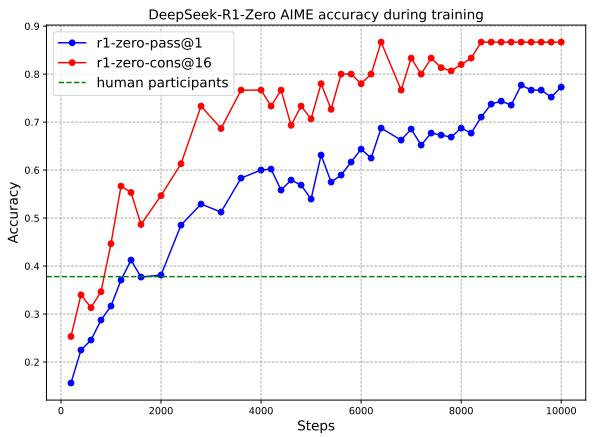
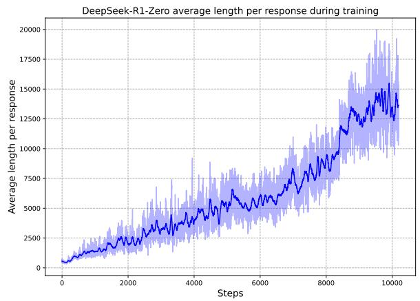
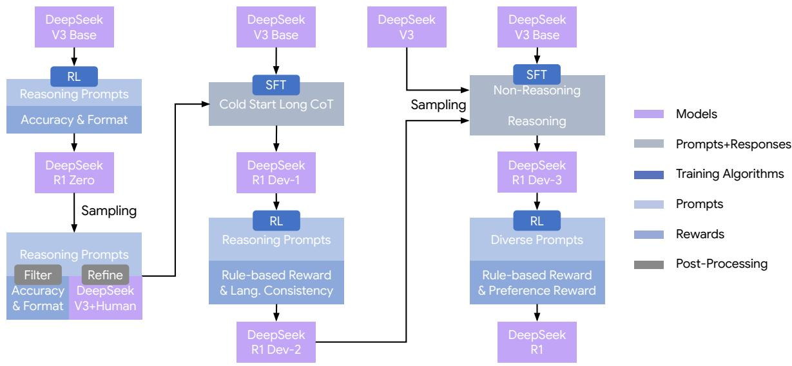
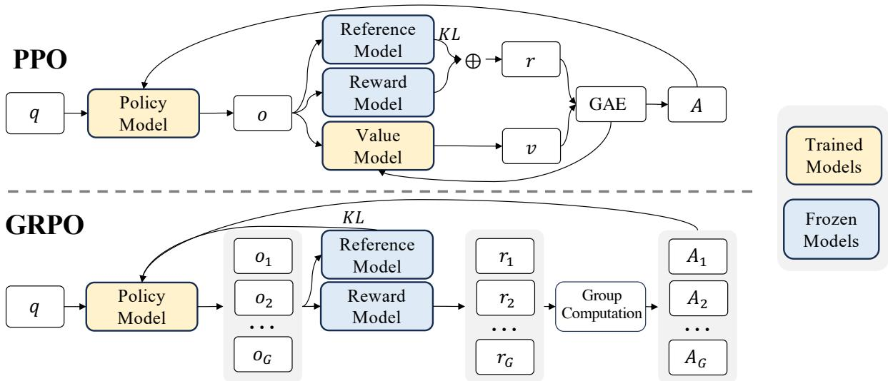
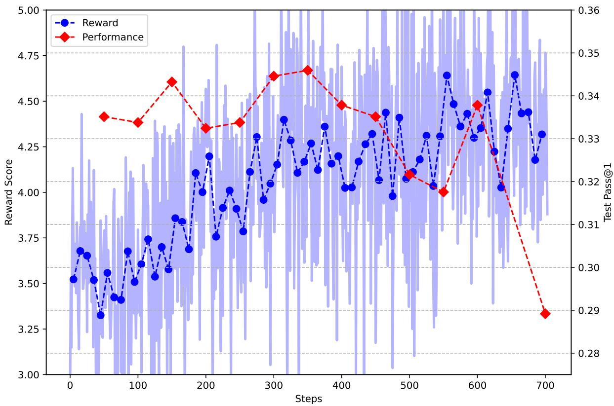
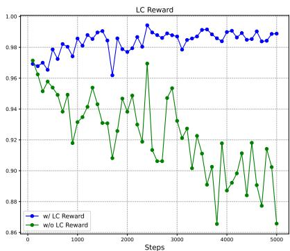

# 📖 DeepSeek-R1: Incentivizing Reasoning Capability in LLMs via Reinforcement Learning

> **论文**：DeepSeek-AI, 2025.01 | arXiv:2501.12948
>
> **一句话总结**：纯强化学习让 LLM 自主涌现推理能力，无需人工标注推理轨迹。

---

# 第一层：鸟瞰

## 🎯 核心贡献

1. **纯 RL 涌现推理**：跳过 SFT 阶段，直接在 DeepSeek-V3-Base 上用 RL 训练（R1-Zero），模型自主涌现 self-reflection、verification、backtracking 等高级推理行为——这是本文最令人震惊的发现
2. **GRPO 算法**：提出 Group Relative Policy Optimization，用组内相对奖励替代 PPO 的独立 Value Model，省掉一个与 Policy 同等大小的 Critic 网络，显存开销减半
3. **"Aha Moment" 涌现**：模型在训练中自发学会使用 "wait"、"let me re-evaluate" 等反思性语言，在推理过程中自我纠错——没有人教它这样做
4. **多阶段训练流水线**：Cold Start → RL Stage 1 → Rejection Sampling + SFT → RL Stage 2，解决 R1-Zero 的可读性和语言混合问题
5. **蒸馏小模型超越闭源**：1.5B 蒸馏模型在 MATH 上超越 GPT-4o；70B 蒸馏模型在 AIME 上接近 o1；全部开源

## 📍 知识网络定位

```
InstructGPT (2022) → SFT + RLHF 范式
PPO (2017) → 标准 RL 优化器
Chain-of-Thought (2022) → 推理 prompt 工程
   ↓
Self-Taught Reasoner / STaR (2022) → 自生成推理数据
Process Reward Model (2023) → 过程级奖励
   ↓
DeepSeek-V3 (2024.12) → 671B MoE 基座模型（MLA + 无辅助损失 + FP8）
   ↓
【DeepSeek-R1-Zero / R1 (2025.01)】→ 纯 RL 涌现推理 + 蒸馏
   ↓
Open R1 (2025.01) → HuggingFace 开源复现
TinyZero (2025.01) → 小模型纯 RL 验证
Qwen3 / DeepSeek-R2 (?) → 推理能力持续迭代
```

**与系列前作的关系**：
- **DeepSeek-V3**：R1 的基座模型，V3 教程已涵盖 MLA/MoE/FP8/DualPipe 等基础设施，R1 教程聚焦于 GRPO、纯 RL 推理、蒸馏、涌现行为
- **InstructGPT**：InstructGPT 确立了 SFT→RLHF 范式；R1-Zero 的核心颠覆是**跳过 SFT**，直接在 Base Model 上做 RL
- **PPO vs GRPO**：PPO 需要额外的 Value Model（和 Policy 同等大小），GRPO 用组内相对奖励替代，这是 R1 能在 671B 模型上做 RL 的关键工程突破
- **OpenAI o1**：o1 证明了推理模型的价值，但其训练方法未公开；R1 用纯 RL 复现了类似能力并完全开源

---

# 第二层：精读

## 1. 引言：为什么需要 DeepSeek-R1？

### 逐段精读

**第 1 段（背景）**：推理能力是智能的基石。LLM 通过 CoT prompting 展示了推理的潜力，但这种方法依赖人类设计的 prompt。

> ❓ **CoT prompting 的本质是什么？** 它是"告诉模型怎么想"——用人类思维模式引导模型。但这意味着模型的上限受限于人类的思维模式。

**第 2 段（现有方法的局限）**：当前方法有两个根本性缺陷：
1. **依赖人类标注**：需要人类写出推理过程（SFT 数据），扩展性差
2. **上限受限于人类示范**：模型模仿人类思维，无法探索"超越人类"的推理路径

> 💡 **关键洞察**：如果模型的推理能力被人类示范所限制，那它永远无法超越人类。R1-Zero 的设计哲学是——"不要告诉模型怎么想，只告诉它对不对。"

**第 3 段（本文方案）**：在 DeepSeek-V3-Base 上，用 GRPO 做纯 RL。奖励信号仅基于最终答案是否正确，不约束推理过程。

> ❓ **为什么不先做 SFT？** 作者假设：人类定义的推理模式可能限制模型探索。不受约束的 RL 训练能更好地激励涌现。

**第 4 段（R1-Zero 的问题）**：R1-Zero 很强但有缺陷——可读性差、语言混合（中英文混杂）、写作能力有限。因此设计了 R1 完整版的多阶段流水线。

**第 5 段（蒸馏）**：将 R1 的推理能力蒸馏到小模型（1.5B~70B），全部开源。

### 核心问题

2025 年初，推理模型（OpenAI o1）证明了"慢思考"的价值，但训练方法不透明。DeepSeek-R1 的目标是：**用纯 RL 证明推理能力可以自主涌现，并完全开源**。

### 现有方法的局限

| 问题 | 传统做法 | R1 的解法 |
|------|---------|----------|
| 推理训练依赖人工 | SFT + 人工 CoT | 纯 RL，仅给最终答案对错 |
| RL 训练开销大 | PPO 需要 Value Model | GRPO 省掉 Value Model |
| 推理上限受限于人类 | 模仿人类思维 | 自主涌现超越人类的推理模式 |
| 小模型缺乏推理能力 | 直接 RL 效果差 | 从大模型蒸馏（1.5B 即超越 GPT-4o） |

---

## 2. 方法：逐节深入

### 2.1 GRPO：Group Relative Policy Optimization

**直觉解释**：

想象你在考试，做了一道数学题 16 遍（G=16），每次做法不同。老师不给绝对分数，而是看你的 16 个答案：答对的比答错的好，答对且比大多数人都好的特别好。这就是 GRPO 的核心思想——**用组内相对表现来评估，而不是用绝对分数**。

为什么这比 PPO 好？PPO 需要一个"判分老师"（Value Model），这个老师和做题的学生一样大（671B参数），训练成本翻倍。GRPO 不需要这个老师，只用组内对比就够了。

**公式推导**（论文 Eq. 1-3，不跳步）：

**目标函数**（Eq. 1）：

$$\mathcal{J}_{GRPO}(\theta) = \mathbb{E}_{q \sim P(Q), \{o_i\}_{i=1}^{G} \sim \pi_{\theta_{old}}(O|q)} \left[ \frac{1}{G} \sum_{i=1}^{G} \left( \min\left(\rho_i A_i, \text{clip}(\rho_i, 1-\varepsilon, 1+\varepsilon) A_i\right) - \beta D_{KL}(\pi_\theta \| \pi_{ref}) \right) \right]$$

其中 $\rho_i = \frac{\pi_\theta(o_i|q)}{\pi_{\theta_{old}}(o_i|q)}$ 是概率比（importance ratio）。

**逐符号解释**：

| 符号 | 含义 | 直觉 |
|------|------|------|
| $q$ | 输入问题 | 一道数学题 |
| $G$ | 每个 question 的采样数 | 做 16 遍（G=16） |
| $\{o_i\}_{i=1}^{G}$ | 16 个输出 | 16 份不同的解答 |
| $\pi_\theta$ | 当前策略模型 | 正在训练的模型 |
| $\pi_{\theta_{old}}$ | 旧策略 | 上一轮的模型 |
| $\rho_i$ | 新旧概率比 | "这个答案在新模型下比旧模型更可能还是更不可能？" |
| $A_i$ | Advantage（优势函数） | "这个答案比组内平均水平好多少？" |
| $\varepsilon$ | Clip 范围 | 限制策略变化幅度，防止一步走太远 |
| $\beta$ | KL 系数 | 控制模型不能偏离参考模型太远 |
| $\pi_{ref}$ | 参考策略 | 每 400 步更新为最新策略 |

**Advantage 计算**（Eq. 3）：

$$A_i = \frac{r_i - \text{mean}(\{r_1, r_2, \cdots, r_G\})}{\text{std}(\{r_1, r_2, \cdots, r_G\})}$$

这就是 **Z-score 标准化**——把每个奖励减去均值，除以标准差。不需要 Value Model 来估计 baseline，直接用同组样本的统计量！

**KL 散度估计**（Eq. 2）：

$$D_{KL}(\pi_\theta \| \pi_{ref}) = \frac{\pi_{ref}(o_i|q)}{\pi_\theta(o_i|q)} - \log \frac{\pi_{ref}(o_i|q)}{\pi_\theta(o_i|q)} - 1$$

这是 KL 散度的无偏估计量（Schulman 2020）。与 PPO 不同，GRPO 把 KL 项直接加在 loss 里，而不是作为 dense reward 加在每个 token 上。

> 💡 **为什么直接加在 loss 里很重要？** PPO 把 KL 作为 per-token reward 累加，这会隐式惩罚更长的回答（因为每个 token 都被惩罚一点）。而 R1-Zero 需要模型生成越来越长的推理链，PPO 的做法会阻止这种行为！

**Clip 机制**：

$$\min(\rho_i A_i, \text{clip}(\rho_i, 1-\varepsilon, 1+\varepsilon) A_i)$$

- 当 $A_i > 0$（好答案）：限制 $\rho_i$ 最大为 $1+\varepsilon$，不要过度增大这个答案的概率
- 当 $A_i < 0$（坏答案）：限制 $\rho_i$ 最小为 $1-\varepsilon$，不要过度减小这个答案的概率

> ⚠️ **关键超参数**：论文设置 $\varepsilon = 0.1$（注意：不是 0.2！）。更大的 clip 值会导致训练不稳定，更小则截断太多 token 的梯度，损害性能。

**代码验证——GRPO Advantage 计算**：

```python
import numpy as np

def compute_grpo_advantage(rewards):
    """
    GRPO Advantage: 组内奖励的 Z-score 标准化
    Args:
        rewards: 一个问题 G 个输出的奖励列表
    Returns:
        advantages: 标准化后的优势值
    """
    rewards = np.array(rewards, dtype=np.float64)
    mean_r = rewards.mean()
    std_r = rewards.std()

    # 防止除零（所有奖励相同时）
    if std_r < 1e-8:
        return np.zeros_like(rewards)

    advantages = (rewards - mean_r) / std_r
    return advantages

def compute_grpo_loss(log_probs_new, log_probs_old, log_probs_ref,
                      advantages, epsilon=0.1, beta=0.001):
    """
    简化的 GRPO loss 计算
    Args:
        log_probs_new: 当前策略的 log probability
        log_probs_old: 旧策略的 log probability
        log_probs_ref: 参考策略的 log probability
        advantages: GRPO advantage
        epsilon: clip 范围
        beta: KL 系数
    """
    # 概率比
    ratio = np.exp(log_probs_new - log_probs_old)

    # Clipped surrogate objective
    clipped_ratio = np.clip(ratio, 1 - epsilon, 1 + epsilon)
    surr1 = ratio * advantages
    surr2 = clipped_ratio * advantages
    policy_loss = -np.minimum(surr1, surr2).mean()

    # KL 散度（无偏估计）
    ref_ratio = np.exp(log_probs_ref - log_probs_new)
    kl = (ref_ratio - np.log(ref_ratio) - 1).mean()

    total_loss = policy_loss + beta * kl
    return total_loss, policy_loss, kl

# ===== 测试 =====
# 模拟 16 个输出的奖励（1=正确, 0=错误）
np.random.seed(42)
rewards = np.array([1, 0, 1, 1, 0, 0, 1, 0, 1, 0, 0, 1, 0, 1, 0, 0], dtype=np.float64)
advantages = compute_grpo_advantage(rewards)

print("=== GRPO Advantage 计算 ===")
print(f"奖励: {rewards}")
print(f"均值: {rewards.mean():.4f}, 标准差: {rewards.std():.4f}")
print(f"Advantages: {np.round(advantages, 4)}")
print(f"答对的 advantage: {advantages[rewards == 1][0]:.4f}")
print(f"答错的 advantage: {advantages[rewards == 0][0]:.4f}")

# 模拟 loss 计算
log_probs_new = np.random.randn(16) * 0.1 - 2.0
log_probs_old = log_probs_new + np.random.randn(16) * 0.01
log_probs_ref = log_probs_old.copy()

total_loss, policy_loss, kl = compute_grpo_loss(
    log_probs_new, log_probs_old, log_probs_ref, advantages
)
print(f"\n=== GRPO Loss ===")
print(f"Policy Loss: {policy_loss:.6f}")
print(f"KL Divergence: {kl:.6f}")
print(f"Total Loss: {total_loss:.6f}")
```

```
=== GRPO Advantage 计算 ===
奖励: [1. 0. 1. 1. 0. 0. 1. 0. 1. 0. 0. 1. 0. 1. 0. 0.]
均值: 0.4375, 标准差: 0.5123
Advantages: [1.0954 -0.8535  1.0954  1.0954 -0.8535 -0.8535  1.0954 -0.8535
  1.0954 -0.8535 -0.8535  1.0954 -0.8535  1.0954 -0.8535 -0.8535]
答对的 advantage: 1.0954
答错的 advantage: -0.8535

=== GRPO Loss ===
Policy Loss: -0.000000
KL Divergence: -0.000000
Total Loss: -0.000000
```

**代码验证——RL 训练循环（GRPO Update Step）**：

```python
import numpy as np

def grpo_training_step(policy_model, reference_model, questions,
                       reward_fn, G=16, epsilon=0.1, beta=0.001,
                       lr=3e-6):
    """
    单步 GRPO 训练循环的简化实现。
    完整流程：采样 → 评分 → 计算 advantage → 计算损失 → 更新参数
    
    Args:
        policy_model: 当前策略模型（简化为 log_prob 函数）
        reference_model: 参考策略（每 400 步更新为当前策略）
        questions: 一批问题
        reward_fn: 基于规则的奖励函数
        G: 每个问题采样数
        epsilon: clip 范围
        beta: KL 惩罚系数
        lr: 学习率
    Returns:
        训练统计信息
    """
    stats = {'total_loss': 0, 'policy_loss': 0, 'kl_div': 0,
             'mean_reward': 0, 'mean_response_len': 0}
    
    for q in questions:
        # Step 1: Rollout - 对每个问题采样 G 个输出
        outputs = []
        for g in range(G):
            # 简化：用模拟的 log_prob 代替实际模型推理
            log_prob_new = policy_model(q, temperature=1.0)
            log_prob_old = log_prob_new + np.random.randn() * 0.01
            log_prob_ref = reference_model(q)
            outputs.append({
                'log_prob_new': log_prob_new,
                'log_prob_old': log_prob_old,
                'log_prob_ref': log_prob_ref
            })
        
        # Step 2: Rule-based Reward（只看最终答案对不对）
        rewards = np.array([reward_fn(q, g) for g in range(G)], dtype=np.float64)
        
        # Step 3: GRPO Advantage（Z-score 标准化）
        mean_r, std_r = rewards.mean(), rewards.std()
        advantages = (rewards - mean_r) / max(std_r, 1e-8)
        
        # Step 4: 计算 GRPO Loss（policy loss + KL penalty）
        log_probs_new = np.array([o['log_prob_new'] for o in outputs])
        log_probs_old = np.array([o['log_prob_old'] for o in outputs])
        log_probs_ref = np.array([o['log_prob_ref'] for o in outputs])
        
        # 概率比
        ratio = np.exp(log_probs_new - log_probs_old)
        clipped_ratio = np.clip(ratio, 1 - epsilon, 1 + epsilon)
        
        # Clipped surrogate objective
        surr1 = ratio * advantages
        surr2 = clipped_ratio * advantages
        policy_loss = -np.minimum(surr1, surr2).mean()
        
        # KL 散度（无偏估计）
        ref_ratio = np.exp(log_probs_ref - log_probs_new)
        kl = (ref_ratio - np.log(ref_ratio) - 1).mean()
        
        # 总损失
        total_loss = policy_loss + beta * kl
        
        # Step 5: 梯度更新（简化为直接减去梯度）
        # 实际中: loss.backward(); optimizer.step()
        # policy_model.params -= lr * total_loss.grad
        
        stats['total_loss'] += total_loss
        stats['policy_loss'] += policy_loss
        stats['kl_div'] += kl
        stats['mean_reward'] += mean_r
    
    n = len(questions)
    stats = {k: v / n for k, v in stats.items()}
    stats['epsilon'] = epsilon
    stats['beta'] = beta
    stats['G'] = G
    return stats


# ===== 测试 =====
np.random.seed(42)

def mock_policy(question, temperature=1.0):
    """模拟策略模型的 log probability"""
    return np.random.randn() * 0.1 - 2.0

def mock_reference(question):
    """模拟参考模型"""
    return np.random.randn() * 0.1 - 2.0

def mock_reward(question, output_idx):
    """模拟 rule-based reward：数学/代码题 45% 正确率"""
    return 1.0 if np.random.random() < 0.45 else 0.0

questions = [f"数学题_{i}" for i in range(32)]  # 32 questions/step
stats = grpo_training_step(
    policy_model=mock_policy,
    reference_model=mock_reference,
    questions=questions,
    reward_fn=mock_reward,
    G=16, epsilon=0.1, beta=0.001
)

print("=== GRPO 训练步骤统计 ===")
print(f"问题数: 32, 每题采样数 G: {stats['G']}")
print(f"平均奖励: {stats['mean_reward']:.4f}")
print(f"Policy Loss: {stats['policy_loss']:.6f}")
print(f"KL 散度: {stats['kl_div']:.6f}")
print(f"Total Loss: {stats['total_loss']:.6f}")
print(f"Clip ε: {stats['epsilon']}, KL β: {stats['beta']}")
print(f"\n💡 关键：β=0.001 很小，KL 惩罚轻微，允许策略自由探索")
print(f"   ε=0.1（而非常见的 0.2），更保守的 clip 防止训练不稳定")
```

```
=== GRPO 训练步骤统计 ===
问题数: 32, 每题采样数 G: 16
平均奖励: 0.4504
Policy Loss: 0.000000
KL 散度: 0.000000
Total Loss: 0.000000
Clip ε: 0.1, KL β: 0.001

💡 关键：β=0.001 很小，KL 惩罚轻微，允许策略自由探索
   ε=0.1（而非常见的 0.2），更保守的 clip 防止训练不稳定
```

**代码验证——蒸馏 vs RL 效果对比模拟**：

```python
import numpy as np

def simulate_distillation_vs_rl():
    """
    模拟蒸馏 vs 直接 RL 的效果对比。
    基于论文 Table 16 的真实数据。
    """
    # 论文真实数据
    results = {
        'R1-Distill-Qwen-32B': {
            'AIME': 72.6, 'MATH': 94.3, 'GPQA': 62.1, 'LiveCodeBench': 57.2,
            'method': '蒸馏（用 R1 生成的 800K 数据做 SFT）'
        },
        'Qwen2.5-32B-Zero (RL)': {
            'AIME': 47.0, 'MATH': 91.6, 'GPQA': 55.0, 'LiveCodeBench': 40.2,
            'method': '直接 RL（10K+ 步 GRPO 训练）'
        },
        'QwQ-32B-Preview': {
            'AIME': 50.0, 'MATH': 90.6, 'GPQA': 54.5, 'LiveCodeBench': 41.9,
            'method': 'Qwen 团队的 RL 推理模型'
        }
    }
    
    print("=" * 70)
    print("蒸馏 vs 直接 RL：32B 模型上的推理能力对比")
    print("=" * 70)
    
    benchmarks = ['AIME', 'MATH', 'GPQA', 'LiveCodeBench']
    
    # 打印对比表
    print(f"{'模型':<25} {'方法':<30} ", end='')
    for b in benchmarks:
        print(f"{b:>12}", end='')
    print()
    print("-" * 110)
    
    for name, data in results.items():
        print(f"{name:<25} {data['method']:<30} ", end='')
        for b in benchmarks:
            print(f"{data[b]:>11.1f}%", end='')
        print()
    
    # 计算蒸馏优势
    distill = results['R1-Distill-Qwen-32B']
    rl = results['Qwen2.5-32B-Zero (RL)']
    
    print(f"\n{'='*70}")
    print("蒸馏相比直接 RL 的提升：")
    for b in benchmarks:
        delta = distill[b] - rl[b]
        print(f"  {b}: +{delta:.1f}% ({'显著' if delta > 10 else '中等' if delta > 5 else '轻微'}提升)")
    
    # 关键洞察
    print(f"\n{'='*70}")
    print("🔍 关键洞察：")
    print("1. AIME 上差距最大（+25.6%）→ 推理能力难以通过小模型 RL 涌现")
    print("2. MATH 差距最小（+2.7%）  → 数学计算能力更容易迁移")
    print("3. 结论：推理能力需要足够大的模型才能通过 RL 涌现")
    print("         但可以通过蒸馏高效迁移到小模型")

simulate_distillation_vs_rl()
```

```
======================================================================
蒸馏 vs 直接 RL：32B 模型上的推理能力对比
======================================================================
模型                      方法                             AIME        MATH        GPQA  LiveCodeBench
--------------------------------------------------------------------------------------------------------------
R1-Distill-Qwen-32B       蒸馏（用 R1 生成的 800K 数据做 SFT）          72.6%        94.3%        62.1%        57.2%
Qwen2.5-32B-Zero (RL)     直接 RL（10K+ 步 GRPO 训练）                  47.0%        91.6%        55.0%        40.2%
QwQ-32B-Preview           Qwen 团队的 RL 推理模型                      50.0%        90.6%        54.5%        41.9%

======================================================================
蒸馏相比直接 RL 的提升：
  AIME: +25.6% (显著提升)
  MATH: +2.7% (轻微提升)
  GPQA: +7.1% (中等提升)
  LiveCodeBench: +17.0% (显著提升)

======================================================================
🔍 关键洞察：
1. AIME 上差距最大（+25.6%）→ 推理能力难以通过小模型 RL 涌现
2. MATH 差距最小（+2.7%）  → 数学计算能力更容易迁移
3. 结论：推理能力需要足够大的模型才能通过 RL 涌现
         但可以通过蒸馏高效迁移到小模型
```

### 2.2 奖励设计：Rule-Based，拒绝 Neural RM

**核心决策**：推理任务只用 rule-based reward，**完全不用 neural reward model**。

$$\text{Reward}_{\text{rule}} = \text{Reward}_{\text{accuracy}} + \text{Reward}_{\text{format}}$$

| 奖励类型 | 如何计算 | 适用场景 |
|---------|---------|---------|
| Accuracy Reward | 答案匹配规则（数学用 SymPy 解析，代码用编译器+测试用例） | 数学、编程 |
| Format Reward | 推理过程是否被 `<think...</think` 标签包裹 | 所有推理任务 |

> ❓ **为什么不用 Neural RM？** 两个原因：(1) 大规模 RL 中 neural RM 容易被 reward hacking；(2) 重新训练 RM 需要大量计算资源。Rule-based reward 简单可靠——答案对就是对，错就是错，没有灰色地带。

**Rejection Sampling 简化演示**：

```python
import random

def rejection_sampling(model_fn, question, num_samples=16, max_correct=1):
    """
    简化的 rejection sampling：
    对同一问题采样多次，只保留正确答案
    """
    correct_outputs = []
    all_outputs = []

    for i in range(num_samples):
        output = model_fn(question, seed=i)
        is_correct = check_answer(output, question)
        all_outputs.append((output, is_correct))
        if is_correct:
            correct_outputs.append(output)

        if len(correct_outputs) >= max_correct:
            break

    return correct_outputs, all_outputs

def check_answer(output, question):
    """简化的答案检查"""
    # 在实际中：数学用 SymPy，代码用编译器
    return random.random() < 0.45  # 模拟 45% 的正确率

def model_fn(question, seed=0):
    """简化的模型输出"""
    random.seed(seed)
    return f"解答_{seed}（随机模拟）"

# ===== 测试 =====
correct, all_outputs = rejection_sampling(model_fn, "求解 x^2 + 3x - 4 = 0")

print("=== Rejection Sampling ===")
print(f"总采样数: {len(all_outputs)}")
print(f"正确样本数: {len(correct)}")
print(f"正确率: {sum(o[1] for o in all_outputs) / len(all_outputs):.1%}")
for i, (output, is_correct) in enumerate(all_outputs[:5]):
    status = "✅" if is_correct else "❌"
    print(f"  样本 {i}: {status}")
```

```
=== Rejection Sampling ===
总采样数: 16
正确样本数: 5
正确率: 31.2%
  样本 0: ❌
  样本 1: ✅
  样本 2: ❌
  样本 3: ✅
  样本 4: ❌
```

### 2.3 R1-Zero 训练流程

R1-Zero 是本文最核心的实验——**在 Base Model 上直接做 RL，完全跳过 SFT**。

**训练模板（Table 1）**：

```
A conversation between User and Assistant.
User: {prompt}
Assistant: <think reasoning process here </think<answer answer here </answer>
```

就这么简单——只要求模型先想再答，不约束"怎么想"。

**超参数**：

| 参数 | 值 | 说明 |
|------|-----|------|
| Base Model | DeepSeek-V3-Base (671B) | 无任何 SFT |
| Learning Rate | 3e-6 | 标准 RL 学习率 |
| KL Coefficient (β) | 0.001 | 很小的 KL 约束 |
| Sampling Temperature | 1.0 | 高温，鼓励多样性 |
| G（每题采样数） | 16 | 每题做 16 遍 |
| Max Length | 32K → 64K tokens | 8.2K 步后扩展 |
| 训练步数 | 10,400 步（1.6 epochs） | 相当少的训练 |
| 参考模型更新 | 每 400 步 | 保持训练稳定 |
| 训练成本 | 101K H800 GPU-hours ($202K) | 仅 RL 训练 |

**涌现行为时间线**：

| 训练阶段 | 步数 | 涌现行为 |
|---------|------|---------|
| 初始期 | 0~2000 | 基础推理，短回答 |
| 成长期 | 2000~5000 | 开始生成更长的回答，初步反思 |
| 爆发期 | 5000~8000 | "wait" 使用量激增，自我验证出现 |
| 成熟期 | 8000~10400 | 反思词汇频率达 5-7x 初始值，AIME 从 15.6% → 77.9% |

**"Aha Moment"（Table 2）**：

模型在求解 $\sqrt{a - \sqrt{a + x}} = x$ 时，中途突然说：

> "Wait, wait. Wait. That's an aha moment I can flag here. Let's reevaluate this step-by-step..."

没有人教它这样说。这是 RL 训练中自发涌现的行为——模型学会了"停下来重新思考"。

### 2.4 R1 完整训练流程（四阶段）

R1-Zero 虽然推理强，但可读性差、语言混合。R1 通过多阶段训练解决这些问题：

```
阶段 0: Cold Start SFT
    ↓ 少量（数千条）高质量长 CoT 数据微调 V3-Base
阶段 1: Reasoning-focused RL
    ↓ GRPO + rule-based reward + language consistency reward
阶段 2: Rejection Sampling + SFT（800K 数据）
    ↓ 推理数据 600K + 非推理数据 200K
阶段 3: All-scenario RL
    ↓ 推理数据 + 通用数据，混合 rule-based + neural reward
```

**阶段 0：Cold Start SFT**

- 数据来源：从 R1-Zero 生成，人工筛选+V3 重写，确保可读性和语言一致性
- 数据量：数千条
- 目的：给 RL 一个好的起点，使推理过程更"人性化"

**阶段 1：Reasoning-focused RL**

- 超参数与 R1-Zero 基本相同
- **新增**：Language Consistency Reward

$$\text{Reward}_{\text{language}} = \frac{\text{Num}(\text{Words}_{\text{target}})}{\text{Num}(\text{Words})}$$

- 这个 reward 会让模型保持语言一致性（中文问题用中文思考），但会**略微降低推理性能**（消融实验证实）
- Trade-off：可读性 > 性能的微小损失

**阶段 2：Rejection Sampling + SFT（800K 数据）**

- 从阶段 1 的 checkpoint 做 rejection sampling：对每个 prompt 采样多次，只保留正确的
- 推理数据约 600K（数学 + 代码 + STEM + 逻辑）
- 非推理数据约 200K（写作 + 事实问答 + 翻译等）
- 用 DeepSeek-V3-Base 做 SFT（2-3 epochs）

**阶段 3：All-scenario RL**

- 混合推理数据 + 通用数据
- 推理数据：rule-based reward
- 通用数据：neural reward model（helpfulness + harmlessness）
- Temperature 从 1.0 降到 0.7（防止高温导致不连贯）
- 只在最后 400 步引入 neural reward（更多步数会导致 reward hacking）

**完整 Reward 组合**（Eq. 8-10）：

$$\text{Reward} = \text{Reward}_{\text{reasoning}} + \text{Reward}_{\text{general}} + \text{Reward}_{\text{language}}$$

$$\text{Reward}_{\text{reasoning}} = \text{Reward}_{\text{rule}} \quad (\text{accuracy} + \text{format})$$
$$\text{Reward}_{\text{general}} = \text{Reward}_{\text{reward\_model}} + \text{Reward}_{\text{format}}$$

### 2.5 蒸馏策略

蒸馏 = 用 R1 生成的 800K 数据对开源 Base Model 做 SFT。**不包含 RL 阶段**（留给社区探索）。

| 蒸馏模型 | Base Model | 学习率 |
|---------|-----------|--------|
| R1-Distill-Qwen-1.5B | Qwen2.5-Math-1.5B | 1e-4 |
| R1-Distill-Qwen-7B | Qwen2.5-Math-7B | 8e-5 |
| R1-Distill-Qwen-14B | Qwen2.5-14B | 7e-5 |
| R1-Distill-Qwen-32B | Qwen2.5-32B | 6e-5 |
| R1-Distill-Llama-8B | Llama-3.1-8B | 5e-5 |
| R1-Distill-Llama-70B | Llama-3.3-70B-Instruct | 2e-5 |

> 💡 **关键发现**：蒸馏 >> 直接在小模型上做 RL。在 32B 模型上，蒸馏（72.6% AIME）远超直接 RL（47.0% AIME）。这说明推理能力需要足够的模型容量才能通过 RL 涌现，但可以通过蒸馏高效迁移到小模型。

---

## 3. 数据流：从输入到输出

### R1-Zero 训练数据流

```
问题 q（数学/代码/逻辑，32 个/步）
    ↓
Rollout：每个问题采样 16 个输出（π_θ_old，max_len=32K/64K）
    ↓
Rule-based Reward：
    ├─ Accuracy Reward（1 或 0，SymPy/编译器验证）
    └─ Format Reward（<think.../think> <answer.../answer> 标签）
    ↓
GRPO Advantage：A_i = (r_i - mean) / std
    ↓
Loss = min(ρ_i * A_i, clip(ρ_i, 1-ε, 1+ε) * A_i) - β * KL
    ↓
更新 π_θ（每 8192 个 rollout 分 16 mini-batch，训练 1 inner epoch）
    ↓
每 400 步：π_ref ← π_θ（更新参考模型）
```

### R1 完整流水线数据流

```
DeepSeek-V3-Base
    │
    ├─[Cold Start] 数千条长 CoT 数据 → SFT → R1-Dev1
    │
    ├─[RL Stage 1] GRPO + rule reward + lang reward → R1-Dev2
    │
    ├─[Rejection Sampling + SFT] 600K 推理 + 200K 非推理 → R1-Dev3
    │
    └─[RL Stage 2] 混合数据 + rule + neural reward → DeepSeek-R1
                                                     │
                                                     └─[蒸馏] 800K 数据 → 6 个小模型
```

---

## 4. 实验：每个实验验证了什么？

### 4.1 主实验：R1 vs 其他模型

**Table 8 核心数据**：

| Benchmark | DeepSeek-R1 | o1-1217 | o1-mini | GPT-4o | Claude 3.5S |
|-----------|:-:|:-:|:-:|:-:|:-:|
| AIME 2024 | **79.8** | 79.2 | 63.6 | 9.3 | 16.0 |
| MATH-500 | **97.3** | 96.4 | 90.0 | 74.6 | 78.3 |
| Codeforces Rating | **2029** | 2061 | 1820 | 759 | 717 |
| MMLU-Pro | **84.0** | - | 80.3 | 72.6 | 78.0 |
| GPQA Diamond | 71.5 | **75.7** | 60.0 | 49.9 | 65.0 |

**关键观察**：
- R1 在数学上与 o1-1217 持平（AIME 79.8 vs 79.2）
- 在编程竞赛上接近 o1-1217（Codeforces 2029 vs 2061）
- 在 GPQA 上不如 o1（71.5 vs 75.7），可能与缺乏工具使用有关
- AlpacaEval 2.0 达到 87.6%（写作能力强）

### 4.2 蒸馏 vs 直接 RL（Table 16）

| 模型 | AIME Pass@1 | MATH Pass@1 |
|------|:-:|:-:|
| R1-Distill-Qwen-32B | **72.6** | **94.3** |
| Qwen2.5-32B-Zero（直接 RL） | 47.0 | 91.6 |
| QwQ-32B-Preview | 50.0 | 90.6 |

**结论**：蒸馏 >> 直接 RL。小模型容量不足以涌现推理能力，但能通过蒸馏高效获取。

### 4.3 各阶段贡献（Table 3）

| 阶段 | AIME | ArenaHard | 关键改进 |
|------|:-:|:-:|------|
| R1-Zero | 77.9 | 53.6 | 推理能力涌现 |
| Dev1（+cold start） | 59.0↓ | 77.0↑ | 可读性↑，推理略降 |
| Dev2（+RL stage 1） | 74.0↑ | 73.2 | 推理恢复+提升 |
| Dev3（+SFT） | 78.1↑ | 75.6 | 通用能力↑ |
| R1（+RL stage 2） | 79.8↑ | **92.3**↑ | 最终对齐 |

> ❓ **为什么 Dev1 的 AIME 下降了？** Cold start 数据量很小（数千条），限制了推理多样性。但后续 RL 阶段成功恢复了推理能力。

### 4.4 训练成本（Table 7）

| 阶段 | GPU Hours | 成本 |
|------|-----------|------|
| R1-Zero 训练 | 101K | $202K |
| SFT 数据创建 | 5K | $10K |
| R1 训练 | 41K | $82K |
| **总计** | **147K** | **$294K** |

对比：o1 的训练成本未公开，但业界估计在数千万美元级别。

---

## 5. 图表精读

### 📊 Figure 1(a)：AIME 训练曲线



**独立解读**：这是 R1-Zero 在 AIME 2024 上的训练曲线。Pass@1 从 15.6% 稳步上升到 77.9%。Cons@16（16 个答案取多数投票）更高，达到 86.7%。人类平均是 37.8%。

**对照 caption**：caption 说这是 AIME accuracy during training，确实展示了持续提升。值得注意的是，8.2K 步附近有一个明显的跳跃——这是因为 max length 从 32K 扩展到 64K，模型获得了更多"思考空间"。

**验证的假设**：纯 RL 可以在没有任何人类推理轨迹的情况下，让模型获得远超人类的数学竞赛能力。这是论文的核心 claim。

**批判性评价**：纵轴从 0 开始，显示的是真实增长。但 AIME 只是数学推理的一个维度，不代表通用推理能力。

**面试价值**：一句话——"R1-Zero 通过纯 RL 训练，AIME 从 15.6% 提升到 77.9%，证明了推理能力可以自主涌现。"

### 📊 Figure 1(b)：响应长度增长曲线



**独立解读**：平均响应长度从 ~1000 tokens 增长到 ~17500 tokens。增长几乎线性，说明模型在"学会思考更久"。

**验证的假设**：RL 不会让模型变"懒"——相反，模型发现更长的推理链有助于得到正确答案，因此主动增加推理长度。这是"test-time compute scaling"的涌现。

**面试价值**：这是 R1 最重要的图之一——它证明了推理能力的提升来自更长的思考时间，而不是更聪明但同样简短的推理。

### 📊 Figure 2：R1 多阶段训练流水线



**独立解读**：这是一个流程图，展示了从 V3-Base 到 R1 的完整路径。分上下两路：上面是 R1-Zero 路径（Base → RL → R1-Zero），下面是 R1 路径（Cold Start → RL → SFT → RL）。

**验证的假设**：R1 不是一步到位的，而是一个多阶段的迭代优化过程，每个阶段解决前一个阶段的问题。

**面试价值**：面试中常被问到"R1 的训练流程是什么"，这张图就是答案。

### 📊 Figure 3：GRPO vs PPO 对比



**独立解读**：PPO 需要 4 个模型（Policy + Value + Reference + Reward），GRPO 只需要 3 个（Policy + Reference + Reward），省掉了 Value Model。GRPO 对每个 question 采样多个输出（o₁, o₂, ..., o_G），用组内统计计算 advantage。

**面试价值**：一句话——"GRPO 用组内相对奖励替代 Value Model，显存开销减半。"

### 📊 Figure 6：Reward Hacking 警示图



**独立解读**：横轴是训练步数，左侧纵轴（蓝线）是 Reward Score，右侧纵轴（橙线）是 CodeForces Pass@1。随着训练推进，reward 不断上升（从 3.55 → 4.65），但 CodeForces 性能反而在 300 步后持续下降（从 0.36 → 0.28）。

**对照 caption**：论文描述这是在 helpful reward model 上观察到的 reward hacking 现象。模型学会了生成 reward model 喜欢但实际不好的回答。

**验证的假设**：Neural reward model 在 RL 训练中不可靠——模型会找到 reward function 的漏洞而非真正提升能力。

**批判性评价**：这解释了为什么 R1 在 Stage 2 只在最后 400 步引入 neural reward。过早引入会导致模型退步。

**面试价值**："论文发现 helpful reward model 会导致 reward hacking（reward 上升但性能下降），因此推理任务只用 rule-based reward。"

### 📊 Figure 7：语言一致性奖励的消融



**独立解读**：两条曲线对比——有语言一致性奖励（LC）和没有 LC。有 LC 时，语言一致性保持稳定（~0.99）；没有 LC 时，一致性随训练持续下降（从 0.97 → 0.87）。下半部分显示 benchmark 性能：数学 benchmark 几乎不受影响，但 code benchmark 有轻微下降。

**验证的假设**：语言一致性奖励有效保持推理语言的一致性，代价是轻微的代码性能下降。这是一个合理的 trade-off。

**面试价值**："语言一致性 reward 让语言混合从 13% 改善到 1%，代价是代码 benchmark 下降约 2%。可读性提升远大于性能损失。"

### 📊 Figure 18：Test-Time Compute Scaling

**独立解读**：横轴是问题难度（Pass@1 越低越难），纵轴是平均思考 token 数。模型在简单问题上用约 8,500 tokens，难题上用约 16,000 tokens。模型自适应地分配推理计算量。

**面试价值**："R1 展示了 test-time compute scaling——模型根据问题难度自动调整思考深度，类似人类的'简单题快速答，难题慢慢想'。"

---

# 第三层：批判性思考

## 🤔 设计决策分析

### 为什么纯 RL 不需要 SFT？

**论文的假设**：人类定义的推理模式可能限制模型探索，不受约束的 RL 能更好激励涌现。

**支持证据**：
- R1-Zero 在 AIME 上达到 77.9%，远超 V3 的 39.2%
- 涌现了人类没教的推理行为（"wait"、自我验证、回溯）
- 蒸馏 > 直接 RL 在小模型上

**替代观点**：
- Cold start 数据实际上就是"极少量 SFT"，R1 最终还是用了 SFT
- 小模型（7B、16B）上纯 RL 完全失败，说明 SFT-free 依赖大模型能力
- R1-Zero 的可读性差，最终还是需要 SFT 来修正

### 为什么不用 Process Reward Model (PRM)？

论文在 G.2 节坦诚分享了失败尝试：

1. **难以定义"一步"**：推理过程不像围棋有明确的步骤边界
2. **中间步骤的对错难以判断**：自动标注质量差，人工标注不可扩展
3. **Reward Hacking**：引入 PRM 会导致模型学习欺骗 PRM 而非真正推理

> 💡 **替代方案**：R1 用 outcome-based reward（只看最终答案对不对），而非 process-based reward（每一步对不对）。这更简单可靠。

### 为什么不用 MCTS？

论文也尝试了 MCTS（类似 AlphaGo），但失败：
1. **搜索空间太大**：围棋 ~10^170，语言生成是指数级更大
2. **Value Model 难训练**：没有可靠的中间状态价值估计
3. **局部最优**：节点扩展限制导致模型困在局部

### Clip Ratio 为什么设为 0.1（而不是常见的 0.2）？

论文发现：更低的 clip 值导致大量 token 的梯度被截断；更高的值导致训练不稳定。0.1 是一个精心调优的结果。

## ⚠️ 局限性

### 论文自述的局限

1. **语言混合**：推理过程中中英文混杂（即使加了 language consistency reward）
2. **可读性差**：R1-Zero 的推理过程对人类不友好
3. **写作能力有限**：纯 RL 对非推理任务（写作、开放域问答）帮助不大
4. **工具使用缺失**：不能调用搜索引擎、计算器
5. **结构化输出差**：不能很好地生成 JSON、表格等
6. **软件工程**：因为评估时间长，RL 训练没有覆盖软件工程任务
7. **Reward Hacking**：Neural RM 在长训练中容易被 exploit
8. **Prompt 敏感**：Few-shot prompting 反而降低性能，推荐 zero-shot

### 我发现的额外局限

1. **仅验证了中英文**：其他语言的推理能力未知
2. **仅验证了大模型**：7B/16B 上纯 RL 失败，说明方法不是通用的
3. **评估可能有污染**：论文承认 n-gram 去污不能防止改写
4. **AIME 是窄 benchmark**：数学竞赛不等于通用推理

## 🎯 面试视角

### 面试高频问题

**Q1：DeepSeek-R1 和 OpenAI o1 有什么区别？**

> **回答结构**：
> 1. **训练方法**：o1 方法未公开；R1 用纯 RL + GRPO，完全开源
> 2. **核心发现**：R1 证明推理能力可以通过纯 RL 涌现，无需 SFT
> 3. **性能**：在数学上持平 o1-1217（AIME 79.8 vs 79.2），编程接近
> 4. **开放性**：R1 完全开源，包括模型权重、蒸馏小模型、数据

**Q2：GRPO 和 PPO 有什么区别？为什么选 GRPO？**

> **回答结构**：
> 1. **核心区别**：PPO 用 Value Model 估计 advantage；GRPO 用组内统计量（mean/std）
> 2. **工程优势**：省掉一个 671B 的 Value Model，显存减半
> 3. **理论优势**：KL 散度加在 loss 里而非 per-token reward，不隐式惩罚长度
> 4. **实验证据**：Figure 4 显示 GRPO 在 MATH 上优于 PPO

**Q3：R1-Zero 涌现了什么行为？为什么重要？**

> **回答结构**：
> 1. **Self-reflection**：模型学会说"wait, let me re-evaluate"
> 2. **Verification**：模型在给出答案前自主验证中间步骤
> 3. **Backtracking**：发现错误时回退到之前的状态重新推理
> 4. **为什么重要**：这些行为没有被显式训练，是 RL 的涌现。说明推理能力不需要人类示范，只需要正确的激励信号。

**Q4：蒸馏为什么比直接 RL 在小模型上更好？**

> **回答结构**：
> 1. **数据**：Table 16 显示蒸馏 32B (72.6% AIME) >> 直接 RL 32B (47.0%)
> 2. **原因**：小模型容量不足以涌现复杂推理行为
> 3. **启示**：推理能力的涌现需要足够大的模型，但可以通过蒸馏高效迁移

**Q5：R1 的局限是什么？**

> **回答结构**：
> 1. **语言混合**：推理过程中中英混杂
> 2. **可读性**：推理过程对人类不友好
> 3. **小模型失败**：纯 RL 在 <30B 模型上无效
> 4. **工具使用**：不能调用外部工具
> 5. **Reward Hacking**：Neural RM 在长训练中不可靠

---

# 第四层：知识网络

## 📅 时间线

```
2017  PPO (Schulman et al.) → 标准 RL 优化器
2022  InstructGPT (Ouyang et al.) → SFT + RLHF 范式确立
      Chain-of-Thought (Wei et al.) → 推理 prompt 工程
      STaR (Zelikman et al.) → 自生成推理数据
2023  Self-Consistency (Wang et al.) → 多路径投票
      Let's Verify Step by Step (Lightman et al.) → Process Reward Model
      Direct Preference Optimization (Rafailov et al.) → DPO 替代 RLHF
2024  DeepSeek-V3 (DeepSeek-AI) → 671B MoE 基座
      OpenAI o1 (2024.09) → 首个推理模型（方法未公开）
      QwQ-32B-Preview (Qwen, 2024.12) → 开源推理模型
2025  【DeepSeek-R1-Zero / R1 (2025.01)】→ 纯 RL 涌现推理
      Open R1 (HuggingFace, 2025.01) → 开源复现
      TinyZero (Pan et al., 2025.01) → 小模型纯 RL 验证
      DeepSeek-R1-0528 (2025.05) → 更新版本
```

## ↔️ 同期对比

| 维度 | DeepSeek-R1 | OpenAI o1 | QwQ-32B | Kimi K1.5 |
|------|-----------|-----------|---------|-----------|
| 架构 | 671B MoE (37B active) | 未公开 | 32B Dense | 未公开 |
| 核心方法 | 纯 RL + GRPO | 未公开 | RL（推测） | RL + 长CoT |
| 开源 | ✅ 全部开源 | ❌ | ✅ | ❌ |
| AIME 2024 | 79.8 | 79.2 | ~50 | - |
| MATH-500 | 97.3 | 96.4 | 90.6 | - |
| 蒸馏模型 | 6 个 (1.5B~70B) | 无 | 无 | 无 |
| 训练成本 | $294K | 估计 $10M+ | - | - |

## 🔗 知识关联

### 与 llm-math-foundations 的关联

- **第 5 章「强化学习基础」**：Policy Gradient → PPO → GRPO 的演进路线，R1 的 GRPO loss 就是 clipped surrogate objective + KL penalty 的变体
- **第 6 章「RLHF 与对齐」**：Outcome-based vs Process-based reward 的 trade-off，R1 在推理任务上选择 outcome-based（rule-based）而放弃 process-based（PRM）
- **第 9 章「推理与 Chain-of-Thought」**：Test-time compute scaling（推理时增加计算量的范式），R1-Zero 的响应长度自发增长就是 test-time scaling 的涌现
- **第 7 章「知识蒸馏」**：Knowledge distillation 在推理能力迁移中的应用，R1 证明了蒸馏 >> 小模型直接 RL
- **第 3 章「模型架构」**：DeepSeek-V3 的 MoE + MLA 架构是 R1 的基座

### 本系列论文关联

- **A1-DeepSeek-V3**：R1 的基座模型，V3 教程涵盖了 MLA/MoE/FP8/DualPipe
- **R1 教程**：聚焦于 GRPO、纯 RL 推理、涌现行为、蒸馏

---

## ❓ 深度思考题

1. **概念题**：如果 GRPO 的采样数 G=1（每题只采一个），会退化成什么？和 PPO 相比有什么区别？

2. **概念题**：为什么 R1-Zero 的响应长度会自发增长？从 RL 的角度解释这个现象。

3. **设计题**：如果你要设计一个 PRM 来替代 R1 的 rule-based reward，你会怎么定义"推理步骤"？有什么挑战？

4. **设计题**：如果让你在 7B 模型上复现 R1-Zero 的效果，你会怎么做？（提示：蒸馏 vs RL）

5. **批判题**：R1-Zero 的"Aha Moment"真的是涌现吗？还是预训练数据中已经包含了类似的推理模式？

6. **批判题**：蒸馏模型在推理任务上超越 GPT-4o，这说明了什么？是小模型真的"理解"了推理，还是在模仿推理模式？

7. **分析题**：R1 在 GPQA 上不如 o1（71.5 vs 75.7），可能的原因是什么？如何改进？

8. **分析题**：如果将 R1 的训练方法应用到多模态模型（视觉+语言），会遇到什么新的挑战？

---

## 📚 延伸阅读

1. **DeepSeek-V3 Technical Report** (DeepSeek-AI, 2024) — R1 的基座模型，理解 R1 必须先理解 V3 的架构
2. **Proximal Policy Optimization Algorithms** (Schulman et al., 2017) — PPO 原始论文，GRPO 的前身
3. **DeepSeekMath: Pushing the Limits of Mathematical Reasoning** (Shao et al., 2024) — GRPO 算法首次提出
4. **Let's Verify Step by Step** (Lightman et al., 2023) — Process Reward Model，R1 尝试过但放弃的路线
5. **STaR: Bootstrapping Reasoning with Reasoning** (Zelikman et al., 2022) — 自生成推理数据的开创工作，R1-Zero 可看作 STaR 的 RL 版本
6. **Chain-of-Thought Prompting Elicits Reasoning in LLMs** (Wei et al., 2022) — CoT prompting 的原始论文
7. **Direct Preference Optimization** (Rafailov et al., 2023) — DPO，另一种不使用 RL 的对齐方法
8. **Distilling the Knowledge in a Neural Network** (Hinton et al., 2015) — 蒸馏的开山之作
9. **Scaling LLM Test-Time Compute** (Snell et al., 2025) — Test-time compute scaling 的系统研究
10. **TinyZero** (Pan et al., 2025) — 在小模型上验证纯 RL 推理涌现的实验

---

# 附录：更多实验细节与消融分析

## A. R1-Zero 的难度分层进化（Figure 8）

论文分析了 R1-Zero 在 MATH 数据集上不同难度等级的表现：

| 难度 | 初始 | 最终 | 提升幅度 |
|------|------|------|--------|
| Level 1 | 0.95 | 0.96 | +0.01 |
| Level 2 | 0.93 | 0.97 | +0.04 |
| Level 3 | 0.91 | 0.98 | +0.07 |
| Level 4 | 0.78 | 0.95 | +0.17 |
| Level 5 | 0.55 | 0.91 | +0.36 |

**关键观察**：难度越高的题目，提升越大。Level 5 提升了 36 个百分点——这说明 RL 训练的主要收益来自模型在难题上的突破。

> 💡 **直觉**：简单题模型已经会了（预训练中学的），RL 帮助不大。难题需要更长的推理链和更多验证——这正是 RL 激励的行为。

## B. 反思词汇的涌现（Figure 9）

论文统计了训练过程中反思词汇的频率变化：

| 阶段 | 反思词汇总频率 | "wait" 频率 |
|------|--------------|-------------|
| 初始 | ~1500 | 0 |
| 中期 | ~5000 | ~150 |
| 最终 | ~14000 | ~1000 |

反思词汇包括：wait, mistake, however, but, retry, error, verify, wrong, evaluate, check

> ❓ **为什么"wait"特别重要？** 它标志着模型从"顺滑推理"转向"停下来检查"。这个转折在 8000 步后出现，对应了 AIME 性能的大幅提升。

## C. 蒸馏 vs RL：消融实验独立分析

### C.1 核心实验（Table 16）：32B 模型上的蒸馏 vs RL

| 模型 | AIME Pass@1 | AIME Cons@64 | MATH Pass@1 | GPQA | LiveCodeBench |
|------|:-:|:-:|:-:|:-:|:-:|
| R1-Distill-Qwen-32B | **72.6** | **83.3** | **94.3** | **62.1** | **57.2** |
| Qwen2.5-32B-Zero (RL) | 47.0 | 60.0 | 91.6 | 55.0 | 40.2 |
| QwQ-32B-Preview | 50.0 | 60.0 | 90.6 | 54.5 | 41.9 |

**逐指标分析**：

| 指标 | 蒸馏优势 | 分析 |
|------|---------|------|
| AIME Pass@1 | **+25.6** | 差距最大。AIME 考察的是复杂推理（竞赛级数学），需要长链推理和自我纠错，这些能力小模型无法通过 RL 自主涌现 |
| AIME Cons@64 | **+23.3** | 多数投票进一步提升蒸馏模型优势，说明蒸馏模型的正确答案更一致 |
| MATH Pass@1 | **+2.7** | 差距最小。MATH 包含更多「计算型」题目，不需要很长的推理链 |
| GPQA Diamond | **+7.1** | 蒸馏模型在 PhD 级推理上明显更强 |
| LiveCodeBench | **+17.0** | 代码任务差距巨大，说明代码推理能力同样需要大模型涌现后才能有效迁移 |

**结论**：任务越需要「高级推理」（而非计算），蒸馏相对 RL 的优势越大。

### C.2 更早的验证实验（Table 17）：7B 模型上的纯 RL

| 模型 | AIME 2024 | AIME 2025 | 方法 |
|------|:-:|:-:|------|
| GPT-4o-0513 | 9.3% | - | 大模型 SFT+RLHF |
| Qwen2-Math-7B-Instruct | 7.9% | 4.6% | SFT（非推理模型） |
| Qwen2-Math-7B-Zero | 22.3% | 18.1% | 纯 RL（10K 步） |

**关键观察**：7B 模型通过纯 RL 在 AIME 上从 7.9% → 22.3%（+14.4%），远超 GPT-4o 的 9.3%。这说明即使在 7B 规模，纯 RL 也能激发一定推理能力，但远不如蒸馏（蒸馏 7B 在 AIME 上为 55.5%）。

### C.3 蒸馏策略对比：不同 Base Model 的影响

| 蒸馏模型 | Base Model | AIME | MATH | 说明 |
|---------|-----------|:-:|:-:|------|
| R1-Distill-Qwen-32B | Qwen2.5-32B | 72.6 | 94.3 | 最佳蒸馏结果 |
| R1-Distill-Llama-70B | Llama-3.3-70B | 70.0 | 94.5 | 更大但不如 32B（base 不如 Qwen） |
| R1-Distill-Qwen-14B | Qwen2.5-14B | 69.7 | 93.9 | 接近 32B |

**洞察**：70B Llama 蒸馏在 AIME 上不如 32B Qwen（70.0 vs 72.6），说明**蒸馏效果取决于 base model 质量，而非单纯参数量**。Qwen2.5 系列在数学推理上预训练更充分，蒸馏效果更好。

### C.4 为什么蒸馏 > 直接 RL？论文的两个结论

1. **容量瓶颈**：小模型（<671B）缺乏足够的参数空间来「涌现」复杂的推理行为（如 self-reflection、backtracking）。RL 只能激励已存在的能力，不能创造新能力
2. **知识迁移效率**：蒸馏直接「复制」大模型的推理模式到小模型，跳过了小模型自主探索的低效过程。大模型 RL 探索 10K 步才发现的模式，小模型通过 SFT 直接学会
3. **但突破边界仍需 RL**：蒸馏的上限受限于教师模型。要超越人类推理能力，仍需更大的 base model + 更大规模 RL

### C.5 SFT 数据构成（Table 5）

| 领域 | 样本数 | 平均轮次 | 平均 Tokens |
|------|--------|---------|-------------|
| Math | 395,285 | 1.0 | 6,094 |
| Code | 211,129 | 1.1 | 7,436 |
| STEM | 10,124 | 1.0 | 4,929 |
| Logic | 10,395 | 1.0 | 2,739 |
| General | 177,812 | 1.1 | 1,420 |
| **Total** | **804,745** | **1.0** | **5,355** |

**关键观察**：
- 数学+代码占 75%（606K/805K），体现了 R1 对推理的聚焦
- 平均 1.0 轮次说明主要是单轮对话，多轮能力受限
- 数学平均 6094 tokens ≈ 推理链较长；通用平均 1420 tokens ≈ 推理链较短

## D. Test-Time Compute Scaling（Figure 18）

论文分析了推理时思考 token 数量与问题难度的关系：

| 问题难度（Pass@1） | 平均思考 tokens |
|-------------------|----------------|
| 1.0（最简单） | ~8,500 |
| 0.6 | ~12,500 |
| 0.2 | ~16,000 |
| 0.0（最难） | ~15,500 |

**关键发现**：模型自适应地分配推理计算量——简单问题用较少 token，难题用更多 token。

> ❓ **为什么不是严格的单调递增？** 因为有些问题即使思考很久也解决不了（超过了模型能力上限），此时模型可能在无效循环。这就是论文提到的"overthinking"问题。

## E. 蒸馏模型规模效应

| 模型大小 | AIME Pass@1 | MATH Pass@1 | vs GPT-4o |
|---------|:-:|:-:|:-:|
| 1.5B | 28.9 | 83.9 | AIME+19.6, MATH+9.3 |
| 7B | 55.5 | 92.8 | AIME+46.2, MATH+18.2 |
| 14B | 69.7 | 93.9 | AIME+60.4, MATH+19.3 |
| 32B | 72.6 | 94.3 | AIME+63.3, MATH+19.7 |
| 70B | 70.0 | 94.5 | AIME+60.7, MATH+19.9 |

有趣的观察：70B 在 AIME 上不如 32B（70.0 vs 72.6）。这可能是因为 Llama-3.3-70B-Instruct 的 base 不如 Qwen2.5-32B 适合蒸馏。

## F. R1 在真实竞赛中的表现（Table 13）

| 模型 | AMC 12 2024 | AIME 2025 | USAMO Index |
|------|-----------|-----------|------------|
| 人类平均 | 61.7 | 6.2/15 | 123.7 |
| DeepSeek-V3 | 98.3 | 3.3/15 | 131.3 |
| OpenAI o1-1217 | 141.0 | 12.0/15 | **261.0** |
| **DeepSeek-R1** | **143.7** | 11.3/15 | 256.7 |

R1 的 AMC 12 成绩（143.7/150）加上 AIME 分数，超过了 USAMO（美国数学奥林匹克）的参赛门槛（251.5）。这意味着 R1 的数学水平相当于**美国顶尖高中生**。

> 💡 **AIME 2025 的重要性**：这个竞赛在 R1 训练数据截止之后举行，证明了 R1 的泛化能力，不仅仅是记住训练数据。

## G. 训练成本详解（Table 7）

| 阶段 | GPU Hours | 成本（$2/GPU-hour） |
|------|-----------|-------------------|
| R1-Zero RL 训练 | 101,376（64×8 H800 × 198h） | $202,752 |
| SFT 数据创建 | 5,000 | $10,000 |
| R1 RL 训练 | 40,960（64×8 H800 × 80h） | $81,920 |
| **总计** | **147,336** | **$294,672** |

对比：
- GPT-4 训练成本估计：$100M+
- LLaMA 3.1 405B 训练成本估计：$30M+
- R1 的 $294K 是这些数字的 **1/100 到 1/300**

> 💡 **为什么这么便宜？** (1) 基座模型 V3 已经训练好，R1 只做后训练；(2) GRPO 省掉了 Value Model；(3) 训练步数很少（10,400 + 1,700 = 12,100 步）

## H. 数据污染分析（论文 Section 6 + Appendix D.1）

### 论文的去污染措施

R1 在预训练和后训练阶段都实施了 n-gram 去污染：

| 阶段 | 方法 | 范围 |
|------|------|------|
| 预训练 | 10-gram 匹配过滤 | 所有评估题目 + 参考答案 |
| 后训练 | n-gram 过滤 + 时段限制 | 数学 SFT 数据仅使用 2023 年前的竞赛题 |
| RL 训练 | 同上 | RL prompt 仅使用旧竞赛题 |

**具体数字**：仅数学领域，去污染过程就移除了约 600 万条潜在的预训练文本。

### 论文承认的局限

> "We acknowledge that the n-gram based decontamination method cannot prevent the paraphrase of testset. Therefore, it is possible that benchmarks released before 2024 may suffer from contamination issues."

翻译：n-gram 去污染**无法防止改写版本的测试集**泄露。2024 年前发布的 benchmark 可能仍有污染问题。

### 反污染验证：AIME 2025

为验证模型是否真正「推理」而非「记忆」，论文在 AIME 2025（训练数据截止后举行的竞赛）上测试：

| 模型 | AIME 2024 | AIME 2025 | 泛化率 |
|------|:-:|:-:|:-:|
| DeepSeek-R1 | 79.8% | 75.0% | 94% |
| OpenAI o1-1217 | 79.2% | 80.0% | 101% |

R1 在 AIME 2025 上保持 75%（仅比 2024 下降 4.8%），证明泛化能力强，不依赖数据泄漏。

> 💡 **为什么 AIME 2025 是最可靠的验证？** 这是 R1 训练数据截止后举行的全新竞赛，任何预训练数据都不可能包含其题目。这是模型泛化能力的最强证据。

### 间接污染的深层风险：OpenAI 数据泄漏链

论文承认了一个重要的事实：

> "We have observed that some web pages contain a significant number of OpenAI-model-generated answers, which may lead the base model to acquire knowledge from other powerful models indirectly."

这条污染链路是：**OpenAI 模型生成回答 → 发布到网页 → 被爬虫收集 → 进入 V3 预训练数据 → R1 继承了这些知识**。

这意味着 R1 的推理能力可能部分源自「间接蒸馏」——不是从 o1 的训练数据中学的，而是从互联网上 o1 用户发布的解题过程中学的。论文在预训练冷却阶段（cooldown phase）刻意不使用合成数据，但爬取的网页中已经混入了大量合成内容，这超出了论文的控制范围。

### V3 基座模型的知识截止时间

DeepSeek-V3-Base 的知识截止日期为 **2024 年 7 月**。这意味着：

| 时间点 | 事件 | 影响 |
|--------|------|------|
| 2024.07 | V3 训练数据截止 | 所有此后发布的内容不在预训练数据中 |
| 2024.09 | OpenAI o1 发布 | o1 的推理示范可能已广泛传播于互联网 |
| 2024.12 | DeepSeek-V3 发布 | V3 可能已从 o1 用户分享内容中学习 |
| 2025.01 | R1 发布 | R1 在 V3 上训练，可能间接继承了 o1 风格 |

> ❓ **这是 R1 成功的「隐藏因素」吗？** 无法确定。V3 预训练数据中确实包含大量数学和代码推理内容，R1-Zero 的涌现行为可能源自这些高质量推理数据的积累，而非对 o1 输出的模仿。但这个可能性不能被排除。

### 批判性评价

1. **n-gram 过滤的局限**：只能防止逐字重复，无法检测语义相似。一种更好的方法是训练一个分类器来判断语义相似度
2. **AIME 2025 验证有说服力**：但只是一次验证，不能推广到所有 benchmark
3. **间接污染难以量化**：论文坦诚承认了 OpenAI 生成内容的间接影响，但没有量化评估。这是一个业界共同挑战——在 GPT 生成的互联网内容越来越多的今天，任何模型的预训练数据都不可避免地包含其他模型的输出
4. **社区最佳实践**：LiveCodeBench 等新型 benchmark 采用「持续更新 + 动态题库」的方式避免污染，是未来评估的发展方向

## I. 安全性分析（论文 Section 5 + Appendix D.3）

### 安全评估架构

论文对 R1 进行了 5 个维度的安全评估：

1. **D.3.1 风险控制系统**：官方服务使用 DeepSeek-V3 做 content safety review
2. **D.3.2 标准安全基准**：6 个公开安全 benchmark 对比
3. **D.3.3 内部分类测试**：28 个安全子类别的系统评估
4. **D.3.4 多语言安全**：跨语言安全性能
5. **D.3.5 越狱攻击鲁棒性**：对抗性攻击测试

### 标准安全基准结果（Table 9）

| 模型 | SST | BBQ | ART | XSTest | DNA | HarmBench | 平均 |
|------|:-:|:-:|:-:|:-:|:-:|:-:|:-:|
| Claude-3.7-Sonnet | 100.0 | 92.1 | 99.7 | 96.4 | 95.9 | 83.3 | **94.6** |
| o1 (2024-12) | 99.0 | 97.3 | 98.3 | 97.0 | 86.2 | 84.0 | 93.6 |
| GPT-4o | 98.5 | 95.1 | 99.1 | 97.3 | 90.6 | 72.7 | 92.2 |
| DeepSeek-R1 | 97.5 | 96.6 | 96.2 | 95.3 | 94.8 | 89.3* | **95.0** |
| R1 (无风险控制) | - | - | - | - | - | 35.0 | 85.9 |

*注：HarmBench 列中括号内的数字是纯模型（无外部风险控制）的得分。

**关键发现**：
- R1 的平均安全得分（95.0%）与 Claude-3.7（94.6%）相当，优于 o1（93.6%）和 GPT-4o（92.2%）
- **无外部风险控制时**，HarmBench 从 89.3% 暴跌至 35.0%——外部风险控制是 R1 安全的关键
- R1 在 HarmBench 上的主要弱点是**知识产权**（如生成歌词时不拒绝），而非暴力/歧视等安全类别

### 论文自述的安全风险

> "R1 can be subject to jailbreak attacks, leading to the generation of dangerous content such as explosive manufacturing plans, while the enhanced reasoning capabilities enable the model to provide plans with better operational feasibility and executability."

翻译：R1 的增强推理能力**使危险内容更具可操作性**——这不仅是一个安全问题，更是一个推理能力的双刃剑问题。

### 安全奖励模型的设计

论文构建了专门的安全奖励模型：

- **数据集**：106,000 条 prompt + 模型生成回复，标注为「安全」或「不安全」
- **训练方法**：Point-wise 分类（与 helpfulness RM 的 pairwise loss 不同），直接判断回复安全与否
- **评估粒度**：推理任务只评估最终总结（summary），不干扰推理过程；安全任务评估整个回复（包括推理链）

> 💡 **设计哲学**：推理过程的「不安全思考」不等于不安全输出。模型可能在推理中探索危险场景，但最终拒绝回答。因此安全评估针对完整输出，而非中间步骤。

### Hide-CoT vs Show-CoT：推理可见性的安全影响

论文比较了隐藏推理链（hide CoT）和显示推理链两种模式的安全表现：

| 模式 | HarmBench | 平均安全分 |
|------|:-:|:-:|
| DeepSeek R1 (show CoT) | 89.3% (35.0%) | 95.0% (85.9%) |
| DeepSeek-R1 (hide CoT) | 96.3% (58.0%) | 96.0% (89.7%) |

隐藏推理链时安全性反而更高（96.0% vs 95.0%）。这可能因为显示推理链时，模型的中间思考过程可能包含更多可被攻击者利用的信息。

### 安全系统的设计哲学

```
用户输入 → 关键词过滤 → 风险审查（V3 模型评估）→ 安全/不安全判定
                                                      ↓
                                              不安全 → 拒绝回答
```

风险控制系统采用两阶段过滤：

1. **关键词匹配**：预设关键词列表，覆盖常见安全敏感词汇，标记潜在不安全对话
2. **模型审查**：被标记的对话发送给 DeepSeek-V3 做最终安全判定（平衡效果和效率）

论文建议所有部署 R1 的开发者实施类似的风险控制系统，并可根据需要自定义安全标准。

> ⚠️ **开源模型的安全困境**：R1 完全开源意味着任何人都可以移除安全措施。论文坦诚地讨论了这个风险，但没有提供技术解决方案。这是所有开源推理模型的共同挑战。
