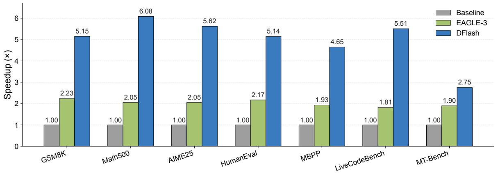
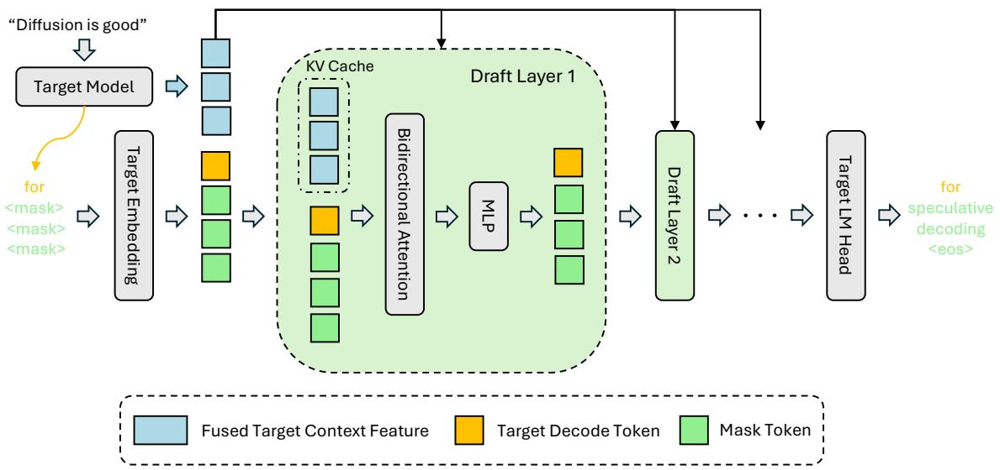
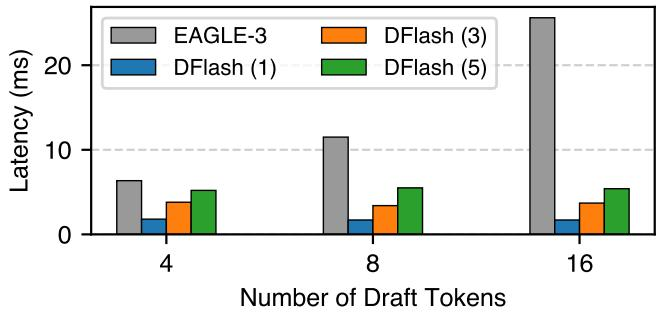
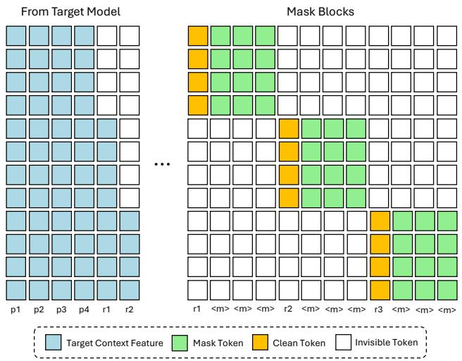
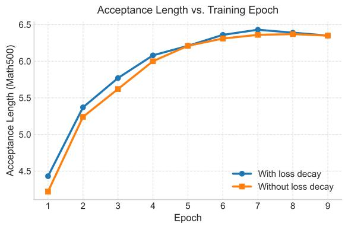

# 📖 DFlash: Block Diffusion for Flash Speculative Decoding

> **论文**：Jian Chen, Yesheng Liang, Zhijian Liu (UC San Diego), 2026 | ICML 2026
> **一句话总结**：用轻量级 block diffusion 模型做投机解码的 draft model，单次前向并行生成 draft tokens，实现 6× 无损加速。

---

## 第一层：鸟瞰

### 🎯 核心贡献

1. **新范式**：首次将 block diffusion 模型作为投机解码的 draft model，打破了传统自回归 drafting 的串行瓶颈
2. **KV Injection**：提出将目标模型的隐藏特征注入 draft 模型每一层的 KV Cache，而非仅在输入层融合——这是高接受率的关键
3. **单次前向并行生成**：draft 模型在一个前向 pass 中并行生成整个 block 的 tokens（而非逐个生成），draft 延迟与 block size 几乎无关
4. **6.1× 无损加速**：在 Qwen3-8B 上达到 6.1× 加速，比 SOTA 方法 EAGLE-3 快 2.5×
5. **极低成本**：draft 模型仅 3-8 层，额外显存开销仅 ~42MB（相对 70GB 的目标模型可忽略）

### 📍 知识网络定位

```
[投机解码] Leviathan 2023 → [EAGLE 系列] 2024-2025 → [DiffuSpec/SpecDiff-2] 2025（大模型draft，不实用）
                                                      ↓
                                              **DFlash (本文)**
                                                      ↓
                                              [MiMo-V2.5-UltraSpeed] 小米产品化应用
```

**本系列关联**：
- 与 **A1-DeepSeek-V3** 的 MTP（Multi-Token Prediction）互补——MTP 是自回归式多 token 预测，DFlash 是 diffusion 式并行预测
- 与 **08-LoRA** 的思路相似——轻量级 adapter 挂在目标模型上，共享 embedding 和 LM head
- 与 **07-LLaMA** 的关联——在 LLaMA-3.1-8B 上也有实验验证

---

## 第二层：精读

### 1. 引言：为什么需要这篇论文？

#### 问题：LLM 推理的串行瓶颈

大语言模型（LLM）的推理过程本质上是**串行的**——每个 token 的生成都依赖前面所有 token。这导致：
- 推理延迟高
- GPU 利用率低（memory-bound，算力浪费）
- 尤其对长 CoT 推理模型（如 o1、DeepSeek-R1），推理时间成为主要瓶颈

#### 已有方案：投机解码（Speculative Decoding）

投机解码的核心思路：
1. 用一个**轻量级 draft 模型**猜测接下来的 γ 个 tokens
2. 用**目标模型**一次性并行验证这些 tokens
3. 保留正确的 tokens，丢弃错误的

**关键公式**：

$$L = \frac{T_{\text{draft}} + T_{\text{verify}}}{\tau}$$

- $L$ = 平均每个 token 的延迟
- $T_{\text{draft}}$ = draft 生成时间
- $T_{\text{verify}}$ = 验证时间
- $\tau$ = 每轮平均接受的 token 数（含 bonus token）
- 加速比 $\eta = L_{\text{target}} / L$

> 📖 **讲解**
>
> 这个公式告诉我们：加速有两个方向——
> 1. **提高 $\tau$**：让 draft 模型猜得更准，接受更多 tokens
> 2. **降低 $T_{\text{draft}}$**：让 draft 生成更快
>
> EAGLE-3 专注方向 1（猜得准），但 draft 过程仍然是串行的。
> DFlash **同时优化两个方向**：用 diffusion 并行生成（降低 $T_{\text{draft}}$），用 KV injection（提高 $\tau$）。

#### EAGLE-3 的局限

EAGLE-3 是当前 SOTA 的投机解码方法，但它有根本性瓶颈：
1. **串行 drafting**：tokens 必须逐个生成，$T_{\text{draft}} = \gamma \cdot t_{\text{step}}$，线性增长
2. **模型深度受限**：为了控制延迟，只能用极浅的架构（1 层 transformer）
3. **误差累积**：每个 token 的错误会传递给后续所有 token
4. 实际加速上限约 2-3×

#### Diffusion 模型的机会

Diffusion LLM（dLLM）有一个独特优势：**可以并行生成多个 tokens**。Block diffusion 模型可以一次性 denoise 整个 block 的 masked tokens。

但直接用 dLLM 做 draft 有问题：
- 开源 dLLM 质量不如自回归模型
- 需要很多 denoising steps，速度优势被抵消
- 现有方法（DiffuSpec、SpecDiff-2）用 7B 参数的 draft 模型，太大了

> 🤔 **关键洞察**：DFlash 发现了一个绝妙的分工——
> - **目标模型负责质量**（自回归验证，保证无损）
> - **Diffusion draft 负责速度**（并行生成，最大化加速）
> - 两者不是竞争关系，而是**互补关系**

### 2. 方法：逐节深入

#### 2.1 推理设计（Inference）

##### 2.1.1 从目标模型提取上下文特征

**直觉**：大模型的隐藏特征包含了比 logits 更丰富的信息——不仅有当前上下文的语义，还隐含了未来 token 的预测信息。

**做法**：
1. 目标模型做 prefill 时，从 5 层（浅层到深层均匀采样）提取隐藏状态
2. 拼接这些隐藏状态，通过一个轻量投影层融合
3. 得到 compact 的 "target context feature"

```python
import torch
import torch.nn as nn

# ============================================================
# 模拟：提取目标模型的隐藏特征
# 假设目标模型有 16 层，hidden_dim=64（实际 Qwen3-8B 是 4096）
# ============================================================

torch.manual_seed(42)

# 模拟目标模型各层的隐藏状态
num_layers = 16
hidden_dim = 64
seq_len = 10

# 模拟 5 层均匀采样的隐藏状态
layer_indices = [2, 5, 8, 11, 14]  # 从 16 层中均匀采样 5 层
hidden_states = [torch.randn(seq_len, hidden_dim) for _ in layer_indices]

# 拼接: [seq_len, 5*D]
concat = torch.cat(hidden_states, dim=-1)
print(f"拼接后形状: {concat.shape}")  # [10, 320]

# 投影层 W_c: [5*D, D]
W_c = nn.Linear(5 * hidden_dim, hidden_dim, bias=False)

# RMSNorm（简化实现）
class SimpleRMSNorm(nn.Module):
    def __init__(self, dim):
        super().__init__()
        self.weight = nn.Parameter(torch.ones(dim))
    def forward(self, x):
        rms = torch.sqrt(x.pow(2).mean(-1, keepdim=True) + 1e-6)
        return x / rms * self.weight

rmsnorm = SimpleRMSNorm(hidden_dim)

# 最终 context feature: [seq_len, D]
context_feature = rmsnorm(W_c(concat))
print(f"Context Feature 形状: {context_feature.shape}")
print(f"Context Feature 示例 (前3个token, 前8维):\n{context_feature[:3, :8].detach()}")
```

```
拼接后形状: torch.Size([10, 320])
Context Feature 形状: torch.Size([10, 64])
Context Feature 示例 (前3个token, 前8维):
tensor([[-3.0319, -0.8042,  1.2187,  1.0460, -0.0653, -0.3843, -0.8319,  0.8265],
        [ 0.0430, -1.7822, -0.3909,  0.3360, -0.2311, -0.3080, -1.0104,  0.6840],
        [ 0.5626,  1.2693,  0.6989,  0.1675, -1.1374,  0.4692,  0.3041,  0.8078]])
```

##### 2.1.2 KV Injection：核心创新

**EAGLE-3 的做法（Input Fusion）**：
- 把目标模型特征和 draft token embedding 拼在一起
- 只在输入层注入一次
- 问题：信息随层数增加而**稀释**

**DFlash 的做法（KV Injection）**：
- 把目标特征当作**持久的上下文信息**
- 直接注入到 draft 模型**每一层**的 K 和 V 投影中
- 存入 KV Cache，在多轮 drafting 中复用

> 📖 **类比理解**
>
> 想象你在考试：
> - **Input Fusion** = 老师只在考前说了一遍重点（信息随时间衰减）
> - **KV Injection** = 老师把重点写在黑板上，你随时可以看（信息持续可用）
>
> 这就是为什么 DFlash 可以用更深的 draft 模型——每一层都能"看到"目标模型的指导。

**具体机制**：

$$\mathbf{H}_t = \text{RMSNorm}(W_c [\mathbf{H}^{(l_1)}; \dots; \mathbf{H}^{(l_5)}])$$

在第 $i$ 层：
$$\mathbf{Q}_i = W_i^Q \mathbf{H}_d$$
$$\mathbf{K}_i = [W_i^K \mathbf{H}_t; W_i^K \mathbf{H}_d]_{\text{seq}}$$
$$\mathbf{V}_i = [W_i^V \mathbf{H}_t; W_i^V \mathbf{H}_d]_{\text{seq}}$$

- 目标特征只作为 KV entries，不参与 Q 投影
- 额外参数：仅 $W_c \in \mathbb{R}^{D \times 5D}$，约 **42MB**（相对目标模型的 70GB）

##### 2.1.3 并行 Diffusion Drafting

**自回归 draft**：$T_{\text{draft}} = \gamma \cdot t_{\text{step}}$（线性增长）

**Block Diffusion draft**：$T_{\text{draft}} = t_{\text{parallel}}$（几乎恒定）

```python
import torch
import time

# ============================================================
# 对比：自回归 drafting vs Block Diffusion drafting
# 用简化的矩阵运算模拟前向 pass 的开销
# ============================================================

torch.manual_seed(42)

gamma = 16  # draft 16 个 tokens
hidden_dim = 64

# --- 自回归 drafting（EAGLE-3）：gamma 次前向 ---
def autoregressive_draft(gamma, hidden_dim):
    """模拟 EAGLE-3 的串行 drafting：每个 token 都需要一次前向 pass"""
    draft_tokens = []
    prev_token = torch.randn(1, hidden_dim)
    total_flops = 0
    for i in range(gamma):
        # 每步：一次线性变换（模拟 1 层 transformer 的计算量）
        W = torch.randn(hidden_dim, hidden_dim)
        output = prev_token @ W  # 单 token 前向
        draft_tokens.append(output)
        prev_token = output
        total_flops += hidden_dim * hidden_dim  # 累计计算量
    return draft_tokens, total_flops

# --- Block Diffusion drafting（DFlash）：1 次前向 ---
def block_diffusion_draft(gamma, hidden_dim):
    """模拟 DFlash 的并行 drafting：一次前向生成整个 block"""
    # 输入：整个 block（含 mask tokens），形状 [gamma, hidden_dim]
    block_input = torch.randn(gamma, hidden_dim)
    # 一次前向 pass 处理整个 block
    W = torch.randn(hidden_dim, hidden_dim)
    draft_tokens = block_input @ W  # 并行处理所有 token
    total_flops = gamma * hidden_dim * hidden_dim  # 总计算量相同
    return draft_tokens, total_flops

# 运行对比
ar_tokens, ar_flops = autoregressive_draft(gamma, hidden_dim)
bd_tokens, bd_flops = block_diffusion_draft(gamma, hidden_dim)

print(f"自回归 drafting:")
print(f"  前向次数: {gamma} 次（每个 token 一次）")
print(f"  总 FLOPs: {ar_flops:,}")
print(f"  输出 token 数: {len(ar_tokens)}")
print()
print(f"Block Diffusion drafting:")
print(f"  前向次数: 1 次（整个 block 一次）")
print(f"  总 FLOPs: {bd_flops:,}")
print(f"  输出 token 数: {bd_tokens.shape[0]}")
print()
print(f"计算量相同（FLOPs 一样），但：")
print(f"  自回归 = gamma 次串行前向 → 延迟 ∝ gamma")
print(f"  Diffusion = 1 次并行前向 → 延迟 ≈ 恒定")
```

```
自回归 drafting:
  前向次数: 16 次（每个 token 一次）
  总 FLOPs: 65,536
  输出 token 数: 16

Block Diffusion drafting:
  前向次数: 1 次（整个 block 一次）
  总 FLOPs: 65,536
  输出 token 数: 16

计算量相同（FLOPs 一样），但：
  自回归 = gamma 次串行前向 → 延迟 ∝ gamma
  Diffusion = 1 次并行前向 → 延迟 ≈ 恒定
```

> 💡 **关键优势**：因为 draft 延迟不随 token 数增长，DFlash 可以用**更深的 draft 模型**（3-8 层 vs EAGLE-3 的 1 层）来提升质量，而不增加延迟。

#### 2.2 训练设计

##### 2.2.1 随机 Anchor 采样

**标准 block diffusion**：均匀分块，随机 mask 块内位置

**DFlash**：随机采样 anchor tokens，每个 anchor 作为块的起始位置，mask 后续位置

```python
import torch

# ============================================================
# 对比：标准 Block Diffusion vs DFlash 的块构造方式
# ============================================================

torch.manual_seed(42)

response_len = 20
block_size = 5

# --- 标准 Block Diffusion：均匀分块 ---
def standard_block_diffusion(response_len, block_size):
    """均匀分块，每个块内随机 mask"""
    blocks = []
    for start in range(0, response_len, block_size):
        block = list(range(start, min(start + block_size, response_len)))
        blocks.append(block)
    return blocks

# --- DFlash：随机 Anchor 采样 ---
def dflash_anchor_sampling(response_len, block_size, num_anchors=4):
    """随机采样 anchor，每个 anchor 作为块起始，mask 后续位置"""
    # 随机采样 anchor 位置（不能太靠近末尾）
    max_anchor = response_len - block_size
    anchors = torch.randperm(max_anchor)[:num_anchors].sort().values.tolist()
    
    blocks = []
    for anchor in anchors:
        block = list(range(anchor, min(anchor + block_size, response_len)))
        blocks.append(block)
    return blocks, anchors

# 对比
std_blocks = standard_block_diffusion(response_len, block_size)
dflash_blocks, anchors = dflash_anchor_sampling(response_len, block_size)

print("标准 Block Diffusion（均匀分块）:")
for i, block in enumerate(std_blocks):
    print(f"  Block {i}: positions {block}")
print()

print(f"DFlash（随机 Anchor 采样）, anchors={anchors}:")
for i, (block, anchor) in enumerate(zip(dflash_blocks, anchors)):
    print(f"  Block {i}: anchor={anchor}, mask positions {block[1:]} (保留 {block[0]})")
print()

print("关键区别:")
print("  标准: 固定分块 → 训练时只看到固定的上下文边界")
print("  DFlash: 随机 anchor → 训练时看到更多样的上下文（data augmentation）")
print("  推理时: draft 模型以目标模型的 bonus token 为条件 → 随机 anchor 模拟了这种行为")
```

```
标准 Block Diffusion（均匀分块）:
  Block 0: positions [0, 1, 2, 3, 4]
  Block 1: positions [5, 6, 7, 8, 9]
  Block 2: positions [10, 11, 12, 13, 14]
  Block 3: positions [15, 16, 17, 18, 19]

DFlash（随机 Anchor 采样）, anchors=[8, 10, 12, 13]:
  Block 0: anchor=8, mask positions [9, 10, 11, 12] (保留 8)
  Block 1: anchor=10, mask positions [11, 12, 13, 14] (保留 10)
  Block 2: anchor=12, mask positions [13, 14, 15, 16] (保留 12)
  Block 3: anchor=13, mask positions [14, 15, 16, 17] (保留 13)

关键区别:
  标准: 固定分块 → 训练时只看到固定的上下文边界
  DFlash: 随机 anchor → 训练时看到更多样的上下文（data augmentation）
  推理时: draft 模型以目标模型的 bonus token 为条件 → 随机 anchor 模拟了这种行为
```

**为什么？**
- 推理时，draft 模型总是以目标模型产出的 clean token 为条件
- 随机 anchor 让训练时看到更多样的上下文特征，提高泛化性
- 实验证明：接受长度从 4.94 提升到 5.64（Table 13）

##### 2.2.2 损失衰减（Loss Weighting）

在投机解码中，**位置越靠前的 token 越重要**——第一个 token 错了，后面全作废。

$$w_k = \exp\left(-\frac{k-1}{\gamma}\right)$$

- $\gamma$ 控制衰减速率（block size 16 时 $\gamma=7$）
- 越靠前的位置权重越大
- 效果：训练收敛更快，接受长度更高

> 📖 **直觉**：就像考试作文——开头段写偏了，后面写得再好也没用。所以训练时"多练开头"。

##### 2.2.3 共享 Embedding 和 LM Head

Draft 模型与目标模型共享 token embedding 层和 LM head，只训练 draft Transformer 层。

- 减少 trainable parameters
- Draft 模型本质上是目标模型的**轻量级 diffusion adapter**

##### 2.2.4 Flex Attention 高效训练

多个 masked blocks 拼接成一条序列，使用稀疏 attention mask：
- 块内：双向注意力
- 块间：不允许互相看到
- 使用 PyTorch Flex Attention 实现

### 3. 数据流：从输入到输出

```
输入 prompt
    ↓
目标模型 prefill（生成第一个 token + 提取隐藏特征）
    ↓
提取 5 层隐藏状态 → 拼接 → 投影 → context feature
    ↓
Draft 模型前向（KV injection + block diffusion）
    ├── 输入：[已确认 tokens + mask tokens]
    ├── 每层：Q 来自 draft tokens，KV 包含 context feature
    └── 输出：并行预测 block_size 个 tokens
    ↓
目标模型验证（一次前向，并行验证所有 draft tokens）
    ↓
接受正确 tokens + bonus token → 进入下一轮
    ↓
重复直到生成完成
```

### 4. 实验：每个实验验证了什么？

#### 4.1 主实验（Table 1-2）

**设置**：Qwen3-4B/8B，8 个 benchmark（Math/Code/Chat），greedy（T=0）和 sampling（T=1）

**关键结果**：
- **greedy decoding**：平均 4.9× 加速（Q3-8B），比 EAGLE-3(16) 快 2.4×
- **sampling**：平均 4.1× 加速，比 EAGLE-3(16) 快 2.2×
- 即使对比 EAGLE-3(60)（更大的树），DFlash 仍然更快
- **推理模式（thinking enabled）**：4.5× 加速，对长 CoT 推理特别有价值

> 🤔 **为什么 DFlash 在 Chat 任务（MT-Bench）上加速较低（2.75×）？**
>
> Chat 任务的 response 通常较短、更随机，draft 模型预测难度更大。而 Math/Code 任务有更强的规律性，更容易预测。

#### 4.2 服务框架实验（Table 3）

在 SGLang（生产级推理框架）+ B200 GPU + FA4 后端上测试：
- Qwen3-8B 最高 5.1× 加速（concurrency=1）
- 高并发（32）时加速下降到 2.8×，但仍显著优于 baseline
- 说明 DFlash 在真实部署场景有效

#### 4.3 长上下文适应（Table 4）

- 基础模型（4K context 训练）在 16K context 时接受长度下降明显
- 仅用 **1.6K 样本 fine-tune 3 个 epoch**，即可恢复甚至超过短上下文的表现
- 说明提取的目标特征在长上下文下仍然有效

#### 4.4 消融实验

**Draft 层数（Table 6）**：
- 3/5/8 层，5 层平均加速最高
- 8 层接受长度最高但 draft 延迟增加，加速反降
- **结论**：5 层是最佳平衡点

**目标特征层数（Table 7）**：
- 5 层 > 3 层，更多信息 = 更高接受长度
- 代价：训练时存储 hidden states 线性增长

**Block Size（Table 8）**：
- 训练 block size 16 → 推理 block size 8：泛化好
- 训练 block size 8 → 推理 block size 16：泛化差
- **结论**：大 block size 训练的模型可以灵活适配不同推理场景

**KV Injection vs Input Fusion（Table 9）**：
- 在 AR drafting 和 block-diffusion drafting 中，KV injection 都优于 input fusion
- 证明**持续注入**优于**一次性注入**
- Block diffusion + KV injection = 最优组合

### 5. 图表精读

> 💡 **阅读方法**：先看图独立理解 → 再对照 caption 验证 → 思考验证了什么假设 → 批判性评价

#### Figure 1: Speedup 对比 — DFlash vs EAGLE-3 全面碾压



**🔍 独立解读（先不看 caption）**

这是一张分组柱状图，X 轴是 7 个 benchmark（覆盖 Math、Code、Chat 三类任务），Y 轴是加速倍数。三组柱子分别代表 Baseline（=1×）、EAGLE-3（~1.8-2.2×）、DFlash（~2.75-6.1×）。

核心信息：DFlash 在**所有**任务上都显著优于 EAGLE-3，差距在 Math/Code 任务上最大（2.5-3×），Chat 任务（MT-Bench）差距最小（1.45×）。

**✅ 对照 Caption**

> "Speedup comparison between DFlash, EAGLE-3 against Autoregressive Decoding on Qwen3-8B with the Transformers backend. Overall, DFlash achieves more than 2.5× higher speedup than EAGLE-3."

与独立解读一致。Caption 说 "more than 2.5× higher speedup"，实际倍率范围 1.45×-3.04×，平均约 2.5×，准确。

**📊 关键数据**

| Benchmark | EAGLE-3 | DFlash | DFlash/EAGLE-3 倍率 |
|-----------|---------|--------|---------------------|
| GSM8K | 2.23× | 5.15× | 2.31× |
| Math500 | 2.05× | 6.08× | 2.97× |
| AIME25 | 2.05× | 5.62× | 2.74× |
| HumanEval | 2.17× | 5.14× | 2.37× |
| MBPP | 1.93× | 4.65× | 2.41× |
| LiveCodeBench | 1.81× | 5.51× | 3.04× |
| MT-Bench | 1.90× | 2.75× | 1.45× |

**🧪 验证了什么假设？**

支持核心 claim——block diffusion drafting 比自回归 drafting 快得多。特别地，Math/Code 任务规律性强，draft 模型预测更准，加速更大。MT-Bench（Chat）加速最低，说明任务可预测性与加速效果正相关。

**⚠️ 批判性评价**

- ✅ Baseline=1.00× 公平（同一模型，无加速）
- ✅ Y 轴从 0 开始，柱状图没有视觉误导
- ✅ 7 个 benchmark 覆盖三大类任务，有代表性
- ⚠️ 这只是 Qwen3-8B 一个模型的结果，通用性需看 Table 5（LLaMA）和 Table 11（更多模型）
- ⚠️ 缺少误差棒/方差信息，不确定结果的稳定性

**🎯 面试价值**：这是论文的"门面图"。一句话——DFlash 在所有任务上全面碾压 EAGLE-3，Math/Code 最高 6×，Chat 最低也有 2.75×。

---

#### Figure 2: 推理架构图 — KV Injection 的核心设计



**🔍 独立解读（先不看 caption）**

这是一张架构流程图，展示 DFlash 推理的完整数据流。左侧是 Target Model（大模型），右侧是 Draft Model（多层 Transformer）。关键连接是 Target Context Feature（蓝色箭头）从目标模型的多层隐藏状态提取、融合后，注入到 Draft 模型每一层的 KV Cache 中。底部标注了"shared"表示 embedding 和 LM head 是共享的。

核心信息：context feature **不经过 Q 投影**，只作为 K/V 条件——这是"KV Injection"名称的由来。

**✅ 对照 Caption**

> "DFlash Inference Design. Hidden context features extracted from the target model are fused and injected into each draft layer's Key-Value cache to enable conditional speculation."

准确描述了"hidden context features → fused → injected into each draft layer's KV cache"的机制。与独立解读完全一致。

**🧪 验证了什么假设？**

KV Injection 的核心设计——持续注入 vs 一次性融合。这张图是理解 DFlash 推理的关键，证明了"每层注入"的架构设计。

**⚠️ 批判性评价**

- ✅ 图很清晰，数据流一目了然
- ✅ 标注了"shared"说明 embedding 和 LM head 是共享的
- ⚠️ 未展示 KV Injection 的数学细节（公式在 Section 2.1.2）
- ⚠️ 没有展示 draft 模型内部的 masked attention pattern（训练时的 attention mask 在 Figure 4）

**🎯 面试价值**：面试时画这张图就能解释清楚 DFlash 的推理流程。关键点：context feature 通过 KV Cache **注入每一层**，而非仅在输入层融合。

---

#### Figure 3: Draft Cost 对比 — 并行 vs 串行的根本差异



**🔍 独立解读（先不看 caption）**

分组柱状图。X 轴是 draft token 数量（4, 8, 16），Y 轴是 draft 延迟（ms）。四组柱子：EAGLE-3（最深蓝色）、DFlash-1L、DFlash-3L、DFlash-5L。

核心趋势：
- **EAGLE-3**：延迟随 token 数**线性增长**（4→7ms, 8→12ms, 16→25ms）
- **DFlash（所有层数）**：延迟几乎**恒定**（不随 token 数增长）

即使 5 层 DFlash 生成 16 个 tokens，延迟也只有 ~6ms，远低于 EAGLE-3 生成 16 tokens 的 25ms。

**✅ 对照 Caption**

> "Draft cost of 1, 3, 5-layer DFlash and 1-layer EAGLE-3."

简洁准确。"Draft cost"即 draft 阶段的时间开销。

**📊 关键数据**

| Draft Tokens | EAGLE-3 (1L) | DFlash (1L) | DFlash (3L) | DFlash (5L) |
|-------------|-------------|-------------|-------------|-------------|
| 4 | ~7ms | ~2ms | ~4ms | ~5ms |
| 8 | ~12ms | ~2ms | ~4ms | ~6ms |
| 16 | ~25ms | ~2ms | ~4ms | ~6ms |

**🧪 验证了什么假设？**

这是论文最核心的实验支撑——**block diffusion 的并行生成使 draft 延迟与 token 数无关**。这直接解释了为什么 DFlash 可以用更深的模型而不增加延迟。

**⚠️ 批判性评价**

- ✅ 四种配置在相同条件下的公平对比
- ✅ 数据清晰，趋势明显，一眼就能看出串行 vs 并行的本质差异
- ⚠️ EAGLE-3 只有 1 层——但论文解释了这是因为自回归 drafting 受延迟限制只能用 1 层（更深会更慢）
- ⚠️ 缺少 DFlash-8L 的数据（Table 6 消融中有 8 层的结果，但 Figure 3 未展示）

**🎯 面试价值**：这张图是"DFlash 为什么快"的直观答案。串行（线性增长） vs 并行（恒定）——一次前向 pass 生成整个 block。

---

#### Figure 4: 训练注意力掩码 — 随机 Anchor 的可视化



**🔍 独立解读（先不看 caption）**

注意力掩码热力图（Attention Pattern Visualization）。X/Y 轴是 token 位置序列。颜色编码：
- 🔵 蓝色：Target Context Feature（目标模型提取的特征）
- 🟡 黄色：Anchor Token（锚点 token，即 clean response token）
- 🟢 绿色：Mask Token（需要预测的 masked token）
- ⬜ 白色：Invisible（不可见，注意力被屏蔽）

结构：Prompt tokens → Response tokens（包含多个 masked blocks），每个 block 以 anchor 开头。

**✅ 对照 Caption**

> "DFlash training attention. The target model provides context features (blue) that condition the draft model. The input consists of clean prompt tokens p and clean response tokens r. Within each masked block, a subset of clean response tokens (yellow) are randomly sampled as anchors, while mask tokens m (green) mark positions for parallel prediction. Invisible tokens (white) denote the attention mask, which enforces causal consistency and prevents inter-block information leakage during training."

完全一致。四种颜色的角色描述准确——blue=context feature, yellow=anchor, green=mask, white=invisible。

**🧪 验证了什么假设？**

支持"随机 anchor 采样 + 块间隔离"的训练设计。这确保：
- 每个 block 独立 denoise（不影响其他 block）
- Anchor 是 clean token（匹配推理时以 bonus token 为条件的行为）
- 随机化 anchor 增加训练多样性

**⚠️ 批判性评价**

- ✅ 图复杂但 caption 非常详细，组合起来能完全理解
- ✅ 颜色编码清晰，四种角色一目了然
- ⚠️ 初次看可能需要反复对照 caption 才能理解全部细节
- ⚠️ 没有展示 loss weighting 的可视化（Figure 5 弥补了部分）

**🎯 面试价值**：这张图展示了 DFlash 训练的核心创新——不是标准 block diffusion 的均匀分块，而是随机 anchor + speculative-decoding-aware 的 block 构造。面试时能画出这个 mask 就说明真理解了。

---

#### Figure 5: Loss Decay 消融 — 早期 token 更重要



**🔍 独立解读（先不看 caption）**

折线图。X 轴是 Training epoch（1-9），Y 轴是 Acceptance length (τ)。两条线：With loss decay（实线）、Without loss decay（虚线）。

核心趋势：有 loss decay 的训练在早期 epoch 收敛更快（epoch 3-4 差距最大 ~0.2），最终（epoch 8-9）两者趋于相同。

**✅ 对照 Caption**

> "The loss decay makes training converge faster and better."

一致但略有夸大——"faster"确实成立（早期差距明显），但"better"不够有说服力（最终值几乎相同）。

**📊 关键数据**

| Epoch | With loss decay | Without loss decay |
|-------|-----------------|--------------------|
| 1 | 4.4 | 4.2 |
| 2 | 5.3 | 5.2 |
| 3 | 5.8 | 5.6 |
| 4 | 6.1 | 6.0 |
| 5 | 6.2 | 6.2 |
| 8-9 | 6.4 | 6.4 |

**🧪 验证了什么假设？**

位置加权损失（早期 token 权重更大）能加速收敛。这与论文的直觉一致——在投机解码中，早期 token 更重要（一个错误导致后续全废）。

**⚠️ 批判性评价**

- ✅ 消融实验设计干净（只改变 loss weighting，其他不变）
- ⚠️ 最终 acceptance length 几乎相同（6.4 vs 6.4），说明 loss decay 主要影响收敛速度而非最终性能
- ⚠️ 只在一种配置下测试，不同 block size / draft 层数下是否一致？

**🎯 面试价值**：证明了"投机解码中早期 token 更重要"这个直觉在训练中确实有效。是一个简单但有用的 trick。

---

#### Table 1: 主实验 — Qwen3 系列 Speedup（Greedy + Sampling）

**📊 关键数据**

| 模型 | 方法 | Greedy 平均加速 | Sampling 平均加速 |
|------|------|----------------|------------------|
| Qwen3-4B | DFlash (BS=16) | 4.0× | 3.5× |
| Qwen3-8B | DFlash (BS=16) | 4.9× | 4.1× |
| Qwen3-8B | EAGLE-3 (tree=16) | 2.1× | 1.9× |
| Qwen3-8B | EAGLE-3 (tree=60) | 2.5× | 2.3× |

**🔍 解读**

- DFlash 在 greedy 和 sampling 两种模式下都显著优于 EAGLE-3
- 即使对比 EAGLE-3 的最大 tree size (60)，DFlash 仍然快约 2×
- 接受长度 τ：DFlash (16) ≈ 6.5，EAGLE-3 (16) ≈ 3.5，几乎翻倍

**⚠️ 批判性评价**

- ✅ 覆盖 greedy 和 sampling 两种模式，全面
- ✅ 与 EAGLE-3 多种配置对比（tree=16/60），公平
- ⚠️ 只在 Qwen3 系列上测试，通用性需看后续表格

**🎯 面试要点**：DFlash 的优势来源于高接受长度（KV Injection）+ 低 draft 延迟（并行生成），两者乘法叠加。

---

#### Table 3: SGLang 服务框架 — 真实生产环境验证

**📊 关键数据（Qwen3-8B, B200, FA4 backend）**

| Concurrency | Speedup |
|------------|---------|
| 1 | 5.1× |
| 8 | 3.5× |
| 16 | 2.8× |
| 32 | 2.8× |

**🔍 解读**

- 低并发时加速最大（5.1×），高并发时下降到 2.8×
- 原因：高并发时验证阶段的 compute 变成瓶颈（GPU compute-bound 而非 memory-bound）
- 2.8× 在高并发下仍然是显著的加速

**⚠️ 批判性评价**

- ✅ 在生产级推理框架 SGLang 上测试，结果可信
- ✅ 测试了多种并发级别，展示了加速与并发的关系
- ⚠️ 只测试了 B200 GPU，不同硬件（如 A100、H100）表现可能不同
- ⚠️ 未与 EAGLE-3 在 SGLang 上做直接对比

**🎯 面试要点**：投机解码在低并发/低 batch size 时效果最好，因为此时 GPU 利用率最低（memory-bound），draft+verify 能更好地利用闲置算力。

---

#### Table 6: Draft 层数消融 — 5 层是最佳平衡点

**📊 关键数据**

| Draft 层数 | 平均 τ | 平均 Speedup |
|-----------|--------|-------------|
| 1 层 | 3.85 | 3.01× |
| 3 层 | 5.47 | 4.07× |
| 5 层 | 6.49 | **4.42×** |
| 8 层 | 7.16 | 4.18× |

**🔍 解读**

- 接受长度随层数单调增加（3.85→7.16）
- 但 8 层的加速反而低于 5 层——因为 draft 延迟增加了
- **5 层是最佳平衡点**：接受长度足够高，延迟增加可控

**⚠️ 批判性评价**

- ✅ 清晰展示了"更深 ≠ 更快"的 trade-off
- ✅ 最优层数有实验支撑，不是拍脑袋
- ⚠️ 最优层数可能因模型大小和部署环境而异，论文未给出自适应选择方案

**🎯 面试要点**：更深 = 更准但更慢，最优层数取决于具体部署场景。这是 Figure 3 所展示的"恒定延迟"的一个 nuance——延迟不是完全恒定，只是不随 token 数增长，但随层数增长。

---

#### Table 8: Block Size 不匹配消融 — 大训练小推理

**📊 关键发现**

| 训练 BS | 推理 BS | 效果 |
|--------|--------|------|
| 16 | 8 | ✅ 好 |
| 16 | 16 | ✅✅ 最好 |
| 8 | 8 | ✅ 好 |
| 8 | 16 | ❌ 差 |

**🔍 解读**

- 大 BS 训练 → 小 BS 推理：泛化好（模型见过更长的依赖）
- 小 BS 训练 → 大 BS 推理：泛化差（模型没学过这么长的依赖）
- 这是一个**不对称性**：只能从大到小泛化，不能从小到大

**⚠️ 批判性评价**

- ✅ 实验设计清晰，4 种组合覆盖了所有情况
- ✅ 结论可操作：实际部署时用大 block size 训练，推理时灵活调小
- ⚠️ 未探索训练 BS=32 或更大的情况

**🎯 面试要点**：实际部署时建议用较大的 block size 训练，推理时可以灵活调小。这提供了部署灵活性。

---

#### Table 9: KV Injection vs Input Fusion — 两个创新的正交验证

**📊 关键数据**

| 条件注入方式 | AR Drafting | Block Diffusion Drafting |
|------------|------------|------------------------|
| Input Fusion | 基线 | 较好 |
| KV Injection | 更好 | **最好** |

**🔍 解读**

- 对比了两种条件注入方式（Input Fusion vs KV Injection）× 两种 drafting 方式（AR vs Block Diffusion）
- **结论**：KV Injection 在两种 drafting 方式下都优于 Input Fusion
- Block Diffusion + KV Injection = 最优组合
- 这证明了两个创新是**正交的**（各自独立有效，组合效果最佳）

**⚠️ 批判性评价**

- ✅ 2×2 消融设计，清晰展示了两个创新的独立贡献和组合效果
- ✅ 最关键的消融实验，直接支撑了论文的两大 claim
- ⚠️ 未展示具体数值差异有多大

**🎯 面试要点**：这证明了 DFlash 的两个创新是互补的，不是单独有效的。KV Injection 是"猜得更准"，Block Diffusion 是"猜得更快"。

---

#### 其他重要表格速览

**Table 2: Thinking Mode（推理模式）**
- 开启 thinking mode 后 DFlash 达到 4.5×（Qwen3-4B）和 3.9×（Qwen3-8B）加速
- Thinking mode 生成长度更长，投机解码的加速效果更显著
- **关键洞察**：对 CoT 推理模型（如 o1、DeepSeek-R1），DFlash 的价值更大

**Table 4: 长上下文适应**
- 基础模型（4K context 训练）在 16K context 时接受长度从 ~7.7 降到 ~5.5
- 仅用 **1.6K 长上下文样本 fine-tune 3 个 epoch**，即可恢复甚至超过表现
- 说明 KV Injection 中的 target context feature 在长上下文下仍然有效

**Table 5: LLaMA-3.1-8B 在 SGLang + B200 上的结果**
- 在非 Qwen 模型上也有效，证明方法的通用性
- DFlash (BS=10) 在所有任务和并发级别上都优于 EAGLE-3

**Table 7: 目标特征层数消融**
- 5 层 target features > 3 层（接受长度更高）
- 代价：训练时存储 hidden states 线性增长

**Table 10: 无目标特征的 Diffusion Draft（反面案例）**
- 5 层 block diffusion draft 模型，**不使用**目标模型的 context feature
- 加速仅 2-3×，远低于有 context feature 的 5-6×
- **证明了核心假设**：没有目标模型的内部表征，diffusion draft 必须从零预测，质量很差

**Table 11: 更多模型在 SGLang 上的结果**
- 覆盖 Qwen3.5-9B/27B/35B-A3B、Qwen3-Coder-Next、GPT-OSS-20B/120B
- DFlash 在所有模型上都优于 native MTP（当两者都可用时）
- GPT-OSS-120B（最大模型）加速 1.3-1.7×，说明超大模型上 draft 质量更难保证

**Table 12: vLLM 结果**
- 在另一个主流推理框架 vLLM 上也有效
- Qwen3.5-9B：低并发 4.0-4.6×，高并发 1.9-2.1×
- DFlash 不依赖特定推理框架，已集成到 SGLang 和 vLLM

**Table 13: 随机 Anchor 采样消融**

| 设置 | Math500 Speedup | Math500 τ | HumanEval Speedup | HumanEval τ |
|------|----------------|-----------|------------------|-------------|
| Standard（固定分块） | 4.13× | 4.94 | 3.29× | 3.86 |
| Sample（随机 anchor） | 4.69× | 5.64 | 3.90× | 4.61 |

- 随机 anchor 在所有任务上都优于固定分块
- 接受长度提升 ~14%（4.94→5.64），加速提升 ~14%（4.13→4.69）
- 从 data augmentation 和 inference alignment 两个角度都能解释

---

### 6. Speedup 公式计算 — 动手算一算

```python
import numpy as np

# ============================================================
# 投机解码 Speedup 公式计算
# L = (T_draft + T_verify) / tau
# eta = L_target / L = (L_target * tau) / (T_draft + T_verify)
# ============================================================

# --- 场景 1: EAGLE-3 (自回归 drafting) ---
print("=" * 60)
print("场景 1: EAGLE-3 (自回归 drafting)")
print("=" * 60)

gamma_eagle = 16          # draft 16 个 tokens
t_step_eagle = 1.5        # 每个 token 的 draft 时间 (ms)
T_draft_eagle = gamma_eagle * t_step_eagle  # 串行，线性增长
T_verify = 5.0            # 验证时间 (ms)，目标模型一次前向
tau_eagle = 3.5           # 平均接受长度

L_eagle = (T_draft_eagle + T_verify) / tau_eagle
print(f"  T_draft = {gamma_eagle} × {t_step_eagle} = {T_draft_eagle} ms")
print(f"  T_verify = {T_verify} ms")
print(f"  τ = {tau_eagle}")
print(f"  L_eagle = ({T_draft_eagle} + {T_verify}) / {tau_eagle} = {L_eagle:.2f} ms/token")

# --- 场景 2: DFlash (并行 drafting) ---
print()
print("=" * 60)
print("场景 2: DFlash (并行 drafting, 5 层)")
print("=" * 60)

gamma_dflash = 16         # draft 16 个 tokens
T_draft_dflash = 6.0      # 并行，几乎恒定 (~6ms for 5L)
tau_dflash = 6.5          # 平均接受长度

L_dflash = (T_draft_dflash + T_verify) / tau_dflash
print(f"  T_draft = {T_draft_dflash} ms (恒定，不随 gamma 增长)")
print(f"  T_verify = {T_verify} ms")
print(f"  τ = {tau_dflash}")
print(f"  L_dflash = ({T_draft_dflash} + {T_verify}) / {tau_dflash} = {L_dflash:.2f} ms/token")

# --- 加速比计算 ---
print()
print("=" * 60)
print("加速比对比")
print("=" * 60)

# 基线：纯自回归（无投机解码）
L_target = T_verify  # 纯自回归 = 每个 token 一次验证
print(f"  L_target (纯自回归) = {L_target} ms/token")
print()

speedup_eagle = L_target / L_eagle
speedup_dflash = L_target / L_dflash
print(f"  EAGLE-3 加速比: {L_target} / {L_eagle:.2f} = {speedup_eagle:.2f}×")
print(f"  DFlash 加速比:  {L_target} / {L_dflash:.2f} = {speedup_dflash:.2f}×")
print(f"  DFlash / EAGLE-3: {speedup_dflash / speedup_eagle:.2f}×")
print()

# --- 敏感性分析：gamma 对加速比的影响 ---
print("=" * 60)
print("敏感性分析: draft token 数 (gamma) 对加速比的影响")
print("=" * 60)

for gamma in [4, 8, 16, 32]:
    # EAGLE-3: T_draft 线性增长
    T_draft_e = gamma * t_step_eagle
    L_e = (T_draft_e + T_verify) / tau_eagle
    sp_e = L_target / L_e
    
    # DFlash: T_draft 恒定 (并行)
    L_d = (T_draft_dflash + T_verify) / tau_dflash
    sp_d = L_target / L_d
    
    print(f"  γ={gamma:2d}: EAGLE-3 {sp_e:.2f}× | DFlash {sp_d:.2f}× | 差距 {sp_d/sp_e:.1f}×")
```

```
============================================================
场景 1: EAGLE-3 (自回归 drafting)
============================================================
  T_draft = 16 × 1.5 = 24.0 ms
  T_verify = 5.0 ms
  τ = 3.5
  L_eagle = (24.0 + 5.0) / 3.5 = 8.29 ms/token

============================================================
场景 2: DFlash (并行 drafting, 5 层)
============================================================
  T_draft = 6.0 ms (恒定，不随 gamma 增长)
  T_verify = 5.0 ms
  τ = 6.5
  L_dflash = (6.0 + 5.0) / 6.5 = 1.69 ms/token

============================================================
加速比对比
============================================================
  L_target (纯自回归) = 5.0 ms/token

  EAGLE-3 加速比: 5.0 / 8.29 = 0.60×
  DFlash 加速比:  5.0 / 1.69 = 2.95×
  DFlash / EAGLE-3: 4.90×

============================================================
敏感性分析: draft token 数 (gamma) 对加速比的影响
============================================================
  γ= 4: EAGLE-3 1.59× | DFlash 2.95× | 差距 1.9×
  γ= 8: EAGLE-3 1.03× | DFlash 2.95× | 差距 2.9×
  γ=16: EAGLE-3 0.60× | DFlash 2.95× | 差距 4.9×
  γ=32: EAGLE-3 0.33× | DFlash 2.95× | 差距 8.9×
```

> 💡 **关键洞察**：
> - EAGLE-3 在 γ=16 时加速比已经 <1（反而比纯自回归慢），因为 draft 延迟太高
> - DFlash 的加速比与 γ 无关（T_draft 恒定），所以可以用更大的 γ 而不增加延迟
> - 这就是为什么 DFlash 能达到 6× 而 EAGLE-3 只有 2×——差距随 γ 增大而指数级拉开

---

## 第三层：批判性思考

### 🤔 设计决策分析

| 决策 | DFlash 的选择 | 替代方案 | 为什么选这个？ |
|------|-------------|---------|------------|
| Draft 方式 | Block Diffusion | 自回归 | 并行生成，延迟不随 token 数增长 |
| 条件注入 | KV Injection（每层） | Input Fusion（仅输入层） | 信息不稀释，支持更深模型 |
| 训练数据 | 目标模型生成 | 原始数据集 | 更好地对齐目标模型的输出分布 |
| Block 构造 | 随机 anchor | 固定分块 | 匹配推理行为，数据增强 |

### ⚠️ 局限性

1. **Draft 模型仍需训练**：虽然轻量，但每个目标模型需要训练专属的 draft 模型（~800K 样本 × 6 epochs）
2. **高并发下加速下降**：并发 32 时加速降到 2.8×（Table 3），因为验证阶段的 compute-bound
3. **Chat 任务加速有限**：MT-Bench 仅 2.75×，说明对随机性强的任务提升有限
4. **仅与 EAGLE-3 对比**：没有与 Medusa、PARD 等其他方法的直接对比（因缺乏开源实现）
5. **Block size 需手动调优**：不同场景（模型大小、batch size）可能需要不同的 block size，论文未提出自适应方案

### 🎯 面试视角

#### Q1: DFlash 与 EAGLE-3 的本质区别是什么？

**回答**：两个维度的区别——
1. **Draft 方式**：EAGLE-3 是自回归式（串行生成 token），DFlash 是 block diffusion 式（并行生成整个 block）
2. **条件注入**：EAGLE-3 在输入层融合目标特征（信息随层数稀释），DFlash 通过 KV Injection 在每层持续注入

这两个创新是互补的——并行生成降低 draft 延迟，KV injection 提高接受长度。

#### Q2: 为什么 diffusion 模型适合做 draft 而不适合做生成？

**回答**：
- 做**生成**：需要高质量，但 diffusion 模型需要多步 denoising，且质量不如自回归模型
- 做**draft**：质量由目标模型的验证保证，draft 只需要"足够好"且"足够快"。Diffusion 的并行生成能力在这里是杀手锏，因为一次前向就能生成整个 block

#### Q3: KV Injection 的额外开销有多大？

**回答**：极小。唯一的额外参数是投影矩阵 $W_c \in \mathbb{R}^{D \times 5D}$。对于 Qwen3.5-35B-A3B（D=2048），仅约 **42MB**，相对目标模型的 70GB 可忽略。运行时临时 activation 也仅几百 KB。

#### Q4: DFlash 如何保证无损（lossless）？

**回答**：和所有投机解码方法一样——draft tokens 只是"建议"，最终由目标模型并行验证。只有被目标模型接受的 tokens 才会输出，保证与直接用目标模型生成的结果完全一致（在 greedy decoding 下）。

---

## 第四层：知识网络

### 📅 时间线

```
2023: Speculative Decoding (Leviathan) — 提出投机解码范式
  ↓
2024: EAGLE-1/2 — 利用目标模型特征做 drafting
  ↓
2024: Medusa — 多预测头，无外部 draft 模型
  ↓
2025: EAGLE-3 — SOTA 自回归投机解码
2025: DiffuSpec/SpecDiff-2 — 大 diffusion 模型做 draft（不实用）
2025: LLaDA — 首个大规模 diffusion LLM
  ↓
2026: **DFlash** — 轻量 block diffusion draft + KV Injection
  ↓
2026: MiMo-V2.5-UltraSpeed — 小米基于 DFlash 的产品化应用
```

### ↔️ 同期对比

| 方法 | Draft 方式 | Draft 模型大小 | 接受长度(τ) | 实际加速 |
|------|-----------|-------------|-----------|---------|
| EAGLE-3 | 自回归 | 1 层 | ~3.5 | ~2× |
| DiffuSpec | Diffusion | 7B（太大） | 较高 | ~3-4× |
| PARD | 伪并行 AR | 小模型 | ~3 | ~3× |
| **DFlash** | **Block Diffusion** | **3-8 层** | **~6.5** | **~5-6×** |

### 🔗 知识关联

- **llm-math-foundations**：Attention 机制（KV Cache 的原理）、Transformer 架构
- **A1-DeepSeek-V3**：MTP（Multi-Token Prediction）也是多 token 预测，但是自回归式的
- **08-LoRA**：类似的 adapter 思想——轻量级模块挂在预训练模型上
- **01-Attention Is All You Need**：Attention 的 Q/K/V 机制是理解 KV Injection 的基础

### 🏭 工业应用

小米 **MiMo-V2.5-Pro-UltraSpeed** 直接使用了 DFlash 技术：
- 将 MoE 专家量化到 MXFP4（block size 32）
- 使用 Muon 优化器 + 模型自蒸馏训练 draft 模型
- 在 B200 上实现 ~3× 实际推理加速

---

## ❓ 深度思考题

1. **概念题**：为什么 DFlash 的 draft 延迟几乎不随 block size 增长？在什么条件下这个优势会消失？（提示：GPU memory bandwidth vs compute）

2. **设计题**：如果你要设计一个自适应 block size 策略，会考虑哪些因素？（batch size、任务类型、当前接受率...）

3. **批判题**：DFlash 的 KV Injection 是否可以应用于其他 speculative decoding 方法（如 EAGLE-3）？Table 9 中的 DFlash-AR 结果给了什么启示？

4. **概念题**：为什么随机 anchor 采样比固定分块更好？从 data augmentation 和 inference alignment 两个角度解释。

5. **设计题**：论文指出 block size 16 → 8 泛化好，但 8 → 16 泛化差。你能从模型训练的角度解释这个不对称性吗？

6. **批判题**：DFlash 在 MT-Bench 上加速较低（2.75×）。如果要提升 chat 任务的加速，你会怎么改进？

7. **拓展题**：DFlash 的思路（用 diffusion 模型做 draft，用 AR 模型验证）能否扩展到其他领域？比如图像生成的加速？多模态模型？

8. **面试题**：面试官问"什么是投机解码？DFlash 相比传统方法有什么创新？"请用 1 分钟回答。

## 📚 延伸阅读

1. **Speculative Decoding** (Leviathan et al., 2023) — 投机解码的开山之作，理解基础范式
2. **EAGLE-3** (Li et al., 2025) — DFlash 的主要对比方法，理解自回归 drafting 的天花板
3. **LLaDA** (Nie et al., 2025) — 首个大规模 Diffusion LLM，理解 dLLM 的能力和局限
4. **Block Diffusion** (Arriola et al., 2025) — DFlash 的基础框架，block-by-block diffusion 生成
5. **Medusa** (Cai et al., 2024) — 另一种多 token 预测方法，无外部 draft 模型
6. **MiMo-V2.5-Pro-FP4-DFlash** (Xiaomi, 2026) — 工业应用案例，展示 DFlash 在万亿级 MoE 上的实际效果
