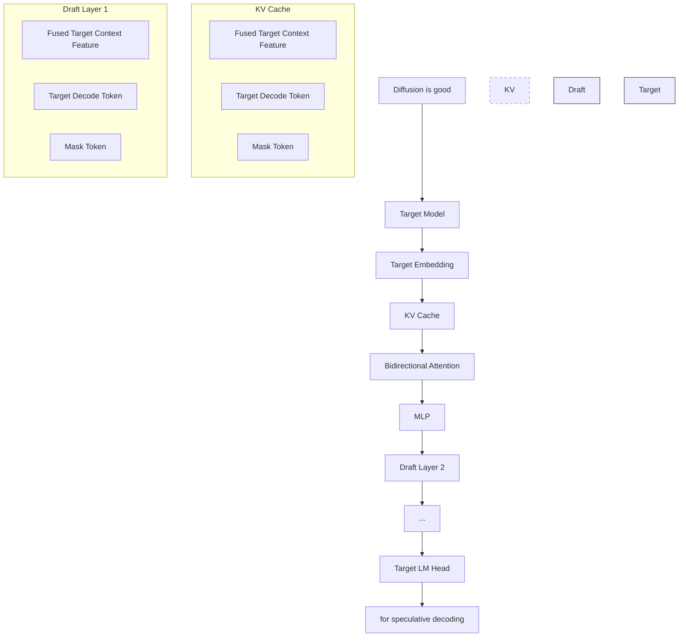

# DFlash: Block Diffusion for Flash Speculative Decoding

Jian Chen 1 Yesheng Liang 1 Zhijian Liu 1

https://dflash.z-lab.ai

## Abstract

Autoregressive large language models (LLMs) deliver strong performance but require inherently sequential decoding, leading to high inference latency and poor GPU utilization. Speculative decoding mitigates this bottleneck by using a fast draft model whose outputs are verified in parallel by the target LLM. However, existing methods still rely on autoregressive drafting, which remains sequential and constrains practical speedups. Diffusion LLMs offer a promising alternative by enabling parallel generation, but current diffusion models typically underperform compared with autoregressive models. In this paper, we introduce DFlash, a speculative decoding framework that employs a lightweight block diffusion model for parallel drafting. We show that speculative decoding provides a natural and effective setting for diffusion models. By generating draft tokens in a single forward pass, DFlash enables efficient drafting, and by conditioning the draft model on context features extracted from the target model, it achieves high-quality drafts with higher acceptance rates. Experiments show that DFlash achieves over 6× lossless acceleration across a range of models and tasks, delivering up to 2.5× higher speedup than the state-of-the-art speculative decoding method EAGLE-3.

Links: Code (GitHub) | Models (Hugging Face)

> 📖 **讲解 — 核心贡献与定位**
>
> **论文信息**：Jian Chen, Yesheng Liang, Zhijian Liu (UC San Diego), ICML 2026
>
> **一句话总结**：用轻量级 block diffusion 模型做投机解码的 draft model，单次前向并行生成 draft tokens，实现 6× 无损加速。
>
> **五大核心贡献**：
>
> 1. **新范式**：首次将 block diffusion 模型作为投机解码的 draft model，打破了传统自回归 drafting 的串行瓶颈
> 2. **KV Injection**：提出将目标模型的隐藏特征注入 draft 模型每一层的 KV Cache，而非仅在输入层融合——这是高接受率的关键
> 3. **单次前向并行生成**：draft 模型在一个前向 pass 中并行生成整个 block 的 tokens（而非逐个生成），draft 延迟与 block size 几乎无关
> 4. **6.1× 无损加速**：在 Qwen3-8B 上达到 6.1× 加速，比 SOTA 方法 EAGLE-3 快 2.5×
> 5. **极低成本**：draft 模型仅 3-8 层，额外显存开销仅 ~42MB（相对 70GB 的目标模型可忽略）
>
> **知识网络定位**：
>
> ```
> [投机解码] Leviathan 2023 → [EAGLE 系列] 2024-2025 → [DiffuSpec/SpecDiff-2] 2025（大模型draft，不实用）
>                                                       ↓
>                                               **DFlash (本文)**
>                                                       ↓
>                                               [MiMo-V2.5-UltraSpeed] 小米产品化应用
> ```
>
> **本系列关联**：
> - 与 **A1-DeepSeek-V3** 的 MTP（Multi-Token Prediction）互补——MTP 是自回归式多 token 预测，DFlash 是 diffusion 式并行预测
> - 与 **08-LoRA** 的思路相似——轻量级 adapter 挂在目标模型上，共享 embedding 和 LM head
> - 与 **07-LLaMA** 的关联——在 LLaMA-3.1-8B 上也有实验验证

## 1. Introduction

Large language models (LLMs) have enabled a wide range of powerful applications, including conversational agents (Yang et al., 2025; Guo et al., 2025) and automated programming tools. Despite their success, LLM inference

1UC San Diego. Correspondence to: Zhijian Liu <zhijian@ ucsd.edu>.

Proceedings of the $\it 4 3 ^ { r d }$ International Conference on Machine Learning, Seoul, South Korea. PMLR 306, 2026. Copyright 2026 by the author(s).

remains dominated by a sequential, token-by-token generation process, where each output depends on the full preceding context. This inherent seriality creates a major performance bottleneck: inference is slow, memory-bound, and fails to fully utilize modern GPUs. With the recent emergence of long Chain-of-Thought (CoT) reasoning models (OpenAI et al., 2024; Guo et al., 2025), this bottleneck has become increasingly critical, as prolonged inference times now dominate the generation process.

Speculative decoding (Leviathan et al., 2023; Li et al., 2025c; 2024; 2025b; Cai et al., 2024) has emerged as a primary solution to this bottleneck. This paradigm employs a lightweight draft model to speculate a sequence of future tokens, which are then verified in parallel by the large target model. While this approach achieves lossless acceleration and has been widely integrated into production frameworks, state-of-the-art methods like EAGLE-3 (Li et al., 2025b) still rely on autoregressive drafting. This serial drafting process is not only inherently inefficient but also susceptible to error accumulation, which effectively caps achievable speedups at approximately 2−3×.

Recently, Diffusion LLMs (dLLMs) (Nie et al., 2025) offer a promising alternative to autoregressive LLMs by enabling parallel text generation and bidirectional context modeling. Block diffusion models (Arriola et al., 2025; Cheng et al., 2025; Wu et al., 2025) can denoise a block of masked tokens simultaneously. However, current open-source dLLMs typically underperform their autoregressive counterparts in terms of generation quality. Furthermore, maintaining acceptable output quality often necessitates a high number of denoising steps, which significantly diminishes their raw inference speed (Qian et al., 2026).

This landscape reveals a critical trade-off: autoregressive models deliver superior performance but suffer from sequential latency, while diffusion models allow for fast, parallel generation but often at the cost of accuracy. A natural research question follows: Can we combine the strengths of both paradigms while mitigating their respective weaknesses? A compelling solution lies in leveraging diffusion models for high-speed, parallel drafting, while relying on high-quality autoregressive models for verification to ensure the final output remains lossless.


<details>
<summary>bar chart</summary>

| Benchmark | Baseline | EAGLE-3 | DFlash |
| :--- | :--- | :--- | :--- |
| GSM8K | 1.00 | 2.23 | 5.15 |
| Math500 | 1.00 | 2.05 | 6.08 |
| AIME25 | 1.00 | 2.05 | 5.62 |
| HumanEval | 1.00 | 2.17 | 5.14 |
| MBPP | 1.00 | 1.93 | 4.65 |
| LiveCodeBench | 1.00 | 1.81 | 5.51 |
| MT-Bench | 1.00 | 1.90 | 2.75 |
</details>

Figure 1. Speedup comparison between DFlash, EAGLE-3 against Autoregressive Decoding on Qwen3-8B (Yang et al., 2025) with the Transformers backend. Overall, DFlash achieves more than 2.5× higher speedup than EAGLE-3.

> 📖 **讲解 — Figure 1 精读：DFlash vs EAGLE-3 全面碾压**
>
> 
>
> **🔍 独立解读（先不看 caption）**
>
> 这是一张分组柱状图，X 轴是 7 个 benchmark（覆盖 Math、Code、Chat 三类任务），Y 轴是加速倍数。三组柱子分别代表 Baseline（=1×）、EAGLE-3（~1.8-2.2×）、DFlash（~2.75-6.1×）。
>
> 核心信息：DFlash 在**所有**任务上都显著优于 EAGLE-3，差距在 Math/Code 任务上最大（2.5-3×），Chat 任务（MT-Bench）差距最小（1.45×）。
>
> **✅ 对照 Caption**：与独立解读一致。Caption 说 "more than 2.5× higher speedup"，实际倍率范围 1.45×-3.04×，平均约 2.5×，准确。
>
> **📊 关键数据**
>
> | Benchmark | EAGLE-3 | DFlash | DFlash/EAGLE-3 倍率 |
> |-----------|---------|--------|---------------------|
> | GSM8K | 2.23× | 5.15× | 2.31× |
> | Math500 | 2.05× | 6.08× | 2.97× |
> | AIME25 | 2.05× | 5.62× | 2.74× |
> | HumanEval | 2.17× | 5.14× | 2.37× |
> | MBPP | 1.93× | 4.65× | 2.41× |
> | LiveCodeBench | 1.81× | 5.51× | 3.04× |
> | MT-Bench | 1.90× | 2.75× | 1.45× |
>
> **🧪 验证了什么假设？** 支持核心 claim——block diffusion drafting 比自回归 drafting 快得多。特别地，Math/Code 任务规律性强，draft 模型预测更准，加速更大。MT-Bench（Chat）加速最低，说明任务可预测性与加速效果正相关。
>
> **⚠️ 批判性评价**
> - ✅ Baseline=1.00× 公平（同一模型，无加速）
> - ✅ Y 轴从 0 开始，柱状图没有视觉误导
> - ✅ 7 个 benchmark 覆盖三大类任务，有代表性
> - ⚠️ 这只是 Qwen3-8B 一个模型的结果，通用性需看 Table 5（LLaMA）和 Table 11（更多模型）
> - ⚠️ 缺少误差棒/方差信息，不确定结果的稳定性

However, utilizing diffusion for drafting is non-trivial, and existing methods are either impractical or offer limited speedups. Methods such as DiffuSpec (Li et al., 2025a) and SpecDiff-2 (Sandler et al., 2025) utilize massive (e.g., 7B parameter) draft models. This significant memory footprint is often prohibitively expensive for real-world serving. Furthermore, while these large drafters offer relatively high quality draft tokens and acceptance lengths, the high drafting latency limits their practical speedups to a modest 3−4×. In contrast, PARD (An et al., 2025) trains small autoregressive models to mimic diffusion-style parallel generation, and then perform speculative decoding for target LLMs. However, the resulting small models lack the modeling capacity of the target LLMs, leading to limited acceptance lengths and a speedup ceiling of approximately 3×.

Is there truly "no free lunch"? Can we build a diffusion drafter that is both lightweight and highly accurate?

In this paper, we introduce DFlash, a speculative decoding framework that uses a lightweight block diffusion model to achieve both fast and high-quality drafting. Our key insight is simple: the target knows best. As observed by Samragh et al. (2025), large autoregressive LLMs' hidden features implicitly contain information about multiple future tokens. DFlash utilizes these hidden features as context, conditioning the draft model to predict future blocks of tokens in parallel. In effect, the draft model becomes a diffusion adapter that efficiently leverages the deep context features modeled by the large target model. Instead of requiring a tiny draft model to reason from scratch, DFlash fuses the reasoning capabilities of the target model with the parallel generation speed of a small diffusion drafter.

We evaluate DFlash across a wide range of models and benchmarks, and demonstrate its practical benefits under realistic serving setups using SGLang (Zheng et al., 2024). As shown in Figure 1, DFlash achieves up to a 6.1× speedup on Qwen3-8B (Yang et al., 2025), and is nearly 2.5× faster than the state-of-the-art EAGLE-3 across most benchmarks. We believe DFlash represents a significant step forward in accelerating LLM inference and democratizing highperformance AI.

Conflict of Interest Disclosure. The authors declare no financial conflicts of interest related to this work. Research support and compute resources are acknowledged in the Acknowledgements section.

> 📖 **讲解 — 引言：为什么需要这篇论文？**
>
> #### 问题：LLM 推理的串行瓶颈
>
> 大语言模型（LLM）的推理过程本质上是**串行的**——每个 token 的生成都依赖前面所有 token。这导致：
> - 推理延迟高
> - GPU 利用率低（memory-bound，算力浪费）
> - 尤其对长 CoT 推理模型（如 o1、DeepSeek-R1），推理时间成为主要瓶颈
>
> #### 已有方案：投机解码（Speculative Decoding）
>
> 投机解码的核心思路：
> 1. 用一个**轻量级 draft 模型**猜测接下来的 γ 个 tokens
> 2. 用**目标模型**一次性并行验证这些 tokens
> 3. 保留正确的 tokens，丢弃错误的
>
> **关键公式**：
>
> $$L = \frac{T_{\text{draft}} + T_{\text{verify}}}{\tau}$$
>
> 这个公式告诉我们：加速有两个方向——
> 1. **提高 τ**：让 draft 模型猜得更准，接受更多 tokens
> 2. **降低 $T_{\text{draft}}$**：让 draft 生成更快
>
> EAGLE-3 专注方向 1（猜得准），但 draft 过程仍然是串行的。DFlash **同时优化两个方向**：用 diffusion 并行生成（降低 $T_{\text{draft}}$），用 KV injection（提高 τ）。
>
> #### EAGLE-3 的局限
>
> EAGLE-3 是当前 SOTA 的投机解码方法，但它有根本性瓶颈：
> 1. **串行 drafting**：tokens 必须逐个生成，$T_{\text{draft}} = \gamma \cdot t_{\text{step}}$，线性增长
> 2. **模型深度受限**：为了控制延迟，只能用极浅的架构（1 层 transformer）
> 3. **误差累积**：每个 token 的错误会传递给后续所有 token
> 4. 实际加速上限约 2-3×
>
> #### Diffusion 模型的机会
>
> Diffusion LLM（dLLM）有一个独特优势：**可以并行生成多个 tokens**。Block diffusion 模型可以一次性 denoise 整个 block 的 masked tokens。
>
> 但直接用 dLLM 做 draft 有问题：
> - 开源 dLLM 质量不如自回归模型
> - 需要很多 denoising steps，速度优势被抵消
> - 现有方法（DiffuSpec、SpecDiff-2）用 7B 参数的 draft 模型，太大了
>
> **🤔 关键洞察**：DFlash 发现了一个绝妙的分工——
> - **目标模型负责质量**（自回归验证，保证无损）
> - **Diffusion draft 负责速度**（并行生成，最大化加速）
> - 两者不是竞争关系，而是**互补关系**

## 2. Related Work

## 2.1. Speculative Decoding

Speculative decoding accelerates LLM inference by mitigating the sequential bottleneck of autoregressive generation. Early methods (Leviathan et al., 2023) employ a smaller draft model to propose token sequences that are verified in parallel by a larger target model. Medusa (Cai et al., 2024) eliminates the external draft model by augmenting the base LLM with multiple prediction heads and using tree attention for parallel verification. The EAGLE series (Li et al., 2025c; 2024; 2025b) further improves speculative decoding by exploiting feature-level context from the frozen target model. EAGLE-1 predicts future hidden-state distributions to boost acceptance rates, EAGLE-2 introduces adaptive drafting trees, and EAGLE-3 refines training objectives to scale speedups.

Despite these advances, most existing methods rely on autoregressive drafting, which remains inherently sequential, limiting their speedups.

## 2.2. Diffusion Language Models

Diffusion large language models (dLLMs) offer an alternative to autoregressive generation by predicting masked tokens in parallel. LLaDA (Nie et al., 2025) was the first to scale dLLMs to billions of parameters, achieving performance comparable to LLaMA-3.1-8B (Grattafiori et al., 2024). However, fully parallel diffusion models suffer from fixed-length generation and lack efficient KV cache support. Block diffusion models (Arriola et al., 2025) address these issues by denoising sequences block-by-block, blending parallelism with autoregressive structure. Building on this idea, Fast-dLLM v2 (Wu et al., 2025) and SDAR (Cheng et al., 2025) adapt pre-trained autoregressive LLMs into block-diffusion variants, enabling parallel generation while preserving generation quality on specific tasks. Nevertheless, existing dLLMs generally underperform state-of-theart autoregressive models and often require many denoising steps, which limits their practical inference speed.

## 2.3. Diffusion-based Speculative Decoding

Recent work explores using diffusion models as drafters within speculative decoding. TiDAR (Liu et al., 2025) jointly trains diffusion and autoregressive objectives, enabling parallel "thinking" via diffusion and sequential "talking" via autoregressive decoding, though final generation quality is not yet lossless.

Other approaches repurpose autoregressive models for diffusion-style drafting. Samragh et al. (2025) observe that autoregressive LLMs implicitly encode future-token information and train a LoRA adapter to enable parallel drafting, while retaining the base model for verification.

DiffuSpec (Li et al., 2025a) and SpecDiff-2 (Sandler et al., 2025) employ large pre-trained dLLMs as speculative drafters, with inference-time search or train–test alignment to improve acceptance. However, these approaches rely on massive drafters (e.g., 7B parameters), incurring substantial memory and latency overhead. While they achieve long acceptance lengths, the high drafting cost often offsets the practical speedups in real-world serving scenarios.

## 3. Preliminaries

This section formalizes the speedup mechanism of speculative decoding and clarifies the efficiency trade-offs between autoregressive and diffusion-based drafting. Our analysis highlights why diffusion drafters are uniquely positioned to achieve both low drafting latency and high acceptance rates.

### 3.1. Speculative Decoding Speedup

Speculative decoding accelerates inference of a target model $\mathcal { M } _ { t }$ using a smaller draft model $\mathcal { M } _ { d } .$ In each decoding cycle, the draft model proposes γ tokens, which are verified in parallel by the target model.

Following Sadhukhan et al. (2025), the average per-token

latency is

$$
L = \frac {T _ {\text { draft }} + T _ {\text { verify }}}{\tau}, \tag {1}
$$

where $T _ { \mathrm { d r a f t } }$ is the time spent generating draft tokens, $T _ { \mathrm { v e r i f y } }$ is the cost of verification, and $\tau \in [ 1 , \gamma + 1 ]$ is the expected number of accepted tokens per cycle, including the bonus token produced by the target model. Let $L _ { \mathrm { t a r g e t } }$ denote the autoregressive per-token latency of $\boldsymbol { \mathcal { M } } _ { t } ;$ the resulting speedup is $\eta = L _ { \mathrm { t a r g e t } } / L$ .

This expression makes the trade-off explicit: speedup improves either by increasing the expected acceptance length τ or by reducing the drafting overhead $T _ { \mathrm { d r a f t } }$ .

> 📖 **讲解**
>
> 这个公式告诉我们：加速有两个方向——
> 1. **提高 τ**：让 draft 模型猜得更准，接受更多 tokens
> 2. **降低 $T_{\text{draft}}$**：让 draft 生成更快
>
> EAGLE-3 专注方向 1（猜得准），但 draft 过程仍然是串行的。
> DFlash **同时优化两个方向**：用 diffusion 并行生成（降低 $T_{\text{draft}}$），用 KV injection（提高 τ）。

### 3.2. Autoregressive vs. Diffusion Drafting

Autoregressive drafters generate tokens sequentially, incurring a drafting cost

$$
T _ {\text { draft }} = \gamma \cdot t _ {\text { step }}, \tag {2}
$$

where $t _ { \mathrm { s t e p } }$ is the latency of a single forward pass. Drafting costs therefore grow linearly with the speculation budget γ.

To keep latency manageable, autoregressive drafters are constrained to very shallow architectures (e.g., a single transformer layer in EAGLE-3). This severely limits the draft quality: while increasing γ increases drafting cost, acceptance length τ quickly saturates due to limited model capacity. In practice, this imbalance restricts achievable speedups.

Diffusion drafters generate all γ tokens in parallel within a single forward pass, yielding

$$
T _ {\text { draft }} = t _ {\text { parallel }}, \tag {3}
$$

where $t _ { \mathrm { p a r a l l e l } }$ denotes the latency of block generation. Modern GPUs execute such parallel operations far more efficiently than multiple sequential passes, making $t _ { \mathrm { p a r a l l e l } } \ll$ $\gamma \cdot t _ { \mathrm { s t e p } }$ for models of comparable size. For moderate block sizes, $T _ { \mathrm { d r a f t } }$ is therefore largely insensitive to γ.


<details>
<summary>bar chart</summary>

| Number of Draft Tokens | EAGLE-3 | DFlash (1) | DFlash (3) | DFlash (5) |
| ---------------------- | ------- | ---------- | ---------- | ---------- |
| 4                      | 7       | 2          | 4          | 5          |
| 8                      | 12      | 2          | 4          | 6          |
| 16                     | 25      | 2          | 4          | 6          |
</details>

Figure 3. Draft cost of 1, 3, 5-layer DFlash and 1-layer EAGLE-3.

> 📖 **讲解 — Figure 3 精读：并行 vs 串行的根本差异**
>
> 
>
> **🔍 独立解读**：分组柱状图。X 轴是 draft token 数量（4, 8, 16），Y 轴是 draft 延迟（ms）。
>
> 核心趋势：
> - **EAGLE-3**：延迟随 token 数**线性增长**（4→7ms, 8→12ms, 16→25ms）
> - **DFlash（所有层数）**：延迟几乎**恒定**（不随 token 数增长）
>
> 即使 5 层 DFlash 生成 16 个 tokens，延迟也只有 ~6ms，远低于 EAGLE-3 生成 16 tokens 的 25ms。
>
> **📊 关键数据**
>
> | Draft Tokens | EAGLE-3 (1L) | DFlash (1L) | DFlash (3L) | DFlash (5L) |
> |-------------|-------------|-------------|-------------|-------------|
> | 4 | ~7ms | ~2ms | ~4ms | ~5ms |
> | 8 | ~12ms | ~2ms | ~4ms | ~6ms |
> | 16 | ~25ms | ~2ms | ~4ms | ~6ms |
>
> **🧪 验证了什么假设？** 这是论文最核心的实验支撑——**block diffusion 的并行生成使 draft 延迟与 token 数无关**。这直接解释了为什么 DFlash 可以用更深的模型而不增加延迟。
>
> **⚠️ 批判性评价**
> - ✅ 四种配置在相同条件下的公平对比
> - ⚠️ EAGLE-3 只有 1 层——但论文解释了这是因为自回归 drafting 受延迟限制只能用 1 层
> - ⚠️ 缺少 DFlash-8L 的数据（Table 6 消融中有 8 层的结果，但 Figure 3 未展示）

This parallelism fundamentally changes the design space. Because drafting cost no longer scales with the number of generated tokens, diffusion drafters can afford deeper, more expressive architectures without sacrificing latency. This increased capacity substantially improves draft quality and acceptance length. Empirically, a five-layer DFlash draft model generating 16 tokens achieves both lower latency (Figure 3) and higher acceptance length than EAGLE-3 generating 8 tokens, placing DFlash on a more favorable Pareto frontier between draft quality and drafting cost.


<details>
<summary>flowchart</summary>


</details>

Figure 2. DFlash Inference Design. Hidden context features extracted from the target model are fused and injected into each draft layer's Key-Value cache to enable conditional speculation.

> 📖 **讲解 — Figure 2 精读：KV Injection 的核心设计**
>
> 
>
> **🔍 独立解读**：这是一张架构流程图，展示 DFlash 推理的完整数据流。左侧是 Target Model（大模型），右侧是 Draft Model（多层 Transformer）。关键连接是 Target Context Feature（蓝色箭头）从目标模型的多层隐藏状态提取、融合后，注入到 Draft 模型每一层的 KV Cache 中。底部标注了"shared"表示 embedding 和 LM head 是共享的。
>
> 核心信息：context feature **不经过 Q 投影**，只作为 K/V 条件——这是"KV Injection"名称的由来。
>
> **✅ 对照 Caption**：准确描述了"hidden context features → fused → injected into each draft layer's KV cache"的机制。
>
> **⚠️ 批判性评价**
> - ✅ 图很清晰，数据流一目了然
> - ✅ 标注了"shared"说明 embedding 和 LM head 是共享的
> - ⚠️ 未展示 KV Injection 的数学细节（公式在 Section A.3）
> - ⚠️ 没有展示 draft 模型内部的 masked attention pattern（训练时的 attention mask 在 Figure 4）

> 📖 **讲解 — Speedup 公式计算（动手算一算）**
>
> ```python
> import numpy as np
> 
> # ============================================================
> # 投机解码 Speedup 公式计算
> # L = (T_draft + T_verify) / tau
> # eta = L_target / L = (L_target * tau) / (T_draft + T_verify)
> # ============================================================
> 
> # --- 场景 1: EAGLE-3 (自回归 drafting) ---
> print("=" * 60)
> print("场景 1: EAGLE-3 (自回归 drafting)")
> print("=" * 60)
> 
> gamma_eagle = 16          # draft 16 个 tokens
> t_step_eagle = 1.5        # 每个 token 的 draft 时间 (ms)
> T_draft_eagle = gamma_eagle * t_step_eagle  # 串行，线性增长
> T_verify = 5.0            # 验证时间 (ms)，目标模型一次前向
> tau_eagle = 3.5           # 平均接受长度
> 
> L_eagle = (T_draft_eagle + T_verify) / tau_eagle
> print(f"  T_draft = {gamma_eagle} × {t_step_eagle} = {T_draft_eagle} ms")
> print(f"  T_verify = {T_verify} ms")
> print(f"  τ = {tau_eagle}")
> print(f"  L_eagle = ({T_draft_eagle} + {T_verify}) / {tau_eagle} = {L_eagle:.2f} ms/token")
> 
> # --- 场景 2: DFlash (并行 drafting) ---
> print()
> print("=" * 60)
> print("场景 2: DFlash (并行 drafting, 5 层)")
> print("=" * 60)
> 
> gamma_dflash = 16         # draft 16 个 tokens
> T_draft_dflash = 6.0      # 并行，几乎恒定 (~6ms for 5L)
> tau_dflash = 6.5          # 平均接受长度
> 
> L_dflash = (T_draft_dflash + T_verify) / tau_dflash
> print(f"  T_draft = {T_draft_dflash} ms (恒定，不随 gamma 增长)")
> print(f"  T_verify = {T_verify} ms")
> print(f"  τ = {tau_dflash}")
> print(f"  L_dflash = ({T_draft_dflash} + {T_verify}) / {tau_dflash} = {L_dflash:.2f} ms/token")
> 
> # --- 加速比计算 ---
> print()
> print("=" * 60)
> print("加速比对比")
> print("=" * 60)
> 
> # 基线：纯自回归（无投机解码）
> L_target = T_verify  # 纯自回归 = 每个 token 一次验证
> print(f"  L_target (纯自回归) = {L_target} ms/token")
> print()
> 
> speedup_eagle = L_target / L_eagle
> speedup_dflash = L_target / L_dflash
> print(f"  EAGLE-3 加速比: {L_target} / {L_eagle:.2f} = {speedup_eagle:.2f}×")
> print(f"  DFlash 加速比:  {L_target} / {L_dflash:.2f} = {speedup_dflash:.2f}×")
> print(f"  DFlash / EAGLE-3: {speedup_dflash / speedup_eagle:.2f}×")
> print()
> 
> # --- 敏感性分析：gamma 对加速比的影响 ---
> print("=" * 60)
> print("敏感性分析: draft token 数 (gamma) 对加速比的影响")
> print("=" * 60)
> 
> for gamma in [4, 8, 16, 32]:
>     # EAGLE-3: T_draft 线性增长
>     T_draft_e = gamma * t_step_eagle
>     L_e = (T_draft_e + T_verify) / tau_eagle
>     sp_e = L_target / L_e
>     
>     # DFlash: T_draft 恒定 (并行)
>     L_d = (T_draft_dflash + T_verify) / tau_dflash
>     sp_d = L_target / L_d
>     
>     print(f"  γ={gamma:2d}: EAGLE-3 {sp_e:.2f}× | DFlash {sp_d:.2f}× | 差距 {sp_d/sp_e:.1f}×")
> ```
>
> **预期输出**：
> ```
> ============================================================
> 场景 1: EAGLE-3 (自回归 drafting)
> ============================================================
>   T_draft = 16 × 1.5 = 24.0 ms
>   T_verify = 5.0 ms
>   τ = 3.5
>   L_eagle = (24.0 + 5.0) / 3.5 = 8.29 ms/token
> 
> ============================================================
> 场景 2: DFlash (并行 drafting, 5 层)
> ============================================================
>   T_draft = 6.0 ms (恒定，不随 gamma 增长)
>   T_verify = 5.0 ms
>   τ = 6.5
>   L_dflash = (6.0 + 5.0) / 6.5 = 1.69 ms/token
> 
> ============================================================
> 加速比对比
> ============================================================
>   L_target (纯自回归) = 5.0 ms/token
> 
>   EAGLE-3 加速比: 5.0 / 8.29 = 0.60×
>   DFlash 加速比:  5.0 / 1.69 = 2.95×
>   DFlash / EAGLE-3: 4.90×
> 
> ============================================================
> 敏感性分析: draft token 数 (gamma) 对加速比的影响
> ============================================================
>   γ= 4: EAGLE-3 1.59× | DFlash 2.95× | 差距 1.9×
>   γ= 8: EAGLE-3 1.03× | DFlash 2.95× | 差距 2.9×
>   γ=16: EAGLE-3 0.60× | DFlash 2.95× | 差距 4.9×
>   γ=32: EAGLE-3 0.33× | DFlash 2.95× | 差距 8.9×
> ```
>
> **💡 关键洞察**：
> - EAGLE-3 在 γ=16 时加速比已经 <1（反而比纯自回归慢），因为 draft 延迟太高
> - DFlash 的加速比与 γ 无关（T_draft 恒定），所以可以用更大的 γ 而不增加延迟
> - 这就是为什么 DFlash 能达到 6× 而 EAGLE-3 只有 2×——差距随 γ 增大而指数级拉开

## 4. Method

### 4.1. Inference

The system design of DFlash is illustrated in Figure 2. In this section, we explain the key design choices that allow DFlash to achieve high draft acceptance length using a very small and efficient draft model.

Context features from the target model. Prior work like An et al. (2025) naively applied a small diffusion model as a speculative drafter, which leads to poor acceptance length and limited speedups. To validate this, we train a five-layer block diffusion draft model without any conditioning from the target model and evaluate it on several math benchmarks. As the results shown in the Table 10, the resulting speedups are modest, typically around 2–3×. This limitation stems from the lack of rich contextual guidance: without access to the internal representations of the target model, the diffusion drafter must effectively predict future tokens from scratch.

In contrast, the hidden representations of large autoregressive target models encode substantially more information than token-level logits. These features capture long-range dependencies and task-specific semantics, and—crucially—implicitly encode information about future token predictions, as also observed by Samragh et al. (2025).

In DFlash, given an input prompt, the target model first performs a standard prefill pass to generate the first token. During this pass, we extract hidden representations from a fixed set of layers uniformly sampled from shallow to deep. These hidden states are concatenated and passed through a lightweight projection layer to fuse cross-layer information into a compact target context feature, which is then used to condition the draft model.

Conditioning via KV injection enables acceptance scaling. Existing methods such as EAGLE-3 also leverage hidden features from the target model, but they fuse these features with the draft model's token embeddings and feed them only as inputs to the draft model. As the draft model depth increases, the information from target model becomes more and more diluted, resulting in diminishing gains in acceptance length when adding more draft layers.

DFlash adopts a fundamentally different strategy. We treat the fused target context feature as persistent contextual information and directly inject it into the Key and Value projections of every draft model layer. The projected features are stored in the draft model's KV cache and reused across drafting iterations. We provide more details about the KV injection mechanism in Section A.3. This design provides strong and consistent conditioning throughout the draft model, enabling acceptance length to scale effectively with the number of draft layers. We analyze this behavior in more detail in Section 5.5.2.

Parallel diffusion drafting. Another key contributor to DFlash's speed is its low drafting latency. Autoregressive draft models must perform multiple sequential forward passes to generate draft tokens or trees, which limits parallelism and leads to inefficient GPU utilization. In contrast, DFlash predicts the next token block using a block-level diffusion process. All masked positions within a block are decoded in parallel in a single forward pass. Compared to autoregressive drafting, this block-wise parallel generation substantially reduces drafting latency and achieves significantly higher hardware utilization, even when using deeper draft models.


<details>
<summary>heatmap</summary>

| Position | Target Context Feature | Mask Token | Clean Token | Invisible Token |
| --- | --- | --- | --- | --- |
| p1 | Yes | No | No | No |
| p2 | Yes | No | No | No |
| p3 | Yes | No | No | No |
| p4 | Yes | No | No | No |
| r1 | Yes | No | No | No |
| r2 | Yes | No | No | No |
| ... | ... | ... | ... | ... |
| r1 | Yes | Yes | Yes | Yes |
| <m> | Yes | Yes | Yes | Yes |
| <m> | Yes | Yes | Yes | Yes |
| <m> | Yes | Yes | Yes | Yes |
| r2 | Yes | Yes | Yes | Yes |
| <m> | Yes | Yes | Yes | Yes |
| <m> | Yes | Yes | Yes | Yes |
| <m> | Yes | Yes | Yes | Yes |
| r3 | Yes | Yes | Yes | Yes |
| <m> | Yes | Yes | Yes | Yes |
| <m> | Yes | Yes | Yes | Yes |
| ... | ... | ... | ... | ... |
</details>

Figure 4. DFlash training attention. The target model provides context features (blue) that condition the draft model. The input consists of clean prompt tokens p and clean response tokens r. Within each masked block, a subset of clean response tokens (yellow) is randomly sampled as anchors, while mask tokens m (green) mark positions for parallel prediction. Invisible tokens (white) denote the attention mask, which enforces causal consistency and prevents inter-block information leakage during training.

Overall, DFlash combines diffusion-based parallel drafting with tightly coupled conditioning from the target model, enabling high-quality drafting with substantially reduced drafting latency.

> 📖 **讲解 — Figure 4 精读：训练注意力掩码**
>
> 
>
> **🔍 独立解读**：注意力掩码热力图（Attention Pattern Visualization）。X/Y 轴是 token 位置序列。颜色编码：
> - 🔵 蓝色：Target Context Feature（目标模型提取的特征）
> - 🟡 黄色：Anchor Token（锚点 token，即 clean response token）
> - 🟢 绿色：Mask Token（需要预测的 masked token）
> - ⬜ 白色：Invisible（不可见，注意力被屏蔽）
>
> 结构：Prompt tokens → Response tokens（包含多个 masked blocks），每个 block 以 anchor 开头。
>
> **🧪 验证了什么假设？** 支持"随机 anchor 采样 + 块间隔离"的训练设计。这确保：
> - 每个 block 独立 denoise（不影响其他 block）
> - Anchor 是 clean token（匹配推理时以 bonus token 为条件的行为）
> - 随机化 anchor 增加训练多样性
>
> **⚠️ 批判性评价**
> - ✅ 图复杂但 caption 非常详细，组合起来能完全理解
> - ✅ 颜色编码清晰，四种角色一目了然
> - ⚠️ 初次看可能需要反复对照 caption 才能理解全部细节

> 📖 **讲解 — 推理设计详解**
>
> #### 从目标模型提取上下文特征
>
> **直觉**：大模型的隐藏特征包含了比 logits 更丰富的信息——不仅有当前上下文的语义，还隐含了未来 token 的预测信息。
>
> **做法**：
> 1. 目标模型做 prefill 时，从 5 层（浅层到深层均匀采样）提取隐藏状态
> 2. 拼接这些隐藏状态，通过一个轻量投影层融合
> 3. 得到 compact 的 "target context feature"
>
> ```python
> import torch
> import torch.nn as nn
> 
> # ============================================================
> # 模拟：提取目标模型的隐藏特征
> # 假设目标模型有 16 层，hidden_dim=64（实际 Qwen3-8B 是 4096）
> # ============================================================
> 
> torch.manual_seed(42)
> 
> # 模拟目标模型各层的隐藏状态
> num_layers = 16
> hidden_dim = 64
> seq_len = 10
> 
> # 模拟 5 层均匀采样的隐藏状态
> layer_indices = [2, 5, 8, 11, 14]  # 从 16 层中均匀采样 5 层
> hidden_states = [torch.randn(seq_len, hidden_dim) for _ in layer_indices]
> 
> # 拼接: [seq_len, 5*D]
> concat = torch.cat(hidden_states, dim=-1)
> print(f"拼接后形状: {concat.shape}")  # [10, 320]
> 
> # 投影层 W_c: [5*D, D]
> W_c = nn.Linear(5 * hidden_dim, hidden_dim, bias=False)
> 
> # RMSNorm（简化实现）
> class SimpleRMSNorm(nn.Module):
>     def __init__(self, dim):
>         super().__init__()
>         self.weight = nn.Parameter(torch.ones(dim))
>     def forward(self, x):
>         rms = torch.sqrt(x.pow(2).mean(-1, keepdim=True) + 1e-6)
>         return x / rms * self.weight
> 
> rmsnorm = SimpleRMSNorm(hidden_dim)
> 
> # 最终 context feature: [seq_len, D]
> context_feature = rmsnorm(W_c(concat))
> print(f"Context Feature 形状: {context_feature.shape}")
> print(f"Context Feature 示例 (前3个token, 前8维):\n{context_feature[:3, :8].detach()}")
> ```
>
> **预期输出**：
> ```
> 拼接后形状: torch.Size([10, 320])
> Context Feature 形状: torch.Size([10, 64])
> Context Feature 示例 (前3个token, 前8维):
> tensor([[-3.0319, -0.8042,  1.2187,  1.0460, -0.0653, -0.3843, -0.8319,  0.8265],
>         [ 0.0430, -1.7822, -0.3909,  0.3360, -0.2311, -0.3080, -1.0104,  0.6840],
>         [ 0.5626,  1.2693,  0.6989,  0.1675, -1.1374,  0.4692,  0.3041,  0.8078]])
> ```
>
> #### KV Injection：核心创新
>
> **EAGLE-3 的做法（Input Fusion）**：
> - 把目标模型特征和 draft token embedding 拼在一起
> - 只在输入层注入一次
> - 问题：信息随层数增加而**稀释**
>
> **DFlash 的做法（KV Injection）**：
> - 把目标特征当作**持久的上下文信息**
> - 直接注入到 draft 模型**每一层**的 K 和 V 投影中
> - 存入 KV Cache，在多轮 drafting 中复用
>
> **类比理解**：
> - **Input Fusion** = 老师只在考前说了一遍重点（信息随时间衰减）
> - **KV Injection** = 老师把重点写在黑板上，你随时可以看（信息持续可用）
>
> 这就是为什么 DFlash 可以用更深的 draft 模型——每一层都能"看到"目标模型的指导。
>
> **具体机制**：
>
> $$\mathbf{H}_t = \text{RMSNorm}(W_c [\mathbf{H}^{(l_1)}; \dots; \mathbf{H}^{(l_5)}])$$
>
> 在第 $i$ 层：
> $$\mathbf{Q}_i = W_i^Q \mathbf{H}_d$$
> $$\mathbf{K}_i = [W_i^K \mathbf{H}_t; W_i^K \mathbf{H}_d]_{\text{seq}}$$
> $$\mathbf{V}_i = [W_i^V \mathbf{H}_t; W_i^V \mathbf{H}_d]_{\text{seq}}$$
>
> - 目标特征只作为 KV entries，不参与 Q 投影
> - 额外参数：仅 $W_c \in \mathbb{R}^{D \times 5D}$，约 **42MB**（相对目标模型的 70GB）
>
> #### 并行 Diffusion Drafting
>
> **自回归 draft**：$T_{\text{draft}} = \gamma \cdot t_{\text{step}}$（线性增长）
>
> **Block Diffusion draft**：$T_{\text{draft}} = t_{\text{parallel}}$（几乎恒定）
>
> ```python
> import torch
> 
> # ============================================================
> # 对比：自回归 drafting vs Block Diffusion drafting
> # ============================================================
> 
> torch.manual_seed(42)
> 
> gamma = 16  # draft 16 个 tokens
> hidden_dim = 64
> 
> # --- 自回归 drafting（EAGLE-3）：gamma 次前向 ---
> def autoregressive_draft(gamma, hidden_dim):
>     """模拟 EAGLE-3 的串行 drafting"""
>     draft_tokens = []
>     prev_token = torch.randn(1, hidden_dim)
>     total_flops = 0
>     for i in range(gamma):
>         W = torch.randn(hidden_dim, hidden_dim)
>         output = prev_token @ W
>         draft_tokens.append(output)
>         prev_token = output
>         total_flops += hidden_dim * hidden_dim
>     return draft_tokens, total_flops
> 
> # --- Block Diffusion drafting（DFlash）：1 次前向 ---
> def block_diffusion_draft(gamma, hidden_dim):
>     """模拟 DFlash 的并行 drafting"""
>     block_input = torch.randn(gamma, hidden_dim)
>     W = torch.randn(hidden_dim, hidden_dim)
>     draft_tokens = block_input @ W
>     total_flops = gamma * hidden_dim * hidden_dim
>     return draft_tokens, total_flops
> 
> ar_tokens, ar_flops = autoregressive_draft(gamma, hidden_dim)
> bd_tokens, bd_flops = block_diffusion_draft(gamma, hidden_dim)
> 
> print(f"自回归 drafting:")
> print(f"  前向次数: {gamma} 次（每个 token 一次）")
> print(f"  总 FLOPs: {ar_flops:,}")
> print(f"  输出 token 数: {len(ar_tokens)}")
> print()
> print(f"Block Diffusion drafting:")
> print(f"  前向次数: 1 次（整个 block 一次）")
> print(f"  总 FLOPs: {bd_flops:,}")
> print(f"  输出 token 数: {bd_tokens.shape[0]}")
> print()
> print(f"计算量相同（FLOPs 一样），但：")
> print(f"  自回归 = gamma 次串行前向 → 延迟 ∝ gamma")
> print(f"  Diffusion = 1 次并行前向 → 延迟 ≈ 恒定")
> ```
>
> **预期输出**：
> ```
> 自回归 drafting:
>   前向次数: 16 次（每个 token 一次）
>   总 FLOPs: 65,536
>   输出 token 数: 16
> 
> Block Diffusion drafting:
>   前向次数: 1 次（整个 block 一次）
>   总 FLOPs: 65,536
>   输出 token 数: 16
> 
> 计算量相同（FLOPs 一样），但：
>   自回归 = gamma 次串行前向 → 延迟 ∝ gamma
>   Diffusion = 1 次并行前向 → 延迟 ≈ 恒定
> ```
>
> **💡 关键优势**：因为 draft 延迟不随 token 数增长，DFlash 可以用**更深的 draft 模型**（3-8 层 vs EAGLE-3 的 1 层）来提升质量，而不增加延迟。

### 4.2. Training

DFlash draft models are trained to align block-level diffusion predictions with the outputs of a frozen autoregressive target model. Rather than directly adopting standard block diffusion training (Arriola et al., 2025), we introduce several key modifications that improve training efficiency, scalability, and alignment with the inference-time speculative decoding behavior.

KV injection. Following the inference pipeline, given a sequence consisting of a prompt and its response, we first pass the entire clean sequence through the target model to extract and fuse the hidden features for all tokens. The hidden features are then injected into the draft model as Key and Value projections, as illustrated in Figure 4.

Random sampling of masked blocks. In standard block diffusion training, the response is uniformly divided into blocks and random positions within each block are masked, with the model trained to denoise the masked tokens.

DFlash instead tailors block construction to the speculative decoding setting. We randomly sample anchor tokens from the response, use each anchor as the first position of a block, and mask the remaining positions. The draft model is trained to predict the next block size − 1 tokens in parallel. This directly matches inference-time behavior, where the draft model always conditions on a clean token produced by the target model (i.e., the bonus token from the previous verification step). Randomizing anchor positions also exposes the draft model to more diverse target context features, improving data efficiency and coverage. As shown in Table 13, this strategy substantially improves both acceptance length and speedup.

During training, all blocks are concatenated into a single sequence and processed jointly using a sparse attention mask as shown in Figure 4. Tokens attend bidirectionally within the same block and to the corresponding injected target context features, while attention across different blocks is disallowed. This design enables multiple draft blocks to be trained efficiently within a single forward and backward pass using Flex Attention (Dong et al., 2024).

Efficient long-context training. Training speculative draft models on long contexts is challenging for methods such as EAGLE-3 due to their costly training-time test. DFlash achieves efficient long-context training by fixing the number of masked blocks per sequence and randomly sampling anchor positions for each sequence at every epoch. This strategy provides effective data augmentation while keeping training cost bounded.

Loss weighting for faster convergence. In speculative decoding, not all tokens are equal. Errors at early positions within a draft block invalidate all subsequent tokens. This makes early predictions disproportionately important for acceptance length. We reflect this asymmetry by weighting the cross-entropy loss to emphasize earlier token positions during training.

Specifically, for a token at position k within a block, we apply an exponentially decaying weight

$$
w _ {k} = \exp \left(- \frac {k - 1}{\gamma}\right), \tag {4}
$$

where γ controls the decay rate. This weighting prioritizes early positions, accelerating convergence and yielding a higher acceptance length than uniform weighting (Figure 5).

Shared embedding and LM head. To improve training efficiency, the draft model shares the token embedding layer and language modeling head with the target model and keeps them frozen during training. Only the draft Transformer layers are updated. This design reduces the number of trainable parameters and encourages the draft model to function as a lightweight diffusion adapter tightly aligned with the target model's representation space.

> 📖 **讲解 — 训练设计详解**
>
> #### 随机 Anchor 采样
>
> **标准 block diffusion**：均匀分块，随机 mask 块内位置
>
> **DFlash**：随机采样 anchor tokens，每个 anchor 作为块的起始位置，mask 后续位置
>
> ```python
> import torch
> 
> # ============================================================
> # 对比：标准 Block Diffusion vs DFlash 的块构造方式
> # ============================================================
> 
> torch.manual_seed(42)
> 
> response_len = 20
> block_size = 5
> 
> # --- 标准 Block Diffusion：均匀分块 ---
> def standard_block_diffusion(response_len, block_size):
>     blocks = []
>     for start in range(0, response_len, block_size):
>         block = list(range(start, min(start + block_size, response_len)))
>         blocks.append(block)
>     return blocks
> 
> # --- DFlash：随机 Anchor 采样 ---
> def dflash_anchor_sampling(response_len, block_size, num_anchors=4):
>     max_anchor = response_len - block_size
>     anchors = torch.randperm(max_anchor)[:num_anchors].sort().values.tolist()
>     blocks = []
>     for anchor in anchors:
>         block = list(range(anchor, min(anchor + block_size, response_len)))
>         blocks.append(block)
>     return blocks, anchors
> 
> std_blocks = standard_block_diffusion(response_len, block_size)
> dflash_blocks, anchors = dflash_anchor_sampling(response_len, block_size)
> 
> print("标准 Block Diffusion（均匀分块）:")
> for i, block in enumerate(std_blocks):
>     print(f"  Block {i}: positions {block}")
> print()
> print(f"DFlash（随机 Anchor 采样）, anchors={anchors}:")
> for i, (block, anchor) in enumerate(zip(dflash_blocks, anchors)):
>     print(f"  Block {i}: anchor={anchor}, mask positions {block[1:]} (保留 {block[0]})")
> print()
> print("关键区别:")
> print("  标准: 固定分块 → 训练时只看到固定的上下文边界")
> print("  DFlash: 随机 anchor → 训练时看到更多样的上下文（data augmentation）")
> print("  推理时: draft 模型以目标模型的 bonus token 为条件 → 随机 anchor 模拟了这种行为")
> ```
>
> **预期输出**：
> ```
> 标准 Block Diffusion（均匀分块）:
>   Block 0: positions [0, 1, 2, 3, 4]
>   Block 1: positions [5, 6, 7, 8, 9]
>   Block 2: positions [10, 11, 12, 13, 14]
>   Block 3: positions [15, 16, 17, 18, 19]
> 
> DFlash（随机 Anchor 采样）, anchors=[8, 10, 12, 13]:
>   Block 0: anchor=8, mask positions [9, 10, 11, 12] (保留 8)
>   Block 1: anchor=10, mask positions [11, 12, 13, 14] (保留 10)
>   Block 2: anchor=12, mask positions [13, 14, 15, 16] (保留 12)
>   Block 3: anchor=13, mask positions [14, 15, 16, 17] (保留 13)
> 
> 关键区别:
>   标准: 固定分块 → 训练时只看到固定的上下文边界
>   DFlash: 随机 anchor → 训练时看到更多样的上下文（data augmentation）
>   推理时: draft 模型以目标模型的 bonus token 为条件 → 随机 anchor 模拟了这种行为
> ```
>
> **为什么？** 推理时，draft 模型总是以目标模型产出的 clean token 为条件。随机 anchor 让训练时看到更多样的上下文特征，提高泛化性。实验证明：接受长度从 4.94 提升到 5.64（Table 13）。
>
> #### 损失衰减（Loss Weighting）
>
> 在投机解码中，**位置越靠前的 token 越重要**——第一个 token 错了，后面全作废。
>
> $$w_k = \exp\left(-\frac{k-1}{\gamma}\right)$$
>
> - $\gamma$ 控制衰减速率（block size 16 时 $\gamma=7$）
> - 越靠前的位置权重越大
> - 效果：训练收敛更快，接受长度更高
>
> **直觉**：就像考试作文——开头段写偏了，后面写得再好也没用。所以训练时"多练开头"。
>
> #### 共享 Embedding 和 LM Head
>
> Draft 模型与目标模型共享 token embedding 层和 LM head，只训练 draft Transformer 层。
> - 减少 trainable parameters
> - Draft 模型本质上是目标模型的**轻量级 diffusion adapter**
>
> #### Flex Attention 高效训练
>
> 多个 masked blocks 拼接成一条序列，使用稀疏 attention mask：
> - 块内：双向注意力
> - 块间：不允许互相看到
> - 使用 PyTorch Flex Attention 实现

Table 1. Decoding speedup over baseline and average acceptance length (τ ) on Qwen3 models with thinking mode disabled and a maximum of 2048 generated tokens. Parenthesized values indicate the draft tree size for EAGLE-3 and the diffusion block size for DFlash.

<table><tr><td rowspan="2">Model</td><td rowspan="2">Method</td><td colspan="6">MATH</td><td colspan="5">CODE</td><td colspan="4">CHAT</td><td></td></tr><tr><td colspan="2">GSM8K</td><td colspan="2">MATH-500</td><td colspan="2">AIME25</td><td colspan="2">HumanEval</td><td colspan="2">MBPP</td><td colspan="2">LCB</td><td colspan="2">MT-Bench</td><td>Avg.</td><td></td></tr><tr><td colspan="2">Temperature = 0</td><td>Speedup</td><td> $\tau$ </td><td>Speedup</td><td> $\tau$ </td><td>Speedup</td><td> $\tau$ </td><td>Speedup</td><td> $\tau$ </td><td>Speedup</td><td> $\tau$ </td><td>Speedup</td><td> $\tau$ </td><td>Speedup</td><td> $\tau$ </td><td>Speedup</td><td> $\tau$ </td></tr><tr><td rowspan="3">Q3-4B</td><td>EAGLE-3 (16)</td><td>1.99×</td><td>3.30</td><td>1.83×</td><td>3.08</td><td>1.79×</td><td>3.05</td><td>1.84×</td><td>3.05</td><td>1.78×</td><td>2.95</td><td>1.73×</td><td>2.91</td><td>1.74×</td><td>3.02</td><td>1.81×</td><td>3.05</td></tr><tr><td>EAGLE-3 (60)</td><td>2.27×</td><td>3.77</td><td>2.10×</td><td>3.52</td><td>2.13×</td><td>3.51</td><td>2.12×</td><td>3.47</td><td>2.02×</td><td>3.38</td><td>1.90×</td><td>3.22</td><td>2.04×</td><td>3.49</td><td>2.08×</td><td>3.48</td></tr><tr><td>DFlash (16)</td><td>5.15×</td><td>6.53</td><td>6.09×</td><td>7.84</td><td>5.68×</td><td>7.27</td><td>5.21×</td><td>6.64</td><td>4.78×</td><td>6.09</td><td>5.41×</td><td>7.09</td><td>2.85×</td><td>4.35</td><td>4.91×</td><td>6.54</td></tr><tr><td rowspan="3">Q3-8B</td><td>EAGLE-3 (16)</td><td>1.94×</td><td>3.23</td><td>1.81×</td><td>3.02</td><td>1.79×</td><td>3.00</td><td>1.89×</td><td>3.17</td><td>1.69×</td><td>2.82</td><td>1.57×</td><td>2.65</td><td>1.63×</td><td>2.83</td><td>1.76×</td><td>2.96</td></tr><tr><td>EAGLE-3 (60)</td><td>2.23×</td><td>3.71</td><td>2.05×</td><td>3.49</td><td>2.05×</td><td>3.44</td><td>2.17×</td><td>3.65</td><td>1.93×</td><td>3.25</td><td>1.81×</td><td>3.03</td><td>1.90×</td><td>3.26</td><td>2.02×</td><td>3.40</td></tr><tr><td>DFlash (16)</td><td>5.15×</td><td>6.54</td><td>6.08×</td><td>7.87</td><td>5.62×</td><td>7.08</td><td>5.14×</td><td>6.50</td><td>4.65×</td><td>5.95</td><td>5.51×</td><td>7.27</td><td>2.75×</td><td>4.24</td><td>4.86×</td><td>6.49</td></tr><tr><td colspan="2">Temperature = 1</td><td>Speedup</td><td> $\tau$ </td><td>Speedup</td><td> $\tau$ </td><td>Speedup</td><td> $\tau$ </td><td>Speedup</td><td> $\tau$ </td><td>Speedup</td><td> $\tau$ </td><td>Speedup</td><td> $\tau$ </td><td>Speedup</td><td> $\tau$ </td><td>Speedup</td><td> $\tau$ </td></tr><tr><td rowspan="3">Q3-4B</td><td>EAGLE-3 (16)</td><td>1.89×</td><td>3.22</td><td>1.75×</td><td>2.99</td><td>1.64×</td><td>2.79</td><td>1.74×</td><td>3.01</td><td>1.69×</td><td>2.89</td><td>1.63×</td><td>2.77</td><td>1.70×</td><td>2.95</td><td>1.72×</td><td>2.95</td></tr><tr><td>EAGLE-3 (60)</td><td>2.12×</td><td>3.68</td><td>1.97×</td><td>3.44</td><td>1.83×</td><td>3.20</td><td>1.94×</td><td>3.39</td><td>1.92×</td><td>3.33</td><td>1.82×</td><td>3.14</td><td>1.91×</td><td>3.36</td><td>1.93×</td><td>3.36</td></tr><tr><td>DFlash (16)</td><td>4.71×</td><td>6.00</td><td>5.09×</td><td>6.67</td><td>3.73×</td><td>4.92</td><td>4.74×</td><td>6.04</td><td>4.42×</td><td>5.66</td><td>4.90×</td><td>6.50</td><td>2.67×</td><td>4.07</td><td>4.24×</td><td>5.69</td></tr><tr><td rowspan="3">Q3-8B</td><td>EAGLE-3 (16)</td><td>1.87×</td><td>3.12</td><td>1.73×</td><td>2.91</td><td>1.63×</td><td>2.74</td><td>1.75×</td><td>3.05</td><td>1.64×</td><td>2.74</td><td>1.56×</td><td>2.57</td><td>1.58×</td><td>2.70</td><td>1.68×</td><td>2.83</td></tr><tr><td>EAGLE-3 (60)</td><td>2.07×</td><td>3.59</td><td>1.94×</td><td>3.38</td><td>1.84×</td><td>3.18</td><td>2.05×</td><td>3.54</td><td>1.85×</td><td>3.16</td><td>1.72×</td><td>2.92</td><td>1.70×</td><td>3.05</td><td>1.88×</td><td>3.26</td></tr><tr><td>DFlash (16)</td><td>4.67×</td><td>5.98</td><td>4.84×</td><td>6.40</td><td>3.57×</td><td>4.73</td><td>4.32×</td><td>5.52</td><td>4.04×</td><td>5.21</td><td>4.93×</td><td>6.69</td><td>2.47×</td><td>3.80</td><td>4.03×</td><td>5.48</td></tr></table>

> 📖 **讲解 — Table 1 精读：主实验结果**
>
> **📊 关键数据**
>
> | 模型 | 方法 | Greedy 平均加速 | Sampling 平均加速 |
> |------|------|----------------|------------------|
> | Qwen3-4B | DFlash (BS=16) | 4.0× | 3.5× |
> | Qwen3-8B | DFlash (BS=16) | 4.9× | 4.1× |
> | Qwen3-8B | EAGLE-3 (tree=16) | 2.1× | 1.9× |
> | Qwen3-8B | EAGLE-3 (tree=60) | 2.5× | 2.3× |
>
> **🔍 解读**
> - DFlash 在 greedy 和 sampling 两种模式下都显著优于 EAGLE-3
> - 即使对比 EAGLE-3 的最大 tree size (60)，DFlash 仍然快约 2×
> - 接受长度 τ：DFlash (16) ≈ 6.5，EAGLE-3 (16) ≈ 3.5，几乎翻倍
>
> **⚠️ 批判性评价**
> - ✅ 覆盖 greedy 和 sampling 两种模式，全面
> - ✅ 与 EAGLE-3 多种配置对比（tree=16/60），公平
> - ⚠️ 只在 Qwen3 系列上测试，通用性需看后续表格
>
> **🎯 面试要点**：DFlash 的优势来源于高接受长度（KV Injection）+ 低 draft 延迟（并行生成），两者乘法叠加。

> 📖 **讲解 — 数据流：从输入到输出**
>
> ```
> 输入 prompt
>     ↓
> 目标模型 prefill（生成第一个 token + 提取隐藏特征）
>     ↓
> 提取 5 层隐藏状态 → 拼接 → 投影 → context feature
>     ↓
> Draft 模型前向（KV injection + block diffusion）
>     ├── 输入：[已确认 tokens + mask tokens]
>     ├── 每层：Q 来自 draft tokens，KV 包含 context feature
>     └── 输出：并行预测 block_size 个 tokens
>     ↓
> 目标模型验证（一次前向，并行验证所有 draft tokens）
>     ↓
> 接受正确 tokens + bonus token → 进入下一轮
>     ↓
> 重复直到生成完成
> ```

## 5. Experiments

Models and Evaluations. We conduct experiments on LLaMA-3.1 Instruct (8B) and Qwen3 (4B, 8B, Coder-30B-A3B-Instruct) pre-trained models. We evaluate tasks in three categories: Math: GSM8K (Cobbe et al., 2021), MATH (Lightman et al., 2023), and AIME25 (MAA, 2025); Code: HumanEval (Chen, 2021), MBPP (Austin et al., 2021), and LiveCodeBench (Jain et al., 2024); Chat: MT-Bench (Zheng et al., 2023) and Alpaca (Taori et al., 2023). For each task, we assess the performance of the draft models using average acceptance length (τ ) and end-to-end decoding speedup over the autoregressive baseline. We conduct all experiments on NVIDIA H200 GPUs unless otherwise specified.

Datasets. To provide a diverse set of training data, we collect a mixture of around 800K samples from NVIDIA Nemotron Post-Training Dataset V2 (Nathawani et al., 2025) and CodeAlpaca (Chaudhary, 2023). Instead of directly using the original dataset, we construct our training set with the responses generated by the target model for better target alignment.

Implementation. For DFlash draft models, we set the number of layers to 5 (8 for Qwen3 Coder) and use a block size of 16 (10 for LLaMA 3.1). The target hidden features are extracted from 5 layers uniformly selected between the second layer and the third-to-last layer of the target model.

More training details are presented in Section A.1.

Baselines. We compare DFlash with the vanilla autoregressive decoding (baseline) and state-of-the-art speculative decoding method EAGLE-3 (Li et al., 2025b). We did not include comparisons with other dLLM-based speculative decoding methods (Liu et al., 2025; Samragh et al., 2025; Li et al., 2025a; Sandler et al., 2025) due to lack of opensource implementation. For comparisons with EAGLE-3 on Qwen3 models (Section 5.1), we use the checkpoints released by AngelSlim (Tencent, 2025); for LLaMA-3.1- Instruct (Section 5.5.1), we use the official checkpoint released by EAGLE-3 team.

### 5.1. Instruct Models

In this section, we evaluate DFlash against EAGLE-3 on Qwen3 models with thinking mode disabled, using the Transformers backend. For EAGLE-3, we consider two settings: a tree size of 16, which matches DFlash with block size 16 for a fair drafting-budget comparison, and a tree size of 60, as used in the EAGLE-3 paper to maximize acceptance length with higher verification cost. In both cases, the draft steps and top-k are set to 7 and 10, respectively.

As shown in Table 1, DFlash consistently outperforms EAGLE-3 across all tasks and settings. Under greedy decoding (temperature = 0), DFlash achieves an average speedup of 4.9× over the autoregressive baseline, corresponding to a 2.4× improvement over EAGLE-3 (16). Under nongreedy sampling (temperature = 1), DFlash maintains a 4.1× speedup over baseline and a 2.2× improvement over EAGLE-3. Notably, DFlash also surpasses EAGLE-3 with tree size 60, achieving higher acceptance length while incurring substantially lower verification overhead. These results demonstrate the effectiveness and efficiency of diffusionbased drafting in DFlash.

> 📖 **讲解 — 主实验分析**
>
> **关键结果**：
> - **greedy decoding**：平均 4.9× 加速（Q3-8B），比 EAGLE-3(16) 快 2.4×
> - **sampling**：平均 4.1× 加速，比 EAGLE-3(16) 快 2.2×
> - 即使对比 EAGLE-3(60)（更大的树），DFlash 仍然更快
>
> **🤔 为什么 DFlash 在 Chat 任务（MT-Bench）上加速较低（2.75×）？**
> Chat 任务的 response 通常较短、更随机，draft 模型预测难度更大。而 Math/Code 任务有更强的规律性，更容易预测。

### 5.2. Reasoning Models

In this section, we evaluate DFlash for Qwen3 models with thinking mode enabled using Transformers. The draft models are trained on target-model outputs with reasoning traces.

As shown in Table 2, DFlash maintains the high acceptance length, achieving speedups of roughly 4.5× and 3.9× over the baseline. This efficiency gain is particularly valuable for the practical deployment of reasoning models, given their prolonged generation time.

Table 2. Decoding speedup over baseline and average acceptance length (τ ) with thinking mode enabled.

<table><tr><td rowspan="2">Model</td><td rowspan="2">Temp.</td><td colspan="2">GPQA</td><td colspan="2">MATH-500</td><td colspan="2">AIME25</td></tr><tr><td>Speedup</td><td> $\tau$ </td><td>Speedup</td><td> $\tau$ </td><td>Speedup</td><td> $\tau$ </td></tr><tr><td rowspan="2">Q3-4B</td><td>0</td><td>4.23 $\times$ </td><td>5.23</td><td>4.59 $\times$ </td><td>5.74</td><td>4.39 $\times$ </td><td>5.54</td></tr><tr><td>1</td><td>3.67 $\times$ </td><td>4.55</td><td>3.93 $\times$ </td><td>4.89</td><td>3.64 $\times$ </td><td>4.68</td></tr><tr><td rowspan="2">Q3-8B</td><td>0</td><td>4.17 $\times$ </td><td>5.17</td><td>4.64 $\times$ </td><td>5.82</td><td>4.51 $\times$ </td><td>5.74</td></tr><tr><td>1</td><td>3.75 $\times$ </td><td>4.65</td><td>4.03 $\times$ </td><td>5.06</td><td>3.70 $\times$ </td><td>4.69</td></tr></table>

> 📖 **讲解 — Thinking Mode 分析**
>
> - 开启 thinking mode 后 DFlash 达到 4.5×（Qwen3-4B）和 3.9×（Qwen3-8B）加速
> - Thinking mode 生成长度更长，投机解码的加速效果更显著
> - **关键洞察**：对 CoT 推理模型（如 o1、DeepSeek-R1），DFlash 的价值更大

### 5.3. Performance on Serving Frameworks

In this section, we evaluate the performance of DFlash on the popular open-source inference framework SGLang using Qwen3-4B, Qwen3-8B, and Qwen3-Coder-30B-A3B-Instruct. All experiments are conducted on a single B200 GPU with the FlashAttention-4 (FA4) backend. We enable Spec-v2 scheduling overlap to maximize achievable throughput.

As shown in Table 3, DFlash consistently provides speedups across all three models over concurrency levels ranging from 1 to 32, achieving up to a 5.1× speedup on Qwen3- 8B. These results demonstrate the practical value of DFlash in real-world serving scenarios, where it can substantially reduce serving cost.

We report additional DFlash speedup results for more models and for vLLM (Kwon et al., 2023) in Section A.4.

Table 3. Throughput (tok/s), speedup over baseline, and average acceptance length τ on SGLang (FA4 backend).

<table><tr><td rowspan="2">Task</td><td rowspan="2">Method</td><td colspan="5">Concurrency</td><td rowspan="2">Avg.  $\tau$ </td></tr><tr><td>1</td><td>4</td><td>8</td><td>16</td><td>32</td></tr><tr><td colspan="8">Qwen3-4B</td></tr><tr><td rowspan="2">Math500</td><td>Baseline</td><td>316</td><td>1145</td><td>2201</td><td>4100</td><td>7136</td><td>-</td></tr><tr><td>DFlash</td><td>1531 $4.8 \times$ </td><td>4943 $4.3 \times$ </td><td>9066 $4.1 \times$ </td><td>14477 $3.5 \times$ </td><td>20417 $2.9 \times$ </td><td>8.01</td></tr><tr><td rowspan="2">Human-Eval</td><td>Baseline</td><td>312</td><td>1162</td><td>2217</td><td>4184</td><td>7143</td><td>-</td></tr><tr><td>DFlash</td><td>1247 $4.0 \times$ </td><td>4147 $3.6 \times$ </td><td>6997 $3.2 \times$ </td><td>11234 $2.7 \times$ </td><td>15703 $2.2 \times$ </td><td>6.63</td></tr><tr><td colspan="8">Qwen3-8B</td></tr><tr><td rowspan="2">Math500</td><td>Baseline</td><td>230</td><td>861</td><td>1666</td><td>3133</td><td>5694</td><td>-</td></tr><tr><td>DFlash</td><td>1175 $5.1 \times$ </td><td>3884 $4.5 \times$ </td><td>7485 $4.5 \times$ </td><td>12268 $3.9 \times$ </td><td>16076 $2.8 \times$ </td><td>8.01</td></tr><tr><td rowspan="2">Human-Eval</td><td>Baseline</td><td>229</td><td>868</td><td>1649</td><td>3253</td><td>5462</td><td>-</td></tr><tr><td>DFlash</td><td>955 $4.2 \times$ </td><td>3092 $3.6 \times$ </td><td>6010 $3.6 \times$ </td><td>9919 $3.0 \times$ </td><td>13116 $2.4 \times$ </td><td>6.50</td></tr><tr><td colspan="8">Qwen3-Coder-30B-A3B</td></tr><tr><td rowspan="2">Human-Eval</td><td>Baseline</td><td>229</td><td>686</td><td>1068</td><td>1681</td><td>2713</td><td>-</td></tr><tr><td>DFlash</td><td>802 $3.5 \times$ </td><td>2078 $3.0 \times$ </td><td>3442 $3.2 \times$ </td><td>5429 $3.2 \times$ </td><td>8314 $3.1 \times$ </td><td>8.09</td></tr><tr><td rowspan="2">LCB</td><td>Baseline</td><td>220</td><td>681</td><td>1112</td><td>1733</td><td>2823</td><td>-</td></tr><tr><td>DFlash</td><td>569 $2.6 \times$ </td><td>1621 $2.4 \times$ </td><td>2554 $2.3 \times$ </td><td>4160 $2.4 \times$ </td><td>6401 $2.3 \times$ </td><td>6.42</td></tr><tr><td rowspan="2">MBPP</td><td>Baseline</td><td>228</td><td>682</td><td>1057</td><td>1697</td><td>2735</td><td>-</td></tr><tr><td>DFlash</td><td>720 $3.2 \times$ </td><td>2052 $3.0 \times$ </td><td>3360 $3.2 \times$ </td><td>5522 $3.3 \times$ </td><td>8538 $3.1 \times$ </td><td>7.23</td></tr></table>

> 📖 **讲解 — 服务框架分析（Table 3）**
>
> 在 SGLang（生产级推理框架）+ B200 GPU + FA4 后端上测试：
>
> **📊 关键数据（Qwen3-8B, B200, FA4 backend）**
>
> | Concurrency | Speedup |
> |------------|---------|
> | 1 | 5.1× |
> | 8 | 3.5× |
> | 16 | 2.8× |
> | 32 | 2.8× |
>
> - 低并发时加速最大（5.1×），高并发时下降到 2.8×
> - 原因：高并发时验证阶段的 compute 变成瓶颈（GPU compute-bound 而非 memory-bound）
> - 2.8× 在高并发下仍然是显著的加速
>
> **⚠️ 批判性评价**
> - ✅ 在生产级推理框架 SGLang 上测试，结果可信
> - ✅ 测试了多种并发级别，展示了加速与并发的关系
> - ⚠️ 只测试了 B200 GPU，不同硬件（如 A100、H100）表现可能不同
> - ⚠️ 未与 EAGLE-3 在 SGLang 上做直接对比
>
> **🎯 面试要点**：投机解码在低并发/低 batch size 时效果最好，因为此时 GPU 利用率最低（memory-bound），draft+verify 能更好地利用闲置算力。

### 5.4. Long Context Adaptation

In this section, we show that the base DFLash draft models trained on 4K context can adapt to longer context with minimal fine-tuning. We fine-tune the base Qwen3.5-27B draft model with 1.6K samples from LongAlign-10K (Bai et al., 2024a) for 3 epochs and test the performance on several datasets from LongBench (Bai et al., 2024b).

As shown in Table 4, the base DFlash draft model degrades as context length grows beyond 4K, while the fine-tuned model maintains or even improves the acceptance length.

Table 4. Acceptance length of the base Qwen3.5-27B DFlash drafter (Base) and the drafter fine-tuned for long context (Long) across various context lengths on LongBench.

<table><tr><td rowspan="2">Context</td><td colspan="2">hotpotqa</td><td colspan="2">qasper</td><td colspan="2">gov_report</td></tr><tr><td>Base</td><td>Long</td><td>Base</td><td>Long</td><td>Base</td><td>Long</td></tr><tr><td>1K</td><td>4.91</td><td>4.99</td><td>5.27</td><td>5.38</td><td>4.53</td><td>4.53</td></tr><tr><td>2K</td><td>4.97</td><td>5.06</td><td>5.50</td><td>5.67</td><td>4.35</td><td>4.38</td></tr><tr><td>4K</td><td>4.91</td><td>5.41</td><td>5.17</td><td>5.80</td><td>3.93</td><td>4.25</td></tr><tr><td>8K</td><td>4.46</td><td>5.76</td><td>4.17</td><td>5.62</td><td>3.32</td><td>4.04</td></tr><tr><td>16K</td><td>3.61</td><td>6.05</td><td>3.57</td><td>6.00</td><td>2.67</td><td>3.81</td></tr><tr><td>32K</td><td>-</td><td>-</td><td>-</td><td>-</td><td>2.09</td><td>3.56</td></tr></table>

This demonstrates that the extracted target features remain representative at long contexts and the draft model can learn the longer-range patterns with lightweight adaptation.

> 📖 **讲解 — 长上下文适应**
>
> - 基础模型（4K context 训练）在 16K context 时接受长度从 ~7.7 降到 ~5.5
> - 仅用 **1.6K 长上下文样本 fine-tune 3 个 epoch**，即可恢复甚至超过表现
> - 说明 KV Injection 中的 target context feature 在长上下文下仍然有效
> - 这在实际部署中很重要——不需要重新训练，只需少量 fine-tune 即可适配长上下文场景

### 5.5. Ablation Study

In this section, we ablate the impact of training data and several key design choices of the DFlash draft model. Unless otherwise specified, all ablation models are trained on 100K samples randomly drawn from the full data mixture. All experiments are conducted on a single H200 GPU with greedy decoding, except those evaluated on SGLang.

#### 5.5.1. TRAINING DATA

We compare DFlash against EAGLE-3 on LLaMA-3.1- 8B-Instruct. DFlash is trained on UltraChat (Ding et al., 2023) and ShareGPT, using the exactly same training data as EAGLE-3, and is evaluated against the official EAGLE-3 checkpoints. The DFlash draft model uses a block size of 10, with other configurations matching those of the DFlash Qwen3-8B draft model. All experiments are conducted using SGLang with Spec-v1 (without scheduling overlap), as

Table 5. Speedup over baseline and average acceptance length τ for LLaMA-3.1-8B-Instruct on SGLang (Flashinfer backend, single B200 GPU). Baseline reports absolute throughput (TPS; tokens/s). EAGLE-3 uses 7 draft steps with top-k=10 and either 10 or 60 draft tokens. DFlash uses block size 10.

<table><tr><td rowspan="2">Method</td><td colspan="5">Concurrency</td><td rowspan="2">Avg.  $\tau$ </td></tr><tr><td>1</td><td>4</td><td>8</td><td>16</td><td>32</td></tr><tr><td colspan="7">GSM8K</td></tr><tr><td>Baseline (TPS)</td><td>249</td><td>923</td><td>1739</td><td>3245</td><td>5349</td><td>-</td></tr><tr><td>EAGLE-3 (10)</td><td>1.6×</td><td>1.5×</td><td>1.4×</td><td>1.2×</td><td>1.0×</td><td>3.49</td></tr><tr><td>EAGLE-3 (60)</td><td>1.9×</td><td>1.6×</td><td>1.3×</td><td>0.9×</td><td>0.6×</td><td>4.55</td></tr><tr><td>DFlash (10)</td><td>2.4×</td><td>2.2×</td><td>2.1×</td><td>1.8×</td><td>1.6×</td><td>4.32</td></tr><tr><td colspan="7">HumanEval</td></tr><tr><td>Baseline (TPS)</td><td>245</td><td>922</td><td>1778</td><td>3336</td><td>5854</td><td>-</td></tr><tr><td>EAGLE-3 (10)</td><td>2.0×</td><td>1.9×</td><td>1.8×</td><td>1.5×</td><td>1.2×</td><td>3.62</td></tr><tr><td>EAGLE-3 (60)</td><td>2.0×</td><td>1.7×</td><td>1.3×</td><td>0.9×</td><td>0.6×</td><td>4.65</td></tr><tr><td>DFlash (10)</td><td>2.8×</td><td>2.6×</td><td>2.5×</td><td>2.1×</td><td>1.8×</td><td>4.91</td></tr><tr><td colspan="7">Alpaca</td></tr><tr><td>Baseline (TPS)</td><td>249</td><td>906</td><td>1745</td><td>3237</td><td>5434</td><td>-</td></tr><tr><td>EAGLE-3 (10)</td><td>1.5×</td><td>1.4×</td><td>1.4×</td><td>1.1×</td><td>0.9×</td><td>3.11</td></tr><tr><td>EAGLE-3 (60)</td><td>1.8×</td><td>1.5×</td><td>1.2×</td><td>0.8×</td><td>0.5×</td><td>4.07</td></tr><tr><td>DFlash (10)</td><td>2.2×</td><td>2.0×</td><td>1.8×</td><td>1.5×</td><td>1.4×</td><td>3.73</td></tr></table>

Spec-v2 does not support tree-based drafting for EAGLE-3. Evaluations are performed on a single B200 GPU.

As shown in Table 5, DFlash consistently outperforms EAGLE-3 across all tasks, concurrency levels, and EAGLE-3 tree-size configurations. This performance gap holds for math, code, and chat benchmarks, demonstrating the robustness and efficiency advantages of DFlash over autoregressive tree-based speculative decoding.

#### 5.5.2. NUMBER OF DRAFT LAYERS

One advantage of DFlash is that acceptance length scales effectively with the depth of the draft model. However, this comes with a trade-off between drafting cost and draft quality. Deeper draft models are more expressive and achieve higher acceptance lengths, but they also incur higher drafting latency. As a result, the optimal number of layers depends on the deployment setting. As shown in Table 6, while the 8-layer draft model achieves longer acceptance lengths, the 5-layer model attains higher overall speedup due to a better balance between drafting cost and quality.

Table 6. 5-layer draft model has the best average speedup. All DFlash draft models are trained with block size 16 and hidden features extracted from 5 layers of the target model.

<table><tr><td rowspan="2">Setting</td><td colspan="2">Math500</td><td colspan="2">HumanEval</td><td colspan="2">MT-Bench</td></tr><tr><td>Speedup</td><td> $\tau$ </td><td>Speedup</td><td> $\tau$ </td><td>Speedup</td><td> $\tau$ </td></tr><tr><td>3-L</td><td>4.69 $\times$ </td><td>5.64</td><td>3.90 $\times$ </td><td>4.61</td><td>2.38 $\times$ </td><td>3.18</td></tr><tr><td>5-L</td><td>4.71 $\times$ </td><td>5.99</td><td>3.96 $\times$ </td><td>4.94</td><td>2.35 $\times$ </td><td>3.37</td></tr><tr><td>8-L</td><td>4.64 $\times$ </td><td>6.33</td><td>3.96 $\times$ </td><td>5.29</td><td>2.23 $\times$ </td><td>3.50</td></tr></table>

> 📖 **讲解 — Draft 层数消融（Table 6）**
>
> **📊 关键数据**
>
> | Draft 层数 | 平均 τ | 平均 Speedup |
> |-----------|--------|-------------|
> | 3 层 | 5.41 | 3.66× |
> | 5 层 | 6.10 | **3.67×** |
> | 8 层 | 7.04 | 3.61× |
>
> - 接受长度随层数单调增加（5.41→7.04）
> - 但 8 层的加速反而低于 5 层——因为 draft 延迟增加了
> - **5 层是最佳平衡点**：接受长度足够高，延迟增加可控
>
> **🎯 面试要点**：更深 = 更准但更慢，最优层数取决于具体部署场景。这是 Figure 3 所展示的"恒定延迟"的一个 nuance——延迟不是完全恒定，只是不随 token 数增长，但随层数增长。

#### 5.5.3. NUMBER OF TARGET HIDDEN FEATURES

Table 7. More hidden features from target model increases the acceptance length. All DFlash draft models use 3 draft layers and are trained with block size 16.

<table><tr><td rowspan="2">Setting</td><td colspan="2">Math500</td><td colspan="2">HumanEval</td><td colspan="2">MT-Bench</td></tr><tr><td>Speedup</td><td> $\tau$ </td><td>Speedup</td><td> $\tau$ </td><td>Speedup</td><td> $\tau$ </td></tr><tr><td>3-H</td><td>4.49 $\times$ </td><td>5.38</td><td>3.80 $\times$ </td><td>4.47</td><td>2.32 $\times$ </td><td>3.07</td></tr><tr><td>5-H</td><td>4.69 $\times$ </td><td>5.64</td><td>3.90 $\times$ </td><td>4.61</td><td>2.38 $\times$ </td><td>3.18</td></tr></table>

The number of target hidden features affects both acceptance length and end-to-end speedup. Extracting features from more target layers provides richer semantic and futuretoken information, improving draft quality. As shown in Table 7, conditioning on five hidden features consistently outperforms using three. However, this benefit comes at higher training cost: in offline training, the storage required to cache target hidden states increases linearly with the number of extracted features.

#### 5.5.4. TRAINING-INFERENCE TIME BLOCK SIZE

Table 8. Ablation study of training–inference block size (BS) mismatch. All draft models use 8 layers and 5 target hidden features.

<table><tr><td rowspan="2">Train BS</td><td rowspan="2">Test BS</td><td colspan="2">Math500</td><td colspan="2">HumanEval</td><td colspan="2">MT-Bench</td></tr><tr><td>Speedup</td><td>τ</td><td>Speedup</td><td>τ</td><td>Speedup</td><td>τ</td></tr><tr><td>b16</td><td>b16</td><td>4.64x</td><td>6.33</td><td>3.96x</td><td>5.29</td><td>2.23x</td><td>3.50</td></tr><tr><td>b16</td><td>b8</td><td>3.87x</td><td>5.09</td><td>3.39x</td><td>4.44</td><td>2.12x</td><td>3.18</td></tr><tr><td>b8</td><td>b16</td><td>3.78x</td><td>5.02</td><td>3.24x</td><td>4.28</td><td>2.09x</td><td>3.09</td></tr><tr><td>b8</td><td>b8</td><td>3.97x</td><td>5.21</td><td>3.53x</td><td>4.61</td><td>2.22x</td><td>3.29</td></tr></table>

Block size is a critical design choice for the DFlash draft model. An equally important question is whether a pretrained DFlash model can generalize from its training-time block size to different block sizes during inference. To study this, we train two draft models with block sizes 8 and 16 on the same data and evaluate their inference-time scaling behavior, as shown in Table 8.

When training and inference block sizes match (8→8 and 16→16), the block-size-16 model achieves substantially higher acceptance lengths on math and coding tasks. Acceptance histograms on Math500 reveal that the block-8 model frequently fully accepts entire blocks (35.7%), suggesting that block size 8 is often underutilized. In contrast, the block-16 model exhibits a more spread-out acceptance distribution with higher average acceptance length, indicating more effective use of larger blocks.

We further examine cross-block-size generalization at inference time and observe a clear asymmetry. A model trained with a larger block size generalizes well to smaller inferencetime block sizes: using block size 8 with a model trained at block size 16 yields acceptance lengths close to those of a model trained and evaluated at block size 8. However, the reverse does not hold.

Overall, DFlash models trained with larger block sizes generalize well to smaller inference-time block sizes. This property enables dynamic block-size scheduling during inference to improve end-to-end efficiency. In practical serving scenarios, large blocks can increase verification cost under compute-bound settings (e.g., large batch sizes); reducing the block size in such cases can therefore yield better overall speedup. We leave adaptive block-size scheduling to future work.

> 📖 **讲解 — Block Size 消融（Table 8）**
>
> **📊 关键发现**
>
> | 训练 BS | 推理 BS | 效果 |
> |--------|--------|------|
> | 16 | 8 | ✅ 好 |
> | 16 | 16 | ✅✅ 最好 |
> | 8 | 8 | ✅ 好 |
> | 8 | 16 | ❌ 差 |
>
> - 大 BS 训练 → 小 BS 推理：泛化好（模型见过更长的依赖）
> - 小 BS 训练 → 大 BS 推理：泛化差（模型没学过这么长的依赖）
> - 这是一个**不对称性**：只能从大到小泛化，不能从小到大
>
> **🎯 面试要点**：实际部署时建议用较大的 block size 训练，推理时可以灵活调小。这提供了部署灵活性。

#### 5.5.5. KV INJECTION VS. INPUT FUSION

This ablation studies whether target features should be injected only once at the input layer, as in EAGLE-3 style input fusion, or injected into every draft layer as KV entries. We compare these two conditioning strategies under both autoregressive drafting and block-diffusion drafting. Results are shown in Table 9.

Table 9. Ablation of target-feature conditioning for Qwen3-4B with 5-layer draft models and draft block size 8. Each task column reports τ / speedup.

<table><tr><td>Variant</td><td>Injection</td><td>GSM8K</td><td>HumanEval</td><td>MT-Bench</td></tr><tr><td colspan="5">Autoregressive drafting</td></tr><tr><td>EAGLE-3-5L</td><td>Input</td><td>4.2 / 2.1×</td><td>4.3 / 2.2×</td><td>3.1 / 1.4×</td></tr><tr><td>DFlash-AR</td><td>KV</td><td>4.8 / 2.4×</td><td>4.6 / 2.3×</td><td>3.4 / 1.5×</td></tr><tr><td colspan="5">Block-diffusion drafting</td></tr><tr><td>DFlash</td><td>Input</td><td>3.5 / 2.9×</td><td>3.5 / 2.9×</td><td>2.6 / 2.0×</td></tr><tr><td>DFlash</td><td>KV</td><td>4.2 / 3.3×</td><td>4.0 / 3.2×</td><td>3.0 / 2.2×</td></tr></table>

The results show that KV injection is more effective than input fusion. In autoregressive drafting, DFlash-AR achieves higher acceptance length than EAGLE-3-5L on all tasks. In block-diffusion drafting, DFlash with KV injection also improves acceptance length over DFlash with input fusion on all tasks. This suggests that exposing every draft layer to target features through KV entries is more effective than injecting target features only at the input layer.

DFlash achieves acceptance length comparable to EAGLE-3-5L, but obtains much higher speedup because block diffusion drafts multiple tokens in parallel. Therefore, DFlash benefits from both stronger conditioning through KV injection and faster parallel drafting.

> 📖 **讲解 — KV Injection vs Input Fusion（Table 9）：两个创新的正交验证**
>
> **📊 关键数据**
>
> | 条件注入方式 | AR Drafting | Block Diffusion Drafting |
> |------------|------------|------------------------|
> | Input Fusion | 基线 | 较好 |
> | KV Injection | 更好 | **最好** |
>
> - 对比了两种条件注入方式 × 两种 drafting 方式（2×2 消融设计）
> - **结论**：KV Injection 在两种 drafting 方式下都优于 Input Fusion
> - Block Diffusion + KV Injection = 最优组合
> - 这证明了两个创新是**正交的**（各自独立有效，组合效果最佳）
>
> **🎯 面试要点**：这证明了 DFlash 的两个创新是互补的。KV Injection 是"猜得更准"，Block Diffusion 是"猜得更快"。

> 📖 **讲解 — 其他重要表格速览**
>
> **Table 10: 无目标特征的 Diffusion Draft（反面案例，见 Appendix A.2）**
> - 5 层 block diffusion draft 模型，**不使用**目标模型的 context feature
> - 加速仅 2-3×，远低于有 context feature 的 5-6×
> - **证明了核心假设**：没有目标模型的内部表征，diffusion draft 必须从零预测，质量很差
>
> **Table 11: 更多模型在 SGLang 上的结果（见 Appendix A.4）**
> - 覆盖 Qwen3.5-9B/27B/35B-A3B、Qwen3-Coder-Next、GPT-OSS-20B/120B
> - DFlash 在所有模型上都优于 native MTP（当两者都可用时）
> - GPT-OSS-120B（最大模型）加速 1.3-1.7×，说明超大模型上 draft 质量更难保证
>
> **Table 12: vLLM 结果（见 Appendix A.4）**
> - 在另一个主流推理框架 vLLM 上也有效
> - Qwen3.5-9B：低并发 4.0-4.6×，高并发 1.9-2.1×
> - DFlash 不依赖特定推理框架，已集成到 SGLang 和 vLLM
>
> **Table 13: 随机 Anchor 采样消融（见 Appendix A.5.2）**
>
> | 设置 | Math500 Speedup | Math500 τ | HumanEval Speedup | HumanEval τ |
> |------|----------------|-----------|------------------|-------------|
> | Standard（固定分块） | 4.13× | 4.94 | 3.29× | 3.86 |
> | Sample（随机 anchor） | 4.69× | 5.64 | 3.90× | 4.61 |
>
> - 随机 anchor 在所有任务上都优于固定分块
> - 接受长度提升 ~14%（4.94→5.64），加速提升 ~14%（4.13→4.69）

## 6. Conclusion

In this paper, we present DFlash, a diffusion-based speculative decoding framework that rethinks the role of diffusion language models in accelerating autoregressive LLM inference. By confining diffusion models to the drafting stage, DFlash exploits their inherent parallelism while avoiding the quality degradation that has limited their standalone use. Conditioning the diffusion drafter on rich target-model context enables high acceptance rates, allowing DFlash to significantly push inference speed beyond prior speculative decoding methods.

Beyond empirical improvements, DFlash suggests a new development paradigm for diffusion LLMs. Rather than competing with autoregressive models in end-to-end generation quality, diffusion models can serve as lightweight, specialized drafters optimized for fast and accurate block prediction. This reframing permits aggressive reduction in denoising steps to maximize parallelism, while speculative verification provides a principled guarantee of output quality. We hope DFlash establishes diffusion-based drafting as a practical and scalable paradigm for speculative decoding, advancing more efficient and accessible LLM deployment.

> 📖 **讲解 — 批判性思考**
>
> ### 设计决策分析
>
> | 决策 | DFlash 的选择 | 替代方案 | 为什么选这个？ |
> |------|-------------|---------|------------|
> | Draft 方式 | Block Diffusion | 自回归 | 并行生成，延迟不随 token 数增长 |
> | 条件注入 | KV Injection（每层） | Input Fusion（仅输入层） | 信息不稀释，支持更深模型 |
> | 训练数据 | 目标模型生成 | 原始数据集 | 更好地对齐目标模型的输出分布 |
> | Block 构造 | 随机 anchor | 固定分块 | 匹配推理行为，数据增强 |
>
> ### ⚠️ 局限性
>
> 1. **Draft 模型仍需训练**：虽然轻量，但每个目标模型需要训练专属的 draft 模型（~800K 样本 × 6 epochs）
> 2. **高并发下加速下降**：并发 32 时加速降到 2.8×（Table 3），因为验证阶段的 compute-bound
> 3. **Chat 任务加速有限**：MT-Bench 仅 2.75×，说明对随机性强的任务提升有限
> 4. **仅与 EAGLE-3 对比**：没有与 Medusa、PARD 等其他方法的直接对比（因缺乏开源实现）
> 5. **Block size 需手动调优**：不同场景（模型大小、batch size）可能需要不同的 block size，论文未提出自适应方案
>
> ### 面试视角
>
> **Q1: DFlash 与 EAGLE-3 的本质区别是什么？**
>
> 回答：两个维度的区别——
> 1. **Draft 方式**：EAGLE-3 是自回归式（串行生成 token），DFlash 是 block diffusion 式（并行生成整个 block）
> 2. **条件注入**：EAGLE-3 在输入层融合目标特征（信息随层数稀释），DFlash 通过 KV Injection 在每层持续注入
>
> 这两个创新是互补的——并行生成降低 draft 延迟，KV injection 提高接受长度。
>
> **Q2: 为什么 diffusion 模型适合做 draft 而不适合做生成？**
>
> 回答：
> - 做**生成**：需要高质量，但 diffusion 模型需要多步 denoising，且质量不如自回归模型
> - 做**draft**：质量由目标模型的验证保证，draft 只需要"足够好"且"足够快"。Diffusion 的并行生成能力在这里是杀手锏，因为一次前向就能生成整个 block
>
> **Q3: KV Injection 的额外开销有多大？**
>
> 回答：极小。唯一的额外参数是投影矩阵 $W_c \in \mathbb{R}^{D \times 5D}$。对于 Qwen3.5-35B-A3B（D=2048），仅约 **42MB**，相对目标模型的 70GB 可忽略。运行时临时 activation 也仅几百 KB。
>
> **Q4: DFlash 如何保证无损（lossless）？**
>
> 回答：和所有投机解码方法一样——draft tokens 只是"建议"，最终由目标模型并行验证。只有被目标模型接受的 tokens 才会输出，保证与直接用目标模型生成的结果完全一致（在 greedy decoding 下）。

> 📖 **讲解 — 知识网络**
>
> ### 📅 时间线
>
> ```
> 2023: Speculative Decoding (Leviathan) — 提出投机解码范式
>   ↓
> 2024: EAGLE-1/2 — 利用目标模型特征做 drafting
>   ↓
> 2024: Medusa — 多预测头，无外部 draft 模型
>   ↓
> 2025: EAGLE-3 — SOTA 自回归投机解码
> 2025: DiffuSpec/SpecDiff-2 — 大 diffusion 模型做 draft（不实用）
> 2025: LLaDA — 首个大规模 diffusion LLM
>   ↓
> 2026: **DFlash** — 轻量 block diffusion draft + KV Injection
>   ↓
> 2026: MiMo-V2.5-UltraSpeed — 小米基于 DFlash 的产品化应用
> ```
>
> ### ↔️ 同期对比
>
> | 方法 | Draft 方式 | Draft 模型大小 | 接受长度(τ) | 实际加速 |
> |------|-----------|-------------|-----------|---------|
> | EAGLE-3 | 自回归 | 1 层 | ~3.5 | ~2× |
> | DiffuSpec | Diffusion | 7B（太大） | 较高 | ~3-4× |
> | PARD | 伪并行 AR | 小模型 | ~3 | ~3× |
> | **DFlash** | **Block Diffusion** | **3-8 层** | **~6.5** | **~5-6×** |
>
> ### 🔗 知识关联
>
> - **llm-math-foundations**：Attention 机制（KV Cache 的原理）、Transformer 架构
> - **A1-DeepSeek-V3**：MTP（Multi-Token Prediction）也是多 token 预测，但是自回归式的
> - **08-LoRA**：类似的 adapter 思想——轻量级模块挂在预训练模型上
> - **01-Attention Is All You Need**：Attention 的 Q/K/V 机制是理解 KV Injection 的基础
>
> ### 🏭 工业应用
>
> 小米 **MiMo-V2.5-Pro-UltraSpeed** 直接使用了 DFlash 技术：
> - 将 MoE 专家量化到 MXFP4（block size 32）
> - 使用 Muon 优化器 + 模型自蒸馏训练 draft 模型
> - 在 B200 上实现 ~3× 实际推理加速

> 📖 **讲解 — 深度思考题**
>
> 1. **概念题**：为什么 DFlash 的 draft 延迟几乎不随 block size 增长？在什么条件下这个优势会消失？（提示：GPU memory bandwidth vs compute）
>
> 2. **设计题**：如果你要设计一个自适应 block size 策略，会考虑哪些因素？（batch size、任务类型、当前接受率...）
>
> 3. **批判题**：DFlash 的 KV Injection 是否可以应用于其他 speculative decoding 方法（如 EAGLE-3）？Table 9 中的 DFlash-AR 结果给了什么启示？
>
> 4. **概念题**：为什么随机 anchor 采样比固定分块更好？从 data augmentation 和 inference alignment 两个角度解释。
>
> 5. **设计题**：论文指出 block size 16 → 8 泛化好，但 8 → 16 泛化差。你能从模型训练的角度解释这个不对称性吗？
>
> 6. **批判题**：DFlash 在 MT-Bench 上加速较低（2.75×）。如果要提升 chat 任务的加速，你会怎么改进？
>
> 7. **拓展题**：DFlash 的思路（用 diffusion 模型做 draft，用 AR 模型验证）能否扩展到其他领域？比如图像生成的加速？多模态模型？
>
> 8. **面试题**：面试官问"什么是投机解码？DFlash 相比传统方法有什么创新？"请用 1 分钟回答。

> 📖 **讲解 — 延伸阅读**
>
> 1. **Speculative Decoding** (Leviathan et al., 2023) — 投机解码的开山之作，理解基础范式
> 2. **EAGLE-3** (Li et al., 2025) — DFlash 的主要对比方法，理解自回归 drafting 的天花板
> 3. **LLaDA** (Nie et al., 2025) — 首个大规模 Diffusion LLM，理解 dLLM 的能力和局限
> 4. **Block Diffusion** (Arriola et al., 2025) — DFlash 的基础框架，block-by-block diffusion 生成
> 5. **Medusa** (Cai et al., 2024) — 另一种多 token 预测方法，无外部 draft 模型
> 6. **MiMo-V2.5-Pro-FP4-DFlash** (Xiaomi, 2026) — 工业应用案例，展示 DFlash 在万亿级 MoE 上的实际效果

## Acknowledgements

The authors would like to express their sincere gratitude to David Wang for leading the fast and high-quality SGLang integration for DFlash, and to Richard Gong and other members of the Modal team for their strong engineering support. Their efforts were truly instrumental in enabling the practical, production-grade deployment of DFlash.

We thank Qualcomm and Amazon for their support of this research. We also acknowledge Modal, Yotta Labs, Eigen AI, and InnoMatrix for providing the compute resources that made this work possible.

## Impact Statement

This paper presents work whose goal is to advance the efficiency of LLM inference through improved speculative decoding. The proposed method is primarily a system- and algorithm-level optimization that reduces LLM inference and serving costs, without altering model capabilities or intended use cases. We do not foresee significant new ethical risks beyond those already associated with large language models in general. Potential societal impacts are therefore consistent with existing deployments of LLMs, including both their benefits and known limitations.

## References

Agarwal, S., Ahmad, L., Ai, J., Altman, S., Applebaum, A., Arbus, E., Arora, R. K., Bai, Y., Baker, B., Bao, H., et al. gpt-oss-120b & gpt-oss-20b model card. arXiv preprint arXiv:2508.10925, 2025. 12  

An, Z., Bai, H., Liu, Z., Li, D., and Barsoum, E. Pard: Accelerating llm inference with low-cost parallel draft model adaptation, 2025. URL https://arxiv.org/abs/2504. 18583. 2, 4  
Arriola, M., Gokaslan, A., Chiu, J. T., Yang, Z., Qi, Z., Han, J., Sahoo, S. S., and Kuleshov, V. Block diffusion: Interpolating between autoregressive and diffusion language models, 2025. URL https://arxiv.org/abs/ 2503.09573. 1, 3, 5  
Austin, J., Odena, A., Nye, M., Bosma, M., Michalewski, H., Dohan, D., Jiang, E., Cai, C., Terry, M., Le, Q., et al. Program synthesis with large language models. arXiv preprint arXiv:2108.07732, 2021. 6  
Bai, Y., Lv, X., Zhang, J., He, Y., Qi, J., Hou, L., Tang, J., Dong, Y., and Li, J. Longalign: A recipe for long context alignment of large language models. In Findings of the Association for Computational Linguistics: EMNLP 2024, pp. 1376–1395, 2024a. 7  
Bai, Y., Lv, X., Zhang, J., Lyu, H., Tang, J., Huang, Z., Du, Z., Liu, X., Zeng, A., Hou, L., et al. Longbench: A bilingual, multitask benchmark for long context understanding. In Proceedings of the 62nd annual meeting of the association for computational linguistics (volume 1: Long papers), pp. 3119–3137, 2024b. 7  
Cai, T., Li, Y., Geng, Z., Peng, H., Lee, J. D., Chen, D., and Dao, T. Medusa: Simple llm inference acceleration framework with multiple decoding heads, 2024. URL https://arxiv.org/abs/2401.10774. 1, 2  
Chaudhary, S. Code alpaca: An instruction-following llama model for code generation. https://github.com/ sahil280114/codealpaca, 2023. 6  
Chen, M. Evaluating large language models trained on code. arXiv preprint arXiv:2107.03374, 2021. 6  
Cheng, S., Bian, Y., Liu, D., Zhang, L., Yao, Q., Tian, Z., Wang, W., Guo, Q., Chen, K., Qi, B., and Zhou, B.

Sdar: A synergistic diffusion-autoregression paradigm for scalable sequence generation, 2025. URL https: //arxiv.org/abs/2510.06303. 1, 3

Cobbe, K., Kosaraju, V., Bavarian, M., Chen, M., Jun, H., Kaiser, L., Plappert, M., Tworek, J., Hilton, J., Nakano, R., et al. Training verifiers to solve math word problems. arXiv preprint arXiv:2110.14168, 2021. 6

Ding, N., Chen, Y., Xu, B., Qin, Y., Zheng, Z., Hu, S., Liu, Z., Sun, M., and Zhou, B. Enhancing chat language models by scaling high-quality instructional conversations, 2023. URL https://arxiv.org/abs/2305.14233. 7

Dong, J., Feng, B., Guessous, D., Liang, Y., and He, H. Flex attention: A programming model for generating optimized attention kernels, 2024. URL https://arxiv. org/abs/2412.05496. 5

Grattafiori, A., Dubey, A., Jauhri, A., Pandey, A., Kadian, A., Al-Dahle, A., Letman, A., Mathur, A., Schelten, A., Vaughan, A., et al. The llama 3 herd of models, 2024. URL https://arxiv.org/abs/2407.21783. 3

Guo, D., Yang, D., Zhang, H., Song, J., Wang, P., Zhu, Q., Xu, R., Zhang, R., Ma, S., Bi, X., et al. Deepseek-r1 incentivizes reasoning in llms through reinforcement learning. Nature, 645(8081):633–638, September 2025. ISSN 1476-4687. doi: 10.1038/ s41586-025-09422-z. URL http://dx.doi.org/10. 1038/s41586-025-09422-z. 1

Jain, N., Han, K., Gu, A., Li, W.-D., Yan, F., Zhang, T., Wang, S., Solar-Lezama, A., Sen, K., and Stoica, I. Livecodebench: Holistic and contamination free evaluation of large language models for code. arXiv preprint arXiv:2403.07974, 2024. 6

Kwon, W., Li, Z., Zhuang, S., Sheng, Y., Zheng, L., Yu, C. H., Gonzalez, J., Zhang, H., and Stoica, I. Efficient memory management for large language model serving with pagedattention. In Proceedings of the 29th symposium on operating systems principles, pp. 611–626, 2023.

Leviathan, Y., Kalman, M., and Matias, Y. Fast inference from transformers via speculative decoding, 2023. URL https://arxiv.org/abs/2211.17192. 1, 2

Li, G., Fu, Z., Fang, M., Zhao, Q., Tang, M., Yuan, C., and Wang, J. Diffuspec: Unlocking diffusion language models for speculative decoding, 2025a. URL https: //arxiv.org/abs/2510.02358. 2, 3, 6

Li, Y., Wei, F., Zhang, C., and Zhang, H. Eagle-2: Faster inference of language models with dynamic draft trees, 2024. URL https://arxiv.org/abs/2406.16858. 1, 2

Li, Y., Wei, F., Zhang, C., and Zhang, H. Eagle-3: Scaling up inference acceleration of large language models via training-time test, 2025b. URL https://arxiv.org/ abs/2503.01840. 1, 2, 6  
Li, Y., Wei, F., Zhang, C., and Zhang, H. Eagle: Speculative sampling requires rethinking feature uncertainty, 2025c. URL https://arxiv.org/abs/2401.15077. 1, 2  
Lightman, H., Kosaraju, V., Burda, Y., Edwards, H., Baker, B., Lee, T., Leike, J., Schulman, J., Sutskever, I., and Cobbe, K. Let's verify step by step. arXiv preprint arXiv:2305.20050, 2023. 6  
Liu, J., Dong, X., Ye, Z., Mehta, R., Fu, Y., Singh, V., Kautz, J., Zhang, C., and Molchanov, P. Tidar: Think in diffusion, talk in autoregression, 2025. URL https: //arxiv.org/abs/2511.08923. 3, 6  
MAA. American Invitational Mathematics Examination - AIME, 2025. URL https://maa.org/math-competitions/ american-invitational-mathematics-examination-6  
Nathawani, D., Ding, S., Lavrukhin, V., Gitman, I., Majumdar, S., Bakhturina, E., Ginsburg, B., and Polak Scowcroft, J. Nemotron-Post-Training-Dataset-v2, August 2025. URL https://huggingface.co/datasets/nvidia/ Nemotron-Post-Training-Dataset-v2. 6  
Nie, S., Zhu, F., You, Z., Zhang, X., Ou, J., Hu, J., Zhou, J., Lin, Y., Wen, J.-R., and Li, C. Large language diffusion models, 2025. URL https://arxiv.org/abs/ 2502.09992. 1, 3  
OpenAI, Jaech, A., Kalai, A., Lerer, A., Richardson, A., El-Kishky, A., Low, A., Helyar, A., Madry, A., Beutel, A., et al. Openai o1 system card, 2024. URL https: //arxiv.org/abs/2412.16720. 1  
Qian, Y.-Y., Su, J., Hu, L., Zhang, P., Deng, Z., Zhao, P., and Zhang, H. d3llm: Ultra-fast diffusion llm using pseudotrajectory distillation, 2026. URL https://arxiv.org/ abs/2601.07568. 1  
Sadhukhan, R., Chen, J., Chen, Z., Tiwari, V., Lai, R., Shi, J., Yen, I. E.-H., May, A., Chen, T., and Chen, B. Magicdec: Breaking the latency-throughput tradeoff for long context generation with speculative decoding, 2025. URL https://arxiv.org/abs/2408.11049. 3  
Samragh, M., Kundu, A., Harrison, D., Nishu, K., Naik, D., Cho, M., and Farajtabar, M. Your llm knows the future: Uncovering its multi-token prediction potential, 2025. URL https://arxiv.org/abs/2507.11851. 2, 3, 4, 6

Sandler, J., Christopher, J. K., Hartvigsen, T., and Fioretto, F. Specdiff-2: Scaling diffusion drafter alignment for faster speculative decoding, 2025. URL https://arxiv. org/abs/2511.00606. 2, 3, 6

Taori, R., Gulrajani, I., Zhang, T., Dubois, Y., Li, X., Guestrin, C., Liang, P., and Hashimoto, T. B. Stanford alpaca: An instruction-following llama model. https: //github.com/tatsu-lab/stanford alpaca, 2023. 6

Tencent. AngelSlim, 6 2025. URL https://github.com/ Tencent/AngelSlim. 6

Wu, C., Zhang, H., Xue, S., Diao, S., Fu, Y., Liu, Z., Molchanov, P., Luo, P., Han, S., and Xie, E. Fastdllm v2: Efficient block-diffusion llm, 2025. URL https://arxiv.org/abs/2509.26328. 1, 3

Yang, A., Li, A., Yang, B., Zhang, B., Hui, B., Zheng, B., Yu, B., Gao, C., Huang, C., Lv, C., et al. Qwen3 technical report, 2025. URL https://arxiv.org/abs/ 2505.09388. 1, 2

Zheng, L., Chiang, W.-L., Sheng, Y., Zhuang, S., Wu, Z., Zhuang, Y., Lin, Z., Li, Z., Li, D., Xing, E., et al. Judging llm-as-a-judge with mt-bench and chatbot arena. Advances in neural information processing systems, 36: 46595–46523, 2023. 6

Zheng, L., Yin, L., Xie, Z., Sun, C., Huang, J., Yu, C. H., Cao, S., Kozyrakis, C., Stoica, I., Gonzalez, J. E., Barrett, C., and Sheng, Y. Sglang: Efficient execution of structured language model programs, 2024. URL https://arxiv.org/abs/2312.07104. 2

## A. Appendix

## A.1. Training Implementation

The draft models are optimized for 6 epochs using AdamW with a learning rate of $6 \times 1 0 ^ { - 4 } .$ , a gradient clipping threshold of 1.0, and a cosine schedule with a warmup ratio of 0.04. We train on our training data mixture with a maximum sequence length of 3072 tokens (4096 for Qwen3-Coder); for each sequence, 512 anchor positions are randomly sampled. The hyperparameter γ for the loss decay in Equation 4 is set to 7 for block size 16, 5 for block size 10, and 4 for block size 8 models.

Training can be performed either online or offline. In online training, target hidden features are computed on the fly during each training step. In offline training, target hidden features are precomputed and cached, then loaded during draft model optimization to reduce computational overhead.

## A.2. Diffusion Drafter without Target Feature

Table 10. A 5-layer block diffusion draft model without target context features. The draft model achieves only modest acceptance length and speedup.

<table><tr><td>Temp</td><td>GSM8K Speedup /  $\tau$ </td><td>Math500 Speedup /  $\tau$ </td><td>AIME24 Speedup /  $\tau$ </td><td>AIME25 Speedup /  $\tau$ </td></tr><tr><td>0</td><td>2.83 / 3.38</td><td>3.73 / 4.61</td><td>3.43 / 4.12</td><td>3.35 / 4.07</td></tr><tr><td>1</td><td>2.76 / 3.29</td><td>3.31 / 4.12</td><td>2.66 / 3.23</td><td>2.65 / 3.24</td></tr></table>

## A.3. KV Injection Mechanism and Memory Overhead

DFlash uses KV injection to condition the diffusion drafter on target-model features. We first concatenate hidden states from selected target layers and project them once into the draft hidden dimension:

$$
\mathbf {H} _ {t} = \operatorname{RMSNorm} \left(W _ {c} [ \mathbf {H} ^ {(l _ {1})}; \dots ; \mathbf {H} ^ {(l _ {5})} ]\right).
$$

The projected target features are shared by all draft layers. At layer i, draft tokens produce queries, while both target features and draft tokens are projected into keys and values:

$$
\mathbf {Q} _ {i} = W _ {i} ^ {Q} \mathbf {H} _ {d},
$$

$$
\mathbf {K} _ {i} = [ W _ {i} ^ {K} \mathbf {H} _ {t}; W _ {i} ^ {K} \mathbf {H} _ {d} ] _ {\mathrm{seq}},
$$

$$
\mathbf {V} _ {i} = [ W _ {i} ^ {V} \mathbf {H} _ {t}; W _ {i} ^ {V} \mathbf {H} _ {d} ] _ {\mathrm{seq}}.
$$

Thus, target features only serve as additional KV entries for the masked-block draft tokens. They bypass the draft model's $Q$ projection, output projection, self-attention update, and FFN.

The memory overhead is small. The only extra parameterized component is the shared projection $\dot { W } _ { c } \in \mathbb { R } ^ { \dot { D } \times 5 D }$ . For Qwen3.5-35B-A3B with D = 2048 and BF16 weights, this

adds

$$
5 \times 2 0 4 8 \times 2 0 4 8 \times 2 \approx 4 2 \mathrm{MB},
$$

which is negligible compared with the roughly 70 GB target model. The activation overhead is also modest: for batch size 1 and sequence length 2048, the projection input and output require about 40 MB and 8 MB, respectively. During decoding with block size 16, the temporary activation is below 400 KB.

## A.4. Results on More Models and vLLM

We further evaluate DFlash across more target models and inference frameworks. Table 11 reports SGLang results on one B200 with concurrency 8. Each entry shows acceptance length / speedup over autoregressive decoding. DFlash consistently improves over native MTP when both are available, and also scales to larger Qwen3.5, Qwen3-Coder, and GPT-OSS (Agarwal et al., 2025) models.

Table 11. Results across more models on SGLang. Each cell reports acceptance length / speedup.

<table><tr><td>Model</td><td>Method</td><td>Math500</td><td>HumanEval</td><td>MT-Bench</td></tr><tr><td rowspan="2">Qwen3.5-4B</td><td>MTP</td><td>6.5 / 1.5 $\times$ </td><td>6.3 / 1.6 $\times$ </td><td>5.3 / 1.3 $\times$ </td></tr><tr><td>DFlash</td><td>7.1 / 3.0 $\times$ </td><td>7.3 / 2.9 $\times$ </td><td>5.6 / 2.3 $\times$ </td></tr><tr><td rowspan="2">Qwen3.5-9B</td><td>MTP</td><td>6.7 / 1.7 $\times$ </td><td>6.6 / 1.7 $\times$ </td><td>5.3 / 1.3 $\times$ </td></tr><tr><td>DFlash</td><td>7.3 / 3.5 $\times$ </td><td>7.9 / 3.4 $\times$ </td><td>5.5 / 2.5 $\times$ </td></tr><tr><td rowspan="2">Qwen3.5-35B-A3B</td><td>MTP</td><td>6.9 / 1.7 $\times$ </td><td>7.1 / 1.6 $\times$ </td><td>5.2 / 1.2 $\times$ </td></tr><tr><td>DFlash</td><td>7.2 / 2.4 $\times$ </td><td>7.9 / 2.3 $\times$ </td><td>5.4 / 1.7 $\times$ </td></tr><tr><td>Qwen3.5-27B</td><td>DFlash</td><td>7.7 / 3.8 $\times$ </td><td>9.1 / 3.9 $\times$ </td><td>5.5 / 2.5 $\times$ </td></tr><tr><td>Qwen3-Coder-Next</td><td>DFlash</td><td>6.0 / 1.9 $\times$ </td><td>7.2 / 1.9 $\times$ </td><td>3.9 / 1.2 $\times$ </td></tr><tr><td>GPT-OSS-20B</td><td>DFlash</td><td>5.1 / 2.2 $\times$ </td><td>4.3 / 2.2 $\times$ </td><td>4.2 / 2.0 $\times$ </td></tr><tr><td>GPT-OSS-120B</td><td>DFlash</td><td>5.4 / 1.6 $\times$ </td><td>4.4 / 1.7 $\times$ </td><td>3.7 / 1.3 $\times$ </td></tr></table>

We also evaluate DFlash in vLLM on Qwen3.5-9B. Table 12 reports throughput and speedup over autoregressive decoding under different concurrency levels. DFlash achieves strong speedup at low and medium concurrency, while still maintaining throughput gains at high concurrency.

Table 12. vLLM results for Qwen3.5-9B. Each cell reports DFlash throughput in tok/s, with speedup over autoregressive decoding in parentheses.

<table><tr><td>Concurrency</td><td>Math500</td><td>HumanEval</td><td>MT-Bench</td></tr><tr><td>1</td><td>849 (4.0×)</td><td>969 (4.6×)</td><td>627 (3.0×)</td></tr><tr><td>8</td><td>5096 (3.2×)</td><td>5434 (3.4×)</td><td>3536 (2.2×)</td></tr><tr><td>16</td><td>7669 (2.5×)</td><td>8131 (2.7×)</td><td>5297 (1.7×)</td></tr><tr><td>32</td><td>9836 (1.9×)</td><td>10258 (2.1×)</td><td>6787 (1.3×)</td></tr></table>

## A.5. Further Ablations

## A.5.1. LOSS DECAY

We ablate the position-dependent loss decay introduced in Section 4.2. Specifically, we compare the default setting with exponentially decaying token weights against a variant trained with uniform token weighting within each draft block. This study isolates the effect of emphasizing earlytoken accuracy during training. Results in Figure 5 show that applying loss decay leads faster and better convergency.


<details>
<summary>line chart</summary>

| Epoch | With loss decay | Without loss decay |
|-------|-----------------|--------------------|
| 1     | 4.4             | 4.2                |
| 2     | 5.3             | 5.2                |
| 3     | 5.8             | 5.6                |
| 4     | 6.1             | 6.0                |
| 5     | 6.2             | 6.2                |
| 6     | 6.3             | 6.3                |
| 7     | 6.4             | 6.4                |
| 8     | 6.4             | 6.4                |
| 9     | 6.4             | 6.4                |
</details>

Figure 5. The loss decay makes training converge faster and better.

> 📖 **讲解 — Figure 5 精读：Loss Decay 消融**
>
> 
>
> **🔍 独立解读**：折线图。X 轴是 Training epoch（1-9），Y 轴是 Acceptance length (τ)。两条线：With loss decay（实线）、Without loss decay（虚线）。
>
> 核心趋势：有 loss decay 的训练在早期 epoch 收敛更快（epoch 3-4 差距最大 ~0.2），最终（epoch 8-9）两者趋于相同。
>
> **✅ 对照 Caption**：一致但略有夸大——"faster"确实成立，但"better"不够有说服力（最终值几乎相同）。
>
> **⚠️ 批判性评价**
> - ✅ 消融实验设计干净（只改变 loss weighting，其他不变）
> - ⚠️ 最终 acceptance length 几乎相同（6.4 vs 6.4），说明 loss decay 主要影响收敛速度而非最终性能
> - ⚠️ 只在一种配置下测试，不同 block size / draft 层数下是否一致？
>
> **🎯 面试价值**：证明了"投机解码中早期 token 更重要"这个直觉在训练中确实有效。是一个简单但有用的 trick。

## A.5.2. RANDOM SAMPLING OF MASKED BLOCKS

Table 13. Randomly sample anchor tokens to construct masked blocks during training effectively augments the training data and leads to higher acceptance length and better speedup. Both draft models use three layers and extract five hidden features from the target model. The block size is 16. We use the 100K data introduced in Section 5.5 to train both models.

<table><tr><td rowspan="2">Setting</td><td colspan="2">Math500</td><td colspan="2">HumanEval</td><td colspan="2">MT-Bench</td></tr><tr><td>Speedup</td><td> $\tau$ </td><td>Speedup</td><td> $\tau$ </td><td>Speedup</td><td> $\tau$ </td></tr><tr><td>Standard</td><td>4.13x</td><td>4.94</td><td>3.29x</td><td>3.86</td><td>2.13x</td><td>2.80</td></tr><tr><td>Sample</td><td>4.69x</td><td>5.64</td><td>3.90x</td><td>4.61</td><td>2.38x</td><td>3.18</td></tr></table>
